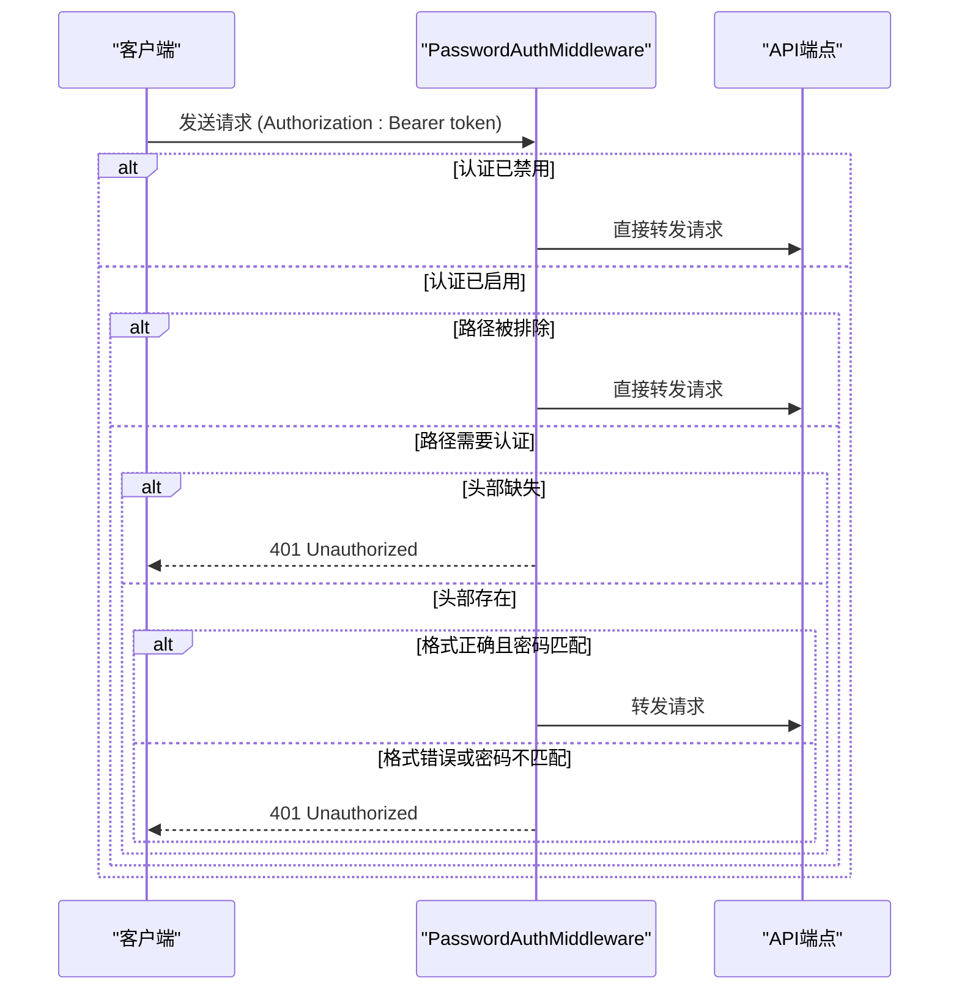
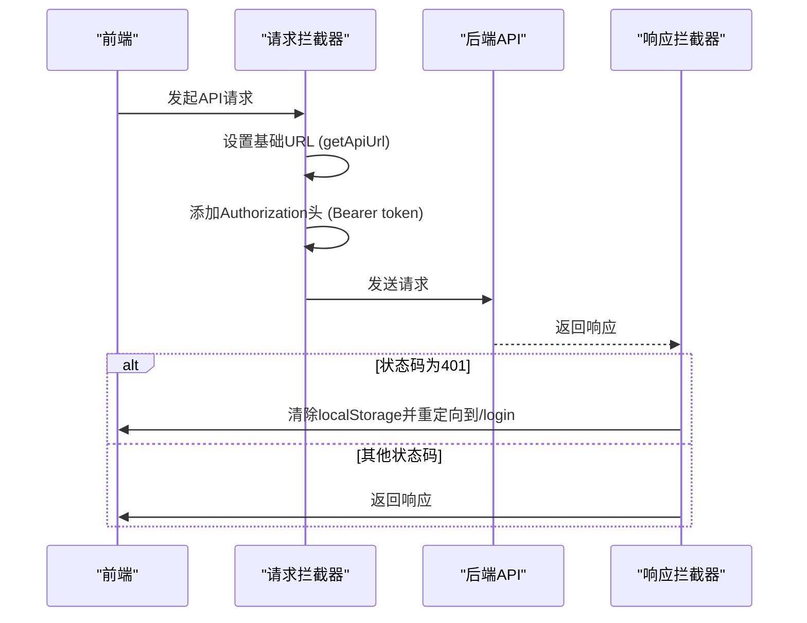

# API参考

<cite>
**本文档中引用的文件**   
- [main.py](file://api/main.py)
- [models.py](file://api/models.py)
- [auth.py](file://api/auth.py)
- [notebooks.py](file://api/routers/notebooks.py)
- [search.py](file://api/routers/search.py)
- [models.py](file://api/routers/models.py)
- [sources.py](file://api/routers/sources.py)
- [notes.py](file://api/routers/notes.py)
- [insights.py](file://api/routers/insights.py)
- [transformations.py](file://api/routers/transformations.py)
- [chat.py](file://api/routers/chat.py)
- [client.ts](file://frontend/src/lib/api/client.ts)
</cite>

## 目录
1. [简介](#简介)
2. [认证机制](#认证机制)
3. [数据模型](#数据模型)
4. [API端点](#api端点)
   1. [笔记本](#笔记本)
   2. [搜索与问答](#搜索与问答)
   3. [模型](#模型)
   4. [内容源](#内容源)
   5. [笔记](#笔记)
   6. [洞察](#洞察)
   7. [转换](#转换)
   8. [聊天](#聊天)
5. [前端API客户端](#前端api客户端)
6. [错误处理](#错误处理)

## 简介

open-notebook后端API是一个基于FastAPI构建的RESTful API，为研究助手应用提供核心功能。API通过`api/main.py`文件中的FastAPI应用实例化，并通过包含多个路由器来组织不同功能模块的端点。API在启动时会自动运行数据库迁移，并通过CORS中间件支持跨域请求。

API的根路径为`/api`，所有端点均以此为前缀。API提供了健康检查端点`/health`和根端点`/`，分别用于监控服务状态和返回基本消息。API的认证机制基于JWT令牌，通过`PasswordAuthMiddleware`中间件实现，该中间件检查请求头中的Bearer令牌是否与环境变量`OPEN_NOTEBOOK_PASSWORD`匹配。

**Section sources**
- [main.py](file://api/main.py#L79-L129)

## 认证机制

open-notebook API使用基于密码的认证机制，该机制由`api/auth.py`文件中的`PasswordAuthMiddleware`类实现。认证是可选的，只有当环境变量`OPEN_NOTEBOOK_PASSWORD`被设置时才会激活。

认证通过HTTP Authorization头中的Bearer令牌进行。客户端必须在每个请求的`Authorization`头中包含`Bearer <password>`，其中`<password>`是环境变量中配置的密码。如果请求头缺失、格式不正确或密码不匹配，API将返回401 Unauthorized状态码。

某些端点被排除在认证之外，包括根路径`/`、健康检查`/health`、文档路径`/docs`、`/openapi.json`、`/redoc`以及认证状态端点`/api/auth/status`。这些端点允许匿名访问，以便客户端可以检查认证是否启用。



**Diagram sources**
- [auth.py](file://api/auth.py#L10-L66)
- [main.py](file://api/main.py#L86-L88)

## 数据模型

API使用Pydantic模型来定义请求和响应的数据结构。这些模型位于`api/models.py`文件中，确保了数据的类型安全和验证。

### 笔记本模型
- `NotebookCreate`: 创建笔记本的请求模型，包含`name`（必填）和`description`（可选）字段。
- `NotebookUpdate`: 更新笔记本的请求模型，所有字段均为可选。
- `NotebookResponse`: 获取笔记本的响应模型，包含ID、名称、描述、归档状态、创建/更新时间戳以及关联的源和笔记数量。

### 搜索与问答模型
- `SearchRequest`: 搜索请求模型，包含查询字符串、搜索类型（文本或向量）、结果限制、是否搜索源/笔记以及向量搜索的最低分数。
- `SearchResponse`: 搜索响应模型，包含结果列表、总数量和搜索类型。
- `AskRequest`: 问答请求模型，包含问题和用于策略、回答和最终答案的模型ID。
- `AskResponse`: 问答响应模型，包含最终答案和原始问题。

### 模型管理模型
- `ModelCreate`: 创建模型的请求模型，包含名称、提供商和类型（语言、嵌入、文本转语音、语音转文本）。
- `ModelResponse`: 模型响应模型，包含ID、名称、提供商、类型和时间戳。
- `DefaultModelsResponse`: 默认模型配置响应，包含各种用途的默认模型ID。
- `ProviderAvailabilityResponse`: 提供商可用性响应，列出可用和不可用的提供商及其支持的模型类型。

### 内容源模型
- `SourceCreate`: 创建源的请求模型，支持链接、上传和文本类型，包含多笔记本关联、转换、嵌入等选项。
- `SourceUpdate`: 更新源的请求模型，包含标题和主题。
- `SourceResponse`: 源的详细响应模型，包含资产信息、全文、嵌入状态、创建/更新时间以及异步处理状态。
- `SourceListResponse`: 源的列表响应模型，用于列表视图，包含嵌入状态、洞察数量和处理状态。

### 笔记模型
- `NoteCreate`: 创建笔记的请求模型，包含标题、内容、类型（human/ai）和可选的笔记本ID。
- `NoteUpdate`: 更新笔记的请求模型，所有字段可选。
- `NoteResponse`: 笔记响应模型，包含ID、标题、内容、类型和时间戳。

### 洞察模型
- `SourceInsightResponse`: 源洞察响应模型，包含ID、源ID、洞察类型、内容和时间戳。
- `SaveAsNoteRequest`: 将洞察保存为笔记的请求模型，包含可选的笔记本ID。

### 转换模型
- `TransformationCreate`: 创建转换的请求模型，包含名称、标题、描述、提示和是否默认应用。
- `TransformationUpdate`: 更新转换的请求模型，所有字段可选。
- `TransformationResponse`: 转换响应模型，包含所有字段和时间戳。
- `TransformationExecuteRequest`: 执行转换的请求模型，包含转换ID、输入文本和模型ID。
- `TransformationExecuteResponse`: 执行转换的响应模型，包含输出、转换ID和模型ID。

### 聊天模型
- `CreateSessionRequest`: 创建聊天会话的请求模型，包含笔记本ID、可选标题和模型覆盖。
- `UpdateSessionRequest`: 更新会话的请求模型，包含可选标题和模型覆盖。
- `ChatMessage`: 聊天消息模型，包含ID、类型（human/ai）、内容和时间戳。
- `ChatSessionResponse`: 聊天会话响应模型，包含ID、标题、笔记本ID、时间戳和消息计数。
- `ChatSessionWithMessagesResponse`: 包含消息的会话响应模型。
- `ExecuteChatRequest`: 执行聊天的请求模型，包含会话ID、消息、上下文和模型覆盖。
- `ExecuteChatResponse`: 执行聊天的响应模型，包含会话ID和更新后的消息列表。
- `BuildContextRequest`: 构建上下文的请求模型，包含笔记本ID和上下文配置。
- `BuildContextResponse`: 构建上下文的响应模型，包含上下文数据、令牌计数和字符计数。

**Section sources**
- [models.py](file://api/models.py#L1-L425)

## API端点

### 笔记本

笔记本API端点用于管理笔记本的创建、读取、更新和删除（CRUD）操作，以及管理笔记本与内容源的关联。

#### 获取所有笔记本
- **HTTP方法**: `GET`
- **URL路径**: `/api/notebooks`
- **请求参数**:
  - `archived` (可选): 布尔值，用于按归档状态过滤。
  - `order_by` (可选): 字符串，指定排序字段和方向，默认为`updated desc`。
- **响应格式**: `List[NotebookResponse]`
- **状态码**:
  - `200`: 成功，返回笔记本列表。
  - `500`: 服务器错误。

#### 创建笔记本
- **HTTP方法**: `POST`
- **URL路径**: `/api/notebooks`
- **请求体**: `NotebookCreate` 模型
- **响应格式**: `NotebookResponse`
- **状态码**:
  - `200`: 成功，返回新创建的笔记本。
  - `400`: 输入无效。
  - `500`: 服务器错误。

#### 获取单个笔记本
- **HTTP方法**: `GET`
- **URL路径**: `/api/notebooks/{notebook_id}`
- **路径参数**: `notebook_id` (字符串)
- **响应格式**: `NotebookResponse`
- **状态码**:
  - `200`: 成功，返回笔记本。
  - `404`: 笔记本未找到。
  - `500`: 服务器错误。

#### 更新笔记本
- **HTTP方法**: `PUT`
- **URL路径**: `/api/notebooks/{notebook_id}`
- **路径参数**: `notebook_id` (字符串)
- **请求体**: `NotebookUpdate` 模型
- **响应格式**: `NotebookResponse`
- **状态码**:
  - `200`: 成功，返回更新后的笔记本。
  - `404`: 笔记本未找到。
  - `400`: 输入无效。
  - `500`: 服务器错误。

#### 将源添加到笔记本
- **HTTP方法**: `POST`
- **URL路径**: `/api/notebooks/{notebook_id}/sources/{source_id}`
- **路径参数**: `notebook_id`, `source_id` (字符串)
- **响应格式**: `{ "message": string }`
- **状态码**:
  - `200`: 成功，源已链接。
  - `404`: 笔记本或源未找到。
  - `500`: 服务器错误。

#### 从笔记本移除源
- **HTTP方法**: `DELETE`
- **URL路径**: `/api/notebooks/{notebook_id}/sources/{source_id}`
- **路径参数**: `notebook_id`, `source_id` (字符串)
- **响应格式**: `{ "message": string }`
- **状态码**:
  - `200`: 成功，源已移除。
  - `404`: 笔记本未找到。
  - `500`: 服务器错误。

#### 删除笔记本
- **HTTP方法**: `DELETE`
- **URL路径**: `/api/notebooks/{notebook_id}`
- **路径参数**: `notebook_id` (字符串)
- **响应格式**: `{ "message": string }`
- **状态码**:
  - `200`: 成功，笔记本已删除。
  - `404`: 笔记本未找到。
  - `500`: 服务器错误。

**Section sources**
- [notebooks.py](file://api/routers/notebooks.py#L14-L276)

### 搜索与问答

搜索API端点提供文本搜索、向量搜索和基于AI的问答功能。

#### 搜索知识库
- **HTTP方法**: `POST`
- **URL路径**: `/api/search`
- **请求体**: `SearchRequest` 模型
- **响应格式**: `SearchResponse` 模型
- **状态码**:
  - `200`: 成功，返回搜索结果。
  - `400`: 输入无效或向量搜索缺少嵌入模型。
  - `500`: 服务器错误。

#### 问答（流式）
- **HTTP方法**: `POST`
- **URL路径**: `/api/search/ask`
- **请求体**: `AskRequest` 模型
- **响应格式**: `text/plain` (Server-Sent Events流)
- **状态码**:
  - `200`: 成功，开始流式传输响应。
  - `400`: 模型未找到或缺少嵌入模型。
  - `500`: 服务器错误。

#### 问答（简单）
- **HTTP方法**: `POST`
- **URL路径**: `/api/search/ask/simple`
- **请求体**: `AskRequest` 模型
- **响应格式**: `AskResponse` 模型
- **状态码**:
  - `200`: 成功，返回最终答案。
  - `400`: 模型未找到或缺少嵌入模型。
  - `500`: 服务器错误。

**Section sources**
- [search.py](file://api/routers/search.py#L17-L215)

### 模型

模型API端点用于管理AI模型的配置和默认设置。

#### 获取所有模型
- **HTTP方法**: `GET`
- **URL路径**: `/api/models`
- **请求参数**:
  - `type` (可选): 字符串，用于按模型类型过滤。
- **响应格式**: `List[ModelResponse]`
- **状态码**:
  - `200`: 成功，返回模型列表。
  - `500`: 服务器错误。

#### 创建模型
- **HTTP方法**: `POST`
- **URL路径**: `/api/models`
- **请求体**: `ModelCreate` 模型
- **响应格式**: `ModelResponse`
- **状态码**:
  - `200`: 成功，返回新创建的模型。
  - `400`: 类型无效或模型已存在。
  - `500`: 服务器错误。

#### 删除模型
- **HTTP方法**: `DELETE`
- **URL路径**: `/api/models/{model_id}`
- **路径参数**: `model_id` (字符串)
- **响应格式**: `{ "message": string }`
- **状态码**:
  - `200`: 成功，模型已删除。
  - `404`: 模型未找到。
  - `500`: 服务器错误。

#### 获取默认模型
- **HTTP方法**: `GET`
- **URL路径**: `/api/models/defaults`
- **响应格式**: `DefaultModelsResponse`
- **状态码**:
  - `200`: 成功，返回默认模型配置。
  - `500`: 服务器错误。

#### 更新默认模型
- **HTTP方法**: `PUT`
- **URL路径**: `/api/models/defaults`
- **请求体**: `DefaultModelsResponse` 模型
- **响应格式**: `DefaultModelsResponse`
- **状态码**:
  - `200`: 成功，返回更新后的默认模型配置。
  - `500`: 服务器错误。

#### 获取提供商可用性
- **HTTP方法**: `GET`
- **URL路径**: `/api/models/providers`
- **响应格式**: `ProviderAvailabilityResponse`
- **状态码**:
  - `200`: 成功，返回提供商可用性信息。
  - `500`: 服务器错误。

**Section sources**
- [models.py](file://api/routers/models.py#L62-L300)

### 内容源

内容源API端点用于管理链接、上传文件和文本内容源的创建、读取和更新。

#### 获取所有源
- **HTTP方法**: `GET`
- **URL路径**: `/api/sources`
- **请求参数**:
  - `notebook_id` (可选): 字符串，用于按笔记本ID过滤。
  - `limit` (可选): 整数，限制返回数量，默认50。
  - `offset` (可选): 整数，跳过数量，用于分页。
  - `sort_by` (可选): 字符串，排序字段（created或updated）。
  - `sort_order` (可选): 字符串，排序顺序（asc或desc）。
- **响应格式**: `List[SourceListResponse]`
- **状态码**:
  - `200`: 成功，返回源列表。
  - `400`: 排序参数无效。
  - `404`: 笔记本未找到（如果指定了notebook_id）。
  - `500`: 服务器错误。

#### 创建源
- **HTTP方法**: `POST`
- **URL路径**: `/api/sources`
- **请求体**: `multipart/form-data` (表单数据) 或 `application/json`
- **表单字段**:
  - `type` (必填): 字符串，源类型（link, upload, text）。
  - `notebook_id` (可选): 字符串，旧版单笔记本ID（已弃用）。
  - `notebooks` (可选): JSON字符串，笔记本ID列表。
  - `url` (可选): 字符串，链接类型的URL。
  - `content` (可选): 字符串，文本类型的内容。
  - `title` (可选): 字符串，源标题。
  - `transformations` (可选): JSON字符串，转换ID列表。
  - `embed` (可选): 字符串布尔值，是否嵌入内容。
  - `delete_source` (可选): 字符串布尔值，处理后是否删除源文件。
  - `async_processing` (可选): 字符串布尔值，是否异步处理。
  - `file` (可选): 文件，上传类型的文件。
- **响应格式**: `SourceResponse`
- **状态码**:
  - `200`: 成功，返回新创建的源。
  - `400`: 输入无效（如缺少必要字段）。
  - `404`: 笔记本未找到。
  - `500`: 服务器错误。

#### 获取单个源
- **HTTP方法**: `GET`
- **URL路径**: `/api/sources/{source_id}`
- **路径参数**: `source_id` (字符串)
- **响应格式**: `SourceResponse`
- **状态码**:
  - `200`: 成功，返回源详情。
  - `404`: 源未找到。
  - `500`: 服务器错误。

#### 下载源文件
- **HTTP方法**: `GET`
- **URL路径**: `/api/sources/{source_id}/download`
- **路径参数**: `source_id` (字符串)
- **响应格式**: 文件流
- **状态码**:
  - `200`: 成功，开始下载文件。
  - `404`: 源或文件未找到。
  - `403`: 访问被拒绝（文件路径不安全）。
  - `500`: 服务器错误。

#### 获取源状态
- **HTTP方法**: `GET`
- **URL路径**: `/api/sources/{source_id}/status`
- **路径参数**: `source_id` (字符串)
- **响应格式**: `SourceStatusResponse`
- **状态码**:
  - `200`: 成功，返回处理状态。
  - `404`: 源未找到。
  - `500`: 服务器错误。

#### 更新源
- **HTTP方法**: `PUT`
- **URL路径**: `/api/sources/{source_id}`
- **路径参数**: `source_id` (字符串)
- **请求体**: `SourceUpdate` 模型
- **响应格式**: `SourceResponse`
- **状态码**:
  - `200`: 成功，返回更新后的源。
  - `404`: 源未找到。
  - `500`: 服务器错误。

**Section sources**
- [sources.py](file://api/routers/sources.py#L152-L800)

### 笔记

笔记API端点用于管理笔记的CRUD操作。

#### 获取所有笔记
- **HTTP方法**: `GET`
- **URL路径**: `/api/notes`
- **请求参数**:
  - `notebook_id` (可选): 字符串，用于按笔记本ID过滤。
- **响应格式**: `List[NoteResponse]`
- **状态码**:
  - `200`: 成功，返回笔记列表。
  - `404`: 笔记本未找到（如果指定了notebook_id）。
  - `500`: 服务器错误。

#### 创建笔记
- **HTTP方法**: `POST`
- **URL路径**: `/api/notes`
- **请求体**: `NoteCreate` 模型
- **响应格式**: `NoteResponse`
- **状态码**:
  - `200`: 成功，返回新创建的笔记。
  - `400`: 输入无效（如note_type无效）。
  - `404`: 笔记本未找到（如果指定了notebook_id）。
  - `500`: 服务器错误。

#### 获取单个笔记
- **HTTP方法**: `GET`
- **URL路径**: `/api/notes/{note_id}`
- **路径参数**: `note_id` (字符串)
- **响应格式**: `NoteResponse`
- **状态码**:
  - `200`: 成功，返回笔记。
  - `404`: 笔记未找到。
  - `500`: 服务器错误。

#### 更新笔记
- **HTTP方法**: `PUT`
- **URL路径**: `/api/notes/{note_id}`
- **路径参数**: `note_id` (字符串)
- **请求体**: `NoteUpdate` 模型
- **响应格式**: `NoteResponse`
- **状态码**:
  - `200`: 成功，返回更新后的笔记。
  - `404`: 笔记未找到。
  - `400`: 输入无效（如note_type无效）。
  - `500`: 服务器错误。

#### 删除笔记
- **HTTP方法**: `DELETE`
- **URL路径**: `/api/notes/{note_id}`
- **路径参数**: `note_id` (字符串)
- **响应格式**: `{ "message": string }`
- **状态码**:
  - `200`: 成功，笔记已删除。
  - `404`: 笔记未找到。
  - `500`: 服务器错误。

**Section sources**
- [notes.py](file://api/routers/notes.py#L13-L180)

### 洞察

洞察API端点用于管理从内容源生成的洞察。

#### 获取洞察
- **HTTP方法**: `GET`
- **URL路径**: `/api/insights/{insight_id}`
- **路径参数**: `insight_id` (字符串)
- **响应格式**: `SourceInsightResponse`
- **状态码**:
  - `200`: 成功，返回洞察。
  - `404`: 洞察未找到。
  - `500`: 服务器错误。

#### 删除洞察
- **HTTP方法**: `DELETE`
- **URL路径**: `/api/insights/{insight_id}`
- **路径参数**: `insight_id` (字符串)
- **响应格式**: `{ "message": string }`
- **状态码**:
  - `200`: 成功，洞察已删除。
  - `404`: 洞察未找到。
  - `500`: 服务器错误。

#### 将洞察保存为笔记
- **HTTP方法**: `POST`
- **URL路径**: `/api/insights/{insight_id}/save-as-note`
- **路径参数**: `insight_id` (字符串)
- **请求体**: `SaveAsNoteRequest` 模型
- **响应格式**: `NoteResponse`
- **状态码**:
  - `200`: 成功，返回新创建的笔记。
  - `404`: 洞察未找到。
  - `400`: 输入无效。
  - `500`: 服务器错误。

**Section sources**
- [insights.py](file://api/routers/insights.py#L12-L81)

### 转换

转换API端点用于管理文本转换模板和执行转换。

#### 获取所有转换
- **HTTP方法**: `GET`
- **URL路径**: `/api/transformations`
- **响应格式**: `List[TransformationResponse]`
- **状态码**:
  - `200`: 成功，返回转换列表。
  - `500`: 服务器错误。

#### 创建转换
- **HTTP方法**: `POST`
- **URL路径**: `/api/transformations`
- **请求体**: `TransformationCreate` 模型
- **响应格式**: `TransformationResponse`
- **状态码**:
  - `200`: 成功，返回新创建的转换。
  - `400`: 输入无效。
  - `500`: 服务器错误。

#### 执行转换
- **HTTP方法**: `POST`
- **URL路径**: `/api/transformations/execute`
- **请求体**: `TransformationExecuteRequest` 模型
- **响应格式**: `TransformationExecuteResponse`
- **状态码**:
  - `200`: 成功，返回转换结果。
  - `404`: 转换或模型未找到。
  - `500`: 服务器错误。

#### 获取默认提示
- **HTTP方法**: `GET`
- **URL路径**: `/api/transformations/default-prompt`
- **响应格式**: `DefaultPromptResponse`
- **状态码**:
  - `200`: 成功，返回默认提示。
  - `500`: 服务器错误。

#### 更新默认提示
- **HTTP方法**: `PUT`
- **URL路径**: `/api/transformations/default-prompt`
- **请求体**: `DefaultPromptUpdate` 模型
- **响应格式**: `DefaultPromptResponse`
- **状态码**:
  - `200`: 成功，返回更新后的默认提示。
  - `500`: 服务器错误。

#### 获取单个转换
- **HTTP方法**: `GET`
- **URL路径**: `/api/transformations/{transformation_id}`
- **路径参数**: `transformation_id` (字符串)
- **响应格式**: `TransformationResponse`
- **状态码**:
  - `200`: 成功，返回转换。
  - `404`: 转换未找到。
  - `500`: 服务器错误。

#### 更新转换
- **HTTP方法**: `PUT`
- **URL路径**: `/api/transformations/{transformation_id}`
- **路径参数**: `transformation_id` (字符串)
- **请求体**: `TransformationUpdate` 模型
- **响应格式**: `TransformationResponse`
- **状态码**:
  - `200`: 成功，返回更新后的转换。
  - `404`: 转换未找到。
  - `400`: 输入无效。
  - `500`: 服务器错误。

#### 删除转换
- **HTTP方法**: `DELETE`
- **URL路径**: `/api/transformations/{transformation_id}`
- **路径参数**: `transformation_id` (字符串)
- **响应格式**: `{ "message": string }`
- **状态码**:
  - `200`: 成功，转换已删除。
  - `404`: 转换未找到。
  - `500`: 服务器错误。

**Section sources**
- [transformations.py](file://api/routers/transformations.py#L23-L248)

### 聊天

聊天API端点用于管理聊天会话、执行聊天和构建上下文。

#### 获取会话
- **HTTP方法**: `GET`
- **URL路径**: `/api/chat/sessions`
- **请求参数**: `notebook_id` (必填): 字符串，笔记本ID。
- **响应格式**: `List[ChatSessionResponse]`
- **状态码**:
  - `200`: 成功，返回会话列表。
  - `404`: 笔记本未找到。
  - `500`: 服务器错误。

#### 创建会话
- **HTTP方法**: `POST`
- **URL路径**: `/api/chat/sessions`
- **请求体**: `CreateSessionRequest` 模型
- **响应格式**: `ChatSessionResponse`
- **状态码**:
  - `200`: 成功，返回新创建的会话。
  - `404`: 笔记本未找到。
  - `500`: 服务器错误。

#### 获取单个会话
- **HTTP方法**: `GET`
- **URL路径**: `/api/chat/sessions/{session_id}`
- **路径参数**: `session_id` (字符串)
- **响应格式**: `ChatSessionWithMessagesResponse`
- **状态码**:
  - `200`: 成功，返回会话及消息。
  - `404`: 会话未找到。
  - `500`: 服务器错误。

#### 更新会话
- **HTTP方法**: `PUT`
- **URL路径**: `/api/chat/sessions/{session_id}`
- **路径参数**: `session_id` (字符串)
- **请求体**: `UpdateSessionRequest` 模型
- **响应格式**: `ChatSessionResponse`
- **状态码**:
  - `200`: 成功，返回更新后的会话。
  - `404`: 会话未找到。
  - `500`: 服务器错误。

#### 删除会话
- **HTTP方法**: `DELETE`
- **URL路径**: `/api/chat/sessions/{session_id}`
- **路径参数**: `session_id` (字符串)
- **响应格式**: `SuccessResponse`
- **状态码**:
  - `200`: 成功，会话已删除。
  - `404`: 会话未找到。
  - `500`: 服务器错误。

#### 执行聊天
- **HTTP方法**: `POST`
- **URL路径**: `/api/chat/execute`
- **请求体**: `ExecuteChatRequest` 模型
- **响应格式**: `ExecuteChatResponse`
- **状态码**:
  - `200`: 成功，返回更新后的消息列表。
  - `404`: 会话未找到。
  - `500`: 服务器错误。

#### 构建上下文
- **HTTP方法**: `POST`
- **URL路径**: `/api/chat/context`
- **请求体**: `BuildContextRequest` 模型
- **响应格式**: `BuildContextResponse`
- **状态码**:
  - `200`: 成功，返回构建的上下文。
  - `404`: 笔记本未找到。
  - `500`: 服务器错误。

**Section sources**
- [chat.py](file://api/routers/chat.py#L93-L494)

## 前端API客户端

前端API客户端位于`frontend/src/lib/api/client.ts`，使用Axios库与后端API进行交互。客户端配置了请求和响应拦截器，以处理身份验证和错误。

### 请求拦截器
请求拦截器负责：
1. 动态设置API基础URL，通过`getApiUrl()`函数从运行时配置获取。
2. 从`localStorage`中读取JWT令牌，并将其添加到`Authorization`头中，格式为`Bearer <token>`。
3. 根据请求数据类型设置`Content-Type`头，对于`FormData`会删除该头以允许浏览器设置边界。

### 响应拦截器
响应拦截器负责错误处理：
- 当收到401 Unauthorized响应时，清除本地存储中的认证信息，并将用户重定向到登录页面。

### 超时设置
客户端的超时时间设置为5分钟（300000毫秒），以适应较慢的LLM操作（如转换、洞察生成），特别是在较慢的硬件上（如Ollama、LM Studio）。



**Diagram sources**
- [client.ts](file://frontend/src/lib/api/client.ts#L1-L66)

## 错误处理

API使用标准的HTTP状态码进行错误处理，并在响应体中返回详细的错误信息。

### 常见状态码
- `200 OK`: 请求成功。
- `400 Bad Request`: 客户端请求有误，如输入验证失败。
- `401 Unauthorized`: 认证失败，缺少或无效的JWT令牌。
- `404 Not Found`: 请求的资源未找到。
- `500 Internal Server Error`: 服务器内部错误。

### 错误响应格式
当发生错误时，API会返回一个包含`error`和`message`字段的JSON对象。例如：
```json
{
  "error": "InvalidInputError",
  "message": "Model type must be one of: language, embedding, text_to_speech, speech_to_text"
}
```

前端客户端通过响应拦截器处理401错误，自动清除认证状态并重定向用户到登录页面，确保了用户体验的一致性。

**Section sources**
- [auth.py](file://api/auth.py#L37-L62)
- [models.py](file://api/models.py#L422-L425)
- [client.ts](file://frontend/src/lib/api/client.ts#L51-L63)