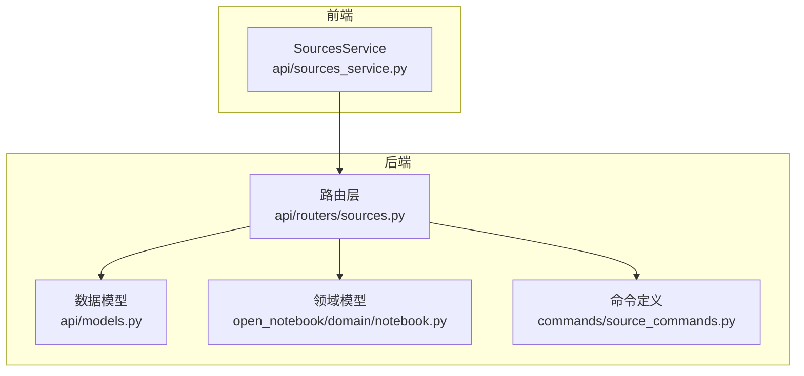
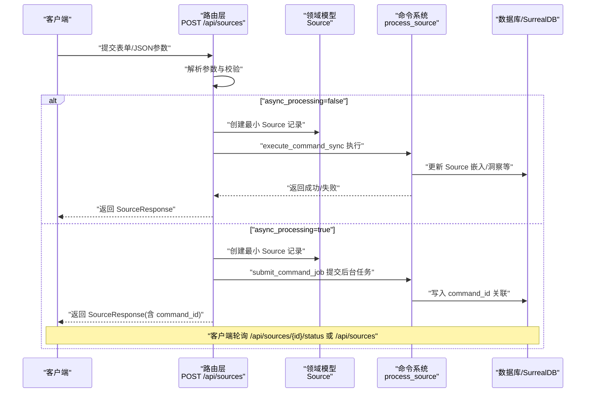
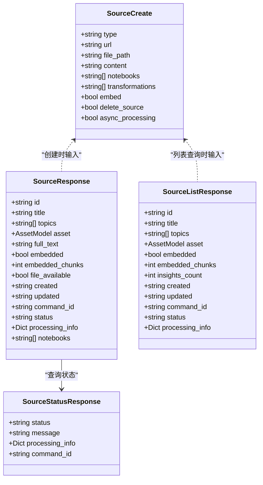

# 内容源API

<cite>
**本文引用的文件**
- [api/routers/sources.py](file://api/routers/sources.py)
- [api/models.py](file://api/models.py)
- [api/sources_service.py](file://api/sources_service.py)
- [open_notebook/domain/notebook.py](file://open_notebook/domain/notebook.py)
- [commands/source_commands.py](file://commands/source_commands.py)
- [docs/user-guide/sources.md](file://docs/user-guide/sources.md)
</cite>

## 目录
1. [简介](#简介)
2. [项目结构](#项目结构)
3. [核心组件](#核心组件)
4. [架构总览](#架构总览)
5. [详细组件分析](#详细组件分析)
6. [依赖关系分析](#依赖关系分析)
7. [性能考量](#性能考量)
8. [故障排查指南](#故障排查指南)
9. [结论](#结论)
10. [附录：请求示例与最佳实践](#附录请求示例与最佳实践)

## 简介
本文件面向内容源管理API，围绕“添加链接、上传文件、纯文本内容源”的端点（POST /api/sources）进行系统化说明，覆盖以下关键主题：
- 参数使用：type、url、file_path、content、notebooks、transformations、embed、delete_source、async_processing 等
- 向后兼容：notebook_id 与 notebooks 的关系及转换逻辑
- 异步处理：async_processing 标志与 command_id 返回值的用途
- 列表与详情：GET /api/sources 与 GET /api/sources/{id} 的响应结构，重点解释 SourceListResponse 中 embedded、embedded_chunks、insights_count 字段
- 完整请求示例：如何创建不同类型的内容源并监控其处理状态

## 项目结构
内容源API位于后端路由层，结合领域模型与命令执行框架，形成“路由—服务—命令—图/工作流”的分层架构。前端通过统一的SourcesService封装调用，支持同步与异步两种处理路径，并在UI中轮询状态以实现可视化进度反馈。

图表来源
- [api/routers/sources.py](file://api/routers/sources.py#L152-L784)
- [api/models.py](file://api/models.py#L271-L425)
- [open_notebook/domain/notebook.py](file://open_notebook/domain/notebook.py#L144-L215)
- [commands/source_commands.py](file://commands/source_commands.py#L30-L153)

章节来源
- [api/routers/sources.py](file://api/routers/sources.py#L152-L784)
- [api/models.py](file://api/models.py#L271-L425)
- [open_notebook/domain/notebook.py](file://open_notebook/domain/notebook.py#L144-L215)
- [commands/source_commands.py](file://commands/source_commands.py#L30-L153)

## 核心组件
- 路由与控制器：负责解析表单/JSON参数、校验输入、选择同步或异步处理路径、返回统一响应模型
- 数据模型：定义 SourceCreate、SourceResponse、SourceListResponse、SourceStatusResponse 等
- 领域模型：Source、Notebook、SourceEmbedding、SourceInsight 等，提供状态查询、嵌入计数、关联查询等能力
- 命令系统：定义 process_source 命令，承载实际的处理流程（加载转换器、执行图/工作流、更新嵌入与洞察）

章节来源
- [api/routers/sources.py](file://api/routers/sources.py#L319-L784)
- [api/models.py](file://api/models.py#L271-L425)
- [open_notebook/domain/notebook.py](file://open_notebook/domain/notebook.py#L144-L215)
- [commands/source_commands.py](file://commands/source_commands.py#L30-L153)

## 架构总览
POST /api/sources 的处理流程分为同步与异步两条路径：
- 同步路径：直接调用命令执行器，等待结果后返回完整 SourceResponse
- 异步路径：先创建最小化 Source 记录，立即提交命令任务，返回包含 command_id 的 SourceResponse；后续通过 GET /api/sources/{id}/status 或批量 GET /api/sources 查询状态

图表来源
- [api/routers/sources.py](file://api/routers/sources.py#L319-L551)
- [commands/source_commands.py](file://commands/source_commands.py#L47-L153)
- [open_notebook/domain/notebook.py](file://open_notebook/domain/notebook.py#L175-L215)

## 详细组件分析

### POST /api/sources（创建内容源）
- 支持的参数
  - type：内容类型，取值为 link、upload、text
  - url：当 type=link 时必填
  - file_path：当 type=upload 时可选（与上传文件二选一）
  - content：当 type=text 时必填
  - notebooks：新多笔记本支持（推荐），为字符串形式的JSON数组，包含目标笔记本ID列表
  - notebook_id：旧版单笔记本字段（向后兼容），若提供则自动转换为 notebooks 数组
  - transformations：字符串形式的JSON数组，包含要应用的转换器ID列表
  - embed：是否对内容进行嵌入（向量搜索）
  - delete_source：是否在处理完成后删除服务器上的原始文件
  - async_processing：是否异步处理
- 表单解析与校验
  - 将字符串布尔值转换为布尔
  - 解析 JSON 字符串为数组（notebooks、transformations）
  - 校验 type 与对应参数的组合合法性
  - 校验指定的 notebooks 与 transformations 是否存在
- 处理分支
  - 同步：使用 execute_command_sync 执行，返回完整 SourceResponse
  - 异步：提交命令任务，立即返回 SourceResponse 并附带 command_id；随后可在详情页或列表页轮询状态

章节来源
- [api/routers/sources.py](file://api/routers/sources.py#L86-L149)
- [api/routers/sources.py](file://api/routers/sources.py#L319-L551)
- [api/models.py](file://api/models.py#L276-L321)

### GET /api/sources（获取源列表）
- 查询参数
  - notebook_id：按笔记本过滤
  - limit/offset：分页
  - sort_by：排序字段（created 或 updated）
  - sort_order：排序方向（asc 或 desc）
- 响应模型 SourceListResponse
  - embedded：布尔，表示该源是否存在嵌入
  - embedded_chunks：整数，表示嵌入的片段数量
  - insights_count：整数，表示该源生成的洞察数量
  - command_id/status/processing_info：异步处理状态信息（若存在命令）
- 批量状态拉取
  - 路由层会从查询结果中提取所有 command_id，批量并发拉取命令状态，避免阻塞

章节来源
- [api/routers/sources.py](file://api/routers/sources.py#L152-L311)
- [api/models.py](file://api/models.py#L347-L362)

### GET /api/sources/{id}（获取单个源详情）
- 返回字段
  - 与 SourceResponse 类似，额外包含 file_available 字段（指示原始文件是否可下载）
  - notebooks 字段：返回该源关联的所有笔记本ID
  - status/processing_info/command_id：若存在命令，返回当前处理状态与进度信息
- 文件可用性检查
  - 仅允许下载位于上传目录内的文件，防止越权访问

章节来源
- [api/routers/sources.py](file://api/routers/sources.py#L636-L692)
- [open_notebook/domain/notebook.py](file://open_notebook/domain/notebook.py#L175-L215)

### GET /api/sources/{id}/status（获取处理状态）
- 若源无 command（历史遗留），返回 message 指示已完成但未记录命令
- 若有 command，返回状态（queued/running/completed/failed/unknown）、消息与处理进度（包含开始/结束时间、错误信息等）

章节来源
- [api/routers/sources.py](file://api/routers/sources.py#L724-L784)
- [open_notebook/domain/notebook.py](file://open_notebook/domain/notebook.py#L175-L215)

### 命令与处理流程
- 命令定义
  - 命令名：process_source
  - 输入：SourceProcessingInput（包含 source_id、content_state、notebook_ids、transformations、embed）
  - 输出：SourceProcessingOutput（包含 success、source_id、embedded_chunks、insights_created、processing_time 等）
- 执行流程
  - 加载转换器对象
  - 更新 Source 的 command 字段
  - 执行 source_graph 工作流（应用转换、嵌入、洞察生成等）
  - 返回处理结果

章节来源
- [commands/source_commands.py](file://commands/source_commands.py#L30-L153)
- [api/routers/sources.py](file://api/routers/sources.py#L405-L551)

### 向后兼容：notebook_id 与 notebooks 的关系
- SourceCreate 在模型层做了字段互斥与转换：
  - 若同时提供 notebook_id 与 notebooks，会抛出错误
  - 若仅提供 notebook_id，则自动转换为 notebooks 数组，保持响应中的 notebook_id 兼容旧客户端
  - 若未提供 notebooks，则默认为空数组
- 路由层在创建时会对 notebooks 列表中的每个 ID 进行存在性校验

章节来源
- [api/models.py](file://api/models.py#L303-L321)
- [api/routers/sources.py](file://api/routers/sources.py#L329-L336)

### 异步处理标志 async_processing 与 command_id
- async_processing=true
  - 路由层提交命令任务，立即返回 SourceResponse，并附带 command_id
  - 前端可通过 /api/sources/{id}/status 或 /api/sources 批量查询状态
- async_processing=false
  - 路由层直接同步执行命令，返回完整 SourceResponse（不包含 command_id/status）
- command_id
  - 用于轮询命令状态，追踪处理进度与错误信息
  - 列表页与详情页均会展示 command_id 与状态，便于用户感知处理生命周期

章节来源
- [api/routers/sources.py](file://api/routers/sources.py#L389-L551)
- [api/routers/sources.py](file://api/routers/sources.py#L724-L784)
- [open_notebook/domain/notebook.py](file://open_notebook/domain/notebook.py#L175-L215)

### 响应模型详解
- SourceCreate
  - type、url、file_path、content、notebooks、transformations、embed、delete_source、async_processing
- SourceResponse
  - id、title、topics、asset、full_text、embedded、embedded_chunks、file_available、created、updated
  - 新增字段：command_id、status、processing_info、notebooks
- SourceListResponse
  - id、title、topics、asset、embedded、embedded_chunks、insights_count、created、updated
  - 新增字段：command_id、status、processing_info
- SourceStatusResponse
  - status、message、processing_info、command_id

章节来源
- [api/models.py](file://api/models.py#L276-L425)

## 依赖关系分析
- 路由层依赖数据模型与领域模型，负责参数解析、校验与状态回传
- 命令层负责实际处理，通过 source_graph 执行转换、嵌入与洞察生成
- 前端通过 SourcesService 统一封装，支持同步/异步两种模式，并在UI中轮询状态

图表来源
- [api/models.py](file://api/models.py#L276-L425)

章节来源
- [api/models.py](file://api/models.py#L276-L425)

## 性能考量
- 异步处理优先：大文件或复杂转换建议开启 async_processing，避免阻塞HTTP连接
- 批量状态查询：列表页对多个 command_id 进行并发限流拉取，减少延迟
- 嵌入与洞察：嵌入会增加token消耗与处理时间，建议按需开启
- 文件清理：delete_source 可降低存储占用，但会丢失原始文件

章节来源
- [api/routers/sources.py](file://api/routers/sources.py#L237-L260)
- [docs/user-guide/sources.md](file://docs/user-guide/sources.md#L1-L310)

## 故障排查指南
- 常见错误
  - 缺少必要参数：如 type=link 时缺少 url，或 type=upload/text 时缺少 file_path/content
  - notebooks/transformations JSON格式错误
  - 指定的 notebooks 或 transformations 不存在
- 异常处理
  - 路由层捕获异常并清理已上传文件（若创建过）
  - 异步提交失败时清理临时记录与文件
- 状态查询
  - 使用 GET /api/sources/{id}/status 获取详细状态与错误信息
  - 列表页可批量查询多个源的状态

章节来源
- [api/routers/sources.py](file://api/routers/sources.py#L351-L377)
- [api/routers/sources.py](file://api/routers/sources.py#L562-L586)
- [api/routers/sources.py](file://api/routers/sources.py#L724-L784)

## 结论
内容源API提供了灵活且安全的内容接入方式，既支持传统同步处理，也支持现代异步处理与命令式状态跟踪。通过 notebooks 多关联与命令状态体系，用户可以高效地组织研究材料并实时掌握处理进度。建议在大文件与复杂转换场景下优先采用异步模式，并结合嵌入与洞察功能提升检索与分析效率。

## 附录：请求示例与最佳实践

### 请求示例（不含具体代码片段）
- 添加链接内容源（异步）
  - 方法与路径：POST /api/sources
  - 参数要点：type=link、url=目标网页地址、notebooks=["笔记本ID列表"]、async_processing=true
  - 返回：包含 command_id，随后轮询 /api/sources/{id}/status 或 /api/sources 获取状态
- 上传文件内容源（同步）
  - 方法与路径：POST /api/sources
  - 参数要点：type=upload、file=文件（multipart/form-data）、notebooks=["笔记本ID列表"]、embed=true
  - 返回：完整 SourceResponse（不包含 command_id/status）
- 纯文本内容源（异步）
  - 方法与路径：POST /api/sources
  - 参数要点：type=text、content=文本内容、notebooks=["笔记本ID列表"]、transformations=["转换器ID列表"]
  - 返回：包含 command_id，轮询状态查看处理结果
- 获取源列表
  - 方法与路径：GET /api/sources
  - 参数要点：limit、offset、sort_by、sort_order、notebook_id（可选）
  - 返回：SourceListResponse 列表，包含 embedded、embedded_chunks、insights_count、command_id/status/processing_info
- 获取单个源详情
  - 方法与路径：GET /api/sources/{id}
  - 返回：SourceResponse，包含 file_available、notebooks、status/processing_info/command_id
- 获取处理状态
  - 方法与路径：GET /api/sources/{id}/status
  - 返回：SourceStatusResponse，包含 status、message、processing_info、command_id

最佳实践
- 大文件与长耗时任务使用 async_processing=true，避免超时
- 对需要检索的源启用 embed，以获得更佳的向量搜索体验
- 使用 transformations 自动抽取洞察，提高知识复用效率
- 对敏感材料谨慎开启 full content 上下文，优先使用摘要上下文

章节来源
- [api/routers/sources.py](file://api/routers/sources.py#L152-L784)
- [api/models.py](file://api/models.py#L276-L425)
- [docs/user-guide/sources.md](file://docs/user-guide/sources.md#L271-L310)