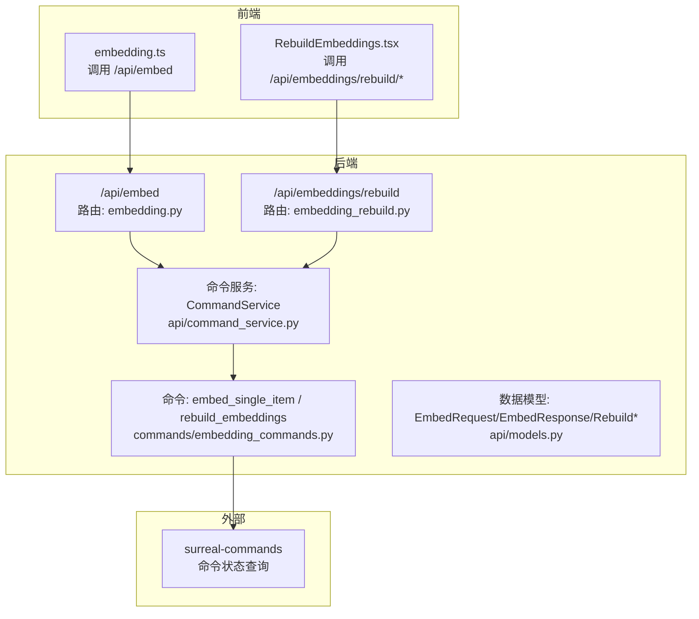
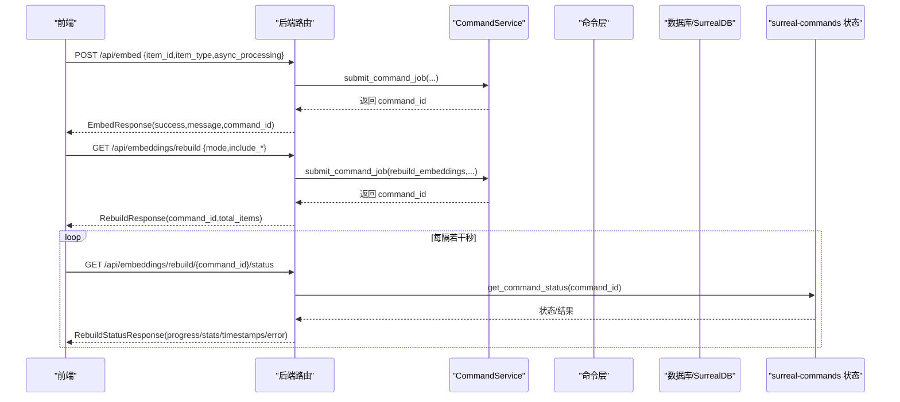
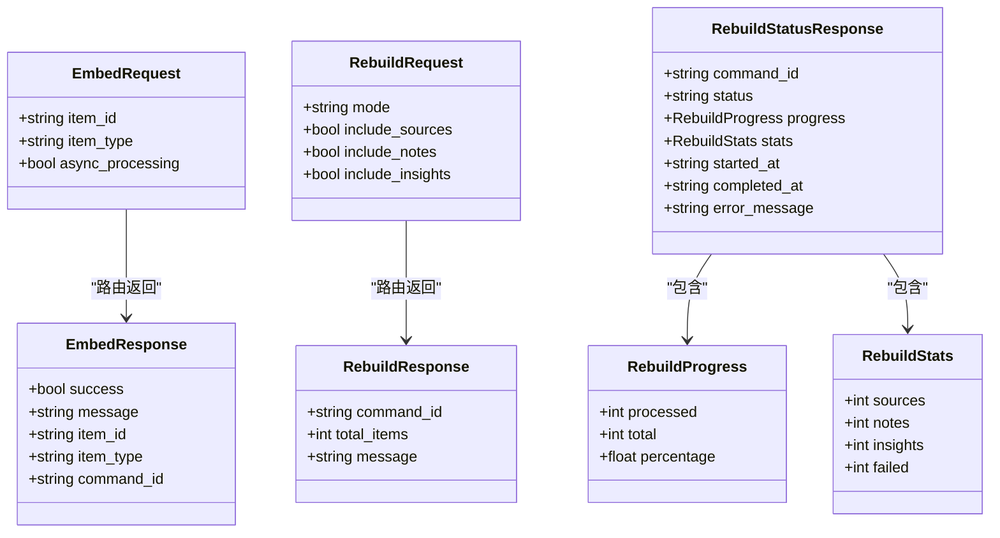
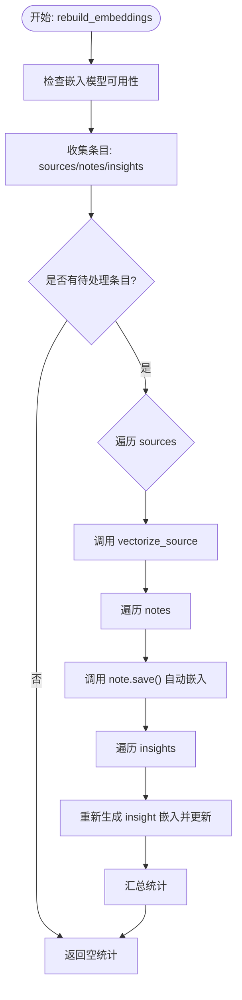
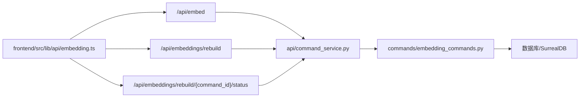

# 嵌入处理API

<cite>
**本文引用的文件**
- [api/routers/embedding.py](file://api/routers/embedding.py)
- [api/routers/embedding_rebuild.py](file://api/routers/embedding_rebuild.py)
- [api/models.py](file://api/models.py)
- [commands/embedding_commands.py](file://commands/embedding_commands.py)
- [api/command_service.py](file://api/command_service.py)
- [api/client.py](file://api/client.py)
- [frontend/src/lib/api/embedding.ts](file://frontend/src/lib/api/embedding.ts)
- [frontend/src/app/(dashboard)/advanced/components/RebuildEmbeddings.tsx](file://frontend/src/app/(dashboard)/advanced/components/RebuildEmbeddings.tsx)
- [docs/development/api-reference.md](file://docs/development/api-reference.md)
</cite>

## 目录
1. [简介](#简介)
2. [项目结构](#项目结构)
3. [核心组件](#核心组件)
4. [架构总览](#架构总览)
5. [详细组件分析](#详细组件分析)
6. [依赖关系分析](#依赖关系分析)
7. [性能考量](#性能考量)
8. [故障排查指南](#故障排查指南)
9. [结论](#结论)
10. [附录：使用示例与最佳实践](#附录使用示例与最佳实践)

## 简介
本技术文档聚焦于向量嵌入功能，围绕以下目标展开：
- 解释 EmbedRequest 中 item_id、item_type（支持 source/note/insight）与 async_processing 的使用方式
- 说明 EmbedResponse 返回的成功状态与 command_id
- 详解 RebuildRequest 的 mode（existing/all）、include_sources、include_notes、include_insights 等重建选项
- 阐述 RebuildStatusResponse 如何通过 command_id 跟踪重建进度，包括 status、progress、stats 和 error_message 字段
- 提供示例：如何触发单个项目嵌入与批量重建，并监控其执行状态

## 项目结构
嵌入处理API由后端路由、命令层、模型定义、命令服务与前端API封装共同组成，形成“请求-命令-状态查询”的闭环。

图表来源
- [api/routers/embedding.py](file://api/routers/embedding.py#L1-L103)
- [api/routers/embedding_rebuild.py](file://api/routers/embedding_rebuild.py#L1-L191)
- [commands/embedding_commands.py](file://commands/embedding_commands.py#L1-L634)
- [api/command_service.py](file://api/command_service.py#L1-L93)
- [api/models.py](file://api/models.py#L195-L251)
- [frontend/src/lib/api/embedding.ts](file://frontend/src/lib/api/embedding.ts#L1-L80)
- [frontend/src/app/(dashboard)/advanced/components/RebuildEmbeddings.tsx](file://frontend/src/app/(dashboard)/advanced/components/RebuildEmbeddings.tsx#L1-L363)

章节来源
- [api/routers/embedding.py](file://api/routers/embedding.py#L1-L103)
- [api/routers/embedding_rebuild.py](file://api/routers/embedding_rebuild.py#L1-L191)
- [api/models.py](file://api/models.py#L195-L251)
- [commands/embedding_commands.py](file://commands/embedding_commands.py#L1-L634)
- [api/command_service.py](file://api/command_service.py#L1-L93)
- [frontend/src/lib/api/embedding.ts](file://frontend/src/lib/api/embedding.ts#L1-L80)
- [frontend/src/app/(dashboard)/advanced/components/RebuildEmbeddings.tsx](file://frontend/src/app/(dashboard)/advanced/components/RebuildEmbeddings.tsx#L1-L363)

## 核心组件
- 路由与控制器
  - 单项嵌入：POST /api/embed
  - 批量重建：POST /api/embeddings/rebuild；GET /api/embeddings/rebuild/{command_id}/status
- 模型定义
  - EmbedRequest/EmbedResponse：单项嵌入请求与响应
  - RebuildRequest/RebuildResponse/RebuildProgress/RebuildStats/RebuildStatusResponse：批量重建请求、响应与状态
- 命令层
  - embed_single_item：处理单个 source/note/insight 的嵌入
  - rebuild_embeddings：批量重建嵌入
  - vectorize_source：源文本分块并提交子任务
  - embed_chunk：对单个文本块生成嵌入并入库
- 命令服务
  - CommandService.submit_command_job：提交后台命令并返回 command_id
  - CommandService.get_command_status：从 surreal-commands 获取命令状态
- 前端API封装
  - embedding.ts：封装 /api/embed、/api/embeddings/rebuild、/api/embeddings/rebuild/{command_id}/status
  - RebuildEmbeddings.tsx：UI侧发起重建并轮询状态

章节来源
- [api/routers/embedding.py](file://api/routers/embedding.py#L12-L103)
- [api/routers/embedding_rebuild.py](file://api/routers/embedding_rebuild.py#L18-L191)
- [api/models.py](file://api/models.py#L195-L251)
- [commands/embedding_commands.py](file://commands/embedding_commands.py#L25-L187)
- [api/command_service.py](file://api/command_service.py#L11-L66)
- [frontend/src/lib/api/embedding.ts](file://frontend/src/lib/api/embedding.ts#L1-L80)
- [frontend/src/app/(dashboard)/advanced/components/RebuildEmbeddings.tsx](file://frontend/src/app/(dashboard)/advanced/components/RebuildEmbeddings.tsx#L1-L363)

## 架构总览
嵌入处理采用“同步提交+异步执行+命令追踪”的模式：
- 前端调用后端接口
- 后端将命令提交给 surreal-commands
- 命令在后台执行，期间可通过 command_id 查询状态
- 前端轮询状态，直到完成或失败

图表来源
- [api/routers/embedding.py](file://api/routers/embedding.py#L12-L103)
- [api/routers/embedding_rebuild.py](file://api/routers/embedding_rebuild.py#L18-L191)
- [api/command_service.py](file://api/command_service.py#L11-L66)
- [commands/embedding_commands.py](file://commands/embedding_commands.py#L465-L634)
- [frontend/src/lib/api/embedding.ts](file://frontend/src/lib/api/embedding.ts#L60-L79)

## 详细组件分析

### 单项嵌入：EmbedRequest 与 EmbedResponse
- EmbedRequest 字段
  - item_id：要嵌入的实体ID
  - item_type：支持 "source"、"note"、"insight"
  - async_processing：是否异步后台处理
- 处理流程
  - 若 async_processing 为真：导入命令模块并提交 embed_single_item 命令，返回 EmbedResponse.success=true、包含 command_id
  - 若 async_processing 为假：直接在路由内调用对应实体的 vectorize/save，返回 EmbedResponse.success=true、可能包含 command_id（用于后续状态追踪）
- EmbedResponse 字段
  - success：布尔，表示是否成功
  - message：字符串，简要说明
  - item_id/item_type：被嵌入的实体信息
  - command_id：当异步提交时返回，用于后续状态查询

章节来源
- [api/routers/embedding.py](file://api/routers/embedding.py#L12-L103)
- [api/models.py](file://api/models.py#L195-L211)
- [commands/embedding_commands.py](file://commands/embedding_commands.py#L25-L187)

### 批量重建：RebuildRequest 与 RebuildStatusResponse
- RebuildRequest 字段
  - mode："existing" 或 "all"
    - existing：仅重建已有嵌入的条目
    - all：重建现有条目并为无嵌入的条目创建新嵌入
  - include_sources/include_notes/include_insights：是否包含对应类型
- 启动重建
  - 后端先估算待处理总数（基于数据库查询），然后提交 rebuild_embeddings 命令，返回 RebuildResponse(command_id,total_items,message)
- 进度查询
  - GET /api/embeddings/rebuild/{command_id}/status
  - RebuildStatusResponse 字段
    - status：queued/running/completed/failed
    - progress：processed/total/percentage
    - stats：sources/notes/insights/failed
    - started_at/completed_at：时间戳
    - error_message：失败时的错误信息

章节来源
- [api/routers/embedding_rebuild.py](file://api/routers/embedding_rebuild.py#L18-L191)
- [api/models.py](file://api/models.py#L214-L251)
- [commands/embedding_commands.py](file://commands/embedding_commands.py#L398-L634)

### 命令与数据流（关键类图）

图表来源
- [api/models.py](file://api/models.py#L195-L251)

### 关键流程：源文本分块与嵌入
- vectorize_source：删除旧嵌入、按策略切分文本、逐块提交 embed_chunk 命令
- embed_chunk：调用嵌入模型生成向量并写入数据库
- rebuild_embeddings：根据 mode/include_* 收集条目，依次处理 source/note/insight

图表来源
- [commands/embedding_commands.py](file://commands/embedding_commands.py#L291-L396)
- [commands/embedding_commands.py](file://commands/embedding_commands.py#L398-L634)

## 依赖关系分析
- 路由依赖
  - /api/embed 依赖 CommandService.submit_command_job 与实体对象的 vectorize/save
  - /api/embeddings/rebuild 依赖 CommandService.submit_command_job 与数据库计数查询
- 命令依赖
  - embed_single_item 依赖 model_manager 与 Source/Note/SourceInsight
  - rebuild_embeddings 依赖 collect_items_for_rebuild 与 vectorize_source
  - vectorize_source 依赖 split_text 与 repo_query
  - embed_chunk 依赖 model_manager 与 repo_query
- 前端依赖
  - embedding.ts 封装 /api/embed、/api/embeddings/rebuild、/api/embeddings/rebuild/{command_id}/status
  - RebuildEmbeddings.tsx 使用 embedding.ts 并以固定间隔轮询状态

图表来源
- [frontend/src/lib/api/embedding.ts](file://frontend/src/lib/api/embedding.ts#L1-L80)
- [api/routers/embedding.py](file://api/routers/embedding.py#L12-L103)
- [api/routers/embedding_rebuild.py](file://api/routers/embedding_rebuild.py#L18-L191)
- [api/command_service.py](file://api/command_service.py#L11-L66)
- [commands/embedding_commands.py](file://commands/embedding_commands.py#L1-L634)

章节来源
- [frontend/src/lib/api/embedding.ts](file://frontend/src/lib/api/embedding.ts#L1-L80)
- [frontend/src/app/(dashboard)/advanced/components/RebuildEmbeddings.tsx](file://frontend/src/app/(dashboard)/advanced/components/RebuildEmbeddings.tsx#L1-L363)
- [api/routers/embedding.py](file://api/routers/embedding.py#L12-L103)
- [api/routers/embedding_rebuild.py](file://api/routers/embedding_rebuild.py#L18-L191)
- [api/command_service.py](file://api/command_service.py#L11-L66)
- [commands/embedding_commands.py](file://commands/embedding_commands.py#L1-L634)

## 性能考量
- 异步处理
  - 异步模式下，路由立即返回 command_id，避免阻塞请求线程
  - 前端可轮询状态，后台并发执行，适合大规模重建
- 分块与并发
  - vectorize_source 将长文本切分为多个块，逐块提交 embed_chunk，天然具备并发控制能力
  - embed_chunk 对瞬时网络/超时错误进行指数退避重试，提升稳定性
- 超时设置
  - 前端与后端均提供较长超时配置，适合大体量重建场景
- 估算与进度
  - 批量重建前进行粗略计数估算，便于用户预估耗时

章节来源
- [api/routers/embedding.py](file://api/routers/embedding.py#L33-L63)
- [commands/embedding_commands.py](file://commands/embedding_commands.py#L190-L289)
- [commands/embedding_commands.py](file://commands/embedding_commands.py#L291-L396)
- [api/client.py](file://api/client.py#L264-L299)

## 故障排查指南
- 常见错误与定位
  - 未配置嵌入模型：路由与命令层均会校验并返回明确错误
  - 未找到实体：Source/Note/Insight 不存在时抛出异常
  - 命令不存在：GET 状态时若 command_id 无效，返回 404
  - 失败状态：RebuildStatusResponse.error_message 可查看具体原因
- 建议排查步骤
  - 确认已配置有效的嵌入模型
  - 检查 command_id 是否正确传递
  - 查看 RebuildStatusResponse.stats.failed 与 error_message
  - 对于网络/超时错误，关注 embed_chunk 的重试机制与日志

章节来源
- [api/routers/embedding.py](file://api/routers/embedding.py#L17-L30)
- [commands/embedding_commands.py](file://commands/embedding_commands.py#L98-L167)
- [api/routers/embedding_rebuild.py](file://api/routers/embedding_rebuild.py#L134-L191)

## 结论
该嵌入处理API提供了灵活的单项嵌入与批量重建能力，结合异步命令与状态查询，既满足即时响应需求，又支持大规模数据的稳定重建。通过清晰的数据模型与严格的错误处理，系统在易用性与可靠性之间取得良好平衡。

## 附录：使用示例与最佳实践

### 示例一：触发单个项目的嵌入
- 同步模式
  - 请求：POST /api/embed
  - 参数：item_id、item_type（source/note/insight）、async_processing=false
  - 返回：EmbedResponse.success=true，可能包含 command_id
- 异步模式
  - 请求：POST /api/embed，async_processing=true
  - 返回：EmbedResponse.success=true，包含 command_id
  - 轮询：GET /api/commands/{command_id}（或 /api/embeddings/rebuild/{command_id}/status，取决于具体命令）

章节来源
- [api/routers/embedding.py](file://api/routers/embedding.py#L33-L92)
- [docs/development/api-reference.md](file://docs/development/api-reference.md#L1131-L1207)

### 示例二：批量重建嵌入并监控进度
- 启动重建
  - 请求：POST /api/embeddings/rebuild
  - 参数：mode（existing/all）、include_sources/notes/insights
  - 返回：RebuildResponse(command_id,total_items,message)
- 轮询状态
  - 请求：GET /api/embeddings/rebuild/{command_id}/status
  - 返回：RebuildStatusResponse（status/progress/stats/timestamps/error_message）
  - 前端建议：每5秒轮询一次，完成后停止

章节来源
- [api/routers/embedding_rebuild.py](file://api/routers/embedding_rebuild.py#L18-L114)
- [api/routers/embedding_rebuild.py](file://api/routers/embedding_rebuild.py#L123-L191)
- [frontend/src/lib/api/embedding.ts](file://frontend/src/lib/api/embedding.ts#L60-L79)
- [frontend/src/app/(dashboard)/advanced/components/RebuildEmbeddings.tsx](file://frontend/src/app/(dashboard)/advanced/components/RebuildEmbeddings.tsx#L44-L73)

### 最佳实践
- 切换嵌入模型时使用 existing 模式快速重建已有条目
- 首次导入大量内容时使用 all 模式补齐缺失嵌入
- 大规模重建建议开启异步模式并设置合理的轮询间隔
- 注意网络/超时错误的重试策略，必要时增加超时配置

章节来源
- [docs/development/api-reference.md](file://docs/development/api-reference.md#L1208-L1353)
- [api/client.py](file://api/client.py#L264-L299)