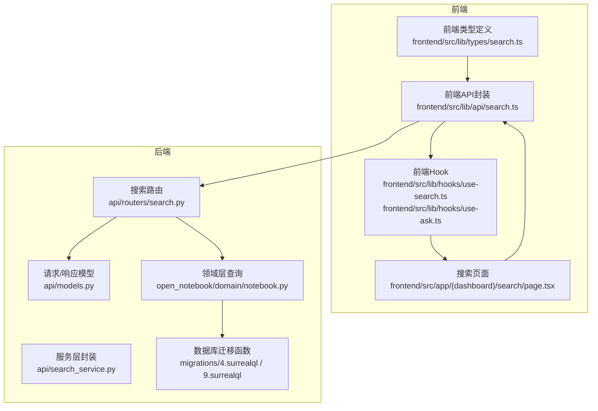
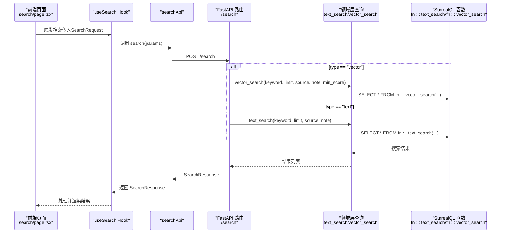
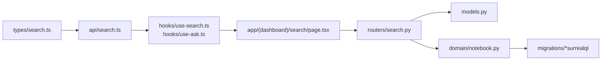
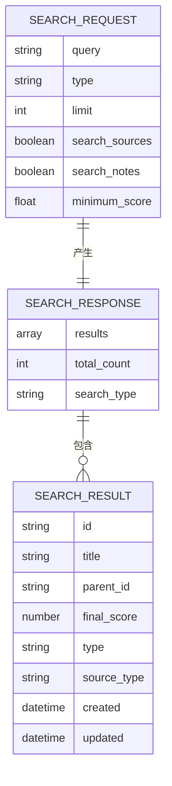
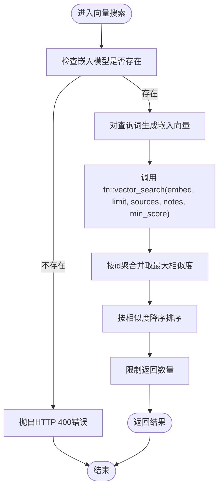

# 搜索API

<cite>
**本文引用的文件**
- [api/routers/search.py](file://api/routers/search.py)
- [api/models.py](file://api/models.py)
- [api/search_service.py](file://api/search_service.py)
- [frontend/src/lib/types/search.ts](file://frontend/src/lib/types/search.ts)
- [frontend/src/lib/api/search.ts](file://frontend/src/lib/api/search.ts)
- [frontend/src/lib/hooks/use-search.ts](file://frontend/src/lib/hooks/use-search.ts)
- [frontend/src/lib/hooks/use-ask.ts](file://frontend/src/lib/hooks/use-ask.ts)
- [frontend/src/app/(dashboard)/search/page.tsx](file://frontend/src/app/(dashboard)/search/page.tsx)
- [migrations/4.surrealql](file://migrations/4.surrealql)
- [migrations/9.surrealql](file://migrations/9.surrealql)
- [open_notebook/domain/notebook.py](file://open_notebook/domain/notebook.py)
- [docs/user-guide/search.md](file://docs/user-guide/search.md)
</cite>

## 目录
1. [简介](#简介)
2. [项目结构](#项目结构)
3. [核心组件](#核心组件)
4. [架构总览](#架构总览)
5. [详细组件分析](#详细组件分析)
6. [依赖关系分析](#依赖关系分析)
7. [性能考量](#性能考量)
8. [故障排查指南](#故障排查指南)
9. [结论](#结论)
10. [附录](#附录)

## 简介
本文件为智能搜索功能的API参考文档，覆盖以下内容：
- SearchRequest 参数说明：query、type（text/vector）、limit、search_sources、search_notes、minimum_score 的用途与默认值
- SearchResponse 返回结构：results 数组、total_count、search_type 字段
- 全文搜索与向量搜索的区别、适用场景与最佳实践
- 调用示例：如何执行混合搜索并处理不同类型的搜索结果
- 前端搜索页面如何传递高级搜索选项并展示结果

## 项目结构
搜索能力由后端FastAPI路由、领域层查询函数、数据库迁移函数以及前端类型与API封装共同组成。下图展示了关键模块之间的关系。

图表来源
- [api/routers/search.py](file://api/routers/search.py#L1-L120)
- [api/models.py](file://api/models.py#L31-L60)
- [api/search_service.py](file://api/search_service.py#L1-L58)
- [frontend/src/lib/types/search.ts](file://frontend/src/lib/types/search.ts#L1-L62)
- [frontend/src/lib/api/search.ts](file://frontend/src/lib/api/search.ts#L1-L63)
- [frontend/src/lib/hooks/use-search.ts](file://frontend/src/lib/hooks/use-search.ts#L1-L32)
- [frontend/src/lib/hooks/use-ask.ts](file://frontend/src/lib/hooks/use-ask.ts#L1-L164)
- [frontend/src/app/(dashboard)/search/page.tsx](file://frontend/src/app/(dashboard)/search/page.tsx#L1-L120)
- [migrations/4.surrealql](file://migrations/4.surrealql#L1-L70)
- [migrations/9.surrealql](file://migrations/9.surrealql#L1-L35)
- [open_notebook/domain/notebook.py](file://open_notebook/domain/notebook.py#L426-L456)

章节来源
- [api/routers/search.py](file://api/routers/search.py#L1-L120)
- [api/models.py](file://api/models.py#L31-L60)
- [frontend/src/lib/types/search.ts](file://frontend/src/lib/types/search.ts#L1-L62)
- [frontend/src/lib/api/search.ts](file://frontend/src/lib/api/search.ts#L1-L63)
- [frontend/src/lib/hooks/use-search.ts](file://frontend/src/lib/hooks/use-search.ts#L1-L32)
- [frontend/src/lib/hooks/use-ask.ts](file://frontend/src/lib/hooks/use-ask.ts#L1-L164)
- [frontend/src/app/(dashboard)/search/page.tsx](file://frontend/src/app/(dashboard)/search/page.tsx#L1-L120)

## 核心组件
- 后端路由与模型
  - 路由：/search（POST）返回 SearchResponse；/search/ask（POST）为流式问答；/search/ask/simple（POST）为非流式问答
  - 请求模型：SearchRequest（包含 query、type、limit、search_sources、search_notes、minimum_score）
  - 响应模型：SearchResponse（results、total_count、search_type）
- 领域层查询
  - 文本搜索：text_search（基于SurrealQL全文检索）
  - 向量搜索：vector_search（基于嵌入向量余弦相似度）
- 前端类型与API
  - 类型定义：SearchRequest、SearchResponse、AskRequest、AskResponse 及流式事件类型
  - API封装：searchApi.search、searchApi.askKnowledgeBase
  - Hook：useSearch（处理排序与评分）、useAsk（SSE流式解析）

章节来源
- [api/routers/search.py](file://api/routers/search.py#L1-L120)
- [api/models.py](file://api/models.py#L31-L60)
- [open_notebook/domain/notebook.py](file://open_notebook/domain/notebook.py#L426-L456)
- [frontend/src/lib/types/search.ts](file://frontend/src/lib/types/search.ts#L1-L62)
- [frontend/src/lib/api/search.ts](file://frontend/src/lib/api/search.ts#L1-L63)
- [frontend/src/lib/hooks/use-search.ts](file://frontend/src/lib/hooks/use-search.ts#L1-L32)
- [frontend/src/lib/hooks/use-ask.ts](file://frontend/src/lib/hooks/use-ask.ts#L1-L164)

## 架构总览
下面的时序图展示了“标准搜索”的调用链路：前端通过API封装发起请求，后端路由根据type选择文本或向量搜索，最终返回SearchResponse。

图表来源
- [frontend/src/app/(dashboard)/search/page.tsx](file://frontend/src/app/(dashboard)/search/page.tsx#L80-L110)
- [frontend/src/lib/hooks/use-search.ts](file://frontend/src/lib/hooks/use-search.ts#L1-L32)
- [frontend/src/lib/api/search.ts](file://frontend/src/lib/api/search.ts#L1-L20)
- [api/routers/search.py](file://api/routers/search.py#L17-L59)
- [open_notebook/domain/notebook.py](file://open_notebook/domain/notebook.py#L426-L456)
- [migrations/4.surrealql](file://migrations/4.surrealql#L1-L70)
- [migrations/9.surrealql](file://migrations/9.surrealql#L1-L35)

## 详细组件分析

### SearchRequest 参数详解
- query
  - 类型：字符串
  - 必填：是
  - 作用：作为搜索关键词，用于全文或向量检索
- type
  - 类型：枚举 "text" | "vector"
  - 默认值："text"
  - 作用：控制使用全文搜索还是向量搜索
- limit
  - 类型：整数
  - 默认值：100
  - 上限：1000
  - 作用：限制返回结果数量
- search_sources
  - 类型：布尔
  - 默认值：true
  - 作用：是否包含来源（源文档/片段/洞察）的搜索
- search_notes
  - 类型：布尔
  - 默认值：true
  - 作用：是否包含笔记的搜索
- minimum_score
  - 类型：浮点数
  - 默认值：0.2
  - 取值范围：0.0 到 1.0
  - 作用：向量搜索的最小相似度阈值

章节来源
- [api/models.py](file://api/models.py#L31-L60)
- [api/routers/search.py](file://api/routers/search.py#L17-L59)
- [frontend/src/lib/types/search.ts](file://frontend/src/lib/types/search.ts#L1-L20)
- [frontend/src/app/(dashboard)/search/page.tsx](file://frontend/src/app/(dashboard)/search/page.tsx#L348-L413)

### SearchResponse 返回结构
- results
  - 类型：数组
  - 内容：每个元素包含 id、title、parent_id、final_score、matches（可选）、relevance/similarity/score（可选）、type/source_type（可选）、created、updated 等字段
  - 说明：前端在useSearch中会统一计算并写入final_score，优先级为 relevance > similarity > score，若均无则为0
- total_count
  - 类型：整数
  - 说明：返回结果总数
- search_type
  - 类型：字符串
  - 说明：本次搜索使用的类型（"text" 或 "vector"）

章节来源
- [api/models.py](file://api/models.py#L43-L60)
- [frontend/src/lib/types/search.ts](file://frontend/src/lib/types/search.ts#L21-L31)
- [frontend/src/lib/hooks/use-search.ts](file://frontend/src/lib/hooks/use-search.ts#L1-L32)
- [api/routers/search.py](file://api/routers/search.py#L45-L59)

### 全文搜索 vs 向量搜索
- 全文搜索（text）
  - 实现：基于SurrealQL全文索引与BM25评分
  - 适用场景：精确关键词匹配、技术术语、引用定位
  - 特性：高亮匹配词、大小写与标点分词、标题与内容检索
- 向量搜索（vector）
  - 实现：基于嵌入向量的余弦相似度，受 minimum_score 控制
  - 适用场景：概念理解、主题发现、语义关联
  - 要求：需配置嵌入模型且内容已生成嵌入
- 最佳实践
  - 混合策略：先用向量搜索发现主题，再用文本搜索精确定位
  - 调参建议：minimum_score 从 0.2 开始尝试，逐步调整；limit 根据需求设置

章节来源
- [docs/user-guide/search.md](file://docs/user-guide/search.md#L1-L120)
- [migrations/4.surrealql](file://migrations/4.surrealql#L1-L70)
- [migrations/9.surrealql](file://migrations/9.surrealql#L1-L35)
- [open_notebook/domain/notebook.py](file://open_notebook/domain/notebook.py#L426-L456)

### 调用示例与混合搜索
- 执行标准搜索（文本/向量）
  - 前端：构造 SearchRequest 并调用 searchApi.search
  - 后端：根据 type 分派到 text_search 或 vector_search
  - 返回：SearchResponse（results、total_count、search_type）
- 执行混合搜索
  - 步骤一：向量搜索（type="vector"），得到主题线索
  - 步骤二：文本搜索（type="text"），使用向量结果中的关键词进行精确匹配
  - 步骤三：合并并按 final_score 排序，展示结果
- 处理不同类型的搜索结果
  - 前端：useSearch 将 relevance/similarity/score 统一为 final_score，并降序排序
  - 展示：页面根据 parent_id 解析类型（source/note/source_insight），并显示匹配片段与得分

章节来源
- [frontend/src/lib/api/search.ts](file://frontend/src/lib/api/search.ts#L1-L20)
- [frontend/src/lib/hooks/use-search.ts](file://frontend/src/lib/hooks/use-search.ts#L1-L32)
- [frontend/src/app/(dashboard)/search/page.tsx](file://frontend/src/app/(dashboard)/search/page.tsx#L415-L478)
- [api/routers/search.py](file://api/routers/search.py#L17-L59)

### 前端高级搜索选项与结果展示
- 高级选项传递
  - 搜索类型：单选（text/vector），当未配置嵌入模型时禁用 vector
  - 搜索范围：复选框（search_sources、search_notes）
  - 限制数量：固定为100（来自页面默认）
  - 最小相似度：固定为0.2（来自页面默认）
- 结果展示逻辑
  - 显示 total_count 与 search_type
  - 渲染每条结果的标题、final_score、匹配片段（可折叠展开）
  - 点击标题打开对应模态（source/note/source_insight）

章节来源
- [frontend/src/app/(dashboard)/search/page.tsx](file://frontend/src/app/(dashboard)/search/page.tsx#L348-L478)
- [frontend/src/lib/hooks/use-search.ts](file://frontend/src/lib/hooks/use-search.ts#L1-L32)

## 依赖关系分析
- 后端
  - 路由依赖模型定义（SearchRequest/Response）
  - 路由调用领域层查询（text_search/vector_search）
  - 领域层查询依赖数据库迁移函数（fn::text_search/fn::vector_search）
- 前端
  - 类型定义驱动API封装
  - API封装驱动Hook与页面组件
  - 页面组件负责状态管理与交互

图表来源
- [frontend/src/lib/types/search.ts](file://frontend/src/lib/types/search.ts#L1-L62)
- [frontend/src/lib/api/search.ts](file://frontend/src/lib/api/search.ts#L1-L63)
- [frontend/src/lib/hooks/use-search.ts](file://frontend/src/lib/hooks/use-search.ts#L1-L32)
- [frontend/src/lib/hooks/use-ask.ts](file://frontend/src/lib/hooks/use-ask.ts#L1-L164)
- [frontend/src/app/(dashboard)/search/page.tsx](file://frontend/src/app/(dashboard)/search/page.tsx#L1-L120)
- [api/routers/search.py](file://api/routers/search.py#L1-L120)
- [api/models.py](file://api/models.py#L31-L60)
- [open_notebook/domain/notebook.py](file://open_notebook/domain/notebook.py#L426-L456)
- [migrations/4.surrealql](file://migrations/4.surrealql#L1-L70)
- [migrations/9.surrealql](file://migrations/9.surrealql#L1-L35)

## 性能考量
- 向量搜索依赖嵌入模型与索引质量，minimum_score 过低会导致大量候选结果，影响性能
- limit 建议根据实际使用场景调整，避免过大导致响应时间增长
- 文本搜索的高亮与分词策略会影响查询开销，建议在输入阶段尽量精准
- 对于大规模知识库，建议定期维护索引与嵌入数据，确保查询稳定性

[本节为通用指导，不直接分析具体文件]

## 故障排查指南
- 无法使用向量搜索
  - 现象：向量搜索选项不可用
  - 原因：未配置嵌入模型
  - 处理：前往模型设置配置嵌入模型
- 搜索结果为空或相关性差
  - 现象：返回空或低分结果
  - 原因：关键词不匹配、minimum_score 过高、未启用相应搜索范围
  - 处理：降低 minimum_score、开启 search_sources/search_notes、优化关键词
- 服务器错误
  - 现象：HTTP 500
  - 原因：数据库操作异常或未知错误
  - 处理：检查日志、确认嵌入模型可用、重试请求

章节来源
- [api/routers/search.py](file://api/routers/search.py#L21-L59)
- [docs/user-guide/search.md](file://docs/user-guide/search.md#L284-L322)

## 结论
本搜索API提供了灵活的文本与向量双通道检索能力，并通过统一的SearchResponse结构与前端Hook实现一致的结果展示与排序体验。通过合理配置参数与采用混合搜索策略，可在精确查找与语义发现之间取得平衡，满足多样化的知识检索需求。

[本节为总结性内容，不直接分析具体文件]

## 附录

### 数据模型关系图

图表来源
- [api/models.py](file://api/models.py#L31-L60)
- [frontend/src/lib/types/search.ts](file://frontend/src/lib/types/search.ts#L1-L31)

### 关键流程图：向量搜索算法

图表来源
- [open_notebook/domain/notebook.py](file://open_notebook/domain/notebook.py#L426-L456)
- [migrations/9.surrealql](file://migrations/9.surrealql#L1-L35)