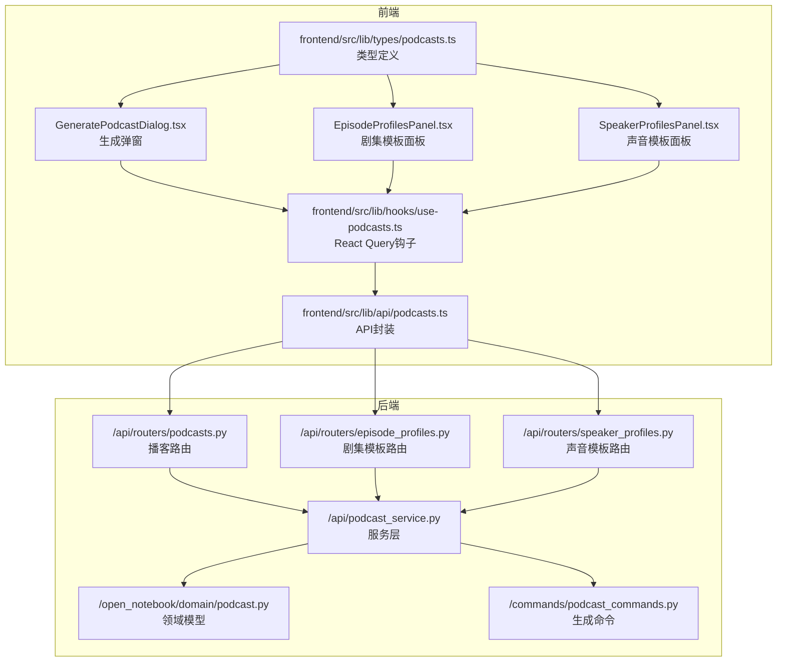
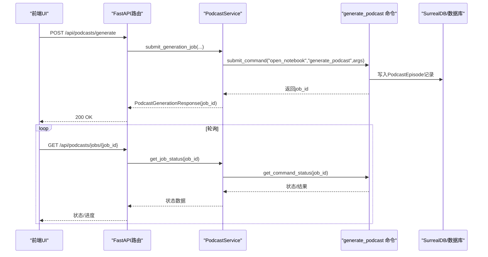
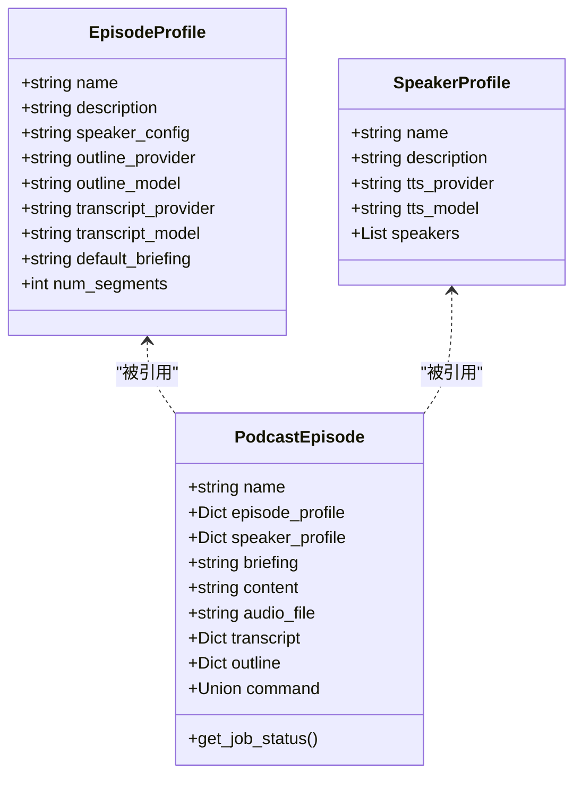

# 播客生成功能API

<cite>
**本文引用的文件**
- [api/routers/podcasts.py](file://api/routers/podcasts.py)
- [api/routers/episode_profiles.py](file://api/routers/episode_profiles.py)
- [api/routers/speaker_profiles.py](file://api/routers/speaker_profiles.py)
- [api/podcast_service.py](file://api/podcast_service.py)
- [api/podcast_api_service.py](file://api/podcast_api_service.py)
- [open_notebook/domain/podcast.py](file://open_notebook/domain/podcast.py)
- [commands/podcast_commands.py](file://commands/podcast_commands.py)
- [frontend/src/lib/api/podcasts.ts](file://frontend/src/lib/api/podcasts.ts)
- [frontend/src/lib/hooks/use-podcasts.ts](file://frontend/src/lib/hooks/use-podcasts.ts)
- [frontend/src/components/podcasts/GeneratePodcastDialog.tsx](file://frontend/src/components/podcasts/GeneratePodcastDialog.tsx)
- [frontend/src/components/podcasts/EpisodeProfilesPanel.tsx](file://frontend/src/components/podcasts/EpisodeProfilesPanel.tsx)
- [frontend/src/components/podcasts/SpeakerProfilesPanel.tsx](file://frontend/src/components/podcasts/SpeakerProfilesPanel.tsx)
- [frontend/src/lib/types/podcasts.ts](file://frontend/src/lib/types/podcasts.ts)
- [docs/features/podcasts.md](file://docs/features/podcasts.md)
</cite>

## 目录
1. [简介](#简介)
2. [项目结构](#项目结构)
3. [核心组件](#核心组件)
4. [架构总览](#架构总览)
5. [详细组件分析](#详细组件分析)
6. [依赖关系分析](#依赖关系分析)
7. [性能与并发特性](#性能与并发特性)
8. [故障排查指南](#故障排查指南)
9. [结论](#结论)
10. [附录：调用示例与完整流程](#附录调用示例与完整流程)

## 简介
本文件为“播客生成功能”的API参考文档，覆盖以下方面：
- 播客模板管理：Episode Profiles（剧集配置模板）与 Speaker Profiles（声音与角色配置模板）
- 播客生成请求与状态查询：提交生成任务、轮询任务状态、列出与删除已生成的播客条目
- 配置参数详解：说话人角色、对话长度、生成模型选择、简报模板与片段数量
- 前后端协作：前端UI如何通过API完成从模板创建到播客生成的全流程

该系统采用“异步作业队列”模式：提交生成请求后立即返回任务ID，随后通过状态接口轮询进度；生成完成后可在列表中查看并下载音频。

## 项目结构
播客功能由后端FastAPI路由、服务层、领域模型与命令执行器组成，并通过前端React组件与API客户端进行交互。

图表来源
- [api/routers/podcasts.py](file://api/routers/podcasts.py#L1-L232)
- [api/routers/episode_profiles.py](file://api/routers/episode_profiles.py#L1-L262)
- [api/routers/speaker_profiles.py](file://api/routers/speaker_profiles.py#L1-L222)
- [api/podcast_service.py](file://api/podcast_service.py#L1-L207)
- [open_notebook/domain/podcast.py](file://open_notebook/domain/podcast.py#L1-L149)
- [commands/podcast_commands.py](file://commands/podcast_commands.py#L1-L188)
- [frontend/src/lib/api/podcasts.ts](file://frontend/src/lib/api/podcasts.ts#L1-L114)
- [frontend/src/lib/hooks/use-podcasts.ts](file://frontend/src/lib/hooks/use-podcasts.ts#L1-L370)
- [frontend/src/components/podcasts/GeneratePodcastDialog.tsx](file://frontend/src/components/podcasts/GeneratePodcastDialog.tsx#L1-L833)
- [frontend/src/components/podcasts/EpisodeProfilesPanel.tsx](file://frontend/src/components/podcasts/EpisodeProfilesPanel.tsx#L1-L258)
- [frontend/src/components/podcasts/SpeakerProfilesPanel.tsx](file://frontend/src/components/podcasts/SpeakerProfilesPanel.tsx#L1-L237)
- [frontend/src/lib/types/podcasts.ts](file://frontend/src/lib/types/podcasts.ts#L1-L134)

章节来源
- [api/routers/podcasts.py](file://api/routers/podcasts.py#L1-L232)
- [api/routers/episode_profiles.py](file://api/routers/episode_profiles.py#L1-L262)
- [api/routers/speaker_profiles.py](file://api/routers/speaker_profiles.py#L1-L222)
- [api/podcast_service.py](file://api/podcast_service.py#L1-L207)
- [open_notebook/domain/podcast.py](file://open_notebook/domain/podcast.py#L1-L149)
- [commands/podcast_commands.py](file://commands/podcast_commands.py#L1-L188)
- [frontend/src/lib/api/podcasts.ts](file://frontend/src/lib/api/podcasts.ts#L1-L114)
- [frontend/src/lib/hooks/use-podcasts.ts](file://frontend/src/lib/hooks/use-podcasts.ts#L1-L370)
- [frontend/src/components/podcasts/GeneratePodcastDialog.tsx](file://frontend/src/components/podcasts/GeneratePodcastDialog.tsx#L1-L833)
- [frontend/src/components/podcasts/EpisodeProfilesPanel.tsx](file://frontend/src/components/podcasts/EpisodeProfilesPanel.tsx#L1-L258)
- [frontend/src/components/podcasts/SpeakerProfilesPanel.tsx](file://frontend/src/components/podcasts/SpeakerProfilesPanel.tsx#L1-L237)
- [frontend/src/lib/types/podcasts.ts](file://frontend/src/lib/types/podcasts.ts#L1-L134)

## 核心组件
- 播客路由与端点
  - 生成播客：POST /api/podcasts/generate
  - 查询作业状态：GET /api/podcasts/jobs/{job_id}
  - 列出播客条目：GET /api/podcasts/episodes
  - 获取单个播客条目：GET /api/podcasts/episodes/{episode_id}
  - 下载播客音频：GET /api/podcasts/episodes/{episode_id}/audio
  - 删除播客条目：DELETE /api/podcasts/episodes/{episode_id}
- 模板管理端点
  - 剧集模板：GET/POST/PUT/DELETE /api/episode-profiles[/duplicate]
  - 声音模板：GET/POST/PUT/DELETE /api/speaker-profiles[/duplicate]
- 服务层
  - PodcastService：提交作业、查询状态、列举与获取条目
  - PodcastAPIService：前端API封装，统一调用后端模板与播客端点
- 领域模型
  - EpisodeProfile、SpeakerProfile、PodcastEpisode：数据库实体与校验规则
- 命令执行器
  - generate_podcast_command：实际执行生成流程，写入数据库并产出音频与转录

章节来源
- [api/routers/podcasts.py](file://api/routers/podcasts.py#L40-L232)
- [api/routers/episode_profiles.py](file://api/routers/episode_profiles.py#L25-L262)
- [api/routers/speaker_profiles.py](file://api/routers/speaker_profiles.py#L21-L222)
- [api/podcast_service.py](file://api/podcast_service.py#L12-L207)
- [api/podcast_api_service.py](file://api/podcast_api_service.py#L1-L126)
- [open_notebook/domain/podcast.py](file://open_notebook/domain/podcast.py#L1-L149)
- [commands/podcast_commands.py](file://commands/podcast_commands.py#L31-L188)

## 架构总览
后端采用“路由—服务—领域—命令”的分层设计。前端通过API客户端调用后端REST端点，使用React Query进行状态管理与自动刷新。

图表来源
- [api/routers/podcasts.py](file://api/routers/podcasts.py#L40-L83)
- [api/podcast_service.py](file://api/podcast_service.py#L33-L139)
- [commands/podcast_commands.py](file://commands/podcast_commands.py#L49-L188)
- [frontend/src/lib/api/podcasts.ts](file://frontend/src/lib/api/podcasts.ts#L106-L112)
- [frontend/src/lib/hooks/use-podcasts.ts](file://frontend/src/lib/hooks/use-podcasts.ts#L346-L370)

## 详细组件分析

### 播客生成端点
- 提交生成
  - 方法与路径：POST /api/podcasts/generate
  - 请求体字段：
    - episode_profile：剧集模板名称（必填）
    - speaker_profile：声音模板名称（必填）
    - episode_name：播客条目名称（必填）
    - content：内容文本（二选一，或提供notebook_id）
    - notebook_id：笔记本ID（二选一，或提供content）
    - briefing_suffix：附加简报指令（可选）
  - 响应体字段：
    - job_id：作业ID
    - status：提交状态
    - message：提示信息
    - episode_profile、episode_name：回显
- 查询作业状态
  - 方法与路径：GET /api/podcasts/jobs/{job_id}
  - 响应包含：job_id、status、result、error_message、created、updated、progress
- 列出播客条目
  - 方法与路径：GET /api/podcasts/episodes
  - 过滤：仅返回具备命令或音频文件的条目
  - 字段：id、name、episode_profile、speaker_profile、briefing、audio_file、audio_url、transcript、outline、created、job_status
- 获取单个播客条目
  - 方法与路径：GET /api/podcasts/episodes/{episode_id}
  - 行为：同上，但只返回一个条目
- 下载音频
  - 方法与路径：GET /api/podcasts/episodes/{episode_id}/audio
  - 行为：返回音频文件（本地路径或URL）
- 删除播客条目
  - 方法与路径：DELETE /api/podcasts/episodes/{episode_id}
  - 行为：删除物理音频文件（若存在），并删除数据库记录

章节来源
- [api/routers/podcasts.py](file://api/routers/podcasts.py#L40-L232)
- [api/podcast_service.py](file://api/podcast_service.py#L140-L207)

### 模板管理端点

#### 剧集模板（Episode Profiles）
- 列表：GET /api/episode-profiles
- 获取：GET /api/episode-profiles/{profile_name}
- 创建：POST /api/episode-profiles
  - 字段：name、description、speaker_config、outline_provider、outline_model、transcript_provider、transcript_model、default_briefing、num_segments
- 更新：PUT /api/episode-profiles/{profile_id}
- 删除：DELETE /api/episode-profiles/{profile_id}
- 复制：POST /api/episode-profiles/{profile_id}/duplicate

字段说明（剧集模板）
- name：模板唯一名称
- description：描述
- speaker_config：关联的声音模板名称
- outline_provider/outline_model：大纲生成使用的AI提供商与模型
- transcript_provider/transcript_model：转录生成使用的AI提供商与模型
- default_briefing：默认简报模板
- num_segments：播客片段数量（3~20）

章节来源
- [api/routers/episode_profiles.py](file://api/routers/episode_profiles.py#L25-L262)
- [open_notebook/domain/podcast.py](file://open_notebook/domain/podcast.py#L10-L78)

#### 声音模板（Speaker Profiles）
- 列表：GET /api/speaker-profiles
- 获取：GET /api/speaker-profiles/{profile_name}
- 创建：POST /api/speaker-profiles
  - 字段：name、description、tts_provider、tts_model、speakers（数组）
- 更新：PUT /api/speaker-profiles/{profile_id}
- 删除：DELETE /api/speaker-profiles/{profile_id}
- 复制：POST /api/speaker-profiles/{profile_id}/duplicate

字段说明（声音模板）
- name、description：模板名称与描述
- tts_provider/tts_model：TTS提供商与模型
- speakers：数组，每项包含 name、voice_id、backstory、personality

章节来源
- [api/routers/speaker_profiles.py](file://api/routers/speaker_profiles.py#L21-L222)
- [open_notebook/domain/podcast.py](file://open_notebook/domain/podcast.py#L48-L116)

### 服务层与命令执行
- PodcastService
  - submit_generation_job：校验模板存在性，准备命令参数，提交到 surreal-commands，返回job_id
  - get_job_status：查询作业状态与结果
  - list_episodes/get_episode：读取播客条目
- generate_podcast_command（后台命令）
  - 加载剧集与声音模板
  - 初始化 podcast-creator 配置
  - 生成播客，写入PodcastEpisode记录（含音频路径、转录、大纲）
  - 返回成功/失败与处理时长

章节来源
- [api/podcast_service.py](file://api/podcast_service.py#L33-L139)
- [commands/podcast_commands.py](file://commands/podcast_commands.py#L31-L188)
- [open_notebook/domain/podcast.py](file://open_notebook/domain/podcast.py#L90-L149)

### 前端集成与UI流程
- API封装：frontend/src/lib/api/podcasts.ts
  - 封装了播客、剧集模板、声音模板的增删改查与生成请求
- React Query钩子：frontend/src/lib/hooks/use-podcasts.ts
  - 自动刷新播客列表（当存在运行中的条目时以15秒间隔）
  - 提供生成播客的mutation
- 生成弹窗：frontend/src/components/podcasts/GeneratePodcastDialog.tsx
  - 选择笔记本、来源与笔记，构建上下文内容
  - 选择剧集模板、输入播客名称、附加简报指令
  - 发起生成请求并等待状态更新
- 模板面板：EpisodeProfilesPanel、SpeakerProfilesPanel
  - 展示与编辑模板，支持复制与删除

章节来源
- [frontend/src/lib/api/podcasts.ts](file://frontend/src/lib/api/podcasts.ts#L1-L114)
- [frontend/src/lib/hooks/use-podcasts.ts](file://frontend/src/lib/hooks/use-podcasts.ts#L1-L370)
- [frontend/src/components/podcasts/GeneratePodcastDialog.tsx](file://frontend/src/components/podcasts/GeneratePodcastDialog.tsx#L1-L833)
- [frontend/src/components/podcasts/EpisodeProfilesPanel.tsx](file://frontend/src/components/podcasts/EpisodeProfilesPanel.tsx#L1-L258)
- [frontend/src/components/podcasts/SpeakerProfilesPanel.tsx](file://frontend/src/components/podcasts/SpeakerProfilesPanel.tsx#L1-L237)
- [frontend/src/lib/types/podcasts.ts](file://frontend/src/lib/types/podcasts.ts#L1-L134)

## 依赖关系分析

图表来源
- [open_notebook/domain/podcast.py](file://open_notebook/domain/podcast.py#L10-L149)

章节来源
- [open_notebook/domain/podcast.py](file://open_notebook/domain/podcast.py#L10-L149)

## 性能与并发特性
- 异步生成与非阻塞体验：提交后立即返回job_id，前端可轮询状态，避免页面卡顿
- 自动刷新策略：当存在运行中条目时，前端以15秒间隔刷新播客列表
- 并发控制建议：根据TTS提供商的速率限制调整批量并发（例如环境变量TTS_BATCH_SIZE），以平衡速度与稳定性
- 数据库与I/O：音频文件存储在本地目录，下载时直接返回文件路径；删除条目会同时清理物理文件

章节来源
- [frontend/src/lib/hooks/use-podcasts.ts](file://frontend/src/lib/hooks/use-podcasts.ts#L32-L50)
- [docs/features/podcasts.md](file://docs/features/podcasts.md#L217-L235)
- [api/routers/podcasts.py](file://api/routers/podcasts.py#L181-L204)

## 故障排查指南
- 生成失败常见原因
  - 缺少内容：未提供content或notebook_id
  - 模板缺失：episode_profile或speaker_profile不存在
  - 模型问题：某些模型输出格式不兼容导致解析错误
- 建议排查步骤
  - 确认模板已创建且名称正确
  - 检查content是否足够丰富
  - 如使用特定模型，参考文档中的兼容性提示
  - 查看作业状态接口返回的error_message
- 前端提示
  - 生成弹窗会在缺少必要信息时给出明确提示
  - 成功后Toast提示“生成已开始”，失败时提示错误详情

章节来源
- [api/podcast_service.py](file://api/podcast_service.py#L33-L113)
- [commands/podcast_commands.py](file://commands/podcast_commands.py#L169-L188)
- [frontend/src/components/podcasts/GeneratePodcastDialog.tsx](file://frontend/src/components/podcasts/GeneratePodcastDialog.tsx#L429-L494)

## 结论
本播客生成功能通过清晰的模板体系与异步作业机制，实现了从内容到成品音频的自动化生产。前端提供直观的配置与生成界面，后端提供稳定的REST API与命令执行链路。合理配置模板与并发参数，可获得高质量、可扩展的播客生成能力。

## 附录：调用示例与完整流程

### 完整流程（从模板创建到播客生成）
1) 准备模板
- 创建声音模板（Speaker Profiles）
- 基于声音模板创建剧集模板（Episode Profiles），设置大纲与转录模型、片段数量、默认简报
- 参考：前端“声音模板面板”与“剧集模板面板”的创建入口

2) 生成播客
- 在前端“生成播客”弹窗中：
  - 选择笔记本与来源/笔记，构建上下文内容
  - 选择剧集模板与播客名称，可追加简报指令
  - 点击“生成”，后端返回job_id
- 后端路由：POST /api/podcasts/generate
- 前端API封装：frontend/src/lib/api/podcasts.ts 的 generatePodcast

3) 轮询状态
- 前端使用React Query钩子自动刷新，或手动调用：
  - GET /api/podcasts/jobs/{job_id}
- 前端封装：frontend/src/lib/api/podcasts.ts 的 generatePodcast 返回后，前端会触发refetch

4) 查看与下载
- 列出播客条目：GET /api/podcasts/episodes
- 下载音频：GET /api/podcasts/episodes/{episode_id}/audio

5) 管理模板
- 剧集模板：GET/POST/PUT/DELETE /api/episode-profiles[/duplicate]
- 声音模板：GET/POST/PUT/DELETE /api/speaker-profiles[/duplicate]

章节来源
- [frontend/src/components/podcasts/GeneratePodcastDialog.tsx](file://frontend/src/components/podcasts/GeneratePodcastDialog.tsx#L429-L494)
- [frontend/src/lib/api/podcasts.ts](file://frontend/src/lib/api/podcasts.ts#L106-L112)
- [api/routers/podcasts.py](file://api/routers/podcasts.py#L40-L83)
- [api/routers/episode_profiles.py](file://api/routers/episode_profiles.py#L25-L139)
- [api/routers/speaker_profiles.py](file://api/routers/speaker_profiles.py#L21-L117)