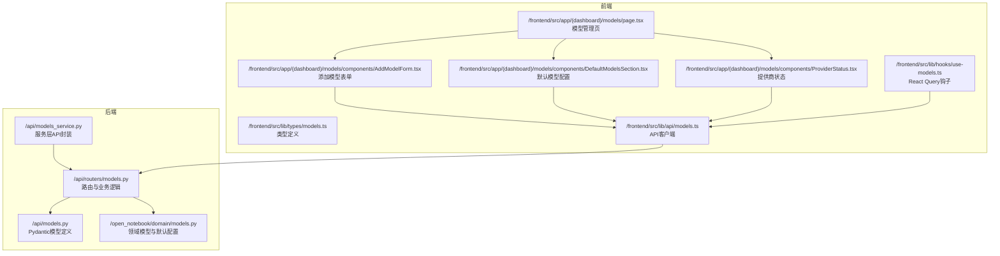
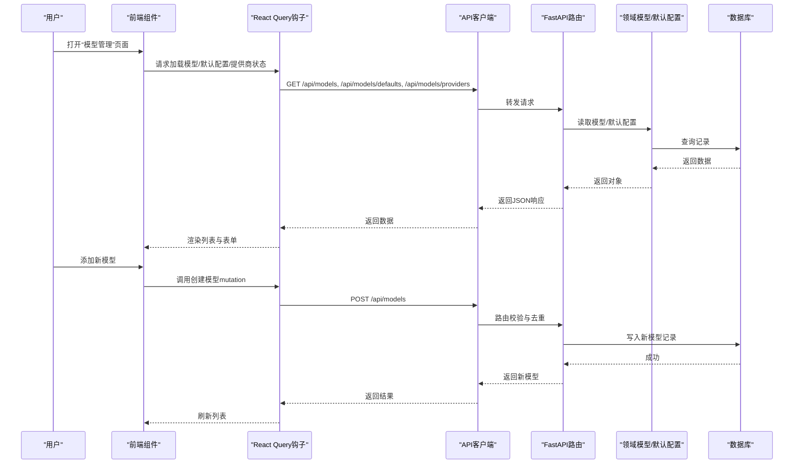
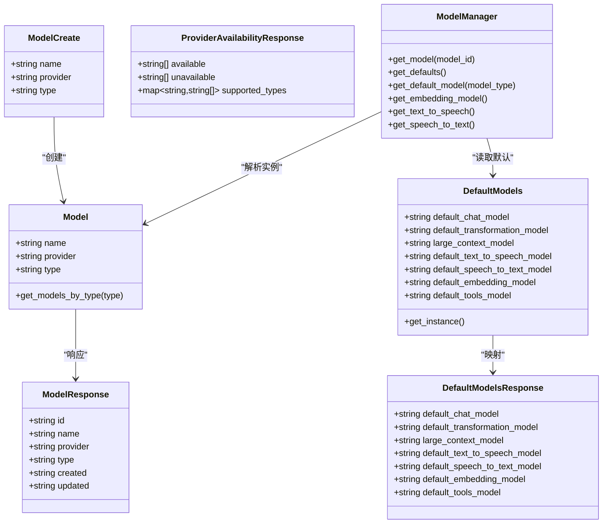

# 模型管理API

<cite>
**本文引用的文件**
- [api/models.py](file://api/models.py)
- [api/routers/models.py](file://api/routers/models.py)
- [api/models_service.py](file://api/models_service.py)
- [open_notebook/domain/models.py](file://open_notebook/domain/models.py)
- [frontend/src/lib/types/models.ts](file://frontend/src/lib/types/models.ts)
- [frontend/src/app/(dashboard)/models/page.tsx](file://frontend/src/app/(dashboard)/models/page.tsx)
- [frontend/src/app/(dashboard)/models/components/AddModelForm.tsx](file://frontend/src/app/(dashboard)/models/components/AddModelForm.tsx)
- [frontend/src/app/(dashboard)/models/components/DefaultModelsSection.tsx](file://frontend/src/app/(dashboard)/models/components/DefaultModelsSection.tsx)
- [frontend/src/app/(dashboard)/models/components/ProviderStatus.tsx](file://frontend/src/app/(dashboard)/models/components/ProviderStatus.tsx)
- [frontend/src/lib/api/models.ts](file://frontend/src/lib/api/models.ts)
- [frontend/src/lib/hooks/use-models.ts](file://frontend/src/lib/hooks/use-models.ts)
- [docs/development/api-reference.md](file://docs/development/api-reference.md)
- [CONFIGURATION.md](file://CONFIGURATION.md)
</cite>

## 目录
1. [简介](#简介)
2. [项目结构](#项目结构)
3. [核心组件](#核心组件)
4. [架构总览](#架构总览)
5. [详细组件分析](#详细组件分析)
6. [依赖关系分析](#依赖关系分析)
7. [性能与可扩展性](#性能与可扩展性)
8. [故障排查指南](#故障排查指南)
9. [结论](#结论)
10. [附录：API与UI使用示例](#附录api与ui使用示例)

## 简介
本文件面向AI模型配置API，围绕以下目标展开：
- 详解ModelCreate模型的name、provider、type字段，并说明其支持的类型（language、embedding、text_to_speech、speech_to_text）。
- 解释DefaultModelsResponse中的default_chat_model、default_transformation_model、large_context_model等默认模型设置的用途与选择建议。
- 说明ProviderAvailabilityResponse如何基于环境变量与底层AI工厂能力报告可用/不可用提供商及其支持的模型类型。
- 提供示例：注册新模型、设置默认模型、查询系统支持的AI提供商状态。
- 结合前端模型管理界面，说明用户如何通过UI进行模型配置与操作。

## 项目结构
后端采用FastAPI路由与Pydantic数据模型定义API契约；领域层封装了模型与默认配置的持久化与检索；前端通过React Query与自定义Hook调用API，构建模型管理页面与交互组件。

图表来源
- [api/routers/models.py](file://api/routers/models.py#L62-L300)
- [api/models.py](file://api/models.py#L61-L100)
- [api/models_service.py](file://api/models_service.py#L1-L100)
- [open_notebook/domain/models.py](file://open_notebook/domain/models.py#L18-L199)
- [frontend/src/app/(dashboard)/models/page.tsx](file://frontend/src/app/(dashboard)/models/page.tsx#L1-L101)
- [frontend/src/lib/api/models.ts](file://frontend/src/lib/api/models.ts#L1-L38)
- [frontend/src/lib/hooks/use-models.ts](file://frontend/src/lib/hooks/use-models.ts#L1-L50)

章节来源
- [api/routers/models.py](file://api/routers/models.py#L62-L300)
- [api/models.py](file://api/models.py#L61-L100)
- [open_notebook/domain/models.py](file://open_notebook/domain/models.py#L18-L199)
- [frontend/src/app/(dashboard)/models/page.tsx](file://frontend/src/app/(dashboard)/models/page.tsx#L1-L101)

## 核心组件
- 模型创建请求体：ModelCreate（name、provider、type）
- 模型响应体：ModelResponse（id、name、provider、type、created、updated）
- 默认模型响应体：DefaultModelsResponse（default_chat_model、default_transformation_model、large_context_model、default_text_to_speech_model、default_speech_to_text_model、default_embedding_model、default_tools_model）
- 提供商可用性响应体：ProviderAvailabilityResponse（available、unavailable、supported_types）
- 领域模型与默认配置：Model、DefaultModels、ModelManager
- 前端类型与组件：CreateModelRequest、ModelDefaults、ProviderAvailability、AddModelForm、DefaultModelsSection、ProviderStatus

章节来源
- [api/models.py](file://api/models.py#L61-L100)
- [open_notebook/domain/models.py](file://open_notebook/domain/models.py#L18-L199)
- [frontend/src/lib/types/models.ts](file://frontend/src/lib/types/models.ts#L1-L30)

## 架构总览
后端路由负责：
- 列出模型、创建模型、删除模型
- 获取/更新默认模型配置
- 查询提供商可用性（基于环境变量与底层AI工厂能力）

前端通过API客户端统一调用后端接口，配合React Query缓存与刷新策略，驱动模型管理页面的增删改查与默认配置变更。

图表来源
- [frontend/src/lib/api/models.ts](file://frontend/src/lib/api/models.ts#L1-L38)
- [frontend/src/lib/hooks/use-models.ts](file://frontend/src/lib/hooks/use-models.ts#L1-L50)
- [api/routers/models.py](file://api/routers/models.py#L62-L159)
- [open_notebook/domain/models.py](file://open_notebook/domain/models.py#L18-L117)

## 详细组件分析

### 后端路由与模型API
- GET /api/models：列出所有模型，支持按type过滤
- POST /api/models：创建新模型，校验type合法性与同名重复
- DELETE /api/models/{model_id}：删除指定模型
- GET /api/models/defaults：获取默认模型配置
- PUT /api/models/defaults：更新默认模型配置（仅更新提供的字段）
- GET /api/models/providers：根据环境变量与底层AI工厂能力返回可用/不可用提供商及支持的模型类型

章节来源
- [api/routers/models.py](file://api/routers/models.py#L62-L300)
- [docs/development/api-reference.md](file://docs/development/api-reference.md#L460-L500)

### Pydantic数据模型
- ModelCreate：name、provider、type（支持language、embedding、text_to_speech、speech_to_text）
- ModelResponse：id、name、provider、type、created、updated
- DefaultModelsResponse：default_chat_model、default_transformation_model、large_context_model、default_text_to_speech_model、default_speech_to_text_model、default_embedding_model、default_tools_model
- ProviderAvailabilityResponse：available、unavailable、supported_types

章节来源
- [api/models.py](file://api/models.py#L61-L100)

### 领域模型与默认配置
- Model：模型实体，支持按type查询
- DefaultModels：记录型实体，存储默认模型键值对，每次访问从数据库直接读取最新值
- ModelManager：根据默认配置解析具体模型实例，支持语言、嵌入、语音转写、语音合成四类

章节来源
- [open_notebook/domain/models.py](file://open_notebook/domain/models.py#L18-L199)

### 前端类型与组件
- 类型定义：CreateModelRequest、ModelDefaults、ProviderAvailability
- 页面：模型管理页聚合提供商状态、默认模型配置与各类型模型列表
- 组件：添加模型表单、默认模型配置区、提供商状态卡片
- API封装：modelsApi提供list/create/delete/getDefaults/updateDefaults/getProviders
- Hooks：useModels、useModel、useCreateModel、useModelDefaults、useProviders

章节来源
- [frontend/src/lib/types/models.ts](file://frontend/src/lib/types/models.ts#L1-L30)
- [frontend/src/app/(dashboard)/models/page.tsx](file://frontend/src/app/(dashboard)/models/page.tsx#L1-L101)
- [frontend/src/app/(dashboard)/models/components/AddModelForm.tsx](file://frontend/src/app/(dashboard)/models/components/AddModelForm.tsx#L1-L136)
- [frontend/src/app/(dashboard)/models/components/DefaultModelsSection.tsx](file://frontend/src/app/(dashboard)/models/components/DefaultModelsSection.tsx#L1-L266)
- [frontend/src/app/(dashboard)/models/components/ProviderStatus.tsx](file://frontend/src/app/(dashboard)/models/components/ProviderStatus.tsx#L1-L126)
- [frontend/src/lib/api/models.ts](file://frontend/src/lib/api/models.ts#L1-L38)
- [frontend/src/lib/hooks/use-models.ts](file://frontend/src/lib/hooks/use-models.ts#L1-L50)

## 依赖关系分析

图表来源
- [api/models.py](file://api/models.py#L61-L100)
- [open_notebook/domain/models.py](file://open_notebook/domain/models.py#L18-L199)

章节来源
- [api/models.py](file://api/models.py#L61-L100)
- [open_notebook/domain/models.py](file://open_notebook/domain/models.py#L18-L199)

## 性能与可扩展性
- 数据库访问：DefaultModels每次读取均绕过缓存，确保一致性；ModelManager在获取模型时委托底层AI工厂缓存实际模型实例，减少重复初始化成本。
- API路由：查询与更新默认模型均为轻量级操作；创建模型包含去重检查，避免重复记录。
- 前端缓存：React Query统一管理查询缓存与失效，新增模型后主动刷新相关查询，保证UI与后端状态一致。
- 可扩展点：可通过增加新的模型类型枚举与对应AI工厂创建方法，扩展到视觉、多模态等场景。

[本节为通用指导，不直接分析具体文件]

## 故障排查指南
- 创建模型失败（400）：检查type是否为合法值，或是否存在同名同提供商的重复模型。
- 删除模型失败（404）：确认model_id存在且有效。
- 获取默认模型异常（500）：检查数据库连接与记录是否存在。
- 查询提供商状态异常（500）：检查环境变量配置是否正确，底层AI工厂是否可用。
- 前端无法连接API：参考部署配置，确保浏览器可访问API端口与协议一致。

章节来源
- [api/routers/models.py](file://api/routers/models.py#L90-L159)
- [CONFIGURATION.md](file://CONFIGURATION.md#L1-L109)

## 结论
该模型管理API以清晰的数据契约与分层设计，实现了模型注册、默认配置与提供商状态查询的完整闭环。前端通过直观的UI组件与完善的错误提示，帮助用户高效完成模型配置与维护。通过合理的环境变量与底层AI工厂集成，系统具备良好的可扩展性与跨提供商兼容性。

[本节为总结性内容，不直接分析具体文件]

## 附录：API与UI使用示例

### 示例一：注册新模型
- 前端步骤
  - 在“模型管理”页面点击“添加模型”，选择提供商与模型名称，提交后自动刷新列表。
- 后端流程
  - POST /api/models：校验type合法性与去重，写入数据库并返回ModelResponse。
- 关键要点
  - type必须为language、embedding、text_to_speech、speech_to_text之一。
  - provider与name组合需唯一（大小写不敏感）。

章节来源
- [frontend/src/app/(dashboard)/models/components/AddModelForm.tsx](file://frontend/src/app/(dashboard)/models/components/AddModelForm.tsx#L1-L136)
- [api/routers/models.py](file://api/routers/models.py#L90-L128)
- [docs/development/api-reference.md](file://docs/development/api-reference.md#L460-L474)

### 示例二：设置默认模型
- 前端步骤
  - 在“默认模型配置”区域选择各类默认模型（如聊天、转换、大上下文、嵌入、TTS、STT），保存后触发更新。
- 后端流程
  - PUT /api/models/defaults：仅更新提供的字段，返回最新的DefaultModelsResponse。
- 关键要点
  - 必填项包括default_chat_model、default_transformation_model、default_embedding_model。
  - large_context_model与default_tools_model为可选，但建议按需配置。

章节来源
- [frontend/src/app/(dashboard)/models/components/DefaultModelsSection.tsx](file://frontend/src/app/(dashboard)/models/components/DefaultModelsSection.tsx#L1-L266)
- [api/routers/models.py](file://api/routers/models.py#L175-L215)
- [docs/development/api-reference.md](file://docs/development/api-reference.md#L476-L491)

### 示例三：查询提供商状态
- 前端步骤
  - 在“AI提供商”区域查看可用/不可用提供商列表，以及每个提供商支持的模型类型。
- 后端流程
  - GET /api/models/providers：基于环境变量与底层AI工厂能力生成可用/不可用列表与supported_types映射。
- 关键要点
  - 可用性判断包含通用与按模式（LLM/EMBEDDING/STT/TTS）特定配置的优先级处理。
  - 对openai-compatible与azure提供特殊模式检测逻辑。

章节来源
- [frontend/src/app/(dashboard)/models/components/ProviderStatus.tsx](file://frontend/src/app/(dashboard)/models/components/ProviderStatus.tsx#L1-L126)
- [api/routers/models.py](file://api/routers/models.py#L217-L300)

### API参考（节选）
- GET /api/models：返回模型列表（可按type过滤）
- POST /api/models：创建模型
- DELETE /api/models/{model_id}：删除模型
- GET /api/models/defaults：获取默认模型配置
- PUT /api/models/defaults：更新默认模型配置
- GET /api/models/providers：获取提供商可用性与支持类型

章节来源
- [docs/development/api-reference.md](file://docs/development/api-reference.md#L460-L500)