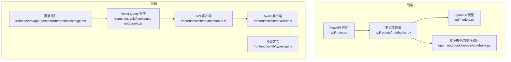
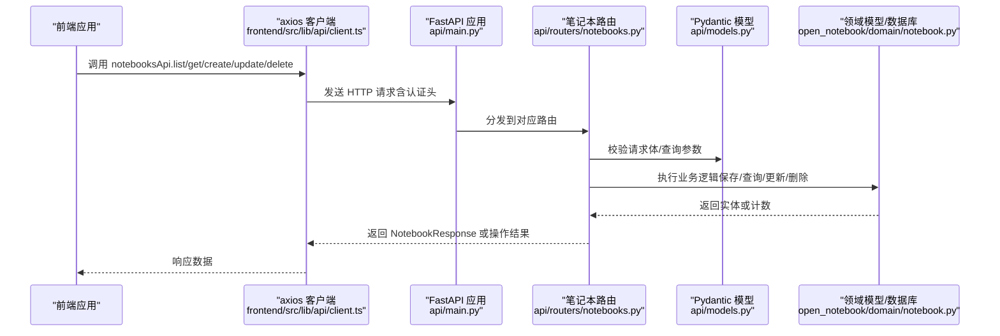
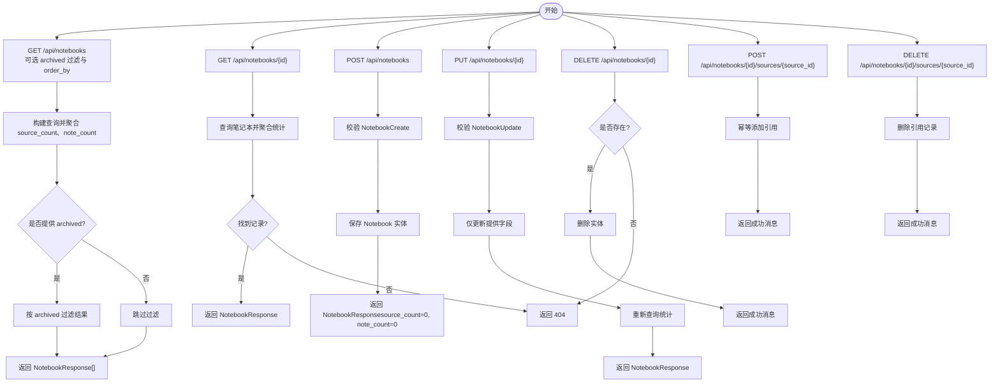
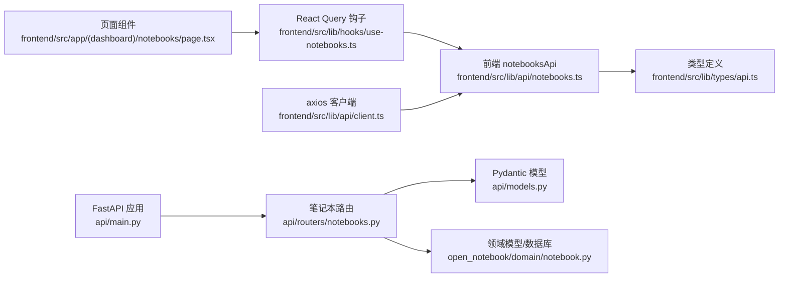

# 笔记本API

<cite>
**本文引用的文件**
- [api/routers/notebooks.py](file://api/routers/notebooks.py)
- [api/models.py](file://api/models.py)
- [api/main.py](file://api/main.py)
- [frontend/src/lib/api/notebooks.ts](file://frontend/src/lib/api/notebooks.ts)
- [frontend/src/lib/types/api.ts](file://frontend/src/lib/types/api.ts)
- [frontend/src/lib/hooks/use-notebooks.ts](file://frontend/src/lib/hooks/use-notebooks.ts)
- [frontend/src/app/(dashboard)/notebooks/page.tsx](file://frontend/src/app/(dashboard)/notebooks/page.tsx)
- [frontend/src/lib/api/client.ts](file://frontend/src/lib/api/client.ts)
- [open_notebook/domain/notebook.py](file://open_notebook/domain/notebook.py)
- [docs/development/api-reference.md](file://docs/development/api-reference.md)
</cite>

## 目录
1. [简介](#简介)
2. [项目结构](#项目结构)
3. [核心组件](#核心组件)
4. [架构总览](#架构总览)
5. [详细组件分析](#详细组件分析)
6. [依赖关系分析](#依赖关系分析)
7. [性能考量](#性能考量)
8. [故障排查指南](#故障排查指南)
9. [结论](#结论)
10. [附录：使用示例与最佳实践](#附录使用示例与最佳实践)

## 简介
本文件面向 open-notebook 的“笔记本管理 API”，系统性梳理创建、读取、更新、删除笔记本的端点，明确请求体与响应体的数据结构、字段语义与验证规则，并解释多笔记本关联能力（通过源与笔记本的多对多引用关系实现）。同时提供基于 curl 与 TypeScript 的典型调用示例，结合前端 API 客户端与 React Query 的错误处理与加载状态管理实践，帮助开发者快速集成与排障。

## 项目结构
- 后端 FastAPI 路由集中于 api/routers/notebooks.py，负责笔记本 CRUD 与与源的关联/解绑。
- Pydantic 数据模型位于 api/models.py，定义 NotebookCreate、NotebookUpdate、NotebookResponse 等。
- 前端 API 客户端封装在 frontend/src/lib/api/notebooks.ts，类型定义在 frontend/src/lib/types/api.ts。
- 前端查询与错误处理使用 React Query 钩子 frontend/src/lib/hooks/use-notebooks.ts。
- 全局应用入口与路由挂载见 api/main.py；前端 axios 客户端在 frontend/src/lib/api/client.ts。

图表来源
- [api/main.py](file://api/main.py#L99-L119)
- [api/routers/notebooks.py](file://api/routers/notebooks.py#L1-L276)
- [api/models.py](file://api/models.py#L1-L425)
- [open_notebook/domain/notebook.py](file://open_notebook/domain/notebook.py#L1-L120)
- [frontend/src/lib/api/notebooks.ts](file://frontend/src/lib/api/notebooks.ts#L1-L38)
- [frontend/src/lib/types/api.ts](file://frontend/src/lib/types/api.ts#L1-L115)
- [frontend/src/lib/hooks/use-notebooks.ts](file://frontend/src/lib/hooks/use-notebooks.ts#L1-L91)
- [frontend/src/lib/api/client.ts](file://frontend/src/lib/api/client.ts#L1-L66)

章节来源
- [api/main.py](file://api/main.py#L99-L119)
- [api/routers/notebooks.py](file://api/routers/notebooks.py#L1-L276)
- [api/models.py](file://api/models.py#L1-L425)
- [frontend/src/lib/api/notebooks.ts](file://frontend/src/lib/api/notebooks.ts#L1-L38)
- [frontend/src/lib/types/api.ts](file://frontend/src/lib/types/api.ts#L1-L115)
- [frontend/src/lib/hooks/use-notebooks.ts](file://frontend/src/lib/hooks/use-notebooks.ts#L1-L91)
- [frontend/src/lib/api/client.ts](file://frontend/src/lib/api/client.ts#L1-L66)

## 核心组件
- 路由层（FastAPI）
  - 列表与过滤：GET /api/notebooks（支持 archived 过滤与 order_by 排序）
  - 单个读取：GET /api/notebooks/{notebook_id}
  - 创建：POST /api/notebooks
  - 更新：PUT /api/notebooks/{notebook_id}
  - 删除：DELETE /api/notebooks/{notebook_id}
  - 关联管理：POST /api/notebooks/{notebook_id}/sources/{source_id}、DELETE /api/notebooks/{notebook_id}/sources/{source_id}
- 模型层（Pydantic）
  - NotebookCreate：name、description
  - NotebookUpdate：name、description、archived
  - NotebookResponse：id、name、description、archived、created、updated、source_count、note_count
- 前端 API 客户端
  - notebooksApi：list、get、create、update、delete、addSource、removeSource
  - 类型定义：NotebookResponse、CreateNotebookRequest、UpdateNotebookRequest
  - 错误处理与加载状态：React Query 钩子 useNotebooks、useCreateNotebook、useUpdateNotebook、useDeleteNotebook

章节来源
- [api/routers/notebooks.py](file://api/routers/notebooks.py#L14-L276)
- [api/models.py](file://api/models.py#L1-L425)
- [frontend/src/lib/api/notebooks.ts](file://frontend/src/lib/api/notebooks.ts#L1-L38)
- [frontend/src/lib/types/api.ts](file://frontend/src/lib/types/api.ts#L1-L115)
- [frontend/src/lib/hooks/use-notebooks.ts](file://frontend/src/lib/hooks/use-notebooks.ts#L1-L91)

## 架构总览
笔记本 API 的调用链路如下：
- 前端通过 notebooksApi 发起请求
- axios 客户端自动注入基础 URL 与认证头
- FastAPI 路由解析请求参数与请求体
- 路由层调用领域模型或数据库访问层执行业务逻辑
- 返回 NotebookResponse 或操作结果

图表来源
- [frontend/src/lib/api/client.ts](file://frontend/src/lib/api/client.ts#L1-L66)
- [api/main.py](file://api/main.py#L99-L119)
- [api/routers/notebooks.py](file://api/routers/notebooks.py#L14-L276)
- [api/models.py](file://api/models.py#L1-L425)
- [open_notebook/domain/notebook.py](file://open_notebook/domain/notebook.py#L1-L120)

## 详细组件分析

### 1) 端点与数据模型

- 列表与过滤：GET /api/notebooks
  - 查询参数
    - archived: 可选布尔值，按归档状态过滤
    - order_by: 字符串，默认 "updated desc"，支持排序字段与方向
  - 响应：NotebookResponse 数组
  - 统计字段：source_count、note_count 通过数据库聚合计算返回

- 单个读取：GET /api/notebooks/{notebook_id}
  - 路径参数：notebook_id
  - 响应：NotebookResponse
  - 异常：未找到返回 404

- 创建：POST /api/notebooks
  - 请求体：NotebookCreate（name、description）
  - 响应：NotebookResponse
  - 异常：输入校验失败返回 400；其他异常返回 500

- 更新：PUT /api/notebooks/{notebook_id}
  - 路径参数：notebook_id
  - 请求体：NotebookUpdate（name、description、archived）
  - 响应：NotebookResponse
  - 异常：未找到返回 404；输入校验失败返回 400；其他异常返回 500

- 删除：DELETE /api/notebooks/{notebook_id}
  - 路径参数：notebook_id
  - 响应：成功消息
  - 异常：未找到返回 404；其他异常返回 500

- 多笔记本关联（源与笔记本）：
  - 添加：POST /api/notebooks/{notebook_id}/sources/{source_id}
  - 移除：DELETE /api/notebooks/{notebook_id}/sources/{source_id}
  - 行为：幂等添加；移除仅删除引用记录

章节来源
- [api/routers/notebooks.py](file://api/routers/notebooks.py#L14-L276)
- [api/models.py](file://api/models.py#L1-L425)

### 2) 字段定义与验证规则

- NotebookCreate
  - name: 必填字符串，非空校验
  - description: 可选字符串

- NotebookUpdate
  - name: 可选字符串
  - description: 可选字符串
  - archived: 可选布尔值

- NotebookResponse
  - id: 字符串（记录标识）
  - name: 字符串
  - description: 字符串
  - archived: 布尔值
  - created: 字符串（时间戳）
  - updated: 字符串（时间戳）
  - source_count: 整数（该笔记本下引用的源数量）
  - note_count: 整数（该笔记本下笔记数量）

- 领域模型校验
  - Notebook.name 非空校验，非法输入抛出 InvalidInputError

章节来源
- [api/models.py](file://api/models.py#L1-L425)
- [open_notebook/domain/notebook.py](file://open_notebook/domain/notebook.py#L16-L28)

### 3) 多笔记本关联能力说明
- 源创建时支持 notebooks 数组（多笔记本），用于一次性将源关联到多个笔记本
- 源详情响应包含 notebooks 字段，表示当前已关联的笔记本 ID 列表
- 前端通过“笔记本关联”组件可勾选多个笔记本，保存时调用 addSource/removeSource 实现批量关联/解绑
- 该能力通过数据库中的 reference 边实现笔记本与源的多对多关联

章节来源
- [api/models.py](file://api/models.py#L271-L345)
- [frontend/src/components/source/NotebookAssociations.tsx](file://frontend/src/components/source/NotebookAssociations.tsx#L1-L163)
- [frontend/src/lib/api/notebooks.ts](file://frontend/src/lib/api/notebooks.ts#L29-L37)

### 4) 前端API客户端与错误处理

- notebooksApi
  - list(params?: { archived?, order_by? }): 获取笔记本列表
  - get(id: string): 获取单个笔记本
  - create(data: CreateNotebookRequest): 创建笔记本
  - update(id: string, data: UpdateNotebookRequest): 更新笔记本
  - delete(id: string): 删除笔记本
  - addSource(notebookId: string, sourceId: string): 将源添加到笔记本
  - removeSource(notebookId: string, sourceId: string): 将源从笔记本移除

- 类型定义
  - NotebookResponse、CreateNotebookRequest、UpdateNotebookRequest

- 错误处理与加载状态
  - useNotebooks：查询笔记本列表，支持 archived 过滤与 order_by
  - useNotebook：查询单个笔记本
  - useCreateNotebook/useUpdateNotebook/useDeleteNotebook：Mutation 包装，统一 onSuccess/onError 提示
  - 页面 NotebooksPage 使用 isLoading/refetch 展示加载与刷新

- axios 客户端
  - 自动设置 baseURL（运行时从配置接口获取）、超时、Content-Type、Authorization 头
  - 401 统一跳转登录

章节来源
- [frontend/src/lib/api/notebooks.ts](file://frontend/src/lib/api/notebooks.ts#L1-L38)
- [frontend/src/lib/types/api.ts](file://frontend/src/lib/types/api.ts#L1-L115)
- [frontend/src/lib/hooks/use-notebooks.ts](file://frontend/src/lib/hooks/use-notebooks.ts#L1-L91)
- [frontend/src/app/(dashboard)/notebooks/page.tsx](file://frontend/src/app/(dashboard)/notebooks/page.tsx#L1-L103)
- [frontend/src/lib/api/client.ts](file://frontend/src/lib/api/client.ts#L1-L66)

### 5) 数据流与处理逻辑

- 列表与过滤流程（GET /api/notebooks）
  - 构造查询，聚合 source_count 与 note_count
  - 可选按 archived 过滤
  - 返回 NotebookResponse 列表

- 单个读取流程（GET /api/notebooks/{notebook_id}）
  - 查询指定笔记本并聚合统计
  - 未找到返回 404

- 创建流程（POST /api/notebooks）
  - 校验 NotebookCreate
  - 保存 Notebook 实体
  - 返回 NotebookResponse（source_count、note_count 初始化为 0）

- 更新流程（PUT /api/notebooks/{notebook_id}）
  - 校验 NotebookUpdate
  - 仅更新提供的字段
  - 重新查询统计并返回最新 NotebookResponse

- 删除流程（DELETE /api/notebooks/{notebook_id}）
  - 校验存在性
  - 删除实体并返回成功消息

- 关联流程（POST/DELETE /api/notebooks/{notebook_id}/sources/{source_id}）
  - 幂等添加/删除 reference 边
  - 返回成功消息

图表来源
- [api/routers/notebooks.py](file://api/routers/notebooks.py#L14-L276)
- [api/models.py](file://api/models.py#L1-L425)

## 依赖关系分析

图表来源
- [frontend/src/lib/api/notebooks.ts](file://frontend/src/lib/api/notebooks.ts#L1-L38)
- [frontend/src/lib/types/api.ts](file://frontend/src/lib/types/api.ts#L1-L115)
- [frontend/src/lib/hooks/use-notebooks.ts](file://frontend/src/lib/hooks/use-notebooks.ts#L1-L91)
- [frontend/src/app/(dashboard)/notebooks/page.tsx](file://frontend/src/app/(dashboard)/notebooks/page.tsx#L1-L103)
- [frontend/src/lib/api/client.ts](file://frontend/src/lib/api/client.ts#L1-L66)
- [api/routers/notebooks.py](file://api/routers/notebooks.py#L14-L276)
- [api/models.py](file://api/models.py#L1-L425)
- [open_notebook/domain/notebook.py](file://open_notebook/domain/notebook.py#L1-L120)
- [api/main.py](file://api/main.py#L99-L119)

章节来源
- [frontend/src/lib/api/notebooks.ts](file://frontend/src/lib/api/notebooks.ts#L1-L38)
- [frontend/src/lib/hooks/use-notebooks.ts](file://frontend/src/lib/hooks/use-notebooks.ts#L1-L91)
- [api/routers/notebooks.py](file://api/routers/notebooks.py#L14-L276)
- [api/models.py](file://api/models.py#L1-L425)
- [open_notebook/domain/notebook.py](file://open_notebook/domain/notebook.py#L1-L120)
- [api/main.py](file://api/main.py#L99-L119)

## 性能考量
- 列表查询中对 source_count 与 note_count 的聚合可能随数据量增长而变慢，建议：
  - 在数据库层面建立合适的索引（如按 updated 排序、按 archived 过滤）
  - 控制 order_by 的字段与范围，避免全表扫描
- 前端缓存策略：
  - 使用 React Query 的查询键与失效策略，减少重复请求
  - 对高频列表页启用本地缓存与分页

[本节为通用建议，不直接分析具体文件]

## 故障排查指南
- 常见错误码
  - 400：输入校验失败（如缺少必填字段、字段为空）
  - 404：资源不存在（笔记本/源）
  - 401：未授权（认证失败）
  - 500：服务器内部错误
- 前端错误处理
  - axios 拦截器对 401 自动清理本地认证并跳转登录
  - React Query Mutation 的 onError 统一提示错误
- 常见问题定位
  - 确认 API_URL 配置正确（浏览器视角），详见部署文档
  - 检查网络连通性与 CORS 设置
  - 查看后端日志与异常栈

章节来源
- [docs/development/api-reference.md](file://docs/development/api-reference.md#L1363-L1403)
- [frontend/src/lib/api/client.ts](file://frontend/src/lib/api/client.ts#L51-L64)
- [frontend/src/lib/hooks/use-notebooks.ts](file://frontend/src/lib/hooks/use-notebooks.ts#L22-L91)

## 结论
笔记本 API 提供了完整的 CRUD 与关联管理能力，配合前端 React Query 与 axios 客户端，能够高效地实现笔记本列表、详情、创建、更新、删除与多笔记本关联。通过清晰的模型定义与严格的校验，确保数据一致性与可维护性。建议在生产环境中关注数据库索引与查询优化，并完善前端的错误提示与加载状态管理。

[本节为总结性内容，不直接分析具体文件]

## 附录：使用示例与最佳实践

### A. curl 示例（典型场景）
- 创建笔记本
  - curl -X POST http://localhost:5055/api/notebooks -H "Content-Type: application/json" -d '{"name": "AI Research", "description": "Research on AI applications"}'
- 获取笔记本列表
  - curl -X GET "http://localhost:5055/api/notebooks?archived=false&order_by=updated desc"
- 获取单个笔记本
  - curl -X GET http://localhost:5055/api/notebooks/{notebook_id}
- 更新笔记本属性
  - curl -X PUT http://localhost:5055/api/notebooks/{notebook_id} -H "Content-Type: application/json" -d '{"name": "Updated Name", "archived": true}'
- 删除笔记本
  - curl -X DELETE http://localhost:5055/api/notebooks/{notebook_id}
- 将源添加到笔记本（多笔记本关联）
  - curl -X POST http://localhost:5055/api/notebooks/{notebook_id}/sources/{source_id}
- 将源从笔记本移除
  - curl -X DELETE http://localhost:5055/api/notebooks/{notebook_id}/sources/{source_id}

章节来源
- [docs/development/api-reference.md](file://docs/development/api-reference.md#L1404-L1437)

### B. TypeScript（前端）示例
- 获取笔记本列表
  - notebooksApi.list({ archived: false, order_by: "updated desc" })
- 获取单个笔记本
  - notebooksApi.get(id)
- 创建笔记本
  - notebooksApi.create({ name: "AI Research", description: "..." })
- 更新笔记本
  - notebooksApi.update(id, { name: "Updated", archived: true })
- 删除笔记本
  - notebooksApi.delete(id)
- 多笔记本关联
  - notebooksApi.addSource(notebookId, sourceId)
  - notebooksApi.removeSource(notebookId, sourceId)

章节来源
- [frontend/src/lib/api/notebooks.ts](file://frontend/src/lib/api/notebooks.ts#L1-L38)
- [frontend/src/lib/types/api.ts](file://frontend/src/lib/types/api.ts#L1-L115)

### C. 加载状态与错误处理最佳实践
- 使用 useNotebooks/useNotebook 获取数据与加载状态
- 使用 useCreateNotebook/useUpdateNotebook/useDeleteNotebook 的 onSuccess/onError 统一提示
- 页面中根据 isLoading 显示加载指示，根据错误进行降级显示
- axios 401 统一处理，跳转登录

章节来源
- [frontend/src/lib/hooks/use-notebooks.ts](file://frontend/src/lib/hooks/use-notebooks.ts#L1-L91)
- [frontend/src/app/(dashboard)/notebooks/page.tsx](file://frontend/src/app/(dashboard)/notebooks/page.tsx#L1-L103)
- [frontend/src/lib/api/client.ts](file://frontend/src/lib/api/client.ts#L51-L64)