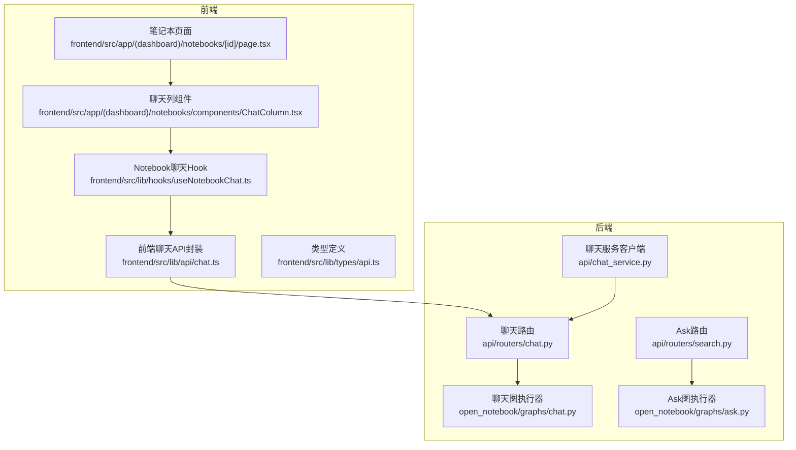
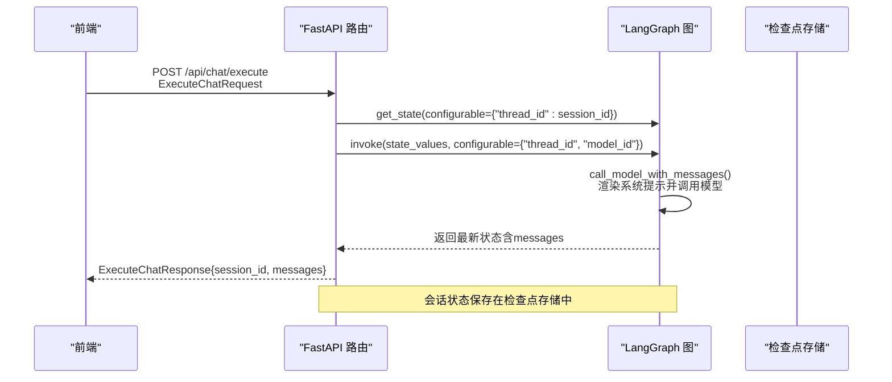
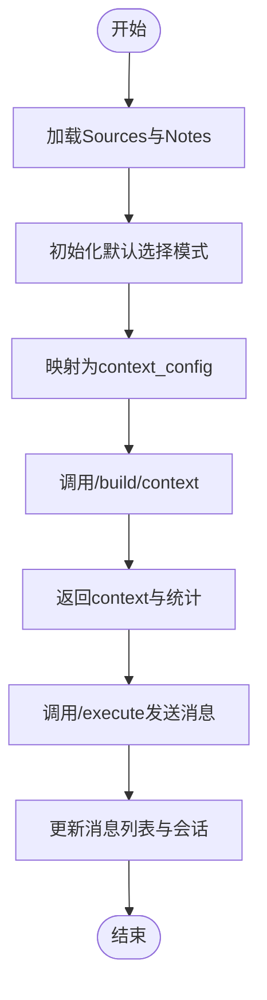
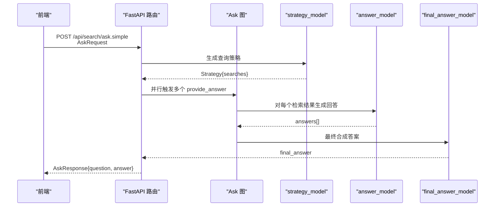
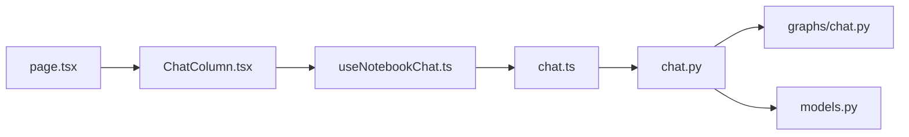

# 聊天API

<cite>
**本文引用的文件**
- [api/routers/chat.py](file://api/routers/chat.py)
- [api/models.py](file://api/models.py)
- [api/chat_service.py](file://api/chat_service.py)
- [open_notebook/graphs/chat.py](file://open_notebook/graphs/chat.py)
- [frontend/src/lib/api/chat.ts](file://frontend/src/lib/api/chat.ts)
- [frontend/src/lib/hooks/useNotebookChat.ts](file://frontend/src/lib/hooks/useNotebookChat.ts)
- [frontend/src/app/(dashboard)/notebooks/[id]/page.tsx](file://frontend/src/app/(dashboard)/notebooks/[id]/page.tsx)
- [frontend/src/app/(dashboard)/notebooks/components/ChatColumn.tsx](file://frontend/src/app/(dashboard)/notebooks/components/ChatColumn.tsx)
- [frontend/src/lib/types/api.ts](file://frontend/src/lib/types/api.ts)
- [api/routers/search.py](file://api/routers/search.py)
- [open_notebook/graphs/ask.py](file://open_notebook/graphs/ask.py)
- [docs/features/citations.md](file://docs/features/citations.md)
- [docs/user-guide/chat.md](file://docs/user-guide/chat.md)
</cite>

## 目录
1. [简介](#简介)
2. [项目结构](#项目结构)
3. [核心组件](#核心组件)
4. [架构总览](#架构总览)
5. [详细组件分析](#详细组件分析)
6. [依赖关系分析](#依赖关系分析)
7. [性能考量](#性能考量)
8. [故障排查指南](#故障排查指南)
9. [结论](#结论)
10. [附录](#附录)

## 简介
本文件面向“聊天功能”的API文档，聚焦于与知识库交互的核心端点，重点说明：
- AskRequest 请求模型中 question、strategy_model、answer_model、final_answer_model 参数的含义与配置方式
- AskResponse 返回的 answer 和 question 结构
- 上下文感知聊天如何通过 Notebook ID 集成相关源（Sources）与笔记（Notes）内容
- 实际调用示例：如何使用不同 AI 模型组合进行查询策略、单个回答生成与最终答案合成
- 前端聊天界面代码如何处理同步消息发送与上下文构建，并说明引用标注在聊天中的呈现方式

## 项目结构
聊天功能由后端 FastAPI 路由、LangGraph 图执行引擎、前端 React Hooks 与类型定义共同组成。核心路径如下：
- 后端路由与服务：api/routers/chat.py、api/chat_service.py、open_notebook/graphs/chat.py
- 前端 API 客户端与 Hook：frontend/src/lib/api/chat.ts、frontend/src/lib/hooks/useNotebookChat.ts
- 类型定义：frontend/src/lib/types/api.ts
- Notebook 页面与聊天列组件：frontend/src/app/(dashboard)/notebooks/[id]/page.tsx、frontend/src/app/(dashboard)/notebooks/components/ChatColumn.tsx
- Ask 功能（知识库问答）：api/routers/search.py、open_notebook/graphs/ask.py
- 引用标注与聊天特性文档：docs/features/citations.md、docs/user-guide/chat.md

图表来源
- [api/routers/chat.py](file://api/routers/chat.py#L1-L494)
- [open_notebook/graphs/chat.py](file://open_notebook/graphs/chat.py#L1-L83)
- [frontend/src/lib/api/chat.ts](file://frontend/src/lib/api/chat.ts#L1-L72)
- [frontend/src/lib/hooks/useNotebookChat.ts](file://frontend/src/lib/hooks/useNotebookChat.ts#L1-L292)
- [frontend/src/app/(dashboard)/notebooks/[id]/page.tsx](file://frontend/src/app/(dashboard)/notebooks/[id]/page.tsx#L1-L225)
- [frontend/src/app/(dashboard)/notebooks/components/ChatColumn.tsx](file://frontend/src/app/(dashboard)/notebooks/components/ChatColumn.tsx#L1-L116)
- [api/routers/search.py](file://api/routers/search.py#L100-L215)
- [open_notebook/graphs/ask.py](file://open_notebook/graphs/ask.py#L1-L135)

章节来源
- [api/routers/chat.py](file://api/routers/chat.py#L1-L494)
- [frontend/src/lib/api/chat.ts](file://frontend/src/lib/api/chat.ts#L1-L72)
- [frontend/src/lib/hooks/useNotebookChat.ts](file://frontend/src/lib/hooks/useNotebookChat.ts#L1-L292)

## 核心组件
- 聊天会话管理与消息执行
  - 会话列表、创建、读取、更新、删除
  - 执行聊天消息，支持上下文注入与模型覆盖
- 上下文构建
  - 基于 Notebook 的 Sources 与 Notes 构建上下文，统计字符数与估算 token 数
- 前端聊天 Hook
  - 自动选择最近会话、构建上下文、发送消息、刷新会话
- Ask 功能（知识库问答）
  - 使用 strategy_model、answer_model、final_answer_model 三段式模型组合
  - 提供流式与非流式两种响应

章节来源
- [api/routers/chat.py](file://api/routers/chat.py#L93-L494)
- [api/models.py](file://api/models.py#L49-L60)
- [frontend/src/lib/hooks/useNotebookChat.ts](file://frontend/src/lib/hooks/useNotebookChat.ts#L124-L232)
- [api/routers/search.py](file://api/routers/search.py#L110-L215)
- [open_notebook/graphs/ask.py](file://open_notebook/graphs/ask.py#L1-L135)

## 架构总览
聊天流程分为两条主线：
- Notebook 聊天（同步消息，非流式）
  - 前端通过 chat.ts 发送 ExecuteChatRequest，后端在 LangGraph 中执行，返回 ExecuteChatResponse
- Ask 知识库问答（可流式）
  - 前端通过 search.py 的 AskRequest，后端在 Ask 图中按策略-搜索-回答-最终合成的流程生成答案

图表来源
- [api/routers/chat.py](file://api/routers/chat.py#L313-L386)
- [open_notebook/graphs/chat.py](file://open_notebook/graphs/chat.py#L1-L83)

章节来源
- [api/routers/chat.py](file://api/routers/chat.py#L313-L386)
- [open_notebook/graphs/chat.py](file://open_notebook/graphs/chat.py#L1-L83)

## 详细组件分析

### 1) Notebook 聊天核心端点
- 会话管理
  - GET /api/chat/sessions?notebook_id=...：列出笔记本下的所有会话
  - POST /api/chat/sessions：创建新会话（可选标题与模型覆盖）
  - GET /api/chat/sessions/{session_id}：获取会话及其消息（从 LangGraph 状态提取）
  - PUT /api/chat/sessions/{session_id}：更新会话标题或模型覆盖
  - DELETE /api/chat/sessions/{session_id}：删除会话
- 执行聊天
  - POST /api/chat/execute：发送用户消息，注入 context 与 model_override，返回最新消息列表
- 构建上下文
  - POST /api/chat/context：根据 context_config（包含 sources 与 notes 的选择模式）构建上下文数据，返回 token_count 与 char_count

请求/响应模型要点
- ExecuteChatRequest
  - session_id：目标会话标识
  - message：用户输入文本
  - context：构建好的上下文对象（包含 sources 与 notes 的片段）
  - model_override：可选，覆盖当前会话的模型
- ExecuteChatResponse
  - session_id：会话标识
  - messages：包含 human/ai 消息的数组
- BuildContextRequest
  - notebook_id：笔记本标识
  - context_config：映射 {source_id: level} 与 {note_id: level}，level 可为 insights/full content/not in
- BuildContextResponse
  - context：包含 sources 与 notes 的上下文片段数组
  - token_count：估算 token 数
  - char_count：字符数

章节来源
- [api/routers/chat.py](file://api/routers/chat.py#L93-L494)
- [frontend/src/lib/types/api.ts](file://frontend/src/lib/types/api.ts#L174-L227)

### 2) 上下文感知聊天与 Notebook 集成
- 前端页面与聊天列
  - Notebook 页面加载时初始化 contextSelections（sources 与 notes 的选择模式），默认依据是否有洞察或是否全量包含
  - ChatColumn 将 contextSelections 传入 useNotebookChat，用于构建上下文
- 上下文构建逻辑
  - useNotebookChat.buildContext：将 sources 与 notes 的选择映射为 context_config，调用 /api/chat/context 获取实际上下文内容与统计信息
  - sendMessage：自动创建会话（如不存在）、构建上下文、调用 /api/chat/execute 发送消息

图表来源
- [frontend/src/app/(dashboard)/notebooks/[id]/page.tsx](file://frontend/src/app/(dashboard)/notebooks/[id]/page.tsx#L46-L95)
- [frontend/src/app/(dashboard)/notebooks/components/ChatColumn.tsx](file://frontend/src/app/(dashboard)/notebooks/components/ChatColumn.tsx#L1-L116)
- [frontend/src/lib/hooks/useNotebookChat.ts](file://frontend/src/lib/hooks/useNotebookChat.ts#L124-L166)
- [api/routers/chat.py](file://api/routers/chat.py#L388-L494)

章节来源
- [frontend/src/app/(dashboard)/notebooks/[id]/page.tsx](file://frontend/src/app/(dashboard)/notebooks/[id]/page.tsx#L46-L95)
- [frontend/src/app/(dashboard)/notebooks/components/ChatColumn.tsx](file://frontend/src/app/(dashboard)/notebooks/components/ChatColumn.tsx#L1-L116)
- [frontend/src/lib/hooks/useNotebookChat.ts](file://frontend/src/lib/hooks/useNotebookChat.ts#L124-L166)
- [api/routers/chat.py](file://api/routers/chat.py#L388-L494)

### 3) AskRequest 与 AskResponse：模型组合与返回结构
- AskRequest（来自知识库问答）
  - question：问题文本
  - strategy_model：用于生成查询策略的模型 ID
  - answer_model：用于对每个检索结果生成独立回答的模型 ID
  - final_answer_model：用于最终合成答案的模型 ID
- AskResponse
  - answer：最终答案
  - question：原始问题（便于前端显示）

图表来源
- [api/routers/search.py](file://api/routers/search.py#L110-L215)
- [open_notebook/graphs/ask.py](file://open_notebook/graphs/ask.py#L1-L135)
- [api/models.py](file://api/models.py#L49-L60)

章节来源
- [api/routers/search.py](file://api/routers/search.py#L110-L215)
- [open_notebook/graphs/ask.py](file://open_notebook/graphs/ask.py#L1-L135)
- [api/models.py](file://api/models.py#L49-L60)

### 4) 流式响应与引用标注（上下文指示）
- Notebook 聊天（同步）：当前前端实现为同步发送与接收，不使用流式传输
- 源级聊天（Source Chat）：存在流式端点，支持分块推送 ai_message、context_indicators 与 complete/error 事件
- 引用标注（Citations）：在聊天中，当 AI 引用来源时，会在消息中标注来源编号；前端可基于 context_indicators 或消息内的引用标记进行展示

章节来源
- [frontend/src/lib/hooks/useSourceChat.ts](file://frontend/src/lib/hooks/useSourceChat.ts#L102-L184)
- [frontend/src/lib/api/source-chat.ts](file://frontend/src/lib/api/source-chat.ts#L48-L85)
- [docs/features/citations.md](file://docs/features/citations.md#L29-L96)
- [docs/user-guide/chat.md](file://docs/user-guide/chat.md#L215-L248)

### 5) 前端聊天界面与 Hook 行为
- useNotebookChat
  - 自动选择最近会话；若无会话则在首次发送消息时自动创建
  - buildContext：将 sources/notes 的选择映射为 context_config，调用 /api/chat/context 获取上下文与统计
  - sendMessage：乐观地添加用户消息，调用 /api/chat/execute 获取最新消息并刷新会话
- ChatColumn
  - 展示聊天面板，绑定 onSendMessage、onModelChange、会话 CRUD 等操作
- 类型定义
  - NotebookChatSession、NotebookChatMessage、SendNotebookChatMessageRequest、BuildContextRequest/Response 等

章节来源
- [frontend/src/lib/hooks/useNotebookChat.ts](file://frontend/src/lib/hooks/useNotebookChat.ts#L1-L292)
- [frontend/src/app/(dashboard)/notebooks/components/ChatColumn.tsx](file://frontend/src/app/(dashboard)/notebooks/components/ChatColumn.tsx#L1-L116)
- [frontend/src/lib/types/api.ts](file://frontend/src/lib/types/api.ts#L174-L227)

## 依赖关系分析
- 后端耦合
  - 路由层依赖 LangGraph 图执行器，通过 configurable.thread_id 与 configurable.model_id 控制会话与模型
  - 上下文构建依赖 Notebook/Sources/Notes 的领域模型与工具函数
- 前端耦合
  - useNotebookChat 依赖 chat.ts 的 API 方法与 react-query 进行缓存与刷新
  - ChatColumn 依赖 useNotebookChat 的状态与动作
- 外部依赖
  - LangChain 模型提供器、SQLite 检查点存储

图表来源
- [frontend/src/lib/hooks/useNotebookChat.ts](file://frontend/src/lib/hooks/useNotebookChat.ts#L1-L292)
- [frontend/src/lib/api/chat.ts](file://frontend/src/lib/api/chat.ts#L1-L72)
- [api/routers/chat.py](file://api/routers/chat.py#L1-L494)
- [open_notebook/graphs/chat.py](file://open_notebook/graphs/chat.py#L1-L83)
- [api/models.py](file://api/models.py#L1-L120)
- [frontend/src/app/(dashboard)/notebooks/[id]/page.tsx](file://frontend/src/app/(dashboard)/notebooks/[id]/page.tsx#L1-L225)
- [frontend/src/app/(dashboard)/notebooks/components/ChatColumn.tsx](file://frontend/src/app/(dashboard)/notebooks/components/ChatColumn.tsx#L1-L116)

章节来源
- [frontend/src/lib/hooks/useNotebookChat.ts](file://frontend/src/lib/hooks/useNotebookChat.ts#L1-L292)
- [api/routers/chat.py](file://api/routers/chat.py#L1-L494)
- [open_notebook/graphs/chat.py](file://open_notebook/graphs/chat.py#L1-L83)

## 性能考量
- 上下文大小控制
  - 通过 context_config 控制仅包含 insights 或 full content，避免过长上下文导致 token 超限
  - 构建上下文时计算 char_count 与 token_count，辅助前端预估成本
- 模型选择
  - strategy_model 用于策略生成，answer_model 用于细粒度回答，final_answer_model 用于最终合成，建议根据任务复杂度选择不同能力的模型
- 会话状态
  - LangGraph 使用 SQLite 检查点持久化，减少重复计算；注意并发访问时的线程安全

章节来源
- [api/routers/chat.py](file://api/routers/chat.py#L388-L494)
- [open_notebook/graphs/chat.py](file://open_notebook/graphs/chat.py#L1-L83)

## 故障排查指南
- 会话不存在
  - 现象：404 会话未找到
  - 排查：确认 session_id 是否带前缀 chat_session:，或是否正确创建
- 模型不可用
  - 现象：Ask 端点报错提示需要嵌入模型
  - 排查：在“模型”设置中配置嵌入模型
- 上下文构建失败
  - 现象：构建上下文时报错
  - 排查：检查 context_config 中的 source_id/note_id 是否存在且格式正确
- 前端发送失败
  - 现象：sendMessage 报错或消息未更新
  - 排查：查看 useNotebookChat 的错误 toast 与网络日志，确认 /api/chat/execute 返回

章节来源
- [api/routers/search.py](file://api/routers/search.py#L110-L215)
- [api/routers/chat.py](file://api/routers/chat.py#L313-L386)
- [frontend/src/lib/hooks/useNotebookChat.ts](file://frontend/src/lib/hooks/useNotebookChat.ts#L167-L232)

## 结论
- Notebook 聊天提供简洁的上下文感知对话体验，适合快速问答与笔记/源内容联动
- Ask 功能通过三段式模型组合实现从策略到最终答案的完整流程，适合复杂研究性问题
- 前端通过 useNotebookChat 将上下文构建与消息发送解耦，提升用户体验
- 引用标注在聊天中以来源编号形式出现，有助于溯源与验证

## 附录

### A. API 端点一览（聊天）
- GET /api/chat/sessions?notebook_id=...
- POST /api/chat/sessions
- GET /api/chat/sessions/{session_id}
- PUT /api/chat/sessions/{session_id}
- DELETE /api/chat/sessions/{session_id}
- POST /api/chat/execute
- POST /api/chat/context

章节来源
- [api/routers/chat.py](file://api/routers/chat.py#L93-L494)

### B. Ask 端点（知识库问答）
- POST /api/search/ask（流式）
- POST /api/search/ask/simple（非流式）

章节来源
- [api/routers/search.py](file://api/routers/search.py#L110-L215)

### C. 请求/响应模型摘要
- ExecuteChatRequest：session_id, message, context, model_override
- ExecuteChatResponse：session_id, messages
- BuildContextRequest：notebook_id, context_config
- BuildContextResponse：context, token_count, char_count
- AskRequest：question, strategy_model, answer_model, final_answer_model
- AskResponse：answer, question

章节来源
- [api/routers/chat.py](file://api/routers/chat.py#L61-L86)
- [api/models.py](file://api/models.py#L49-L60)
- [frontend/src/lib/types/api.ts](file://frontend/src/lib/types/api.ts#L174-L227)

### D. 实际调用示例（步骤说明）
- Notebook 聊天
  - 步骤1：调用 /api/chat/sessions?notebook_id=... 获取会话列表
  - 步骤2：若无会话，调用 /api/chat/sessions 创建会话
  - 步骤3：调用 /api/chat/context 构建 context_config，得到 context 与统计
  - 步骤4：调用 /api/chat/execute 发送消息，获得最新 messages
- Ask 知识库问答
  - 步骤1：准备 AskRequest（question + 三个模型 ID）
  - 步骤2：调用 /api/search/ask.simple 获取最终答案
  - 或调用 /api/search/ask 进行流式输出（需前端解析 SSE）

章节来源
- [frontend/src/lib/hooks/useNotebookChat.ts](file://frontend/src/lib/hooks/useNotebookChat.ts#L167-L232)
- [api/routers/search.py](file://api/routers/search.py#L110-L215)