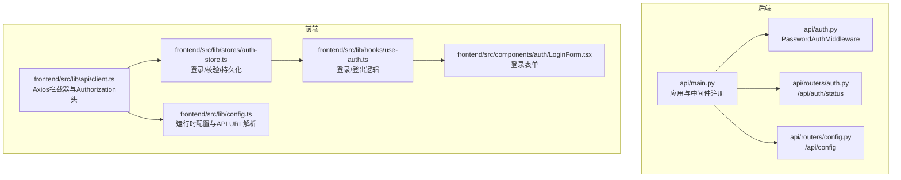
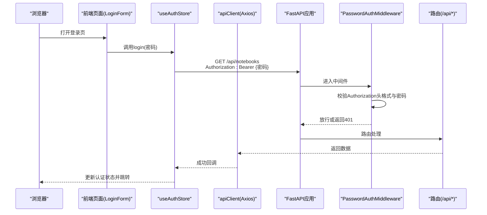
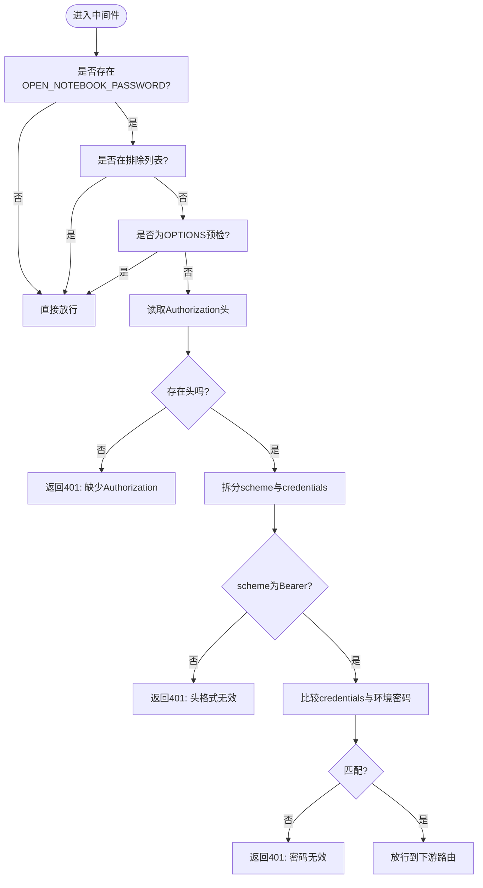
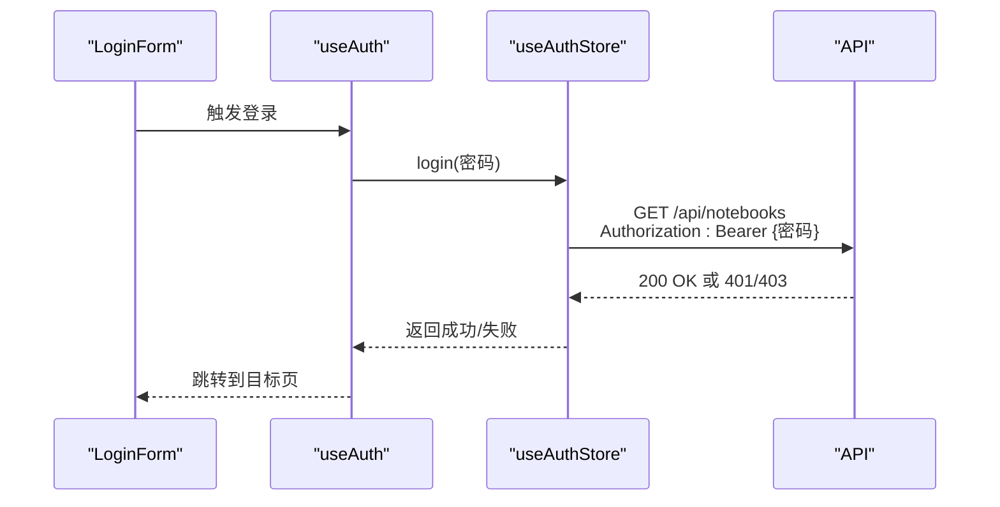
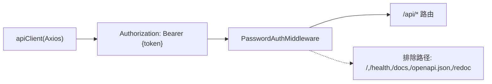

# 认证与安全API

<cite>
**本文引用的文件**
- [api/auth.py](file://api/auth.py)
- [api/main.py](file://api/main.py)
- [api/routers/auth.py](file://api/routers/auth.py)
- [api/routers/config.py](file://api/routers/config.py)
- [frontend/src/lib/api/client.ts](file://frontend/src/lib/api/client.ts)
- [frontend/src/lib/stores/auth-store.ts](file://frontend/src/lib/stores/auth-store.ts)
- [frontend/src/lib/hooks/use-auth.ts](file://frontend/src/lib/hooks/use-auth.ts)
- [frontend/src/components/auth/LoginForm.tsx](file://frontend/src/components/auth/LoginForm.tsx)
- [frontend/src/lib/config.ts](file://frontend/src/lib/config.ts)
- [.env.example](file://.env.example)
- [docs/deployment/security.md](file://docs/deployment/security.md)
</cite>

## 目录
1. [简介](#简介)
2. [项目结构](#项目结构)
3. [核心组件](#核心组件)
4. [架构总览](#架构总览)
5. [详细组件分析](#详细组件分析)
6. [依赖关系分析](#依赖关系分析)
7. [性能考虑](#性能考虑)
8. [故障排查指南](#故障排查指南)
9. [结论](#结论)

## 简介
本文件面向系统认证与安全，聚焦于当前实现的“密码保护”认证机制，而非JWT令牌方案。内容涵盖：
- 密码保护的启用方式与生效范围
- 前端登录流程与会话管理
- 后端中间件对API访问的统一鉴权
- 在API请求中正确设置Authorization头的方法
- 安全最佳实践与注意事项

注意：当前仓库未实现JWT令牌的获取、刷新与验证流程；系统采用“明文密码作为令牌”的简单保护模式。本文将基于现有代码进行准确说明，并在适用处给出安全建议。

## 项目结构
认证与安全相关的核心位置如下：
- 后端FastAPI应用与中间件：api/main.py、api/auth.py
- 认证状态查询接口：api/routers/auth.py
- 运行时配置与健康检查：api/routers/config.py
- 前端API客户端与认证状态管理：frontend/src/lib/api/client.ts、frontend/src/lib/stores/auth-store.ts、frontend/src/lib/hooks/use-auth.ts、frontend/src/components/auth/LoginForm.tsx、frontend/src/lib/config.ts
- 环境变量与部署安全文档：.env.example、docs/deployment/security.md

图表来源
- [api/main.py](file://api/main.py#L86-L97)
- [api/auth.py](file://api/auth.py#L10-L66)
- [api/routers/auth.py](file://api/routers/auth.py#L13-L24)
- [api/routers/config.py](file://api/routers/config.py#L125-L163)
- [frontend/src/lib/api/client.ts](file://frontend/src/lib/api/client.ts#L1-L66)
- [frontend/src/lib/stores/auth-store.ts](file://frontend/src/lib/stores/auth-store.ts#L1-L222)
- [frontend/src/lib/hooks/use-auth.ts](file://frontend/src/lib/hooks/use-auth.ts#L1-L68)
- [frontend/src/components/auth/LoginForm.tsx](file://frontend/src/components/auth/LoginForm.tsx#L1-L185)
- [frontend/src/lib/config.ts](file://frontend/src/lib/config.ts#L1-L148)

章节来源
- [api/main.py](file://api/main.py#L86-L97)
- [api/auth.py](file://api/auth.py#L10-L66)
- [api/routers/auth.py](file://api/routers/auth.py#L13-L24)
- [api/routers/config.py](file://api/routers/config.py#L125-L163)
- [frontend/src/lib/api/client.ts](file://frontend/src/lib/api/client.ts#L1-L66)
- [frontend/src/lib/stores/auth-store.ts](file://frontend/src/lib/stores/auth-store.ts#L1-L222)
- [frontend/src/lib/hooks/use-auth.ts](file://frontend/src/lib/hooks/use-auth.ts#L1-L68)
- [frontend/src/components/auth/LoginForm.tsx](file://frontend/src/components/auth/LoginForm.tsx#L1-L185)
- [frontend/src/lib/config.ts](file://frontend/src/lib/config.ts#L1-L148)

## 核心组件
- 后端中间件 PasswordAuthMiddleware：对所有受保护API路径统一校验Authorization头中的密码，支持排除路径与CORS预检。
- 认证状态接口 /api/auth/status：返回是否启用密码保护。
- 前端认证状态管理 useAuthStore：负责登录、会话校验、错误处理与持久化。
- 前端API客户端 apiClient：自动注入Authorization头，处理401错误并重定向到登录页。
- 配置解析 frontend/src/lib/config.ts：动态确定API URL，避免硬编码。

章节来源
- [api/auth.py](file://api/auth.py#L10-L66)
- [api/routers/auth.py](file://api/routers/auth.py#L13-L24)
- [frontend/src/lib/stores/auth-store.ts](file://frontend/src/lib/stores/auth-store.ts#L1-L222)
- [frontend/src/lib/api/client.ts](file://frontend/src/lib/api/client.ts#L1-L66)
- [frontend/src/lib/config.ts](file://frontend/src/lib/config.ts#L1-L148)

## 架构总览
下图展示从浏览器到后端API的认证与访问流程，以及前端如何通过拦截器自动携带Authorization头。

图表来源
- [frontend/src/components/auth/LoginForm.tsx](file://frontend/src/components/auth/LoginForm.tsx#L126-L185)
- [frontend/src/lib/stores/auth-store.ts](file://frontend/src/lib/stores/auth-store.ts#L77-L139)
- [frontend/src/lib/api/client.ts](file://frontend/src/lib/api/client.ts#L19-L49)
- [api/main.py](file://api/main.py#L86-L97)
- [api/auth.py](file://api/auth.py#L21-L66)
- [api/routers/notebooks.py](file://api/routers/notebooks.py#L1-L50)

章节来源
- [frontend/src/components/auth/LoginForm.tsx](file://frontend/src/components/auth/LoginForm.tsx#L126-L185)
- [frontend/src/lib/stores/auth-store.ts](file://frontend/src/lib/stores/auth-store.ts#L77-L139)
- [frontend/src/lib/api/client.ts](file://frontend/src/lib/api/client.ts#L19-L49)
- [api/main.py](file://api/main.py#L86-L97)
- [api/auth.py](file://api/auth.py#L21-L66)

## 详细组件分析

### 后端中间件：PasswordAuthMiddleware
- 生效条件：当环境变量 OPEN_NOTEBOOK_PASSWORD 设置时启用；否则跳过认证。
- 排除规则：根路径、健康检查、OpenAPI文档、CORS预检等。
- 校验逻辑：
  - 缺失Authorization头：返回401并提示WWW-Authenticate: Bearer
  - 头部格式不为“Bearer {密码}”：返回401
  - 密码不匹配：返回401
  - 其他情况：放行请求
- 另有工具函数 check_api_password，可作为路由级依赖使用。

图表来源
- [api/auth.py](file://api/auth.py#L10-L66)

章节来源
- [api/auth.py](file://api/auth.py#L10-L66)

### 认证状态接口：/api/auth/status
- 功能：判断是否启用密码保护（基于环境变量），返回布尔值与消息。
- 前端用途：用于决定是否显示登录表单、是否需要进行会话校验。

章节来源
- [api/routers/auth.py](file://api/routers/auth.py#L13-L24)
- [frontend/src/lib/stores/auth-store.ts](file://frontend/src/lib/stores/auth-store.ts#L37-L75)

### 前端登录与会话管理
- 登录流程：
  - 用户输入密码，前端调用 login(password)
  - login内部向 /api/notebooks 发起GET请求，携带 Authorization: Bearer {password}
  - 若成功，更新本地状态为已认证并持久化token
- 会话校验：
  - 检查是否已认证且最近校验时间在30秒内则复用结果
  - 否则再次向 /api/notebooks 发送带Authorization头的请求进行校验
- 登出：
  - 清空认证状态与token
- 重定向：
  - 登录成功后根据存储的重定向路径跳转，否则默认跳转到笔记本页

图表来源
- [frontend/src/components/auth/LoginForm.tsx](file://frontend/src/components/auth/LoginForm.tsx#L126-L185)
- [frontend/src/lib/hooks/use-auth.ts](file://frontend/src/lib/hooks/use-auth.ts#L41-L68)
- [frontend/src/lib/stores/auth-store.ts](file://frontend/src/lib/stores/auth-store.ts#L77-L139)

章节来源
- [frontend/src/components/auth/LoginForm.tsx](file://frontend/src/components/auth/LoginForm.tsx#L126-L185)
- [frontend/src/lib/hooks/use-auth.ts](file://frontend/src/lib/hooks/use-auth.ts#L41-L68)
- [frontend/src/lib/stores/auth-store.ts](file://frontend/src/lib/stores/auth-store.ts#L77-L139)

### 前端API客户端与Authorization头
- 请求拦截器：
  - 动态设置 baseURL 为 {API_URL}/api
  - 从本地持久化的认证状态中读取 token，并设置 Authorization: Bearer {token}
- 响应拦截器：
  - 对401错误清理本地认证状态并重定向到登录页

章节来源
- [frontend/src/lib/api/client.ts](file://frontend/src/lib/api/client.ts#L19-L49)
- [frontend/src/lib/api/client.ts](file://frontend/src/lib/api/client.ts#L51-L66)
- [frontend/src/lib/stores/auth-store.ts](file://frontend/src/lib/stores/auth-store.ts#L1-L222)

### 运行时配置与API URL解析
- 前端优先从服务器端 /config 获取运行时配置，其次回退到构建期环境变量 NEXT_PUBLIC_API_URL，最后根据当前前端URL推断默认API地址
- 该机制确保同一容器镜像在不同部署环境下无需重新构建即可工作

章节来源
- [frontend/src/lib/config.ts](file://frontend/src/lib/config.ts#L22-L148)

## 依赖关系分析
- 应用启动时注册 PasswordAuthMiddleware，并将其置于CORS之前，确保跨域预检与后续路由均受保护
- 中间件排除路径包含根路径、健康检查、OpenAPI文档与CORS预检，避免影响开发体验与反向代理场景
- 前端通过Axios拦截器自动注入Authorization头，减少各业务模块的手动重复

图表来源
- [api/main.py](file://api/main.py#L86-L97)
- [api/auth.py](file://api/auth.py#L16-L33)
- [frontend/src/lib/api/client.ts](file://frontend/src/lib/api/client.ts#L19-L49)

章节来源
- [api/main.py](file://api/main.py#L86-L97)
- [api/auth.py](file://api/auth.py#L16-L33)
- [frontend/src/lib/api/client.ts](file://frontend/src/lib/api/client.ts#L19-L49)

## 性能考虑
- 中间件仅做轻量校验（字符串比较），对整体性能影响极小
- 前端会话校验增加一次网络往返，但通过30秒缓存避免频繁校验
- 建议：
  - 尽量使用HTTPS，避免明文传输密码
  - 控制API调用频率，避免不必要的重复校验

[本节为通用建议，不直接分析具体文件]

## 故障排查指南
- 401 Unauthorized
  - 检查Authorization头格式是否为“Bearer {密码}”
  - 确认 OPEN_NOTEBOOK_PASSWORD 是否正确设置且与前端一致
  - 使用 /api/auth/status 判断是否启用了密码保护
- 登录后仍被重定向到登录页
  - 检查本地持久化存储是否被清理
  - 确认 /api/notebooks 能够正常返回200
- 无法连接API
  - 使用 /api/config 检查后端版本与数据库状态
  - 检查前端运行时配置是否正确解析到API URL

章节来源
- [docs/deployment/security.md](file://docs/deployment/security.md#L382-L434)
- [api/routers/auth.py](file://api/routers/auth.py#L13-L24)
- [api/routers/config.py](file://api/routers/config.py#L125-L163)
- [frontend/src/lib/api/client.ts](file://frontend/src/lib/api/client.ts#L51-L66)

## 结论
- 当前系统采用“明文密码即令牌”的简单认证模式，通过中间件统一拦截并校验Authorization头
- 前端提供登录、会话校验与持久化能力，并在401时自动清理状态并重定向
- 未实现JWT令牌的获取、刷新与验证流程；若需升级为JWT，请参考安全最佳实践并在后端引入JWT库与前端令牌存储策略

[本节为总结性内容，不直接分析具体文件]