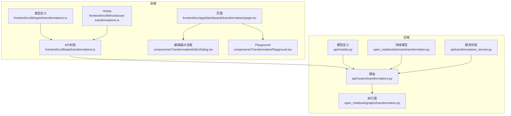
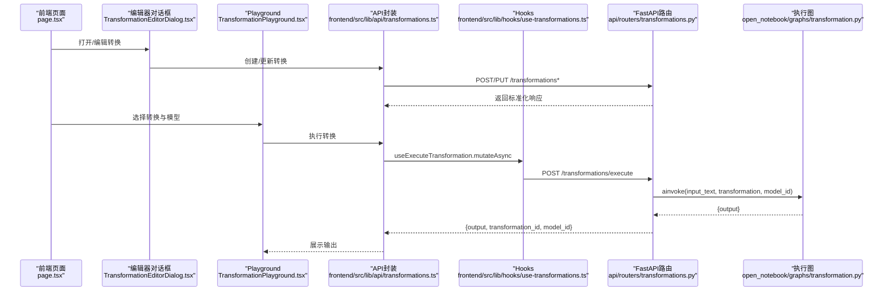
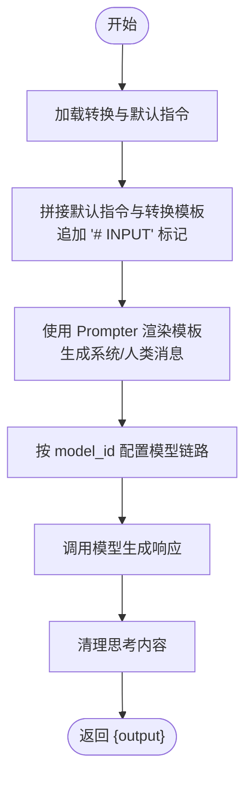
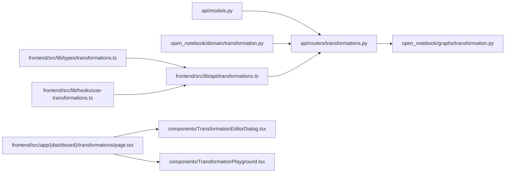

# 转换功能API

<cite>
**本文引用的文件列表**
- [api/routers/transformations.py](file://api/routers/transformations.py)
- [api/models.py](file://api/models.py)
- [open_notebook/domain/transformation.py](file://open_notebook/domain/transformation.py)
- [open_notebook/graphs/transformation.py](file://open_notebook/graphs/transformation.py)
- [api/transformations_service.py](file://api/transformations_service.py)
- [frontend/src/lib/types/transformations.ts](file://frontend/src/lib/types/transformations.ts)
- [frontend/src/lib/api/transformations.ts](file://frontend/src/lib/api/transformations.ts)
- [frontend/src/lib/hooks/use-transformations.ts](file://frontend/src/lib/hooks/use-transformations.ts)
- [frontend/src/app/(dashboard)/transformations/page.tsx](file://frontend/src/app/(dashboard)/transformations/page.tsx)
- [frontend/src/app/(dashboard)/transformations/components/TransformationEditorDialog.tsx](file://frontend/src/app/(dashboard)/transformations/components/TransformationEditorDialog.tsx)
- [frontend/src/app/(dashboard)/transformations/components/TransformationPlayground.tsx](file://frontend/src/app/(dashboard)/transformations/components/TransformationPlayground.tsx)
- [docs/features/transformations.md](file://docs/features/transformations.md)
</cite>

## 目录
1. [简介](#简介)
2. [项目结构](#项目结构)
3. [核心组件](#核心组件)
4. [架构总览](#架构总览)
5. [详细组件分析](#详细组件分析)
6. [依赖关系分析](#依赖关系分析)
7. [性能与可用性考量](#性能与可用性考量)
8. [故障排查指南](#故障排查指南)
9. [结论](#结论)
10. [附录：API参考与示例](#附录api参考与示例)

## 简介
本文件面向内容转换（Transformations）功能的API文档，聚焦以下目标：
- 详述 TransformationCreate 中 name、title、description、prompt、apply_default 字段的用途，重点解释 prompt 字段如何使用 Jinja2 模板语法定义转换逻辑。
- 说明 TransformationUpdate 的可选更新机制。
- 解释 TransformationExecuteRequest 如何通过 transformation_id、input_text 和 model_id 执行即时转换，并描述 TransformationExecuteResponse 的 output 结果结构。
- 提供示例：如何创建自定义转换模板并应用于文本处理。
- 结合前端转换编辑器代码，说明转换的测试与调试流程（Playground）。

## 项目结构
转换功能由后端 FastAPI 路由、领域模型、图编排执行器以及前端编辑器与Playground共同组成。关键模块如下：
- 后端路由与模型：api/routers/transformations.py、api/models.py
- 领域模型：open_notebook/domain/transformation.py
- 执行图：open_notebook/graphs/transformation.py
- 服务封装：api/transformations_service.py
- 前端类型与API：frontend/src/lib/types/transformations.ts、frontend/src/lib/api/transformations.ts
- 前端Hook与页面：frontend/src/lib/hooks/use-transformations.ts、frontend/src/app/(dashboard)/transformations/page.tsx、components/TransformationEditorDialog.tsx、components/TransformationPlayground.tsx
- 文档与最佳实践：docs/features/transformations.md

图表来源
- [api/routers/transformations.py](file://api/routers/transformations.py#L1-L248)
- [api/models.py](file://api/models.py#L100-L170)
- [open_notebook/domain/transformation.py](file://open_notebook/domain/transformation.py#L1-L22)
- [open_notebook/graphs/transformation.py](file://open_notebook/graphs/transformation.py#L1-L66)
- [api/transformations_service.py](file://api/transformations_service.py#L1-L130)
- [frontend/src/lib/types/transformations.ts](file://frontend/src/lib/types/transformations.ts#L1-L42)
- [frontend/src/lib/api/transformations.ts](file://frontend/src/lib/api/transformations.ts#L1-L50)
- [frontend/src/lib/hooks/use-transformations.ts](file://frontend/src/lib/hooks/use-transformations.ts#L1-L148)
- [frontend/src/app/(dashboard)/transformations/page.tsx](file://frontend/src/app/(dashboard)/transformations/page.tsx#L1-L79)
- [frontend/src/app/(dashboard)/transformations/components/TransformationEditorDialog.tsx](file://frontend/src/app/(dashboard)/transformations/components/TransformationEditorDialog.tsx#L1-L242)
- [frontend/src/app/(dashboard)/transformations/components/TransformationPlayground.tsx](file://frontend/src/app/(dashboard)/transformations/components/TransformationPlayground.tsx#L1-L133)

章节来源
- [api/routers/transformations.py](file://api/routers/transformations.py#L1-L248)
- [api/models.py](file://api/models.py#L100-L170)
- [open_notebook/domain/transformation.py](file://open_notebook/domain/transformation.py#L1-L22)
- [open_notebook/graphs/transformation.py](file://open_notebook/graphs/transformation.py#L1-L66)
- [api/transformations_service.py](file://api/transformations_service.py#L1-L130)
- [frontend/src/lib/types/transformations.ts](file://frontend/src/lib/types/transformations.ts#L1-L42)
- [frontend/src/lib/api/transformations.ts](file://frontend/src/lib/api/transformations.ts#L1-L50)
- [frontend/src/lib/hooks/use-transformations.ts](file://frontend/src/lib/hooks/use-transformations.ts#L1-L148)
- [frontend/src/app/(dashboard)/transformations/page.tsx](file://frontend/src/app/(dashboard)/transformations/page.tsx#L1-L79)
- [frontend/src/app/(dashboard)/transformations/components/TransformationEditorDialog.tsx](file://frontend/src/app/(dashboard)/transformations/components/TransformationEditorDialog.tsx#L1-L242)
- [frontend/src/app/(dashboard)/transformations/components/TransformationPlayground.tsx](file://frontend/src/app/(dashboard)/transformations/components/TransformationPlayground.tsx#L1-L133)

## 核心组件
- TransformationCreate：创建转换时的请求体，包含 name、title、description、prompt、apply_default。
- TransformationUpdate：更新转换时的可选字段集合，支持仅更新部分字段。
- TransformationExecuteRequest：执行转换的请求体，包含 transformation_id、input_text、model_id。
- TransformationExecuteResponse：执行结果，包含 output、transformation_id、model_id。
- DefaultPromptResponse/DefaultPromptUpdate：默认提示词的读取与更新。
- 领域模型 Transformation：持久化实体，包含 name、title、description、prompt、apply_default。
- 执行图 transformation：将 prompt 渲染为系统消息，调用模型生成输出，并清理思考内容。

章节来源
- [api/models.py](file://api/models.py#L100-L170)
- [open_notebook/domain/transformation.py](file://open_notebook/domain/transformation.py#L1-L22)
- [open_notebook/graphs/transformation.py](file://open_notebook/graphs/transformation.py#L1-L66)

## 架构总览
后端路由负责接收请求、校验资源存在性、调用执行图完成转换，并返回标准化响应；前端通过API封装与Hooks进行交互，编辑器用于创建/更新转换，Playground用于即时测试。

图表来源
- [frontend/src/app/(dashboard)/transformations/page.tsx](file://frontend/src/app/(dashboard)/transformations/page.tsx#L1-L79)
- [frontend/src/app/(dashboard)/transformations/components/TransformationEditorDialog.tsx](file://frontend/src/app/(dashboard)/transformations/components/TransformationEditorDialog.tsx#L1-L242)
- [frontend/src/app/(dashboard)/transformations/components/TransformationPlayground.tsx](file://frontend/src/app/(dashboard)/transformations/components/TransformationPlayground.tsx#L1-L133)
- [frontend/src/lib/api/transformations.ts](file://frontend/src/lib/api/transformations.ts#L1-L50)
- [frontend/src/lib/hooks/use-transformations.ts](file://frontend/src/lib/hooks/use-transformations.ts#L104-L117)
- [api/routers/transformations.py](file://api/routers/transformations.py#L81-L116)
- [open_notebook/graphs/transformation.py](file://open_notebook/graphs/transformation.py#L1-L66)

## 详细组件分析

### 请求与响应模型
- TransformationCreate
  - name：内部标识符，用于区分不同转换。
  - title：显示在卡片上的标题。
  - description：转换目的的简要说明。
  - prompt：Jinja2 模板字符串，定义转换逻辑与输出格式。
  - apply_default：是否建议在新来源上默认应用该转换。
- TransformationUpdate
  - 支持仅传入需要更新的字段，未提供的字段保持不变。
- TransformationExecuteRequest
  - transformation_id：目标转换的唯一标识。
  - input_text：待处理的文本内容。
  - model_id：用于执行转换的语言模型ID。
- TransformationExecuteResponse
  - output：转换后的文本结果。
  - transformation_id：使用的转换ID。
  - model_id：使用的模型ID。

章节来源
- [api/models.py](file://api/models.py#L100-L170)

### 领域模型与持久化
- Transformation
  - 字段：name、title、description、prompt、apply_default。
  - 作为对象存储在数据库表 transformation 中。
- DefaultPrompts
  - 记录键值 open_notebook:default_prompts，保存 transformation_instructions。
  - 执行时会将默认指令拼接到每个转换的 prompt 前面，形成统一风格与约束。

章节来源
- [open_notebook/domain/transformation.py](file://open_notebook/domain/transformation.py#L1-L22)

### 执行图与Jinja2模板
- 执行图 transformation
  - 输入状态包含 input_text、source、transformation。
  - 将 transformation.prompt 与默认指令拼接，并追加“# INPUT”标记。
  - 使用 Prompter 渲染模板，得到系统消息与人类消息列表。
  - 通过 provision_langchain_model 获取链路，调用模型生成响应。
  - 清理思考内容后返回 output。
- Jinja2 模板语法
  - 模板中可使用条件渲染、循环、过滤器等特性。
  - 可访问 source 元数据、当前时间等变量。
  - 参考文档中的最佳实践与示例。

图表来源
- [open_notebook/graphs/transformation.py](file://open_notebook/graphs/transformation.py#L1-L66)

章节来源
- [open_notebook/graphs/transformation.py](file://open_notebook/graphs/transformation.py#L1-L66)
- [docs/features/transformations.md](file://docs/features/transformations.md#L71-L104)

### 后端路由与错误处理
- GET /transformations：列出所有转换。
- POST /transformations：创建转换。
- GET /transformations/{id}：获取单个转换。
- PUT /transformations/{id}：更新转换（可选字段）。
- DELETE /transformations/{id}：删除转换。
- GET /transformations/default-prompt：获取默认指令。
- PUT /transformations/default-prompt：更新默认指令。
- POST /transformations/execute：执行转换（校验转换与模型存在性，调用执行图）。

章节来源
- [api/routers/transformations.py](file://api/routers/transformations.py#L23-L248)

### 前端编辑器与Playground
- 页面 page.tsx：提供“Transformations”和“Playground”两个标签页，支持刷新与默认提示词编辑。
- 编辑器 TransformationEditorDialog.tsx：
  - 表单字段：name、title、description、prompt、apply_default。
  - 使用 Markdown 编辑器渲染 prompt。
  - 提交时调用 API 创建或更新转换。
- Playground TransformationPlayground.tsx：
  - 选择转换与模型，输入文本，点击运行后展示输出。
  - 使用 useExecuteTransformation 钩子发起请求。

章节来源
- [frontend/src/app/(dashboard)/transformations/page.tsx](file://frontend/src/app/(dashboard)/transformations/page.tsx#L1-L79)
- [frontend/src/app/(dashboard)/transformations/components/TransformationEditorDialog.tsx](file://frontend/src/app/(dashboard)/transformations/components/TransformationEditorDialog.tsx#L1-L242)
- [frontend/src/app/(dashboard)/transformations/components/TransformationPlayground.tsx](file://frontend/src/app/(dashboard)/transformations/components/TransformationPlayground.tsx#L1-L133)
- [frontend/src/lib/hooks/use-transformations.ts](file://frontend/src/lib/hooks/use-transformations.ts#L104-L117)
- [frontend/src/lib/api/transformations.ts](file://frontend/src/lib/api/transformations.ts#L1-L50)

## 依赖关系分析
- 路由依赖模型定义与领域模型，调用执行图完成转换。
- 执行图依赖 Prompter、LangChain 消息、模型配置工具与清理工具。
- 前端类型与API封装与后端模型一一对应，Hooks负责查询与变更的副作用管理。

图表来源
- [api/models.py](file://api/models.py#L100-L170)
- [api/routers/transformations.py](file://api/routers/transformations.py#L1-L248)
- [open_notebook/domain/transformation.py](file://open_notebook/domain/transformation.py#L1-L22)
- [open_notebook/graphs/transformation.py](file://open_notebook/graphs/transformation.py#L1-L66)
- [frontend/src/lib/types/transformations.ts](file://frontend/src/lib/types/transformations.ts#L1-L42)
- [frontend/src/lib/api/transformations.ts](file://frontend/src/lib/api/transformations.ts#L1-L50)
- [frontend/src/lib/hooks/use-transformations.ts](file://frontend/src/lib/hooks/use-transformations.ts#L1-L148)
- [frontend/src/app/(dashboard)/transformations/page.tsx](file://frontend/src/app/(dashboard)/transformations/page.tsx#L1-L79)
- [frontend/src/app/(dashboard)/transformations/components/TransformationEditorDialog.tsx](file://frontend/src/app/(dashboard)/transformations/components/TransformationEditorDialog.tsx#L1-L242)
- [frontend/src/app/(dashboard)/transformations/components/TransformationPlayground.tsx](file://frontend/src/app/(dashboard)/transformations/components/TransformationPlayground.tsx#L1-L133)

## 性能与可用性考量
- 模型选择：根据任务复杂度选择合适的语言模型，平衡速度与质量。
- 内容长度：长文本可能增加token消耗与耗时，必要时拆分处理。
- 并发与重试：批量处理时注意并发控制与失败重试策略。
- 输出清理：执行图会对模型输出进行清理，确保输出整洁一致。

[本节为通用指导，无需特定文件来源]

## 故障排查指南
- 资源不存在
  - 404：当 transformation_id 或 model_id 不存在时，路由会抛出HTTP异常。
- 输入验证
  - 400：当创建/更新时出现无效输入，会抛出InvalidInputError。
- 执行异常
  - 500：执行过程中发生异常，路由记录日志并返回错误。
- 前端提示
  - Hooks在错误时通过toast提示用户，便于快速定位问题。

章节来源
- [api/routers/transformations.py](file://api/routers/transformations.py#L81-L116)
- [api/routers/transformations.py](file://api/routers/transformations.py#L183-L227)

## 结论
转换功能通过可定制的Jinja2模板与统一的执行图，实现了灵活且可扩展的内容处理能力。后端提供标准API，前端提供编辑与测试工具，二者协同帮助用户从设计到验证再到部署转换模板。

[本节为总结，无需特定文件来源]

## 附录：API参考与示例

### API参考
- 列出转换
  - 方法：GET
  - 路径：/transformations
  - 响应：数组，元素为 TransformationResponse
- 创建转换
  - 方法：POST
  - 路径：/transformations
  - 请求体：TransformationCreate
  - 响应：TransformationResponse
- 获取转换
  - 方法：GET
  - 路径：/transformations/{id}
  - 响应：TransformationResponse
- 更新转换
  - 方法：PUT
  - 路径：/transformations/{id}
  - 请求体：TransformationUpdate（可选字段）
  - 响应：TransformationResponse
- 删除转换
  - 方法：DELETE
  - 路径：/transformations/{id}
  - 响应：成功消息
- 获取默认提示词
  - 方法：GET
  - 路径：/transformations/default-prompt
  - 响应：DefaultPromptResponse
- 更新默认提示词
  - 方法：PUT
  - 路径：/transformations/default-prompt
  - 请求体：DefaultPromptUpdate
  - 响应：DefaultPromptResponse
- 执行转换
  - 方法：POST
  - 路径：/transformations/execute
  - 请求体：TransformationExecuteRequest
  - 响应：TransformationExecuteResponse

章节来源
- [api/routers/transformations.py](file://api/routers/transformations.py#L23-L248)
- [api/models.py](file://api/models.py#L100-L170)

### 字段说明与Jinja2模板要点
- name：内部唯一标识，用于区分不同转换。
- title：卡片标题，便于识别转换结果。
- description：转换用途说明，辅助UI展示。
- prompt：Jinja2模板，定义转换逻辑与输出格式。可使用条件渲染、循环、过滤器等语法；可访问 source、当前时间等变量；执行前会拼接默认指令并追加“# INPUT”标记。
- apply_default：是否建议在新来源上默认应用该转换。

章节来源
- [api/models.py](file://api/models.py#L100-L170)
- [open_notebook/domain/transformation.py](file://open_notebook/domain/transformation.py#L1-L22)
- [open_notebook/graphs/transformation.py](file://open_notebook/graphs/transformation.py#L1-L66)
- [docs/features/transformations.md](file://docs/features/transformations.md#L71-L104)

### 示例：创建自定义转换模板并应用
- 步骤
  - 在前端页面打开“Transformations”，点击“新建转换”。
  - 填写 name、title、description、prompt（使用Jinja2语法），勾选“默认建议”可选。
  - 保存后，在“Playground”中选择该转换、选择模型、输入文本，点击“运行转换”查看输出。
- 测试与调试
  - 使用 Playground 对不同模型与输入进行对比测试。
  - 通过编辑器调整 prompt，反复验证输出质量。
  - 若失败，检查模型是否存在、输入文本是否为空、模板语法是否正确。

章节来源
- [frontend/src/app/(dashboard)/transformations/page.tsx](file://frontend/src/app/(dashboard)/transformations/page.tsx#L1-L79)
- [frontend/src/app/(dashboard)/transformations/components/TransformationEditorDialog.tsx](file://frontend/src/app/(dashboard)/transformations/components/TransformationEditorDialog.tsx#L1-L242)
- [frontend/src/app/(dashboard)/transformations/components/TransformationPlayground.tsx](file://frontend/src/app/(dashboard)/transformations/components/TransformationPlayground.tsx#L1-L133)
- [docs/features/transformations.md](file://docs/features/transformations.md#L256-L278)