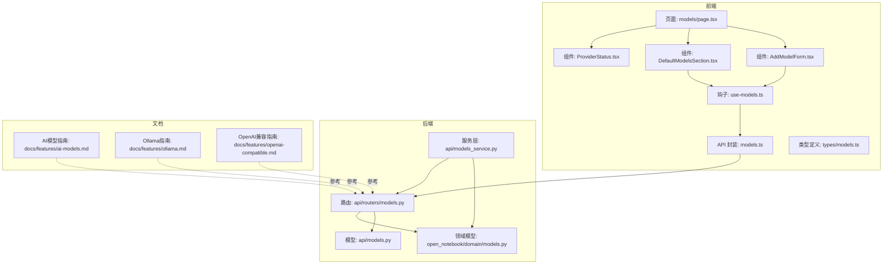
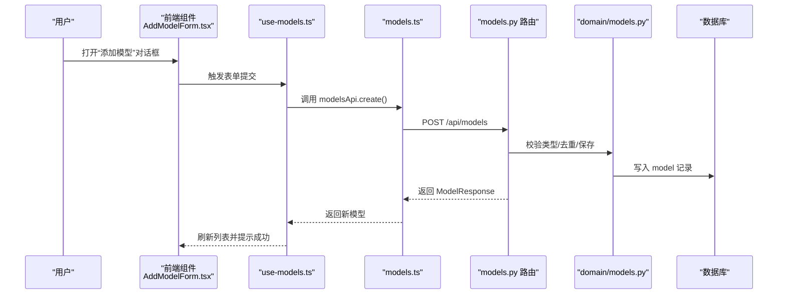
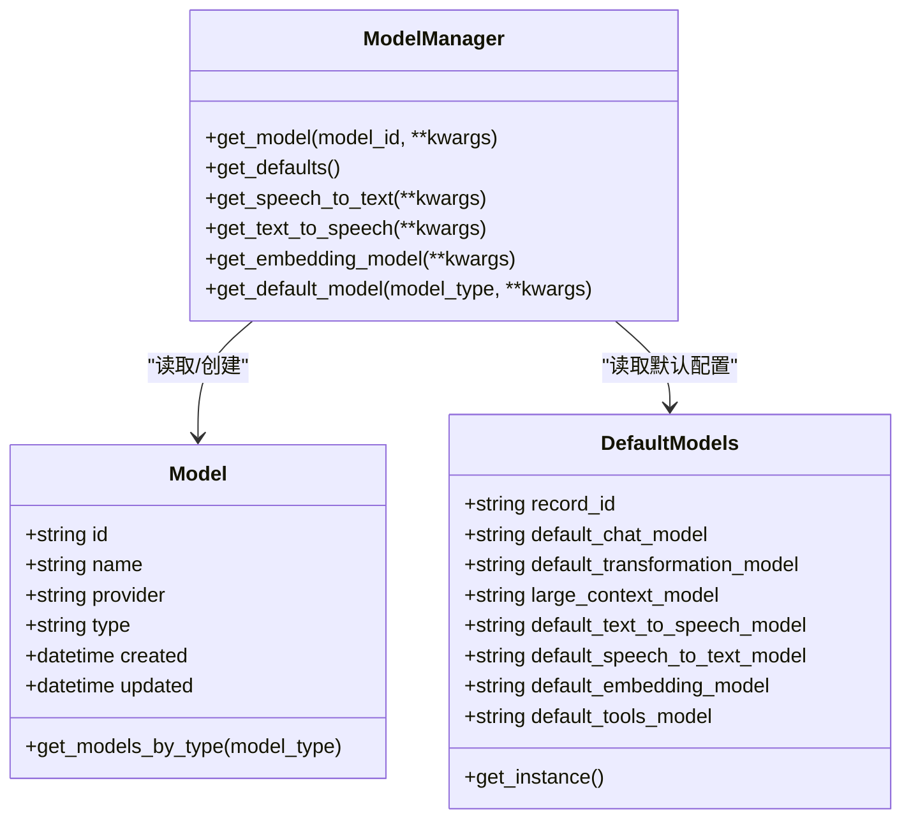
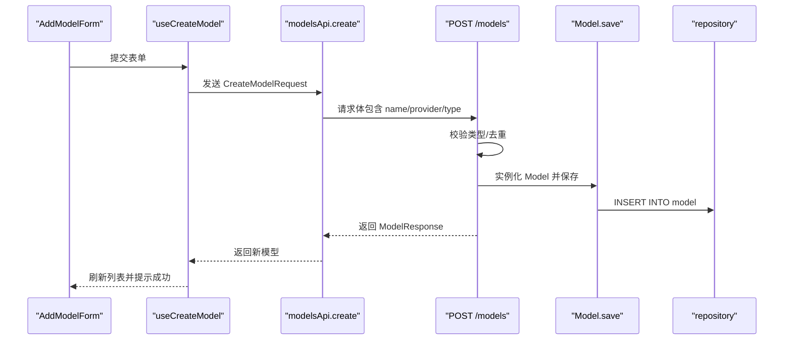
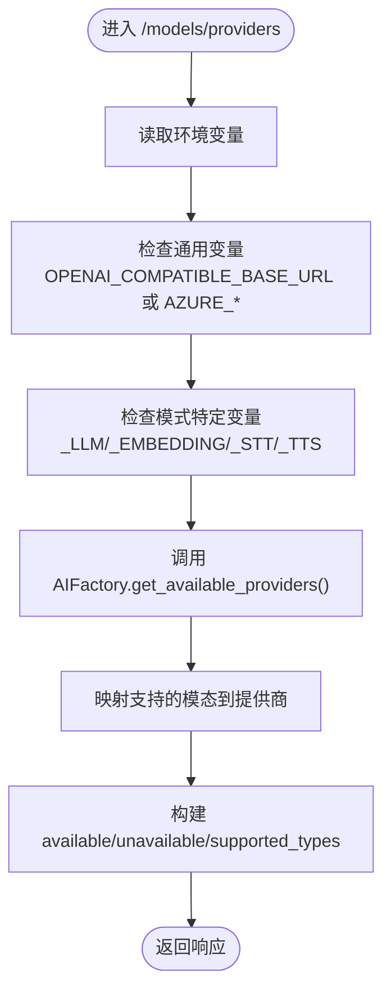
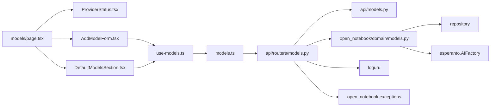

# AI模型管理

<cite>
**本文引用的文件**
- [api/routers/models.py](file://api/routers/models.py)
- [api/models.py](file://api/models.py)
- [api/models_service.py](file://api/models_service.py)
- [open_notebook/domain/models.py](file://open_notebook/domain/models.py)
- [frontend/src/app/(dashboard)/models/page.tsx](file://frontend/src/app/(dashboard)/models/page.tsx)
- [frontend/src/app/(dashboard)/models/components/ProviderStatus.tsx](file://frontend/src/app/(dashboard)/models/components/ProviderStatus.tsx)
- [frontend/src/app/(dashboard)/models/components/AddModelForm.tsx](file://frontend/src/app/(dashboard)/models/components/AddModelForm.tsx)
- [frontend/src/app/(dashboard)/models/components/DefaultModelsSection.tsx](file://frontend/src/app/(dashboard)/models/components/DefaultModelsSection.tsx)
- [frontend/src/lib/hooks/use-models.ts](file://frontend/src/lib/hooks/use-models.ts)
- [frontend/src/lib/api/models.ts](file://frontend/src/lib/api/models.ts)
- [frontend/src/lib/types/models.ts](file://frontend/src/lib/types/models.ts)
- [docs/features/ai-models.md](file://docs/features/ai-models.md)
- [docs/features/ollama.md](file://docs/features/ollama.md)
- [docs/features/openai-compatible.md](file://docs/features/openai-compatible.md)
- [tests/test_models_api.py](file://tests/test_models_api.py)
</cite>

## 目录
1. [简介](#简介)
2. [项目结构](#项目结构)
3. [核心组件](#核心组件)
4. [架构总览](#架构总览)
5. [详细组件分析](#详细组件分析)
6. [依赖关系分析](#依赖关系分析)
7. [性能考量](#性能考量)
8. [故障排查指南](#故障排查指南)
9. [结论](#结论)
10. [附录](#附录)

## 简介
本文件系统化介绍 Open Notebook 的 AI 模型管理架构，覆盖多提供商支持（Ollama、OpenAI 兼容接口等）、ProviderStatus 组件的实时连接状态展示、models.py 路由与 ModelsService 服务层的模型注册/验证/默认模型设置流程、前端 AddModelForm 的表单校验与提交流程、以及 domain/models.py 领域模型的元数据存储与查询逻辑。同时包含高级配置（上下文长度、温度、流式响应控制）与故障排查建议，帮助用户安全、稳定地使用多模型体系。

## 项目结构
系统采用前后端分离设计：
- 后端 FastAPI 路由：提供模型列表、创建、删除、默认模型读写、提供商可用性检测等接口。
- 前端 Next.js 页面与组件：展示 ProviderStatus、默认模型配置、按类型分组的模型列表与新增表单。
- 领域模型与服务层：封装数据库访问、默认配置记录、模型实例工厂调用。

图表来源
- [api/routers/models.py](file://api/routers/models.py#L62-L300)
- [open_notebook/domain/models.py](file://open_notebook/domain/models.py#L18-L199)
- [frontend/src/app/(dashboard)/models/page.tsx](file://frontend/src/app/(dashboard)/models/page.tsx#L1-L101)
- [frontend/src/app/(dashboard)/models/components/ProviderStatus.tsx](file://frontend/src/app/(dashboard)/models/components/ProviderStatus.tsx#L1-L126)
- [frontend/src/app/(dashboard)/models/components/AddModelForm.tsx](file://frontend/src/app/(dashboard)/models/components/AddModelForm.tsx#L1-L136)
- [frontend/src/app/(dashboard)/models/components/DefaultModelsSection.tsx](file://frontend/src/app/(dashboard)/models/components/DefaultModelsSection.tsx#L76-L230)
- [frontend/src/lib/hooks/use-models.ts](file://frontend/src/lib/hooks/use-models.ts#L1-L112)
- [frontend/src/lib/api/models.ts](file://frontend/src/lib/api/models.ts#L1-L38)
- [frontend/src/lib/types/models.ts](file://frontend/src/lib/types/models.ts#L1-L30)
- [docs/features/ai-models.md](file://docs/features/ai-models.md#L1-L200)
- [docs/features/ollama.md](file://docs/features/ollama.md#L1-L120)
- [docs/features/openai-compatible.md](file://docs/features/openai-compatible.md#L1-L120)

章节来源
- [api/routers/models.py](file://api/routers/models.py#L62-L300)
- [open_notebook/domain/models.py](file://open_notebook/domain/models.py#L18-L199)
- [frontend/src/app/(dashboard)/models/page.tsx](file://frontend/src/app/(dashboard)/models/page.tsx#L1-L101)

## 核心组件
- 后端路由与接口
  - 模型 CRUD：列出、创建、删除
  - 默认模型读写：读取/更新默认模型映射
  - 提供商可用性：基于环境变量与 Esperanto 工厂能力检测
- 领域模型与服务层
  - Model/DefaultModels：持久化模型元数据与默认配置记录
  - ModelManager：根据默认配置或指定 ID 获取具体模型实例
- 前端页面与组件
  - ProviderStatus：展示各提供商可用性与支持模态
  - DefaultModelsSection：配置默认模型映射
  - AddModelForm：按可用提供商筛选，表单校验后提交
  - use-models 钩子：统一查询/变更模型与默认配置
  - models.ts API 封装：与后端交互

章节来源
- [api/routers/models.py](file://api/routers/models.py#L62-L300)
- [open_notebook/domain/models.py](file://open_notebook/domain/models.py#L18-L199)
- [frontend/src/app/(dashboard)/models/components/ProviderStatus.tsx](file://frontend/src/app/(dashboard)/models/components/ProviderStatus.tsx#L1-L126)
- [frontend/src/app/(dashboard)/models/components/DefaultModelsSection.tsx](file://frontend/src/app/(dashboard)/models/components/DefaultModelsSection.tsx#L76-L230)
- [frontend/src/app/(dashboard)/models/components/AddModelForm.tsx](file://frontend/src/app/(dashboard)/models/components/AddModelForm.tsx#L1-L136)
- [frontend/src/lib/hooks/use-models.ts](file://frontend/src/lib/hooks/use-models.ts#L1-L112)
- [frontend/src/lib/api/models.ts](file://frontend/src/lib/api/models.ts#L1-L38)

## 架构总览
系统通过 FastAPI 路由暴露模型管理接口，前端通过 React Query 钩子与 API 封装进行数据拉取与变更；领域模型负责持久化与默认配置读取；ModelManager 通过 Esperanto 工厂按类型创建具体模型实例。

图表来源
- [frontend/src/app/(dashboard)/models/components/AddModelForm.tsx](file://frontend/src/app/(dashboard)/models/components/AddModelForm.tsx#L1-L136)
- [frontend/src/lib/hooks/use-models.ts](file://frontend/src/lib/hooks/use-models.ts#L28-L50)
- [frontend/src/lib/api/models.ts](file://frontend/src/lib/api/models.ts#L15-L17)
- [api/routers/models.py](file://api/routers/models.py#L90-L135)
- [open_notebook/domain/models.py](file://open_notebook/domain/models.py#L18-L31)

## 详细组件分析

### 后端路由与接口（models.py）
- 模型列表与过滤：支持按类型过滤，返回标准化模型响应。
- 创建模型：校验类型合法性、执行大小写不敏感的同提供商重复检查、保存并返回。
- 删除模型：按 ID 查询并删除。
- 默认模型读写：按需更新默认映射，无缓存刷新逻辑（下次访问从 DB 读取最新）。
- 提供商可用性：基于环境变量判断各提供商是否已配置；结合 Esperanto 工厂能力与模式特定变量，计算 openai-compatible 与 azure 的支持模态集合。

章节来源
- [api/routers/models.py](file://api/routers/models.py#L62-L300)
- [api/models.py](file://api/models.py#L61-L98)

### 领域模型与服务层（domain/models.py）
- Model：模型元数据实体，支持按类型查询。
- DefaultModels：默认模型配置记录，强制每次访问都从数据库读取最新值（绕过缓存）。
- ModelManager：根据默认配置或显式 ID 获取具体模型实例；按类型分派到 Esperanto 工厂；提供默认语音/嵌入/聊天/工具等便捷方法。

章节来源
- [open_notebook/domain/models.py](file://open_notebook/domain/models.py#L18-L199)

### 前端页面与组件
- models/page.tsx：聚合 ProviderStatus、DefaultModelsSection、按类型分组的 ModelTypeSection，统一加载与刷新。
- ProviderStatus.tsx：展示可用/不可用提供商及其支持模态，支持展开查看全部。
- DefaultModelsSection.tsx：配置默认模型映射，含必填项校验与变更确认（如嵌入模型切换时的二次确认）。
- AddModelForm.tsx：基于 ProviderAvailability 过滤可用提供商，表单字段必填校验，提交后重置并关闭对话框。
- use-models.ts：封装查询/变更模型与默认配置的 React Query 调用，统一错误提示与缓存失效。
- models.ts：对后端 /api/models 接口的轻量封装。
- types/models.ts：定义模型、创建请求、默认配置与提供商可用性类型。

章节来源
- [frontend/src/app/(dashboard)/models/page.tsx](file://frontend/src/app/(dashboard)/models/page.tsx#L1-L101)
- [frontend/src/app/(dashboard)/models/components/ProviderStatus.tsx](file://frontend/src/app/(dashboard)/models/components/ProviderStatus.tsx#L1-L126)
- [frontend/src/app/(dashboard)/models/components/DefaultModelsSection.tsx](file://frontend/src/app/(dashboard)/models/components/DefaultModelsSection.tsx#L76-L230)
- [frontend/src/app/(dashboard)/models/components/AddModelForm.tsx](file://frontend/src/app/(dashboard)/models/components/AddModelForm.tsx#L1-L136)
- [frontend/src/lib/hooks/use-models.ts](file://frontend/src/lib/hooks/use-models.ts#L1-L112)
- [frontend/src/lib/api/models.ts](file://frontend/src/lib/api/models.ts#L1-L38)
- [frontend/src/lib/types/models.ts](file://frontend/src/lib/types/models.ts#L1-L30)

### 服务层（api/models_service.py）
- ModelsService：以 API 为后端的数据访问层，封装 get_all_models/create/delete/get_default/update_default 等操作，负责将 API 响应转换为领域对象。

章节来源
- [api/models_service.py](file://api/models_service.py#L1-L100)

### 类关系图（代码级）

图表来源
- [open_notebook/domain/models.py](file://open_notebook/domain/models.py#L18-L199)

### API 流程序列图（创建模型）

图表来源
- [frontend/src/app/(dashboard)/models/components/AddModelForm.tsx](file://frontend/src/app/(dashboard)/models/components/AddModelForm.tsx#L1-L136)
- [frontend/src/lib/hooks/use-models.ts](file://frontend/src/lib/hooks/use-models.ts#L28-L50)
- [frontend/src/lib/api/models.ts](file://frontend/src/lib/api/models.ts#L15-L17)
- [api/routers/models.py](file://api/routers/models.py#L90-L135)
- [open_notebook/domain/models.py](file://open_notebook/domain/models.py#L18-L31)

### 复杂逻辑流程图（提供商可用性检测）

图表来源
- [api/routers/models.py](file://api/routers/models.py#L217-L299)

## 依赖关系分析
- 路由依赖
  - models.py 路由依赖：esperanto AIFactory、loguru 日志、open_notebook.exceptions、数据库 repository。
  - 响应模型定义于 api/models.py。
- 前端依赖
  - models/page.tsx 依赖 ProviderStatus、DefaultModelsSection、ModelTypeSection。
  - AddModelForm 依赖 use-models 钩子与 ProviderAvailability。
  - use-models 依赖 modelsApi 与 React Query。
- 领域模型依赖
  - Model/DefaultModels 继承自 ObjectModel/RecordModel，使用 repository 进行持久化。
  - ModelManager 依赖 AIFactory 与 DefaultModels。

图表来源
- [api/routers/models.py](file://api/routers/models.py#L1-L300)
- [api/models.py](file://api/models.py#L61-L98)
- [open_notebook/domain/models.py](file://open_notebook/domain/models.py#L18-L199)
- [frontend/src/app/(dashboard)/models/page.tsx](file://frontend/src/app/(dashboard)/models/page.tsx#L1-L101)
- [frontend/src/app/(dashboard)/models/components/ProviderStatus.tsx](file://frontend/src/app/(dashboard)/models/components/ProviderStatus.tsx#L1-L126)
- [frontend/src/app/(dashboard)/models/components/DefaultModelsSection.tsx](file://frontend/src/app/(dashboard)/models/components/DefaultModelsSection.tsx#L76-L230)
- [frontend/src/app/(dashboard)/models/components/AddModelForm.tsx](file://frontend/src/app/(dashboard)/models/components/AddModelForm.tsx#L1-L136)
- [frontend/src/lib/hooks/use-models.ts](file://frontend/src/lib/hooks/use-models.ts#L1-L112)
- [frontend/src/lib/api/models.ts](file://frontend/src/lib/api/models.ts#L1-L38)

## 性能考量
- 默认配置读取策略：DefaultModels.get_instance() 强制每次访问都从数据库读取，避免缓存导致的配置不同步，但会增加查询次数；可在业务层引入短期缓存并在更新后主动失效。
- 模型实例缓存：ModelManager 通过 Esperanto 工厂缓存具体模型实例，减少重复初始化成本。
- 前端查询缓存：React Query 默认启用缓存与自动失效，合理使用查询键与手动失效可降低网络压力。
- 网络与端点选择：OpenAI 兼容与 Azure 支持模式特定端点，建议按能力拆分部署以提升吞吐与稳定性。

[本节为通用指导，无需特定文件引用]

## 故障排查指南
- 模型连接失败
  - 检查环境变量是否正确设置（如 OPENAI_API_KEY、OLLAMA_API_BASE、OPENAI_COMPATIBLE_*、AZURE_* 等）。
  - 使用 ProviderStatus 组件确认对应提供商处于“可用”状态。
  - 参考文档：
    - [AI 模型指南](file://docs/features/ai-models.md#L549-L628)
    - [Ollama 设置指南](file://docs/features/ollama.md#L233-L325)
    - [OpenAI 兼容设置指南](file://docs/features/openai-compatible.md#L401-L471)
- 响应格式异常
  - 确认模型名称与提供商组合在数据库中唯一（大小写不敏感），避免重复导致的歧义。
  - 检查默认模型映射是否指向有效模型 ID。
  - 参考测试用例对重复模型的处理：
    - [重复模型测试](file://tests/test_models_api.py#L14-L58)
- 默认模型更新问题
  - 更新默认模型后，确保前端已触发缓存失效与重新拉取。
  - 参考：
    - [默认模型读写接口](file://api/routers/models.py#L155-L215)
    - [DefaultModels.get_instance() 强制刷新](file://open_notebook/domain/models.py#L43-L66)

章节来源
- [tests/test_models_api.py](file://tests/test_models_api.py#L14-L58)
- [api/routers/models.py](file://api/routers/models.py#L155-L215)
- [open_notebook/domain/models.py](file://open_notebook/domain/models.py#L43-L66)
- [docs/features/ai-models.md](file://docs/features/ai-models.md#L549-L628)
- [docs/features/ollama.md](file://docs/features/ollama.md#L233-L325)
- [docs/features/openai-compatible.md](file://docs/features/openai-compatible.md#L401-L471)

## 结论
该系统通过清晰的路由与领域模型边界，实现了多提供商模型的统一管理与默认配置的灵活控制。前端组件与 React Query 协作，提供了直观的可视化与交互体验。通过环境变量驱动的提供商可用性检测与测试覆盖，系统具备良好的可扩展性与可维护性。建议在生产环境中结合文档中的最佳实践，使用环境变量管理密钥、按能力拆分端点，并对默认配置进行必要的缓存与一致性保障。

[本节为总结性内容，无需特定文件引用]

## 附录

### 高级配置与最佳实践
- 上下文长度与温度
  - 在具体模型调用处设置上下文长度与温度参数，以平衡质量与成本。
  - 参考：[AI 模型指南-性能优化](file://docs/features/ai-models.md#L698-L731)
- 流式响应控制
  - 在调用语言模型时启用流式输出，提升用户体验；注意前端渲染与中断处理。
  - 参考：[AI 模型指南-推理模型](file://docs/features/ai-models.md#L416-L453)
- 环境变量管理
  - 使用环境变量集中管理 API 密钥与端点，避免硬编码；参考：
    - [AI 模型指南-环境变量](file://docs/features/ai-models.md#L549-L628)
    - [OpenAI 兼容-环境变量参考](file://docs/features/openai-compatible.md#L61-L94)
- 负载均衡与多模型部署
  - 对于高并发场景，建议将不同模态拆分为独立端点或容器，结合反向代理实现健康检查与流量分发。
  - 参考：[OpenAI 兼容-网络配置](file://docs/features/openai-compatible.md#L302-L386)

[本节为通用指导，无需特定文件引用]