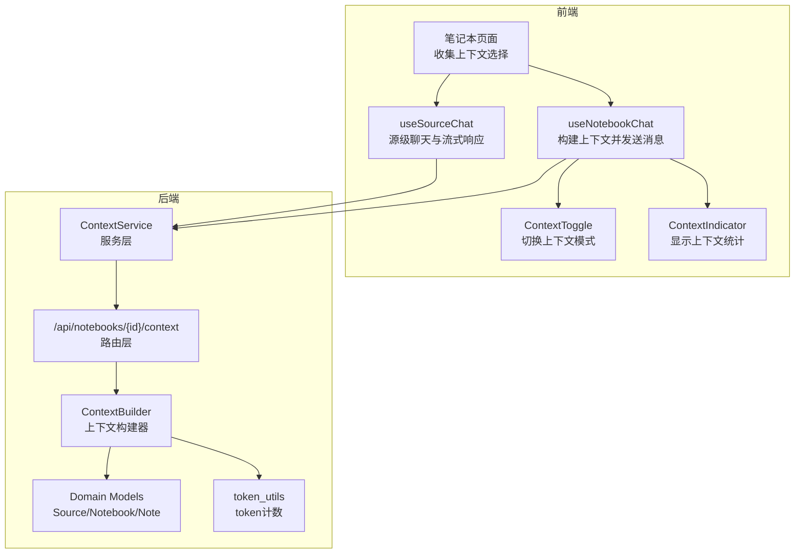
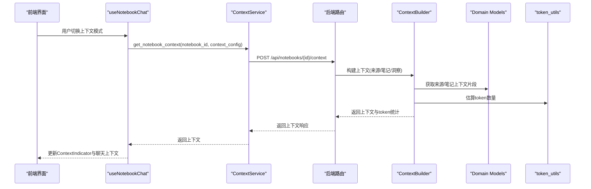
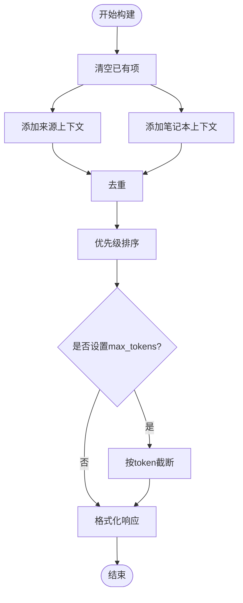
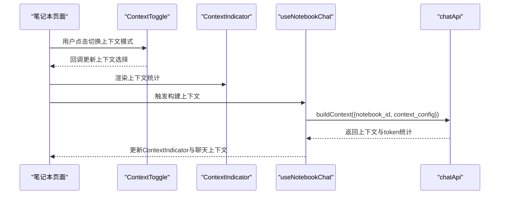
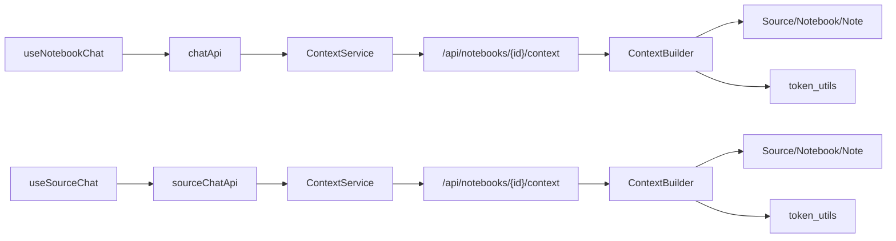

# 上下文管理

<cite>
**本文引用的文件**
- [api/routers/context.py](file://api/routers/context.py)
- [api/context_service.py](file://api/context_service.py)
- [open_notebook/utils/context_builder.py](file://open_notebook/utils/context_builder.py)
- [frontend/src/components/common/ContextIndicator.tsx](file://frontend/src/components/common/ContextIndicator.tsx)
- [frontend/src/components/common/ContextToggle.tsx](file://frontend/src/components/common/ContextToggle.tsx)
- [frontend/src/lib/hooks/useNotebookChat.ts](file://frontend/src/lib/hooks/useNotebookChat.ts)
- [frontend/src/lib/hooks/useSourceChat.ts](file://frontend/src/lib/hooks/useSourceChat.ts)
- [frontend/src/app/(dashboard)/notebooks/[id]/page.tsx](file://frontend/src/app/(dashboard)/notebooks/[id]/page.tsx)
- [api/models.py](file://api/models.py)
- [open_notebook/domain/notebook.py](file://open_notebook/domain/notebook.py)
- [open_notebook/utils/token_utils.py](file://open_notebook/utils/token_utils.py)
- [api/client.py](file://api/client.py)
- [api/chat_service.py](file://api/chat_service.py)
- [docs/features/context-management.md](file://docs/features/context-management.md)
</cite>

## 目录
1. [简介](#简介)
2. [项目结构](#项目结构)
3. [核心组件](#核心组件)
4. [架构总览](#架构总览)
5. [详细组件分析](#详细组件分析)
6. [依赖关系分析](#依赖关系分析)
7. [性能考量](#性能考量)
8. [故障排查指南](#故障排查指南)
9. [结论](#结论)
10. [附录](#附录)

## 简介
本文件系统化阐述 Open Notebook 的上下文管理机制：从后端路由与服务层如何基于用户选择构建跨会话一致的上下文，到前端组件如何可视化与控制上下文范围；从 ContextBuilder 的构建策略（历史消息截断、相关笔记注入、源内容摘要整合）到 useNotebookChat 与 useSourceChat 钩子在不同场景下的封装逻辑。文档还覆盖上下文长度限制、性能影响与内存管理策略，并提供优化建议与常见问题解决方案。

## 项目结构
上下文管理涉及前后端多处协作：
- 后端
  - 路由层：提供笔记本上下文查询接口，支持按配置返回来源与笔记的上下文片段与估算 token 数量
  - 服务层：封装 API 客户端调用，统一对外暴露上下文获取能力
  - 工具层：通用 ContextBuilder 提供灵活的上下文构建、优先级排序、去重与截断策略
  - 数据模型：定义上下文请求/响应结构，便于前后端契约一致
  - 域模型：Source/Notebook/Note 等实体提供上下文片段与洞察数据
  - 计数工具：基于分词器估算 token 数量
- 前端
  - 组件：ContextToggle 用于切换“不包含/仅洞察/全文”，ContextIndicator 用于展示上下文统计与估算 token/字符数
  - 钩子：useNotebookChat 将用户选择映射为上下文配置并调用后端构建上下文；useSourceChat 支持源级聊天与流式响应
  - 页面：笔记本页面负责收集用户上下文选择并驱动聊天交互

图表来源
- [api/routers/context.py](file://api/routers/context.py#L1-L117)
- [api/context_service.py](file://api/context_service.py#L1-L32)
- [open_notebook/utils/context_builder.py](file://open_notebook/utils/context_builder.py#L1-L502)
- [open_notebook/domain/notebook.py](file://open_notebook/domain/notebook.py#L1-L457)
- [open_notebook/utils/token_utils.py](file://open_notebook/utils/token_utils.py#L1-L46)
- [frontend/src/lib/hooks/useNotebookChat.ts](file://frontend/src/lib/hooks/useNotebookChat.ts#L1-L292)
- [frontend/src/lib/hooks/useSourceChat.ts](file://frontend/src/lib/hooks/useSourceChat.ts#L1-L244)
- [frontend/src/components/common/ContextToggle.tsx](file://frontend/src/components/common/ContextToggle.tsx#L1-L87)
- [frontend/src/components/common/ContextIndicator.tsx](file://frontend/src/components/common/ContextIndicator.tsx#L1-L117)

章节来源
- [api/routers/context.py](file://api/routers/context.py#L1-L117)
- [api/context_service.py](file://api/context_service.py#L1-L32)
- [open_notebook/utils/context_builder.py](file://open_notebook/utils/context_builder.py#L1-L502)
- [open_notebook/domain/notebook.py](file://open_notebook/domain/notebook.py#L1-L457)
- [open_notebook/utils/token_utils.py](file://open_notebook/utils/token_utils.py#L1-L46)
- [frontend/src/lib/hooks/useNotebookChat.ts](file://frontend/src/lib/hooks/useNotebookChat.ts#L1-L292)
- [frontend/src/lib/hooks/useSourceChat.ts](file://frontend/src/lib/hooks/useSourceChat.ts#L1-L244)
- [frontend/src/components/common/ContextToggle.tsx](file://frontend/src/components/common/ContextToggle.tsx#L1-L87)
- [frontend/src/components/common/ContextIndicator.tsx](file://frontend/src/components/common/ContextIndicator.tsx#L1-L117)

## 核心组件
- 后端路由与服务
  - 路由层提供笔记本上下文接口，支持按配置返回来源与笔记的上下文片段，并估算 token 数量
  - 服务层通过 API 客户端封装调用，简化上层依赖
- 上下文构建器
  - 支持按来源/笔记本/自定义参数构建上下文，内置去重、优先级排序与按 token 截断
  - 可选包含洞察、笔记与来源，支持最大 token 限制
- 前端交互
  - ContextToggle 切换“不包含/仅洞察/全文”
  - ContextIndicator 展示上下文统计与 token/字符数
  - useNotebookChat 将用户选择映射为上下文配置并调用后端构建上下文
  - useSourceChat 支持源级聊天与流式响应
- 域模型与计数
  - Source/Notebook/Note 提供上下文片段与洞察
  - token_utils 基于分词器估算 token 数量

章节来源
- [api/routers/context.py](file://api/routers/context.py#L1-L117)
- [api/context_service.py](file://api/context_service.py#L1-L32)
- [open_notebook/utils/context_builder.py](file://open_notebook/utils/context_builder.py#L1-L502)
- [open_notebook/domain/notebook.py](file://open_notebook/domain/notebook.py#L1-L457)
- [open_notebook/utils/token_utils.py](file://open_notebook/utils/token_utils.py#L1-L46)
- [frontend/src/lib/hooks/useNotebookChat.ts](file://frontend/src/lib/hooks/useNotebookChat.ts#L1-L292)
- [frontend/src/lib/hooks/useSourceChat.ts](file://frontend/src/lib/hooks/useSourceChat.ts#L1-L244)
- [frontend/src/components/common/ContextToggle.tsx](file://frontend/src/components/common/ContextToggle.tsx#L1-L87)
- [frontend/src/components/common/ContextIndicator.tsx](file://frontend/src/components/common/ContextIndicator.tsx#L1-L117)

## 架构总览
上下文管理贯穿“前端选择—服务封装—路由处理—构建器—域模型—计数”的完整链路，确保跨会话的一致性与可追踪性。

图表来源
- [frontend/src/lib/hooks/useNotebookChat.ts](file://frontend/src/lib/hooks/useNotebookChat.ts#L1-L292)
- [api/context_service.py](file://api/context_service.py#L1-L32)
- [api/routers/context.py](file://api/routers/context.py#L1-L117)
- [open_notebook/utils/context_builder.py](file://open_notebook/utils/context_builder.py#L1-L502)
- [open_notebook/domain/notebook.py](file://open_notebook/domain/notebook.py#L1-L457)
- [open_notebook/utils/token_utils.py](file://open_notebook/utils/token_utils.py#L1-L46)

## 详细组件分析

### 后端路由与服务
- 路由层
  - 接口：POST /api/notebooks/{notebook_id}/context
  - 功能：根据 context_config 或默认行为，聚合来源与笔记的上下文片段，计算 token 估算值
  - 错误处理：捕获无效输入与异常，返回标准 HTTP 错误
- 服务层
  - ContextService 封装 API 客户端调用，统一对外暴露 get_notebook_context 方法

章节来源
- [api/routers/context.py](file://api/routers/context.py#L1-L117)
- [api/context_service.py](file://api/context_service.py#L1-L32)

### 上下文构建器（ContextBuilder）
- 设计要点
  - 支持按来源/笔记本/自定义参数构建上下文
  - 内置去重、优先级排序、按 token 截断
  - 可选包含洞察、笔记与来源，支持最大 token 限制
- 关键流程
  - add_item/prioritize/remove_duplicates/truncate_to_fit/_format_response
  - build() 主流程：清空旧项、添加来源/笔记本、去重、优先级排序、按 max_tokens 截断、格式化输出
- 复杂度与性能
  - 去重与排序为 O(n log n)，截断为 O(n)
  - token 估算依赖分词器，整体复杂度受上下文项数与内容长度影响

图表来源
- [open_notebook/utils/context_builder.py](file://open_notebook/utils/context_builder.py#L1-L502)

章节来源
- [open_notebook/utils/context_builder.py](file://open_notebook/utils/context_builder.py#L1-L502)

### 前端交互组件
- ContextToggle
  - 模式：off/insights/full
  - 行为：点击循环切换，支持根据来源是否有洞察动态可用模式
- ContextIndicator
  - 展示来源洞察数、来源全文数、笔记数，以及 token/字符数估算
- useNotebookChat
  - 将 sources/notes 的上下文选择映射为 context_config
  - 调用 chatApi.buildContext 获取上下文并更新 token/字符计数
  - 发送消息时携带上下文与模型覆盖
- useSourceChat
  - 支持源级聊天与流式响应，接收 context_indicators 实时反馈

图表来源
- [frontend/src/app/(dashboard)/notebooks/[id]/page.tsx](file://frontend/src/app/(dashboard)/notebooks/[id]/page.tsx#L1-L225)
- [frontend/src/components/common/ContextToggle.tsx](file://frontend/src/components/common/ContextToggle.tsx#L1-L87)
- [frontend/src/components/common/ContextIndicator.tsx](file://frontend/src/components/common/ContextIndicator.tsx#L1-L117)
- [frontend/src/lib/hooks/useNotebookChat.ts](file://frontend/src/lib/hooks/useNotebookChat.ts#L1-L292)

章节来源
- [frontend/src/app/(dashboard)/notebooks/[id]/page.tsx](file://frontend/src/app/(dashboard)/notebooks/[id]/page.tsx#L1-L225)
- [frontend/src/components/common/ContextToggle.tsx](file://frontend/src/components/common/ContextToggle.tsx#L1-L87)
- [frontend/src/components/common/ContextIndicator.tsx](file://frontend/src/components/common/ContextIndicator.tsx#L1-L117)
- [frontend/src/lib/hooks/useNotebookChat.ts](file://frontend/src/lib/hooks/useNotebookChat.ts#L1-L292)

### 域模型与上下文片段
- Source/Notebook/Note 提供上下文片段与洞察
  - Source.get_context(context_size)：短上下文仅返回标题与洞察，长上下文附加全文
  - Note.get_context(context_size)：短上下文返回标题与内容前缀，长上下文返回完整内容
- 这些方法被 ContextBuilder 与路由层复用，保证上下文一致性

章节来源
- [open_notebook/domain/notebook.py](file://open_notebook/domain/notebook.py#L1-L457)

### token 估算与成本
- token_utils 提供基于分词器的 token 计数，作为上下文长度限制与成本估算的基础
- 文档中给出不同上下文级别的 token 占比与成本优化建议

章节来源
- [open_notebook/utils/token_utils.py](file://open_notebook/utils/token_utils.py#L1-L46)
- [docs/features/context-management.md](file://docs/features/context-management.md#L176-L205)

## 依赖关系分析
- 前端依赖
  - useNotebookChat 依赖 chatApi（构建上下文与发送消息）、ContextToggle/ContextIndicator 渲染上下文状态
  - useSourceChat 依赖 sourceChatApi（源级聊天与流式响应）
- 后端依赖
  - 路由层依赖 Domain Models 与 token_utils
  - ContextService 依赖 api_client
  - ContextBuilder 依赖 Domain Models 与 token_utils

图表来源
- [frontend/src/lib/hooks/useNotebookChat.ts](file://frontend/src/lib/hooks/useNotebookChat.ts#L1-L292)
- [frontend/src/lib/hooks/useSourceChat.ts](file://frontend/src/lib/hooks/useSourceChat.ts#L1-L244)
- [api/context_service.py](file://api/context_service.py#L1-L32)
- [api/routers/context.py](file://api/routers/context.py#L1-L117)
- [open_notebook/utils/context_builder.py](file://open_notebook/utils/context_builder.py#L1-L502)
- [open_notebook/domain/notebook.py](file://open_notebook/domain/notebook.py#L1-L457)
- [open_notebook/utils/token_utils.py](file://open_notebook/utils/token_utils.py#L1-L46)

章节来源
- [frontend/src/lib/hooks/useNotebookChat.ts](file://frontend/src/lib/hooks/useNotebookChat.ts#L1-L292)
- [frontend/src/lib/hooks/useSourceChat.ts](file://frontend/src/lib/hooks/useSourceChat.ts#L1-L244)
- [api/context_service.py](file://api/context_service.py#L1-L32)
- [api/routers/context.py](file://api/routers/context.py#L1-L117)
- [open_notebook/utils/context_builder.py](file://open_notebook/utils/context_builder.py#L1-L502)
- [open_notebook/domain/notebook.py](file://open_notebook/domain/notebook.py#L1-L457)
- [open_notebook/utils/token_utils.py](file://open_notebook/utils/token_utils.py#L1-L46)

## 性能考量
- 上下文长度限制
  - ContextBuilder 支持 max_tokens 截断，避免超出模型上下文窗口
  - 路由层返回 total_tokens 估算值，前端可据此提示用户
- token 估算
  - 使用分词器估算 token，作为截断与成本控制依据
- 内存与资源
  - 仅在需要时加载全文，优先使用洞察摘要
  - 对重复项进行去重，减少冗余传输与处理
- 流式响应
  - useSourceChat 使用流式读取，提升交互体验，但需注意网络与模型响应稳定性

章节来源
- [open_notebook/utils/context_builder.py](file://open_notebook/utils/context_builder.py#L324-L352)
- [api/routers/context.py](file://api/routers/context.py#L100-L108)
- [open_notebook/utils/token_utils.py](file://open_notebook/utils/token_utils.py#L1-L46)
- [frontend/src/lib/hooks/useSourceChat.ts](file://frontend/src/lib/hooks/useSourceChat.ts#L98-L193)

## 故障排查指南
- 上下文丢失
  - 检查 ContextToggle 是否被设为“不包含”
  - 确认 useNotebookChat 中 context_config 是否正确映射
  - 查看 ContextIndicator 的 token/字符数是否为 0
- 信息过载
  - 减少“全文”来源数量，优先使用“仅洞察”
  - 设置 max_tokens 并启用 ContextBuilder 的截断
- 响应缓慢
  - 降低上下文大小或排除无关来源
  - 使用流式响应（源级聊天）以改善交互体验
- token 成本过高
  - 采用摘要优先策略，仅在关键分析阶段使用全文
  - 结合成本估算工具监控消费

章节来源
- [docs/features/context-management.md](file://docs/features/context-management.md#L381-L402)
- [frontend/src/lib/hooks/useNotebookChat.ts](file://frontend/src/lib/hooks/useNotebookChat.ts#L124-L166)
- [open_notebook/utils/context_builder.py](file://open_notebook/utils/context_builder.py#L324-L352)

## 结论
Open Notebook 的上下文管理通过“前端可视化控制 + 后端统一构建 + 明确的长度与成本约束”实现了跨会话的一致性与可控性。ContextBuilder 的优先级、去重与截断策略，配合前端的 Toggle/Indicator，使用户能够在隐私、性能与功能之间取得平衡。建议在实际使用中：
- 默认采用“仅洞察”策略，关键分析时再切换为“全文”
- 合理设置 max_tokens，避免超限
- 使用 ContextIndicator 监控 token/字符数，及时调整上下文规模
- 在团队协作中建立上下文策略模板与定期回顾机制

## 附录
- API 模型
  - ContextRequest/ContextResponse 定义了上下文请求与响应结构
- 常见优化建议
  - 选择性上下文加载：仅在需要时加载全文
  - 自动摘要生成：优先使用洞察摘要，必要时再引入全文
  - 分阶段上下文：探索阶段用摘要，分析阶段用全文
  - 缓存与轮换：对高频摘要进行缓存，定期轮换低价值上下文

章节来源
- [api/models.py](file://api/models.py#L364-L387)
- [docs/features/context-management.md](file://docs/features/context-management.md#L174-L220)