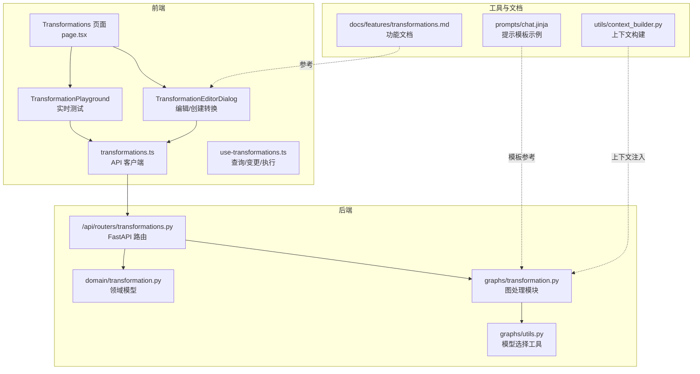
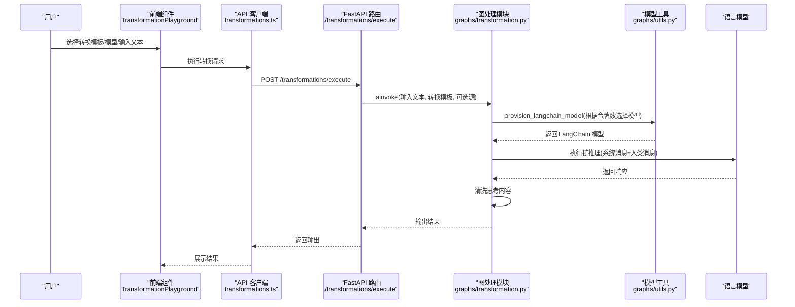
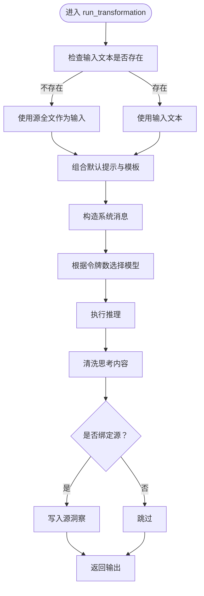
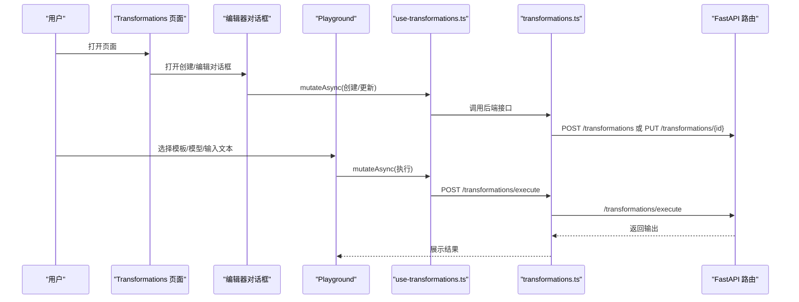
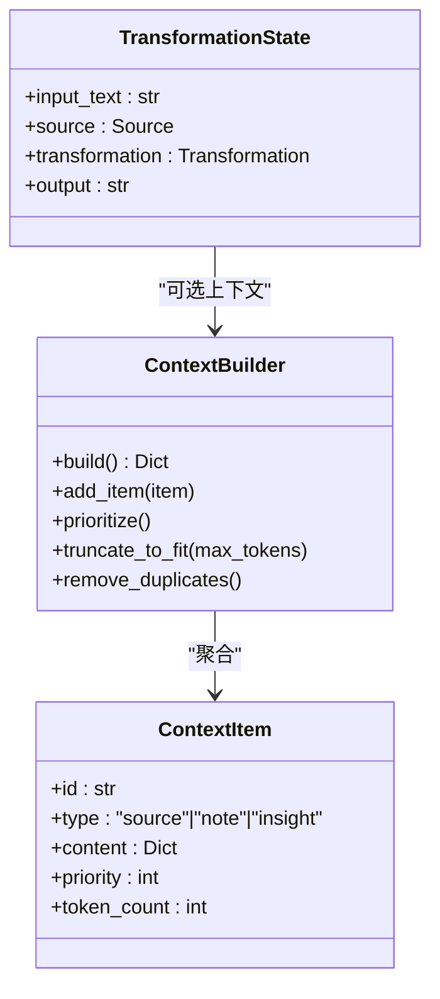
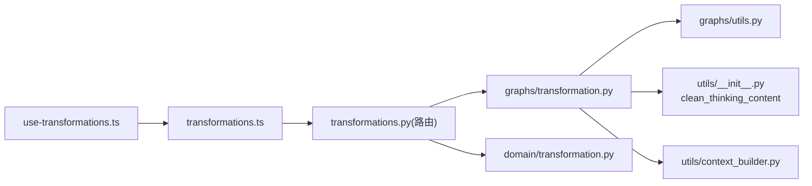

# 内容转换

<cite>
**本文引用的文件列表**
- [api/routers/transformations.py](file://api/routers/transformations.py)
- [open_notebook/graphs/transformation.py](file://open_notebook/graphs/transformation.py)
- [open_notebook/domain/transformation.py](file://open_notebook/domain/transformation.py)
- [frontend/src/app/(dashboard)/transformations/page.tsx](file://frontend/src/app/(dashboard)/transformations/page.tsx)
- [frontend/src/app/(dashboard)/transformations/components/TransformationEditorDialog.tsx](file://frontend/src/app/(dashboard)/transformations/components/TransformationEditorDialog.tsx)
- [frontend/src/app/(dashboard)/transformations/components/TransformationPlayground.tsx](file://frontend/src/app/(dashboard)/transformations/components/TransformationPlayground.tsx)
- [frontend/src/lib/hooks/use-transformations.ts](file://frontend/src/lib/hooks/use-transformations.ts)
- [frontend/src/lib/api/transformations.ts](file://frontend/src/lib/api/transformations.ts)
- [frontend/src/lib/types/transformations.ts](file://frontend/src/lib/types/transformations.ts)
- [open_notebook/graphs/utils.py](file://open_notebook/graphs/utils.py)
- [open_notebook/utils/context_builder.py](file://open_notebook/utils/context_builder.py)
- [open_notebook/utils/__init__.py](file://open_notebook/utils/__init__.py)
- [prompts/chat.jinja](file://prompts/chat.jinja)
- [docs/features/transformations.md](file://docs/features/transformations.md)
- [docs/troubleshooting/faq.md](file://docs/troubleshooting/faq.md)
- [open_notebook/graphs/source.py](file://open_notebook/graphs/source.py)
</cite>

## 目录
1. [简介](#简介)
2. [项目结构](#项目结构)
3. [核心组件](#核心组件)
4. [架构总览](#架构总览)
5. [详细组件分析](#详细组件分析)
6. [依赖关系分析](#依赖关系分析)
7. [性能考量](#性能考量)
8. [故障排查指南](#故障排查指南)
9. [结论](#结论)
10. [附录](#附录)

## 简介
本文件全面阐述“内容转换”功能的设计与实现，覆盖从用户界面到后端图处理的完整链路。用户可通过 TransformationEditorDialog 创建自定义 Jinja2 转换模板，并在 TransformationPlayground 中进行实时测试；后端通过 transformations.py 路由接收请求，调用 open_notebook/graphs/transformation.py 的图处理模块执行模板渲染；上下文注入机制将源内容、笔记或聊天记录作为变量传入模板引擎；文档还讨论了安全限制（沙箱执行）、错误处理（语法错误、超时）以及性能优化（缓存编译后的模板）等主题，并给出高级用例与扩展建议。

## 项目结构
内容转换功能涉及前后端多处模块：
- 前端：Transformations 页面、编辑器对话框、Playground、API 客户端与 Hooks
- 后端：FastAPI 路由、领域模型、图处理模块、工具函数
- 文档与提示模板：Transformations 功能文档、chat.jinja 提示模板

图表来源
- [frontend/src/app/(dashboard)/transformations/page.tsx](file://frontend/src/app/(dashboard)/transformations/page.tsx#L1-L79)
- [frontend/src/app/(dashboard)/transformations/components/TransformationEditorDialog.tsx](file://frontend/src/app/(dashboard)/transformations/components/TransformationEditorDialog.tsx#L1-L242)
- [frontend/src/app/(dashboard)/transformations/components/TransformationPlayground.tsx](file://frontend/src/app/(dashboard)/transformations/components/TransformationPlayground.tsx#L1-L133)
- [frontend/src/lib/api/transformations.ts](file://frontend/src/lib/api/transformations.ts#L1-L50)
- [frontend/src/lib/hooks/use-transformations.ts](file://frontend/src/lib/hooks/use-transformations.ts#L1-L148)
- [api/routers/transformations.py](file://api/routers/transformations.py#L1-L248)
- [open_notebook/graphs/transformation.py](file://open_notebook/graphs/transformation.py#L1-L66)
- [open_notebook/graphs/utils.py](file://open_notebook/graphs/utils.py#L1-L33)
- [open_notebook/domain/transformation.py](file://open_notebook/domain/transformation.py#L1-L22)
- [docs/features/transformations.md](file://docs/features/transformations.md#L1-L362)
- [prompts/chat.jinja](file://prompts/chat.jinja#L1-L43)
- [open_notebook/utils/context_builder.py](file://open_notebook/utils/context_builder.py#L1-L502)

章节来源
- [frontend/src/app/(dashboard)/transformations/page.tsx](file://frontend/src/app/(dashboard)/transformations/page.tsx#L1-L79)
- [api/routers/transformations.py](file://api/routers/transformations.py#L1-L248)

## 核心组件
- 转换模板与默认提示
  - 领域模型包含转换实体与默认提示记录，用于存储用户自定义的模板与全局指令。
- 图处理模块
  - 将输入文本、源内容、转换模板与默认提示组合为系统消息，调用模型执行并清洗思考内容，最终产出结构化输出。
- 前端编辑与测试
  - 编辑器支持创建/更新转换模板，Playground 支持选择模型与输入文本进行实时执行。
- 上下文注入
  - 通过上下文构建器将源内容、笔记、洞察等注入到模板变量中，供模板渲染使用。
- 错误处理与超时
  - 路由层捕获异常并返回统一错误码；文档中提供客户端超时配置建议。

章节来源
- [open_notebook/domain/transformation.py](file://open_notebook/domain/transformation.py#L1-L22)
- [open_notebook/graphs/transformation.py](file://open_notebook/graphs/transformation.py#L1-L66)
- [frontend/src/app/(dashboard)/transformations/components/TransformationEditorDialog.tsx](file://frontend/src/app/(dashboard)/transformations/components/TransformationEditorDialog.tsx#L1-L242)
- [frontend/src/app/(dashboard)/transformations/components/TransformationPlayground.tsx](file://frontend/src/app/(dashboard)/transformations/components/TransformationPlayground.tsx#L1-L133)
- [open_notebook/utils/context_builder.py](file://open_notebook/utils/context_builder.py#L1-L502)
- [docs/features/transformations.md](file://docs/features/transformations.md#L1-L362)
- [docs/troubleshooting/faq.md](file://docs/troubleshooting/faq.md#L333-L349)

## 架构总览
下面以序列图展示一次从 UI 到后端图处理的完整流程。

图表来源
- [frontend/src/app/(dashboard)/transformations/components/TransformationPlayground.tsx](file://frontend/src/app/(dashboard)/transformations/components/TransformationPlayground.tsx#L1-L133)
- [frontend/src/lib/api/transformations.ts](file://frontend/src/lib/api/transformations.ts#L1-L50)
- [api/routers/transformations.py](file://api/routers/transformations.py#L80-L117)
- [open_notebook/graphs/transformation.py](file://open_notebook/graphs/transformation.py#L1-L66)
- [open_notebook/graphs/utils.py](file://open_notebook/graphs/utils.py#L1-L33)

## 详细组件分析

### 转换模板与默认提示
- 领域模型
  - 转换实体包含名称、标题、描述、提示模板与是否默认应用标志。
  - 默认提示记录用于保存全局指令，可被所有转换模板前置拼接。
- 编辑器对话框
  - 支持创建与更新转换模板，表单包含名称、标题、描述、提示模板与默认应用开关。
  - 使用 Markdown 编辑器编写模板，便于结构化输出。
- 默认提示管理
  - 提供获取与更新默认提示的接口，便于统一风格与约束。

章节来源
- [open_notebook/domain/transformation.py](file://open_notebook/domain/transformation.py#L1-L22)
- [frontend/src/app/(dashboard)/transformations/components/TransformationEditorDialog.tsx](file://frontend/src/app/(dashboard)/transformations/components/TransformationEditorDialog.tsx#L1-L242)
- [api/routers/transformations.py](file://api/routers/transformations.py#L119-L151)

### 图处理模块与模板渲染
- 状态与节点
  - 定义转换状态，包含输入文本、源对象、转换模板与输出字段。
  - 单节点执行函数负责：
    - 若无输入文本则取源的全文；
    - 组合默认提示与模板，形成系统消息；
    - 构造系统消息与人类消息，调用模型工具选择合适模型；
    - 执行推理并清洗思考内容；
    - 将结果写入源洞察（可选）。
- 模型选择策略
  - 根据内容令牌数与指定 model_id 选择模型，避免上下文超限。
- 输出与后续
  - 输出清洗后的内容，供上层调用者使用。

图表来源
- [open_notebook/graphs/transformation.py](file://open_notebook/graphs/transformation.py#L1-L66)
- [open_notebook/graphs/utils.py](file://open_notebook/graphs/utils.py#L1-L33)

章节来源
- [open_notebook/graphs/transformation.py](file://open_notebook/graphs/transformation.py#L1-L66)
- [open_notebook/graphs/utils.py](file://open_notebook/graphs/utils.py#L1-L33)

### 前端编辑与实时测试
- Transformations 页面
  - 提供“转换模板”与“Playground”两个标签页，支持刷新与切换。
- 编辑器对话框
  - 表单校验与提交逻辑，支持创建与更新；加载现有模板时自动回填。
- Playground
  - 选择转换模板与模型，输入文本后执行，展示 Markdown 输出。
  - 包含禁用条件与加载态提示。

图表来源
- [frontend/src/app/(dashboard)/transformations/page.tsx](file://frontend/src/app/(dashboard)/transformations/page.tsx#L1-L79)
- [frontend/src/app/(dashboard)/transformations/components/TransformationEditorDialog.tsx](file://frontend/src/app/(dashboard)/transformations/components/TransformationEditorDialog.tsx#L1-L242)
- [frontend/src/app/(dashboard)/transformations/components/TransformationPlayground.tsx](file://frontend/src/app/(dashboard)/transformations/components/TransformationPlayground.tsx#L1-L133)
- [frontend/src/lib/hooks/use-transformations.ts](file://frontend/src/lib/hooks/use-transformations.ts#L1-L148)
- [frontend/src/lib/api/transformations.ts](file://frontend/src/lib/api/transformations.ts#L1-L50)
- [api/routers/transformations.py](file://api/routers/transformations.py#L1-L248)

章节来源
- [frontend/src/app/(dashboard)/transformations/page.tsx](file://frontend/src/app/(dashboard)/transformations/page.tsx#L1-L79)
- [frontend/src/app/(dashboard)/transformations/components/TransformationEditorDialog.tsx](file://frontend/src/app/(dashboard)/transformations/components/TransformationEditorDialog.tsx#L1-L242)
- [frontend/src/app/(dashboard)/transformations/components/TransformationPlayground.tsx](file://frontend/src/app/(dashboard)/transformations/components/TransformationPlayground.tsx#L1-L133)
- [frontend/src/lib/hooks/use-transformations.ts](file://frontend/src/lib/hooks/use-transformations.ts#L1-L148)
- [frontend/src/lib/api/transformations.ts](file://frontend/src/lib/api/transformations.ts#L1-L50)

### 上下文注入机制
- 源内容注入
  - 当未显式传入输入文本时，图处理模块会使用源的全文作为输入。
- 笔记与洞察
  - 上下文构建器支持按优先级与令牌上限裁剪，将源、笔记、洞察整合为结构化上下文。
- 模板变量
  - 模板可访问 state 中的键（如 input_text、source、transformation），从而在渲染时注入动态内容。

图表来源
- [open_notebook/utils/context_builder.py](file://open_notebook/utils/context_builder.py#L1-L502)
- [open_notebook/graphs/transformation.py](file://open_notebook/graphs/transformation.py#L1-L66)

章节来源
- [open_notebook/utils/context_builder.py](file://open_notebook/utils/context_builder.py#L1-L502)
- [open_notebook/graphs/transformation.py](file://open_notebook/graphs/transformation.py#L1-L66)

### 路由与执行链路
- GET /transformations：列出所有转换模板
- POST /transformations：创建转换模板
- GET /transformations/{id}：获取指定模板
- PUT /transformations/{id}：更新模板
- DELETE /transformations/{id}：删除模板
- POST /transformations/execute：执行转换，接收输入文本、转换模板与模型 ID，返回输出

章节来源
- [api/routers/transformations.py](file://api/routers/transformations.py#L1-L248)

### 提示模板与动态内容生成示例
- chat.jinja 展示了如何在模板中注入项目信息、上下文与引用 ID，体现动态内容生成思路。
- 在转换模板中可借鉴该模式，将 source、notebook、context 等变量注入到系统消息中，实现上下文感知的输出。

章节来源
- [prompts/chat.jinja](file://prompts/chat.jinja#L1-L43)

## 依赖关系分析
- 前端依赖
  - 页面与组件依赖 Hooks 与 API 客户端；Hooks 依赖类型定义。
- 后端依赖
  - 路由依赖领域模型与图处理模块；图处理模块依赖模型工具与上下文清理工具。
- 外部集成
  - 模型工具基于模型管理器选择合适的模型，避免上下文超限。

图表来源
- [frontend/src/lib/hooks/use-transformations.ts](file://frontend/src/lib/hooks/use-transformations.ts#L1-L148)
- [frontend/src/lib/api/transformations.ts](file://frontend/src/lib/api/transformations.ts#L1-L50)
- [api/routers/transformations.py](file://api/routers/transformations.py#L1-L248)
- [open_notebook/graphs/transformation.py](file://open_notebook/graphs/transformation.py#L1-L66)
- [open_notebook/graphs/utils.py](file://open_notebook/graphs/utils.py#L1-L33)
- [open_notebook/domain/transformation.py](file://open_notebook/domain/transformation.py#L1-L22)
- [open_notebook/utils/__init__.py](file://open_notebook/utils/__init__.py#L1-L34)
- [open_notebook/utils/context_builder.py](file://open_notebook/utils/context_builder.py#L1-L502)

章节来源
- [frontend/src/lib/types/transformations.ts](file://frontend/src/lib/types/transformations.ts#L1-L42)
- [api/routers/transformations.py](file://api/routers/transformations.py#L1-L248)
- [open_notebook/graphs/transformation.py](file://open_notebook/graphs/transformation.py#L1-L66)

## 性能考量
- 模型选择与令牌控制
  - 工具函数根据内容令牌数选择大上下文模型或指定模型，避免超限。
- 输出清洗
  - 清洗思考内容，减少冗余输出，提升稳定性。
- 前端缓存与重试
  - 建议在前端使用查询缓存与重试策略，降低重复请求成本。
- 批量处理
  - 文档支持对多个源批量应用转换，注意并发与资源管理。

章节来源
- [open_notebook/graphs/utils.py](file://open_notebook/graphs/utils.py#L1-L33)
- [open_notebook/utils/__init__.py](file://open_notebook/utils/__init__.py#L1-L34)
- [docs/features/transformations.md](file://docs/features/transformations.md#L105-L122)

## 故障排查指南
- 语法错误与模板问题
  - 检查模板语法与变量命名，确保模板可被正确渲染。
- 超时问题
  - 文档提供客户端超时配置建议，可根据硬件与提供商调整。
- 结果质量不佳
  - 优化提示结构、明确输出格式、提供示例与约束，逐步迭代改进。

章节来源
- [docs/features/transformations.md](file://docs/features/transformations.md#L300-L343)
- [docs/troubleshooting/faq.md](file://docs/troubleshooting/faq.md#L333-L349)

## 结论
内容转换功能通过“前端编辑/测试 + 后端图处理”的闭环设计，实现了灵活、可扩展的模板驱动内容加工能力。默认提示与上下文注入机制保证了输出的一致性与上下文感知；模型工具与令牌控制保障了性能与稳定性；文档与 Playground 为用户提供了良好的探索与迭代体验。未来可进一步扩展为模板市场、链式转换与更丰富的分析指标。

## 附录
- 高级用例
  - 批量文档格式化：为不同源类型定制模板，统一输出格式。
  - 知识提取：从研究材料中抽取关键概念、方法与数据点。
  - 结构化输出生成：将非结构化文本转化为表格、清单或大纲。
- 扩展新转换类型
  - 在前端新增模板编辑入口与 Playground 测试项；
  - 在后端定义新的图节点与状态，复用模型工具与上下文清理；
  - 通过默认提示与模板变量实现一致的注入与输出规范。

章节来源
- [docs/features/transformations.md](file://docs/features/transformations.md#L280-L343)
- [open_notebook/graphs/source.py](file://open_notebook/graphs/source.py#L124-L155)