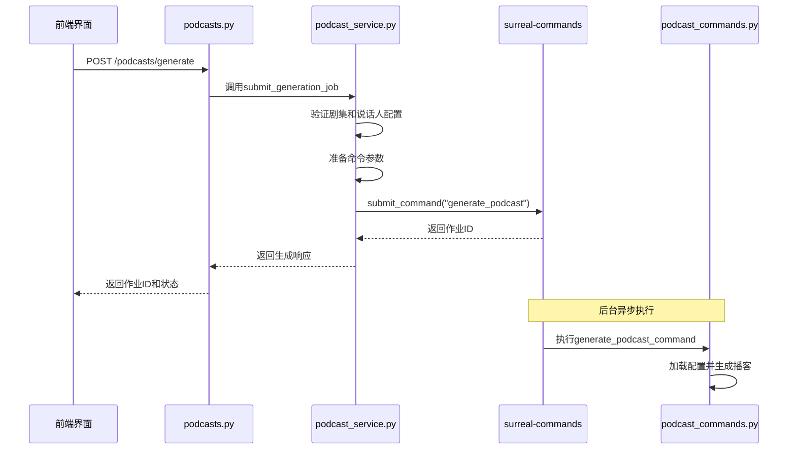
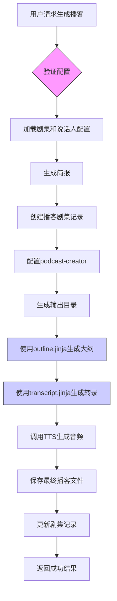
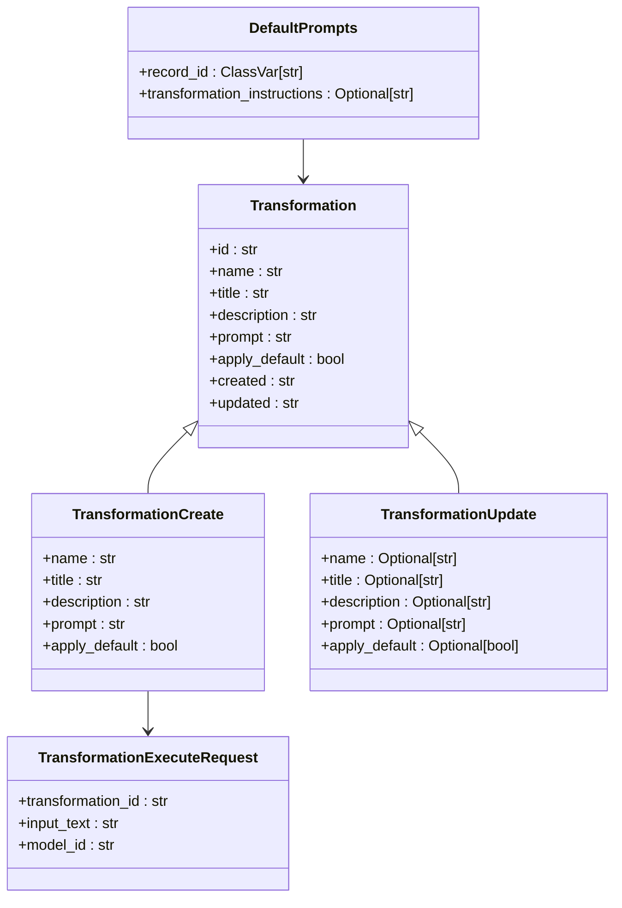
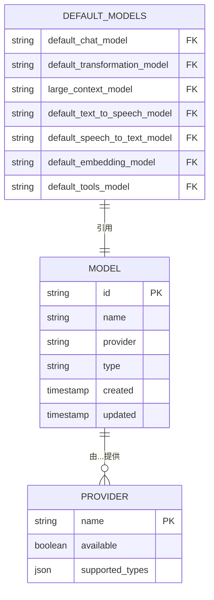
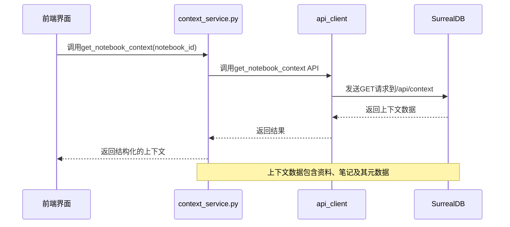

# 功能详解

<cite>
**本文档引用的文件**  
- [podcasts.py](file://api/routers/podcasts.py)
- [podcast_service.py](file://api/podcast_service.py)
- [podcast_api_service.py](file://api/podcast_api_service.py)
- [transformations.py](file://api/routers/transformations.py)
- [transformations_service.py](file://api/transformations_service.py)
- [models.py](file://api/models.py)
- [context_service.py](file://api/context_service.py)
- [podcast.py](file://open_notebook/domain/podcast.py)
- [transformation.py](file://open_notebook/domain/transformation.py)
- [podcast_commands.py](file://commands/podcast_commands.py)
- [outline.jinja](file://prompts/podcast/outline.jinja)
- [transcript.jinja](file://prompts/podcast/transcript.jinja)
</cite>

## 目录
1. [播客生成功能](#播客生成功能)
2. [转换功能](#转换功能)
3. [AI模型管理](#ai模型管理)
4. [上下文管理](#上下文管理)

## 播客生成功能

open-notebook的播客生成功能通过AI技术实现多说话人播客的自动化生成，其核心机制基于Episode Profile（播客剧集配置）和Speaker Profile（说话人配置）的组合，结合Jinja2提示模板和TTS（语音合成）技术完成整个流程。

该功能的实现始于`podcasts.py`路由文件中的`generate_podcast`端点，该端点接收一个`PodcastGenerationRequest`请求，包含剧集名称、剧集配置、说话人配置、内容源等参数。当用户提交生成请求时，系统不会立即开始处理，而是通过`PodcastService.submit_generation_job`方法将任务提交到后台异步处理系统（surreal-commands），并立即返回一个作业ID，实现非阻塞式调用。

**Diagram sources**  
- [podcasts.py](file://api/routers/podcasts.py#L40-L63)
- [podcast_service.py](file://api/podcast_service.py#L37-L105)
- [podcast_commands.py](file://commands/podcast_commands.py#L49-L188)

**Section sources**  
- [podcasts.py](file://api/routers/podcasts.py#L40-L63)
- [podcast_service.py](file://api/podcast_service.py#L37-L105)

剧集配置（`EpisodeProfile`）和说话人配置（`SpeakerProfile`）是播客生成的核心。`EpisodeProfile`定义了播客的整体结构，包括用于生成大纲和转录的AI模型（`outline_model`和`transcript_model`）、默认简报模板（`default_briefing`）以及段落数量等。`SpeakerProfile`则定义了语音合成的提供商（如ElevenLabs、OpenAI）、TTS模型以及一个包含1-4个说话人的配置数组，每个说话人都有姓名、声音ID、背景故事和个性等属性。

播客生成的实际执行由`podcast_commands.py`文件中的`generate_podcast_command`函数完成。该函数首先从数据库加载指定的剧集和说话人配置，然后使用`podcast-creator`库进行实际的播客创建。生成过程分为两个主要阶段：首先使用`outline.jinja`提示模板生成播客大纲，然后使用`transcript.jinja`提示模板为每个段落生成对话。

`outline.jinja`模板指导AI根据提供的简报、上下文内容和说话人信息，创建一个包含指定数量段落的JSON格式大纲。模板明确要求AI考虑说话人的个性和背景来规划内容，并确保段落之间逻辑连贯。生成的大纲随后被`transcript.jinja`模板使用，该模板为每个段落生成具体的对话内容。它要求AI根据说话人的个性和专业知识来分配对话，并确保对话自然流畅，至少包含指定数量的对话轮次。

**Diagram sources**  
- [podcast_commands.py](file://commands/podcast_commands.py#L58-L187)
- [outline.jinja](file://prompts/podcast/outline.jinja)
- [transcript.jinja](file://prompts/podcast/transcript.jinja)

**Section sources**  
- [podcast_commands.py](file://commands/podcast_commands.py#L49-L188)
- [podcast.py](file://open_notebook/domain/podcast.py)

## 转换功能

open-notebook的转换功能允许用户通过Jinja2模板对内容进行结构化处理，实现内容的自动化重构和增强。该功能的核心是`Transformation`模型，它包含一个名称、标题、描述和最重要的`prompt`字段，该字段存储了Jinja2模板字符串。

转换功能的API由`transformations.py`路由文件提供，支持创建、读取、更新、删除和执行转换。当用户执行一个转换时，系统会调用`execute_transformation`端点，该端点接收转换ID、输入文本和要使用的AI模型ID。服务层会验证转换和模型的存在，然后将其传递给`transformation_graph`（一个LangGraph工作流）进行处理。

**Diagram sources**  
- [transformations.py](file://api/routers/transformations.py)
- [transformation.py](file://open_notebook/domain/transformation.py)
- [models.py](file://api/models.py#L101-L154)

**Section sources**  
- [transformations.py](file://api/routers/transformations.py)
- [transformations_service.py](file://api/transformations_service.py)

转换的执行机制基于`open_notebook.graphs.transformation`模块中的`transformation_graph`。这个图（graph）是一个预编译的工作流，它接收输入文本和转换对象，然后使用指定的AI模型来渲染Jinja2模板。模板可以访问输入文本，并利用AI模型的推理能力来生成结构化的输出。例如，一个“摘要”转换的模板可能包含类似`"请将以下文本总结为三个要点：{{ input_text }}"`的指令。

系统还支持默认转换模板，由`DefaultPrompts`类管理。这个单例对象存储了一个全局的`transformation_instructions`字段，可以作为所有新转换的默认提示。用户可以通过`/transformations/default-prompt`端点来获取和更新这个默认提示，为用户提供了一种自定义系统默认行为的方式。

## AI模型管理

open-notebook的AI模型管理架构设计灵活，支持多种AI提供商和模型类型，包括语言模型、嵌入模型、语音合成（TTS）和语音识别（STT）。该架构的核心是`Model`实体，它在数据库中存储每个模型的名称、提供商和类型。

系统支持广泛的AI提供商，包括OpenAI、Anthropic、Google Gemini、Ollama、ElevenLabs、Mistral、DeepSeek、xAI (Grok)、Voyage AI、Groq、Vertex AI、Azure OpenAI、OpenRouter、Perplexity以及任何兼容OpenAI API的接口。这种多提供商支持允许用户根据成本、性能、隐私需求和功能来选择最适合的模型。

**Diagram sources**  
- [models.py](file://api/models.py#L62-L90)
- [docs/features/ai-models.md](file://docs/features/ai-models.md)

**Section sources**  
- [models.py](file://api/models.py#L62-L90)
- [docs/features/ai-models.md](file://docs/features/ai-models.md)

模型配置通过前端的模型管理界面进行，用户可以添加新模型，指定其名称、提供商和类型。系统会根据提供商的可用性动态更新可用模型列表。对于Ollama等本地运行的提供商，用户需要确保Ollama服务正在运行，并且所需的模型已通过`ollama pull`命令下载。

系统采用默认模型设置策略来简化用户操作。用户可以在设置中为不同任务指定默认模型，例如默认聊天模型、默认转换模型、大上下文模型和默认TTS模型。这些默认设置存储在`DefaultModelsResponse`模型中，并在用户未明确选择模型时被系统自动使用。例如，在播客生成中，如果`EpisodeProfile`指定了`gpt-5`作为`transcript_model`，则会使用该模型；否则，系统可能会回退到用户的默认语言模型。

## 上下文管理

上下文管理是open-notebook实现跨会话知识连贯性的核心机制。它负责在用户与AI交互时，从用户的笔记本、笔记和资料中收集相关信息，并将其作为上下文注入到AI提示中，确保AI的回答基于用户个人知识库。

上下文管理的实现主要由`context_service.py`文件中的`ContextService`类负责。该服务通过`get_notebook_context`方法，根据指定的笔记本ID和可选的上下文配置，从数据库中检索相关的资料和笔记。上下文配置允许用户精细控制哪些资料和笔记应被包含以及它们的包含级别。

**Diagram sources**  
- [context_service.py](file://api/context_service.py)
- [models.py](file://api/models.py#L364-L386)

**Section sources**  
- [context_service.py](file://api/context_service.py)
- [models.py](file://api/models.py#L364-L386)

在前端，上下文管理与聊天会话紧密结合。`useNotebookChat.ts`钩子和`SessionManager.tsx`组件共同管理用户的聊天会话。每个会话可以关联特定的上下文选择，当用户切换会话时，系统会重建相应的上下文。`navigation-store.ts`还实现了上下文状态的持久化，通过`sessionStorage`在用户导航时保留上下文选择，确保用户体验的连贯性。

系统通过`buildContext`函数动态构建上下文，该函数会根据用户的选择，将资料的全文、笔记内容等组合成一个结构化的上下文对象。这个对象随后被传递给AI模型，作为生成回答的依据。通过这种方式，系统能够维护跨多个交互的上下文一致性，使AI能够像一个真正了解用户知识库的助手一样工作。