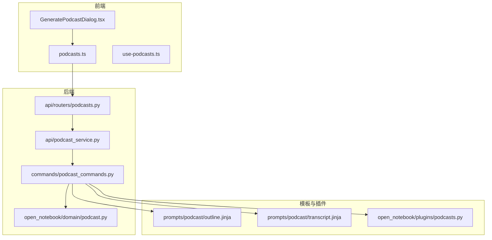
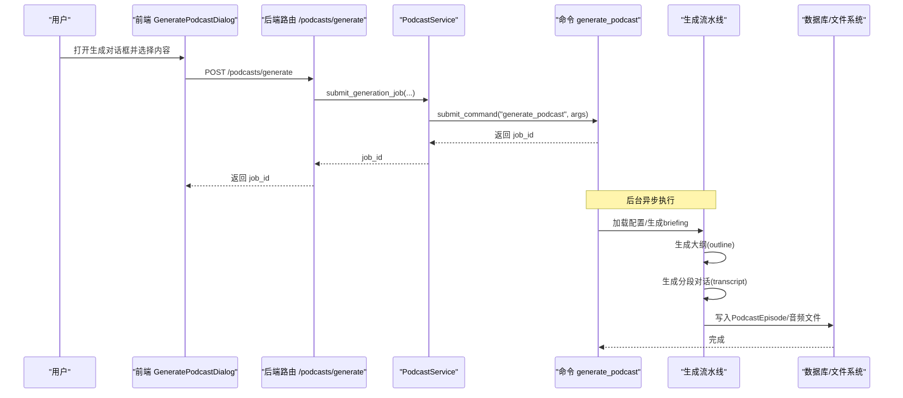
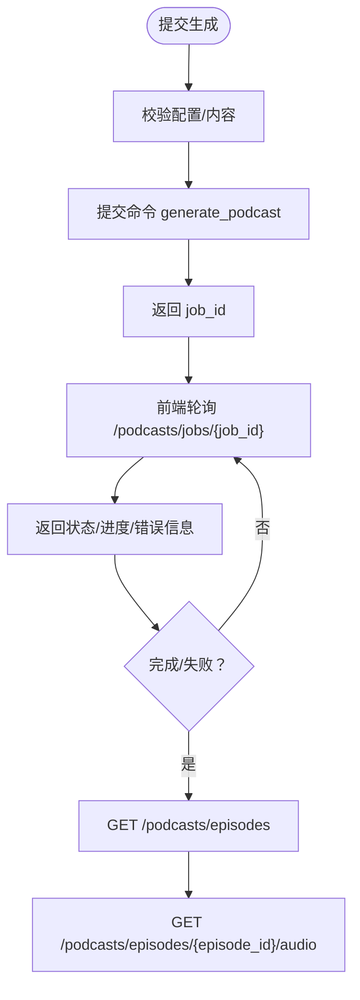
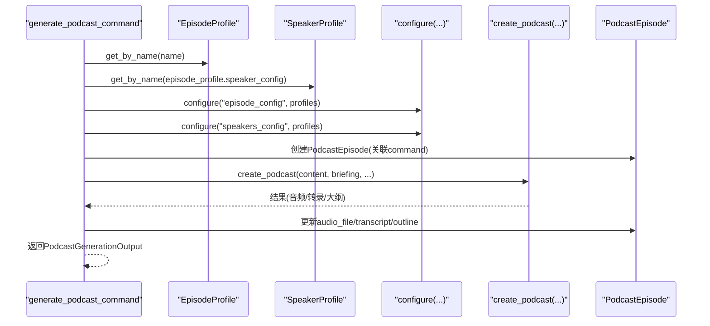
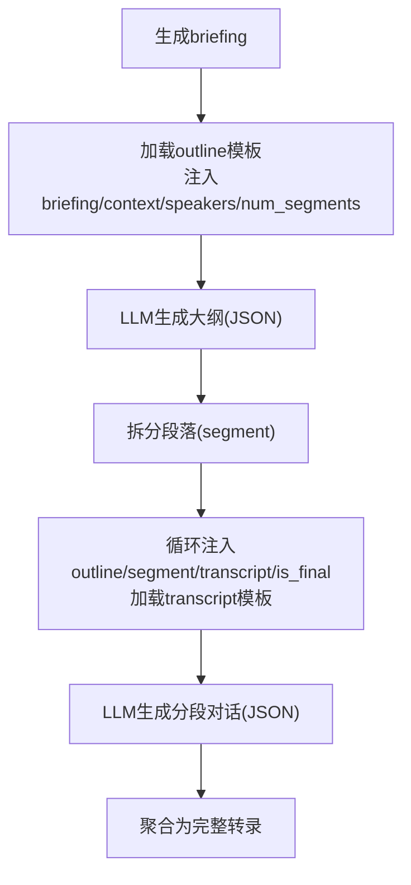
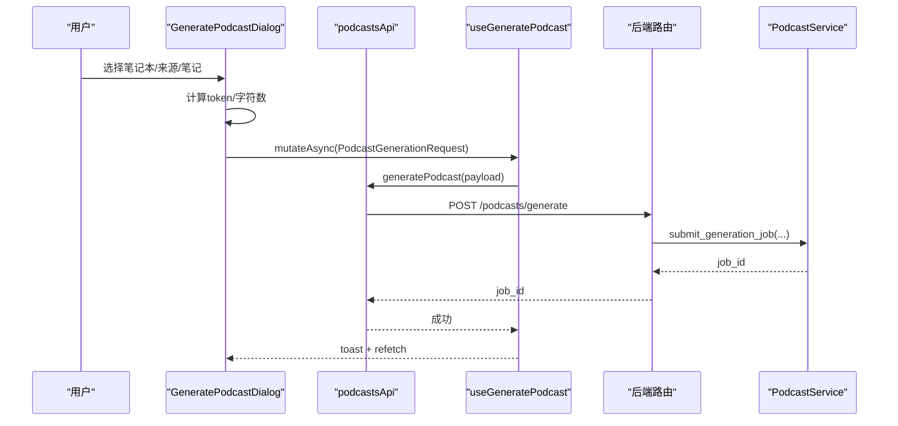
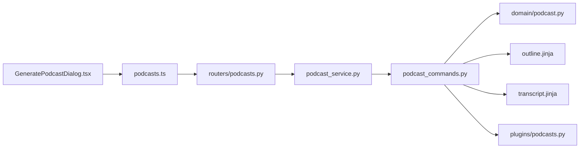

# 播客生成

<cite>
**本文引用的文件**
- [api/routers/podcasts.py](file://api/routers/podcasts.py)
- [api/podcast_service.py](file://api/podcast_service.py)
- [commands/podcast_commands.py](file://commands/podcast_commands.py)
- [open_notebook/domain/podcast.py](file://open_notebook/domain/podcast.py)
- [open_notebook/plugins/podcasts.py](file://open_notebook/plugins/podcasts.py)
- [prompts/podcast/outline.jinja](file://prompts/podcast/outline.jinja)
- [prompts/podcast/transcript.jinja](file://prompts/podcast/transcript.jinja)
- [frontend/src/components/podcasts/GeneratePodcastDialog.tsx](file://frontend/src/components/podcasts/GeneratePodcastDialog.tsx)
- [frontend/src/lib/api/podcasts.ts](file://frontend/src/lib/api/podcasts.ts)
- [frontend/src/lib/hooks/use-podcasts.ts](file://frontend/src/lib/hooks/use-podcasts.ts)
- [docs/features/podcasts.md](file://docs/features/podcasts.md)
</cite>

## 目录
1. [简介](#简介)
2. [项目结构](#项目结构)
3. [核心组件](#核心组件)
4. [架构总览](#架构总览)
5. [详细组件分析](#详细组件分析)
6. [依赖关系分析](#依赖关系分析)
7. [性能考虑](#性能考虑)
8. [故障排查指南](#故障排查指南)
9. [结论](#结论)
10. [附录](#附录)

## 简介
本文件深入解析播客生成功能的技术实现，围绕“Jinja2模板驱动的AI生成”这一核心机制，系统阐述从模板配置、说话人角色定义、对话逻辑编排到语音合成（TTS）集成的完整链路。后端通过FastAPI路由与服务层协调命令提交与状态查询；前端通过对话框组件引导用户选择内容、配置参数并发起生成任务。文档同时提供实际使用示例、常见问题排查方法以及性能优化建议。

## 项目结构
播客生成功能横跨后端API、命令执行、领域模型、模板与前端交互等模块：
- 后端API：提供生成、状态查询、资源管理等REST接口
- 命令执行：以异步命令形式在后台流水线中执行生成
- 领域模型：EpisodeProfile、SpeakerProfile、PodcastEpisode等
- 模板：outline.jinja与transcript.jinja用于指导AI生成大纲与分段对话
- 插件：open_notebook/plugins/podcasts.py提供基于podcastfy的TTS集成能力
- 前端：GeneratePodcastDialog负责构建上下文、组装请求并跟踪生成状态

图表来源
- [api/routers/podcasts.py](file://api/routers/podcasts.py#L40-L76)
- [api/podcast_service.py](file://api/podcast_service.py#L33-L113)
- [commands/podcast_commands.py](file://commands/podcast_commands.py#L49-L168)
- [open_notebook/domain/podcast.py](file://open_notebook/domain/podcast.py#L10-L149)
- [prompts/podcast/outline.jinja](file://prompts/podcast/outline.jinja#L1-L84)
- [prompts/podcast/transcript.jinja](file://prompts/podcast/transcript.jinja#L1-L100)
- [open_notebook/plugins/podcasts.py](file://open_notebook/plugins/podcasts.py#L55-L149)
- [frontend/src/components/podcasts/GeneratePodcastDialog.tsx](file://frontend/src/components/podcasts/GeneratePodcastDialog.tsx#L448-L511)
- [frontend/src/lib/api/podcasts.ts](file://frontend/src/lib/api/podcasts.ts#L106-L112)
- [frontend/src/lib/hooks/use-podcasts.ts](file://frontend/src/lib/hooks/use-podcasts.ts#L322-L369)

章节来源
- [api/routers/podcasts.py](file://api/routers/podcasts.py#L40-L76)
- [api/podcast_service.py](file://api/podcast_service.py#L33-L113)
- [commands/podcast_commands.py](file://commands/podcast_commands.py#L49-L168)
- [open_notebook/domain/podcast.py](file://open_notebook/domain/podcast.py#L10-L149)
- [prompts/podcast/outline.jinja](file://prompts/podcast/outline.jinja#L1-L84)
- [prompts/podcast/transcript.jinja](file://prompts/podcast/transcript.jinja#L1-L100)
- [open_notebook/plugins/podcasts.py](file://open_notebook/plugins/podcasts.py#L55-L149)
- [frontend/src/components/podcasts/GeneratePodcastDialog.tsx](file://frontend/src/components/podcasts/GeneratePodcastDialog.tsx#L448-L511)
- [frontend/src/lib/api/podcasts.ts](file://frontend/src/lib/api/podcasts.ts#L106-L112)
- [frontend/src/lib/hooks/use-podcasts.ts](file://frontend/src/lib/hooks/use-podcasts.ts#L322-L369)

## 核心组件
- 后端路由与服务
  - 路由：提供生成、作业状态查询、剧集列表、单集详情、音频流式下载、删除等接口
  - 服务：封装提交生成作业、查询作业状态、列出/获取剧集等业务逻辑
- 命令执行器
  - 以异步命令形式执行生成流水线，加载配置、生成briefing、调用podcast-creator生成结果并持久化
- 领域模型
  - EpisodeProfile、SpeakerProfile、PodcastEpisode，支撑配置与状态管理
- 模板
  - outline.jinja：指导AI生成分段大纲
  - transcript.jinja：指导AI生成分段对话，严格约束JSON输出格式
- 插件（TTS）
  - open_notebook/plugins/podcasts.py：封装podcastfy生成流程，支持多Provider与语音配置
- 前端组件
  - GeneratePodcastDialog：构建上下文、组装请求、触发生成、监听状态
  - use-podcasts：查询剧集、自动刷新、分组统计、生成状态监听

章节来源
- [api/routers/podcasts.py](file://api/routers/podcasts.py#L40-L76)
- [api/podcast_service.py](file://api/podcast_service.py#L33-L113)
- [commands/podcast_commands.py](file://commands/podcast_commands.py#L49-L168)
- [open_notebook/domain/podcast.py](file://open_notebook/domain/podcast.py#L10-L149)
- [prompts/podcast/outline.jinja](file://prompts/podcast/outline.jinja#L1-L84)
- [prompts/podcast/transcript.jinja](file://prompts/podcast/transcript.jinja#L1-L100)
- [open_notebook/plugins/podcasts.py](file://open_notebook/plugins/podcasts.py#L55-L149)
- [frontend/src/components/podcasts/GeneratePodcastDialog.tsx](file://frontend/src/components/podcasts/GeneratePodcastDialog.tsx#L448-L511)
- [frontend/src/lib/hooks/use-podcasts.ts](file://frontend/src/lib/hooks/use-podcasts.ts#L322-L369)

## 架构总览
播客生成采用“异步命令+流水线”的非阻塞架构：
- 用户在前端选择内容与配置，提交生成请求
- 后端接收请求后，提交异步命令至命令系统，立即返回job_id
- 命令执行器在后台按顺序执行：加载配置、生成briefing、调用podcast-creator生成大纲与分段对话、写入数据库、生成音频
- 前端通过轮询或自动刷新获取最新状态，完成后可播放/下载

图表来源
- [api/routers/podcasts.py](file://api/routers/podcasts.py#L40-L76)
- [api/podcast_service.py](file://api/podcast_service.py#L33-L113)
- [commands/podcast_commands.py](file://commands/podcast_commands.py#L49-L168)
- [open_notebook/domain/podcast.py](file://open_notebook/domain/podcast.py#L90-L149)

## 详细组件分析

### 后端路由与服务
- 路由层
  - 提交生成：POST /podcasts/generate，返回job_id
  - 查询作业：GET /podcasts/jobs/{job_id}
  - 列表与详情：GET /podcasts/episodes、GET /podcasts/episodes/{episode_id}
  - 流式音频：GET /podcasts/episodes/{episode_id}/audio
  - 删除：DELETE /podcasts/episodes/{episode_id}
- 服务层
  - submit_generation_job：校验配置、准备命令参数、提交命令、返回job_id
  - get_job_status：封装命令状态查询
  - list/get_episode：读取剧集数据，补充音频URL与作业状态

图表来源
- [api/routers/podcasts.py](file://api/routers/podcasts.py#L40-L76)
- [api/podcast_service.py](file://api/podcast_service.py#L114-L138)

章节来源
- [api/routers/podcasts.py](file://api/routers/podcasts.py#L40-L76)
- [api/podcast_service.py](file://api/podcast_service.py#L33-L113)
- [api/podcast_service.py](file://api/podcast_service.py#L114-L138)

### 命令执行器与生成流水线
- 命令输入/输出
  - 输入：episode_profile、speaker_profile、episode_name、content、briefing_suffix
  - 输出：success、episode_id、audio_file_path、transcript、outline、processing_time、error_message
- 流水线步骤
  - 加载EpisodeProfile/SpeakerProfile
  - 组织所有配置为字典并传给podcast-creator
  - 生成briefing（默认模板+附加指令）
  - 创建PodcastEpisode记录并关联命令ID
  - 调用create_podcast生成最终音频、转录与大纲
  - 保存结果并返回

图表来源
- [commands/podcast_commands.py](file://commands/podcast_commands.py#L31-L47)
- [commands/podcast_commands.py](file://commands/podcast_commands.py#L49-L168)
- [open_notebook/domain/podcast.py](file://open_notebook/domain/podcast.py#L90-L149)

章节来源
- [commands/podcast_commands.py](file://commands/podcast_commands.py#L31-L47)
- [commands/podcast_commands.py](file://commands/podcast_commands.py#L49-L168)
- [open_notebook/domain/podcast.py](file://open_notebook/domain/podcast.py#L90-L149)

### 模板驱动的AI生成
- 大纲模板 outline.jinja
  - 接收briefing、context、speakers、num_segments等变量
  - 生成segments数组，包含name/description/size字段
  - 严格要求JSON输出格式
- 对话模板 transcript.jinja
  - 接收briefing、context、speakers、outline、segment、transcript、is_final等变量
  - 限定turns数量、严格speaker选择与格式要求
  - 仅返回JSON对象，避免代码块包裹

图表来源
- [prompts/podcast/outline.jinja](file://prompts/podcast/outline.jinja#L1-L84)
- [prompts/podcast/transcript.jinja](file://prompts/podcast/transcript.jinja#L1-L100)

章节来源
- [prompts/podcast/outline.jinja](file://prompts/podcast/outline.jinja#L1-L84)
- [prompts/podcast/transcript.jinja](file://prompts/podcast/transcript.jinja#L1-L100)

### 语音合成（TTS）集成
- 插件方式（open_notebook/plugins/podcasts.py）
  - generate_episode方法封装podcastfy生成流程
  - 支持多Provider（openai、google、anthropic、vertexai、elevenlabs）
  - 配置输出目录、临时音频目录、结束语、默认TTS模型与各Provider的默认声音
- 文档推荐的并发控制
  - 通过环境变量TTS_BATCH_SIZE控制并发，避免Provider限流

章节来源
- [open_notebook/plugins/podcasts.py](file://open_notebook/plugins/podcasts.py#L55-L149)
- [docs/features/podcasts.md](file://docs/features/podcasts.md#L217-L235)

### 前端交互与状态管理
- GeneratePodcastDialog
  - 收集笔记本、来源与笔记，构建上下文字符串
  - 组装PodcastGenerationRequest并调用API
  - 展示token/字符计数，提示选择内容
- use-podcasts
  - 自动刷新剧集列表，根据活跃状态调整轮询间隔
  - 分组统计运行中/已完成/失败/待定数量
  - 生成成功后toast提示并触发refetch

图表来源
- [frontend/src/components/podcasts/GeneratePodcastDialog.tsx](file://frontend/src/components/podcasts/GeneratePodcastDialog.tsx#L448-L511)
- [frontend/src/lib/api/podcasts.ts](file://frontend/src/lib/api/podcasts.ts#L106-L112)
- [frontend/src/lib/hooks/use-podcasts.ts](file://frontend/src/lib/hooks/use-podcasts.ts#L346-L369)
- [api/routers/podcasts.py](file://api/routers/podcasts.py#L40-L76)
- [api/podcast_service.py](file://api/podcast_service.py#L33-L113)

章节来源
- [frontend/src/components/podcasts/GeneratePodcastDialog.tsx](file://frontend/src/components/podcasts/GeneratePodcastDialog.tsx#L448-L511)
- [frontend/src/lib/api/podcasts.ts](file://frontend/src/lib/api/podcasts.ts#L106-L112)
- [frontend/src/lib/hooks/use-podcasts.ts](file://frontend/src/lib/hooks/use-podcasts.ts#L322-L369)

## 依赖关系分析
- 组件耦合
  - 路由依赖服务层；服务层依赖命令系统与领域模型
  - 命令执行器依赖配置加载、podcast-creator库与数据库
  - 前端依赖API封装与React Query进行状态管理
- 关键依赖链
  - GeneratePodcastDialog → podcastsApi → /podcasts/generate → PodcastService → submit_command → generate_podcast_command
  - generate_podcast_command → EpisodeProfile/SpeakerProfile → configure → create_podcast → PodcastEpisode

图表来源
- [frontend/src/components/podcasts/GeneratePodcastDialog.tsx](file://frontend/src/components/podcasts/GeneratePodcastDialog.tsx#L448-L511)
- [frontend/src/lib/api/podcasts.ts](file://frontend/src/lib/api/podcasts.ts#L106-L112)
- [api/routers/podcasts.py](file://api/routers/podcasts.py#L40-L76)
- [api/podcast_service.py](file://api/podcast_service.py#L33-L113)
- [commands/podcast_commands.py](file://commands/podcast_commands.py#L49-L168)
- [open_notebook/domain/podcast.py](file://open_notebook/domain/podcast.py#L10-L149)
- [prompts/podcast/outline.jinja](file://prompts/podcast/outline.jinja#L1-L84)
- [prompts/podcast/transcript.jinja](file://prompts/podcast/transcript.jinja#L1-L100)
- [open_notebook/plugins/podcasts.py](file://open_notebook/plugins/podcasts.py#L55-L149)

章节来源
- [api/routers/podcasts.py](file://api/routers/podcasts.py#L40-L76)
- [api/podcast_service.py](file://api/podcast_service.py#L33-L113)
- [commands/podcast_commands.py](file://commands/podcast_commands.py#L49-L168)
- [open_notebook/domain/podcast.py](file://open_notebook/domain/podcast.py#L10-L149)
- [prompts/podcast/outline.jinja](file://prompts/podcast/outline.jinja#L1-L84)
- [prompts/podcast/transcript.jinja](file://prompts/podcast/transcript.jinja#L1-L100)
- [open_notebook/plugins/podcasts.py](file://open_notebook/plugins/podcasts.py#L55-L149)
- [frontend/src/components/podcasts/GeneratePodcastDialog.tsx](file://frontend/src/components/podcasts/GeneratePodcastDialog.tsx#L448-L511)
- [frontend/src/lib/api/podcasts.ts](file://frontend/src/lib/api/podcasts.ts#L106-L112)
- [frontend/src/lib/hooks/use-podcasts.ts](file://frontend/src/lib/hooks/use-podcasts.ts#L322-L369)

## 性能考虑
- 异步生成与非阻塞体验
  - 生成请求立即返回job_id，前端轮询或自动刷新，避免UI阻塞
- 并发与限流
  - 使用环境变量TTS_BATCH_SIZE控制并发，平衡速度与稳定性
- 缓存与预热
  - 可缓存模板解析结果与常用配置，减少重复计算
- 数据库与I/O
  - 将音频文件路径与状态分离存储，避免大字段频繁读写
- 前端优化
  - React Query的refetch策略与分组统计，降低无效渲染

章节来源
- [docs/features/podcasts.md](file://docs/features/podcasts.md#L217-L235)
- [frontend/src/lib/hooks/use-podcasts.ts](file://frontend/src/lib/hooks/use-podcasts.ts#L322-L369)

## 故障排查指南
- 生成中断/失败
  - 检查命令状态：GET /podcasts/jobs/{job_id}，查看error_message与progress
  - 若出现“JSON解析失败”或“扩展思考标签导致输出为空”，尝试更换更稳定的LLM模型
- 语音不一致/音色异常
  - 确认SpeakerProfile中的tts_provider与voice是否匹配可用列表
  - 调整TTS_BATCH_SIZE以缓解Provider限流
- 内容不足
  - 确保所选笔记本/来源/笔记足够丰富，建议至少千字以上
- 音频缺失
  - 确认PodcastEpisode记录已写入audio_file路径，且文件存在

章节来源
- [api/routers/podcasts.py](file://api/routers/podcasts.py#L71-L83)
- [api/podcast_service.py](file://api/podcast_service.py#L114-L138)
- [commands/podcast_commands.py](file://commands/podcast_commands.py#L169-L188)
- [docs/features/podcasts.md](file://docs/features/podcasts.md#L236-L286)

## 结论
播客生成功能通过“模板驱动+异步命令+多Provider TTS”的架构，实现了从研究内容到专业播客的自动化生产。前端以对话框引导用户完成上下文构建与参数配置，后端以非阻塞方式提交作业并提供状态追踪，命令执行器在后台完成大纲与对话生成、音频合成与结果持久化。模板严格约束输出格式，确保AI生成质量与一致性；TTS插件提供灵活的语音合成能力。通过合理的并发控制与前端状态管理，系统在易用性与性能之间取得良好平衡。

## 附录
- 实际使用示例（路径指引）
  - 模板变量注入与上下文引用
    - 大纲模板变量：briefing、context、speakers、num_segments
      - 参考：[outline.jinja](file://prompts/podcast/outline.jinja#L1-L84)
    - 对话模板变量：briefing、context、speakers、outline、segment、transcript、is_final、turns、speaker_names
      - 参考：[transcript.jinja](file://prompts/podcast/transcript.jinja#L1-L100)
  - 前端发起生成
    - 组装请求体并调用API：[GeneratePodcastDialog.handleSubmit](file://frontend/src/components/podcasts/GeneratePodcastDialog.tsx#L448-L511)
    - API封装：[podcastsApi.generatePodcast](file://frontend/src/lib/api/podcasts.ts#L106-L112)
  - 后端提交与状态查询
    - 提交生成：[routers.podcasts.generate_podcast](file://api/routers/podcasts.py#L40-L76)
    - 查询状态：[routers.podcasts.get_podcast_job_status](file://api/routers/podcasts.py#L71-L83)
    - 服务层封装：[podcast_service.py](file://api/podcast_service.py#L33-L113)
  - 命令执行与结果持久化
    - 命令定义与输入输出：[commands/podcast_commands.py](file://commands/podcast_commands.py#L31-L47)
    - 生成流水线：[commands/podcast_commands.py](file://commands/podcast_commands.py#L49-L168)
    - 领域模型：[open_notebook/domain/podcast.py](file://open_notebook/domain/podcast.py#L90-L149)
  - TTS集成与并发控制
    - 插件配置：[open_notebook/plugins/podcasts.py](file://open_notebook/plugins/podcasts.py#L55-L149)
    - 并发设置：[docs/features/podcasts.md](file://docs/features/podcasts.md#L217-L235)