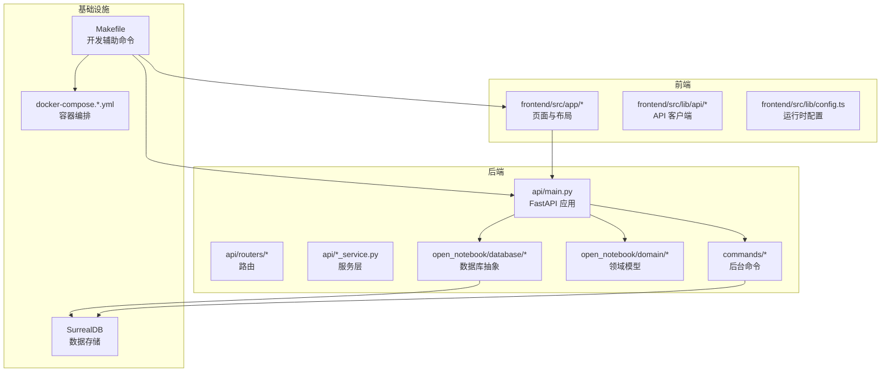
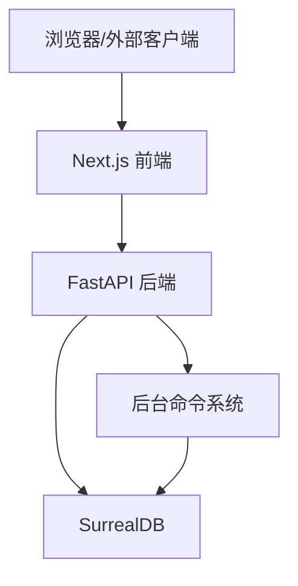
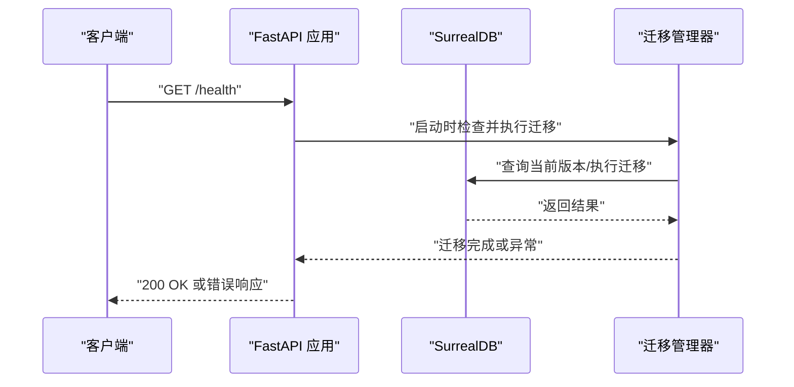
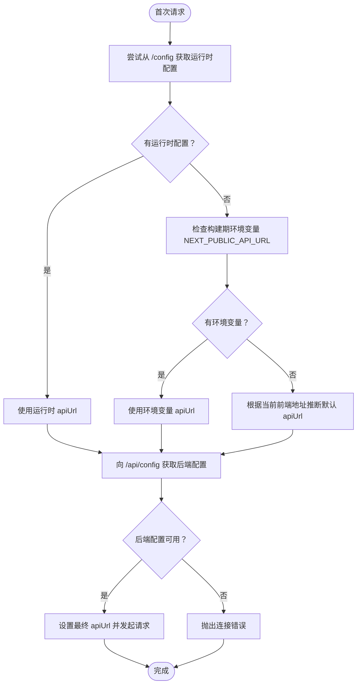
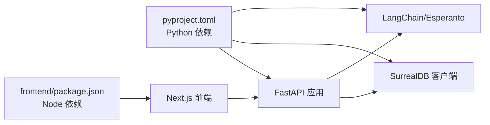

# 开发与贡献

<cite>
**本文引用的文件**
- [README.md](file://README.md)
- [CONTRIBUTING.md](file://CONTRIBUTING.md)
- [docs/development/contributing.md](file://docs/development/contributing.md)
- [docs/development/architecture.md](file://docs/development/architecture.md)
- [DESIGN_PRINCIPLES.md](file://DESIGN_PRINCIPLES.md)
- [Makefile](file://Makefile)
- [pyproject.toml](file://pyproject.toml)
- [mypy.ini](file://mypy.ini)
- [api/main.py](file://api/main.py)
- [frontend/package.json](file://frontend/package.json)
- [frontend/src/lib/config.ts](file://frontend/src/lib/config.ts)
- [frontend/src/lib/api/client.ts](file://frontend/src/lib/api/client.ts)
- [docker-compose.dev.yml](file://docker-compose.dev.yml)
- [docker-compose.full.yml](file://docker-compose.full.yml)
- [tests/conftest.py](file://tests/conftest.py)
- [tests/test_models_api.py](file://tests/test_models_api.py)
- [open_notebook/config.py](file://open_notebook/config.py)
</cite>

## 目录
1. [简介](#简介)
2. [项目结构](#项目结构)
3. [核心组件](#核心组件)
4. [架构总览](#架构总览)
5. [详细组件分析](#详细组件分析)
6. [依赖关系分析](#依赖关系分析)
7. [性能考虑](#性能考虑)
8. [故障排查指南](#故障排查指南)
9. [结论](#结论)
10. [附录](#附录)

## 简介
本指南面向希望参与 Open Notebook 项目开发的贡献者，提供从环境搭建到代码规范、测试与 PR 流程的完整说明。项目采用 Python + FastAPI 后端、Next.js 前端、SurrealDB 数据库的技术栈，并通过 Makefile 提供一键式开发辅助命令，涵盖数据库启动、API 与 Worker 启动、前端开发、类型检查、静态检查、清理缓存等常用任务。

## 项目结构
仓库采用按功能域分层的组织方式：
- api：后端 FastAPI 应用与路由、服务层、模型定义
- frontend：Next.js 前端应用，包含页面、组件、API 客户端、类型与工具
- open_notebook：领域模型、数据库抽象、图计算与工具模块
- commands：后台命令系统（异步作业）
- migrations：SurrealDB 结构迁移脚本
- tests：pytest 测试套件
- docs：开发与用户文档
- 脚本与配置：Makefile、pyproject.toml、mypy.ini、docker-compose 配置等

图表来源
- [api/main.py](file://api/main.py#L1-L129)
- [frontend/src/lib/config.ts](file://frontend/src/lib/config.ts#L1-L148)
- [Makefile](file://Makefile#L1-L201)
- [docker-compose.dev.yml](file://docker-compose.dev.yml#L1-L27)

章节来源
- [README.md](file://README.md#L1-L120)
- [docs/development/architecture.md](file://docs/development/architecture.md#L1-L120)

## 核心组件
- 后端 API（FastAPI）
  - 应用入口与生命周期管理、中间件（认证、CORS）、路由注册
  - 自动数据库迁移与健康检查端点
- 前端（Next.js）
  - 运行时配置优先级与 API URL 解析
  - Axios 客户端拦截器与超时设置
- 数据库（SurrealDB）
  - 通过仓库模式访问，支持迁移脚本
- 后台命令系统
  - 基于 surreal-commands 的异步作业队列
- 开发工具链
  - Makefile 提供一键启动、停止、状态查询、类型检查、静态检查、清理缓存等

章节来源
- [api/main.py](file://api/main.py#L1-L129)
- [frontend/src/lib/config.ts](file://frontend/src/lib/config.ts#L1-L148)
- [frontend/src/lib/api/client.ts](file://frontend/src/lib/api/client.ts#L1-L66)
- [open_notebook/config.py](file://open_notebook/config.py#L1-L18)
- [Makefile](file://Makefile#L1-L201)

## 架构总览
系统采用“API-First + 分层架构”，前后端通过 REST API 通信，数据库为单源真相；AI 处理通过 LangGraph 图工作流实现，后台命令系统负责长耗时任务。

图表来源
- [docs/development/architecture.md](file://docs/development/architecture.md#L254-L286)
- [api/main.py](file://api/main.py#L1-L129)
- [frontend/src/lib/config.ts](file://frontend/src/lib/config.ts#L1-L148)

## 详细组件分析

### 后端 API（FastAPI）
- 应用初始化与生命周期
  - 在 lifespan 中自动执行数据库迁移，失败则快速退出，确保数据库 schema 一致性
- 中间件
  - 密码认证中间件（排除特定路径），CORS 中间件允许跨域请求
- 路由组织
  - 按领域划分的路由模块统一挂载，前缀统一为 /api
- 健康检查
  - 提供根路径与 /health 端点用于服务状态检测

图表来源
- [api/main.py](file://api/main.py#L43-L77)

章节来源
- [api/main.py](file://api/main.py#L1-L129)

### 前端配置与 API 客户端
- 运行时配置优先级
  - 优先从服务端 /config 获取 apiUrl，其次使用构建期环境变量 NEXT_PUBLIC_API_URL，最后根据前端地址推断默认值
- API 客户端
  - 动态 baseURL 注入 /api 前缀
  - 请求头携带 Bearer Token（来自本地存储）
  - 对 FormData 与 JSON 自动处理 Content-Type
  - 统一 5 分钟超时，适配慢速 LLM 操作

图表来源
- [frontend/src/lib/config.ts](file://frontend/src/lib/config.ts#L1-L148)
- [frontend/src/lib/api/client.ts](file://frontend/src/lib/api/client.ts#L1-L66)

章节来源
- [frontend/src/lib/config.ts](file://frontend/src/lib/config.ts#L1-L148)
- [frontend/src/lib/api/client.ts](file://frontend/src/lib/api/client.ts#L1-L66)

### 数据库与迁移
- 数据目录与缓存
  - 数据根目录、上传目录、tiktoken 缓存目录在 open_notebook/config.py 中集中定义
- 迁移机制
  - API 启动时自动执行数据库迁移，确保 schema 最新
- 迁移脚本
  - migrations 目录下按序号命名的 surrealql 文件，支持 up/down 双向迁移

章节来源
- [open_notebook/config.py](file://open_notebook/config.py#L1-L18)
- [api/main.py](file://api/main.py#L43-L77)

### 后台命令系统
- 启动与管理
  - Makefile 提供 worker-start/stop/restart 命令，基于 surreal-commands-worker 执行
- 作用
  - 异步执行长耗时任务（如生成播客），支持状态跟踪与错误恢复

章节来源
- [Makefile](file://Makefile#L129-L145)

### 开发工具链（Makefile）
- 服务编排
  - start-all：启动 SurrealDB、API、Worker、前端（Next.js）
  - stop-all：停止所有服务并关闭容器
  - status：查看各服务运行状态
- 类型检查与静态检查
  - lint：mypy 全量检查
  - ruff：ruff 检查并修复
- 文档导出
  - export-docs：调用 scripts/export_docs.py 导出文档
- 清理缓存
  - clean-cache：清理 Python 与工具缓存目录
- Docker 发布
  - docker-push、docker-push-latest、docker-release：多平台镜像构建与推送
- 开发容器
  - dev/full：使用 docker-compose.dev.yml 或 docker-compose.full.yml 启动开发/全功能环境

章节来源
- [Makefile](file://Makefile#L1-L201)

## 依赖关系分析
- Python 依赖
  - FastAPI、Uvicorn、Pydantic、Loguru、LangChain 生态、SurrealDB、Podcast Creator、Esperanto、surreal-commands 等
- 前端依赖
  - Next.js、Radix UI、TanStack Query、Axios、Zustand、TailwindCSS 等
- 工具链
  - uv（推荐）、pytest、ruff、mypy、pre-commit

图表来源
- [pyproject.toml](file://pyproject.toml#L1-L63)
- [frontend/package.json](file://frontend/package.json#L1-L64)

章节来源
- [pyproject.toml](file://pyproject.toml#L1-L63)
- [frontend/package.json](file://frontend/package.json#L1-L64)

## 性能考虑
- 异步优先
  - 后端广泛使用 async/await，避免阻塞；AI 处理通过 LangGraph 并行化
- 数据库优化
  - 使用仓库模式与索引查询，批量操作减少往返
- 前端超时与缓存
  - API 客户端默认 5 分钟超时，适配慢速 LLM；UI 层合理缓存与进度反馈
- 后台作业
  - 将长耗时任务放入后台命令系统，保持接口响应性

章节来源
- [docs/development/architecture.md](file://docs/development/architecture.md#L413-L441)
- [frontend/src/lib/api/client.ts](file://frontend/src/lib/api/client.ts#L1-L66)

## 故障排查指南
- 端口与代理
  - 确保同时暴露前端端口 8502 与 API 端口 5055；远程访问时 API_URL 必须与访问地址一致
- 认证与密码保护
  - 若启用应用级密码保护，需正确配置；测试环境通过 tests/conftest.py 关闭密码认证
- 数据库连接
  - 确认 SURREAL_URL、SURREAL_USER、SURREAL_PASSWORD、SURREAL_NAMESPACE、SURREAL_DATABASE 等环境变量
- 健康检查
  - 使用 curl http://localhost:5055/health 验证后端是否正常
- 前端连通性
  - 访问 http://localhost:8502 验证前端可访问

章节来源
- [README.md](file://README.md#L178-L236)
- [tests/conftest.py](file://tests/conftest.py#L1-L20)
- [api/main.py](file://api/main.py#L121-L129)

## 结论
本指南提供了从环境搭建、技术栈理解、代码规范、测试与 PR 流程到开发辅助命令的完整路径。建议贡献者先阅读设计原则与架构文档，再结合 Makefile 与测试用例开展开发，确保变更符合项目愿景与质量标准。

## 附录

### 本地开发环境搭建步骤
- Python 与 Node.js
  - 推荐使用 uv 安装 Python 依赖；前端使用 npm
- 数据库
  - 使用 Docker 启动 SurrealDB（开发/全功能 compose 文件已提供）
- 后端
  - 启动 API：uv run run_api.py 或使用 Makefile 的 api 目标
- 前端
  - 进入 frontend 目录，执行 npm run dev
- 后台命令
  - 使用 Makefile 的 worker-start/stop/restart 管理

章节来源
- [docs/development/contributing.md](file://docs/development/contributing.md#L456-L506)
- [docker-compose.dev.yml](file://docker-compose.dev.yml#L1-L27)
- [docker-compose.full.yml](file://docker-compose.full.yml#L1-L26)
- [Makefile](file://Makefile#L126-L163)

### 测试与验证
- 单元测试（pytest）
  - 运行 uv run pytest；测试用例位于 tests/ 目录
  - 测试夹具在 tests/conftest.py 中配置，禁用密码认证以便测试
- API 行为测试示例
  - tests/test_models_api.py 展示了对模型创建与提供商可用性的端到端测试
- 类型检查与静态检查
  - uv run ruff check . 与 uv run python -m mypy . 或使用 Makefile 的 ruff 与 lint 目标

章节来源
- [tests/conftest.py](file://tests/conftest.py#L1-L20)
- [tests/test_models_api.py](file://tests/test_models_api.py#L1-L353)
- [CONTRIBUTING.md](file://CONTRIBUTING.md#L61-L71)
- [Makefile](file://Makefile#L25-L31)

### Pull Request 提交流程与代码审查标准
- Issue 驱动
  - 先建 Issue 描述问题或特性，获得维护者分配后再开始编码
- 代码规范
  - Python 遵循 PEP 8，使用类型提示与 docstring；前端遵循 TypeScript 最佳实践
- 质量门禁
  - 通过 pytest、ruff、mypy 检查；更新相关文档
- PR 规范
  - 一次只解决一个问题；描述变更动机与影响；附带截图（UI 变更）

章节来源
- [CONTRIBUTING.md](file://CONTRIBUTING.md#L47-L112)
- [docs/development/contributing.md](file://docs/development/contributing.md#L99-L180)

### 版本发布策略
- Makefile 提供 docker-push、docker-push-latest、docker-release 三大目标
  - docker-push：仅推送版本标签（不更新 latest）
  - docker-push-latest：推送版本并更新 v1-latest 标签
  - docker-release：先执行 docker-push-latest 再输出完成信息
- 标签管理
  - tag 目标从 pyproject.toml 读取版本并打标签与推送

章节来源
- [Makefile](file://Makefile#L48-L117)
- [pyproject.toml](file://pyproject.toml#L1-L10)

### 编码规范与风格
- Python
  - 使用 ruff 进行格式化与检查；mypy 配置见 mypy.ini
- 前端
  - 使用 Next.js 与 TypeScript，遵循项目内 ESLint/Tailwind 配置
- 文档
  - 使用 Markdown；API 文档由 FastAPI 自动生成

章节来源
- [pyproject.toml](file://pyproject.toml#L71-L99)
- [mypy.ini](file://mypy.ini#L1-L37)
- [frontend/package.json](file://frontend/package.json#L1-L64)

### 设计原则与架构指引
- 设计原则
  - 隐私优先、简洁优先、API-First、多提供商灵活性、可扩展性、异步优先
- 架构要点
  - 分层清晰、领域驱动、数据库为单源真相、搜索与 AI 处理解耦、后台作业系统

章节来源
- [DESIGN_PRINCIPLES.md](file://DESIGN_PRINCIPLES.md#L1-L120)
- [docs/development/architecture.md](file://docs/development/architecture.md#L1-L120)