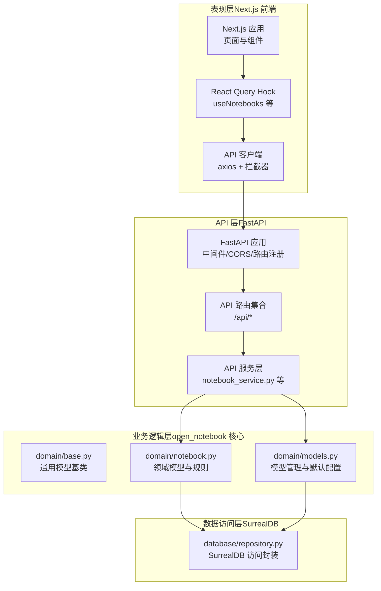
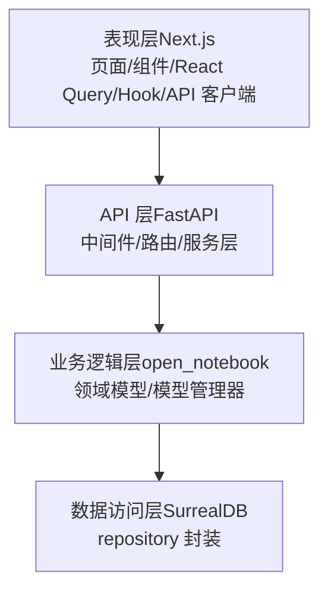
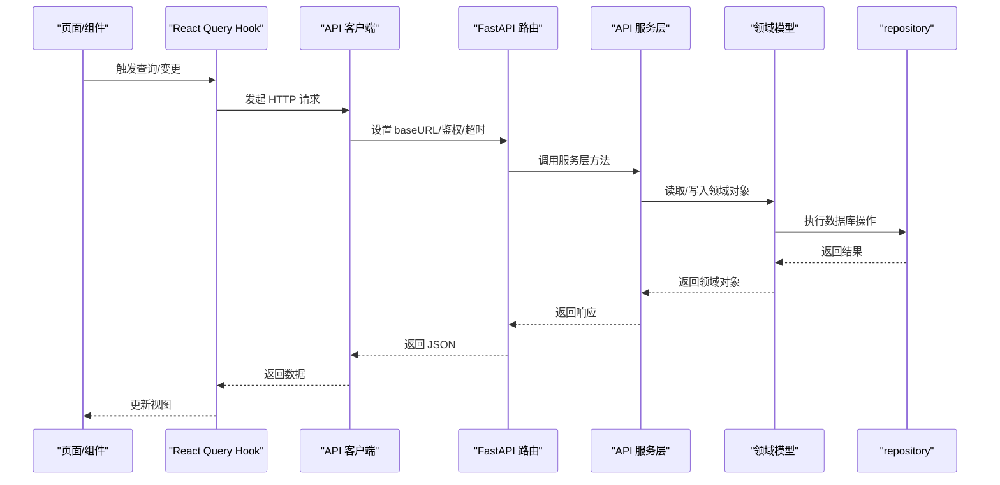
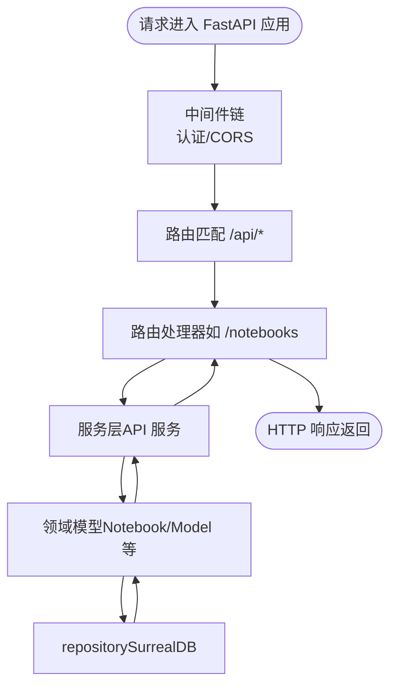
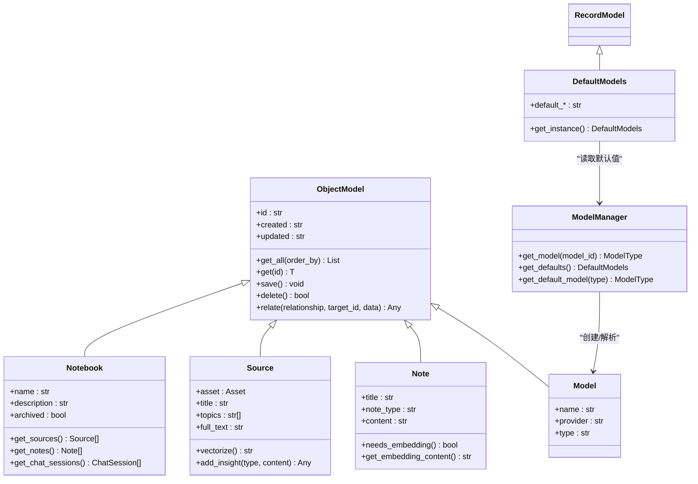
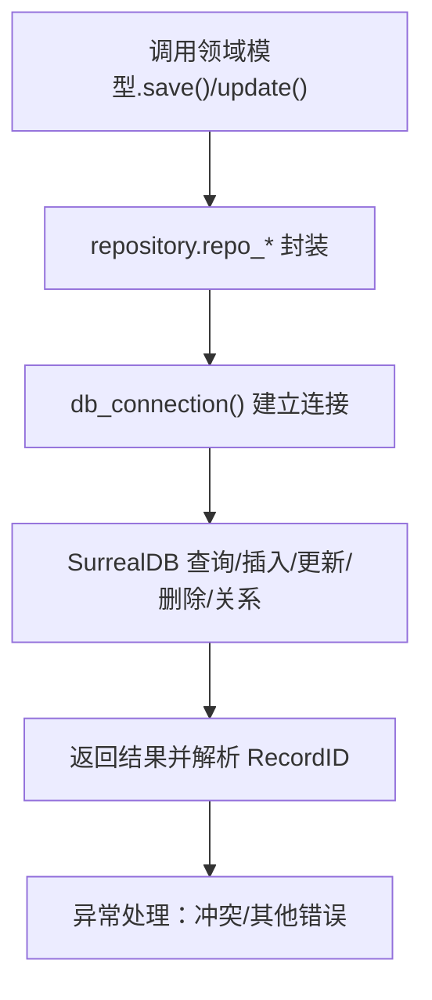
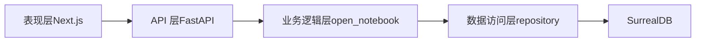

# 分层架构

<cite>
**本文引用的文件列表**
- [README.md](file://README.md)
- [DESIGN_PRINCIPLES.md](file://DESIGN_PRINCIPLES.md)
- [frontend/src/app/layout.tsx](file://frontend/src/app/layout.tsx)
- [frontend/src/lib/api/client.ts](file://frontend/src/lib/api/client.ts)
- [frontend/src/lib/hooks/use-notebooks.ts](file://frontend/src/lib/hooks/use-notebooks.ts)
- [api/main.py](file://api/main.py)
- [api/routers/notebooks.py](file://api/routers/notebooks.py)
- [api/models.py](file://api/models.py)
- [api/notebook_service.py](file://api/notebook_service.py)
- [api/models_service.py](file://api/models_service.py)
- [open_notebook/domain/base.py](file://open_notebook/domain/base.py)
- [open_notebook/domain/notebook.py](file://open_notebook/domain/notebook.py)
- [open_notebook/domain/models.py](file://open_notebook/domain/models.py)
- [open_notebook/database/repository.py](file://open_notebook/database/repository.py)
- [open_notebook/config.py](file://open_notebook/config.py)
</cite>

## 目录
1. [引言](#引言)
2. [项目结构](#项目结构)
3. [核心组件](#核心组件)
4. [架构总览](#架构总览)
5. [详细组件分析](#详细组件分析)
6. [依赖关系分析](#依赖关系分析)
7. [性能考量](#性能考量)
8. [故障排查指南](#故障排查指南)
9. [结论](#结论)
10. [附录](#附录)

## 引言
本文件系统化阐述 open-notebook 的 Clean Architecture 设计与落地方式，围绕表现层（Next.js 前端）、API 层（FastAPI）、业务逻辑层（open_notebook 核心模块）与数据访问层（SurrealDB）进行分层说明。文档重点解释：
- 各层职责边界与接口契约
- 前后端如何通过 API 路由协作
- 业务逻辑层如何封装领域服务与规则
- 数据访问层如何通过 SurrealDB 实现持久化
- 请求从用户界面到数据库的完整流转过程
- Clean Architecture 如何提升可维护性、可测试性与可扩展性
- 开发实践建议与最佳实践

## 项目结构
open-notebook 采用前后端分离的分层架构：
- 表现层：Next.js 应用，负责 UI 渲染、状态管理与 API 调用
- API 层：FastAPI 提供 REST 接口，统一处理认证、CORS、路由注册与生命周期
- 业务逻辑层：open_notebook.core（domain、graphs、plugins、utils 等），封装领域模型与业务规则
- 数据访问层：SurrealDB，通过 repository 封装查询、插入、更新、删除与关系建立

图表来源
- [frontend/src/app/layout.tsx](file://frontend/src/app/layout.tsx#L1-L43)
- [frontend/src/lib/api/client.ts](file://frontend/src/lib/api/client.ts#L1-L66)
- [frontend/src/lib/hooks/use-notebooks.ts](file://frontend/src/lib/hooks/use-notebooks.ts#L1-L91)
- [api/main.py](file://api/main.py#L1-L129)
- [api/routers/notebooks.py](file://api/routers/notebooks.py#L1-L276)
- [api/notebook_service.py](file://api/notebook_service.py#L1-L87)
- [open_notebook/domain/base.py](file://open_notebook/domain/base.py#L1-L330)
- [open_notebook/domain/notebook.py](file://open_notebook/domain/notebook.py#L1-L457)
- [open_notebook/domain/models.py](file://open_notebook/domain/models.py#L1-L199)
- [open_notebook/database/repository.py](file://open_notebook/database/repository.py#L1-L177)

章节来源
- [README.md](file://README.md#L237-L269)
- [DESIGN_PRINCIPLES.md](file://DESIGN_PRINCIPLES.md#L150-L182)

## 核心组件
- 表现层（Next.js）
  - 使用 React Query 管理数据流与缓存，通过自定义 API 客户端发起请求
  - 统一拦截器设置基础 URL、鉴权头、超时与错误处理
- API 层（FastAPI）
  - 注册多路由模块，集中处理认证中间件、CORS 中间件与健康检查
  - 生命周期内自动执行数据库迁移
- 业务逻辑层（open_notebook）
  - 领域模型继承通用基类，提供 CRUD、关系操作与嵌入生成等能力
  - 模型管理器负责默认模型解析与类型化模型实例获取
- 数据访问层（SurrealDB）
  - 通过 repository 封装连接、查询、插入、更新、删除与关系建立
  - 支持记录 ID 解析与事务冲突重试语义

章节来源
- [frontend/src/lib/api/client.ts](file://frontend/src/lib/api/client.ts#L1-L66)
- [frontend/src/lib/hooks/use-notebooks.ts](file://frontend/src/lib/hooks/use-notebooks.ts#L1-L91)
- [api/main.py](file://api/main.py#L1-L129)
- [open_notebook/domain/base.py](file://open_notebook/domain/base.py#L1-L330)
- [open_notebook/domain/models.py](file://open_notebook/domain/models.py#L1-L199)
- [open_notebook/database/repository.py](file://open_notebook/database/repository.py#L1-L177)

## 架构总览
Clean Architecture 的四层划分与职责：
- 表现层（UI 层）
  - Next.js 页面与组件，调用 React Query Hook
  - Hook 内部调用 API 客户端，客户端动态设置 baseURL 并注入鉴权头
- API 层（接口层）
  - FastAPI 应用，注册路由模块，处理认证与跨域
  - 路由处理器调用服务层，服务层再委托领域模型与数据访问
- 业务逻辑层（领域层）
  - 领域模型与规则封装，面向数据库结构的抽象
  - 通过模型管理器与 AI 工厂解耦外部模型提供方
- 数据访问层（基础设施层）
  - SurrealDB 连接与查询封装，提供 CRUD 与关系操作

图表来源
- [api/main.py](file://api/main.py#L1-L129)
- [api/routers/notebooks.py](file://api/routers/notebooks.py#L1-L276)
- [api/notebook_service.py](file://api/notebook_service.py#L1-L87)
- [open_notebook/domain/base.py](file://open_notebook/domain/base.py#L1-L330)
- [open_notebook/domain/notebook.py](file://open_notebook/domain/notebook.py#L1-L457)
- [open_notebook/database/repository.py](file://open_notebook/database/repository.py#L1-L177)

## 详细组件分析

### 表现层（Next.js 前端）
- 入口布局与全局 Provider
  - 根布局包含错误边界、主题提供者、查询提供者与连接守卫
- API 客户端
  - 动态 baseURL 来源于运行时配置，支持鉴权头注入与表单数据类型处理
  - 统一超时时间以适配慢模型推理
- React Query Hook
  - useNotebooks 等 Hook 封装查询、变更与缓存失效策略

图表来源
- [frontend/src/app/layout.tsx](file://frontend/src/app/layout.tsx#L1-L43)
- [frontend/src/lib/api/client.ts](file://frontend/src/lib/api/client.ts#L1-L66)
- [frontend/src/lib/hooks/use-notebooks.ts](file://frontend/src/lib/hooks/use-notebooks.ts#L1-L91)
- [api/routers/notebooks.py](file://api/routers/notebooks.py#L1-L276)
- [api/notebook_service.py](file://api/notebook_service.py#L1-L87)
- [open_notebook/domain/notebook.py](file://open_notebook/domain/notebook.py#L1-L457)
- [open_notebook/database/repository.py](file://open_notebook/database/repository.py#L1-L177)

章节来源
- [frontend/src/app/layout.tsx](file://frontend/src/app/layout.tsx#L1-L43)
- [frontend/src/lib/api/client.ts](file://frontend/src/lib/api/client.ts#L1-L66)
- [frontend/src/lib/hooks/use-notebooks.ts](file://frontend/src/lib/hooks/use-notebooks.ts#L1-L91)

### API 层（FastAPI）
- 应用初始化与中间件
  - 密码认证中间件（排除特定路径）
  - CORS 中间件（允许任意来源）
  - 生命周期内自动执行数据库迁移
- 路由注册
  - 统一前缀 /api，按功能模块注册多个子路由
- 路由处理器
  - 以笔记本为例，提供列表、创建、查询、更新、删除与关联关系操作
  - 处理器内部调用领域模型与 repository

图表来源
- [api/main.py](file://api/main.py#L1-L129)
- [api/routers/notebooks.py](file://api/routers/notebooks.py#L1-L276)
- [api/notebook_service.py](file://api/notebook_service.py#L1-L87)
- [open_notebook/domain/notebook.py](file://open_notebook/domain/notebook.py#L1-L457)
- [open_notebook/database/repository.py](file://open_notebook/database/repository.py#L1-L177)

章节来源
- [api/main.py](file://api/main.py#L1-L129)
- [api/routers/notebooks.py](file://api/routers/notebooks.py#L1-L276)

### 业务逻辑层（open_notebook）
- 通用模型基类
  - 提供 get_all/get/get/save/delete/relate 等通用能力
  - 自动校验与异常处理，支持嵌入内容生成
- 领域模型
  - Notebook/Source/Note/ChatSession 等模型，封装业务规则与上下文
  - 支持向量检索、异步处理（命令系统）与关系建立
- 模型管理器
  - 通过 Esperanto 抽象不同提供商的模型类型
  - 默认模型配置存储为记录模型，支持按类型获取默认模型

图表来源
- [open_notebook/domain/base.py](file://open_notebook/domain/base.py#L1-L330)
- [open_notebook/domain/notebook.py](file://open_notebook/domain/notebook.py#L1-L457)
- [open_notebook/domain/models.py](file://open_notebook/domain/models.py#L1-L199)

章节来源
- [open_notebook/domain/base.py](file://open_notebook/domain/base.py#L1-L330)
- [open_notebook/domain/notebook.py](file://open_notebook/domain/notebook.py#L1-L457)
- [open_notebook/domain/models.py](file://open_notebook/domain/models.py#L1-L199)

### 数据访问层（SurrealDB）
- 连接与环境变量
  - 支持新旧格式的数据库地址解析与密码兼容
- 查询封装
  - repo_query/repo_create/repo_update/repo_delete/repo_relate/repo_upsert/repo_insert
  - 对 RecordID 进行解析与转换，保证类型一致性
- 错误处理
  - 事务冲突抛出可重试异常，其他异常统一记录与上抛

图表来源
- [open_notebook/database/repository.py](file://open_notebook/database/repository.py#L1-L177)

章节来源
- [open_notebook/database/repository.py](file://open_notebook/database/repository.py#L1-L177)

## 依赖关系分析
- 分层依赖方向
  - 表现层仅依赖 API 层（REST 接口）
  - API 层依赖业务逻辑层（领域模型与服务）
  - 业务逻辑层依赖数据访问层（repository）
  - 数据访问层依赖 SurrealDB
- 解耦机制
  - FastAPI 路由不直接包含业务逻辑，仅委派给服务层
  - 领域模型不感知 HTTP 请求细节，仅关注数据与规则
  - repository 封装数据库细节，向上暴露统一接口
- 可能的循环依赖
  - 当前结构清晰，未见循环导入；领域模型与服务层通过字符串 ID 交互，避免强耦合

图表来源
- [api/main.py](file://api/main.py#L1-L129)
- [api/routers/notebooks.py](file://api/routers/notebooks.py#L1-L276)
- [open_notebook/domain/notebook.py](file://open_notebook/domain/notebook.py#L1-L457)
- [open_notebook/database/repository.py](file://open_notebook/database/repository.py#L1-L177)

章节来源
- [DESIGN_PRINCIPLES.md](file://DESIGN_PRINCIPLES.md#L150-L182)

## 性能考量
- 异步优先
  - 领域模型与服务层广泛使用异步操作，避免阻塞
  - 长耗时任务通过命令系统异步执行，前端轮询进度
- 缓存与延迟加载
  - React Query 缓存 API 响应，减少重复请求
  - 领域模型支持按需加载与关系懒加载
- 数据库优化
  - repository 统一封装查询，避免在领域层直接拼 SQL
  - 使用记录 ID 类型与批量操作降低错误率

章节来源
- [DESIGN_PRINCIPLES.md](file://DESIGN_PRINCIPLES.md#L110-L125)
- [frontend/src/lib/hooks/use-notebooks.ts](file://frontend/src/lib/hooks/use-notebooks.ts#L1-L91)
- [open_notebook/domain/notebook.py](file://open_notebook/domain/notebook.py#L1-L457)

## 故障排查指南
- 前端常见问题
  - 鉴权失败：401 时清理本地存储并跳转登录页
  - 超时：调整 API 客户端超时或后端模型推理参数
- 后端常见问题
  - 数据库迁移失败：启动阶段失败快速退出，检查数据库版本与连接信息
  - CORS 问题：确认允许来源与头部
- 领域层常见问题
  - 输入校验失败：InvalidInputError，检查请求体字段
  - 数据库操作失败：DatabaseOperationError，查看日志与重试

章节来源
- [frontend/src/lib/api/client.ts](file://frontend/src/lib/api/client.ts#L1-L66)
- [api/main.py](file://api/main.py#L43-L77)
- [open_notebook/domain/base.py](file://open_notebook/domain/base.py#L1-L330)

## 结论
open-notebook 严格遵循 Clean Architecture 原则，通过明确的分层与接口契约实现了：
- 可维护性：各层职责清晰，修改影响面可控
- 可测试性：领域模型与服务层可独立单元测试
- 可扩展性：新增功能通过服务层与领域模型扩展，无需侵入现有层
- 可移植性：API 层对外暴露一致接口，前端可替换实现或引入外部客户端

## 附录
- 最佳实践建议
  - 始终通过 API 层访问业务逻辑，避免 UI 直接调用领域模型
  - 在领域模型中保持纯业务规则，避免混入 HTTP 或数据库细节
  - 使用 Pydantic 模型在 API 边界进行输入输出验证
  - 对长耗时任务采用命令系统异步执行，前端轮询状态
  - 使用 React Query 管理缓存与并发，避免重复请求
  - 数据库迁移在启动阶段强制执行，确保 schema 一致性

章节来源
- [DESIGN_PRINCIPLES.md](file://DESIGN_PRINCIPLES.md#L150-L182)
- [README.md](file://README.md#L237-L269)