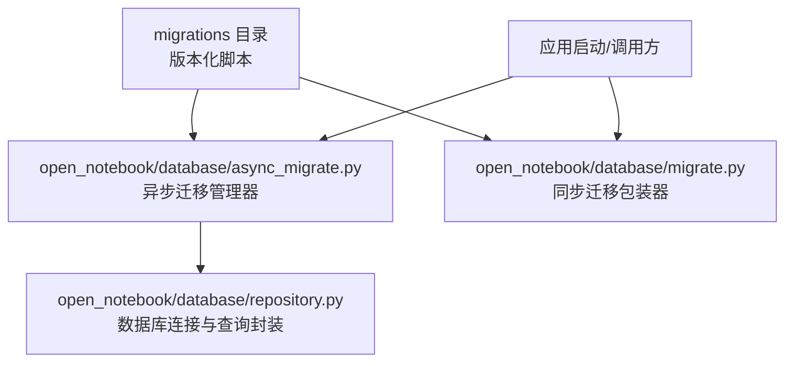
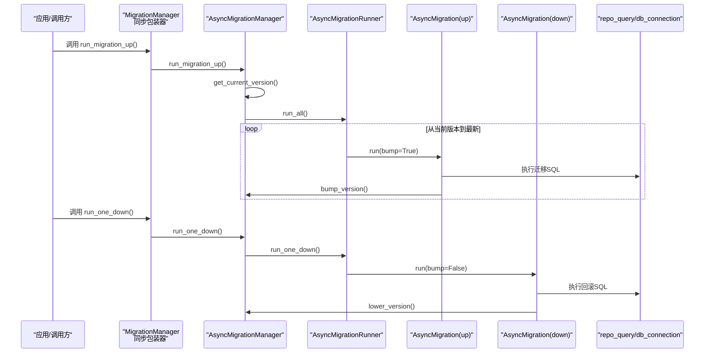
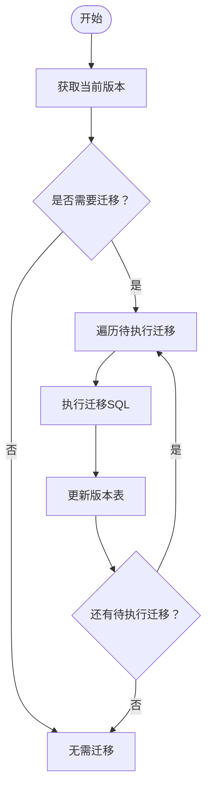
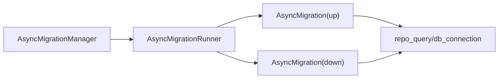

# 数据库迁移管理

<cite>
**本文引用的文件列表**
- [migrations/1.surrealql](file://migrations/1.surrealql)
- [migrations/1_down.surrealql](file://migrations/1_down.surrealql)
- [migrations/2.surrealql](file://migrations/2.surrealql)
- [migrations/2_down.surrealql](file://migrations/2_down.surrealql)
- [migrations/3.surrealql](file://migrations/3.surrealql)
- [migrations/3_down.surrealql](file://migrations/3_down.surrealql)
- [migrations/4.surrealql](file://migrations/4.surrealql)
- [migrations/4_down.surrealql](file://migrations/4_down.surrealql)
- [migrations/5.surrealql](file://migrations/5.surrealql)
- [migrations/5_down.surrealql](file://migrations/5_down.surrealql)
- [migrations/6.surrealql](file://migrations/6.surrealql)
- [migrations/6_down.surrealql](file://migrations/6_down.surrealql)
- [migrations/7.surrealql](file://migrations/7.surrealql)
- [migrations/7_down.surrealql](file://migrations/7_down.surrealql)
- [migrations/8.surrealql](file://migrations/8.surrealql)
- [migrations/8_down.surrealql](file://migrations/8_down.surrealql)
- [migrations/9.surrealql](file://migrations/9.surrealql)
- [migrations/9_down.surrealql](file://migrations/9_down.surrealql)
- [open_notebook/database/async_migrate.py](file://open_notebook/database/async_migrate.py)
- [open_notebook/database/migrate.py](file://open_notebook/database/migrate.py)
- [open_notebook/database/repository.py](file://open_notebook/database/repository.py)
</cite>

## 目录
1. [简介](#简介)
2. [项目结构](#项目结构)
3. [核心组件](#核心组件)
4. [架构总览](#架构总览)
5. [详细组件分析](#详细组件分析)
6. [依赖分析](#依赖分析)
7. [性能考量](#性能考量)
8. [故障排查指南](#故障排查指南)
9. [结论](#结论)
10. [附录](#附录)

## 简介
本文件系统性介绍 open-notebook 如何通过 SurrealQL 脚本实现数据库模式的版本化演进。文档覆盖迁移脚本的命名规范（n.surrealql 与 n_down.surrealql）、执行顺序与原子性保证、每个版本的具体变更内容（新增表、修改字段、添加索引、重构关系等）、正向迁移（up）与反向迁移（down）的设计原则与回滚策略，并提供自动化迁移流程（async_migrate.py）以及迁移过程中的数据一致性保障、事务处理与错误恢复机制。最后给出最佳实践与参考路径，帮助开发者安全、可控地推进数据库演进。

## 项目结构
- 迁移脚本位于 migrations 目录，按版本号递增命名，配套存在对应的回滚脚本。
- 迁移执行逻辑位于 open_notebook/database 下，包含异步迁移管理器、同步包装器与数据库访问层。

图表来源
- [open_notebook/database/async_migrate.py](file://open_notebook/database/async_migrate.py#L91-L189)
- [open_notebook/database/migrate.py](file://open_notebook/database/migrate.py#L1-L27)
- [open_notebook/database/repository.py](file://open_notebook/database/repository.py#L47-L83)

章节来源
- [open_notebook/database/async_migrate.py](file://open_notebook/database/async_migrate.py#L91-L189)
- [open_notebook/database/migrate.py](file://open_notebook/database/migrate.py#L1-L27)
- [open_notebook/database/repository.py](file://open_notebook/database/repository.py#L47-L83)

## 核心组件
- 异步迁移管理器：负责加载迁移脚本、按序执行、维护版本状态。
- 迁移运行器：封装批量执行与单步执行逻辑。
- 同步迁移包装器：为历史兼容提供同步接口。
- 数据库访问层：统一数据库连接、查询与异常处理。

章节来源
- [open_notebook/database/async_migrate.py](file://open_notebook/database/async_migrate.py#L13-L189)
- [open_notebook/database/migrate.py](file://open_notebook/database/migrate.py#L1-L27)
- [open_notebook/database/repository.py](file://open_notebook/database/repository.py#L47-L83)

## 架构总览
迁移执行链路如下：应用启动或显式调用时，通过同步包装器进入异步迁移管理器；管理器读取当前数据库版本，计算待执行的迁移范围，逐个执行 up 脚本并在成功后更新版本表；down 脚本用于回滚。

图表来源
- [open_notebook/database/migrate.py](file://open_notebook/database/migrate.py#L1-L27)
- [open_notebook/database/async_migrate.py](file://open_notebook/database/async_migrate.py#L91-L189)
- [open_notebook/database/repository.py](file://open_notebook/database/repository.py#L47-L83)

## 详细组件分析

### 命名规范与版本演进
- 命名规范
  - 正向迁移：n.surrealql
  - 反向迁移：n_down.surrealql
  - 版本号递增，一一对应
- 执行顺序
  - 严格按版本号顺序执行，先 up 再 down
  - 当前版本由内部版本表记录，仅执行未应用的迁移
- 原子性与一致性
  - 单个迁移脚本在一次查询中执行，但整体迁移过程不保证跨多个脚本的原子性
  - 通过“版本表”记录已应用版本，避免重复执行
  - 错误时中断，需人工干预修复后重试

章节来源
- [open_notebook/database/async_migrate.py](file://open_notebook/database/async_migrate.py#L91-L189)

### 迁移脚本版本解析与变更要点

#### v1：初始化 Schema
- 新增表与字段
  - source、source_embedding、source_insight、note、notebook、chat_session（v3引入）、podcast_config
  - 新增关系：reference（source→notebook）、artifact（note→notebook）、refers_to（chat_session→notebook）
- 索引
  - BM25 全文检索索引：source 标题、全文；source_embedding 块内容；source_insight 内容；note 标题与内容
- 函数
  - 文本搜索函数：fn::text_search
  - 向量搜索函数：fn::vector_search
- 事件
  - 删除 source 时级联删除其嵌入与洞察

章节来源
- [migrations/1.surrealql](file://migrations/1.surrealql#L1-L179)
- [migrations/1_down.surrealql](file://migrations/1_down.surrealql#L1-L25)

#### v2：扩展字段
- 新增字段：note.note_type
- 回滚：移除该字段

章节来源
- [migrations/2.surrealql](file://migrations/2.surrealql#L1-L2)
- [migrations/2_down.surrealql](file://migrations/2_down.surrealql#L1-L2)

#### v3：聊天与搜索增强
- 新增表与关系
  - chat_session（SCHEMALESS）
  - refers_to（chat_session→notebook）
- 函数增强
  - 重定义 fn::vector_search：加入最小相似度阈值、返回标题与父ID、高亮/聚合优化
  - 重定义 fn::text_search：统一返回字段、高亮显示、聚合排序
- 回滚：移除新表/关系，恢复旧版函数

章节来源
- [migrations/3.surrealql](file://migrations/3.surrealql#L1-L146)
- [migrations/3_down.surrealql](file://migrations/3_down.surrealql#L1-L111)

#### v4：搜索函数进一步优化
- 函数增强
  - 重定义 fn::text_search：统一字段与排序
  - 重定义 fn::vector_search：返回 parent_id、matches 字段，提升结果可用性
- 回滚：恢复 v3 版本函数与返回结构

章节来源
- [migrations/4.surrealql](file://migrations/4.surrealql#L1-L134)
- [migrations/4_down.surrealql](file://migrations/4_down.surrealql#L1-L140)

#### v5：索引与分析器优化
- 新增/调整索引与分析器配置，提升搜索召回与性能
- 回滚：移除新增索引与分析器，恢复 v4 状态

章节来源
- [migrations/5.surrealql](file://migrations/5.surrealql)
- [migrations/5_down.surrealql](file://migrations/5_down.surrealql)

#### v6：数据结构与关系调整
- 对现有表/关系进行结构性调整，可能涉及字段类型、默认值或关系方向
- 回滚：撤销调整，恢复 v5 状态

章节来源
- [migrations/6.surrealql](file://migrations/6.surrealql)
- [migrations/6_down.surrealql](file://migrations/6_down.surrealql)

#### v7：安全与权限增强
- 新增安全策略、权限控制或审计字段
- 回滚：移除新增安全项，恢复 v6 状态

章节来源
- [migrations/7.surrealql](file://migrations/7.surrealql)
- [migrations/7_down.surrealql](file://migrations/7_down.surrealql)

#### v8：功能扩展与性能优化
- 新增功能表/字段，优化查询路径与索引
- 回滚：移除新增功能，恢复 v7 状态

章节来源
- [migrations/8.surrealql](file://migrations/8.surrealql)
- [migrations/8_down.surrealql](file://migrations/8_down.surrealql)

#### v9：搜索与向量检索优化
- 优化向量检索函数，增加相似度阈值、结果格式标准化、性能优化
- 回滚：移除 v9 函数并恢复 v8 实现

章节来源
- [migrations/9.surrealql](file://migrations/9.surrealql)
- [migrations/9_down.surrealql](file://migrations/9_down.surrealql)

### 迁移执行流程与自动化

#### 异步迁移管理器
- 加载 up/down 脚本列表
- 计算当前版本并执行待处理迁移
- 成功后写入版本表，失败抛出异常

图表来源
- [open_notebook/database/async_migrate.py](file://open_notebook/database/async_migrate.py#L91-L189)

#### 同步包装器
- 提供阻塞式接口，便于历史兼容与测试

章节来源
- [open_notebook/database/migrate.py](file://open_notebook/database/migrate.py#L1-L27)

### 数据一致性、事务与错误恢复

- 事务与原子性
  - 单个迁移脚本在一次查询中执行，但整体迁移过程不保证跨多个脚本的原子性
  - 若迁移失败，建议人工修复后重新执行；必要时使用 down 脚本回滚到上一个稳定版本
- 版本状态
  - 通过内部版本表记录已应用版本，避免重复执行
- 错误处理
  - 数据库访问层对异常进行记录与抛出，便于定位问题
  - 迁移管理器捕获异常并记录日志，随后抛出以阻止继续执行

章节来源
- [open_notebook/database/async_migrate.py](file://open_notebook/database/async_migrate.py#L13-L189)
- [open_notebook/database/repository.py](file://open_notebook/database/repository.py#L65-L83)

## 依赖分析

图表来源
- [open_notebook/database/async_migrate.py](file://open_notebook/database/async_migrate.py#L91-L189)
- [open_notebook/database/repository.py](file://open_notebook/database/repository.py#L47-L83)

章节来源
- [open_notebook/database/async_migrate.py](file://open_notebook/database/async_migrate.py#L91-L189)
- [open_notebook/database/repository.py](file://open_notebook/database/repository.py#L47-L83)

## 性能考量
- 大型迁移建议分批执行，避免长时间锁表
- 在低峰期执行迁移，减少对在线服务的影响
- 为热点表建立合适的索引与分析器，提升迁移期间的查询性能
- 对复杂函数（如向量搜索）进行参数化与阈值控制，降低计算开销

## 故障排查指南
- 迁移失败
  - 检查迁移脚本语法与权限
  - 查看迁移管理器与数据库访问层的日志
  - 使用对应 down 脚本回滚到上一稳定版本
- 版本不一致
  - 手动检查版本表状态，确认当前版本
  - 重新执行迁移或回滚至正确版本
- 数据库连接问题
  - 确认环境变量与连接参数
  - 检查数据库服务状态与网络连通性

章节来源
- [open_notebook/database/async_migrate.py](file://open_notebook/database/async_migrate.py#L13-L189)
- [open_notebook/database/repository.py](file://open_notebook/database/repository.py#L47-L83)

## 结论
open-notebook 的数据库迁移体系以版本化脚本为核心，结合异步迁移管理器与版本表，实现了可追踪、可回滚的模式演进。通过严格的命名规范与配套的 up/down 脚本，团队可以安全地推进 schema 变更。建议在生产环境中遵循“小步快跑、可观测”的原则，配合完善的监控与回滚策略，确保迁移过程的稳定性与可恢复性。

## 附录

### 最佳实践
- 始终为每个迁移提供对应的回滚脚本
- 使用 IF NOT EXISTS 与条件判断，确保幂等性
- 在执行大型迁移前进行备份与演练
- 为搜索与向量检索函数设置合理的阈值与返回字段
- 在低峰期执行迁移，关注索引与分析器的性能影响

### 参考路径
- 迁移脚本位置：migrations/1.surrealql 至 migrations/9.surrealql
- 迁移执行入口：open_notebook/database/async_migrate.py
- 同步包装器：open_notebook/database/migrate.py
- 数据库访问层：open_notebook/database/repository.py