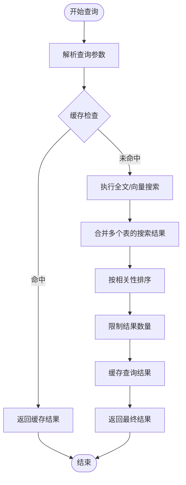

# 数据持久化

<cite>
**本文档引用的文件**  
- [repository.py](file://open_notebook/database/repository.py)
- [async_migrate.py](file://open_notebook/database/async_migrate.py)
- [migrations/1.surrealql](file://migrations/1.surrealql)
- [migrations/2.surrealql](file://migrations/2.surrealql)
- [migrations/3.surrealql](file://migrations/3.surrealql)
- [migrations/4.surrealql](file://migrations/4.surrealql)
- [migrations/5.surrealql](file://migrations/5.surrealql)
- [migrations/6.surrealql](file://migrations/6.surrealql)
- [migrations/7.surrealql](file://migrations/7.surrealql)
- [migrations/8.surrealql](file://migrations/8.surrealql)
- [migrations/9.surrealql](file://migrations/9.surrealql)
- [config.py](file://open_notebook/config.py)
- [base.py](file://open_notebook/domain/base.py)
</cite>

## 目录
1. [引言](#引言)
2. [数据库模式演进](#数据库模式演进)
3. [数据访问模式实现](#数据访问模式实现)
4. [图+文档混合模型查询支持](#图+文档混合模型查询支持)
5. [数据一致性与错误恢复](#数据一致性与错误恢复)
6. [备份恢复与性能优化](#备份恢复与性能优化)
7. [结论](#结论)

## 引言
open-notebook项目采用SurrealDB作为核心数据存储引擎，利用其独特的图+文档混合数据模型来支持复杂的知识管理和AI驱动的笔记应用。本架构文档系统性地介绍open-notebook如何利用SurrealDB进行数据存储与管理，重点解析数据库模式的演进过程、数据访问模式的实现机制，以及SurrealDB的混合模型如何支持复杂查询和高效检索。

SurrealDB在open-notebook中扮演着关键角色，不仅作为传统的关系型数据库存储结构化数据，还作为图数据库管理实体间的复杂关系，并作为文档数据库存储半结构化内容。这种多模型能力使得open-notebook能够灵活地处理笔记、来源、转换、播客等多种数据类型，并支持基于向量相似性和全文搜索的高级查询功能。

## 数据库模式演进
open-notebook通过基于SurrealQL的迁移脚本系统管理数据库模式的演进，确保数据库结构能够随着应用功能的发展而平滑升级。迁移系统采用版本化管理，每个迁移脚本对应一个特定的数据库版本，通过`_sbl_migrations`表跟踪当前数据库版本。

### 初始模式设计
初始迁移脚本（1.surrealql）定义了核心数据实体和关系，采用SCHEMAFULL（严格模式）和SCHEMALESS（无模式）相结合的策略。核心表包括`source`（来源）、`note`（笔记）、`notebook`（笔记本）等，这些表使用SCHEMAFULL模式确保数据结构的完整性。

```mermaid
erDiagram
source {
string id PK
object asset
string title
array<string> topics
string full_text
datetime created
datetime updated
}
source_embedding {
string id PK
record<source> source FK
int order
string content
array<float> embedding
}
source_insight {
string id PK
record<source> source FK
string insight_type
string content
array<float> embedding
}
note {
string id PK
string title
string summary
string content
array<float> embedding
datetime created
datetime updated
}
notebook {
string id PK
string name
string description
bool archived
datetime created
datetime updated
}
reference ||--o{ notebook : "FROM source TO notebook"
artifact ||--o{ notebook : "FROM note TO notebook"
source ||--o{ source_embedding : "has"
source ||--o{ source_insight : "has"
```

**图来源**  
- [migrations/1.surrealql](file://migrations/1.surrealql#L2-L73)

**节来源**  
- [migrations/1.surrealql](file://migrations/1.surrealql#L1-L179)

### 字段类型与约束
SurrealDB支持丰富的字段类型，包括基本类型（string, int, float, bool, datetime）和复杂类型（array, object, record）。在open-notebook中，`record`类型被广泛用于表示表间关系，如`source_embedding`表中的`source`字段定义为`record<source>`，这既是外键约束也是关系建模的基础。

```surrealql
DEFINE FIELD IF NOT EXISTS source ON TABLE source_embedding TYPE record<source>;
DEFINE FIELD IF NOT EXISTS title ON TABLE source TYPE option<string>;
DEFINE FIELD IF NOT EXISTS topics ON TABLE source TYPE option<array<string>>;
```

`option`类型表示该字段可以为空，而`SCHEMAFULL`模式确保只有定义的字段才能被插入，提供了数据完整性保障。`embedding`字段使用`array<float>`类型存储向量嵌入，这是支持向量搜索的关键。

### 索引策略
为了支持高效的全文搜索和向量搜索，open-notebook在关键字段上创建了搜索索引。系统定义了一个名为`my_analyzer`的分析器，结合了多种分词器（blank, class, camel, punct）和过滤器（snowball, lowercase），以优化搜索质量。

```surrealql
DEFINE ANALYZER IF NOT EXISTS my_analyzer TOKENIZERS blank,class,camel,punct FILTERS snowball(english), lowercase;
DEFINE INDEX IF NOT EXISTS idx_source_title ON TABLE source COLUMNS title SEARCH ANALYZER my_analyzer BM25 HIGHLIGHTS;
DEFINE INDEX IF NOT EXISTS idx_source_embed_chunk ON TABLE source_embedding COLUMNS content SEARCH ANALYZER my_analyzer BM25 HIGHLIGHTS;
```

这些索引使用BM25算法进行相关性评分，并支持高亮显示，为用户提供更好的搜索体验。索引策略针对不同查询场景进行了优化，如`idx_source_title`用于标题搜索，`idx_source_embed_chunk`用于内容块搜索。

### 关系建模
SurrealDB的图数据模型能力通过`RELATION`表类型实现，open-notebook利用这一特性构建了丰富的实体关系网络。`reference`和`artifact`表被定义为关系表，连接`source`和`notebook`、`note`和`notebook`。

```surrealql
DEFINE TABLE IF NOT EXISTS reference
TYPE RELATION 
FROM source TO notebook;

DEFINE TABLE IF NOT EXISTS artifact
TYPE RELATION 
FROM note TO notebook;
```

这种关系建模方式不仅支持传统的外键关联，还允许在图遍历中高效查询多跳关系。例如，可以轻松查询某个笔记本中的所有来源及其关联的嵌入内容。此外，系统还使用了记录链接（record links）来表示一对多关系，如一个`source`可以有多个`source_embedding`。

### 模式演进过程
数据库模式通过一系列迁移脚本逐步演进。每个新版本的迁移脚本都会在现有模式基础上添加新功能，而对应的`_down`脚本则用于回滚。

- **迁移2**：为`note`表添加`note_type`字段，支持不同类型的笔记。
- **迁移3**：引入`chat_session`表和`refers_to`关系表，支持聊天会话功能。
- **迁移4**：重构全文搜索函数`fn::text_search`，优化查询结果的返回结构。
- **迁移5**：引入`transformation`表，支持内容转换功能，并设置默认转换配置。

这种渐进式的演进策略确保了数据库模式能够灵活适应应用需求的变化，同时保持向后兼容性。

## 数据访问模式实现
open-notebook通过`repository.py`文件提供了一套统一的数据访问接口，封装了与SurrealDB的交互细节，实现了数据访问的抽象和重用。

### 查询构造
数据访问层提供了多种查询方法，包括`repo_query`（执行SurrealQL查询）、`repo_create`（创建记录）、`repo_update`（更新记录）、`repo_delete`（删除记录）等。这些方法基于`db_connection`上下文管理器实现，确保数据库连接的正确获取和释放。

```python
@asynccontextmanager
async def db_connection():
    db = AsyncSurreal(get_database_url())
    await db.signin({
        "username": os.environ.get("SURREAL_USER"),
        "password": get_database_password(),
    })
    await db.use(os.environ.get("SURREAL_NAMESPACE"), os.environ.get("SURREAL_DATABASE"))
    try:
        yield db
    finally:
        await db.close()
```

`repo_query`方法是核心查询接口，它接受SurrealQL查询字符串和参数，执行查询并返回结果。该方法还处理了`RecordID`到字符串的转换，使结果更易于在应用层处理。

### 事务处理
SurrealDB原生支持ACID事务，open-notebook通过SurrealQL的`BEGIN`、`COMMIT`和`ROLLBACK`语句实现事务控制。在`async_migrate.py`中，迁移操作被包装在事务中，确保模式变更的原子性。

```python
async def run(self, bump: bool = True) -> None:
    """Run the migration."""
    try:
        async with db_connection() as connection:
            await connection.query(self.sql)
            if bump:
                await bump_version()
            else:
                await lower_version()
    except Exception as e:
        logger.error(f"Migration failed: {str(e)}")
        raise
```

对于需要多个操作原子性执行的场景，应用层可以显式地使用事务。例如，在创建一个包含多个相关实体的复杂对象时，可以将所有操作放在一个事务中，确保数据一致性。

### 错误恢复
数据访问层实现了完善的错误处理和恢复机制。`repo_query`等方法捕获并处理各种异常，包括`RuntimeError`（用于可重试的事务冲突）和一般异常。系统还利用了`tenacity`库的重试机制，配置了指数退避和抖动策略来处理瞬时故障。

```python
except RuntimeError as e:
    # RuntimeError is raised for retriable transaction conflicts - log without stack trace
    logger.error(str(e))
    raise
except Exception as e:
    logger.exception(e)
    raise
```

重试配置通过环境变量进行管理，允许根据部署环境调整重试策略。例如，`SURREAL_COMMANDS_RETRY_MAX_ATTEMPTS`控制最大重试次数，`SURREAL_COMMANDS_RETRY_WAIT_STRATEGY`定义等待策略。

## 图+文档混合模型查询支持
SurrealDB的图+文档混合模型为open-notebook提供了强大的查询能力，支持复杂的图遍历和高效的文档检索。

### 复杂查询实现
系统通过定义SurrealQL函数来封装复杂的查询逻辑。`fn::text_search`函数实现了多表全文搜索，能够同时在`source`、`source_embedding`、`note`等表中搜索相关内容，并根据相关性评分排序。

```surrealql
DEFINE FUNCTION IF NOT EXISTS fn::text_search($query_text: string, $match_count: int, $sources:bool, $show_notes:bool) {
    let $source_title_search = IF $sources {(
        SELECT id as item_id, math::max(search::score(1)) AS relevance
        FROM source
        WHERE title @1@ $query_text
        GROUP BY item_id)}
    ELSE { [] };
    -- 其他搜索逻辑...
    RETURN (SELECT item_id, math::max(relevance) as relevance from $final_results
        group by item_id ORDER BY relevance DESC LIMIT $match_count);
};
```

`fn::vector_search`函数则实现了基于余弦相似度的向量搜索，用于查找与查询向量最相似的嵌入内容。这些函数的组合使用使得open-notebook能够提供混合搜索功能，结合语义搜索和关键词搜索的优势。

### 高效检索机制
为了实现高效检索，系统采用了多种优化策略。首先，通过预定义的搜索索引加速查询执行。其次，使用`LET`语句在查询内部定义变量，避免重复计算。最后，通过`LIMIT`和`GROUP BY`控制结果集大小，减少网络传输开销。



**图来源**  
- [migrations/1.surrealql](file://migrations/1.surrealql#L74-L174)

**节来源**  
- [migrations/1.surrealql](file://migrations/1.surrealql#L74-L174)

## 数据一致性与错误恢复
open-notebook通过多种机制确保数据一致性和系统的可靠性。

### 事务冲突处理
由于应用可能并发执行多个数据库操作，事务冲突是不可避免的。系统通过重试机制处理`RuntimeError`（表示事务冲突），采用指数退避和抖动策略来减少冲突概率。`SURREAL_COMMANDS_RETRY_WAIT_STRATEGY=exponential_jitter`配置确保了重试时间的随机性，避免了"惊群效应"。

### 数据验证
在应用层，`domain`模块中的模型类（如`Note`、`Source`）继承自`BaseModel`，利用Pydantic进行数据验证。这确保了在数据持久化之前，所有字段都符合预定义的类型和约束。

```python
class Note(BaseModel):
    title: Optional[str] = None
    summary: Optional[str] = None
    content: Optional[str] = None
    embedding: Optional[List[float]] = None
    created: datetime = Field(default_factory=lambda: datetime.now(timezone.utc))
    updated: datetime = Field(default_factory=lambda: datetime.now(timezone.utc))
```

### 错误分类与处理
系统定义了详细的异常层次结构，从`OpenNotebookError`基类派生出多种特定异常，如`DatabaseOperationError`、`InvalidInputError`、`NotFoundError`等。这种分类使得错误处理更加精确，能够针对不同类型的错误采取不同的恢复策略。

## 备份恢复与性能优化
### 备份恢复策略
虽然文档中未直接提及备份恢复的具体实现，但基于SurrealDB的特性，可以推断出可能的策略。SurrealDB支持文件存储模式，数据库文件可以直接备份。此外，可以通过导出SurrealQL脚本的方式进行逻辑备份。

### 性能优化方案
性能优化主要体现在以下几个方面：
1. **索引优化**：为关键查询字段创建搜索索引，使用BM25算法提高搜索质量。
2. **查询优化**：通过预编译的SurrealQL函数减少查询解析开销。
3. **连接池**：虽然未在代码中明确体现，但生产环境应配置数据库连接池以提高并发性能。
4. **缓存**：应用层可以实现结果缓存，减少对数据库的重复查询。

## 结论
open-notebook通过SurrealDB的图+文档混合模型构建了一个灵活、高效的数据持久化架构。该架构支持复杂的实体关系建模、高效的全文和向量搜索，并通过完善的迁移系统和错误恢复机制确保了数据的一致性和可靠性。未来可以进一步优化性能，如引入更高级的缓存策略和查询优化技术。