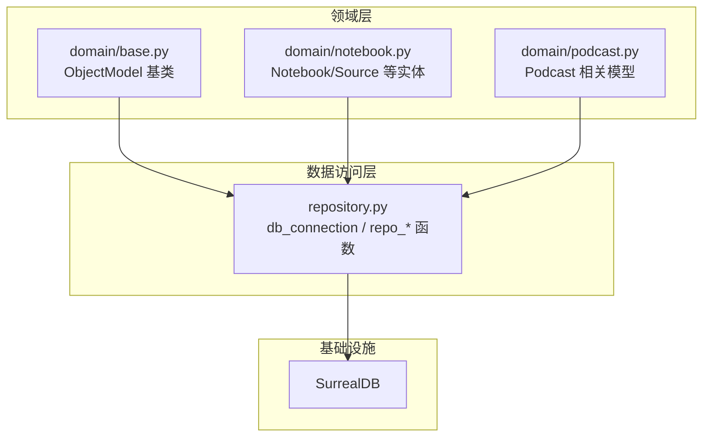
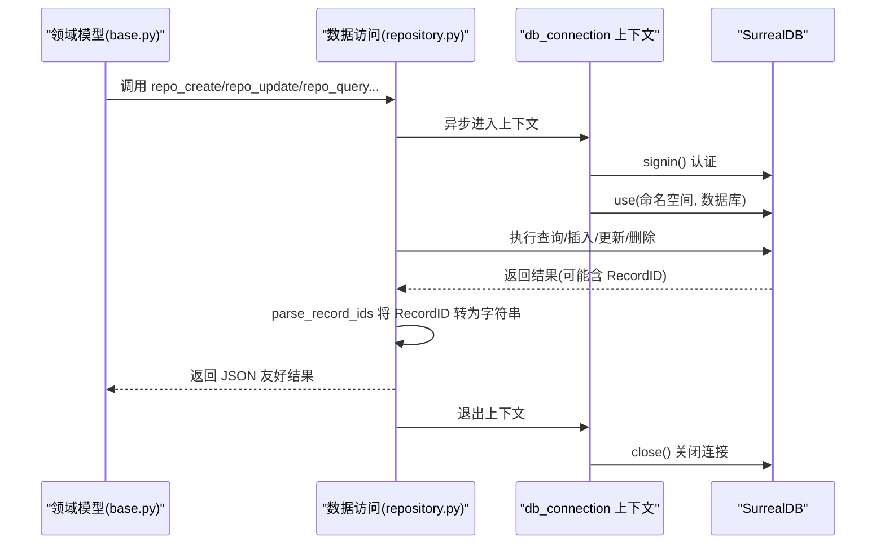
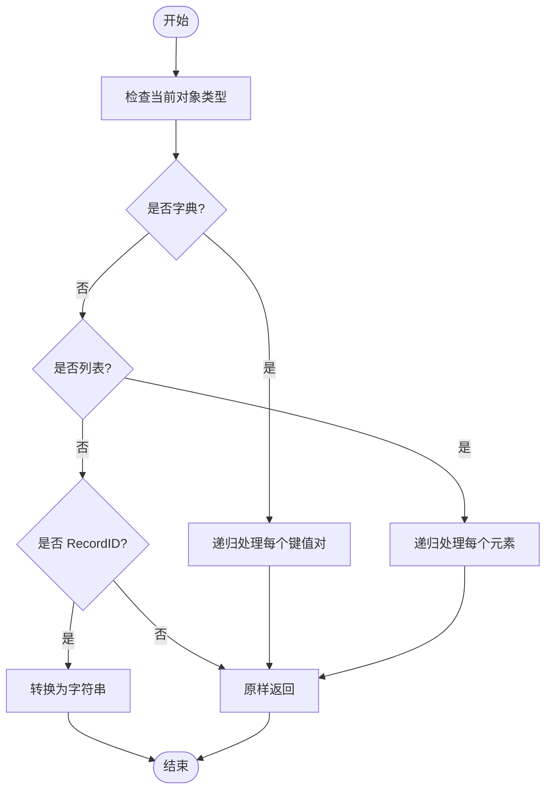
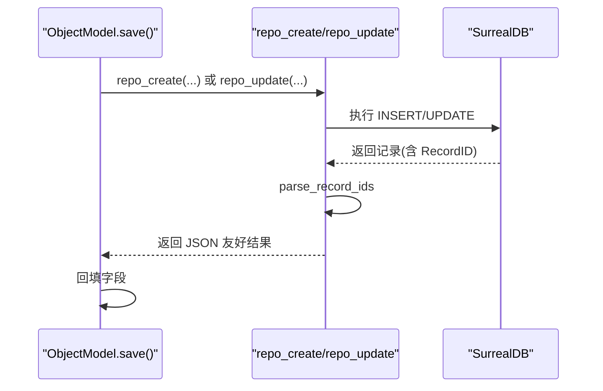
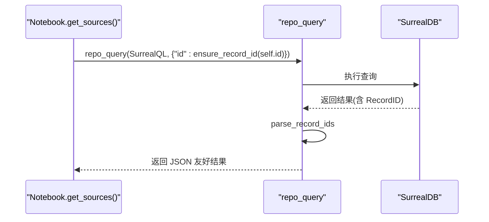
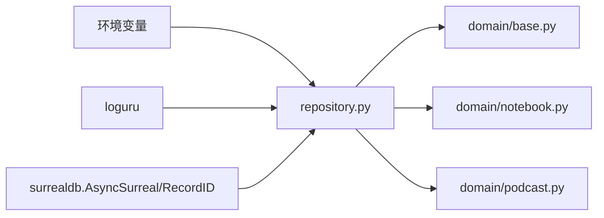

# 数据访问模式

<cite>
**本文引用的文件**
- [repository.py](file://open_notebook/database/repository.py)
- [base.py](file://open_notebook/domain/base.py)
- [notebook.py](file://open_notebook/domain/notebook.py)
- [podcast.py](file://open_notebook/domain/podcast.py)
- [docker.md](file://docs/deployment/docker.md)
- [retry-configuration.md](file://docs/deployment/retry-configuration.md)
- [docker.env](file://setup_guide/docker.env)
</cite>

## 目录
1. [引言](#引言)
2. [项目结构](#项目结构)
3. [核心组件](#核心组件)
4. [架构总览](#架构总览)
5. [详细组件分析](#详细组件分析)
6. [依赖关系分析](#依赖关系分析)
7. [性能考量](#性能考量)
8. [故障排查指南](#故障排查指南)
9. [结论](#结论)
10. [附录](#附录)

## 引言
本文件聚焦于 open-notebook 中的数据访问层实现，系统性解析 repository.py 模块的异步连接管理、查询与写入流程、RecordID 处理策略，以及与 domain 层的集成方式。文档特别关注以下主题：
- db_connection 异步上下文管理器如何建立与管理 SurrealDB 连接，包括认证、命名空间与数据库选择。
- 核心数据操作函数 repo_query、repo_create、repo_update、repo_upsert、repo_delete 的实现细节、参数语义与异常处理策略。
- parse_record_ids 如何递归处理 RecordID 对象以确保 JSON 序列化兼容；ensure_record_id 在 ID 标准化中的作用。
- 连接池、事务边界、错误重试（RuntimeError 处理）、日志记录的最佳实践。
- 数据访问层与上层业务逻辑（domain 层）的集成示例。

## 项目结构
数据访问层位于 open_notebook/database/repository.py，负责：
- 提供 db_connection 异步上下文管理器，封装连接生命周期、认证与命名空间选择。
- 定义一组高层数据操作函数：repo_query、repo_create、repo_update、repo_upsert、repo_delete、repo_relate、repo_insert。
- 提供 parse_record_ids 与 ensure_record_id 等工具函数，保证 RecordID 与字符串之间的互操作与 JSON 兼容。

领域模型位于 open_notebook/domain，通过导入 repository.py 的函数与工具进行数据持久化与关系维护，并在模型层完成字段校验、时间戳处理与 ID 格式转换。

图表来源
- [repository.py](file://open_notebook/database/repository.py#L47-L177)
- [base.py](file://open_notebook/domain/base.py#L1-L170)
- [notebook.py](file://open_notebook/domain/notebook.py#L1-L120)
- [podcast.py](file://open_notebook/domain/podcast.py#L117-L148)

章节来源
- [repository.py](file://open_notebook/database/repository.py#L1-L177)
- [base.py](file://open_notebook/domain/base.py#L1-L170)
- [notebook.py](file://open_notebook/domain/notebook.py#L1-L120)
- [podcast.py](file://open_notebook/domain/podcast.py#L117-L148)

## 核心组件
- db_connection 异步上下文管理器：创建 AsyncSurreal 实例，执行 signin 认证，use 命名空间与数据库，yield 连接并在 finally 中关闭。
- repo_query：执行 SurrealQL 查询，返回结果前统一调用 parse_record_ids 将 RecordID 转为字符串，对字符串结果抛出 RuntimeError 并记录错误，其他异常记录堆栈后重新抛出。
- repo_create：插入单条记录，自动移除输入数据中的 id 字段，设置 created/updated 时间戳，返回 parse_record_ids 后的结果。
- repo_update：更新指定记录，支持传入 RecordID 或字符串 ID（含或不含表前缀），自动处理 created 字段的 ISO 解析与 updated 时间戳，返回 parse_record_ids 后的结果。
- repo_upsert：按 id 或表名进行合并更新，可选添加时间戳，内部构造 UPSERT MERGE 查询。
- repo_delete：删除指定记录 ID，内部通过 ensure_record_id 标准化为 RecordID。
- repo_relate：构建 RELATE 语法并委托 repo_query 执行，用于建立实体间关系。
- repo_insert：批量插入，支持忽略重复项（当 ignore_duplicates 为真且错误包含“already contains”时返回空列表）。
- 工具函数：
  - parse_record_ids：递归遍历字典/列表，遇到 RecordID 则转为字符串，确保 JSON 序列化兼容。
  - ensure_record_id：确保输入为 RecordID，若为字符串则解析为 RecordID。

章节来源
- [repository.py](file://open_notebook/database/repository.py#L47-L177)

## 架构总览
下图展示数据访问层与领域层的交互路径，以及 db_connection 的生命周期。

图表来源
- [repository.py](file://open_notebook/database/repository.py#L47-L177)
- [base.py](file://open_notebook/domain/base.py#L112-L167)

## 详细组件分析

### db_connection 异步上下文管理器
- 连接建立：使用 get_database_url 获取连接地址，创建 AsyncSurreal 实例。
- 认证：通过环境变量 SURREAL_USER 与 SURREAL_PASSWORD（或 SURREAL_PASS）执行 signin。
- 命名空间与数据库：通过 os.environ 读取 SURREAL_NAMESPACE 与 SURREAL_DATABASE，调用 use 切换。
- 生命周期：yield db 给调用方，finally 中确保关闭连接，避免资源泄漏。
- URL 兼容性：优先读取 SURREAL_URL；若未设置，则回退到旧格式的 ws://{address}/rpc:{port}。

章节来源
- [repository.py](file://open_notebook/database/repository.py#L47-L63)
- [docker.env](file://setup_guide/docker.env#L6-L12)
- [docker.md](file://docs/deployment/docker.md#L185-L205)

### repo_query 查询执行
- 参数：query_str（SurrealQL 字符串），vars（可选变量映射）。
- 流程：进入 db_connection 上下文，执行 connection.query，随后 parse_record_ids 处理结果。
- 错误处理：
  - 若结果为字符串（通常表示错误信息），抛出 RuntimeError 并记录错误，不打印堆栈。
  - 其他异常记录完整堆栈后重新抛出。
- 适用场景：通用查询、复杂联结、分页、聚合等。

章节来源
- [repository.py](file://open_notebook/database/repository.py#L65-L83)

### repo_create 创建记录
- 行为：移除输入数据中的 id 字段，设置 created 与 updated 为当前 UTC 时间，调用 connection.insert 插入单条记录。
- 返回：parse_record_ids 后的结果，确保 JSON 序列化友好。
- 错误处理：RuntimeError 直接记录并重抛；其他异常记录堆栈后抛出包装后的 RuntimeError。

章节来源
- [repository.py](file://open_notebook/database/repository.py#L85-L100)

### repo_update 更新记录
- 输入 ID 支持：RecordID 或字符串。若字符串不含表前缀，自动拼接为 table:id。
- 数据处理：移除输入数据中的 id 字段；若 created 为字符串，尝试 ISO 解析；始终更新 updated 为当前时间。
- 查询构造：使用 UPDATE ... MERGE $data。
- 返回：parse_record_ids 后的结果。
- 错误处理：捕获异常并抛出包装后的 RuntimeError，便于上层重试。

章节来源
- [repository.py](file://open_notebook/database/repository.py#L130-L152)

### repo_upsert 合并更新
- 行为：移除输入数据中的 id 字段；可选 add_timestamp 自动更新 updated。
- 查询构造：使用 UPSERT {id|table} MERGE $data。
- 返回：repo_query 的结果（已 parse_record_ids）。

章节来源
- [repository.py](file://open_notebook/database/repository.py#L119-L128)

### repo_delete 删除记录
- 输入：支持字符串或 RecordID。
- 处理：ensure_record_id 标准化为 RecordID 后调用 connection.delete。
- 错误处理：记录异常并抛出包装后的 RuntimeError。

章节来源
- [repository.py](file://open_notebook/database/repository.py#L154-L163)

### repo_relate 建立关系
- 行为：根据 source、relationship、target 构造 RELATE 语法，调用 repo_query 执行。
- 返回：查询结果列表。

章节来源
- [repository.py](file://open_notebook/database/repository.py#L102-L117)

### repo_insert 批量插入
- 行为：调用 connection.insert 批量插入数据。
- 错误处理：若 ignore_duplicates 为真且错误包含“already contains”，返回空列表；否则记录异常并抛出包装后的 RuntimeError。

章节来源
- [repository.py](file://open_notebook/database/repository.py#L165-L177)

### parse_record_ids 递归序列化
- 功能：递归遍历字典/列表，遇到 RecordID 即转为字符串，确保 JSON 序列化兼容。
- 复杂度：O(n)，n 为对象结构中的节点数。
- 用途：在 repo_query、repo_create、repo_update、repo_insert 等返回前统一处理，避免上层序列化失败。

图表来源
- [repository.py](file://open_notebook/database/repository.py#L29-L38)

章节来源
- [repository.py](file://open_notebook/database/repository.py#L29-L38)

### ensure_record_id ID 标准化
- 功能：确保输入为 RecordID；若为字符串则调用 RecordID.parse 解析。
- 用途：在 repo_delete、repo_query 等需要严格 RecordID 类型的场景使用，保证类型一致性。

章节来源
- [repository.py](file://open_notebook/database/repository.py#L40-L45)

### 领域层集成示例

#### 与 ObjectModel 的集成
- ObjectModel.save：根据是否存在 id 决定调用 repo_create 或 repo_update；保存成功后将返回结果回填到当前实例字段。
- ObjectModel.delete：调用 repo_delete 删除记录。
- ObjectModel.relate：调用 repo_relate 建立实体间关系。
- ObjectModel.get/get_all：使用 repo_query 执行查询，必要时通过 ensure_record_id 标准化 ID。

图表来源
- [base.py](file://open_notebook/domain/base.py#L112-L167)
- [repository.py](file://open_notebook/database/repository.py#L85-L152)

章节来源
- [base.py](file://open_notebook/domain/base.py#L112-L167)

#### 与 Notebook/Source 等实体的集成
- Notebook.get_sources/get_notes/get_chat_sessions：通过 repo_query 执行复杂查询，使用 ensure_record_id 标准化实体 ID。
- Source.command 字段：在模型层通过 field_validator 将字符串命令 ID 解析为 RecordID，确保数据库层一致。

图表来源
- [notebook.py](file://open_notebook/domain/notebook.py#L29-L41)
- [repository.py](file://open_notebook/database/repository.py#L65-L83)

章节来源
- [notebook.py](file://open_notebook/domain/notebook.py#L29-L41)
- [podcast.py](file://open_notebook/domain/podcast.py#L117-L148)

## 依赖关系分析
- repository.py 依赖：
  - os：读取环境变量（SURREAL_URL、SURREAL_USER、SURREAL_PASSWORD/SURREAL_PASS、SURREAL_ADDRESS、SURREAL_PORT、SURREAL_NAMESPACE、SURREAL_DATABASE）。
  - loguru：统一日志记录。
  - surrealdb.AsyncSurreal、RecordID：SurrealDB 异步客户端与 RecordID 类型。
- domain/base.py 依赖 repository.py 的函数与工具，形成“领域模型 -> 数据访问”的单向依赖。
- domain/notebook.py/podcast.py 依赖 repository.py 的工具（ensure_record_id）与 repo_query。

图表来源
- [repository.py](file://open_notebook/database/repository.py#L1-L21)
- [base.py](file://open_notebook/domain/base.py#L1-L20)
- [notebook.py](file://open_notebook/domain/notebook.py#L1-L15)
- [podcast.py](file://open_notebook/domain/podcast.py#L1-L15)

章节来源
- [repository.py](file://open_notebook/database/repository.py#L1-L21)
- [base.py](file://open_notebook/domain/base.py#L1-L20)
- [notebook.py](file://open_notebook/domain/notebook.py#L1-L15)
- [podcast.py](file://open_notebook/domain/podcast.py#L1-L15)

## 性能考量
- 连接管理：db_connection 采用每次请求新建连接的方式，简单可靠但不复用连接。对于高并发场景，建议评估连接池方案（例如在应用层引入连接池管理器，或在 repo_* 函数中复用连接）。
- 事务边界：当前 repo_* 函数均在 db_connection 上下文中执行单次操作，未显式开启/提交事务。若需跨多步写入保持原子性，可在上层业务逻辑中组合多个 repo_* 调用，并在业务层进行重试与补偿。
- 查询优化：repo_query 仅做一次查询；复杂查询建议在 SQL 层面优化索引与联结策略。
- JSON 序列化：parse_record_ids 在返回前统一转换 RecordID 为字符串，避免序列化开销与兼容性问题。

[本节为一般性指导，无需特定文件来源]

## 故障排查指南
- 认证失败：检查 SURREAL_USER、SURREAL_PASSWORD 是否正确配置；确认 db_connection 中的 signin 步骤是否成功。
- 命名空间/数据库错误：确认 SURREAL_NAMESPACE、SURREAL_DATABASE 设置正确；验证 use 调用是否生效。
- 运行时冲突（RuntimeError）：repo_query 会将字符串形式的错误信息包装为 RuntimeError 并记录错误（无堆栈）。这类错误通常由事务冲突导致，应结合部署文档中的重试配置进行处理。
- 重试策略：参考部署文档中的 retry 配置，合理设置最大重试次数、等待策略与并发度，以降低冲突概率。
- 日志定位：所有异常均通过 loguru 记录，建议在生产环境中启用合适的日志级别与输出目标。

章节来源
- [repository.py](file://open_notebook/database/repository.py#L65-L83)
- [retry-configuration.md](file://docs/deployment/retry-configuration.md#L51-L106)

## 结论
repository.py 提供了简洁而稳健的数据访问抽象：通过 db_connection 统一连接生命周期与认证，通过一组高层 repo_* 函数覆盖常见 CRUD 场景，并以 parse_record_ids 与 ensure_record_id 保障 RecordID 的序列化与类型一致性。领域层通过导入这些函数与工具，实现了清晰的分层与职责分离。对于高并发与强一致需求，建议在应用层引入连接池与事务管理，并结合重试配置优化冲突处理。

[本节为总结性内容，无需特定文件来源]

## 附录

### 环境变量与部署要点
- 数据库连接：SURREAL_URL、SURREAL_USER、SURREAL_PASSWORD/SURREAL_PASS、SURREAL_NAMESPACE、SURREAL_DATABASE。
- 示例配置：参见 docker.env 与 Docker 部署文档。

章节来源
- [docker.env](file://setup_guide/docker.env#L6-L12)
- [docker.md](file://docs/deployment/docker.md#L185-L205)