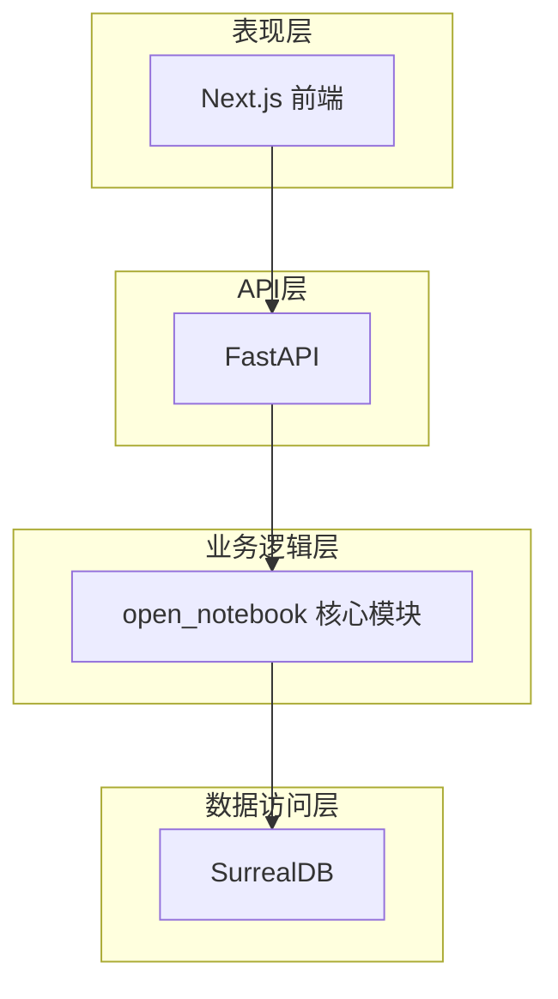
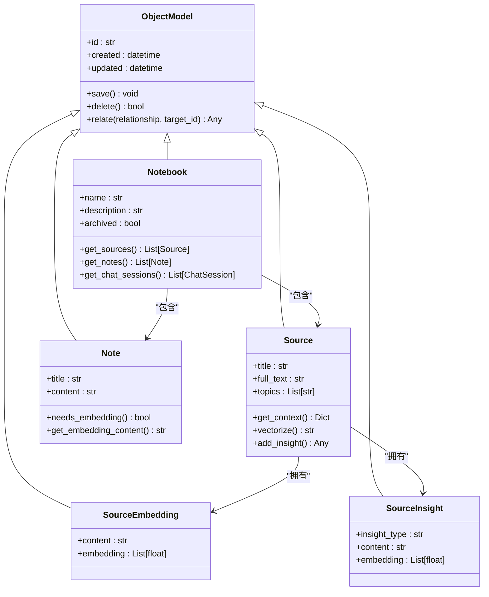
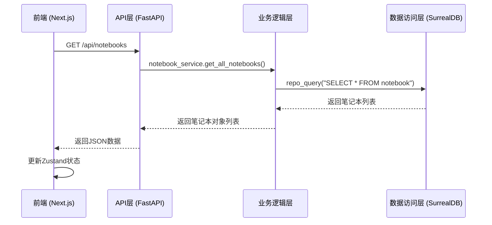

# 架构设计

<cite>
**本文档中引用的文件**   
- [main.py](file://api/main.py)
- [notebook.py](file://open_notebook/domain/notebook.py)
- [base.py](file://open_notebook/domain/base.py)
- [models.py](file://open_notebook/domain/models.py)
- [repository.py](file://open_notebook/database/repository.py)
- [1.surrealql](file://migrations/1.surrealql)
- [auth-store.ts](file://frontend/src/lib/stores/auth-store.ts)
- [notebook-columns-store.ts](file://frontend/src/lib/stores/notebook-columns-store.ts)
</cite>

## 目录
1. [引言](#引言)
2. [分层架构设计](#分层架构设计)
3. [领域模型设计](#领域模型设计)
4. [数据库模式演进](#数据库模式演进)
5. [状态管理机制](#状态管理机制)
6. [Clean Architecture原则应用](#clean-architecture原则应用)
7. [结论](#结论)

## 引言

Open Notebook 是一个开源的、注重隐私的研究助手，旨在为用户提供类似于 Google Notebook LM 的功能，同时确保数据主权和灵活性。本系统采用现代化的技术栈，包括 Next.js 前端、FastAPI 后端、SurrealDB 数据库和 Python 领域逻辑，构建了一个模块化、可扩展且安全的架构。系统设计遵循 Clean Architecture 原则，实现了关注点分离，促进了模块解耦和可测试性。

**Section sources**
- [README.md](file://README.md#L53-L66)

## 分层架构设计

Open Notebook 系统采用清晰的分层架构设计，将系统划分为四个主要层次：表现层、API 层、业务逻辑层和数据访问层。这种分层设计确保了各层之间的职责分明，降低了耦合度，提高了系统的可维护性和可扩展性。

### 表现层（Next.js 前端）

表现层由基于 Next.js 的前端应用构成，负责用户界面的渲染和用户交互。前端采用 React 组件化开发，利用 TypeScript 提供类型安全，并通过 Tailwind CSS 实现响应式设计。前端通过 REST API 与后端进行通信，所有用户操作最终都转化为对 API 的调用。前端状态管理采用 Zustand 库，实现了轻量级且高效的状态管理。

### API 层（FastAPI）

API 层是系统的通信枢纽，由 FastAPI 框架构建。FastAPI 提供了高性能的异步处理能力，并自动生成 OpenAPI 文档，便于开发和集成。API 层负责接收前端的 HTTP 请求，进行参数验证和身份认证，然后调用业务逻辑层的服务来处理请求。API 层的设计遵循 API-First 原则，确保所有功能都可以通过 API 访问，为自动化和集成提供了便利。

### 业务逻辑层（open_notebook 核心模块）

业务逻辑层是系统的核心，位于 `open_notebook` Python 包中。这一层包含了领域模型、服务类和业务规则。领域模型（如 `Notebook`、`Source`、`Note`）继承自 `ObjectModel` 基类，封装了业务实体的属性和行为。服务类（如 `NotebookService`）协调领域模型，实现复杂的业务流程。这一层与具体的框架和数据库技术解耦，确保了业务逻辑的纯粹性和可重用性。

### 数据访问层（SurrealDB）

数据访问层负责与 SurrealDB 数据库进行交互。该层通过 `repository.py` 文件中的函数（如 `repo_query`、`repo_create`）提供对数据库的抽象访问。`ObjectModel` 基类利用这些函数实现持久化操作，如保存、查询和删除。数据访问层还负责处理数据库连接和事务，确保数据的一致性和完整性。SurrealDB 作为图文档数据库，为系统提供了灵活的数据模型和强大的查询能力。

**Diagram sources**
- [main.py](file://api/main.py#L79-L119)
- [base.py](file://open_notebook/domain/base.py#L7-L15)
- [repository.py](file://open_notebook/database/repository.py#L65-L163)

**Section sources**
- [README.md](file://README.md#L106-L108)
- [DESIGN_PRINCIPLES.md](file://DESIGN_PRINCIPLES.md#L62-L77)

## 领域模型设计

领域模型是系统业务逻辑的核心，定义了 `Notebook`、`Source`、`Note` 等关键实体。这些模型的设计遵循领域驱动设计（DDD）原则，准确反映了业务领域的概念和规则。

### Notebook 实体

`Notebook` 类代表一个研究笔记本，是组织 `Source` 和 `Note` 的容器。它包含 `name`、`description` 和 `archived` 等属性，并提供了获取相关 `Source`、`Note` 和 `ChatSession` 的方法。`Notebook` 通过关系表 `reference` 和 `artifact` 与 `Source` 和 `Note` 建立关联。

### Source 实体

`Source` 类代表研究资料来源，如 PDF、网页或音频。它包含 `title`、`full_text` 和 `topics` 等属性，并与 `SourceEmbedding` 和 `SourceInsight` 建立关联。`Source` 实体支持向量化处理，通过 `vectorize` 方法提交后台任务，将文本内容分割成块并生成嵌入向量，以便进行语义搜索。

### Note 实体

`Note` 类代表用户创建或 AI 生成的笔记。它包含 `title` 和 `content` 等属性，并实现了 `needs_embedding` 和 `get_embedding_content` 方法，表明笔记内容需要被向量化以支持搜索。`Note` 可以被添加到 `Notebook` 中，形成研究项目的一部分。

**Diagram sources**
- [notebook.py](file://open_notebook/domain/notebook.py#L16-L457)
- [base.py](file://open_notebook/domain/base.py#L25-L219)

**Section sources**
- [notebook.py](file://open_notebook/domain/notebook.py#L16-L457)

## 数据库模式演进

系统的数据库模式通过 `migrations` 目录中的 SurrealQL 脚本进行管理和演进。每个迁移脚本（如 `1.surrealql`）定义了数据库表、字段、索引和函数的创建或修改。这种基于脚本的迁移方式确保了数据库模式的版本控制和可重复部署。

### 表与字段定义

迁移脚本使用 `DEFINE TABLE` 和 `DEFINE FIELD` 语句创建表和字段。例如，`source` 表定义了 `title`、`full_text` 等字段，并设置了 `SCHEMAFULL` 模式以强制执行数据结构。`note` 表则包含了 `content` 和 `embedding` 字段，用于存储笔记内容和其向量表示。

### 索引与搜索功能

系统定义了全文搜索索引和向量搜索索引。全文搜索索引（如 `idx_source_title`）基于自定义的 `my_analyzer` 分析器，支持对标题和内容的模糊搜索。向量搜索索引（如 `idx_source_embed_chunk`）则用于支持基于余弦相似度的语义搜索。此外，系统还定义了 `fn::text_search` 和 `fn::vector_search` 函数，封装了复杂的搜索逻辑，为上层应用提供统一的搜索接口。

### 事件与自动化

迁移脚本还定义了数据库事件，如 `source_delete` 事件。当 `source` 记录被删除时，该事件会自动触发，删除与之关联的 `source_embedding` 和 `source_insight` 记录，确保数据的一致性。

**Section sources**
- [1.surrealql](file://migrations/1.surrealql#L1-L179)

## 状态管理机制

系统采用分层的状态管理机制，前端和后端分别管理各自的状态。

### 前端状态管理（Zustand）

前端使用 Zustand 库进行状态管理。Zustand 提供了一个轻量级的全局状态存储，允许组件订阅和更新状态。例如，`auth-store.ts` 定义了 `useAuthStore`，用于管理用户的认证状态（如 `isAuthenticated`、`token`）。`notebook-columns-store.ts` 则定义了 `useNotebookColumnsStore`，用于存储三栏布局（来源、笔记、聊天）的折叠状态。这些状态存储通过 `persist` 中间件实现了持久化，确保页面刷新后状态不丢失。

### 后端状态管理

后端的状态主要由 SurrealDB 数据库管理。领域模型（如 `Notebook`、`Source`）的实例状态通过 `save` 和 `get` 方法与数据库同步。对于需要长期运行的后台任务（如向量化处理），系统使用 `surreal-commands` 库来管理任务状态。`Source` 实体的 `command` 字段记录了关联的任务 ID，通过 `get_status` 方法可以查询任务的执行进度。

**Diagram sources**
- [auth-store.ts](file://frontend/src/lib/stores/auth-store.ts#L1-L222)
- [notebook-columns-store.ts](file://frontend/src/lib/stores/notebook-columns-store.ts#L1-L28)
- [notebook_service.py](file://api/notebook_service.py#L13-L87)

**Section sources**
- [auth-store.ts](file://frontend/src/lib/stores/auth-store.ts#L1-L222)
- [notebook-columns-store.ts](file://frontend/src/lib/stores/notebook-columns-store.ts#L1-L28)

## Clean Architecture原则应用

系统架构充分体现了 Clean Architecture（整洁架构）原则，通过分层和依赖规则实现了高度的模块解耦和可测试性。

### 依赖规则

系统遵循依赖倒置原则，内层（业务逻辑）不依赖于外层（框架、数据库）。具体表现为：
- **业务逻辑层**：`open_notebook` 模块中的领域模型和服务类不直接依赖 FastAPI 或 SurrealDB。它们通过抽象的接口（如 `repo_query` 函数）与数据访问层交互。
- **API 层**：FastAPI 路由只负责处理 HTTP 请求和响应，将具体的业务逻辑委托给业务逻辑层的服务。
- **数据访问层**：`repository.py` 提供了对数据库的抽象，业务逻辑层无需了解具体的数据库技术。

### 可测试性

由于业务逻辑与框架和数据库解耦，单元测试变得非常简单。可以轻松地为领域模型和业务服务编写测试，而无需启动整个应用或连接真实数据库。例如，可以为 `Notebook` 的 `get_sources` 方法编写测试，通过模拟 `repo_query` 的返回值来验证其行为。

### 模块解耦

各层之间的松耦合使得系统易于维护和扩展。例如，可以独立地替换前端框架（从 Next.js 到其他框架）或数据库（从 SurrealDB 到其他数据库），只要保持 API 接口和数据访问接口不变，业务逻辑层的代码几乎不需要修改。

**Section sources**
- [DESIGN_PRINCIPLES.md](file://DESIGN_PRINCIPLES.md#L150-L158)
- [base.py](file://open_notebook/domain/base.py#L7-L15)

## 结论

Open Notebook 的系统架构设计体现了现代软件工程的最佳实践。通过清晰的分层、精心设计的领域模型、可演进的数据库模式和高效的状态管理，系统实现了功能丰富、性能优越且易于维护的目标。对 Clean Architecture 原则的遵循，确保了系统的高内聚、低耦合，为未来的持续发展和创新奠定了坚实的基础。