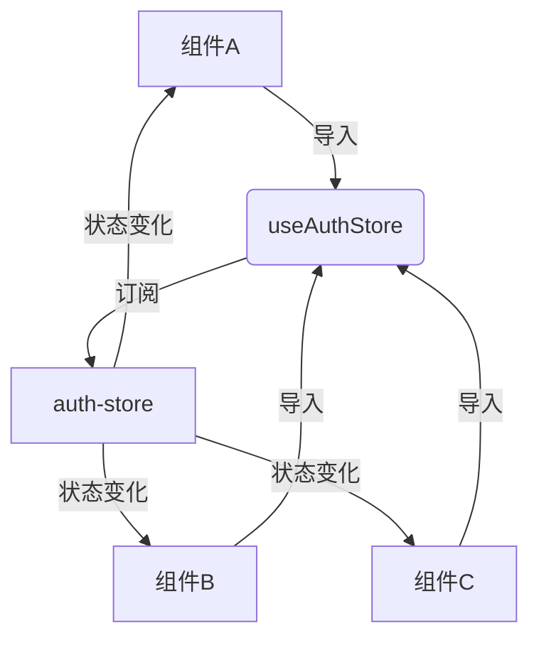
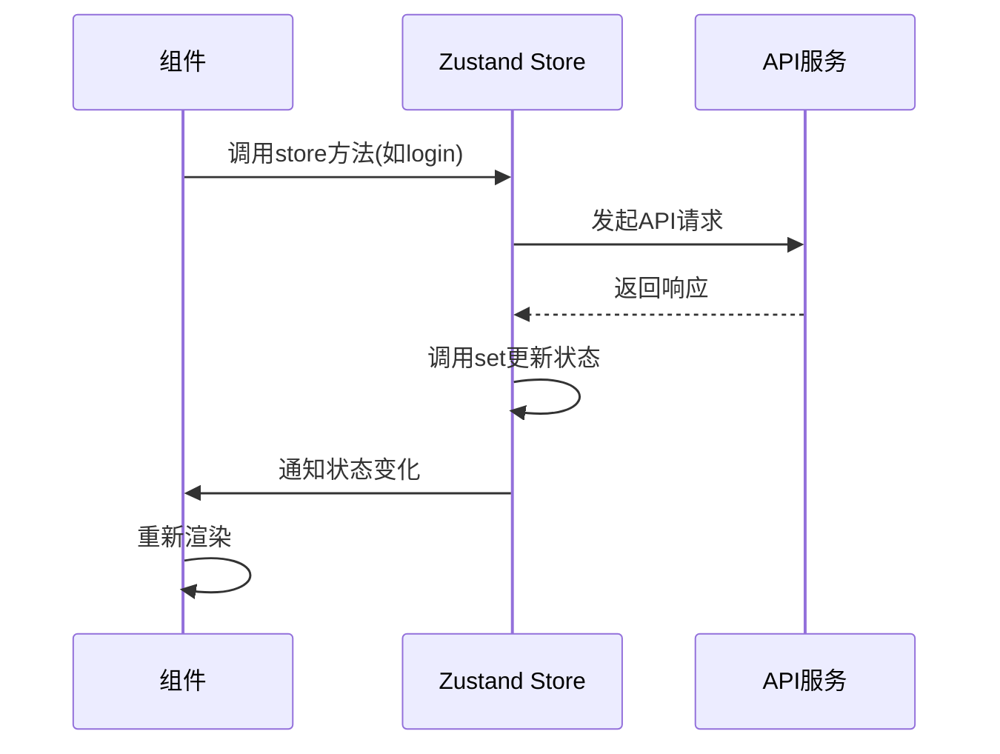
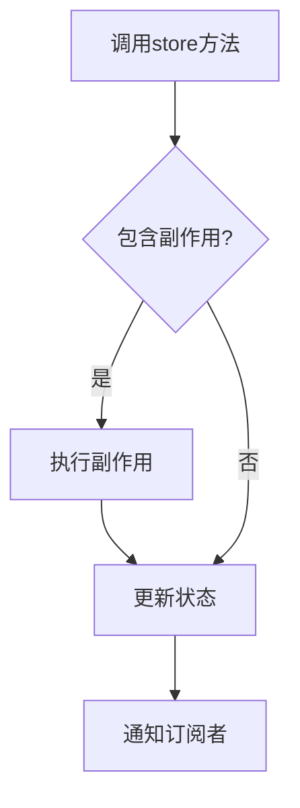
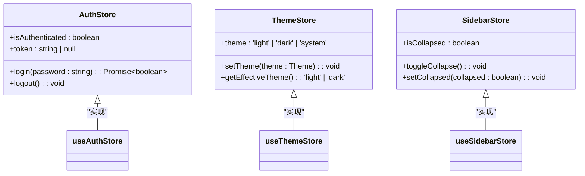
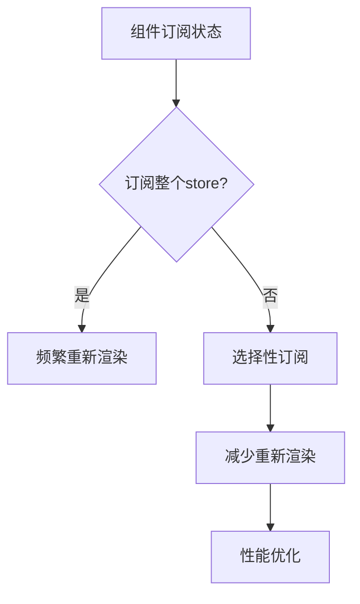

# 状态管理

<cite>
**本文档引用的文件**  
- [auth-store.ts](file://frontend/src/lib/stores/auth-store.ts)
- [notebook-columns-store.ts](file://frontend/src/lib/stores/notebook-columns-store.ts)
- [sidebar-store.ts](file://frontend/src/lib/stores/sidebar-store.ts)
- [theme-store.ts](file://frontend/src/lib/stores/theme-store.ts)
- [navigation-store.ts](file://frontend/src/lib/stores/navigation-store.ts)
- [use-auth.ts](file://frontend/src/lib/hooks/use-auth.ts)
- [LoginForm.tsx](file://frontend/src/components/auth/LoginForm.tsx)
- [AppSidebar.tsx](file://frontend/src/components/layout/AppSidebar.tsx)
- [ThemeToggle.tsx](file://frontend/src/components/common/ThemeToggle.tsx)
- [config.ts](file://frontend/src/lib/config.ts)
- [ThemeProvider.tsx](file://frontend/src/components/providers/ThemeProvider.tsx)
- [NotesColumn.tsx](file://frontend/src/app/(dashboard)/notebooks/components/NotesColumn.tsx)
- [use-navigation.ts](file://frontend/src/lib/hooks/use-navigation.ts)
</cite>

## 目录
1. [简介](#简介)
2. [核心状态存储设计](#核心状态存储设计)
3. [跨组件状态共享与响应式更新](#跨组件状态共享与响应式更新)
4. [副作用处理与持久化策略](#副作用处理与持久化策略)
5. [状态存储拆分原则](#状态存储拆分原则)
6. [性能优化技巧](#性能优化技巧)
7. [测试方法](#测试方法)
8. [最佳实践总结](#最佳实践总结)

## 简介
open-notebook项目采用Zustand作为前端状态管理解决方案，实现了轻量级、高效且类型安全的状态管理架构。该架构通过多个专用store（如auth-store、notebook-columns-store、sidebar-store、theme-store和navigation-store）来管理不同领域的应用状态，确保了状态管理的模块化和可维护性。Zustand的中间件系统（特别是persist中间件）被用于实现状态持久化，而TypeScript的强类型系统确保了状态结构的清晰和类型安全。

## 核心状态存储设计

### 认证状态存储 (auth-store)
`auth-store`负责管理用户认证状态，包括认证状态、令牌、加载状态和错误信息。该store通过`persist`中间件将关键状态（如token和isAuthenticated）持久化到localStorage中，确保页面刷新后用户状态得以保留。store提供了`login`、`logout`、`checkAuth`等方法来处理认证逻辑，并通过`checkAuthRequired`方法检查服务器是否启用了认证。

**状态结构**:
- `isAuthenticated`: 布尔值，表示用户是否已认证
- `token`: 字符串或null，存储认证令牌
- `isLoading`: 布尔值，表示认证操作是否正在进行
- `error`: 字符串或null，存储认证错误信息
- `lastAuthCheck`: 数字或null，记录上次认证检查时间
- `isCheckingAuth`: 布尔值，表示是否正在检查认证状态
- `hasHydrated`: 布尔值，表示store是否已从持久化存储中恢复
- `authRequired`: 布尔值或null，表示是否需要认证

**更新机制**: 认证状态通过API调用进行更新，store中的方法会根据API响应结果调用`set`函数来更新状态。

**Section sources**
- [auth-store.ts](file://frontend/src/lib/stores/auth-store.ts#L5-L222)
- [use-auth.ts](file://frontend/src/lib/hooks/use-auth.ts#L7-L68)

### 笔记本列状态存储 (notebook-columns-store)
`notebook-columns-store`管理笔记本界面中各列（源文件列和笔记列）的折叠状态。该store同样使用`persist`中间件将状态持久化，确保用户偏好设置在页面刷新后得以保留。

**状态结构**:
- `sourcesCollapsed`: 布尔值，表示源文件列是否折叠
- `notesCollapsed`: 布尔值，表示笔记列是否折叠

**更新机制**: 通过`toggleSources`、`toggleNotes`、`setSources`和`setNotes`方法来更新列的折叠状态。

**Section sources**
- [notebook-columns-store.ts](file://frontend/src/lib/stores/notebook-columns-store.ts#L4-L27)

### 侧边栏状态存储 (sidebar-store)
`sidebar-store`管理应用侧边栏的折叠状态。与笔记本列存储类似，该store也使用`persist`中间件来持久化侧边栏的折叠状态。

**状态结构**:
- `isCollapsed`: 布尔值，表示侧边栏是否折叠

**更新机制**: 通过`toggleCollapse`和`setCollapsed`方法来更新侧边栏的折叠状态。

**Section sources**
- [sidebar-store.ts](file://frontend/src/lib/stores/sidebar-store.ts#L4-L21)

### 主题状态存储 (theme-store)
`theme-store`管理应用的主题设置，支持三种主题模式：浅色、深色和跟随系统。该store不仅将主题设置持久化，还负责在状态更新时立即应用主题到DOM元素上。

**状态结构**:
- `theme`: 字符串，表示当前主题模式（'light'、'dark'或'system'）

**更新机制**: `setTheme`方法不仅更新store中的状态，还会立即更新document元素的class和data-theme属性，实现主题的即时切换。`getSystemTheme`方法用于检测用户的系统偏好主题。

**Section sources**
- [theme-store.ts](file://frontend/src/lib/stores/theme-store.ts#L6-L61)
- [ThemeProvider.tsx](file://frontend/src/components/providers/ThemeProvider.tsx#L10-L44)

### 导航状态存储 (navigation-store)
`navigation-store`管理导航上下文，用于在用户登录后重定向到之前的页面。该store使用sessionStorage作为持久化存储，确保导航上下文在会话期间保持。

**状态结构**:
- `returnTo`: 对象，包含返回路径、标签和保留状态（如滚动位置）

**更新机制**: `setReturnTo`方法设置返回上下文，`clearReturnTo`方法清除上下文，`getReturnPath`和`getReturnLabel`方法获取返回路径和标签，并会检查上下文是否过期（超过1小时）。

**Section sources**
- [navigation-store.ts](file://frontend/src/lib/stores/navigation-store.ts#L4-L99)

## 跨组件状态共享与响应式更新

### 状态共享机制
Zustand通过创建全局store实例来实现跨组件状态共享。组件通过导入和调用store hook（如`useAuthStore`）来访问和订阅状态。当状态发生变化时，所有订阅了该状态的组件都会自动重新渲染。



**Diagram sources**
- [auth-store.ts](file://frontend/src/lib/stores/auth-store.ts#L21-L222)

### 响应式更新流程
当store中的状态发生变化时，Zustand会通知所有使用该store的组件，触发它们的重新渲染。这种机制确保了UI与状态的同步。



**Diagram sources**
- [auth-store.ts](file://frontend/src/lib/stores/auth-store.ts#L77-L139)
- [use-auth.ts](file://frontend/src/lib/hooks/use-auth.ts#L41-L54)

## 副作用处理与持久化策略

### 副作用处理
Zustand store中的方法可以包含副作用，如API调用、本地存储操作等。这些副作用在状态更新逻辑中被妥善处理。



**Diagram sources**
- [auth-store.ts](file://frontend/src/lib/stores/auth-store.ts#L37-L75)

### 持久化策略
open-notebook使用Zustand的`persist`中间件来实现状态持久化。不同的store根据其特性选择不同的持久化策略：

- `auth-store`: 使用localStorage，确保认证状态在页面刷新后保留
- `navigation-store`: 使用sessionStorage，确保导航上下文仅在当前会话中保留
- 其他UI状态store: 使用localStorage，保留用户界面偏好设置

```typescript
// 示例：auth-store的持久化配置
{
  name: 'auth-storage',
  partialize: (state) => ({
    token: state.token,
    isAuthenticated: state.isAuthenticated
  }),
  onRehydrateStorage: () => (state) => {
    state?.setHasHydrated(true)
  }
}
```

**Section sources**
- [auth-store.ts](file://frontend/src/lib/stores/auth-store.ts#L211-L220)
- [navigation-store.ts](file://frontend/src/lib/stores/navigation-store.ts#L71-L97)

## 状态存储拆分原则

### 单一职责原则
每个store都有明确的职责范围，避免创建包含过多状态的"上帝对象"store。这种拆分方式提高了代码的可维护性和可测试性。



**Diagram sources**
- [auth-store.ts](file://frontend/src/lib/stores/auth-store.ts#L5-L19)
- [theme-store.ts](file://frontend/src/lib/stores/theme-store.ts#L6-L11)
- [sidebar-store.ts](file://frontend/src/lib/stores/sidebar-store.ts#L4-L8)

### 关注点分离
状态存储的拆分遵循关注点分离原则，将不同领域的状态管理分离到不同的store中：

- 认证相关状态 → `auth-store`
- UI布局状态 → `sidebar-store`、`notebook-columns-store`
- 主题设置 → `theme-store`
- 导航上下文 → `navigation-store`

这种分离方式使得每个store的职责更加清晰，降低了组件间的耦合度。

## 性能优化技巧

### 选择器（Selectors）的使用
虽然当前代码中没有显式使用Zustand的选择器，但最佳实践建议使用选择器来避免不必要的重新渲染。选择器可以计算派生状态，并仅在相关状态变化时触发重新渲染。

```typescript
// 示例：使用选择器优化性能
const useAuthStatus = () => useAuthStore(state => state.isAuthenticated)
const useThemeMode = () => useThemeStore(state => state.getEffectiveTheme())
```

### 避免不必要的渲染
通过以下方式避免不必要的组件渲染：

1. **选择性订阅**: 组件只订阅需要的状态，而不是整个store
2. **使用memo**: 对于复杂的计算或组件，使用React.memo进行记忆化
3. **批量更新**: 在可能的情况下，批量更新相关状态，减少重新渲染次数



**Diagram sources**
- [NotesColumn.tsx](file://frontend/src/app/(dashboard)/notebooks/components/NotesColumn.tsx#L49-L53)

## 测试方法
状态存储的测试主要集中在以下几个方面：

1. **状态初始化**: 验证store的初始状态是否正确
2. **状态更新**: 验证store方法能否正确更新状态
3. **副作用**: 验证store中的副作用（如API调用）是否按预期执行
4. **持久化**: 验证状态是否正确持久化和恢复

由于当前代码库中未提供store的测试文件，建议为每个store创建相应的测试用例，确保状态管理逻辑的正确性。

## 最佳实践总结
open-notebook的状态管理架构体现了以下最佳实践：

1. **模块化设计**: 将状态按功能领域拆分为多个专用store
2. **类型安全**: 使用TypeScript定义store的状态和方法签名
3. **持久化策略**: 根据状态特性选择合适的持久化存储（localStorage或sessionStorage）
4. **副作用管理**: 在store方法中妥善处理API调用等副作用
5. **响应式更新**: 利用Zustand的订阅机制实现UI的自动更新

这些实践共同构建了一个健壮、可维护且高性能的状态管理解决方案，为open-notebook的用户体验提供了坚实的基础。