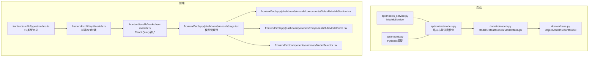
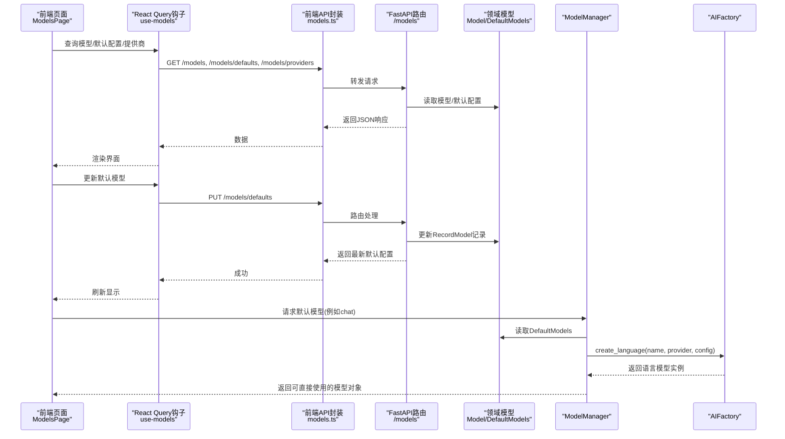
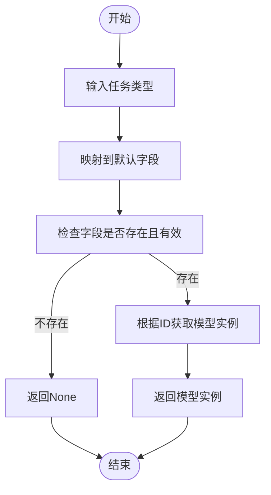
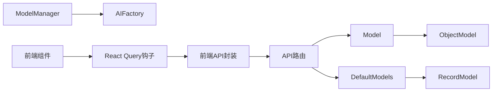

# AI模型配置模型

<cite>
**本文引用的文件**
- [open_notebook/domain/models.py](file://open_notebook/domain/models.py)
- [open_notebook/domain/base.py](file://open_notebook/domain/base.py)
- [api/routers/models.py](file://api/routers/models.py)
- [api/models.py](file://api/models.py)
- [api/models_service.py](file://api/models_service.py)
- [frontend/src/lib/types/models.ts](file://frontend/src/lib/types/models.ts)
- [frontend/src/lib/api/models.ts](file://frontend/src/lib/api/models.ts)
- [frontend/src/lib/hooks/use-models.ts](file://frontend/src/lib/hooks/use-models.ts)
- [frontend/src/app/(dashboard)/models/page.tsx](file://frontend/src/app/(dashboard)/models/page.tsx)
- [frontend/src/app/(dashboard)/models/components/DefaultModelsSection.tsx](file://frontend/src/app/(dashboard)/models/components/DefaultModelsSection.tsx)
- [frontend/src/app/(dashboard)/models/components/AddModelForm.tsx](file://frontend/src/app/(dashboard)/models/components/AddModelForm.tsx)
- [frontend/src/components/common/ModelSelector.tsx](file://frontend/src/components/common/ModelSelector.tsx)
- [docs/features/ai-models.md](file://docs/features/ai-models.md)
- [docs/features/ollama.md](file://docs/features/ollama.md)
- [docs/features/openai-compatible.md](file://docs/features/openai-compatible.md)
</cite>

## 目录
1. [简介](#简介)
2. [项目结构](#项目结构)
3. [核心组件](#核心组件)
4. [架构总览](#架构总览)
5. [详细组件分析](#详细组件分析)
6. [依赖关系分析](#依赖关系分析)
7. [性能考虑](#性能考虑)
8. [故障排查指南](#故障排查指南)
9. [结论](#结论)
10. [附录](#附录)

## 简介
本文件系统性梳理“AI模型配置领域模型”，围绕后端领域模型与服务层、API路由、前端配置界面之间的协作关系，解释Model类及默认模型配置的结构、职责、验证规则，以及如何通过统一抽象支持多提供商（如OpenAI、Ollama等）与多模型类型（聊天、嵌入、语音合成、语音识别）。同时说明默认模型选择策略、运行时动态加载与切换机制，并给出安全存储敏感凭证的最佳实践建议。

## 项目结构
该功能横跨后端领域层、API层、服务层与前端界面层：
- 后端领域层：定义模型实体与默认配置记录，负责持久化与读取。
- API层：提供REST接口，暴露模型列表、创建、删除、默认配置查询与更新、提供商可用性检测。
- 服务层：封装API调用，供其他模块复用。
- 前端：提供模型管理页面、默认模型配置面板、添加模型表单、模型选择器等组件。

图表来源
- [open_notebook/domain/models.py](file://open_notebook/domain/models.py#L1-L199)
- [open_notebook/domain/base.py](file://open_notebook/domain/base.py#L1-L330)
- [api/routers/models.py](file://api/routers/models.py#L1-L300)
- [api/models_service.py](file://api/models_service.py#L1-L100)
- [api/models.py](file://api/models.py#L1-L425)
- [frontend/src/lib/types/models.ts](file://frontend/src/lib/types/models.ts#L1-L30)
- [frontend/src/lib/api/models.ts](file://frontend/src/lib/api/models.ts#L1-L38)
- [frontend/src/lib/hooks/use-models.ts](file://frontend/src/lib/hooks/use-models.ts#L1-L112)
- [frontend/src/app/(dashboard)/models/page.tsx](file://frontend/src/app/(dashboard)/models/page.tsx#L1-L101)
- [frontend/src/app/(dashboard)/models/components/DefaultModelsSection.tsx](file://frontend/src/app/(dashboard)/models/components/DefaultModelsSection.tsx#L1-L266)
- [frontend/src/app/(dashboard)/models/components/AddModelForm.tsx](file://frontend/src/app/(dashboard)/models/components/AddModelForm.tsx#L1-L136)
- [frontend/src/components/common/ModelSelector.tsx](file://frontend/src/components/common/ModelSelector.tsx#L1-L60)

章节来源
- [open_notebook/domain/models.py](file://open_notebook/domain/models.py#L1-L199)
- [api/routers/models.py](file://api/routers/models.py#L1-L300)
- [frontend/src/app/(dashboard)/models/page.tsx](file://frontend/src/app/(dashboard)/models/page.tsx#L1-L101)

## 核心组件
- Model（领域模型）
  - 字段：name、provider、type；继承自ObjectModel，具备通用的持久化能力。
  - 能力：按类型过滤查询、保存/删除。
- DefaultModels（默认模型记录）
  - 字段：default_chat_model、default_transformation_model、large_context_model、default_text_to_speech_model、default_speech_to_text_model、default_embedding_model、default_tools_model。
  - 特性：RecordModel单例缓存，但每次读取都会从数据库刷新，确保默认值实时生效。
- ModelManager（模型工厂与默认模型选择）
  - 提供根据模型ID获取具体模型实例的能力，内部委托给AIFactory按类型创建语言/嵌入/语音合成/语音识别模型。
  - 提供默认模型选择策略：按任务类型返回对应默认模型ID并动态构建实例。
- API路由与服务
  - 模型管理：列出、创建、删除。
  - 默认模型：查询、更新。
  - 提供商可用性：基于环境变量与AIFactory能力矩阵动态判断。
  - ModelsService：封装API调用，便于其他模块使用。

章节来源
- [open_notebook/domain/models.py](file://open_notebook/domain/models.py#L1-L199)
- [open_notebook/domain/base.py](file://open_notebook/domain/base.py#L1-L330)
- [api/routers/models.py](file://api/routers/models.py#L1-L300)
- [api/models_service.py](file://api/models_service.py#L1-L100)

## 架构总览
下面以序列图展示“前端配置界面 -> API -> 领域模型 -> AIFactory”的调用链路，以及默认模型选择流程。

图表来源
- [frontend/src/app/(dashboard)/models/page.tsx](file://frontend/src/app/(dashboard)/models/page.tsx#L1-L101)
- [frontend/src/lib/hooks/use-models.ts](file://frontend/src/lib/hooks/use-models.ts#L1-L112)
- [frontend/src/lib/api/models.ts](file://frontend/src/lib/api/models.ts#L1-L38)
- [api/routers/models.py](file://api/routers/models.py#L1-L300)
- [open_notebook/domain/models.py](file://open_notebook/domain/models.py#L68-L199)

## 详细组件分析

### Model类与数据模型
- 字段与约束
  - name：模型名称，用于标识具体模型。
  - provider：提供商名称，如openai、anthropic、ollama等。
  - type：模型类型，限定为language、embedding、speech_to_text、text_to_speech之一。
  - 继承ObjectModel：具备统一的保存、删除、查询能力。
- 查询与校验
  - 支持按type过滤查询。
  - 创建时进行重复性校验（大小写不敏感的provider+name组合唯一）。
- 验证规则
  - 类型必须在允许集合内，否则抛出错误。
  - 通过AIFactory按type创建具体模型实例，交由外部库进行进一步参数校验与实例缓存。

章节来源
- [open_notebook/domain/models.py](file://open_notebook/domain/models.py#L18-L31)
- [api/routers/models.py](file://api/routers/models.py#L62-L153)
- [api/models.py](file://api/models.py#L62-L81)

### DefaultModels与默认模型选择策略
- 字段含义
  - default_chat_model：聊天对话默认模型。
  - default_transformation_model：转换/摘要/洞察默认模型。
  - large_context_model：大上下文窗口模型（如Gemini）。
  - default_text_to_speech_model：文本转语音默认模型。
  - default_speech_to_text_model：语音转文本默认模型。
  - default_embedding_model：向量嵌入默认模型。
  - default_tools_model：工具调用默认模型（推荐OpenAI/Anthropic）。
- 读取策略
  - DefaultModels.get_instance每次都会从数据库读取最新值，绕过单例缓存，保证运行时一致性。
- 默认模型选择逻辑
  - ModelManager.get_default_model根据任务类型映射到对应默认字段，若未设置则返回None。
  - 对于transformation与tools，若未显式设置则回退到chat默认模型，体现“优先级回退”。

图表来源
- [open_notebook/domain/models.py](file://open_notebook/domain/models.py#L161-L196)

章节来源
- [open_notebook/domain/models.py](file://open_notebook/domain/models.py#L32-L66)
- [open_notebook/domain/models.py](file://open_notebook/domain/models.py#L161-L196)

### ModelManager与AIFactory集成
- 动态构建模型
  - 根据Model.type选择AIFactory的create_language/create_embedding/create_speech_to_text/create_text_to_speech。
  - 将Model.name/provider/config传递给AIFactory，由其完成SDK初始化与实例缓存。
- 运行时切换
  - 通过ModelManager.get_model(model_id, **kwargs)实现按需加载，避免全局缓存导致的配置变更不生效。
  - 默认模型选择通过DefaultModels.get_instance配合get_default_model实现，确保每次读取都是最新配置。

章节来源
- [open_notebook/domain/models.py](file://open_notebook/domain/models.py#L68-L159)

### API路由与前端交互
- 路由能力
  - 获取模型列表（可按type过滤）、创建模型（含重复性校验）、删除模型。
  - 获取/更新默认模型配置。
  - 获取提供商可用性：基于环境变量与AIFactory能力矩阵动态判断，支持通用与模式特定的配置。
- 前端类型与API封装
  - TS类型定义与API封装保持一致，确保前后端契约稳定。
  - React Query钩子负责缓存、失效与错误提示。
- 前端界面
  - 模型管理页聚合提供商状态、默认模型配置与各类型模型列表。
  - 默认模型配置面板支持必填项校验与变更确认（如嵌入模型变更的二次确认）。
  - 添加模型表单根据提供商可用性与支持类型筛选可选提供商。
  - 模型选择器按类型过滤并展示provider信息。

章节来源
- [api/routers/models.py](file://api/routers/models.py#L62-L300)
- [api/models.py](file://api/models.py#L62-L110)
- [frontend/src/lib/types/models.ts](file://frontend/src/lib/types/models.ts#L1-L30)
- [frontend/src/lib/api/models.ts](file://frontend/src/lib/api/models.ts#L1-L38)
- [frontend/src/lib/hooks/use-models.ts](file://frontend/src/lib/hooks/use-models.ts#L1-L112)
- [frontend/src/app/(dashboard)/models/page.tsx](file://frontend/src/app/(dashboard)/models/page.tsx#L1-L101)
- [frontend/src/app/(dashboard)/models/components/DefaultModelsSection.tsx](file://frontend/src/app/(dashboard)/models/components/DefaultModelsSection.tsx#L1-L266)
- [frontend/src/app/(dashboard)/models/components/AddModelForm.tsx](file://frontend/src/app/(dashboard)/models/components/AddModelForm.tsx#L1-L136)
- [frontend/src/components/common/ModelSelector.tsx](file://frontend/src/components/common/ModelSelector.tsx#L1-L60)

### 多提供商与多模型类型的统一抽象
- 统一抽象
  - Model.type作为统一入口，ModelManager依据type分派到AIFactory对应创建方法，屏蔽不同提供商SDK差异。
- 提供商检测
  - 路由层通过环境变量与AIFactory能力矩阵判断可用提供商及其支持的模型类型，前端据此限制可选提供商与模型类型。
- 兼容性示例
  - OpenAI-Compatible与Azure OpenAI支持按模态（LLM/Embedding/STT/TTS）分别配置，满足混合部署场景。

章节来源
- [api/routers/models.py](file://api/routers/models.py#L20-L299)
- [docs/features/ai-models.md](file://docs/features/ai-models.md#L1-L200)
- [docs/features/ollama.md](file://docs/features/ollama.md#L1-L120)
- [docs/features/openai-compatible.md](file://docs/features/openai-compatible.md#L1-L120)

### 运行时动态加载与切换机制
- 动态加载
  - ModelManager.get_model按ID即时查询并创建实例，避免静态缓存导致的配置变更延迟。
- 切换机制
  - 前端通过ModelSelector按类型过滤，用户选择后立即触发请求，后端返回对应模型实例。
  - 默认模型变更通过PUT /models/defaults即时生效，下一次获取默认模型时读取最新值。

章节来源
- [open_notebook/domain/models.py](file://open_notebook/domain/models.py#L72-L117)
- [frontend/src/components/common/ModelSelector.tsx](file://frontend/src/components/common/ModelSelector.tsx#L1-L60)
- [frontend/src/lib/api/models.ts](file://frontend/src/lib/api/models.ts#L1-L38)

### 安全存储敏感凭证的最佳实践
- 环境变量优先
  - 路由层通过环境变量判断提供商可用性，避免在数据库中存储明文密钥。
- 最小权限原则
  - 为不同模态（LLM/Embedding/STT/TTS）配置独立的密钥与端点，降低泄露影响面。
- 加密与传输安全
  - 在生产环境中启用HTTPS与CA证书校验，必要时使用自定义CA Bundle。
- 访问控制
  - 仅在可信网络内暴露本地推理服务，必要时通过反向代理与防火墙限制访问。
- 变更审计
  - 使用日志与监控记录模型切换与默认配置变更，便于追踪异常。

章节来源
- [api/routers/models.py](file://api/routers/models.py#L20-L299)
- [docs/features/ai-models.md](file://docs/features/ai-models.md#L549-L620)
- [docs/features/ollama.md](file://docs/features/ollama.md#L434-L472)
- [docs/features/openai-compatible.md](file://docs/features/openai-compatible.md#L347-L386)

## 依赖关系分析
- 后端耦合
  - Model依赖ObjectModel实现持久化；DefaultModels依赖RecordModel实现记录级缓存与数据库读写。
  - ModelManager依赖AIFactory进行模型实例化，依赖DefaultModels进行默认配置读取。
- 前后端契约
  - TS类型与API封装与后端Pydantic模型保持一致，减少类型不匹配风险。
- 外部依赖
  - AIFactory提供统一的提供商SDK抽象，路由层通过其能力矩阵与环境变量共同决定可用性。

图表来源
- [open_notebook/domain/models.py](file://open_notebook/domain/models.py#L1-L199)
- [open_notebook/domain/base.py](file://open_notebook/domain/base.py#L1-L330)
- [api/routers/models.py](file://api/routers/models.py#L1-L300)
- [frontend/src/lib/api/models.ts](file://frontend/src/lib/api/models.ts#L1-L38)
- [frontend/src/lib/hooks/use-models.ts](file://frontend/src/lib/hooks/use-models.ts#L1-L112)

章节来源
- [open_notebook/domain/models.py](file://open_notebook/domain/models.py#L1-L199)
- [open_notebook/domain/base.py](file://open_notebook/domain/base.py#L1-L330)
- [api/routers/models.py](file://api/routers/models.py#L1-L300)

## 性能考虑
- 实例缓存与一致性
  - AIFactory对具体模型实例进行缓存，ModelManager按需创建，避免全局缓存导致的配置变更不生效。
  - DefaultModels.get_instance每次读取数据库，确保默认配置实时性，但可能带来额外查询开销，可在高频场景下评估是否引入短期缓存并设置合理失效策略。
- 查询优化
  - 按type过滤模型列表可减少前端渲染负担。
  - Provider可用性检测仅依赖环境变量与AIFactory能力矩阵，成本较低。
- 前端体验
  - React Query自动缓存与失效，减少重复请求。
  - 模型选择器按类型过滤，提升交互效率。

[本节为通用指导，无需列出具体文件来源]

## 故障排查指南
- 模型创建失败（重复名）
  - 现象：同provider下同名模型重复创建被拒绝。
  - 排查：检查大小写不敏感的provider+name组合是否已存在。
- 默认模型为空
  - 现象：某些任务类型无默认模型。
  - 排查：确认DefaultModels对应字段是否已设置；若未设置，ModelManager会返回None。
- 提供商不可用
  - 现象：/models/providers显示提供商为不可用。
  - 排查：检查对应环境变量是否正确设置；Azure与OpenAI-Compatible支持通用与模式特定配置，注意优先级与端点一致性。
- 嵌入模型变更
  - 现象：更换默认嵌入模型需要二次确认。
  - 排查：前端默认模型配置面板会弹窗提示，确认后更新；若取消则不改变当前配置。

章节来源
- [api/routers/models.py](file://api/routers/models.py#L90-L153)
- [open_notebook/domain/models.py](file://open_notebook/domain/models.py#L118-L196)
- [frontend/src/app/(dashboard)/models/components/DefaultModelsSection.tsx](file://frontend/src/app/(dashboard)/models/components/DefaultModelsSection.tsx#L1-L266)

## 结论
本领域模型通过统一的Model与DefaultModels设计，结合ModelManager与AIFactory，实现了对多提供商、多模型类型的统一抽象与运行时动态加载。API路由与前端界面协同，提供了完善的模型管理、默认配置与提供商可用性检测能力。通过环境变量驱动的安全策略与严格的类型契约，系统在灵活性与安全性之间取得平衡。建议在生产环境中遵循最小权限、加密传输与访问控制等最佳实践，确保敏感凭证与数据安全。

[本节为总结性内容，无需列出具体文件来源]

## 附录
- 推荐配置参考
  - AI模型与提供商指南：涵盖各提供商能力矩阵、推荐模型与成本策略。
  - Ollama本地部署指南：包含网络配置、硬件要求与故障排查。
  - OpenAI-Compatible部署指南：覆盖LM Studio、vLLM等常见本地推理服务的配置要点与安全建议。

章节来源
- [docs/features/ai-models.md](file://docs/features/ai-models.md#L1-L200)
- [docs/features/ollama.md](file://docs/features/ollama.md#L1-L120)
- [docs/features/openai-compatible.md](file://docs/features/openai-compatible.md#L1-L120)