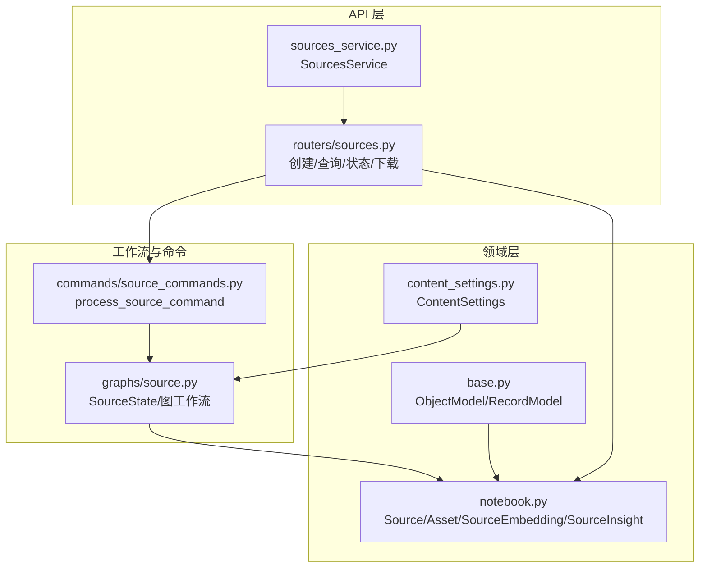
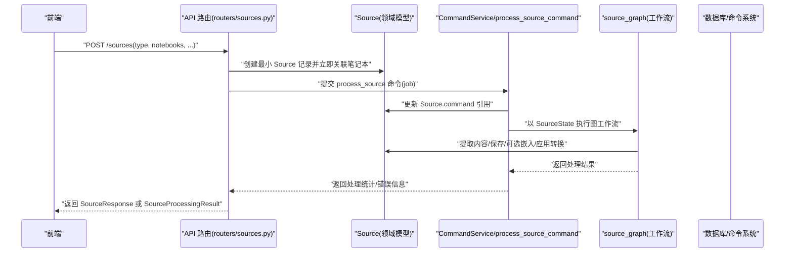
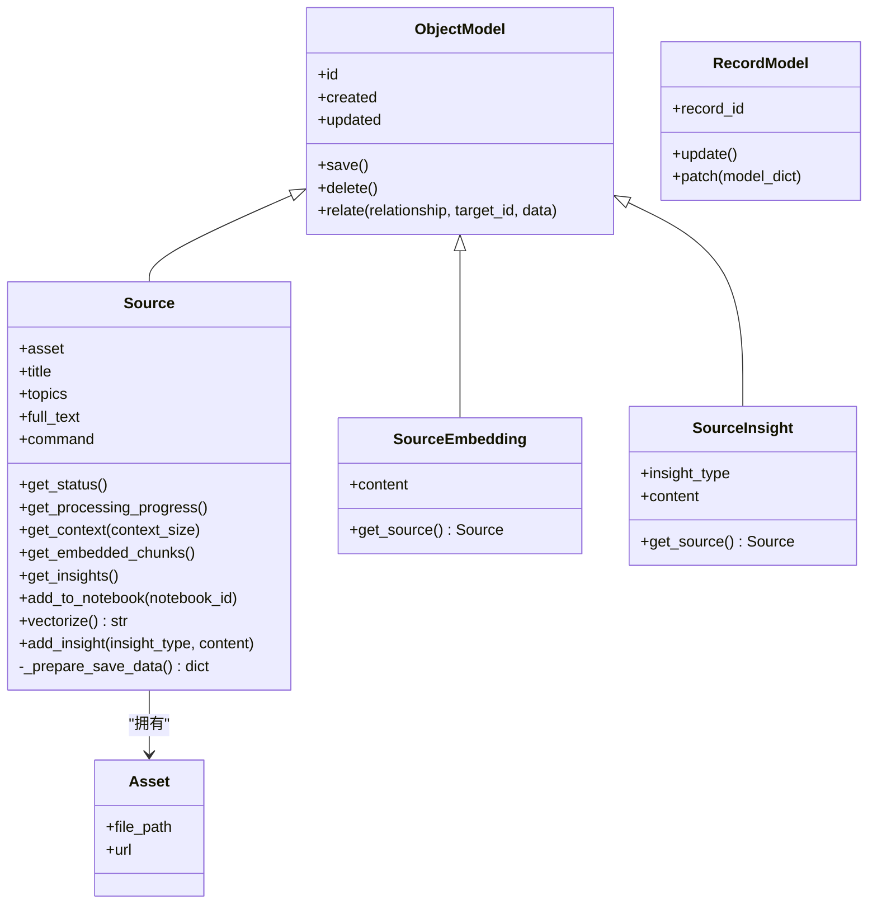
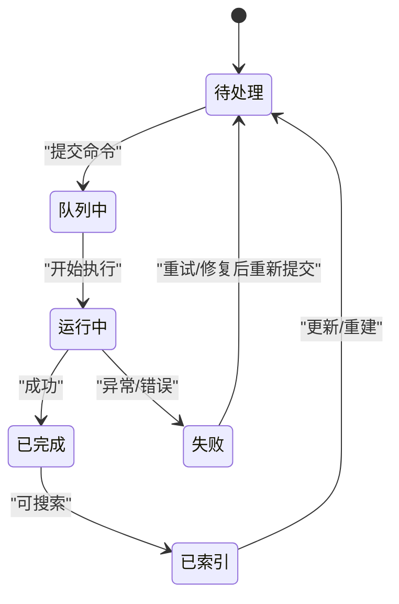
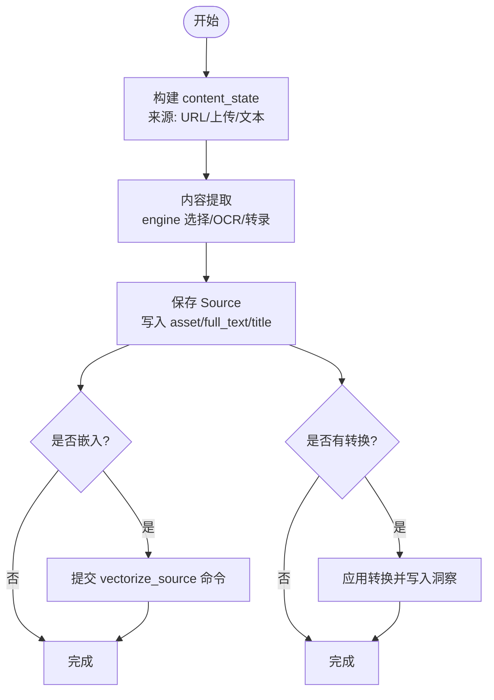
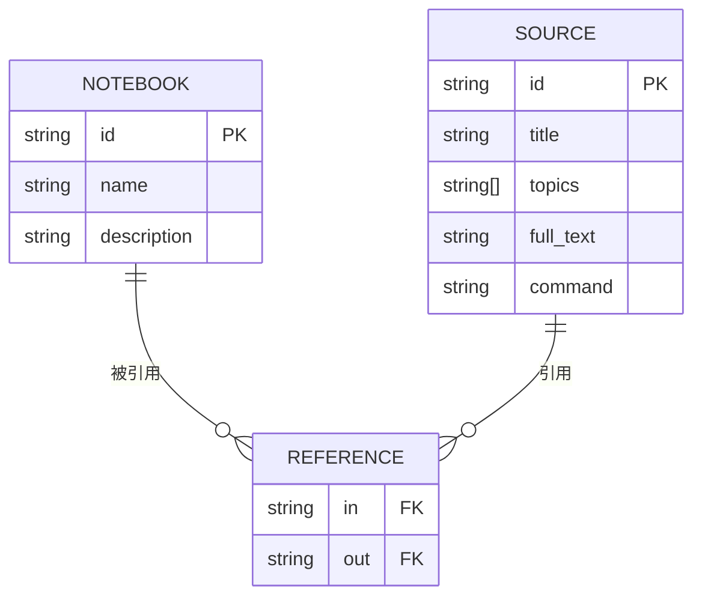
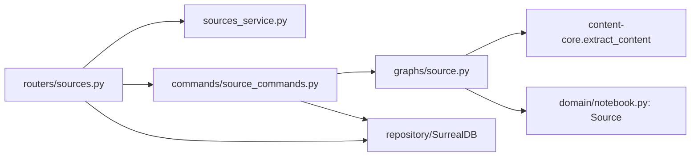

# 内容源模型

<cite>
**本文引用的文件**
- [open_notebook/domain/notebook.py](file://open_notebook/domain/notebook.py)
- [open_notebook/domain/base.py](file://open_notebook/domain/base.py)
- [open_notebook/domain/content_settings.py](file://open_notebook/domain/content_settings.py)
- [open_notebook/graphs/source.py](file://open_notebook/graphs/source.py)
- [api/routers/sources.py](file://api/routers/sources.py)
- [api/sources_service.py](file://api/sources_service.py)
- [commands/source_commands.py](file://commands/source_commands.py)
- [docs/user-guide/sources.md](file://docs/user-guide/sources.md)
</cite>

## 目录
1. [简介](#简介)
2. [项目结构](#项目结构)
3. [核心组件](#核心组件)
4. [架构总览](#架构总览)
5. [详细组件分析](#详细组件分析)
6. [依赖关系分析](#依赖关系分析)
7. [性能考量](#性能考量)
8. [故障排查指南](#故障排查指南)
9. [结论](#结论)
10. [附录](#附录)

## 简介
本文件围绕“内容源（Source）”领域模型进行系统化文档化，阐明其作为知识输入核心载体的设计理念与实现细节。重点包括：
- Source 类的属性定义（类型、URL、元数据、处理状态）
- 状态机流转逻辑（待处理、已索引、错误状态等）
- 支持的方法（解析、嵌入重建、上下文获取、洞察生成）
- 与 Notebook 的多对多关联机制
- 在索引与搜索中的作用
- 生命周期管理与与 Embedding 服务的交互流程
- 状态转换图与典型使用场景示例

## 项目结构
围绕 Source 的相关模块分布如下：
- 领域模型与基类：open_notebook/domain/notebook.py、open_notebook/domain/base.py
- 图工作流与状态机：open_notebook/graphs/source.py
- API 路由与服务封装：api/routers/sources.py、api/sources_service.py
- 命令执行与重试策略：commands/source_commands.py
- 内容设置与默认模型：open_notebook/domain/content_settings.py
- 用户指南与使用场景：docs/user-guide/sources.md

图表来源
- [open_notebook/domain/notebook.py](file://open_notebook/domain/notebook.py#L144-L351)
- [open_notebook/domain/base.py](file://open_notebook/domain/base.py#L25-L207)
- [open_notebook/domain/content_settings.py](file://open_notebook/domain/content_settings.py#L1-L26)
- [open_notebook/graphs/source.py](file://open_notebook/graphs/source.py#L1-L156)
- [api/routers/sources.py](file://api/routers/sources.py#L319-L561)
- [api/sources_service.py](file://api/sources_service.py#L64-L306)
- [commands/source_commands.py](file://commands/source_commands.py#L30-L153)

章节来源
- [open_notebook/domain/notebook.py](file://open_notebook/domain/notebook.py#L144-L351)
- [open_notebook/graphs/source.py](file://open_notebook/graphs/source.py#L1-L156)
- [api/routers/sources.py](file://api/routers/sources.py#L319-L561)
- [api/sources_service.py](file://api/sources_service.py#L64-L306)
- [commands/source_commands.py](file://commands/source_commands.py#L30-L153)
- [open_notebook/domain/content_settings.py](file://open_notebook/domain/content_settings.py#L1-L26)

## 核心组件
- Source：内容源实体，承载资产（Asset）、标题、主题、全文文本、命令引用等；提供状态查询、进度获取、上下文导出、嵌入提交、洞察生成等方法。
- Asset：资源载体，包含文件路径与 URL。
- SourceEmbedding/SourceInsight：与 Source 关联的向量嵌入与洞察记录。
- ObjectModel/RecordModel：通用 ORM 基类，提供 CRUD、关系连接、嵌入能力等。
- ContentSettings：内容处理与嵌入的默认策略配置。
- SourceState/图工作流：定义内容提取、保存、转换、嵌入的有向无环图（DAG）流程。
- API 路由与服务：提供创建、查询、状态、下载、更新等接口；支持同步/异步处理。
- 命令执行：process_source_command 将 SourceProcessingInput 输入交给图工作流执行，并返回结果。

章节来源
- [open_notebook/domain/notebook.py](file://open_notebook/domain/notebook.py#L94-L351)
- [open_notebook/domain/base.py](file://open_notebook/domain/base.py#L25-L207)
- [open_notebook/domain/content_settings.py](file://open_notebook/domain/content_settings.py#L1-L26)
- [open_notebook/graphs/source.py](file://open_notebook/graphs/source.py#L1-L156)
- [api/routers/sources.py](file://api/routers/sources.py#L319-L561)
- [commands/source_commands.py](file://commands/source_commands.py#L30-L153)

## 架构总览
下图展示从 API 到命令执行再到图工作流的整体调用链路，以及 Source 与 Notebook 的多对多关联如何通过 reference 边建立。

图表来源
- [api/routers/sources.py](file://api/routers/sources.py#L319-L561)
- [commands/source_commands.py](file://commands/source_commands.py#L47-L153)
- [open_notebook/graphs/source.py](file://open_notebook/graphs/source.py#L1-L156)
- [open_notebook/domain/notebook.py](file://open_notebook/domain/notebook.py#L261-L351)

## 详细组件分析

### Source 类与属性定义
- 属性
  - asset: 可选的 Asset（文件路径或 URL）
  - title: 可选标题
  - topics: 主题列表
  - full_text: 全文文本
  - command: 指向 surreal-commands 处理作业的引用（RecordID）
- 方法
  - get_status/get_processing_progress：基于 command 查询处理状态与进度
  - get_context：导出短/长上下文（含洞察）
  - get_embedded_chunks：统计嵌入块数量
  - get_insights：读取洞察记录
  - add_to_notebook：通过 reference 边与 Notebook 建立多对多关联
  - vectorize：提交向量化作业（分片+嵌入），返回命令 ID
  - add_insight：基于嵌入模型生成向量并写入 source_insight
  - _prepare_save_data：确保 command 字段为 RecordID 格式

图表来源
- [open_notebook/domain/base.py](file://open_notebook/domain/base.py#L25-L207)
- [open_notebook/domain/notebook.py](file://open_notebook/domain/notebook.py#L94-L351)

章节来源
- [open_notebook/domain/notebook.py](file://open_notebook/domain/notebook.py#L144-L351)

### 状态机与生命周期
- 状态来源
  - 同步处理：直接返回处理完成的 Source（无 command）
  - 异步处理：创建 Source 记录后提交命令，Source.command 指向该命令；可通过 get_status 获取状态
- 状态枚举与含义
  - 新建（new）：刚创建，尚未开始处理
  - 队列中（queued）：已入队等待执行
  - 运行中（running）：正在执行
  - 已完成（completed）：成功完成
  - 失败（failed）：执行失败
  - 未知（unknown）：无法获取状态
- 生命周期阶段
  - 创建：API 接收参数，构造 content_state
  - 提交命令：异步模式下提交 process_source 命令
  - 执行工作流：图工作流依次执行内容提取、保存、转换、嵌入
  - 结果回传：返回嵌入块数、洞察数、耗时等统计

图表来源
- [api/routers/sources.py](file://api/routers/sources.py#L724-L783)
- [open_notebook/domain/notebook.py](file://open_notebook/domain/notebook.py#L175-L215)
- [commands/source_commands.py](file://commands/source_commands.py#L47-L153)

章节来源
- [api/routers/sources.py](file://api/routers/sources.py#L724-L783)
- [open_notebook/domain/notebook.py](file://open_notebook/domain/notebook.py#L175-L215)
- [commands/source_commands.py](file://commands/source_commands.py#L47-L153)

### 解析与嵌入重建流程
- 解析流程（图工作流）
  - content_process：根据 ContentSettings 选择引擎，调用 content-core 提取内容，输出 content_state
  - save_source：加载 Source，写入 asset、full_text、title，必要时触发 vectorize
  - transform_content：按需应用 Transformation，将输出写入 SourceInsight
- 嵌入重建
  - Source.vectorize：提交 vectorize_source 命令，后台分片并逐片嵌入，幂等删除旧嵌入
  - 支持批量进度查询与统计

图表来源
- [open_notebook/graphs/source.py](file://open_notebook/graphs/source.py#L1-L156)
- [open_notebook/domain/content_settings.py](file://open_notebook/domain/content_settings.py#L1-L26)
- [open_notebook/domain/notebook.py](file://open_notebook/domain/notebook.py#L266-L338)

章节来源
- [open_notebook/graphs/source.py](file://open_notebook/graphs/source.py#L1-L156)
- [open_notebook/domain/content_settings.py](file://open_notebook/domain/content_settings.py#L1-L26)
- [open_notebook/domain/notebook.py](file://open_notebook/domain/notebook.py#L266-L338)

### 与 Notebook 的多对多关联机制
- 关联方式
  - Source.add_to_notebook：通过 reference 边建立 Source 与 Notebook 的多对多关系
  - API 层在创建 Source 时即刻为其添加到指定笔记本，保证 UI 即时可见
- 查询与展示
  - Notebook.get_sources：通过反向边查询关联的 Source 列表
  - API 列表接口返回 embedded、insights_count 等聚合信息

图表来源
- [open_notebook/domain/notebook.py](file://open_notebook/domain/notebook.py#L29-L45)
- [api/routers/sources.py](file://api/routers/sources.py#L172-L205)

章节来源
- [open_notebook/domain/notebook.py](file://open_notebook/domain/notebook.py#L29-L45)
- [api/routers/sources.py](file://api/routers/sources.py#L172-L205)

### 在索引与搜索中的作用
- 文本检索：通过数据库函数执行文本搜索
- 向量检索：先对关键词嵌入，再调用向量搜索函数
- Source 的嵌入块计数用于 UI 展示与后续检索判断
- 洞察（SourceInsight）亦可嵌入并参与向量检索

章节来源
- [open_notebook/domain/notebook.py](file://open_notebook/domain/notebook.py#L406-L457)

### API 与服务层交互
- API 路由
  - create_source：支持 JSON 与表单两种输入；同步/异步两种处理路径
  - get_source/status/download：查询详情、状态、下载原文件
  - 更新与删除：支持修改标题/主题等元数据
- SourcesService
  - 封装 API 客户端调用，提供统一的 SourceWithMetadata、SourceProcessingResult 包装
  - 提供 is_source_processing_complete 等便捷方法

章节来源
- [api/routers/sources.py](file://api/routers/sources.py#L319-L561)
- [api/sources_service.py](file://api/sources_service.py#L64-L306)

## 依赖关系分析
- 组件耦合
  - Source 依赖 ObjectModel/RecordModel 提供持久化与关系操作
  - 图工作流依赖 content-core 的 extract_content 与默认模型配置
  - API 路由依赖 CommandService 提交命令，依赖 Notebook/Transformation 等模型
  - 命令执行依赖 surreal-commands 的命令注册与重试策略
- 外部依赖
  - content-core：内容提取引擎选择与执行
  - surreal-commands：命令提交、重试、状态查询
  - 数据库：SurrealDB（通过 repository 抽象）

图表来源
- [api/routers/sources.py](file://api/routers/sources.py#L319-L561)
- [api/sources_service.py](file://api/sources_service.py#L64-L306)
- [commands/source_commands.py](file://commands/source_commands.py#L47-L153)
- [open_notebook/graphs/source.py](file://open_notebook/graphs/source.py#L1-L156)
- [open_notebook/domain/notebook.py](file://open_notebook/domain/notebook.py#L144-L351)

章节来源
- [api/routers/sources.py](file://api/routers/sources.py#L319-L561)
- [api/sources_service.py](file://api/sources_service.py#L64-L306)
- [commands/source_commands.py](file://commands/source_commands.py#L47-L153)
- [open_notebook/graphs/source.py](file://open_notebook/graphs/source.py#L1-L156)
- [open_notebook/domain/notebook.py](file://open_notebook/domain/notebook.py#L144-L351)

## 性能考量
- 异步处理避免阻塞 HTTP 连接池，后台并发控制自然缓解大文档压力
- 嵌入采用分片与幂等删除策略，降低重复计算成本
- 搜索接口支持文本与向量混合检索，可根据需求选择合适策略
- 建议：仅对需要检索的 Source 开启嵌入；合理设置 ContentSettings 默认行为；利用洞察减少重复处理

## 故障排查指南
- 常见问题
  - 上传文件失败：检查文件大小限制、权限与磁盘空间
  - 处理失败：查看命令状态与错误信息，确认模型配置与 API 密钥
  - 无转录/无内容：检查语音转写模型配置与语言偏好
  - 嵌入失败：确认嵌入模型可用、配额充足、内容长度合理
- 定位手段
  - 使用 get_source_status 获取命令状态与执行元数据
  - 查看 Source.get_processing_progress 获取详细进度
  - 在前端根据状态自动轮询，检测完成/失败后停止

章节来源
- [api/routers/sources.py](file://api/routers/sources.py#L724-L783)
- [open_notebook/domain/notebook.py](file://open_notebook/domain/notebook.py#L175-L215)

## 结论
Source 作为知识输入的核心载体，通过清晰的属性设计、严谨的状态机与工作流编排、以及与 Notebook 的多对多关联，实现了从多源异构内容到结构化知识的完整闭环。配合异步命令执行与向量检索，既保证了用户体验，也兼顾了性能与成本控制。建议在实际使用中结合 ContentSettings 与默认模型配置，按需启用嵌入与转换，以获得最佳效果。

## 附录
- 典型使用场景
  - 快速导入网页链接或本地文档，自动提取内容并生成洞察
  - 对视频/音频进行转录与摘要，便于后续检索
  - 将多个 Source 关联到同一 Notebook，统一进行检索与对话
- 参考文档
  - 用户指南：内容格式、处理流程、最佳实践与故障排查

章节来源
- [docs/user-guide/sources.md](file://docs/user-guide/sources.md#L1-L310)