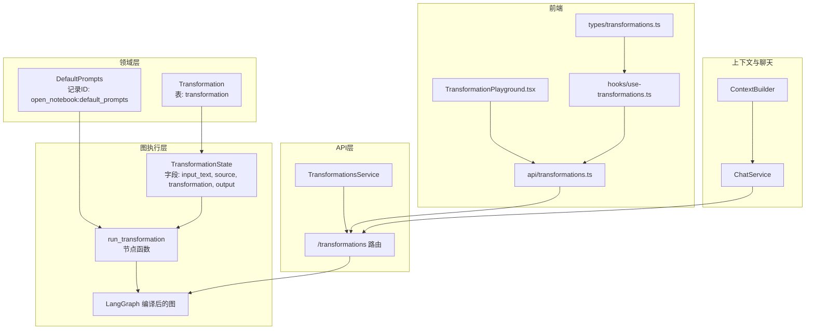
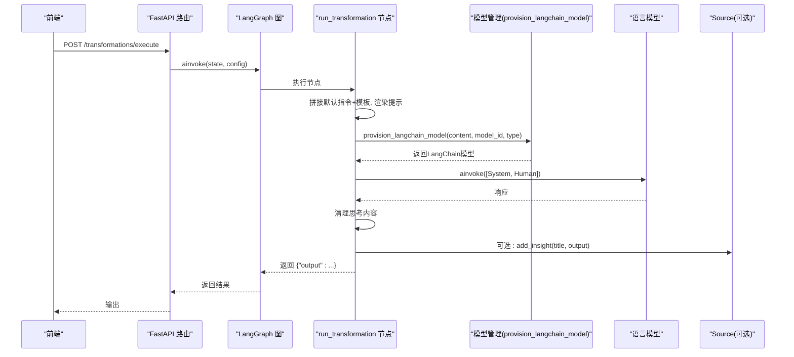
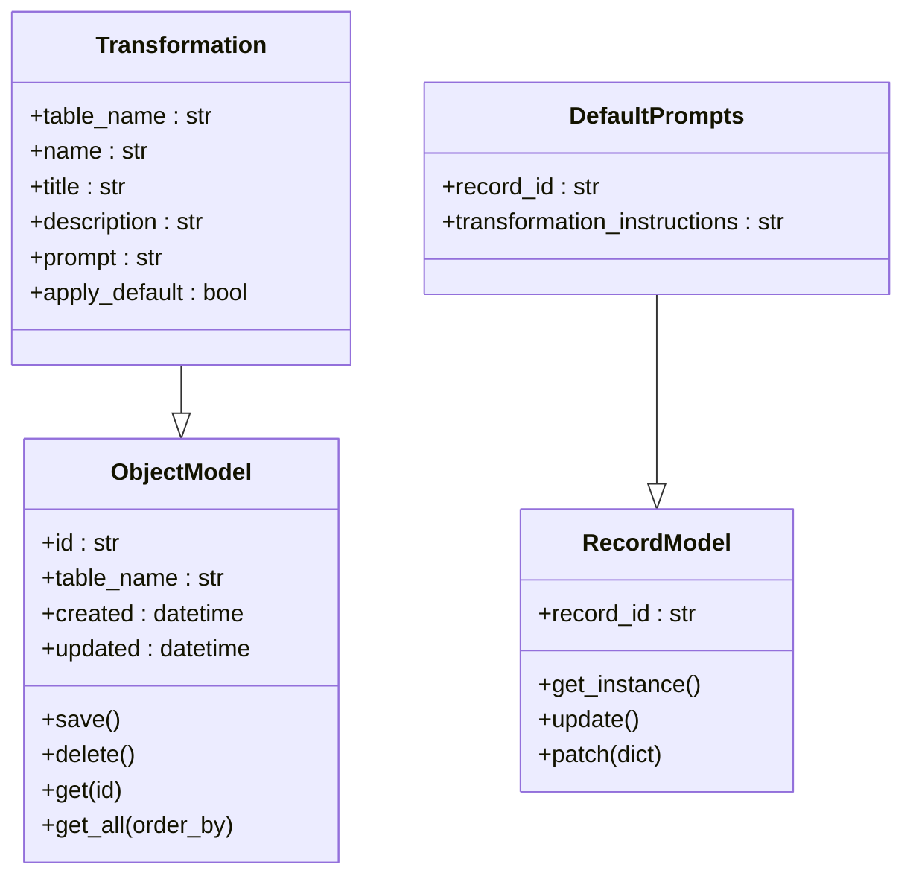
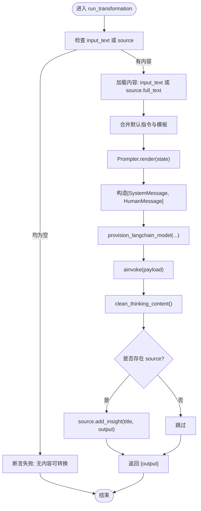
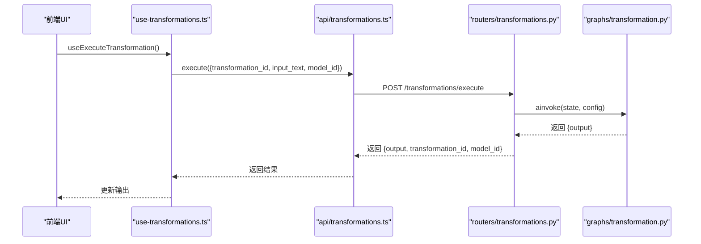
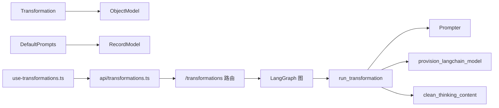

# 内容转换模型

<cite>
**本文引用的文件**
- [open_notebook/domain/transformation.py](file://open_notebook/domain/transformation.py)
- [open_notebook/graphs/transformation.py](file://open_notebook/graphs/transformation.py)
- [api/routers/transformations.py](file://api/routers/transformations.py)
- [api/transformations_service.py](file://api/transformations_service.py)
- [open_notebook/graphs/utils.py](file://open_notebook/graphs/utils.py)
- [open_notebook/utils/context_builder.py](file://open_notebook/utils/context_builder.py)
- [api/chat_service.py](file://api/chat_service.py)
- [docs/features/transformations.md](file://docs/features/transformations.md)
- [frontend/src/lib/types/transformations.ts](file://frontend/src/lib/types/transformations.ts)
- [frontend/src/lib/hooks/use-transformations.ts](file://frontend/src/lib/hooks/use-transformations.ts)
- [frontend/src/lib/api/transformations.ts](file://frontend/src/lib/api/transformations.ts)
- [frontend/src/app/(dashboard)/transformations/components/TransformationPlayground.tsx](file://frontend/src/app/(dashboard)/transformations/components/TransformationPlayground.tsx)
- [tests/test_graphs.py](file://tests/test_graphs.py)
</cite>

## 目录
1. [简介](#简介)
2. [项目结构](#项目结构)
3. [核心组件](#核心组件)
4. [架构总览](#架构总览)
5. [详细组件分析](#详细组件分析)
6. [依赖关系分析](#依赖关系分析)
7. [性能考量](#性能考量)
8. [故障排查指南](#故障排查指南)
9. [结论](#结论)
10. [附录](#附录)

## 简介
本文件系统性解析内容转换（Transformation）领域模型及其作为AI驱动内容处理引擎的核心设计。Transformation类承载“名称、标题、描述、提示模板、是否默认应用”等属性，并通过图执行引擎（LangGraph）与Jinja2风格的提示模板渲染器协同工作，实现可复用、可扩展的自动化内容处理流程。文档还阐述其与上下文构建、聊天服务的集成方式，覆盖支持的转换类型（摘要、问答、重构等），并提供自定义转换的开发指南与错误处理策略。

## 项目结构
围绕Transformation的关键模块分布如下：
- 领域模型：Transformation与DefaultPrompts定义于领域层，使用Pydantic模型与通用ORM基类进行持久化与查询。
- 图执行引擎：TransformationState与run_transformation节点在graphs层组织为LangGraph，负责将提示模板与输入文本组合后调用模型。
- API路由与服务：FastAPI路由提供CRUD与执行接口；服务层封装API客户端以供前端或上层业务调用。
- 前端类型与交互：定义请求/响应类型、Hook与API封装，支撑Playground测试与批量执行。
- 上下文与聊天：ContextBuilder用于构建多源上下文，ChatService提供会话与上下文构建能力，便于将Transformation融入对话式工作流。

图表来源
- [open_notebook/domain/transformation.py](file://open_notebook/domain/transformation.py#L1-L22)
- [open_notebook/graphs/transformation.py](file://open_notebook/graphs/transformation.py#L1-L66)
- [api/routers/transformations.py](file://api/routers/transformations.py#L1-L248)
- [api/transformations_service.py](file://api/transformations_service.py#L1-L130)
- [open_notebook/utils/context_builder.py](file://open_notebook/utils/context_builder.py#L1-L502)
- [api/chat_service.py](file://api/chat_service.py#L1-L173)
- [frontend/src/lib/types/transformations.ts](file://frontend/src/lib/types/transformations.ts#L1-L42)
- [frontend/src/lib/hooks/use-transformations.ts](file://frontend/src/lib/hooks/use-transformations.ts#L1-L128)
- [frontend/src/lib/api/transformations.ts](file://frontend/src/lib/api/transformations.ts#L1-L50)
- [frontend/src/app/(dashboard)/transformations/components/TransformationPlayground.tsx](file://frontend/src/app/(dashboard)/transformations/components/TransformationPlayground.tsx#L1-L70)

章节来源
- [open_notebook/domain/transformation.py](file://open_notebook/domain/transformation.py#L1-L22)
- [open_notebook/graphs/transformation.py](file://open_notebook/graphs/transformation.py#L1-L66)
- [api/routers/transformations.py](file://api/routers/transformations.py#L1-L248)
- [api/transformations_service.py](file://api/transformations_service.py#L1-L130)
- [open_notebook/utils/context_builder.py](file://open_notebook/utils/context_builder.py#L1-L502)
- [api/chat_service.py](file://api/chat_service.py#L1-L173)
- [frontend/src/lib/types/transformations.ts](file://frontend/src/lib/types/transformations.ts#L1-L42)
- [frontend/src/lib/hooks/use-transformations.ts](file://frontend/src/lib/hooks/use-transformations.ts#L1-L128)
- [frontend/src/lib/api/transformations.ts](file://frontend/src/lib/api/transformations.ts#L1-L50)
- [frontend/src/app/(dashboard)/transformations/components/TransformationPlayground.tsx](file://frontend/src/app/(dashboard)/transformations/components/TransformationPlayground.tsx#L1-L70)

## 核心组件
- Transformation领域模型
  - 表名：transformation
  - 字段：name、title、description、prompt、apply_default
  - 继承自ObjectModel，具备保存、删除、查询等通用能力
- DefaultPrompts记录模型
  - 记录ID：open_notebook:default_prompts
  - 字段：transformation_instructions（全局默认指令）
  - 继承自RecordModel，单例访问与更新
- 图执行引擎
  - TransformationState：包含input_text、source、transformation、output
  - run_transformation：拼接默认指令与模板、渲染提示、选择模型、调用LLM、清理思考内容、写入洞察
  - LangGraph编译图：单节点agent，从START到END

章节来源
- [open_notebook/domain/transformation.py](file://open_notebook/domain/transformation.py#L1-L22)
- [open_notebook/graphs/transformation.py](file://open_notebook/graphs/transformation.py#L1-L66)

## 架构总览
Transformation的执行路径从API路由进入，经由LangGraph节点完成提示模板渲染与模型调用，最终返回结构化输出。该流程可与上下文构建、聊天服务集成，形成“提示模板+上下文+模型”的统一处理管线。

图表来源
- [api/routers/transformations.py](file://api/routers/transformations.py#L80-L117)
- [open_notebook/graphs/transformation.py](file://open_notebook/graphs/transformation.py#L20-L66)
- [open_notebook/graphs/utils.py](file://open_notebook/graphs/utils.py#L1-L33)

章节来源
- [api/routers/transformations.py](file://api/routers/transformations.py#L80-L117)
- [open_notebook/graphs/transformation.py](file://open_notebook/graphs/transformation.py#L20-L66)
- [open_notebook/graphs/utils.py](file://open_notebook/graphs/utils.py#L1-L33)

## 详细组件分析

### Transformation类与DefaultPrompts
- Transformation
  - 用途：存储用户自定义的提示模板与元数据，支持按名称排序列出、按ID查询、创建、更新、删除
  - 关键点：table_name固定为“transformation”，继承自ObjectModel，具备save/delete等持久化方法
- DefaultPrompts
  - 用途：集中管理全局默认指令，作为所有Transformation模板的前缀
  - 关键点：record_id固定为“open_notebook:default_prompts”，通过get_instance单例访问，支持update

图表来源
- [open_notebook/domain/transformation.py](file://open_notebook/domain/transformation.py#L1-L22)
- [open_notebook/domain/base.py](file://open_notebook/domain/base.py#L1-L330)

章节来源
- [open_notebook/domain/transformation.py](file://open_notebook/domain/transformation.py#L1-L22)
- [open_notebook/domain/base.py](file://open_notebook/domain/base.py#L1-L330)

### 图执行引擎（graphs/transformation.py）
- TransformationState
  - 字段：input_text（输入文本）、source（可选源对象）、transformation（当前转换配置）、output（输出）
- run_transformation
  - 输入校验：若无source且无input_text则断言失败
  - 内容来源：优先使用input_text；否则回退到source.full_text
  - 提示模板：读取transformation.prompt，若存在DefaultPrompts.transformation_instructions，则前置拼接到模板中
  - 渲染与调用：使用Prompter渲染模板，构造[SystemMessage, HumanMessage]，通过provision_langchain_model选择模型并调用ainvoke
  - 后处理：清理思考内容，若存在source则写入洞察（title为transformation.title）
  - 返回：仅包含output字段的状态字典
- LangGraph编译
  - 单节点agent，从START到agent再到END，graph.compile()返回可异步调用的图实例

图表来源
- [open_notebook/graphs/transformation.py](file://open_notebook/graphs/transformation.py#L20-L66)
- [open_notebook/graphs/utils.py](file://open_notebook/graphs/utils.py#L1-L33)

章节来源
- [open_notebook/graphs/transformation.py](file://open_notebook/graphs/transformation.py#L1-L66)
- [open_notebook/graphs/utils.py](file://open_notebook/graphs/utils.py#L1-L33)
- [tests/test_graphs.py](file://tests/test_graphs.py#L105-L158)

### API与服务层（API路由与TransformationsService）
- FastAPI路由
  - GET /transformations：列出所有Transformation，按name升序
  - POST /transformations：创建Transformation
  - GET /transformations/{id}：按ID获取
  - PUT /transformations/{id}：更新指定字段
  - DELETE /transformations/{id}：删除
  - POST /transformations/execute：执行转换，需提供transformation_id、input_text、model_id
  - GET/PUT /transformations/default-prompt：获取/更新全局默认指令
- TransformationsService
  - 封装API客户端，提供获取列表、按ID获取、创建、更新、删除、执行等方法
  - 执行时调用api_client.execute_transformation

图表来源
- [frontend/src/lib/hooks/use-transformations.ts](file://frontend/src/lib/hooks/use-transformations.ts#L104-L128)
- [frontend/src/lib/api/transformations.ts](file://frontend/src/lib/api/transformations.ts#L1-L50)
- [api/routers/transformations.py](file://api/routers/transformations.py#L80-L117)
- [open_notebook/graphs/transformation.py](file://open_notebook/graphs/transformation.py#L20-L66)

章节来源
- [api/routers/transformations.py](file://api/routers/transformations.py#L1-L248)
- [api/transformations_service.py](file://api/transformations_service.py#L1-L130)
- [frontend/src/lib/types/transformations.ts](file://frontend/src/lib/types/transformations.ts#L1-L42)
- [frontend/src/lib/hooks/use-transformations.ts](file://frontend/src/lib/hooks/use-transformations.ts#L1-L128)
- [frontend/src/lib/api/transformations.ts](file://frontend/src/lib/api/transformations.ts#L1-L50)
- [frontend/src/app/(dashboard)/transformations/components/TransformationPlayground.tsx](file://frontend/src/app/(dashboard)/transformations/components/TransformationPlayground.tsx#L1-L70)

### 与上下文构建、聊天服务的集成
- 上下文构建（ContextBuilder）
  - 支持从单个Source、Notebook、混合来源构建上下文，按优先级与token上限裁剪
  - 可配置include_insights/include_notes、max_tokens、优先权重等
- 聊天服务（ChatService）
  - 提供会话管理、执行聊天、构建上下文等能力
  - 可将ContextBuilder产出的上下文注入聊天执行，从而在对话中复用Transformation的结果
- 集成建议
  - 在对话场景中，先通过ContextBuilder构建上下文，再将上下文传入ChatService.execute_chat
  - 若需要在对话中插入Transformation结果，可在构建上下文时加入Source的insights，或在执行完Transformation后将结果写入insights，再参与后续对话

章节来源
- [open_notebook/utils/context_builder.py](file://open_notebook/utils/context_builder.py#L1-L502)
- [api/chat_service.py](file://api/chat_service.py#L1-L173)

### 支持的转换类型与最佳实践
- 文档中列举了多种常见转换类型，包括内容分析（摘要、洞察提取、问题生成、关键词汇）、研究支持（文献综述、引文提取、方法论分析、数据洞察）、创意处理（大纲生成、行动项、对比分析、趋势识别）等
- 最佳实践
  - 结构化提示：角色、任务、格式、约束清晰
  - 模板变量：利用source元数据、时间戳、自定义数据
  - 输出格式：Markdown、标题、列表、表格提升可读性
  - 性能优化：模型选择、内容长度、并发与资源管理
  - 质量保障：失败重试、日志记录、回退方案、迭代改进

章节来源
- [docs/features/transformations.md](file://docs/features/transformations.md#L1-L362)

### 自定义转换的开发指南
- 在UI中创建新Transformation，填写name/title/description/prompt/apply_default
- 使用Playground测试不同模型与样本内容，逐步优化提示模板
- 利用DefaultPrompts设置全局指令，确保一致性与合规性
- 对复杂场景可考虑将多个Transformation串联（未来增强方向）

章节来源
- [docs/features/transformations.md](file://docs/features/transformations.md#L56-L141)
- [frontend/src/app/(dashboard)/transformations/components/TransformationPlayground.tsx](file://frontend/src/app/(dashboard)/transformations/components/TransformationPlayground.tsx#L1-L70)

## 依赖关系分析
- Transformation依赖ObjectModel提供的持久化能力
- DefaultPrompts依赖RecordModel的单例与upsert更新
- run_transformation依赖Prompter进行模板渲染、provision_langchain_model进行模型选择、clean_thinking_content进行后处理
- API路由依赖LangGraph图进行异步执行
- 前端类型与Hook依赖API封装，Playground驱动执行

图表来源
- [open_notebook/domain/transformation.py](file://open_notebook/domain/transformation.py#L1-L22)
- [open_notebook/domain/base.py](file://open_notebook/domain/base.py#L1-L330)
- [open_notebook/graphs/transformation.py](file://open_notebook/graphs/transformation.py#L1-L66)
- [open_notebook/graphs/utils.py](file://open_notebook/graphs/utils.py#L1-L33)
- [api/routers/transformations.py](file://api/routers/transformations.py#L1-L248)
- [frontend/src/lib/hooks/use-transformations.ts](file://frontend/src/lib/hooks/use-transformations.ts#L1-L128)
- [frontend/src/lib/api/transformations.ts](file://frontend/src/lib/api/transformations.ts#L1-L50)

章节来源
- [open_notebook/domain/transformation.py](file://open_notebook/domain/transformation.py#L1-L22)
- [open_notebook/domain/base.py](file://open_notebook/domain/base.py#L1-L330)
- [open_notebook/graphs/transformation.py](file://open_notebook/graphs/transformation.py#L1-L66)
- [open_notebook/graphs/utils.py](file://open_notebook/graphs/utils.py#L1-L33)
- [api/routers/transformations.py](file://api/routers/transformations.py#L1-L248)
- [frontend/src/lib/hooks/use-transformations.ts](file://frontend/src/lib/hooks/use-transformations.ts#L1-L128)
- [frontend/src/lib/api/transformations.ts](file://frontend/src/lib/api/transformations.ts#L1-L50)

## 性能考量
- 模型选择与上下文大小
  - provision_langchain_model根据token数量与model_id自动选择合适模型，避免超上下文限制
- 内容长度与分块
  - 长文本可能触发token上限，建议预处理或分块
- 并发与资源
  - 系统支持并发处理多个Transformation，注意监控token用量与成本
- 输出清洗
  - clean_thinking_content减少冗余思考内容，提高输出质量与稳定性

章节来源
- [open_notebook/graphs/utils.py](file://open_notebook/graphs/utils.py#L1-L33)
- [docs/features/transformations.md](file://docs/features/transformations.md#L174-L242)

## 故障排查指南
- 常见失败原因
  - 提示模板语法错误、模型能力不足、内容格式问题、token超限
- 解决方案
  - 部署前验证提示语法；为复杂任务选择更强模型；预处理内容；拆分大内容
- 质量问题
  - 明确输出格式要求、标准化提示格式、保持术语一致、实施验证检查
- 测试与验证
  - 使用Playground对比不同模型与提示效果；建立测试循环持续迭代

章节来源
- [docs/features/transformations.md](file://docs/features/transformations.md#L305-L343)
- [tests/test_graphs.py](file://tests/test_graphs.py#L130-L158)

## 结论
Transformation领域模型通过简洁的属性与强大的图执行引擎，实现了高度可定制的AI内容处理流程。结合DefaultPrompts、上下文构建与聊天服务，可灵活地嵌入到研究、创作与知识管理等多种工作流中。建议在实践中重视提示模板设计、模型选择与质量控制，持续迭代以获得更优的产出。

## 附录
- 前端类型与交互
  - 类型定义：Transformation、Create/Update/Execute请求/响应、DefaultPrompt
  - Hooks：useCreate/useUpdate/useDelete/useExecute/useDefaultPrompt/useUpdateDefaultPrompt
  - API封装：/transformations、/transformations/execute、/transformations/default-prompt
  - Playground：选择Transformation、模型与输入文本，执行并查看输出

章节来源
- [frontend/src/lib/types/transformations.ts](file://frontend/src/lib/types/transformations.ts#L1-L42)
- [frontend/src/lib/hooks/use-transformations.ts](file://frontend/src/lib/hooks/use-transformations.ts#L1-L128)
- [frontend/src/lib/api/transformations.ts](file://frontend/src/lib/api/transformations.ts#L1-L50)
- [frontend/src/app/(dashboard)/transformations/components/TransformationPlayground.tsx](file://frontend/src/app/(dashboard)/transformations/components/TransformationPlayground.tsx#L1-L70)