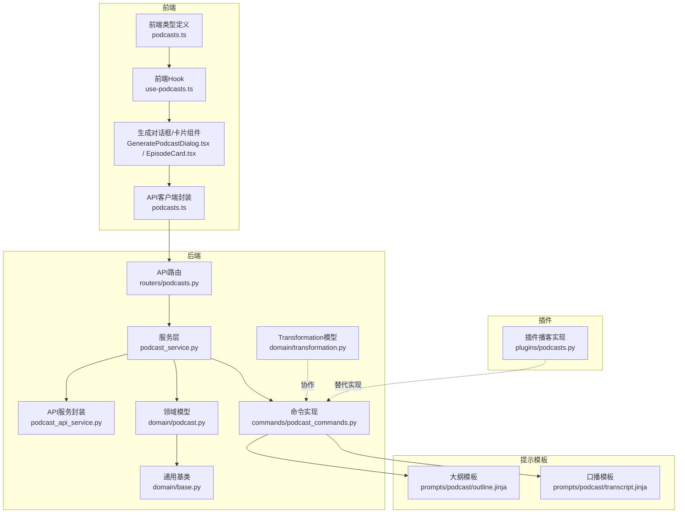
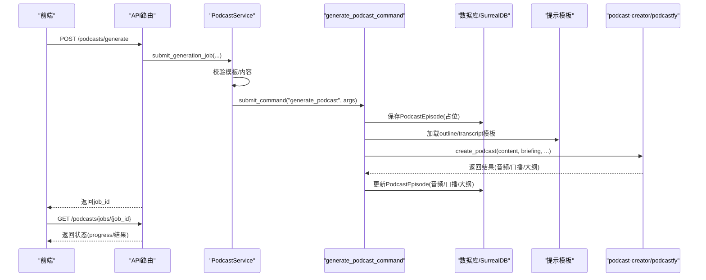
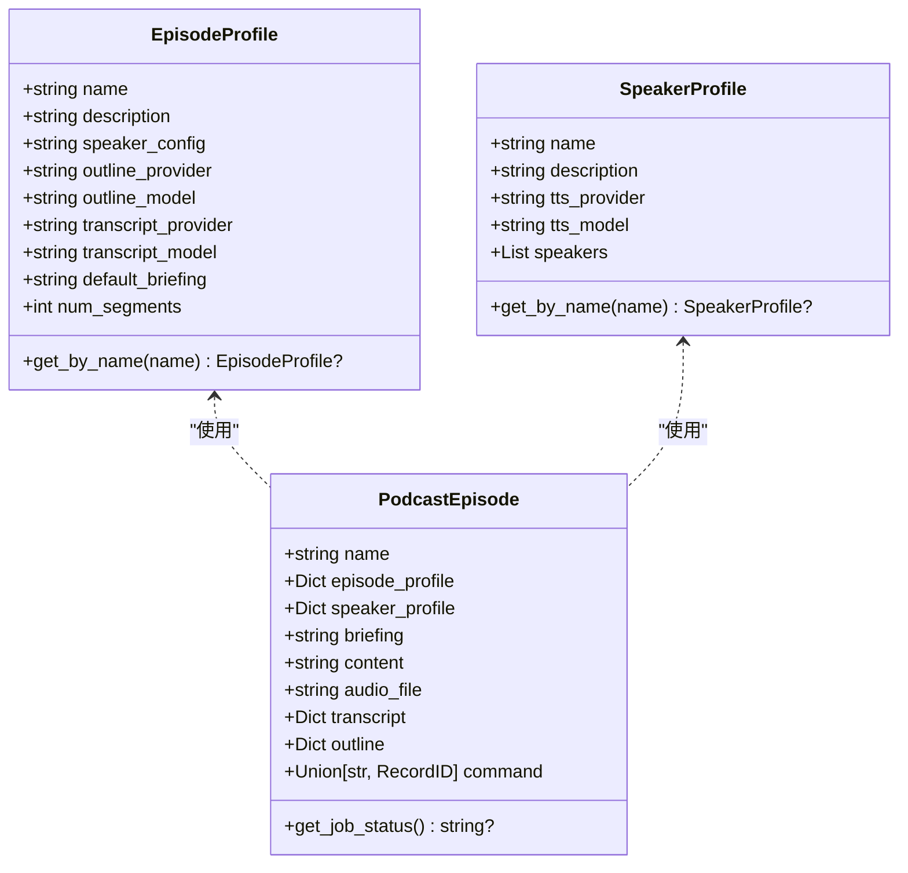
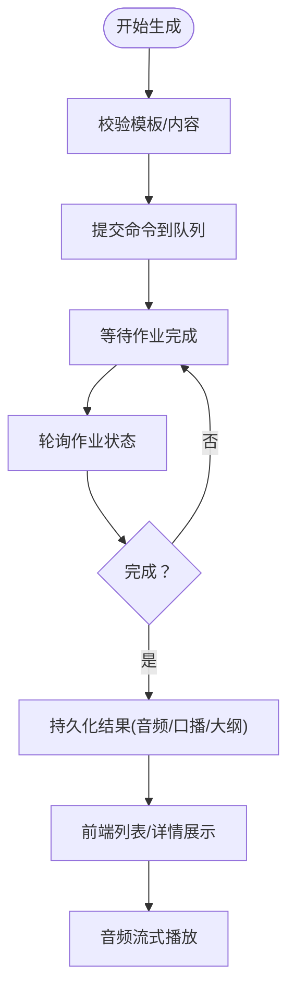
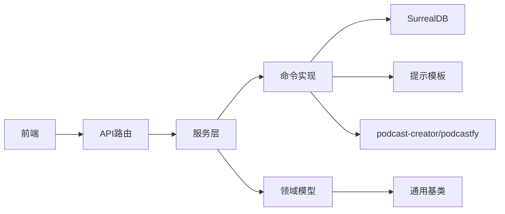

# 播客生成模型

<cite>
**本文引用的文件**
- [domain/podcast.py](file://open_notebook/domain/podcast.py)
- [plugins/podcasts.py](file://open_notebook/plugins/podcasts.py)
- [podcast_service.py](file://api/podcast_service.py)
- [podcast_api_service.py](file://api/podcast_api_service.py)
- [podcast_commands.py](file://commands/podcast_commands.py)
- [routers/podcasts.py](file://api/routers/podcasts.py)
- [base.py](file://open_notebook/domain/base.py)
- [outline.jinja](file://prompts/podcast/outline.jinja)
- [transcript.jinja](file://prompts/podcast/transcript.jinja)
- [transformation.py](file://open_notebook/domain/transformation.py)
- [podcasts.md](file://docs/features/podcasts.md)
- [architecture.md](file://docs/development/architecture.md)
- [episode_profiles.py](file://api/routers/episode_profiles.py)
- [podcasts.ts](file://frontend/src/lib/types/podcasts.ts)
- [use-podcasts.ts](file://frontend/src/lib/hooks/use-podcasts.ts)
- [GeneratePodcastDialog.tsx](file://frontend/src/components/podcasts/GeneratePodcastDialog.tsx)
- [EpisodeCard.tsx](file://frontend/src/components/podcasts/EpisodeCard.tsx)
- [podcasts.ts](file://frontend/src/lib/api/podcasts.ts)
</cite>

## 目录
1. [简介](#简介)
2. [项目结构](#项目结构)
3. [核心组件](#核心组件)
4. [架构总览](#架构总览)
5. [详细组件分析](#详细组件分析)
6. [依赖关系分析](#依赖关系分析)
7. [性能考量](#性能考量)
8. [故障排查指南](#故障排查指南)
9. [结论](#结论)
10. [附录](#附录)

## 简介
本文件系统化梳理播客（Podcast）领域模型及其生成流水线，重点阐述以下方面：
- 多说话人对话生成的设计：通过“播客模板/剧集配置”和“说话人配置”解耦内容生成与声音表现，支持1-4位说话人。
- 核心领域对象：播客剧集、剧集模板（EpisodeProfile）、说话人模板（SpeakerProfile），以及与提示模板（prompts/podcast/*）协同的工作流。
- 生成流程与状态管理：基于异步命令队列（surreal-commands）提交后台任务，前端轮询状态并展示进度。
- 插件系统扩展性：提供可替换的播客生成实现（如 podcastfy/podcast-creator），通过领域对象封装生成逻辑，便于替换与扩展。
- 与Transformation模型的协作：播客生成流程中可复用Transformation的提示模板能力，实现内容预处理或后处理。

## 项目结构
播客功能横跨后端领域层、服务层、命令层、API路由层、前端类型与UI组件，以及提示模板目录。下图概览了主要模块与交互关系。

图表来源
- [routers/podcasts.py](file://api/routers/podcasts.py#L1-L232)
- [podcast_service.py](file://api/podcast_service.py#L1-L207)
- [podcast_commands.py](file://commands/podcast_commands.py#L1-L188)
- [domain/podcast.py](file://open_notebook/domain/podcast.py#L1-L149)
- [base.py](file://open_notebook/domain/base.py#L1-L330)
- [outline.jinja](file://prompts/podcast/outline.jinja#L1-L84)
- [transcript.jinja](file://prompts/podcast/transcript.jinja#L1-L100)
- [podcast_api_service.py](file://api/podcast_api_service.py#L1-L126)
- [plugins/podcasts.py](file://open_notebook/plugins/podcasts.py#L1-L294)
- [transformation.py](file://open_notebook/domain/transformation.py#L1-L22)
- [podcasts.ts](file://frontend/src/lib/types/podcasts.ts#L1-L71)
- [use-podcasts.ts](file://frontend/src/lib/hooks/use-podcasts.ts#L346-L369)
- [GeneratePodcastDialog.tsx](file://frontend/src/components/podcasts/GeneratePodcastDialog.tsx#L71-L100)
- [EpisodeCard.tsx](file://frontend/src/components/podcasts/EpisodeCard.tsx#L143-L189)
- [podcasts.ts](file://frontend/src/lib/api/podcasts.ts#L1-L113)

章节来源
- [routers/podcasts.py](file://api/routers/podcasts.py#L1-L232)
- [podcast_service.py](file://api/podcast_service.py#L1-L207)
- [podcast_commands.py](file://commands/podcast_commands.py#L1-L188)
- [domain/podcast.py](file://open_notebook/domain/podcast.py#L1-L149)
- [base.py](file://open_notebook/domain/base.py#L1-L330)
- [outline.jinja](file://prompts/podcast/outline.jinja#L1-L84)
- [transcript.jinja](file://prompts/podcast/transcript.jinja#L1-L100)
- [podcast_api_service.py](file://api/podcast_api_service.py#L1-L126)
- [plugins/podcasts.py](file://open_notebook/plugins/podcasts.py#L1-L294)
- [transformation.py](file://open_notebook/domain/transformation.py#L1-L22)
- [podcasts.md](file://docs/features/podcasts.md#L127-L167)
- [architecture.md](file://docs/development/architecture.md#L202-L227)
- [episode_profiles.py](file://api/routers/episode_profiles.py#L90-L99)
- [podcasts.ts](file://frontend/src/lib/types/podcasts.ts#L1-L71)
- [use-podcasts.ts](file://frontend/src/lib/hooks/use-podcasts.ts#L346-L369)
- [GeneratePodcastDialog.tsx](file://frontend/src/components/podcasts/GeneratePodcastDialog.tsx#L71-L100)
- [EpisodeCard.tsx](file://frontend/src/components/podcasts/EpisodeCard.tsx#L143-L189)
- [podcasts.ts](file://frontend/src/lib/api/podcasts.ts#L1-L113)

## 核心组件
- 领域模型
  - EpisodeProfile：剧集模板，包含大纲与口播的AI提供商与模型、默认briefing、段落数等。
  - SpeakerProfile：说话人模板，包含TTS提供商、模型及1-4位说话人的名称、声音ID、背景故事、个性等。
  - PodcastEpisode：播客剧集实体，记录生成元数据、briefing、内容、音频路径、口播与大纲、关联的命令ID等。
- 服务与路由
  - PodcastService：提交生成作业、查询作业状态、列出/获取剧集。
  - API路由：提供生成、状态查询、剧集列表/详情、音频流式返回、删除等接口。
- 命令实现
  - generate_podcast_command：加载模板、配置生成器、调用底层库生成口播与音频，持久化结果。
- 提示模板
  - outline.jinja：根据briefing与上下文生成多段落大纲。
  - transcript.jinja：基于大纲与上下文生成分段口播。
- 插件系统
  - plugins/podcasts.py：提供另一种播客生成实现（podcastfy/podcast-creator），包含配置与生成方法，便于替换。
- Transformation模型
  - 与播客生成流程可协作，用于内容预处理或后处理（例如摘要、结构化输出等）。

章节来源
- [domain/podcast.py](file://open_notebook/domain/podcast.py#L1-L149)
- [podcast_service.py](file://api/podcast_service.py#L1-L207)
- [routers/podcasts.py](file://api/routers/podcasts.py#L1-L232)
- [podcast_commands.py](file://commands/podcast_commands.py#L1-L188)
- [outline.jinja](file://prompts/podcast/outline.jinja#L1-L84)
- [transcript.jinja](file://prompts/podcast/transcript.jinja#L1-L100)
- [plugins/podcasts.py](file://open_notebook/plugins/podcasts.py#L1-L294)
- [transformation.py](file://open_notebook/domain/transformation.py#L1-L22)

## 架构总览
播客生成采用“请求-命令-持久化”的异步流水线：
- 前端发起生成请求，后端立即返回作业ID。
- 后端通过surreal-commands提交命令，命令执行器加载模板与配置，调用底层库生成口播与音频。
- 生成结果写入数据库，前端轮询作业状态并展示结果。

图表来源
- [routers/podcasts.py](file://api/routers/podcasts.py#L40-L83)
- [podcast_service.py](file://api/podcast_service.py#L33-L113)
- [podcast_commands.py](file://commands/podcast_commands.py#L49-L168)
- [outline.jinja](file://prompts/podcast/outline.jinja#L1-L84)
- [transcript.jinja](file://prompts/podcast/transcript.jinja#L1-L100)

## 详细组件分析

### 领域模型与数据结构
- EpisodeProfile
  - 关键字段：模板名、描述、关联的说话人模板名、大纲与口播的提供商/模型、默认briefing、段落数。
  - 校验规则：段落数限制在3-20之间。
  - 查询：按名称检索。
- SpeakerProfile
  - 关键字段：模板名、描述、TTS提供商/模型、说话人数组（1-4个）。
  - 校验规则：每个说话人必须包含名称、声音ID、背景故事、个性。
  - 查询：按名称检索。
- PodcastEpisode
  - 关键字段：名称、使用的模板与说话人配置、briefing、源内容、音频路径、口播、大纲、命令ID。
  - 状态：通过命令ID查询作业状态；若无命令但有音频则视为已完成导入。
  - 数据持久化：重写保存逻辑以确保命令ID为RecordID格式。

图表来源
- [domain/podcast.py](file://open_notebook/domain/podcast.py#L10-L149)

章节来源
- [domain/podcast.py](file://open_notebook/domain/podcast.py#L1-L149)

### 生成流程与状态管理
- 请求入口：/podcasts/generate 接收剧集模板、说话人模板、剧集名、内容或笔记本ID、附加briefing指令。
- 作业提交：PodcastService.submit_generation_job 校验模板存在、解析内容、导入命令模块、提交到surreal-commands，返回job_id。
- 作业状态：/podcasts/jobs/{job_id} 返回状态、结果、错误信息、进度、时间戳等。
- 剧集管理：/podcasts/episodes 列表过滤不完整条目；/podcasts/episodes/{id} 返回详情与音频URL；/podcasts/episodes/{id}/audio 流式返回音频文件；DELETE删除剧集并清理音频文件。
- 前端集成：前端类型定义、生成对话框、状态轮询与音频播放。

图表来源
- [podcast_service.py](file://api/podcast_service.py#L33-L113)
- [routers/podcasts.py](file://api/routers/podcasts.py#L40-L204)
- [podcast_commands.py](file://commands/podcast_commands.py#L120-L168)
- [podcasts.ts](file://frontend/src/lib/types/podcasts.ts#L1-L71)
- [use-podcasts.ts](file://frontend/src/lib/hooks/use-podcasts.ts#L346-L369)
- [EpisodeCard.tsx](file://frontend/src/components/podcasts/EpisodeCard.tsx#L143-L189)

章节来源
- [podcast_service.py](file://api/podcast_service.py#L1-L207)
- [routers/podcasts.py](file://api/routers/podcasts.py#L1-L232)
- [podcast_commands.py](file://commands/podcast_commands.py#L1-L188)
- [podcasts.ts](file://frontend/src/lib/types/podcasts.ts#L1-L71)
- [use-podcasts.ts](file://frontend/src/lib/hooks/use-podcasts.ts#L346-L369)
- [EpisodeCard.tsx](file://frontend/src/components/podcasts/EpisodeCard.tsx#L143-L189)

### 插件系统与扩展性
- 插件实现：plugins/podcasts.py 定义 PodcastConfig/PodcastEpisode，提供 generate_episode 方法，封装不同生成库（podcastfy/podcast-creator）的调用细节。
- 扩展点：命令实现（commands/podcast_commands.py）当前绑定的是 podcast-creator；通过替换命令实现或引入新的命令注册，可接入其他生成引擎。
- 领域对象封装：通过EpisodeProfile/SpeakerProfile/PodcastEpisode统一抽象，使上层API与前端无需关心底层生成库差异。

章节来源
- [plugins/podcasts.py](file://open_notebook/plugins/podcasts.py#L1-L294)
- [podcast_commands.py](file://commands/podcast_commands.py#L1-L188)

### 与Transformation模型的协作
- Transformation模型：定义名称、标题、描述、提示词、是否默认应用等字段，支持全局默认提示指令记录。
- 协作方式：播客生成流程中可复用Transformation的提示模板能力，用于：
  - 内容预处理：将笔记内容转换为更适配播客生成的结构化输入。
  - 结果后处理：对生成的口播进行二次提炼、结构化输出或质量评估。
- 实现建议：在命令执行前后，调用Transformation服务对内容进行加工，或在生成完成后对口播进行进一步处理。

章节来源
- [transformation.py](file://open_notebook/domain/transformation.py#L1-L22)
- [podcast_commands.py](file://commands/podcast_commands.py#L120-L168)

### 提示模板（Prompts）与生成逻辑
- outline.jinja：根据briefing与上下文生成多段落大纲，控制段落数量与每段大小。
- transcript.jinja：基于大纲与上下文生成分段口播，约束对话轮次与说话人选择。
- 模板变量：briefing、context、speakers、num_segments、speaker_names、turns、is_final、format_instructions等。

章节来源
- [outline.jinja](file://prompts/podcast/outline.jinja#L1-L84)
- [transcript.jinja](file://prompts/podcast/transcript.jinja#L1-L100)

### 前端集成与用户体验
- 类型定义：EpisodeProfile/SpeakerProfile/PodcastEpisode/GenerationRequest/Response 的类型映射。
- 生成对话框：选择剧集模板、说话人模板、输入剧集名与附加指令，触发生成。
- 状态轮询：生成成功后自动刷新列表，显示作业状态与音频URL。
- 音频播放：支持受保护资源的鉴权拉取与本地blob播放。

章节来源
- [podcasts.ts](file://frontend/src/lib/types/podcasts.ts#L1-L71)
- [GeneratePodcastDialog.tsx](file://frontend/src/components/podcasts/GeneratePodcastDialog.tsx#L71-L100)
- [use-podcasts.ts](file://frontend/src/lib/hooks/use-podcasts.ts#L346-L369)
- [EpisodeCard.tsx](file://frontend/src/components/podcasts/EpisodeCard.tsx#L143-L189)
- [podcasts.ts](file://frontend/src/lib/api/podcasts.ts#L1-L113)

## 依赖关系分析
- 组件耦合
  - API路由依赖服务层；服务层依赖领域模型与命令注册；命令实现依赖提示模板与底层库。
  - 前端类型与UI组件依赖API封装与状态类型。
- 外部依赖
  - surreal-commands：作业提交与状态查询。
  - podcast-creator/podcastfy：实际生成口播与音频。
  - SurrealDB：存储模板与剧集数据。
- 循环依赖
  - 当前结构清晰，未发现直接循环依赖；命令实现与领域模型通过导入避免强耦合。

图表来源
- [routers/podcasts.py](file://api/routers/podcasts.py#L1-L232)
- [podcast_service.py](file://api/podcast_service.py#L1-L207)
- [podcast_commands.py](file://commands/podcast_commands.py#L1-L188)
- [domain/podcast.py](file://open_notebook/domain/podcast.py#L1-L149)
- [base.py](file://open_notebook/domain/base.py#L1-L330)

章节来源
- [routers/podcasts.py](file://api/routers/podcasts.py#L1-L232)
- [podcast_service.py](file://api/podcast_service.py#L1-L207)
- [podcast_commands.py](file://commands/podcast_commands.py#L1-L188)
- [domain/podcast.py](file://open_notebook/domain/podcast.py#L1-L149)
- [base.py](file://open_notebook/domain/base.py#L1-L330)

## 性能考量
- 异步处理：生成过程完全异步，避免阻塞前端与后端主线程。
- 模板渲染：提示模板在命令执行阶段渲染，建议控制上下文长度以减少token消耗。
- I/O优化：音频文件采用流式传输，避免一次性加载大文件。
- 并发与重试：命令系统支持重试与错误恢复，建议在失败时提供用户反馈与重试入口。
- 存储与索引：EpisodeProfile/SpeakerProfile作为轻量配置，PodcastEpisode仅存必要字段，避免冗余存储。

[本节为通用指导，不直接分析具体文件]

## 故障排查指南
- 常见问题
  - 无法提交作业：检查命令模块导入、模板是否存在、内容是否提供。
  - 作业状态异常：确认surreal-commands可用，查看日志与错误消息。
  - 生成失败：关注Invalid json output/Expecting value等错误提示，尝试更换模型。
  - 音频不可播放：确认音频文件存在且路径正确，前端鉴权头设置。
- 排查步骤
  - 查看API返回的错误信息与作业状态。
  - 在命令实现中定位异常堆栈，检查模板变量与上下文。
  - 确认底层库版本与配置项（provider/model/voices）。
  - 检查数据库连接与表结构（episode_profile/speaker_profile/episode）。

章节来源
- [podcast_service.py](file://api/podcast_service.py#L114-L139)
- [podcast_commands.py](file://commands/podcast_commands.py#L169-L188)
- [routers/podcasts.py](file://api/routers/podcasts.py#L181-L204)
- [podcasts.md](file://docs/features/podcasts.md#L127-L167)

## 结论
该播客生成模型通过“模板+配置+领域对象+提示模板+命令队列”的组合，实现了可扩展、可替换、可追踪的多说话人对话生成体系。EpisodeProfile/SpeakerProfile将内容与声音解耦，PodcastEpisode承载生成生命周期，命令实现封装底层生成逻辑，前端提供流畅的交互体验。与Transformation模型的协作进一步提升了内容加工的灵活性。未来可在命令层引入更多生成引擎、增强错误恢复与可观测性，持续优化生成质量与用户体验。

[本节为总结性内容，不直接分析具体文件]

## 附录

### 表结构参考（来自架构文档）
- episode_profile：包含模板名、描述、speaker_config、outline_provider、outline_model、transcript_provider、transcript_model、default_briefing、num_segments等字段。
- transformation：用于Transformation模型的表结构定义（与播客生成相关联）。

章节来源
- [architecture.md](file://docs/development/architecture.md#L202-L227)
- [transformation.py](file://open_notebook/domain/transformation.py#L1-L22)

### 剧集模板与说话人配置的API定义
- EpisodeProfileCreate：用于创建/更新剧集模板的请求体字段。
- 前端类型：EpisodeProfile/SpeakerProfile/PodcastEpisode等类型定义。

章节来源
- [episode_profiles.py](file://api/routers/episode_profiles.py#L90-L99)
- [podcasts.ts](file://frontend/src/lib/types/podcasts.ts#L1-L71)