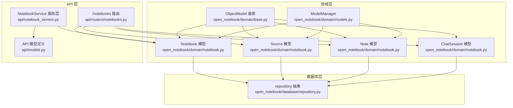
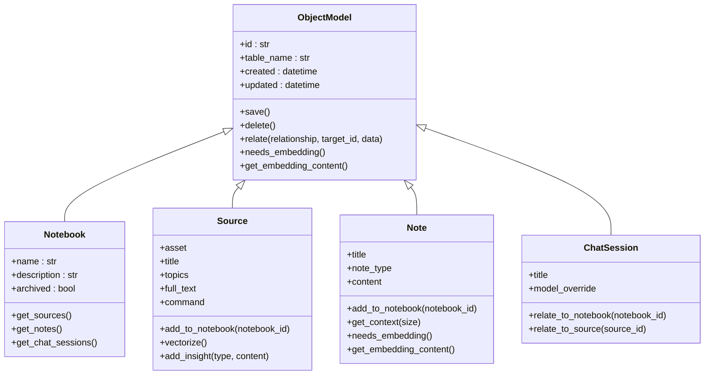
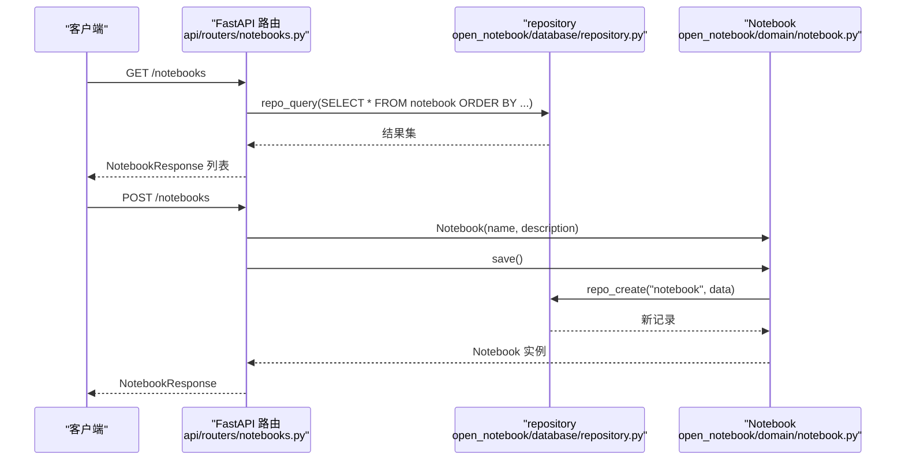
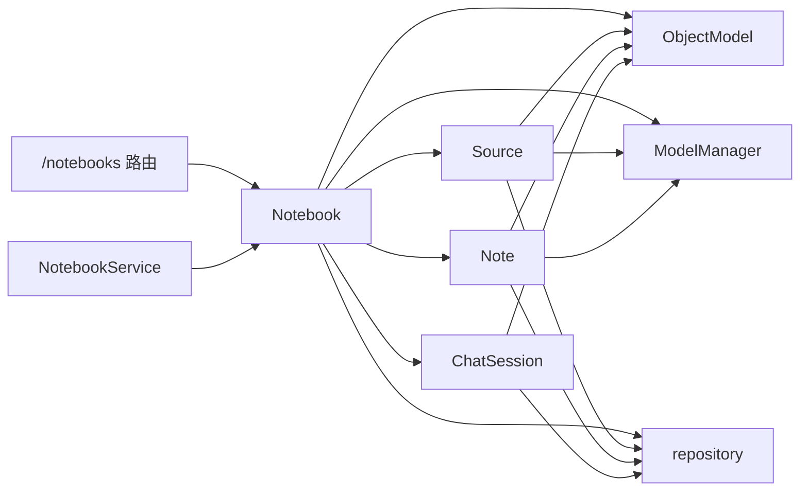

# 笔记本模型

<cite>
**本文引用的文件列表**
- [open_notebook/domain/notebook.py](file://open_notebook/domain/notebook.py)
- [open_notebook/domain/base.py](file://open_notebook/domain/base.py)
- [open_notebook/domain/models.py](file://open_notebook/domain/models.py)
- [open_notebook/database/repository.py](file://open_notebook/database/repository.py)
- [api/routers/notebooks.py](file://api/routers/notebooks.py)
- [api/notebook_service.py](file://api/notebook_service.py)
- [api/models.py](file://api/models.py)
- [tests/test_domain.py](file://tests/test_domain.py)
</cite>

## 目录
1. [简介](#简介)
2. [项目结构](#项目结构)
3. [核心组件](#核心组件)
4. [架构总览](#架构总览)
5. [详细组件分析](#详细组件分析)
6. [依赖关系分析](#依赖关系分析)
7. [性能考量](#性能考量)
8. [故障排查指南](#故障排查指南)
9. [结论](#结论)
10. [附录](#附录)

## 简介
本文件面向“笔记本领域模型”的全面文档，聚焦于 Notebook 类的设计与实现，系统阐述其属性结构、核心方法、业务规则、继承自 BaseEntity 的实现细节，以及如何通过聚合根模式维护业务一致性。同时，结合代码片段路径说明 Notebook 与 Source、Note 等其他领域模型的关系，并给出 UML 图示与服务层使用模式、持久化策略说明，帮助读者从概念到实现逐层理解。

## 项目结构
- 领域层：定义对象模型与通用基类，负责数据结构、校验、持久化接口与关系操作。
- API 层：提供 REST 接口，封装对领域模型的调用，返回标准化响应模型。
- 数据库层：通过 repository 抽象与 SurrealDB 交互，提供查询、创建、更新、删除、关系建立等能力。

图表来源
- [open_notebook/domain/notebook.py](file://open_notebook/domain/notebook.py#L1-L120)
- [open_notebook/domain/base.py](file://open_notebook/domain/base.py#L1-L206)
- [open_notebook/domain/models.py](file://open_notebook/domain/models.py#L1-L199)
- [api/routers/notebooks.py](file://api/routers/notebooks.py#L1-L276)
- [api/notebook_service.py](file://api/notebook_service.py#L1-L87)
- [api/models.py](file://api/models.py#L1-L120)
- [open_notebook/database/repository.py](file://open_notebook/database/repository.py#L1-L177)

章节来源
- [open_notebook/domain/notebook.py](file://open_notebook/domain/notebook.py#L1-L120)
- [open_notebook/domain/base.py](file://open_notebook/domain/base.py#L1-L206)
- [open_notebook/database/repository.py](file://open_notebook/database/repository.py#L1-L177)
- [api/routers/notebooks.py](file://api/routers/notebooks.py#L1-L276)
- [api/notebook_service.py](file://api/notebook_service.py#L1-L87)
- [api/models.py](file://api/models.py#L1-L120)

## 核心组件
- Notebook：笔记本聚合根，负责名称、描述、归档状态等属性；提供获取关联 Source、Note、ChatSession 的方法；支持通过 relate 建立与 Source/Note 的引用关系。
- ObjectModel：所有领域模型的基类，提供统一的 CRUD、关系建立、嵌入生成、时间字段解析等能力。
- ModelManager：模型管理器，负责默认模型配置与按类型获取模型实例。
- repository：数据库访问抽象，封装连接、查询、创建、更新、删除、关系建立等操作。
- API 路由与服务：提供笔记本的增删改查、关联 Source、删除关联等接口；NotebookService 提供基于 API 的笔记本操作封装。

章节来源
- [open_notebook/domain/notebook.py](file://open_notebook/domain/notebook.py#L1-L120)
- [open_notebook/domain/base.py](file://open_notebook/domain/base.py#L1-L206)
- [open_notebook/domain/models.py](file://open_notebook/domain/models.py#L1-L199)
- [open_notebook/database/repository.py](file://open_notebook/database/repository.py#L1-L177)
- [api/routers/notebooks.py](file://api/routers/notebooks.py#L1-L276)
- [api/notebook_service.py](file://api/notebook_service.py#L1-L87)

## 架构总览
下图展示了 Notebook 作为聚合根与其子实体（Source、Note、ChatSession）之间的关系，以及 API 层如何通过路由与服务层调用领域模型。

图表来源
- [open_notebook/domain/base.py](file://open_notebook/domain/base.py#L1-L206)
- [open_notebook/domain/notebook.py](file://open_notebook/domain/notebook.py#L1-L120)

## 详细组件分析

### Notebook 类设计与实现
- 继承关系：Notebook 继承自 ObjectModel，复用统一的保存、删除、关系建立与嵌入生成逻辑。
- 属性结构：
  - 名称与描述：用于用户识别与说明。
  - 归档标记：默认 False，支持过滤与排序。
- 核心方法：
  - 获取关联资源：get_sources、get_notes、get_chat_sessions，均通过 repo_query 执行数据库查询并返回强类型的领域对象列表。
  - 关联管理：通过 relate 方法建立与 Source/Note 的引用关系（例如 add_to_notebook），实现聚合边界内的业务一致性。
- 业务规则：
  - 名称非空校验：通过 field_validator 确保创建/更新时名称不为空白。
  - 归档状态：默认 False，可通过更新接口切换。
- 与聚合根模式的关系：
  - Notebook 作为聚合根，持有对 Source、Note、ChatSession 的引用集合；通过 get_* 方法在读取侧聚合这些实体，确保跨实体的一致性视图。
  - 通过 relate 建立引用关系，保证引用的存在性与幂等性（例如添加 Source 到 Notebook 的路由中包含存在性检查与幂等处理）。

章节来源
- [open_notebook/domain/notebook.py](file://open_notebook/domain/notebook.py#L1-L120)
- [open_notebook/domain/base.py](file://open_notebook/domain/base.py#L1-L206)

### Source 类设计与实现
- 属性结构：
  - 资产信息、标题、主题、全文内容、命令引用（指向后台任务）。
- 核心方法：
  - 获取处理状态与进度：get_status、get_processing_progress，基于 surreal-commands 的命令状态查询。
  - 上下文构建：get_context，根据长/短上下文返回不同字段集。
  - 嵌入块计数：get_embedded_chunks，统计向量化分块数量。
  - 溯源洞察：get_insights，返回该 Source 的洞察列表。
  - 关联管理：add_to_notebook，将 Source 关联到指定 Notebook。
  - 向量化：vectorize，提交后台作业进行文本分块与嵌入生成。
  - 新增洞察：add_insight，基于默认嵌入模型生成向量并写入数据库。
- 字段解析：
  - command 字段解析为 RecordID，id 字段解析为字符串，确保数据库存储格式一致。

章节来源
- [open_notebook/domain/notebook.py](file://open_notebook/domain/notebook.py#L144-L351)
- [open_notebook/domain/models.py](file://open_notebook/domain/models.py#L1-L199)

### Note 类设计与实现
- 属性结构：
  - 标题、类型（人类/AI）、内容。
- 核心方法：
  - 关联管理：add_to_notebook，将 Note 关联到指定 Notebook。
  - 上下文构建：get_context，支持长/短上下文返回不同字段集。
  - 嵌入启用：needs_embedding 返回 True，默认参与向量化；get_embedding_content 返回内容字段。
- 业务规则：
  - 内容非空校验：通过 field_validator 确保内容不为空白字符串。

章节来源
- [open_notebook/domain/notebook.py](file://open_notebook/domain/notebook.py#L353-L405)
- [tests/test_domain.py](file://tests/test_domain.py#L128-L160)

### ChatSession 类设计与实现
- 属性结构：
  - 标题、模型覆盖。
- 核心方法：
  - 关联管理：relate_to_notebook、relate_to_source，分别将会话与 Notebook 或 Source 建立引用关系。

章节来源
- [open_notebook/domain/notebook.py](file://open_notebook/domain/notebook.py#L390-L405)

### API 使用模式与持久化策略
- API 路由：
  - 列表与详情：支持按归档状态过滤与排序，返回带 source_count、note_count 的聚合统计。
  - 创建/更新/删除：通过 Notebook.save/delete 完成持久化；更新时仅更新提供的字段。
  - 关联管理：提供添加/移除 Source 到 Notebook 的端点，内部执行存在性检查与幂等处理。
- 服务层：
  - NotebookService 封装 API 调用，将响应转换为领域对象，便于前端或上层逻辑直接使用。
- 持久化策略：
  - 通过 repository 抽象与 SurrealDB 交互，统一处理连接、查询、创建、更新、删除、关系建立。
  - ObjectModel.save 在保存前进行验证与嵌入生成（若启用），并在更新时保留 created 时间戳。

图表来源
- [api/routers/notebooks.py](file://api/routers/notebooks.py#L1-L120)
- [open_notebook/database/repository.py](file://open_notebook/database/repository.py#L85-L127)
- [open_notebook/domain/notebook.py](file://open_notebook/domain/notebook.py#L1-L120)

章节来源
- [api/routers/notebooks.py](file://api/routers/notebooks.py#L1-L276)
- [api/notebook_service.py](file://api/notebook_service.py#L1-L87)
- [open_notebook/database/repository.py](file://open_notebook/database/repository.py#L1-L177)
- [open_notebook/domain/notebook.py](file://open_notebook/domain/notebook.py#L1-L120)

## 依赖关系分析
- Notebook 依赖 ObjectModel 提供的统一保存、删除、关系建立与嵌入生成能力。
- Notebook 与 Source、Note、ChatSession 共同构成笔记本聚合，彼此通过关系边（reference/artifact/refers_to）相互引用。
- API 路由依赖 Notebook 与 Source 的领域方法完成业务操作；服务层 NotebookService 依赖 API 客户端。
- ModelManager 为 Source/Note 的嵌入生成提供默认嵌入模型。

图表来源
- [open_notebook/domain/notebook.py](file://open_notebook/domain/notebook.py#L1-L120)
- [open_notebook/domain/base.py](file://open_notebook/domain/base.py#L1-L206)
- [open_notebook/domain/models.py](file://open_notebook/domain/models.py#L1-L199)
- [open_notebook/database/repository.py](file://open_notebook/database/repository.py#L1-L177)
- [api/routers/notebooks.py](file://api/routers/notebooks.py#L1-L276)
- [api/notebook_service.py](file://api/notebook_service.py#L1-L87)

章节来源
- [open_notebook/domain/notebook.py](file://open_notebook/domain/notebook.py#L1-L120)
- [open_notebook/domain/base.py](file://open_notebook/domain/base.py#L1-L206)
- [open_notebook/domain/models.py](file://open_notebook/domain/models.py#L1-L199)
- [open_notebook/database/repository.py](file://open_notebook/database/repository.py#L1-L177)
- [api/routers/notebooks.py](file://api/routers/notebooks.py#L1-L276)
- [api/notebook_service.py](file://api/notebook_service.py#L1-L87)

## 性能考量
- 异步查询与关系建立：领域模型与 API 路由均采用异步调用，减少阻塞。
- 嵌入生成：在保存 Notebook/Note 时可自动计算嵌入，但需考虑模型调用成本与并发控制。
- 查询裁剪：get_sources、get_notes 对返回字段进行裁剪（如 omit full_text、content、embedding），降低网络与序列化开销。
- 幂等与存在性检查：添加 Source 到 Notebook 的路由先查询是否存在引用，避免重复创建，提高稳定性与性能。

章节来源
- [open_notebook/domain/notebook.py](file://open_notebook/domain/notebook.py#L29-L87)
- [api/routers/notebooks.py](file://api/routers/notebooks.py#L183-L226)

## 故障排查指南
- 输入校验错误：
  - Notebook 名称为空或仅空白字符：抛出 InvalidInputError。
  - Note 内容为空或仅空白字符：抛出 InvalidInputError。
- 数据库操作异常：
  - 查询/创建/更新/删除失败：抛出 DatabaseOperationError，并记录异常堆栈以便定位。
  - 关系建立失败：抛出 DatabaseOperationError，检查关系名与目标 ID 是否有效。
- 处理状态与进度：
  - Source 的命令状态查询失败时返回未知状态，建议检查 surreal-commands 服务可用性与命令 ID 正确性。
- 单元测试参考：
  - Notebook 名称与归档标志的验证逻辑。
  - Note 内容校验与嵌入启用行为。
  - Source 的命令字段解析与保存数据准备。

章节来源
- [tests/test_domain.py](file://tests/test_domain.py#L73-L160)
- [open_notebook/domain/notebook.py](file://open_notebook/domain/notebook.py#L1-L120)
- [open_notebook/domain/base.py](file://open_notebook/domain/base.py#L112-L167)

## 结论
Notebook 作为笔记本聚合根，通过 ObjectModel 提供的统一能力与 API 路由/服务层的封装，实现了对 Source、Note、ChatSession 的聚合管理与一致性维护。其属性与方法清晰地体现了领域驱动设计中的聚合根职责：定义边界、维护不变式、提供稳定的查询与变更接口。配合幂等与存在性检查、字段裁剪与异步处理，系统在功能完整性与性能之间取得了良好平衡。

## 附录
- API 模型定义：NotebookCreate、NotebookUpdate、NotebookResponse 等，用于路由层与服务层的数据契约。
- 搜索能力：提供文本搜索与向量搜索辅助函数，便于在笔记本上下文中检索相关内容。

章节来源
- [api/models.py](file://api/models.py#L1-L120)
- [open_notebook/domain/notebook.py](file://open_notebook/domain/notebook.py#L406-L457)