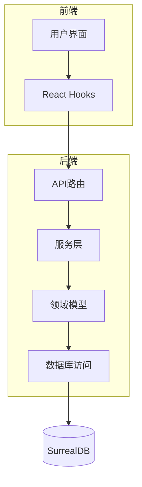
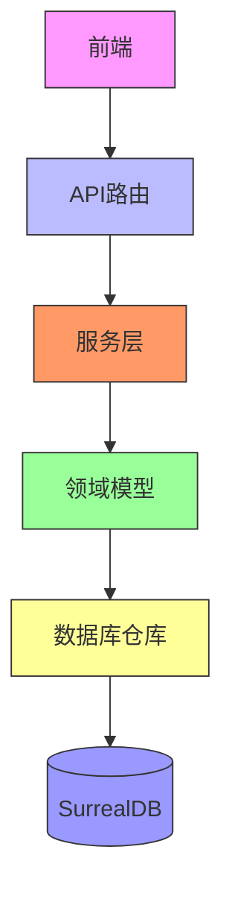
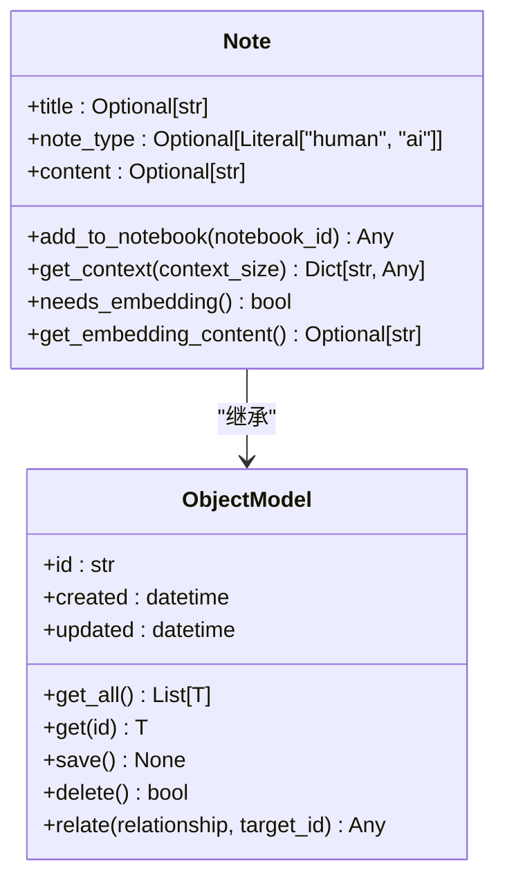
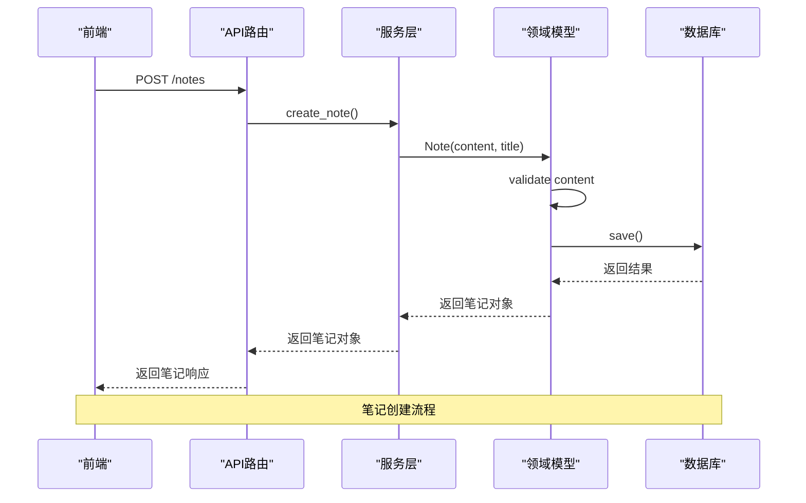
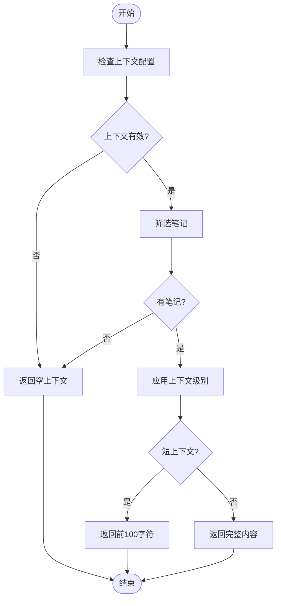
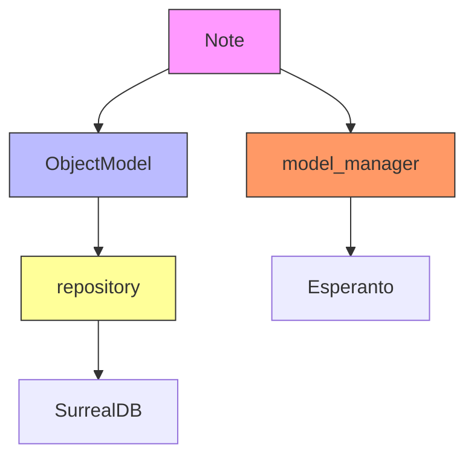

# 笔记模型

<cite>
**本文档中引用的文件**   
- [notebook.py](file://open_notebook/domain/notebook.py)
- [notes.py](file://api/routers/notes.py)
- [notes_service.py](file://api/notes_service.py)
- [models.py](file://open_notebook/domain/models.py)
- [base.py](file://open_notebook/domain/base.py)
- [repository.py](file://open_notebook/database/repository.py)
- [context-management.md](file://docs/features/context-management.md)
- [notes.md](file://docs/user-guide/notes.md)
- [models.py](file://api/models.py)
- [page.tsx](file://frontend/src/app/(dashboard)/notebooks/[id]/page.tsx)
- [use-notes.ts](file://frontend/src/lib/hooks/use-notes.ts)
- [3.surrealql](file://migrations/3.surrealql)
- [4.surrealql](file://migrations/4.surrealql)
- [9.surrealql](file://migrations/9.surrealql)
</cite>

## 目录
1. [简介](#简介)
2. [项目结构](#项目结构)
3. [核心组件](#核心组件)
4. [架构概述](#架构概述)
5. [详细组件分析](#详细组件分析)
6. [依赖分析](#依赖分析)
7. [性能考虑](#性能考虑)
8. [故障排除指南](#故障排除指南)
9. [结论](#结论)
10. [附录](#附录) (如有必要)

## 简介
本文档详细介绍了Open Notebook系统中笔记（Note）领域模型的设计与实现。作为用户生成内容的核心单元，笔记模型支持手动创建、AI辅助生成和上下文集成等多种功能。文档将深入分析笔记的属性设计、存储机制、操作接口以及与AI聊天功能的集成方式，同时探讨其在数据一致性和版本控制方面的处理策略。

## 项目结构
Open Notebook项目的结构清晰地分离了前端、后端和数据访问层。笔记功能主要分布在`api/routers/notes.py`中的API路由、`api/notes_service.py`中的服务层以及`open_notebook/domain/notebook.py`中的领域模型。前端组件位于`frontend/src/app/(dashboard)/notebooks/`目录下，通过React Hooks与后端API进行交互。数据库操作通过SurrealDB实现，相关查询定义在`migrations/`目录的SurrealQL文件中。

**Diagram sources**
- [page.tsx](file://frontend/src/app/(dashboard)/notebooks/[id]/page.tsx)
- [use-notes.ts](file://frontend/src/lib/hooks/use-notes.ts)
- [notes.py](file://api/routers/notes.py)
- [notes_service.py](file://api/notes_service.py)
- [notebook.py](file://open_notebook/domain/notebook.py)
- [repository.py](file://open_notebook/database/repository.py)

**Section sources**
- [notebook.py](file://open_notebook/domain/notebook.py)
- [notes.py](file://api/routers/notes.py)
- [notes_service.py](file://api/notes_service.py)
- [use-notes.ts](file://frontend/src/lib/hooks/use-notes.ts)

## 核心组件
笔记模型的核心是`Note`类，它继承自`ObjectModel`并定义了笔记的基本属性和行为。笔记可以是用户手动创建的，也可以是由AI生成的。每个笔记都包含标题、内容和类型（human/ai）等属性，并支持与笔记本的关联。笔记的创建、读取、更新和删除（CRUD）操作通过API路由暴露给前端，服务层负责协调领域模型和数据访问层之间的交互。

**Section sources**
- [notebook.py](file://open_notebook/domain/notebook.py#L353-L388)
- [notes.py](file://api/routers/notes.py)
- [notes_service.py](file://api/notes_service.py)

## 架构概述
笔记系统的架构采用分层设计，从前端UI到数据库访问形成了清晰的数据流。前端通过React Hooks调用API客户端，API路由处理HTTP请求并调用服务层，服务层使用领域模型执行业务逻辑，最终通过数据库仓库进行数据持久化。这种分层架构确保了关注点分离，提高了代码的可维护性和可测试性。

**Diagram sources**
- [page.tsx](file://frontend/src/app/(dashboard)/notebooks/[id]/page.tsx)
- [use-notes.ts](file://frontend/src/lib/hooks/use-notes.ts)
- [notes.py](file://api/routers/notes.py)
- [notes_service.py](file://api/notes_service.py)
- [notebook.py](file://open_notebook/domain/notebook.py)
- [repository.py](file://open_notebook/database/repository.py)

## 详细组件分析

### 笔记领域模型分析
笔记领域模型是系统的核心，它定义了笔记的属性、行为和与其他实体的关系。`Note`类作为`ObjectModel`的子类，继承了通用的CRUD操作和数据验证功能。笔记可以独立存在，也可以通过`artifact`关系与`Notebook`关联，这种设计既支持笔记的复用，又保持了数据的一致性。

#### 笔记类结构

**Diagram sources**
- [notebook.py](file://open_notebook/domain/notebook.py#L353-L388)
- [base.py](file://open_notebook/domain/base.py#L25-L207)

#### 笔记操作流程

**Diagram sources**
- [notes.py](file://api/routers/notes.py#L48-L95)
- [notes_service.py](file://api/notes_service.py#L50-L73)
- [notebook.py](file://open_notebook/domain/notebook.py#L366-L369)

### 上下文构建与AI集成
笔记模型与AI聊天功能的集成通过上下文管理实现。用户可以为每个笔记选择不同的上下文级别（不包含、仅摘要、完整内容），这些设置决定了笔记在AI对话中的可见性。系统通过`ContextConfig`对象管理这些设置，并在生成AI响应时根据配置筛选相关笔记。

#### 上下文管理流程

**Diagram sources**
- [context-management.md](file://docs/features/context-management.md)
- [page.tsx](file://frontend/src/app/(dashboard)/notebooks/[id]/page.tsx#L47-L94)
- [models.py](file://api/models.py#L364-L386)

### 引用与链接机制
虽然当前版本的笔记系统尚未实现Zettelkasten风格的双向链接，但已为未来的链接功能奠定了基础。笔记可以通过`artifact`关系与笔记本关联，这种设计允许笔记在多个笔记本间共享。未来计划中的链接功能将支持自动关系检测和可视化思维导图，进一步增强知识网络的构建能力。

**Section sources**
- [notebook.py](file://open_notebook/domain/notebook.py#L366-L369)
- [notes.md](file://docs/user-guide/notes.md)
- [notes.py](file://api/routers/notes.py#L79-L86)

## 依赖分析
笔记模型依赖于多个核心组件，包括数据库访问层、模型管理器和上下文服务。`ObjectModel`提供了基础的CRUD操作，`repo_query`和`repo_update`等函数实现了与SurrealDB的交互。`model_manager`负责管理AI模型，为笔记的嵌入生成提供支持。这些依赖关系通过清晰的接口定义，确保了组件间的松耦合。

**Diagram sources**
- [notebook.py](file://open_notebook/domain/notebook.py)
- [base.py](file://open_notebook/domain/base.py)
- [repository.py](file://open_notebook/database/repository.py)
- [models.py](file://open_notebook/domain/models.py)

**Section sources**
- [notebook.py](file://open_notebook/domain/notebook.py)
- [base.py](file://open_notebook/domain/base.py)
- [repository.py](file://open_notebook/database/repository.py)
- [models.py](file://open_notebook/domain/models.py)

## 性能考虑
笔记系统的性能优化主要体现在搜索和向量查询上。系统使用SurrealDB的全文搜索和向量相似度搜索功能，通过`fn::text_search`和`fn::vector_search`函数实现高效的笔记检索。向量搜索特别适用于语义相似性匹配，能够找到与查询内容在意义上相近的笔记，而不仅仅是关键词匹配。

**Section sources**
- [3.surrealql](file://migrations/3.surrealql)
- [4.surrealql](file://migrations/4.surrealql)
- [9.surrealql](file://migrations/9.surrealql)

## 故障排除指南
在使用笔记功能时，可能会遇到一些常见问题。例如，笔记创建失败可能是由于内容为空或数据库连接问题。搜索功能不工作可能是由于向量索引未正确重建。对于这些问题，建议首先检查API日志，确认错误类型，然后根据具体情况采取相应的解决措施，如验证输入数据或重新构建向量索引。

**Section sources**
- [notes.py](file://api/routers/notes.py)
- [notes_service.py](file://api/notes_service.py)
- [repository.py](file://open_notebook/database/repository.py)

## 结论
笔记模型作为Open Notebook系统的核心组件，提供了一个灵活且强大的用户生成内容管理框架。通过清晰的分层架构和模块化设计，系统实现了笔记的创建、管理、搜索和AI集成等功能。未来的开发方向包括增强的链接功能、智能组织和可视化界面，将进一步提升用户的知识管理体验。