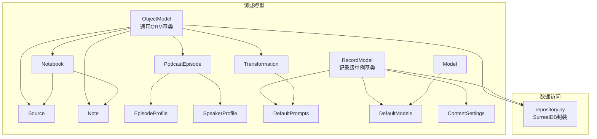
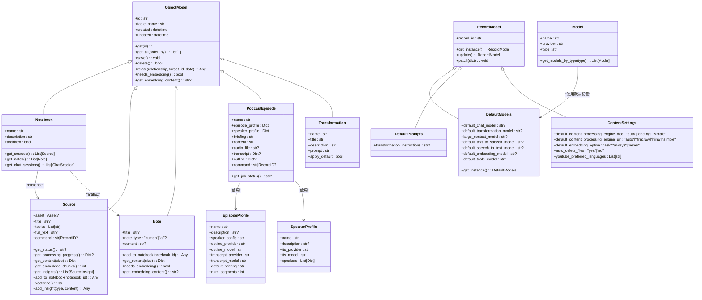
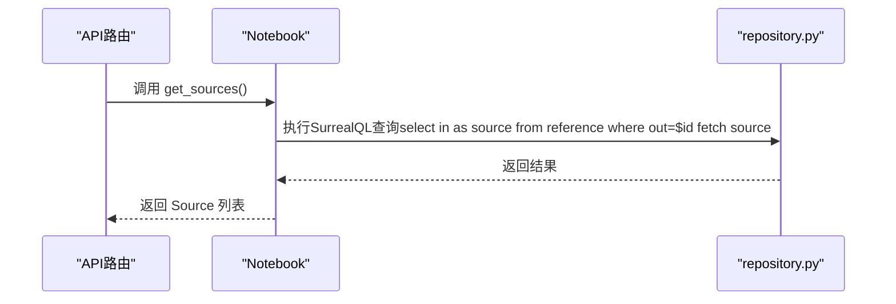
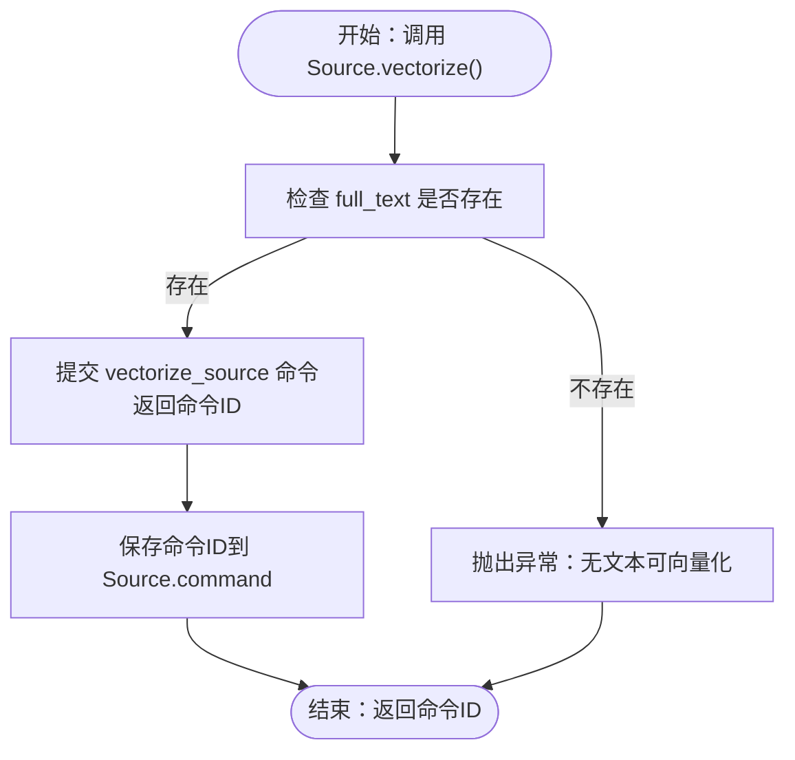
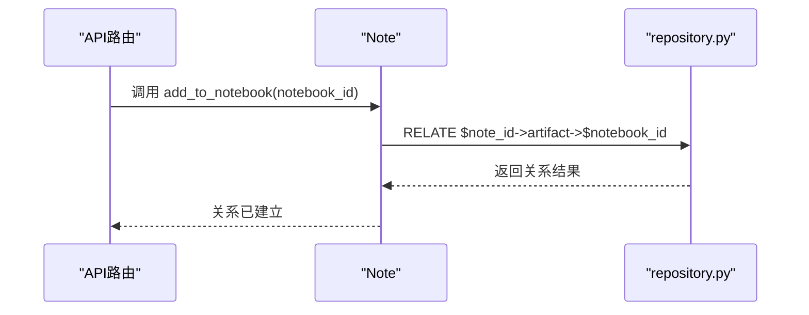
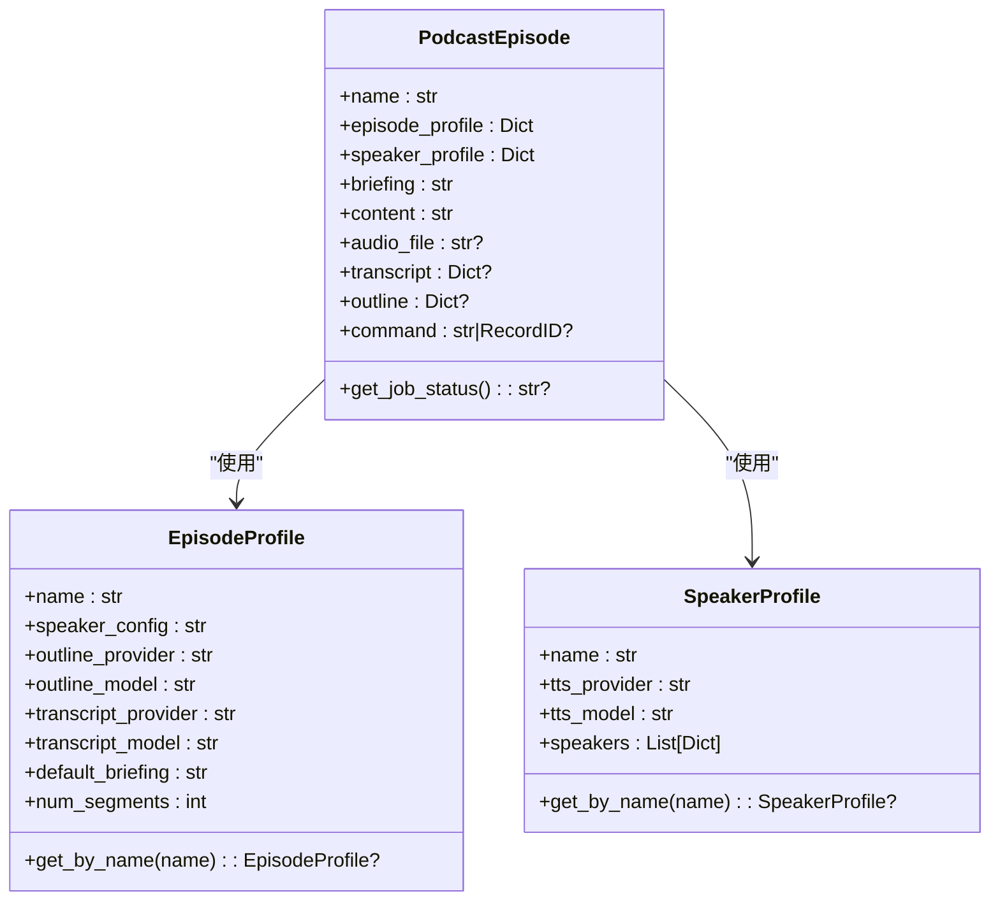
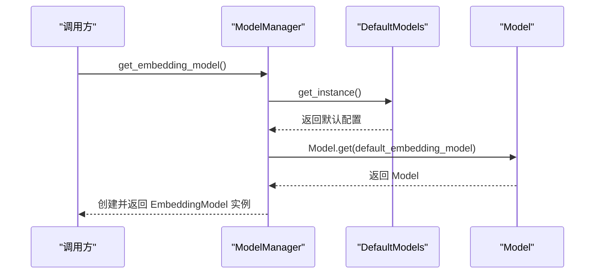
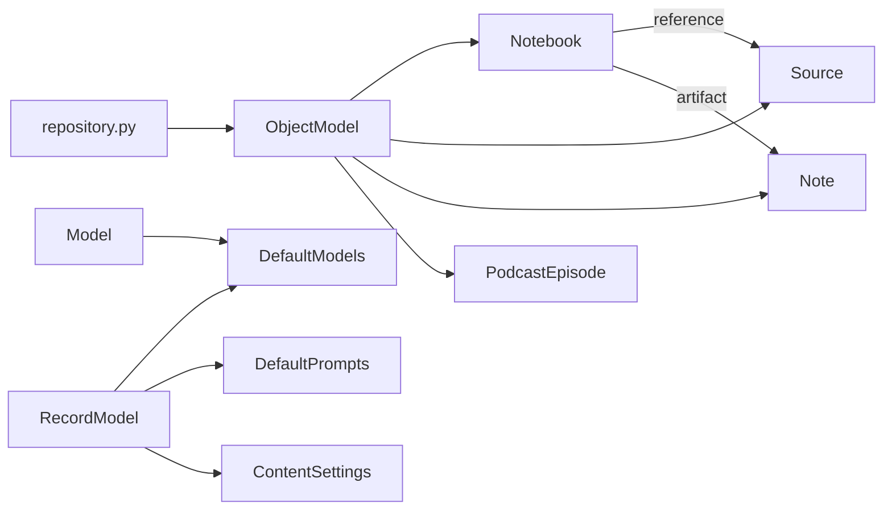

# 领域模型

<cite>
**本文引用的文件**
- [open_notebook/domain/base.py](file://open_notebook/domain/base.py)
- [open_notebook/domain/notebook.py](file://open_notebook/domain/notebook.py)
- [open_notebook/domain/models.py](file://open_notebook/domain/models.py)
- [open_notebook/domain/podcast.py](file://open_notebook/domain/podcast.py)
- [open_notebook/domain/transformation.py](file://open_notebook/domain/transformation.py)
- [open_notebook/domain/content_settings.py](file://open_notebook/domain/content_settings.py)
- [open_notebook/database/repository.py](file://open_notebook/database/repository.py)
- [migrations/1.surrealql](file://migrations/1.surrealql)
- [migrations/2.surrealql](file://migrations/2.surrealql)
- [tests/test_domain.py](file://tests/test_domain.py)
- [api/routers/notebooks.py](file://api/routers/notebooks.py)
- [api/routers/embedding.py](file://api/routers/embedding.py)
</cite>

## 目录
1. [引言](#引言)
2. [项目结构](#项目结构)
3. [核心组件](#核心组件)
4. [架构总览](#架构总览)
5. [详细组件分析](#详细组件分析)
6. [依赖分析](#依赖分析)
7. [性能考量](#性能考量)
8. [故障排查指南](#故障排查指南)
9. [结论](#结论)
10. [附录](#附录)

## 引言
本文件系统化梳理 open-notebook 的领域模型，聚焦于 Notebook、Source、Note、Model、Podcast、Transformation 等核心业务实体，阐明其类结构、属性定义、方法职责与相互关系；解释各模型承载的业务规则与状态转换逻辑；结合 Python 代码片段路径说明实现细节；并提供 UML 类图与关系图以可视化模型结构，讨论模型演进策略与向后兼容性处理方式。

## 项目结构
领域模型位于 open_notebook/domain 下，采用“按领域分层”的组织方式：
- 基类层：ObjectModel、RecordModel 提供统一的数据持久化、关系建立、嵌入生成与记录级单例能力
- 领域实体层：Notebook、Source、Note、Podcast（含 EpisodeProfile、SpeakerProfile）、Transformation、Model、ContentSettings
- 数据访问层：repository.py 封装 SurrealDB 访问，提供查询、创建、更新、删除、关联等操作
- 迁移脚本：migrations/1.surrealql、2.surrealql 定义表结构、索引与全文检索函数

图表来源
- [open_notebook/domain/base.py](file://open_notebook/domain/base.py#L1-L330)
- [open_notebook/domain/notebook.py](file://open_notebook/domain/notebook.py#L1-L457)
- [open_notebook/domain/models.py](file://open_notebook/domain/models.py#L1-L199)
- [open_notebook/domain/podcast.py](file://open_notebook/domain/podcast.py#L1-L149)
- [open_notebook/domain/transformation.py](file://open_notebook/domain/transformation.py#L1-L22)
- [open_notebook/domain/content_settings.py](file://open_notebook/domain/content_settings.py#L1-L26)
- [open_notebook/database/repository.py](file://open_notebook/database/repository.py#L1-L177)

章节来源
- [open_notebook/domain/base.py](file://open_notebook/domain/base.py#L1-L330)
- [open_notebook/domain/notebook.py](file://open_notebook/domain/notebook.py#L1-L457)
- [open_notebook/domain/models.py](file://open_notebook/domain/models.py#L1-L199)
- [open_notebook/domain/podcast.py](file://open_notebook/domain/podcast.py#L1-L149)
- [open_notebook/domain/transformation.py](file://open_notebook/domain/transformation.py#L1-L22)
- [open_notebook/domain/content_settings.py](file://open_notebook/domain/content_settings.py#L1-L26)
- [open_notebook/database/repository.py](file://open_notebook/database/repository.py#L1-L177)
- [migrations/1.surrealql](file://migrations/1.surrealql#L1-L179)
- [migrations/2.surrealql](file://migrations/2.surrealql#L1-L2)

## 核心组件
- ObjectModel：提供 get/get_all/save/delete/relate 等通用 CRUD 与关系操作；自动注入 created/updated 时间戳；在 save 时根据 needs_embedding()/get_embedding_content() 生成向量嵌入；通过 repository.py 与数据库交互
- RecordModel：提供记录级单例行为（同一 record_id 多次实例化返回同一对象），支持异步加载与 upsert 更新
- Notebook：笔记本实体，维护名称、描述、归档标记；可查询关联的 Source、Note、ChatSession；提供文本/向量搜索入口
- Source：信息源实体，包含资产、标题、主题、全文、命令引用等；支持状态查询、上下文构造、嵌入块计数、洞察管理、添加到笔记本、向量化作业提交
- Note：笔记实体，包含标题、类型、内容；默认启用嵌入；支持上下文裁剪
- PodcastEpisode：播客剧集实体，包含配置概要、说话人配置、简报、内容、音频文件、转录、大纲、命令引用；支持作业状态查询
- EpisodeProfile/SpeakerProfile：播客配置档案，简化复杂配置，提供字段校验
- Transformation/DefaultPrompts：转换模板与默认提示词
- Model/DefaultModels：模型注册与默认模型配置
- ContentSettings：内容处理与嵌入选项等全局配置

章节来源
- [open_notebook/domain/base.py](file://open_notebook/domain/base.py#L1-L330)
- [open_notebook/domain/notebook.py](file://open_notebook/domain/notebook.py#L1-L457)
- [open_notebook/domain/models.py](file://open_notebook/domain/models.py#L1-L199)
- [open_notebook/domain/podcast.py](file://open_notebook/domain/podcast.py#L1-L149)
- [open_notebook/domain/transformation.py](file://open_notebook/domain/transformation.py#L1-L22)
- [open_notebook/domain/content_settings.py](file://open_notebook/domain/content_settings.py#L1-L26)

## 架构总览
领域模型通过 ObjectModel/RecordModel 统一抽象，配合 repository.py 实现对 SurrealDB 的访问。Notebook 作为聚合根，通过 reference/artifact 关系连接 Source/Note；PodcastEpisode 通过命令跟踪后台作业；Model/DefaultModels 管理 AI 模型配置；ContentSettings 提供运行时配置。

图表来源
- [open_notebook/domain/base.py](file://open_notebook/domain/base.py#L1-L330)
- [open_notebook/domain/notebook.py](file://open_notebook/domain/notebook.py#L1-L457)
- [open_notebook/domain/models.py](file://open_notebook/domain/models.py#L1-L199)
- [open_notebook/domain/podcast.py](file://open_notebook/domain/podcast.py#L1-L149)
- [open_notebook/domain/transformation.py](file://open_notebook/domain/transformation.py#L1-L22)
- [open_notebook/domain/content_settings.py](file://open_notebook/domain/content_settings.py#L1-L26)

## 详细组件分析

### Notebook（笔记本）
- 职责
  - 管理笔记本元数据（名称、描述、归档）
  - 查询关联资源：Source、Note、ChatSession
  - 提供文本/向量搜索入口
- 关键方法
  - get_sources/get_notes/get_chat_sessions：基于关系查询并返回实体列表
  - text_search/vector_search：调用数据库函数进行全文与向量检索
- 业务规则
  - 名称非空校验（测试覆盖）
  - 归档标志默认 False
- 关系
  - 通过 reference 关联 Source
  - 通过 artifact 关联 Note
  - 通过 refers_to 关联 ChatSession

图表来源
- [open_notebook/domain/notebook.py](file://open_notebook/domain/notebook.py#L29-L87)
- [open_notebook/database/repository.py](file://open_notebook/database/repository.py#L65-L117)

章节来源
- [open_notebook/domain/notebook.py](file://open_notebook/domain/notebook.py#L1-L120)
- [tests/test_domain.py](file://tests/test_domain.py#L73-L97)
- [api/routers/notebooks.py](file://api/routers/notebooks.py#L197-L226)

### Source（信息源）
- 职责
  - 表示外部内容（如文档、网页、音频等）及其元数据
  - 管理处理命令、进度与状态
  - 生成上下文、统计嵌入块数量、管理洞察
  - 支持添加到笔记本、向量化作业提交
- 关键方法
  - get_status/get_processing_progress：查询命令状态与执行元数据
  - get_context：短/长上下文输出
  - get_embedded_chunks：统计嵌入块数量
  - get_insights/add_insight：洞察的增删查
  - add_to_notebook：建立 reference 关系
  - vectorize：提交向量化作业（返回命令ID）
- 业务规则
  - command 字段解析为 RecordID
  - id 解析兼容字符串与 RecordID
  - 向量化前需存在 full_text
- 关系
  - 与 Notebook 通过 reference 关联
  - 与 SourceInsight、SourceEmbedding 一对多

图表来源
- [open_notebook/domain/notebook.py](file://open_notebook/domain/notebook.py#L266-L311)

章节来源
- [open_notebook/domain/notebook.py](file://open_notebook/domain/notebook.py#L144-L351)
- [tests/test_domain.py](file://tests/test_domain.py#L104-L123)
- [api/routers/embedding.py](file://api/routers/embedding.py#L70-L92)

### Note（笔记）
- 职责
  - 存储用户手写或生成的笔记
  - 默认启用嵌入，便于检索
- 关键方法
  - add_to_notebook：建立 artifact 关系
  - get_context：短/长上下文输出
  - needs_embedding/get_embedding_content：嵌入开关与内容提取
- 业务规则
  - 内容不可为空字符串（仅 None 或非空有效）

图表来源
- [open_notebook/domain/notebook.py](file://open_notebook/domain/notebook.py#L366-L369)
- [open_notebook/database/repository.py](file://open_notebook/database/repository.py#L102-L117)

章节来源
- [open_notebook/domain/notebook.py](file://open_notebook/domain/notebook.py#L353-L388)
- [tests/test_domain.py](file://tests/test_domain.py#L128-L159)

### Podcast（播客）
- EpisodeProfile/SpeakerProfile
  - EpisodeProfile：简化播客配置，包含大纲与转录模型、默认简报、段落数等；提供名称唯一性与段落数范围校验
  - SpeakerProfile：支持 1-4 位说话人，要求每人都具备 name、voice_id、backstory、personality 字段
- PodcastEpisode
  - 包含名称、配置概要、说话人配置、简报、内容、音频文件、转录、大纲、命令引用
  - 提供作业状态查询与命令字段 RecordID 解析
- 业务规则
  - 通过字段校验确保配置完整性与一致性

图表来源
- [open_notebook/domain/podcast.py](file://open_notebook/domain/podcast.py#L1-L149)

章节来源
- [open_notebook/domain/podcast.py](file://open_notebook/domain/podcast.py#L1-L149)
- [tests/test_domain.py](file://tests/test_domain.py#L162-L219)

### Transformation（转换）
- 职责
  - 定义可复用的转换模板（名称、标题、描述、提示词、是否应用默认）
  - DefaultPrompts 提供系统默认提示词
- 业务规则
  - 通过 Pydantic 字段约束与默认值保证一致性

章节来源
- [open_notebook/domain/transformation.py](file://open_notebook/domain/transformation.py#L1-L22)

### Model/DefaultModels（模型）
- 职责
  - Model：注册可用模型（名称、提供商、类型）
  - DefaultModels：记录默认模型配置（聊天、转换、大上下文、TTS、STT、嵌入、工具）
  - ModelManager：按类型获取模型实例，支持默认模型解析与类型断言
- 业务规则
  - 类型必须为 language/embedding/speech_to_text/text_to_speech 之一
  - 默认模型缺失时返回 None，调用方需处理

图表来源
- [open_notebook/domain/models.py](file://open_notebook/domain/models.py#L68-L199)

章节来源
- [open_notebook/domain/models.py](file://open_notebook/domain/models.py#L1-L199)

### ContentSettings（内容设置）
- 职责
  - 全局配置项：文档/URL 内容处理引擎、嵌入选项、文件清理策略、YouTube 语言偏好
- 特点
  - 通过 RecordModel 单例缓存，避免重复加载

章节来源
- [open_notebook/domain/content_settings.py](file://open_notebook/domain/content_settings.py#L1-L26)

## 依赖分析
- 对象模型依赖
  - ObjectModel/RecordModel 依赖 repository.py 进行数据库操作
  - Notebook/Source/Note/PodcastEpisode/Transformation 依赖 ObjectModel
  - DefaultModels/DefaultPrompts/ContentSettings 依赖 RecordModel
  - Model 依赖 repository.py 查询模型列表
- 关系与索引
  - migrations/1.surrealql 定义了 source/source_embedding/source_insight/note/notebook 表与 reference/artifact 关系
  - 定义了全文检索与向量相似度函数，支撑 text_search/vector_search
- API 层耦合
  - notebooks 路由与 notebook.get_sources/get_notes/get_chat_sessions 方法直接交互
  - embedding 路由调用 Source.vectorize/Note.save 触发嵌入

图表来源
- [open_notebook/database/repository.py](file://open_notebook/database/repository.py#L1-L177)
- [open_notebook/domain/base.py](file://open_notebook/domain/base.py#L1-L330)
- [open_notebook/domain/notebook.py](file://open_notebook/domain/notebook.py#L1-L457)
- [open_notebook/domain/models.py](file://open_notebook/domain/models.py#L1-L199)
- [migrations/1.surrealql](file://migrations/1.surrealql#L1-L179)

章节来源
- [open_notebook/database/repository.py](file://open_notebook/database/repository.py#L1-L177)
- [migrations/1.surrealql](file://migrations/1.surrealql#L1-L179)
- [api/routers/notebooks.py](file://api/routers/notebooks.py#L197-L226)
- [api/routers/embedding.py](file://api/routers/embedding.py#L70-L92)

## 性能考量
- 嵌入生成
  - ObjectModel.save 在 needs_embedding() 为真时自动生成 embedding，Note 默认启用；Source/NoteInsight 可能触发向量化作业
- 搜索性能
  - migrations/1.surrealql 中定义了全文索引与向量相似度函数，支持高并发检索
- 并发与重试
  - repository.py 对事务冲突抛出 RuntimeError，允许上层重试；避免阻塞式等待
- 后台作业
  - Source.vectorize 使用命令系统提交向量化任务，避免阻塞主流程

章节来源
- [open_notebook/domain/base.py](file://open_notebook/domain/base.py#L112-L167)
- [open_notebook/domain/notebook.py](file://open_notebook/domain/notebook.py#L266-L311)
- [migrations/1.surrealql](file://migrations/1.surrealql#L65-L173)
- [open_notebook/database/repository.py](file://open_notebook/database/repository.py#L65-L117)

## 故障排查指南
- 常见错误与定位
  - InvalidInputError：输入校验失败（如空名称、空内容、空ID）
  - DatabaseOperationError：数据库操作异常（查询/更新/删除失败）
  - NotFoundError：对象未找到
- 排查步骤
  - 校验字段：确认 name/title/content/command 等字段符合约束
  - 检查关系：确认 reference/artifact/refers_to 关系是否存在且正确
  - 检查命令状态：Source/PodcastEpisode 的 command 字段是否有效
  - 检查嵌入：更换嵌入模型后需重建历史内容嵌入
- 单元测试参考
  - Notebook/Source/Note/Podcast/Transformation/ContentSettings 的验证逻辑均在 tests/test_domain.py 中覆盖

章节来源
- [open_notebook/domain/base.py](file://open_notebook/domain/base.py#L1-L330)
- [tests/test_domain.py](file://tests/test_domain.py#L1-L200)

## 结论
open-notebook 的领域模型以 ObjectModel/RecordModel 为核心，围绕 Notebook、Source、Note、Podcast、Transformation、Model/DefaultModels、ContentSettings 构建清晰的业务边界与关系网络。通过数据库迁移脚本定义的表结构、索引与函数，系统实现了高效的全文与向量检索；通过命令系统与后台作业，保障大规模内容处理的可扩展性。建议在模型演进中优先保持向后兼容，对字段变更采用可选字段与默认值策略，并在前端提供明确的迁移提示与重建流程。

## 附录

### 数据库模式与索引（节选）
- 表与字段
  - source：asset、title、topics、full_text、embedding、created、updated
  - source_embedding：source、order、content、embedding
  - source_insight：source、insight_type、content、embedding
  - note：title、summary、content、embedding、created、updated
  - notebook：name、description、archived、created、updated
  - reference：source -> notebook（关系）
  - artifact：note -> notebook（关系）
- 函数
  - fn::text_search：整合标题、全文、洞察与笔记的全文检索
  - fn::vector_search：基于向量余弦相似度的检索

章节来源
- [migrations/1.surrealql](file://migrations/1.surrealql#L1-L179)
- [migrations/2.surrealql](file://migrations/2.surrealql#L1-L2)

### 模型演进与向后兼容策略
- 字段演进
  - 新增字段建议设为可选并提供合理默认值，避免破坏既有记录
  - 对于结构化字段（如 Dict/List），可通过 RecordModel 的任意字段允许策略与校验器共同保障
- 关系演进
  - 新增关系时，先在迁移脚本中定义，再在领域模型中补充查询/关系方法
  - 保持旧关系的兼容期，逐步迁移数据
- 嵌入模型切换
  - 更换嵌入模型后，需重建历史内容嵌入，前端提供重建引导与提示
- API 与前端
  - 对外接口保持语义稳定，新增字段以可选形式提供，避免破坏客户端兼容

章节来源
- [open_notebook/domain/content_settings.py](file://open_notebook/domain/content_settings.py#L1-L26)
- [open_notebook/domain/models.py](file://open_notebook/domain/models.py#L1-L199)
- [frontend/src/app/(dashboard)/models/components/EmbeddingModelChangeDialog.tsx](file://frontend/src/app/(dashboard)/models/components/EmbeddingModelChangeDialog.tsx#L1-L119)
- [frontend/src/app/(dashboard)/advanced/components/RebuildEmbeddings.tsx](file://frontend/src/app/(dashboard)/advanced/components/RebuildEmbeddings.tsx#L310-L323)