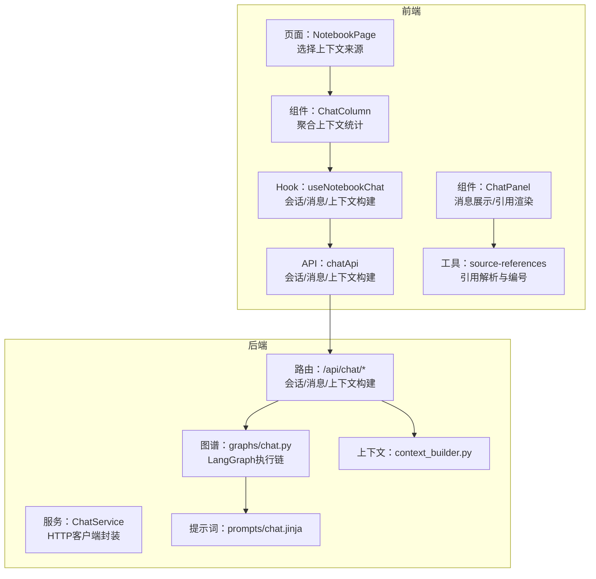
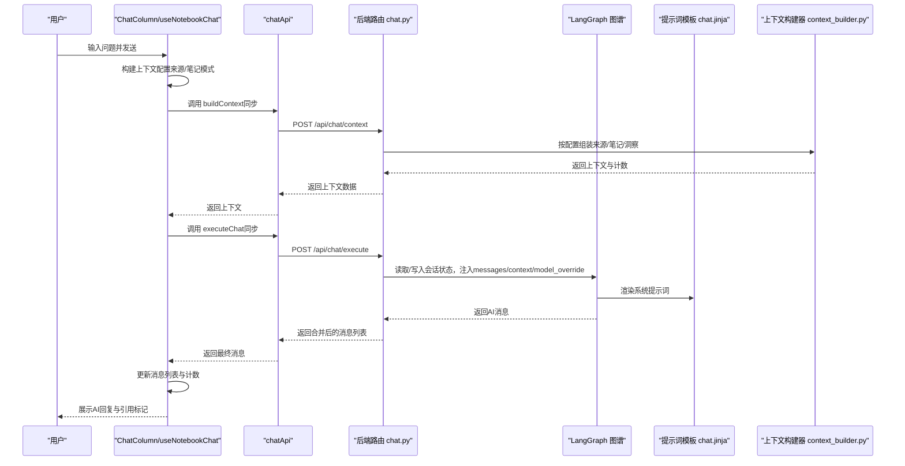
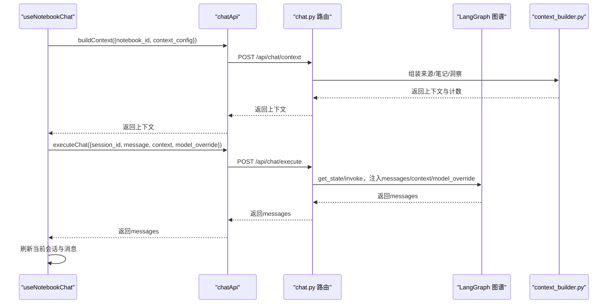
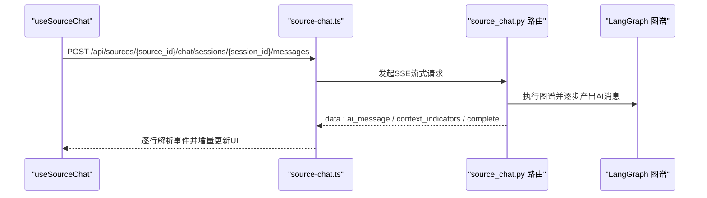
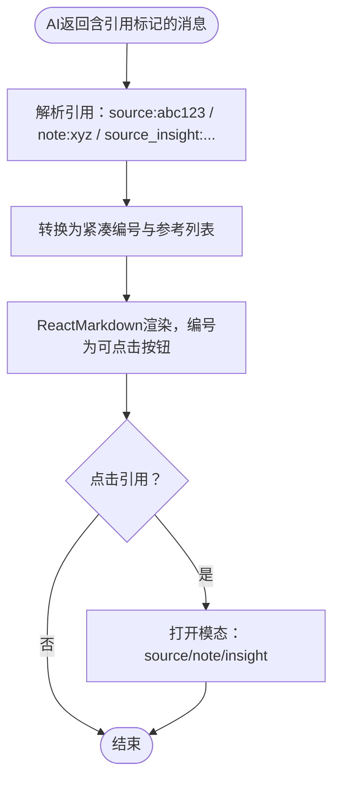
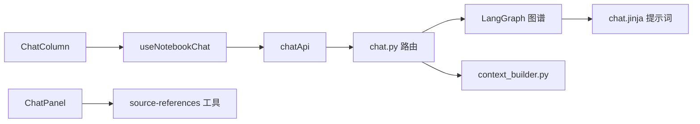

# AI聊天功能

<cite>
**本文引用的文件列表**
- [前端页面：笔记本页](file://frontend/src/app/(dashboard)/notebooks/[id]/page.tsx)
- [前端组件：ChatColumn](file://frontend/src/app/(dashboard)/notebooks/components/ChatColumn.tsx)
- [前端Hook：useNotebookChat](file://frontend/src/lib/hooks/useNotebookChat.ts)
- [前端API：chat.ts](file://frontend/src/lib/api/chat.ts)
- [前端组件：ChatPanel](file://frontend/src/components/source/ChatPanel.tsx)
- [前端工具：引用解析与渲染](file://frontend/src/lib/utils/source-references.tsx)
- [后端路由：chat.py](file://api/routers/chat.py)
- [后端服务：chat_service.py](file://api/chat_service.py)
- [图谱：chat.py（LangGraph）](file://open_notebook/graphs/chat.py)
- [提示词模板：chat.jinja](file://prompts/chat.jinja)
- [上下文构建器：context_builder.py](file://open_notebook/utils/context_builder.py)
- [用户指南：聊天](file://docs/user-guide/chat.md)
- [特性文档：上下文管理](file://docs/features/context-management.md)
</cite>

## 目录
1. [简介](#简介)
2. [项目结构](#项目结构)
3. [核心组件](#核心组件)
4. [架构总览](#架构总览)
5. [详细组件分析](#详细组件分析)
6. [依赖关系分析](#依赖关系分析)
7. [性能考量](#性能考量)
8. [故障排查指南](#故障排查指南)
9. [结论](#结论)
10. [附录](#附录)

## 简介
本文件面向使用者与开发者，系统性阐述“上下文感知聊天”的工作原理与使用方法。重点包括：
- 用户在笔记本中发起聊天请求时，系统如何自动整合关联的内容源与笔记作为上下文输入给AI模型；
- 前后端消息传递流程、同步与流式响应处理机制；
- 引用标注生成与点击跳转逻辑；
- 典型使用场景与最佳实践，帮助用户高效、安全地利用AI进行研究与知识整合。

## 项目结构
围绕聊天功能的关键文件分布如下：
- 前端：页面布局、聊天列、聊天面板、引用解析与渲染、API封装与状态钩子
- 后端：FastAPI路由、聊天服务、LangGraph图谱、提示词模板、上下文构建器
- 文档：用户指南与特性说明

图表来源
- [前端页面：笔记本页](file://frontend/src/app/(dashboard)/notebooks/[id]/page.tsx#L1-L225)
- [前端组件：ChatColumn](file://frontend/src/app/(dashboard)/notebooks/components/ChatColumn.tsx#L1-L116)
- [前端Hook：useNotebookChat](file://frontend/src/lib/hooks/useNotebookChat.ts#L1-L292)
- [前端API：chat.ts](file://frontend/src/lib/api/chat.ts#L1-L72)
- [前端组件：ChatPanel](file://frontend/src/components/source/ChatPanel.tsx#L1-L357)
- [前端工具：引用解析与渲染](file://frontend/src/lib/utils/source-references.tsx#L1-L484)
- [后端路由：chat.py](file://api/routers/chat.py#L1-L494)
- [后端服务：chat_service.py](file://api/chat_service.py#L1-L173)
- [图谱：chat.py（LangGraph）](file://open_notebook/graphs/chat.py#L1-L83)
- [提示词模板：chat.jinja](file://prompts/chat.jinja#L1-L43)
- [上下文构建器：context_builder.py](file://open_notebook/utils/context_builder.py#L1-L502)

章节来源
- [前端页面：笔记本页](file://frontend/src/app/(dashboard)/notebooks/[id]/page.tsx#L1-L225)
- [后端路由：chat.py](file://api/routers/chat.py#L1-L494)

## 核心组件
- 前端页面与上下文选择
  - 页面负责加载笔记本、来源与笔记数据，并根据默认策略为每个条目设置上下文模式（不包含/摘要/全文），用于后续构建上下文。
- ChatColumn
  - 聚合上下文统计（来源摘要数、来源全文数、笔记数），并将这些统计传入聊天面板，辅助用户了解当前上下文规模。
- useNotebookChat
  - 负责会话生命周期管理（创建/更新/删除/切换）、消息发送、上下文构建与计数更新；支持自动创建会话、乐观更新消息、错误回滚。
- chatApi
  - 封装会话查询、创建、更新、删除与消息发送、上下文构建等API调用。
- ChatPanel
  - 渲染消息历史、模型选择、会话管理、上下文指示器与输入框；通过引用解析工具将AI返回的引用标记转换为可点击的编号或链接。
- 后端路由与服务
  - FastAPI路由提供会话管理、消息执行与上下文构建接口；ChatService封装HTTP客户端；LangGraph图谱执行模型调用；提示词模板定义系统角色与引用规范；上下文构建器按配置组装来源、笔记与洞察内容。

章节来源
- [前端页面：笔记本页](file://frontend/src/app/(dashboard)/notebooks/[id]/page.tsx#L1-L225)
- [前端组件：ChatColumn](file://frontend/src/app/(dashboard)/notebooks/components/ChatColumn.tsx#L1-L116)
- [前端Hook：useNotebookChat](file://frontend/src/lib/hooks/useNotebookChat.ts#L1-L292)
- [前端API：chat.ts](file://frontend/src/lib/api/chat.ts#L1-L72)
- [前端组件：ChatPanel](file://frontend/src/components/source/ChatPanel.tsx#L1-L357)
- [后端路由：chat.py](file://api/routers/chat.py#L1-L494)
- [后端服务：chat_service.py](file://api/chat_service.py#L1-L173)
- [图谱：chat.py（LangGraph）](file://open_notebook/graphs/chat.py#L1-L83)
- [提示词模板：chat.jinja](file://prompts/chat.jinja#L1-L43)
- [上下文构建器：context_builder.py](file://open_notebook/utils/context_builder.py#L1-L502)

## 架构总览
下图展示了从用户在笔记本中发起聊天到AI返回带引用标注的完整流程，以及前后端交互与上下文构建路径。

图表来源
- [前端Hook：useNotebookChat](file://frontend/src/lib/hooks/useNotebookChat.ts#L124-L231)
- [前端API：chat.ts](file://frontend/src/lib/api/chat.ts#L50-L71)
- [后端路由：chat.py](file://api/routers/chat.py#L313-L386)
- [图谱：chat.py（LangGraph）](file://open_notebook/graphs/chat.py#L1-L83)
- [提示词模板：chat.jinja](file://prompts/chat.jinja#L1-L43)
- [上下文构建器：context_builder.py](file://open_notebook/utils/context_builder.py#L1-L502)

## 详细组件分析

### 上下文感知聊天工作原理
- 上下文来源与模式
  - 来源（Sources）：支持“不包含/摘要/全文”三种模式；摘要仅包含AI生成的洞察，全文包含原始文本。
  - 笔记（Notes）：支持“不包含/全文”两种模式；全文用于提供个人笔记的完整语境。
- 上下文构建
  - 前端根据用户选择生成上下文配置，后端路由接收该配置并调用上下文构建器，按来源与笔记的模式分别获取短/长上下文，汇总后返回给前端。
  - 后端路由还提供默认行为：若未指定配置，则默认对所有来源采用“摘要”，对所有笔记采用“全文”。
- 提示词与引用规范
  - 提示词模板明确要求AI在回答中对引用的文档使用“类型:ID”的形式，并给出示例与严格约束，确保引用可追溯且不可捏造。

章节来源
- [前端页面：笔记本页](file://frontend/src/app/(dashboard)/notebooks/[id]/page.tsx#L46-L95)
- [前端Hook：useNotebookChat](file://frontend/src/lib/hooks/useNotebookChat.ts#L124-L166)
- [后端路由：chat.py](file://api/routers/chat.py#L388-L494)
- [上下文构建器：context_builder.py](file://open_notebook/utils/context_builder.py#L1-L502)
- [提示词模板：chat.jinja](file://prompts/chat.jinja#L1-L43)

### 前后端消息传递流程（笔记本聊天）
- 会话管理
  - 前端通过useNotebookChat维护会话列表与当前会话；若无会话则自动创建；支持更新/删除/切换。
- 发送消息
  - 前端先调用buildContext获取上下文，再调用executeChat发送消息；后端将用户消息追加至LangGraph状态，执行图谱，返回最新消息列表。
- 状态与计数
  - 前端在每次发送后刷新当前会话，更新消息列表与token/字符计数；ChatColumn显示来源/笔记上下文统计。

图表来源
- [前端Hook：useNotebookChat](file://frontend/src/lib/hooks/useNotebookChat.ts#L124-L231)
- [前端API：chat.ts](file://frontend/src/lib/api/chat.ts#L50-L71)
- [后端路由：chat.py](file://api/routers/chat.py#L313-L386)
- [图谱：chat.py（LangGraph）](file://open_notebook/graphs/chat.py#L1-L83)
- [上下文构建器：context_builder.py](file://open_notebook/utils/context_builder.py#L1-L502)

章节来源
- [前端Hook：useNotebookChat](file://frontend/src/lib/hooks/useNotebookChat.ts#L1-L292)
- [前端API：chat.ts](file://frontend/src/lib/api/chat.ts#L1-L72)
- [后端路由：chat.py](file://api/routers/chat.py#L1-L494)
- [图谱：chat.py（LangGraph）](file://open_notebook/graphs/chat.py#L1-L83)
- [上下文构建器：context_builder.py](file://open_notebook/utils/context_builder.py#L1-L502)

### 流式响应处理机制（来源聊天）
- 注意：本仓库同时提供“笔记本聊天”（同步）与“来源聊天”（流式）两条路径。笔记本聊天使用同步消息接口；来源聊天使用SSE流式接口。
- 流式接口
  - 前端通过useSourceChat订阅SSE事件，逐行解析“data: ”前缀的JSON事件，分别处理AI消息片段、上下文指示器与完成/错误信号。
  - 后端路由以StreamingResponse方式推送“ai_message”、“context_indicators”、“complete”事件，实现边生成边展示。
- 适用场景
  - 来源聊天适合需要实时反馈与上下文指示的场景；笔记本聊天适合更稳定的批量对话。

图表来源
- [前端API：source-chat.ts](file://frontend/src/lib/api/source-chat.ts#L48-L86)
- [前端Hook：useSourceChat.ts](file://frontend/src/lib/hooks/useSourceChat.ts#L100-L192)
- [后端路由：source_chat.py](file://api/routers/source_chat.py#L388-L446)
- [图谱：chat.py（LangGraph）](file://open_notebook/graphs/chat.py#L1-L83)

章节来源
- [前端API：source-chat.ts](file://frontend/src/lib/api/source-chat.ts#L48-L86)
- [前端Hook：useSourceChat.ts](file://frontend/src/lib/hooks/useSourceChat.ts#L100-L192)
- [后端路由：source_chat.py](file://api/routers/source_chat.py#L350-L446)

### 引用标注生成与跳转逻辑
- 生成规则
  - 提示词模板要求AI在回答中使用“类型:ID”的引用格式，并给出示例与严格约束，避免捏造ID。
- 前端渲染
  - ChatPanel在渲染AI消息时，先将文本中的引用转换为紧凑编号与参考列表，再将编号转换为可点击按钮；点击后通过模态系统打开对应来源/笔记/洞察详情。
- 跳转行为
  - 点击引用按钮会触发模态打开；若目标不存在，前端会提示“未找到”，保证用户体验与健壮性。

图表来源
- [提示词模板：chat.jinja](file://prompts/chat.jinja#L1-L43)
- [前端组件：ChatPanel](file://frontend/src/components/source/ChatPanel.tsx#L197-L211)
- [前端工具：source-references.tsx](file://frontend/src/lib/utils/source-references.tsx#L316-L471)

章节来源
- [前端组件：ChatPanel](file://frontend/src/components/source/ChatPanel.tsx#L197-L211)
- [前端工具：source-references.tsx](file://frontend/src/lib/utils/source-references.tsx#L1-L484)
- [提示词模板：chat.jinja](file://prompts/chat.jinja#L1-L43)

### 典型使用场景示例
- 基于文档提问
  - 在笔记本中将关键来源设为“全文”，其他背景材料设为“摘要”，以平衡深度与成本；提问时聚焦具体段落或论点，引导AI引用具体来源。
- 跨源信息整合
  - 将多个来源纳入上下文，分别设置不同模式；在提问中明确比较维度，让AI综合多源信息形成对比与归纳。
- 保护敏感信息
  - 对机密或隐私材料设置为“不包含”，仅在必要时临时提升为“摘要/全文”；通过上下文级别控制数据暴露面。
- 成本优化
  - 默认使用“摘要”，仅在需要精确引用或深入分析时切换为“全文”；定期回顾token消耗与成本估算。

章节来源
- [用户指南：聊天](file://docs/user-guide/chat.md#L1-L422)
- [特性文档：上下文管理](file://docs/features/context-management.md#L1-L419)

## 依赖关系分析
- 前端依赖
  - ChatColumn依赖useNotebookChat提供的消息、会话与上下文统计；ChatPanel依赖引用解析工具与模态管理；useNotebookChat依赖chatApi与React Query。
- 后端依赖
  - chat.py路由依赖LangGraph图谱执行模型调用，依赖提示词模板与上下文构建器；ChatService封装HTTP客户端，便于前端统一调用。
- 数据与状态
  - 会话状态通过LangGraph检查点持久化；消息列表在状态中累积，每次执行后返回最新结果。

图表来源
- [前端组件：ChatColumn](file://frontend/src/app/(dashboard)/notebooks/components/ChatColumn.tsx#L1-L116)
- [前端Hook：useNotebookChat](file://frontend/src/lib/hooks/useNotebookChat.ts#L1-L292)
- [前端API：chat.ts](file://frontend/src/lib/api/chat.ts#L1-L72)
- [后端路由：chat.py](file://api/routers/chat.py#L1-L494)
- [图谱：chat.py（LangGraph）](file://open_notebook/graphs/chat.py#L1-L83)
- [提示词模板：chat.jinja](file://prompts/chat.jinja#L1-L43)
- [上下文构建器：context_builder.py](file://open_notebook/utils/context_builder.py#L1-L502)
- [前端组件：ChatPanel](file://frontend/src/components/source/ChatPanel.tsx#L1-L357)
- [前端工具：source-references.tsx](file://frontend/src/lib/utils/source-references.tsx#L1-L484)

章节来源
- [前端组件：ChatColumn](file://frontend/src/app/(dashboard)/notebooks/components/ChatColumn.tsx#L1-L116)
- [前端Hook：useNotebookChat](file://frontend/src/lib/hooks/useNotebookChat.ts#L1-L292)
- [前端API：chat.ts](file://frontend/src/lib/api/chat.ts#L1-L72)
- [后端路由：chat.py](file://api/routers/chat.py#L1-L494)
- [图谱：chat.py（LangGraph）](file://open_notebook/graphs/chat.py#L1-L83)
- [上下文构建器：context_builder.py](file://open_notebook/utils/context_builder.py#L1-L502)
- [前端组件：ChatPanel](file://frontend/src/components/source/ChatPanel.tsx#L1-L357)
- [前端工具：source-references.tsx](file://frontend/src/lib/utils/source-references.tsx#L1-L484)

## 性能考量
- 上下文大小与token消耗
  - “不包含”为0 token；“摘要”约为全文的10%-20%；“全文”为完整token。建议默认使用摘要，仅在需要时扩展。
- 处理速度与资源占用
  - 摘要上下文更快、内存占用更低；全文上下文更慢、占用更高。可通过混合策略平衡性能与质量。
- 会话状态与持久化
  - LangGraph检查点存储会话状态，避免重复计算；合理清理旧会话可降低存储压力。

章节来源
- [特性文档：上下文管理](file://docs/features/context-management.md#L174-L220)
- [图谱：chat.py（LangGraph）](file://open_notebook/graphs/chat.py#L72-L83)

## 故障排查指南
- 无法加载聊天
  - 检查来源/笔记数据是否成功拉取；确认网络与认证配置；查看前端错误提示与日志。
- 会话异常
  - 确认会话ID格式（含前缀）；检查后端路由对会话存在性与关联性的校验；必要时重新创建会话。
- 引用无法跳转
  - 确认引用ID格式正确且存在于系统；若目标不存在，前端会提示“未找到”；检查模态系统参数传递。
- 响应缓慢或成本过高
  - 减少“全文”来源数量；优先使用摘要；关闭不必要的上下文；监控token计数与成本估算。

章节来源
- [前端页面：笔记本页](file://frontend/src/app/(dashboard)/notebooks/[id]/page.tsx#L96-L114)
- [前端组件：ChatPanel](file://frontend/src/components/source/ChatPanel.tsx#L82-L94)
- [后端路由：chat.py](file://api/routers/chat.py#L93-L124)
- [特性文档：上下文管理](file://docs/features/context-management.md#L381-L419)

## 结论
上下文感知聊天通过“可选的来源/笔记模式”与“严格的引用规范”，在保障隐私与成本的同时，最大化AI对研究材料的理解与输出质量。前端提供直观的上下文选择与引用跳转体验，后端以LangGraph与提示词模板确保推理一致性与可追溯性。建议用户遵循最小上下文原则、按需扩展全文、善用摘要与引用编号，持续优化对话效果与成本控制。

## 附录
- 快速上手步骤
  - 在笔记本页选择来源/笔记的上下文模式；
  - 在ChatColumn中输入问题并发送；
  - 查看AI引用标记，点击跳转到对应来源/笔记/洞察；
  - 根据需要调整模式或创建新会话继续讨论。
- 参考文档
  - 用户指南与特性说明提供了更丰富的使用策略与最佳实践。

章节来源
- [用户指南：聊天](file://docs/user-guide/chat.md#L1-L422)
- [特性文档：上下文管理](file://docs/features/context-management.md#L1-L419)