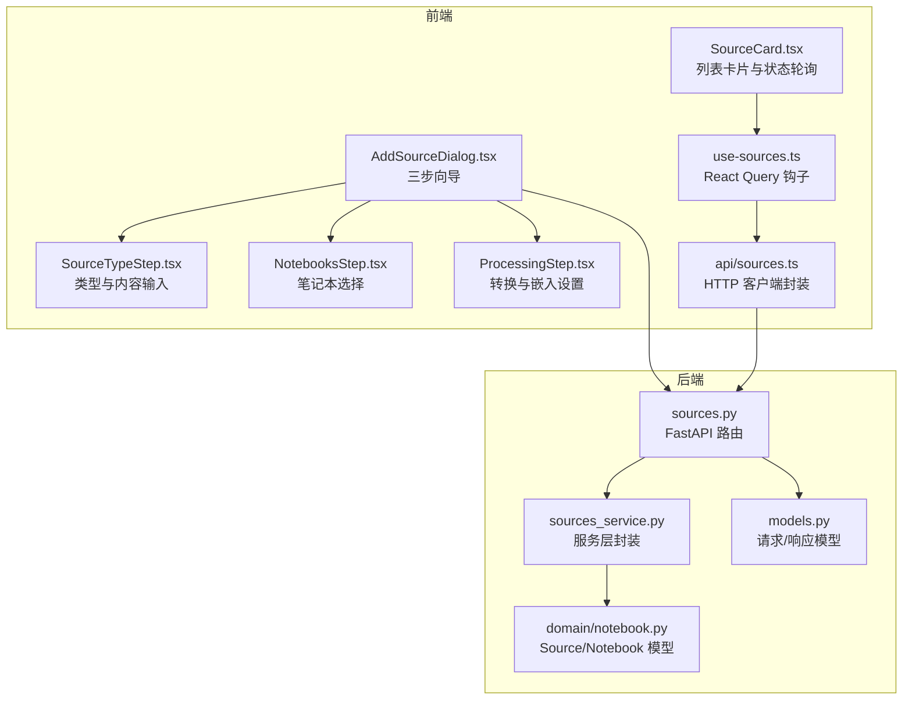
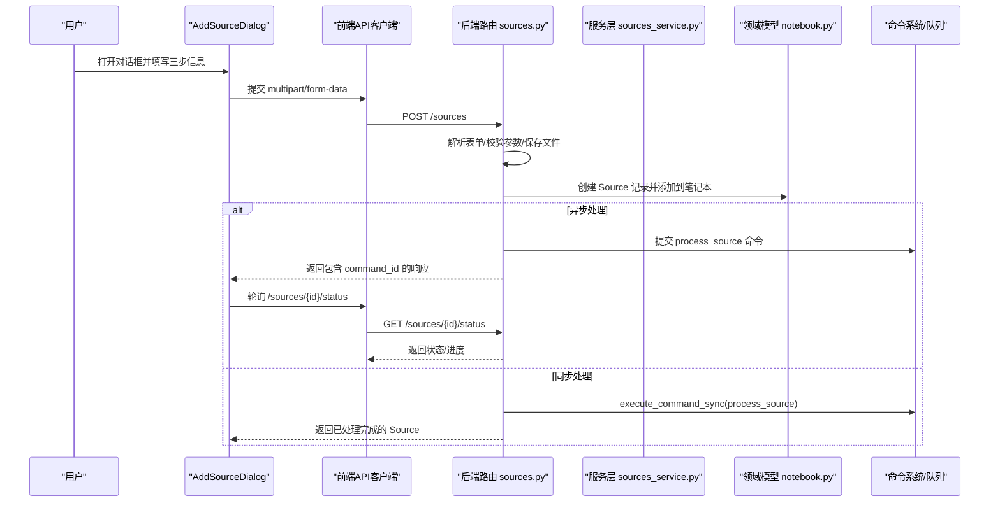
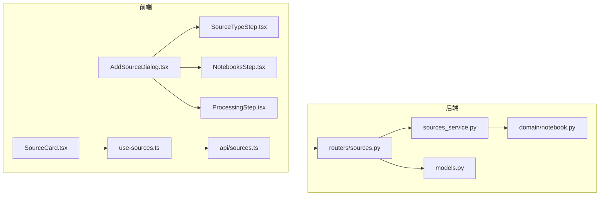

# 内容源管理

<cite>
**本文引用的文件**
- [api/routers/sources.py](file://api/routers/sources.py)
- [api/sources_service.py](file://api/sources_service.py)
- [frontend/src/components/sources/AddSourceDialog.tsx](file://frontend/src/components/sources/AddSourceDialog.tsx)
- [frontend/src/components/sources/SourceCard.tsx](file://frontend/src/components/sources/SourceCard.tsx)
- [frontend/src/components/sources/steps/SourceTypeStep.tsx](file://frontend/src/components/sources/steps/SourceTypeStep.tsx)
- [frontend/src/components/sources/steps/NotebooksStep.tsx](file://frontend/src/components/sources/steps/NotebooksStep.tsx)
- [frontend/src/components/sources/steps/ProcessingStep.tsx](file://frontend/src/components/sources/steps/ProcessingStep.tsx)
- [frontend/src/lib/hooks/use-sources.ts](file://frontend/src/lib/hooks/use-sources.ts)
- [frontend/src/lib/api/sources.ts](file://frontend/src/lib/api/sources.ts)
- [open_notebook/domain/notebook.py](file://open_notebook/domain/notebook.py)
- [api/models.py](file://api/models.py)
</cite>

## 目录
1. [简介](#简介)
2. [项目结构](#项目结构)
3. [核心组件](#核心组件)
4. [架构总览](#架构总览)
5. [详细组件分析](#详细组件分析)
6. [依赖分析](#依赖分析)
7. [性能考虑](#性能考虑)
8. [故障排查指南](#故障排查指南)
9. [结论](#结论)
10. [附录](#附录)

## 简介
本指南围绕“内容源管理”的完整使用流程展开，目标是帮助用户高效添加多种类型的内容源（网页链接、PDF 文档、文本文件等），并理解前端向导与后端 API 的协作机制。文档重点覆盖以下方面：
- 添加流程的三步法：选择类型、处理配置、关联笔记本
- 前端交互组件：AddSourceDialog 对话框与 SourceCard 卡片
- 后端 API 路由：sources.py 中的创建、状态查询、重试等接口
- 内容源与笔记本的多对多关系模型及跨笔记本共享策略
- 异步/同步两种处理模式的差异与适用场景

## 项目结构
内容源管理涉及前后端协同：
- 前端：对话框与卡片组件负责用户输入与状态展示，使用 React Query 管理数据流
- 后端：FastAPI 路由处理表单提交、文件上传、异步命令调度与状态查询
- 领域模型：Notebook/Source 等对象模型定义了内容源与笔记本的关系与能力

图表来源
- [frontend/src/components/sources/AddSourceDialog.tsx](file://frontend/src/components/sources/AddSourceDialog.tsx#L1-L630)
- [frontend/src/components/sources/steps/SourceTypeStep.tsx](file://frontend/src/components/sources/steps/SourceTypeStep.tsx#L1-L316)
- [frontend/src/components/sources/steps/NotebooksStep.tsx](file://frontend/src/components/sources/steps/NotebooksStep.tsx#L1-L42)
- [frontend/src/components/sources/steps/ProcessingStep.tsx](file://frontend/src/components/sources/steps/ProcessingStep.tsx#L1-L121)
- [frontend/src/components/sources/SourceCard.tsx](file://frontend/src/components/sources/SourceCard.tsx#L1-L391)
- [frontend/src/lib/hooks/use-sources.ts](file://frontend/src/lib/hooks/use-sources.ts#L1-L309)
- [frontend/src/lib/api/sources.ts](file://frontend/src/lib/api/sources.ts#L1-L109)
- [api/routers/sources.py](file://api/routers/sources.py#L1-L1041)
- [api/sources_service.py](file://api/sources_service.py#L1-L306)
- [open_notebook/domain/notebook.py](file://open_notebook/domain/notebook.py#L144-L311)
- [api/models.py](file://api/models.py#L1-L200)

章节来源
- [frontend/src/components/sources/AddSourceDialog.tsx](file://frontend/src/components/sources/AddSourceDialog.tsx#L1-L630)
- [api/routers/sources.py](file://api/routers/sources.py#L1-L1041)

## 核心组件
- AddSourceDialog：三步向导式对话框，引导用户完成“选择类型/内容”、“选择笔记本”、“处理配置（转换/嵌入/异步）”
- SourceCard：内容源列表卡片，显示标题、类型、主题标签、洞察数量、处理状态与进度，并支持删除、重试、从笔记本移除等操作
- SourceTypeStep/NotebooksStep/ProcessingStep：三步向导的具体步骤组件
- use-sources.ts：封装了创建、更新、删除、状态轮询、重试、批量添加到笔记本等操作
- api/sources.ts：统一的 HTTP 客户端，负责构造 multipart/form-data 并调用后端路由
- sources.py：后端路由，负责解析表单、保存文件、提交异步命令、返回状态与处理结果
- sources_service.py：服务层封装，兼容旧版返回结构与新异步返回结构
- domain/notebook.py：领域模型，提供 Source/Notebook 关系方法（如 add_to_notebook）
- models.py：请求/响应模型定义，确保前后端契约一致

章节来源
- [frontend/src/components/sources/AddSourceDialog.tsx](file://frontend/src/components/sources/AddSourceDialog.tsx#L1-L630)
- [frontend/src/components/sources/SourceCard.tsx](file://frontend/src/components/sources/SourceCard.tsx#L1-L391)
- [frontend/src/components/sources/steps/SourceTypeStep.tsx](file://frontend/src/components/sources/steps/SourceTypeStep.tsx#L1-L316)
- [frontend/src/components/sources/steps/NotebooksStep.tsx](file://frontend/src/components/sources/steps/NotebooksStep.tsx#L1-L42)
- [frontend/src/components/sources/steps/ProcessingStep.tsx](file://frontend/src/components/sources/steps/ProcessingStep.tsx#L1-L121)
- [frontend/src/lib/hooks/use-sources.ts](file://frontend/src/lib/hooks/use-sources.ts#L1-L309)
- [frontend/src/lib/api/sources.ts](file://frontend/src/lib/api/sources.ts#L1-L109)
- [api/routers/sources.py](file://api/routers/sources.py#L1-L1041)
- [api/sources_service.py](file://api/sources_service.py#L1-L306)
- [open_notebook/domain/notebook.py](file://open_notebook/domain/notebook.py#L144-L311)
- [api/models.py](file://api/models.py#L1-L200)

## 架构总览
下图展示了从用户点击“新建内容源”到后端异步处理完成并回传状态的关键路径。

图表来源
- [frontend/src/components/sources/AddSourceDialog.tsx](file://frontend/src/components/sources/AddSourceDialog.tsx#L1-L630)
- [frontend/src/lib/api/sources.ts](file://frontend/src/lib/api/sources.ts#L1-L109)
- [api/routers/sources.py](file://api/routers/sources.py#L319-L587)
- [api/sources_service.py](file://api/sources_service.py#L126-L209)
- [open_notebook/domain/notebook.py](file://open_notebook/domain/notebook.py#L261-L265)

## 详细组件分析

### AddSourceDialog 对话框（三步向导）
- 步骤一：选择类型与内容
  - 支持三种类型：link、upload、text
  - 支持批量导入：多行 URL 或多文件
  - 校验规则：必填字段、标题（文本类型）、批量大小限制
- 步骤二：选择笔记本
  - 多选笔记本，支持空选
- 步骤三：处理配置
  - 可选应用的转换（Transformations）
  - 嵌入开关（根据设置决定是否默认开启）
  - 异步处理开关（默认开启）

交互要点
- 使用 React Hook Form 进行表单验证与联动
- 使用 React Query 的 useCreateSource 钩子提交并自动刷新相关查询
- 支持批量创建：逐个提交多个来源，汇总成功/失败数

章节来源
- [frontend/src/components/sources/AddSourceDialog.tsx](file://frontend/src/components/sources/AddSourceDialog.tsx#L1-L630)
- [frontend/src/components/sources/steps/SourceTypeStep.tsx](file://frontend/src/components/sources/steps/SourceTypeStep.tsx#L1-L316)
- [frontend/src/components/sources/steps/NotebooksStep.tsx](file://frontend/src/components/sources/steps/NotebooksStep.tsx#L1-L42)
- [frontend/src/components/sources/steps/ProcessingStep.tsx](file://frontend/src/components/sources/steps/ProcessingStep.tsx#L1-L121)
- [frontend/src/lib/hooks/use-sources.ts](file://frontend/src/lib/hooks/use-sources.ts#L32-L81)
- [frontend/src/lib/api/sources.ts](file://frontend/src/lib/api/sources.ts#L30-L67)

### SourceCard 列表卡片
- 展示内容源的基本信息：标题、类型、主题、洞察数量
- 显示处理状态与进度：new/queued/running/completed/failed
- 支持的操作：删除、重试、从笔记本移除、上下文切换
- 自动轮询：当处于处理中时，每 2 秒刷新一次状态

章节来源
- [frontend/src/components/sources/SourceCard.tsx](file://frontend/src/components/sources/SourceCard.tsx#L1-L391)
- [frontend/src/lib/hooks/use-sources.ts](file://frontend/src/lib/hooks/use-sources.ts#L161-L186)

### 后端 API 路由（sources.py）
- 表单解析与校验
  - parse_source_form_data 将 multipart/form-data 解析为 SourceCreate 模型，并处理 JSON 字段（notebooks、transformations）
  - 字符串布尔值转换（embed/delete_source/async_processing）
- 创建内容源
  - 同步路径：execute_command_sync 直接执行，返回完整 Source
  - 异步路径：提交 process_source 命令，立即返回包含 command_id 的响应
- 文件上传
  - save_uploaded_file 保存上传文件，生成唯一文件名
- 状态查询与重试
  - get_source_status 返回状态与进度
  - retry_source_processing 重新提交命令，保留笔记本与转换设置

章节来源
- [api/routers/sources.py](file://api/routers/sources.py#L86-L149)
- [api/routers/sources.py](file://api/routers/sources.py#L319-L587)
- [api/routers/sources.py](file://api/routers/sources.py#L589-L595)
- [api/routers/sources.py](file://api/routers/sources.py#L636-L722)
- [api/routers/sources.py](file://api/routers/sources.py#L724-L783)
- [api/routers/sources.py](file://api/routers/sources.py#L852-L934)

### 服务层封装（sources_service.py）
- 兼容旧版返回结构与新版异步返回结构
- 提供便捷方法：create_source、create_source_async、get_source_status、is_source_processing_complete、update_source、delete_source

章节来源
- [api/sources_service.py](file://api/sources_service.py#L126-L209)
- [api/sources_service.py](file://api/sources_service.py#L216-L258)
- [api/sources_service.py](file://api/sources_service.py#L259-L306)

### 领域模型与关系（domain/notebook.py）
- Source/Notebook 多对多关系通过 reference 边建立
- Source 提供 add_to_notebook 方法用于添加关联
- Source 提供 get_status/get_processing_progress/get_embedded_chunks 等辅助方法
- Notebook 提供 get_sources 等查询方法

章节来源
- [open_notebook/domain/notebook.py](file://open_notebook/domain/notebook.py#L29-L41)
- [open_notebook/domain/notebook.py](file://open_notebook/domain/notebook.py#L261-L265)
- [open_notebook/domain/notebook.py](file://open_notebook/domain/notebook.py#L175-L215)
- [open_notebook/domain/notebook.py](file://open_notebook/domain/notebook.py#L231-L246)

### 请求/响应模型（models.py）
- SourceCreate/SourceResponse/SourceStatusResponse 等模型定义了前后端契约
- 保证字段一致性，便于前端与后端正确解析

章节来源
- [api/models.py](file://api/models.py#L1-L200)

## 依赖分析
- 前端依赖
  - AddSourceDialog 依赖 SourceTypeStep/NotebooksStep/ProcessingStep
  - SourceCard 依赖 useSourceStatus 与 use-sources 钩子
  - use-sources 依赖 api/sources.ts
  - api/sources.ts 依赖 axios 客户端
- 后端依赖
  - sources.py 依赖 CommandService、Source/Notebook 模型、CommandService.submit_command_job
  - sources_service.py 依赖 api.client 与 domain/notebook

图表来源
- [frontend/src/components/sources/AddSourceDialog.tsx](file://frontend/src/components/sources/AddSourceDialog.tsx#L1-L630)
- [frontend/src/components/sources/steps/SourceTypeStep.tsx](file://frontend/src/components/sources/steps/SourceTypeStep.tsx#L1-L316)
- [frontend/src/components/sources/steps/NotebooksStep.tsx](file://frontend/src/components/sources/steps/NotebooksStep.tsx#L1-L42)
- [frontend/src/components/sources/steps/ProcessingStep.tsx](file://frontend/src/components/sources/steps/ProcessingStep.tsx#L1-L121)
- [frontend/src/components/sources/SourceCard.tsx](file://frontend/src/components/sources/SourceCard.tsx#L1-L391)
- [frontend/src/lib/hooks/use-sources.ts](file://frontend/src/lib/hooks/use-sources.ts#L1-L309)
- [frontend/src/lib/api/sources.ts](file://frontend/src/lib/api/sources.ts#L1-L109)
- [api/routers/sources.py](file://api/routers/sources.py#L1-L1041)
- [api/sources_service.py](file://api/sources_service.py#L1-L306)
- [open_notebook/domain/notebook.py](file://open_notebook/domain/notebook.py#L144-L311)
- [api/models.py](file://api/models.py#L1-L200)

## 性能考虑
- 异步处理优先：默认启用 async_processing，避免阻塞前端
- 批量导入：前端限制最大批量数量，减少一次性提交压力
- 状态轮询：仅在处理中时以固定频率轮询，完成后停止
- 文件上传：生成唯一文件名，避免冲突；上传失败及时清理临时文件
- 命令并发控制：后端通过命令系统进行后台处理，避免阻塞主连接池

[本节为通用建议，不直接分析具体文件]

## 故障排查指南
常见问题与定位思路：
- 无法创建内容源
  - 检查前端表单校验错误（类型/必填项/批量限制）
  - 检查后端解析与校验日志（parse_source_form_data）
- 上传文件失败
  - 检查文件大小与类型是否受支持
  - 检查 save_uploaded_file 是否抛出异常并清理临时文件
- 状态一直为 queued/running
  - 检查命令系统是否正常运行
  - 使用 get_source_status 接口确认命令状态
- 重试失败
  - 确认源资产可识别（file_path/url/full_text）
  - 重新提交命令并观察返回的 command_id

章节来源
- [frontend/src/lib/api/sources.ts](file://frontend/src/lib/api/sources.ts#L30-L67)
- [api/routers/sources.py](file://api/routers/sources.py#L86-L149)
- [api/routers/sources.py](file://api/routers/sources.py#L319-L587)
- [api/routers/sources.py](file://api/routers/sources.py#L724-L783)
- [api/routers/sources.py](file://api/routers/sources.py#L852-L934)

## 结论
内容源管理通过“三步向导 + 列表卡片 + 异步命令”的组合，实现了对网页链接、PDF 文档、文本文件等多类型内容的统一接入。前端负责直观的用户体验与状态反馈，后端负责稳健的数据处理与命令调度。内容源与笔记本之间采用多对多关系，既支持单笔记本内复用，也支持跨笔记本共享同一内容源，满足知识组织与复用需求。

[本节为总结性内容，不直接分析具体文件]

## 附录

### 添加流程三步法详解
- 步骤一：选择类型与内容
  - 支持单条或多条 URL（批量导入）
  - 支持单个或多个文件（批量导入）
  - 支持直接粘贴文本
- 步骤二：选择笔记本
  - 可多选，支持空选
- 步骤三：处理配置
  - 可选应用的转换（Transformations）
  - 嵌入开关（根据设置决定默认行为）
  - 异步处理开关（默认开启）

章节来源
- [frontend/src/components/sources/AddSourceDialog.tsx](file://frontend/src/components/sources/AddSourceDialog.tsx#L1-L630)
- [frontend/src/components/sources/steps/SourceTypeStep.tsx](file://frontend/src/components/sources/steps/SourceTypeStep.tsx#L1-L316)
- [frontend/src/components/sources/steps/NotebooksStep.tsx](file://frontend/src/components/sources/steps/NotebooksStep.tsx#L1-L42)
- [frontend/src/components/sources/steps/ProcessingStep.tsx](file://frontend/src/components/sources/steps/ProcessingStep.tsx#L1-L121)

### 内容源与笔记本的多对多关系
- 关系建立
  - Source.add_to_notebook 通过 reference 边建立关联
  - Notebook.get_sources 查询当前笔记本下的所有内容源
- 跨笔记本共享
  - 在“选择笔记本”步骤中勾选多个笔记本即可实现共享
  - 删除某笔记本关联不会影响其他笔记本中的同一内容源

章节来源
- [open_notebook/domain/notebook.py](file://open_notebook/domain/notebook.py#L29-L41)
- [open_notebook/domain/notebook.py](file://open_notebook/domain/notebook.py#L261-L265)

### 异步与同步处理对比
- 同步处理
  - 适合小体量内容，等待后端完成后再返回
  - 前端无需轮询状态
- 异步处理
  - 适合大体量内容，立即返回 command_id，前端轮询状态
  - 更友好地支持批量导入与长时间任务

章节来源
- [api/routers/sources.py](file://api/routers/sources.py#L464-L587)
- [frontend/src/lib/hooks/use-sources.ts](file://frontend/src/lib/hooks/use-sources.ts#L161-L186)