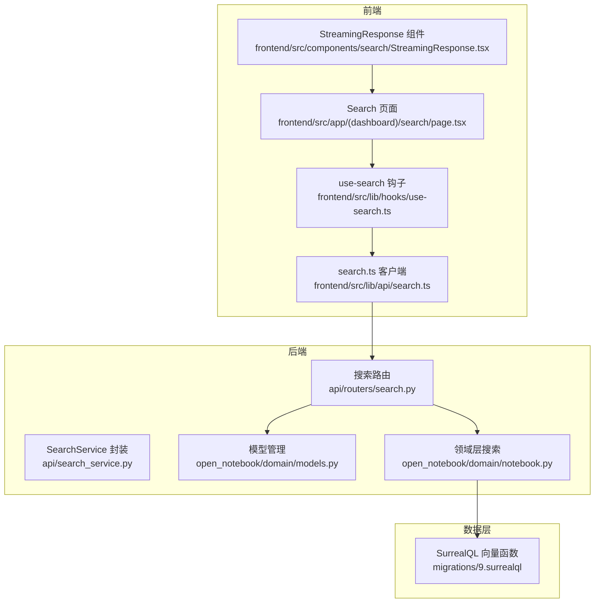
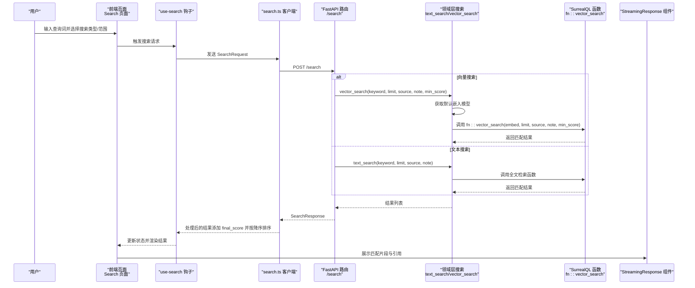
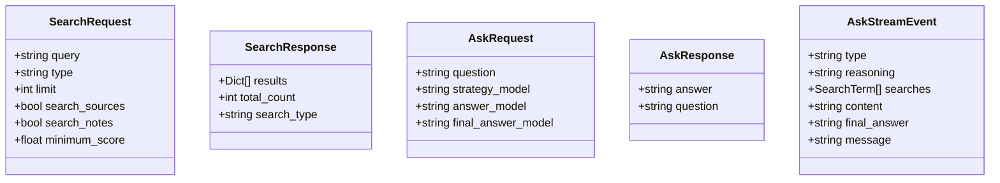
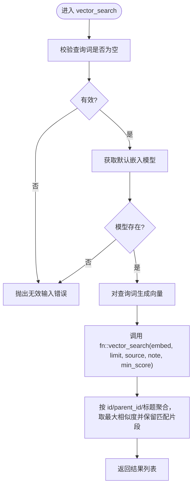
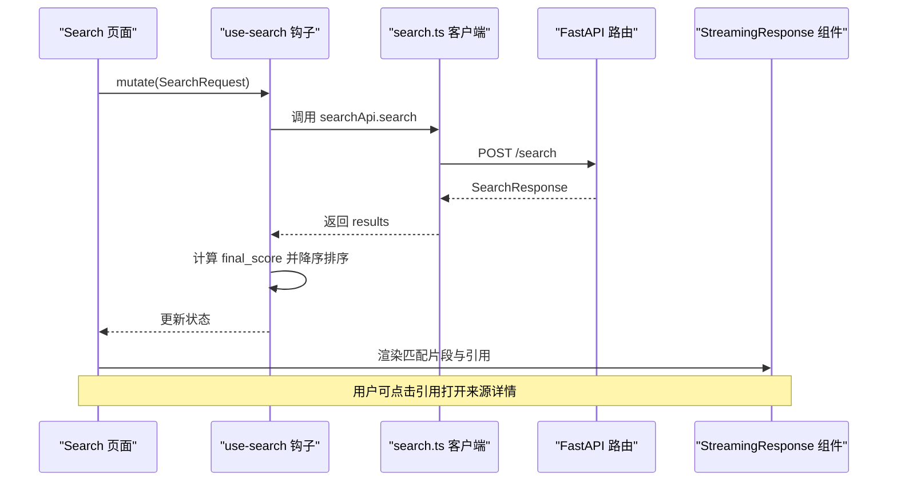
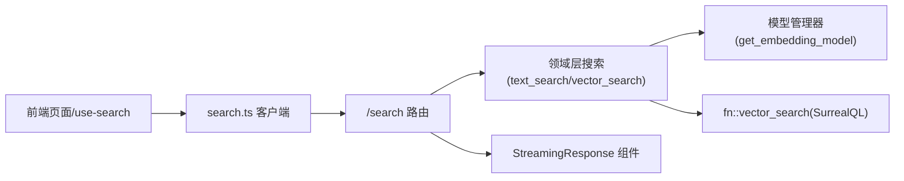

# 智能搜索

<cite>
**本文引用的文件**
- [api/routers/search.py](file://api/routers/search.py)
- [api/search_service.py](file://api/search_service.py)
- [open_notebook/domain/notebook.py](file://open_notebook/domain/notebook.py)
- [open_notebook/domain/models.py](file://open_notebook/domain/models.py)
- [api/models.py](file://api/models.py)
- [frontend/src/app/(dashboard)/search/page.tsx](file://frontend/src/app/(dashboard)/search/page.tsx)
- [frontend/src/components/search/StreamingResponse.tsx](file://frontend/src/components/search/StreamingResponse.tsx)
- [frontend/src/lib/hooks/use-search.ts](file://frontend/src/lib/hooks/use-search.ts)
- [frontend/src/lib/api/search.ts](file://frontend/src/lib/api/search.ts)
- [frontend/src/lib/types/search.ts](file://frontend/src/lib/types/search.ts)
- [migrations/9.surrealql](file://migrations/9.surrealql)
- [docs/user-guide/search.md](file://docs/user-guide/search.md)
</cite>

## 目录
1. [简介](#简介)
2. [项目结构](#项目结构)
3. [核心组件](#核心组件)
4. [架构总览](#架构总览)
5. [详细组件分析](#详细组件分析)
6. [依赖关系分析](#依赖关系分析)
7. [性能考量](#性能考量)
8. [故障排查指南](#故障排查指南)
9. [结论](#结论)
10. [附录](#附录)

## 简介
本指南面向使用“智能搜索”功能的用户与开发者，系统讲解基于语义嵌入的全文检索能力。用户可在搜索页面输入关键词，系统通过向量数据库进行相似度匹配并返回相关片段；同时，结合 search.py 的 API 路由与 StreamingResponse 组件，解释搜索请求的处理流程、结果排序策略及流式呈现机制。文档还指导用户如何查看搜索结果的来源引用、将结果保存至指定笔记本，以及如何调整搜索范围（限定特定笔记本或内容源）。

## 项目结构
智能搜索涉及前后端多层协作：
- 前端：Next.js 页面负责交互、参数收集与结果展示；包含流式响应渲染组件。
- 后端：FastAPI 路由处理搜索请求，调用领域层的文本/向量搜索函数；领域层通过数据库函数实现相似度匹配。
- 数据层：SurrealQL 函数实现向量相似度计算与聚合，支持来源、笔记与洞察的统一检索。

图表来源
- [frontend/src/app/(dashboard)/search/page.tsx](file://frontend/src/app/(dashboard)/search/page.tsx#L1-L485)
- [frontend/src/lib/hooks/use-search.ts](file://frontend/src/lib/hooks/use-search.ts#L1-L32)
- [frontend/src/lib/api/search.ts](file://frontend/src/lib/api/search.ts#L1-L63)
- [api/routers/search.py](file://api/routers/search.py#L1-L215)
- [api/search_service.py](file://api/search_service.py#L1-L58)
- [open_notebook/domain/notebook.py](file://open_notebook/domain/notebook.py#L406-L457)
- [open_notebook/domain/models.py](file://open_notebook/domain/models.py#L68-L199)
- [migrations/9.surrealql](file://migrations/9.surrealql#L2-L66)

章节来源
- [frontend/src/app/(dashboard)/search/page.tsx](file://frontend/src/app/(dashboard)/search/page.tsx#L1-L485)
- [api/routers/search.py](file://api/routers/search.py#L1-L215)
- [open_notebook/domain/notebook.py](file://open_notebook/domain/notebook.py#L406-L457)
- [migrations/9.surrealql](file://migrations/9.surrealql#L2-L66)

## 核心组件
- 搜索路由与服务
  - 后端提供 /search 和 /search/ask 两个入口，分别用于非流式搜索与流式问答。
  - 搜索服务封装了 API 调用，便于前端以统一方式发起请求。
- 领域层搜索
  - 文本搜索与向量搜索分别由领域层函数实现，向量搜索会调用嵌入模型生成向量，并通过数据库函数执行相似度匹配。
- 前端交互与流式渲染
  - 搜索页面负责收集查询参数（类型、范围、阈值等），并在结果中展示匹配片段与来源链接。
  - 流式响应组件接收服务器推送事件，逐步展示策略、中间答案与最终答案，并支持引用跳转。

章节来源
- [api/routers/search.py](file://api/routers/search.py#L1-L215)
- [api/search_service.py](file://api/search_service.py#L1-L58)
- [open_notebook/domain/notebook.py](file://open_notebook/domain/notebook.py#L406-L457)
- [frontend/src/app/(dashboard)/search/page.tsx](file://frontend/src/app/(dashboard)/search/page.tsx#L1-L485)
- [frontend/src/components/search/StreamingResponse.tsx](file://frontend/src/components/search/StreamingResponse.tsx#L1-L184)

## 架构总览
下图展示了从用户输入到结果呈现的完整链路，包括参数校验、模型可用性检查、向量化与相似度匹配、排序与流式输出。

图表来源
- [api/routers/search.py](file://api/routers/search.py#L17-L60)
- [open_notebook/domain/notebook.py](file://open_notebook/domain/notebook.py#L406-L457)
- [migrations/9.surrealql](file://migrations/9.surrealql#L2-L66)
- [frontend/src/lib/hooks/use-search.ts](file://frontend/src/lib/hooks/use-search.ts#L1-L32)
- [frontend/src/lib/api/search.ts](file://frontend/src/lib/api/search.ts#L1-L63)
- [frontend/src/app/(dashboard)/search/page.tsx](file://frontend/src/app/(dashboard)/search/page.tsx#L308-L479)
- [frontend/src/components/search/StreamingResponse.tsx](file://frontend/src/components/search/StreamingResponse.tsx#L1-L184)

## 详细组件分析

### 搜索路由与请求模型
- 路由层提供两类接口：
  - /search：非流式搜索，支持 text/vector 两种模式，可限定搜索范围（来源/笔记）与最小相似度阈值。
  - /search/ask：流式问答，返回策略、中间答案与最终答案的分段事件。
- 请求模型定义了查询参数、结果结构与 SSE 事件类型，确保前后端契约一致。

图表来源
- [api/models.py](file://api/models.py#L31-L60)
- [api/models.py](file://api/models.py#L49-L59)
- [api/models.py](file://api/models.py#L422-L425)
- [frontend/src/lib/types/search.ts](file://frontend/src/lib/types/search.ts#L46-L62)

章节来源
- [api/routers/search.py](file://api/routers/search.py#L17-L60)
- [api/models.py](file://api/models.py#L31-L60)
- [frontend/src/lib/types/search.ts](file://frontend/src/lib/types/search.ts#L1-L62)

### 领域层搜索与向量函数
- 文本搜索：直接调用数据库内置全文检索函数，返回匹配结果。
- 向量搜索：先通过模型管理器获取默认嵌入模型，对查询词生成向量，再调用 SurrealQL 的 fn::vector_search 执行相似度匹配与聚合，返回去重后的最高相似度结果与匹配片段数组。

图表来源
- [open_notebook/domain/notebook.py](file://open_notebook/domain/notebook.py#L426-L456)
- [migrations/9.surrealql](file://migrations/9.surrealql#L2-L66)

章节来源
- [open_notebook/domain/notebook.py](file://open_notebook/domain/notebook.py#L406-L457)
- [migrations/9.surrealql](file://migrations/9.surrealql#L2-L66)

### 前端搜索页面与流式响应
- 搜索页面：
  - 支持切换搜索类型（文本/向量）、限定搜索范围（来源/笔记）、设置最小相似度阈值与结果上限。
  - 自动根据 URL 参数触发首次搜索或问答。
  - 渲染结果时显示标题、分数与匹配片段折叠面板，点击可打开查看。
- 流式响应组件：
  - 接收策略阶段（推理与搜索计划）、中间答案与最终答案的分段事件。
  - 最终答案支持引用解析为可点击链接，点击后打开对应模态查看原文。

图表来源
- [frontend/src/app/(dashboard)/search/page.tsx](file://frontend/src/app/(dashboard)/search/page.tsx#L308-L479)
- [frontend/src/lib/hooks/use-search.ts](file://frontend/src/lib/hooks/use-search.ts#L1-L32)
- [frontend/src/lib/api/search.ts](file://frontend/src/lib/api/search.ts#L1-L63)
- [frontend/src/components/search/StreamingResponse.tsx](file://frontend/src/components/search/StreamingResponse.tsx#L1-L184)

章节来源
- [frontend/src/app/(dashboard)/search/page.tsx](file://frontend/src/app/(dashboard)/search/page.tsx#L1-L485)
- [frontend/src/lib/hooks/use-search.ts](file://frontend/src/lib/hooks/use-search.ts#L1-L32)
- [frontend/src/lib/api/search.ts](file://frontend/src/lib/api/search.ts#L1-L63)
- [frontend/src/components/search/StreamingResponse.tsx](file://frontend/src/components/search/StreamingResponse.tsx#L1-L184)

### 模型管理与可用性检查
- 路由层在执行向量搜索前会检查是否存在默认嵌入模型，若未配置则拒绝请求并提示用户前往模型配置页面。
- 模型管理器提供获取默认嵌入模型的能力，确保向量搜索依赖的模型可用。

章节来源
- [api/routers/search.py](file://api/routers/search.py#L21-L35)
- [open_notebook/domain/models.py](file://open_notebook/domain/models.py#L149-L159)

### 结果排序与分数处理
- 前端钩子会对返回的结果统一计算 final_score，并按降序排序，确保最相关的结果优先展示。
- 排序依据支持 relevance/similarity/score 字段，兼容不同搜索类型的分数来源。

章节来源
- [frontend/src/lib/hooks/use-search.ts](file://frontend/src/lib/hooks/use-search.ts#L1-L32)

### 流式呈现机制
- /search/ask 使用 StreamingResponse 返回 Server-Sent Events，事件类型包括 strategy、answer、final_answer、complete、error。
- 前端组件逐段渲染策略说明、中间答案列表与最终答案，并在最终答案中启用引用跳转。

章节来源
- [api/routers/search.py](file://api/routers/search.py#L61-L108)
- [frontend/src/lib/api/search.ts](file://frontend/src/lib/api/search.ts#L1-L63)
- [frontend/src/components/search/StreamingResponse.tsx](file://frontend/src/components/search/StreamingResponse.tsx#L1-L184)
- [frontend/src/lib/types/search.ts](file://frontend/src/lib/types/search.ts#L46-L62)

## 依赖关系分析
- 组件耦合
  - 前端通过 use-search 钩子与 search.ts 客户端解耦具体 API 实现，便于扩展其他后端适配。
  - 后端路由依赖领域层搜索函数与模型管理器，避免在路由层直接处理模型实例。
  - 数据层通过 SurrealQL 函数集中实现相似度计算与聚合逻辑，降低上层复杂度。
- 外部依赖
  - 嵌入模型由 Esperanto 工厂创建并缓存，确保向量搜索的稳定性与性能。
  - SSE 事件格式与前端组件严格对齐，保证流式渲染一致性。

图表来源
- [frontend/src/lib/hooks/use-search.ts](file://frontend/src/lib/hooks/use-search.ts#L1-L32)
- [frontend/src/lib/api/search.ts](file://frontend/src/lib/api/search.ts#L1-L63)
- [api/routers/search.py](file://api/routers/search.py#L17-L60)
- [open_notebook/domain/notebook.py](file://open_notebook/domain/notebook.py#L406-L457)
- [open_notebook/domain/models.py](file://open_notebook/domain/models.py#L149-L159)
- [migrations/9.surrealql](file://migrations/9.surrealql#L2-L66)
- [frontend/src/components/search/StreamingResponse.tsx](file://frontend/src/components/search/StreamingResponse.tsx#L1-L184)

章节来源
- [api/routers/search.py](file://api/routers/search.py#L1-L215)
- [open_notebook/domain/notebook.py](file://open_notebook/domain/notebook.py#L406-L457)
- [open_notebook/domain/models.py](file://open_notebook/domain/models.py#L68-L199)
- [frontend/src/lib/hooks/use-search.ts](file://frontend/src/lib/hooks/use-search.ts#L1-L32)
- [frontend/src/lib/api/search.ts](file://frontend/src/lib/api/search.ts#L1-L63)
- [frontend/src/components/search/StreamingResponse.tsx](file://frontend/src/components/search/StreamingResponse.tsx#L1-L184)

## 性能考量
- 向量搜索依赖嵌入模型质量与索引完整性，建议：
  - 为来源与笔记启用嵌入处理，确保内容具备向量表示。
  - 合理设置 minimum_score 与 limit，平衡召回率与性能。
  - 在大规模内容场景下，优先使用向量搜索发现主题，再用文本搜索定位精确信息。
- 文本搜索适合精确匹配与高亮展示，向量搜索适合语义理解与概念发现。
- 前端已对结果进行本地排序，减少网络传输与重复计算。

章节来源
- [docs/user-guide/search.md](file://docs/user-guide/search.md#L1-L351)
- [frontend/src/lib/hooks/use-search.ts](file://frontend/src/lib/hooks/use-search.ts#L1-L32)
- [open_notebook/domain/notebook.py](file://open_notebook/domain/notebook.py#L426-L456)

## 故障排查指南
- 无向量搜索选项
  - 现象：向量搜索不可用。
  - 原因：未配置默认嵌入模型。
  - 处理：前往“模型”页面配置嵌入模型。
- 问答功能报错
  - 现象：Ask 功能返回错误。
  - 原因：缺少嵌入模型或未选择三个必要模型。
  - 处理：确认嵌入模型已配置，且策略/答案/最终合成模型均有效。
- 结果不相关或过少
  - 现象：相似度低或命中数不足。
  - 处理：提高 minimum_score 或扩大搜索范围；尝试文本搜索与向量搜索组合。
- 慢查询
  - 现象：搜索耗时较长。
  - 处理：降低 limit、优化查询词、检查系统资源与内容体积。

章节来源
- [docs/user-guide/search.md](file://docs/user-guide/search.md#L283-L323)
- [api/routers/search.py](file://api/routers/search.py#L21-L35)
- [frontend/src/lib/api/search.ts](file://frontend/src/lib/api/search.ts#L1-L63)

## 结论
智能搜索通过“文本搜索 + 向量搜索”的双通道设计，既满足精确查找，也支持语义发现。后端以领域层函数与数据库函数为核心，前端以流式组件提升交互体验。用户可通过页面参数灵活控制搜索范围与阈值，并借助引用跳转与保存功能高效组织知识。

## 附录

### 如何在搜索页面使用智能搜索
- 选择搜索类型：文本搜索适合精确匹配；向量搜索适合语义发现。
- 限定范围：勾选“搜索来源/搜索笔记”，仅在需要时开启。
- 设置阈值：向量搜索可调节最小相似度，过滤低质量结果。
- 查看结果：点击标题或匹配片段展开，查看来源与上下文。
- 保存结果：将有价值的片段或问答保存为笔记，归档到指定笔记本。

章节来源
- [frontend/src/app/(dashboard)/search/page.tsx](file://frontend/src/app/(dashboard)/search/page.tsx#L308-L479)
- [docs/user-guide/search.md](file://docs/user-guide/search.md#L57-L135)

### 如何查看来源引用并跳转
- 在最终答案或匹配片段中，引用以链接形式出现。
- 点击链接可打开对应来源/笔记/洞察的模态视图，查看原始内容。

章节来源
- [frontend/src/components/search/StreamingResponse.tsx](file://frontend/src/components/search/StreamingResponse.tsx#L159-L184)
- [frontend/src/app/(dashboard)/search/page.tsx](file://frontend/src/app/(dashboard)/search/page.tsx#L416-L479)

### 如何将结果保存至指定笔记本
- 在问答完成后，点击“保存到笔记本”按钮，选择目标笔记本并确认保存。
- 保存的内容将以“AI”类型记录，便于后续检索与整理。

章节来源
- [frontend/src/app/(dashboard)/search/page.tsx](file://frontend/src/app/(dashboard)/search/page.tsx#L246-L305)
- [docs/user-guide/search.md](file://docs/user-guide/search.md#L213-L218)