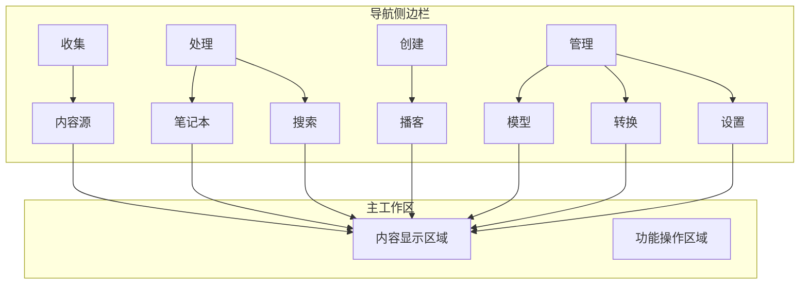
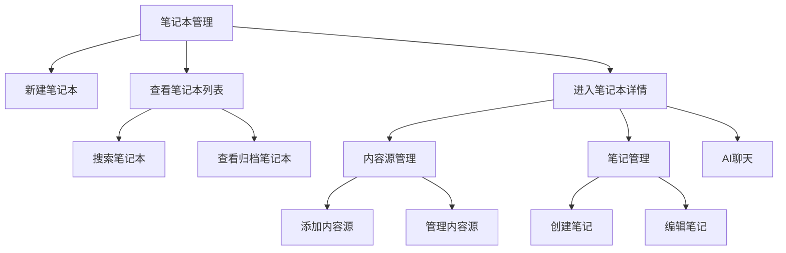
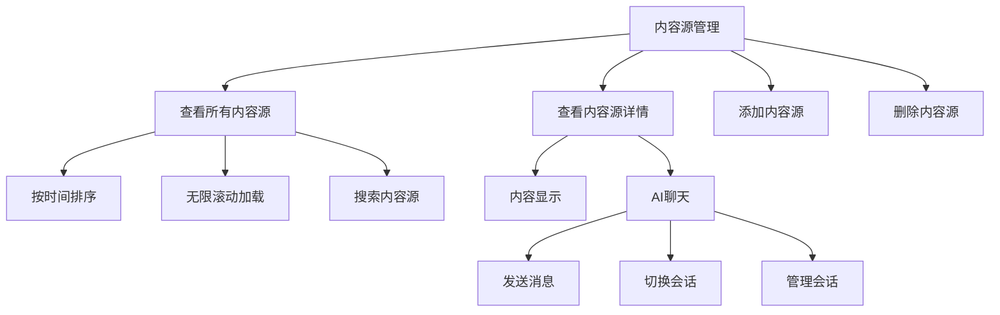
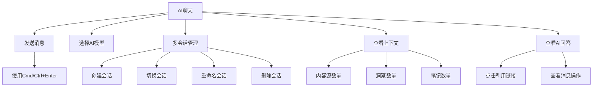
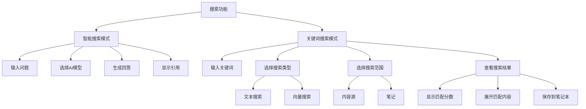

# 用户指南

<cite>
**本文档中引用的文件**
- [README.md](file://README.md)
- [AppShell.tsx](file://frontend/src/components/layout/AppShell.tsx)
- [AppSidebar.tsx](file://frontend/src/components/layout/AppSidebar.tsx)
- [page.tsx](file://frontend/src/app/(dashboard)/notebooks/page.tsx)
- [page.tsx](file://frontend/src/app/(dashboard)/sources/page.tsx)
- [page.tsx](file://frontend/src/app/(dashboard)/search/page.tsx)
- [page.tsx](file://frontend/src/app/(dashboard)/settings/page.tsx)
- [page.tsx](file://frontend/src/app/(dashboard)/notebooks/[id]/page.tsx)
- [page.tsx](file://frontend/src/app/(dashboard)/sources/[id]/page.tsx)
- [ChatPanel.tsx](file://frontend/src/components/source/ChatPanel.tsx)
</cite>

## 目录
1. [简介](#简介)
2. [界面概览](#界面概览)
3. [笔记本管理](#笔记本管理)
4. [内容源管理](#内容源管理)
5. [AI聊天功能](#ai聊天功能)
6. [搜索功能](#搜索功能)
7. [设置](#设置)

## 简介
Open Notebook 是一个开源、注重隐私的研究和知识管理工具，为用户提供了一个完全可控的替代方案。该系统允许用户通过添加网页、文档等多模态内容源来组织研究资料，并利用AI模型进行智能聊天、搜索和内容生成。用户可以创建多个笔记本项目，每个项目包含相关的笔记和内容源，实现系统化的知识管理。

**Section sources**
- [README.md](file://README.md)

## 界面概览
Open Notebook 采用现代化的三栏式界面设计，左侧为导航侧边栏，右侧为主工作区。导航侧边栏提供了"收集"、"处理"、"创建"和"管理"四大功能区域，用户可以通过点击相应图标快速访问不同功能模块。主工作区根据当前选择的功能显示相应的内容，如笔记本列表、内容源管理、搜索界面等。界面支持明暗主题切换，并提供了快捷键操作（Cmd/Ctrl+K）来快速执行各种操作。

**Diagram sources**
- [AppSidebar.tsx](file://frontend/src/components/layout/AppSidebar.tsx)
- [AppShell.tsx](file://frontend/src/components/layout/AppShell.tsx)

**Section sources**
- [AppSidebar.tsx](file://frontend/src/components/layout/AppSidebar.tsx)
- [AppShell.tsx](file://frontend/src/components/layout/AppShell.tsx)

## 笔记本管理
笔记本是Open Notebook中的核心组织单元，用于管理特定主题的研究项目。用户可以通过点击"创建"按钮并选择"笔记本"来新建一个笔记本。在笔记本管理页面，用户可以查看所有活动和归档的笔记本，支持通过搜索功能快速定位特定笔记本。点击单个笔记本可以进入其详细页面，在这里用户可以管理与该笔记本相关的内容源、笔记和进行AI聊天。

在笔记本详细页面，系统采用响应式布局：在桌面端显示为可折叠的三栏式布局（内容源、笔记、聊天），而在移动端则通过标签页切换不同视图。用户可以独立折叠或展开内容源和笔记栏，以适应不同的工作需求。每个笔记本都有一个标题区域显示笔记本名称和基本信息。

**Diagram sources**
- [page.tsx](file://frontend/src/app/(dashboard)/notebooks/page.tsx)
- [page.tsx](file://frontend/src/app/(dashboard)/notebooks/[id]/page.tsx)

**Section sources**
- [page.tsx](file://frontend/src/app/(dashboard)/notebooks/page.tsx)
- [page.tsx](file://frontend/src/app/(dashboard)/notebooks/[id]/page.tsx)

## 内容源管理
内容源是用户添加到系统中的研究材料，包括网页链接、上传的文件或直接输入的文本。在"所有内容源"页面，用户可以浏览系统中所有的内容源，按创建或更新时间排序，并支持无限滚动加载更多内容。每个内容源条目显示其类型（链接、文件或文本）、标题、创建时间、洞察数量和嵌入状态。

用户可以通过点击内容源条目或按Enter键来查看其详细信息。在内容源详情页面，界面分为左右两栏：左侧显示内容源的详细信息，右侧提供与该内容源相关的AI聊天功能。用户可以在聊天中询问关于该内容源的问题，AI将基于内容源的信息进行回答。此外，用户还可以通过点击删除图标来移除不再需要的内容源。

**Diagram sources**
- [page.tsx](file://frontend/src/app/(dashboard)/sources/page.tsx)
- [page.tsx](file://frontend/src/app/(dashboard)/sources/[id]/page.tsx)

**Section sources**
- [page.tsx](file://frontend/src/app/(dashboard)/sources/page.tsx)
- [page.tsx](file://frontend/src/app/(dashboard)/sources/[id]/page.tsx)

## AI聊天功能
AI聊天功能允许用户与系统中的内容进行交互式对话。在笔记本或内容源的聊天面板中，用户可以向AI提问，AI将基于相关上下文信息生成回答。聊天界面支持多会话管理，用户可以创建、切换和删除不同的聊天会话，以便组织不同主题的对话。

聊天面板提供了模型选择功能，用户可以选择不同的AI模型进行对话。在发送消息时，用户可以使用Cmd/Ctrl+Enter快捷键来提交问题。AI的回答会以结构化的方式显示，并包含对引用来源的链接，用户点击这些链接可以直接跳转到相关的内容源或笔记。聊天界面还显示了当前上下文的信息，包括参与对话的内容源、洞察和笔记的数量。

**Diagram sources**
- [ChatPanel.tsx](file://frontend/src/components/source/ChatPanel.tsx)
- [page.tsx](file://frontend/src/app/(dashboard)/notebooks/[id]/page.tsx)

**Section sources**
- [ChatPanel.tsx](file://frontend/src/components/source/ChatPanel.tsx)
- [page.tsx](file://frontend/src/app/(dashboard)/notebooks/[id]/page.tsx)

## 搜索功能
搜索功能提供两种模式：智能搜索和关键词搜索。智能搜索（Ask）利用AI模型理解用户的查询意图，并基于知识库中的内容生成综合回答；关键词搜索（Search）则通过文本或向量匹配来查找相关结果。

在智能搜索模式下，用户输入问题后，系统会使用AI模型分析知识库并生成回答，同时提供引用来源。在关键词搜索模式下，用户可以选择搜索类型（文本搜索或向量搜索）和搜索范围（内容源或笔记）。搜索结果会显示匹配度分数，并支持展开查看具体的匹配内容片段。用户还可以保存搜索结果到笔记本中，以便后续参考。

**Diagram sources**
- [page.tsx](file://frontend/src/app/(dashboard)/search/page.tsx)

**Section sources**
- [page.tsx](file://frontend/src/app/(dashboard)/search/page.tsx)

## 设置
设置页面允许用户配置系统的基本参数和偏好。用户可以在此页面查看和修改各种设置选项，包括AI模型配置、系统行为和用户界面偏好。页面顶部显示"设置"标题和一个刷新按钮，用于重新加载设置数据。通过集中化的设置管理，用户可以轻松地调整系统行为以满足个人需求。

**Section sources**
- [page.tsx](file://frontend/src/app/(dashboard)/settings/page.tsx)