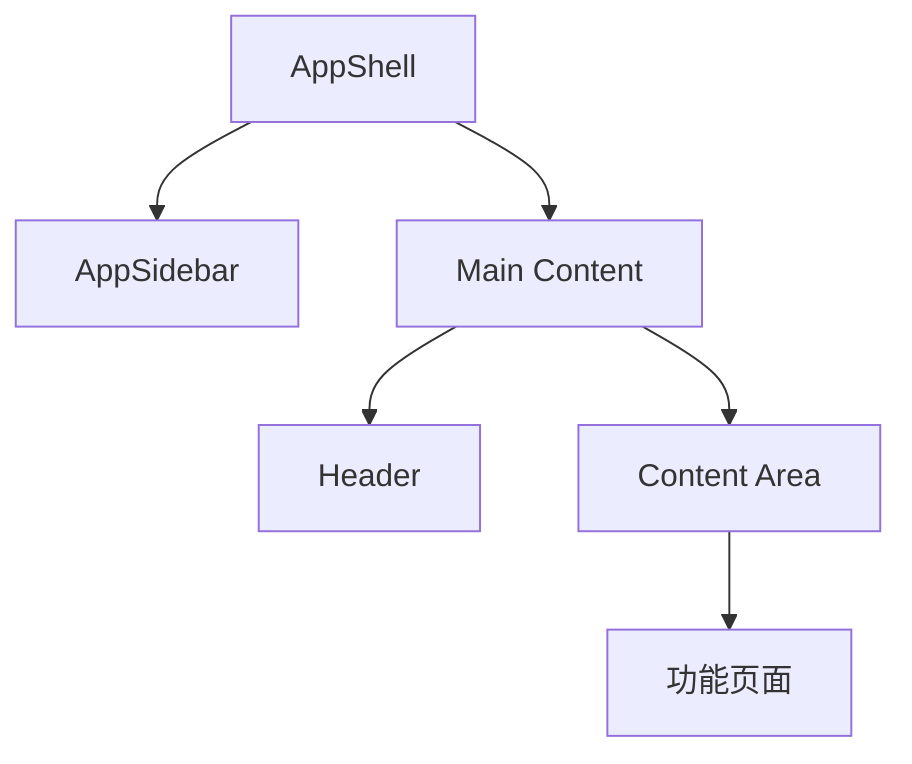
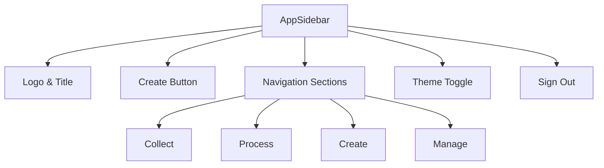
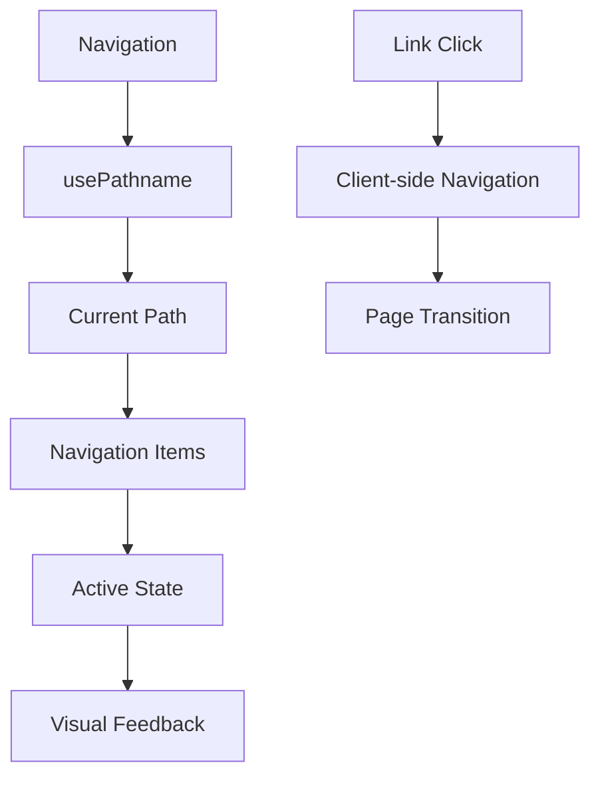
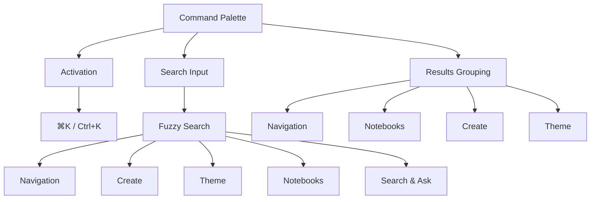

# 界面概览

<cite>
**本文档引用的文件**  
- [AppShell.tsx](file://frontend/src/components/layout/AppShell.tsx)
- [AppSidebar.tsx](file://frontend/src/components/layout/AppSidebar.tsx)
- [layout.tsx](file://frontend/src/app/(dashboard)/layout.tsx)
- [CommandPalette.tsx](file://frontend/src/components/common/CommandPalette.tsx)
- [ContextIndicator.tsx](file://frontend/src/components/common/ContextIndicator.tsx)
- [ThemeToggle.tsx](file://frontend/src/components/common/ThemeToggle.tsx)
- [theme-store.ts](file://frontend/src/lib/stores/theme-store.ts)
- [sidebar-store.ts](file://frontend/src/lib/stores/sidebar-store.ts)
- [page.tsx](file://frontend/src/app/(dashboard)/page.tsx)
- [notebooks/page.tsx](file://frontend/src/app/(dashboard)/notebooks/page.tsx)
- [sources/page.tsx](file://frontend/src/app/(dashboard)/sources/page.tsx)
- [search/page.tsx](file://frontend/src/app/(dashboard)/search/page.tsx)
- [podcasts/page.tsx](file://frontend/src/app/(dashboard)/podcasts/page.tsx)
</cite>

## 目录
1. [简介](#简介)
2. [整体布局与结构](#整体布局与结构)
3. [侧边栏功能详解](#侧边栏功能详解)
4. [主要功能区域](#主要功能区域)
5. [导航与路由机制](#导航与路由机制)
6. [主题切换与响应式设计](#主题切换与响应式设计)
7. [辅助交互元素](#辅助交互元素)
8. [总结](#总结)

## 简介
open-notebook 是一个隐私优先的研究与知识管理平台，其用户界面设计注重直观性与高效性。本文档全面介绍系统的用户界面，涵盖仪表板的整体布局、导航结构、侧边栏功能以及主要区域（如笔记本、内容源、搜索、播客等）的分布与交互逻辑。通过分析前端代码中的 AppShell 和 AppSidebar 组件，解释主题切换、响应式设计和路由导航的实现机制。同时介绍命令调色板、上下文指示器等辅助交互元素的作用，帮助新用户快速熟悉系统界面。

## 整体布局与结构
open-notebook 的用户界面采用经典的侧边栏主内容区布局，通过 AppShell 组件实现整体结构。AppShell 组件作为应用的外壳，包裹着侧边栏（AppSidebar）和主内容区域，确保界面的一致性和可扩展性。

主内容区采用 flex 布局，占据除侧边栏外的所有空间，支持垂直滚动以适应不同内容。这种布局设计使得用户可以在保持导航访问的同时，专注于当前任务的内容操作。



**Diagram sources**
- [AppShell.tsx](file://frontend/src/components/layout/AppShell.tsx#L1-L19)
- [layout.tsx](file://frontend/src/app/(dashboard)/layout.tsx#L1-L64)

**Section sources**
- [AppShell.tsx](file://frontend/src/components/layout/AppShell.tsx#L1-L19)

## 侧边栏功能详解
侧边栏（AppSidebar）是 open-notebook 的核心导航组件，提供系统的主要功能入口和全局操作。侧边栏支持折叠/展开状态，通过 useSidebarStore 状态管理实现持久化记忆，确保用户偏好在会话间保持一致。

侧边栏按功能分为四个主要区域：
- **Collect（收集）**：用于添加和管理内容源
- **Process（处理）**：用于组织和分析知识（笔记本、搜索）
- **Create（创建）**：用于生成内容（播客）
- **Manage（管理）**：用于系统配置和高级设置

侧边栏顶部的 "Create" 按钮提供快速创建功能，支持创建内容源、笔记本和播客。底部包含主题切换和退出登录功能，确保常用操作的便捷访问。



**Diagram sources**
- [AppSidebar.tsx](file://frontend/src/components/layout/AppSidebar.tsx#L1-L361)
- [sidebar-store.ts](file://frontend/src/lib/stores/sidebar-store.ts#L1-L21)

**Section sources**
- [AppSidebar.tsx](file://frontend/src/components/layout/AppSidebar.tsx#L1-L361)

## 主要功能区域
### 仪表板与默认路由
系统启动后，默认重定向到笔记本页面，体现了以笔记本为核心的知识组织理念。DashboardPage 组件通过 Next.js 的 redirect 函数实现这一行为，确保用户进入系统后立即进入主要工作区。

### 笔记本区域
笔记本页面是用户组织和管理知识的核心区域。页面提供搜索功能、刷新按钮和创建新笔记本的入口。通过 NotebookList 组件展示活动笔记本和归档笔记本，支持过滤和搜索功能，帮助用户快速定位所需内容。

### 内容源区域
内容源页面以表格形式展示所有已添加的内容源，支持键盘导航（方向键、Enter键）、排序和无限滚动加载。表格包含类型、标题、创建时间、洞察数量、嵌入状态等关键信息，并提供删除操作。这种设计使得用户可以高效地浏览和管理大量内容源。

### 搜索与问答区域
搜索页面提供两种模式：搜索和问答。搜索模式支持文本搜索和向量搜索，允许用户选择搜索范围（内容源、笔记）。问答模式（beta）利用大语言模型基于知识库回答用户问题，支持自定义模型配置和结果保存功能。

### 播客区域
播客页面采用标签页设计，分为"剧集"和"模板"两个视图。这种设计将内容生成（剧集）和内容模板管理清晰分离，提供直观的导航体验。

**Section sources**
- [page.tsx](file://frontend/src/app/(dashboard)/page.tsx#L1-L5)
- [notebooks/page.tsx](file://frontend/src/app/(dashboard)/notebooks/page.tsx#L1-L103)
- [sources/page.tsx](file://frontend/src/app/(dashboard)/sources/page.tsx#L1-L425)
- [search/page.tsx](file://frontend/src/app/(dashboard)/search/page.tsx#L1-L485)
- [podcasts/page.tsx](file://frontend/src/app/(dashboard)/podcasts/page.tsx#L1-L57)

## 导航与路由机制
系统采用基于 Next.js 的文件系统路由机制，路由结构清晰对应功能模块。AppSidebar 组件通过 usePathname 钩子检测当前路径，实现导航项的激活状态管理。

导航数据在组件内部定义为常量数组，包含标题、路由和图标信息。这种设计使得导航结构的维护更加集中和可预测。当用户点击导航项时，通过 Next.js 的 Link 组件实现客户端路由跳转，提供流畅的用户体验。



**Diagram sources**
- [AppSidebar.tsx](file://frontend/src/components/layout/AppSidebar.tsx#L1-L361)
- [navigation-store.ts](file://frontend/src/lib/stores/navigation-store.ts)

**Section sources**
- [AppSidebar.tsx](file://frontend/src/components/layout/AppSidebar.tsx#L1-L361)

## 主题切换与响应式设计
### 主题切换实现
主题切换功能通过 ThemeToggle 组件实现，支持三种模式：浅色、深色和系统默认。主题状态由 useThemeStore 管理，采用 zustand 的 persist 中间件实现持久化存储。

主题切换时，系统会直接操作 documentElement 的 classList，添加相应的主题类名（light/dark），并设置 data-theme 属性。这种实现方式确保了主题变更的即时性和一致性。

```mermaid
graph TD
A[ThemeToggle] --> B[Dropdown Menu]
B --> C[Light Option]
B --> D[Dark Option]
B --> E[System Option]
C --> F[setTheme('light')]
D --> G[setTheme('dark')]
E --> H[setTheme('system')]
F --> I[Update DOM Classes]
G --> I
H --> I
I --> J[Apply CSS Variables]
```

**Diagram sources**
- [ThemeToggle.tsx](file://frontend/src/components/common/ThemeToggle.tsx#L1-L61)
- [theme-store.ts](file://frontend/src/lib/stores/theme-store.ts#L1-L61)
- [ThemeProvider.tsx](file://frontend/src/components/providers/ThemeProvider.tsx#L1-L45)

### 响应式设计
系统采用响应式设计，适配不同屏幕尺寸。通过 useMediaQuery 钩子检测设备类型，调整界面布局和交互方式。侧边栏在小屏幕上可折叠，确保内容区域有足够的显示空间。

对于键盘用户的优化也体现了响应式设计理念，如内容源页面支持键盘导航，提高操作效率。这种多维度的响应式设计确保了系统在不同设备和使用场景下的可用性。

**Section sources**
- [ThemeToggle.tsx](file://frontend/src/components/common/ThemeToggle.tsx#L1-L61)
- [theme-store.ts](file://frontend/src/lib/stores/theme-store.ts#L1-L61)
- [use-media-query.ts](file://frontend/src/lib/hooks/use-media-query.ts#L1-L33)

## 辅助交互元素
### 命令调色板
命令调色板（CommandPalette）是系统的核心辅助交互元素，通过 ⌘K / Ctrl+K 快捷键激活。它提供全局搜索、导航、创建和主题切换功能，显著提高高级用户的操作效率。

命令调色板支持模糊搜索，能够匹配导航项、创建操作、主题选项和笔记本名称。根据搜索内容智能调整显示顺序，当查询与特定命令匹配时优先显示相关操作，否则优先显示搜索/问答选项。



**Diagram sources**
- [CommandPalette.tsx](file://frontend/src/components/common/CommandPalette.tsx#L1-L282)

### 上下文指示器
上下文指示器（ContextIndicator）显示当前会话中包含的上下文信息，包括洞察源数量、完整源数量、笔记数量以及令牌和字符计数。当没有上下文时，显示提示信息指导用户如何添加上下文。

指示器采用徽章（Badge）形式展示不同类型的内容数量，通过不同图标和颜色区分。这种设计使得用户能够快速了解当前上下文状态，对于问答和搜索功能尤为重要。

**Section sources**
- [CommandPalette.tsx](file://frontend/src/components/common/CommandPalette.tsx#L1-L282)
- [ContextIndicator.tsx](file://frontend/src/components/common/ContextIndicator.tsx#L1-L117)

## 总结
open-notebook 的用户界面设计体现了现代 Web 应用的最佳实践，通过清晰的布局、直观的导航和高效的交互元素，为用户提供流畅的知识管理体验。AppShell 和 AppSidebar 组件构建了稳定的应用框架，而命令调色板和上下文指示器等辅助元素则显著提升了高级用户的操作效率。

系统的主题切换和响应式设计确保了在不同环境下的可用性，而基于文件系统的路由机制和状态管理提供了可维护的代码结构。整体界面设计以用户为中心，平衡了功能丰富性和使用简洁性，使用户能够专注于知识的收集、处理和创造。

**Section sources**
- [AppShell.tsx](file://frontend/src/components/layout/AppShell.tsx#L1-L19)
- [AppSidebar.tsx](file://frontend/src/components/layout/AppSidebar.tsx#L1-L361)
- [CommandPalette.tsx](file://frontend/src/components/common/CommandPalette.tsx#L1-L282)