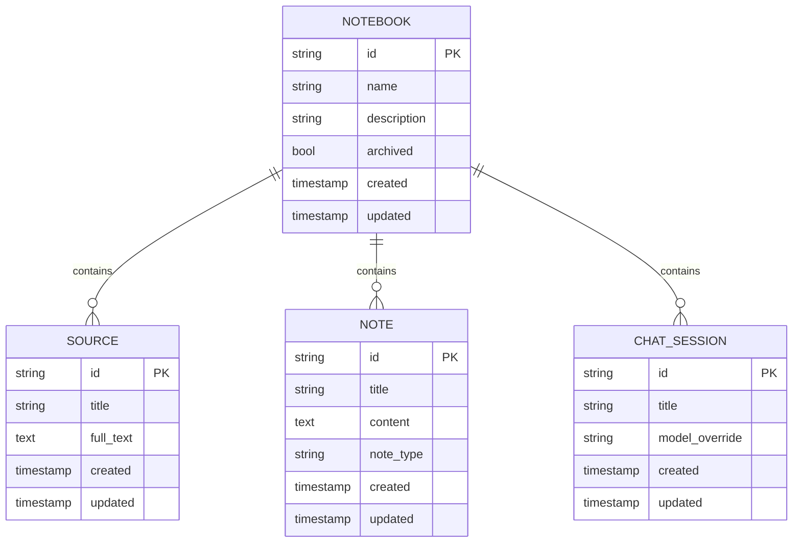
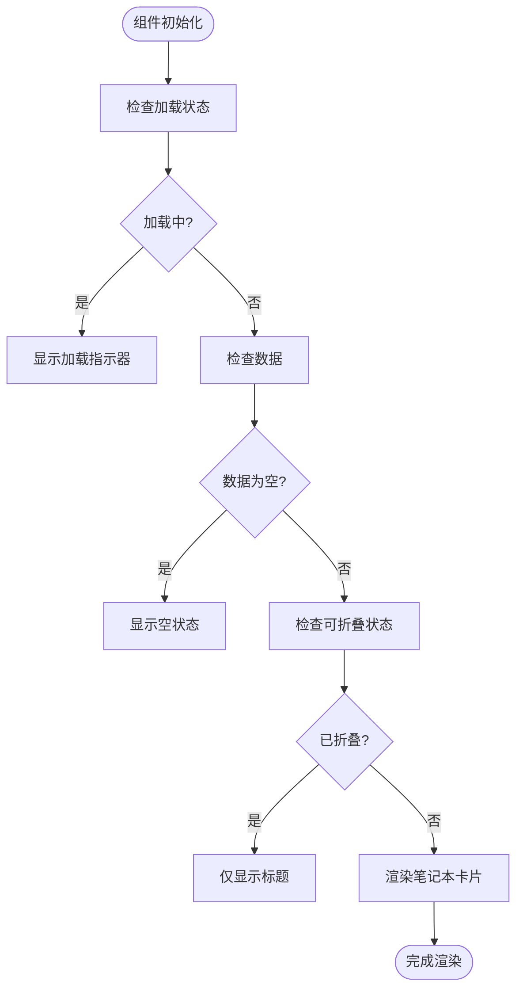
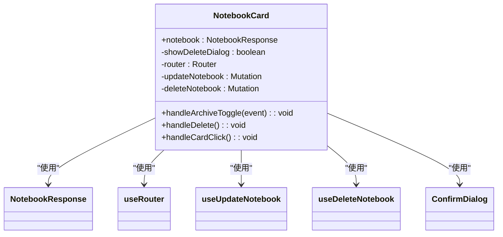
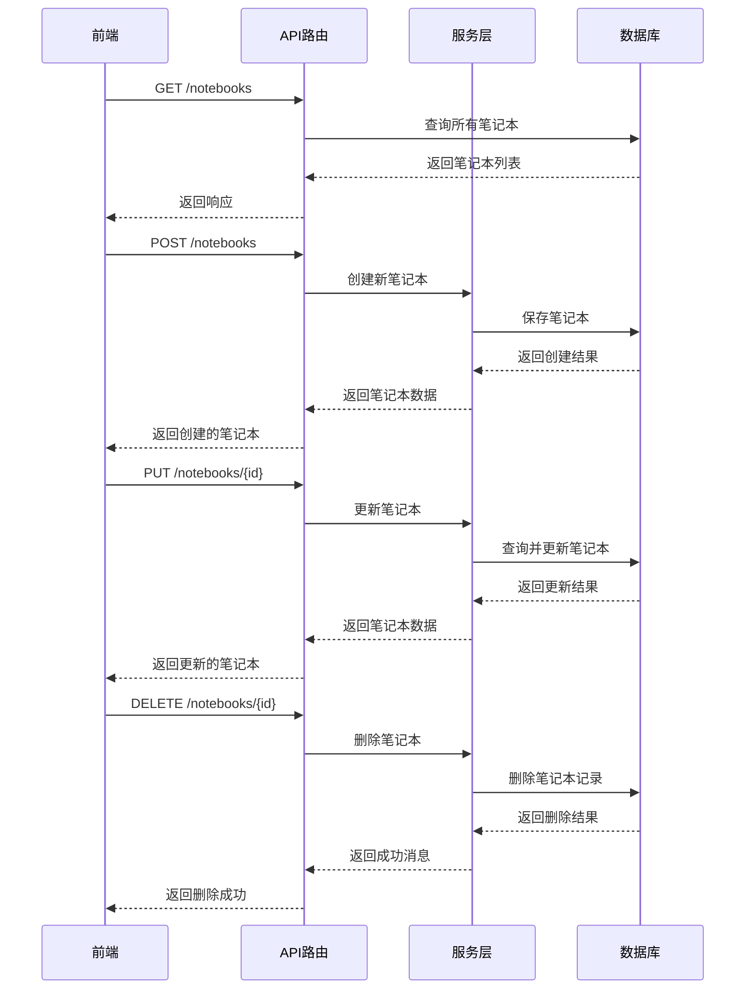
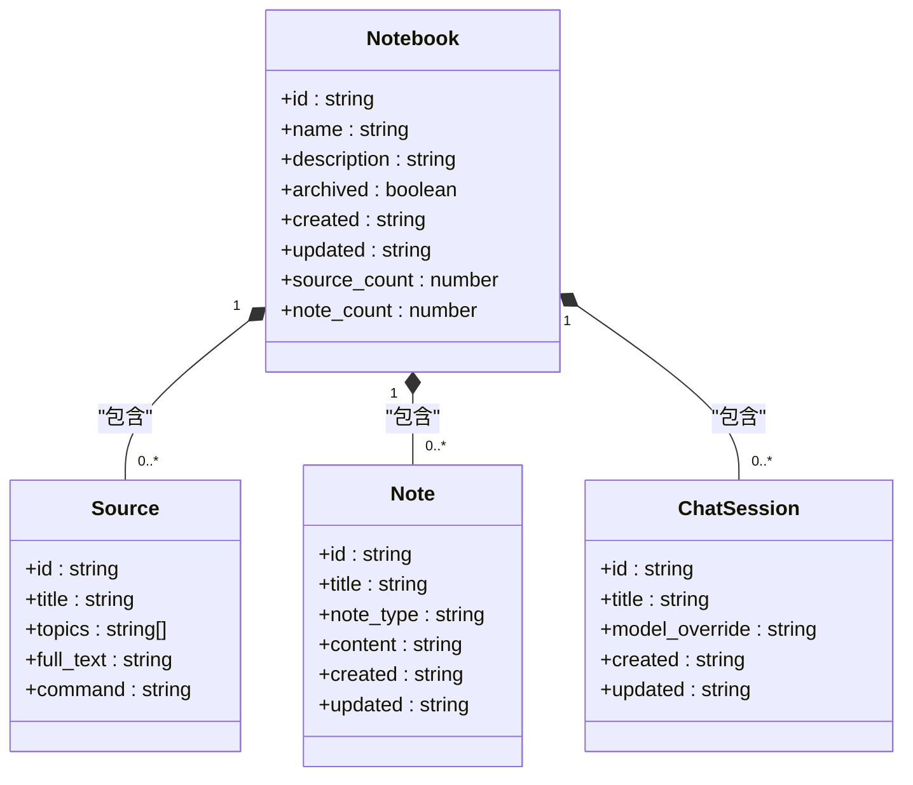
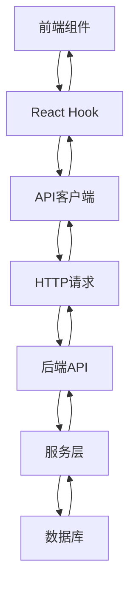
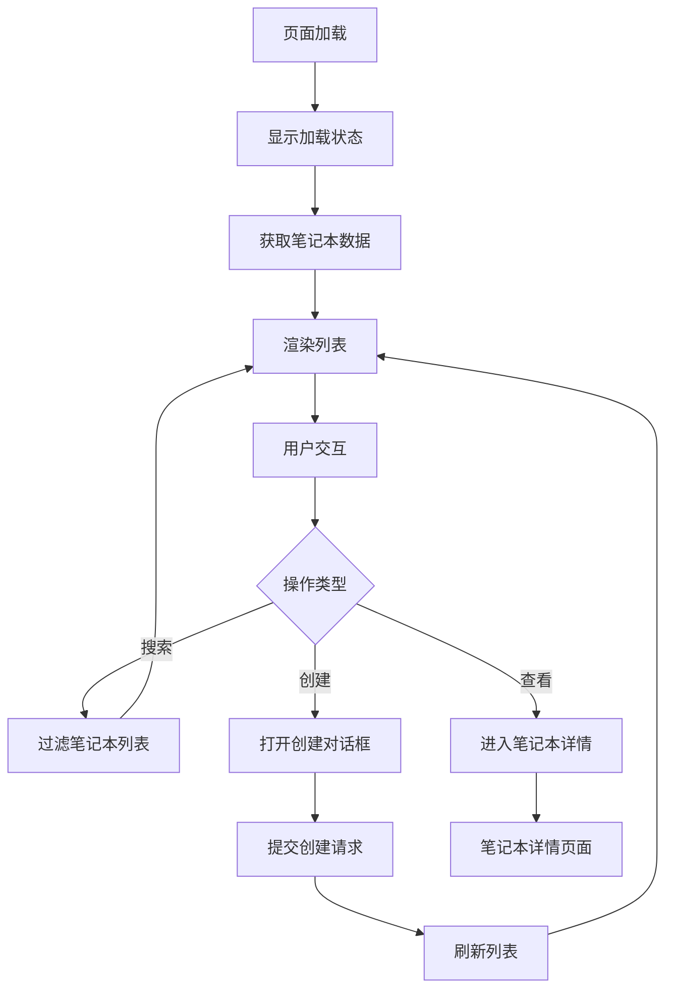
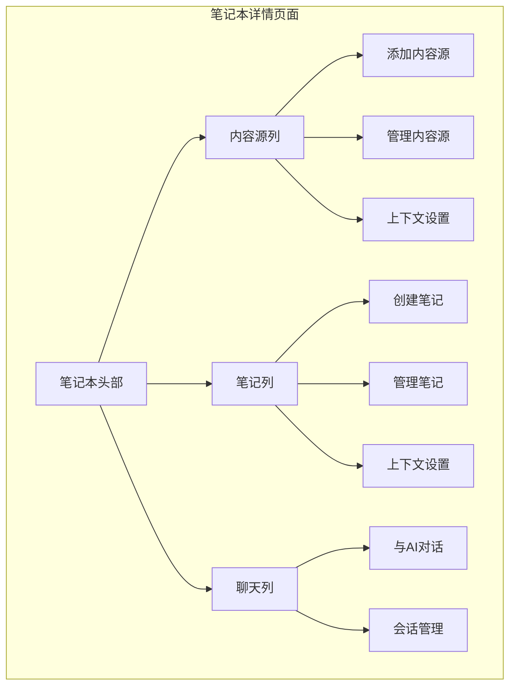
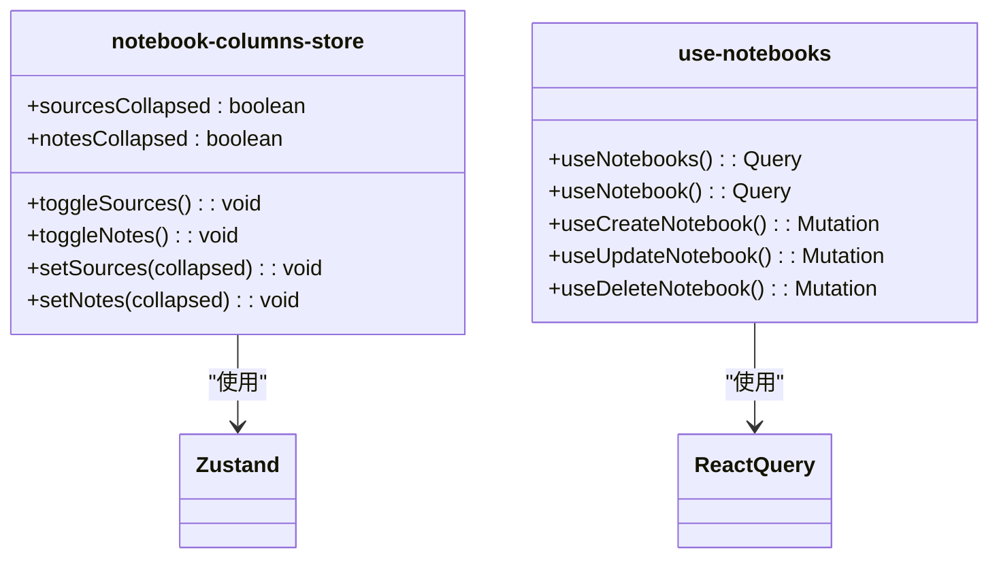
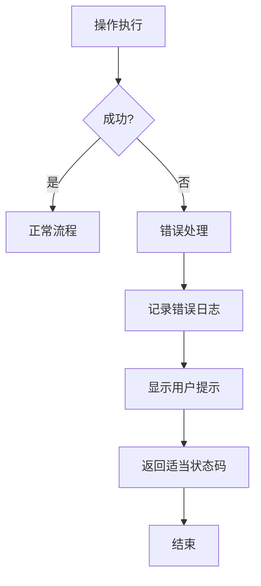

# 笔记本管理

<cite>
**本文档引用的文件**   
- [notebooks.py](file://api/routers/notebooks.py)
- [notebook.py](file://open_notebook/domain/notebook.py)
- [models.py](file://api/models.py)
- [page.tsx](file://frontend/src/app/(dashboard)/notebooks/page.tsx)
- [NotebookList.tsx](file://frontend/src/app/(dashboard)/notebooks/components/NotebookList.tsx)
- [NotebookCard.tsx](file://frontend/src/app/(dashboard)/notebooks/components/NotebookCard.tsx)
- [notebooks.ts](file://frontend/src/lib/api/notebooks.ts)
- [use-notebooks.ts](file://frontend/src/lib/hooks/use-notebooks.ts)
- [NotebookHeader.tsx](file://frontend/src/app/(dashboard)/notebooks/components/NotebookHeader.tsx)
- [SourcesColumn.tsx](file://frontend/src/app/(dashboard)/notebooks/components/SourcesColumn.tsx)
- [NotesColumn.tsx](file://frontend/src/app/(dashboard)/notebooks/components/NotesColumn.tsx)
- [ChatColumn.tsx](file://frontend/src/app/(dashboard)/notebooks/components/ChatColumn.tsx)
- [notebook-columns-store.ts](file://frontend/src/lib/stores/notebook-columns-store.ts)
</cite>

## 目录
1. [简介](#简介)
2. [笔记本核心功能](#笔记本核心功能)
3. [前端组件分析](#前端组件分析)
4. [后端API路由](#后端api路由)
5. [数据模型与服务](#数据模型与服务)
6. [用户交互流程](#用户交互流程)
7. [状态管理与错误处理](#状态管理与错误处理)
8. [实际操作示例](#实际操作示例)
9. [结论](#结论)

## 简介
笔记本是本系统中内容组织的核心单元，用于将相关的资料、笔记和AI对话整合在一起。用户可以通过笔记本来管理研究项目、知识库或任何需要组织的信息集合。每个笔记本可以包含多个内容源（如网页、文档、音频等）、笔记和与AI的对话记录。

笔记本系统提供了完整的CRUD（创建、读取、更新、删除）操作，支持对笔记本进行重命名、归档和删除。用户可以在笔记本界面中切换不同的视图模式，管理列布局，并与内容进行交互。系统还实现了完善的状态管理和错误处理机制，确保用户体验的流畅性。

**Section sources**
- [notebooks.py](file://api/routers/notebooks.py#L1-L276)
- [notebook.py](file://open_notebook/domain/notebook.py#L1-L457)

## 笔记本核心功能

### 笔记本作为内容组织核心单元
笔记本在系统中扮演着内容组织中心的角色，主要功能包括：

1. **内容聚合**：将不同类型的内容源（网页、文档、音频等）和用户创建的笔记集中管理
2. **上下文关联**：为AI聊天提供上下文环境，使对话能够基于笔记本内的具体内容进行
3. **知识管理**：通过归档功能对已完成或不再活跃的笔记本进行分类管理
4. **统计信息**：显示每个笔记本中包含的内容源数量和笔记数量，便于用户快速了解笔记本的丰富程度

笔记本与系统其他组件的关联方式如下：
- **与内容源的关联**：通过`reference`关系将内容源链接到笔记本，一个内容源可以被多个笔记本引用
- **与笔记的关联**：通过`artifact`关系将笔记添加到笔记本，实现笔记的跨笔记本组织
- **与AI聊天的关联**：通过`refers_to`关系将聊天会话与笔记本关联，保持对话的上下文一致性

**Diagram sources**
- [notebook.py](file://open_notebook/domain/notebook.py#L16-L457)
- [notebooks.py](file://api/routers/notebooks.py#L14-L276)

### 核心操作流程
笔记本系统支持以下核心操作流程：

1. **创建笔记本**：用户可以创建新的笔记本，输入名称和描述
2. **编辑笔记本**：支持修改笔记本的名称和描述
3. **重命名笔记本**：通过修改名称字段实现重命名功能
4. **删除笔记本**：永久删除笔记本及其所有关联内容
5. **归档/取消归档**：将笔记本标记为归档状态或恢复为活跃状态

这些操作都通过RESTful API接口实现，前端通过HTTP请求与后端交互，后端处理请求并返回相应的响应。

**Section sources**
- [notebooks.py](file://api/routers/notebooks.py#L56-L276)
- [notebook.py](file://open_notebook/domain/notebook.py#L16-L457)

## 前端组件分析

### NotebookList组件
`NotebookList`组件负责渲染笔记本列表，其主要功能包括：

1. **列表渲染**：根据传入的笔记本数据数组，使用`map`方法生成多个`NotebookCard`组件
2. **加载状态**：在数据加载时显示加载指示器
3. **空状态处理**：当没有笔记本时显示友好的空状态提示
4. **可折叠功能**：支持将列表折叠为标题行，节省界面空间
5. **搜索过滤**：根据搜索关键词过滤显示的笔记本

组件通过`useMemo`优化性能，仅在笔记本数据或搜索关键词变化时重新计算过滤结果。

**Diagram sources**
- [NotebookList.tsx](file://frontend/src/app/(dashboard)/notebooks/components/NotebookList.tsx#L1-L78)
- [page.tsx](file://frontend/src/app/(dashboard)/notebooks/page.tsx#L1-L103)

### NotebookCard组件
`NotebookCard`组件用于显示单个笔记本的详细信息和交互功能，其主要特性包括：

1. **基本信息展示**：显示笔记本名称、描述、更新时间和内容统计
2. **交互功能**：
   - 点击卡片进入笔记本详情页面
   - 通过下拉菜单进行归档/取消归档操作
   - 删除笔记本功能
3. **视觉反馈**：
   - 鼠标悬停时显示操作按钮
   - 归档状态通过徽章标识
   - 内容统计通过图标和数字显示

组件使用`useRouter`进行页面导航，通过`useUpdateNotebook`和`useDeleteNotebook`钩子处理更新和删除操作，并使用`ConfirmDialog`组件确保删除操作的安全性。

**Diagram sources**
- [NotebookCard.tsx](file://frontend/src/app/(dashboard)/notebooks/components/NotebookCard.tsx#L1-L142)
- [models.py](file://api/models.py#L20-L29)

## 后端API路由

### API端点分析
`notebooks.py`文件定义了笔记本相关的所有API端点，采用FastAPI框架实现RESTful接口。

**Diagram sources**
- [notebooks.py](file://api/routers/notebooks.py#L14-L276)
- [notebook.py](file://open_notebook/domain/notebook.py#L16-L457)

### 主要API端点
系统提供了以下主要API端点：

1. **获取笔记本列表** (`GET /notebooks`)
   - 支持按归档状态过滤
   - 支持自定义排序
   - 返回包含内容源和笔记数量统计的笔记本列表

2. **创建笔记本** (`POST /notebooks`)
   - 接收笔记本创建请求
   - 验证输入数据
   - 创建新笔记本并保存到数据库
   - 返回创建的笔记本信息

3. **获取单个笔记本** (`GET /notebooks/{notebook_id}`)
   - 根据ID获取特定笔记本
   - 返回包含统计信息的笔记本详情

4. **更新笔记本** (`PUT /notebooks/{notebook_id}`)
   - 支持部分更新（仅更新提供的字段）
   - 验证输入数据
   - 更新笔记本信息

5. **删除笔记本** (`DELETE /notebooks/{notebook_id}`)
   - 验证笔记本存在性
   - 从数据库删除笔记本记录

6. **管理内容源关联** 
   - `POST /notebooks/{notebook_id}/sources/{source_id}`: 添加内容源到笔记本
   - `DELETE /notebooks/{notebook_id}/sources/{source_id}`: 从笔记本移除内容源

**Section sources**
- [notebooks.py](file://api/routers/notebooks.py#L14-L276)

## 数据模型与服务

### 数据模型定义
系统定义了清晰的数据模型来表示笔记本及其相关实体。

**Diagram sources**
- [models.py](file://api/models.py#L20-L29)
- [notebook.py](file://open_notebook/domain/notebook.py#L16-L457)

### 服务层交互
前端通过API客户端与后端服务进行交互，使用React Query进行状态管理。

**Diagram sources**
- [use-notebooks.ts](file://frontend/src/lib/hooks/use-notebooks.ts#L1-L91)
- [notebooks.ts](file://frontend/src/lib/api/notebooks.ts#L1-L38)

## 用户交互流程

### 笔记本列表页面
笔记本列表页面提供了管理所有笔记本的入口，其交互流程如下：

1. **页面加载**：
   - 显示加载指示器
   - 并行获取活跃和归档的笔记本列表

2. **搜索功能**：
   - 实时过滤笔记本列表
   - 支持模糊匹配笔记本名称

3. **创建新笔记本**：
   - 点击"New Notebook"按钮
   - 显示创建对话框
   - 输入名称和描述
   - 提交创建请求

4. **列表展示**：
   - 分组显示活跃和归档的笔记本
   - 显示每个笔记本的内容统计

**Diagram sources**
- [page.tsx](file://frontend/src/app/(dashboard)/notebooks/page.tsx#L1-L103)
- [NotebookList.tsx](file://frontend/src/app/(dashboard)/notebooks/components/NotebookList.tsx#L1-L78)

### 笔记本详情页面
笔记本详情页面提供了完整的笔记本管理功能，其布局和交互如下：

1. **三栏布局**：
   - 左侧：内容源列表
   - 中间：笔记列表
   - 右侧：AI聊天界面

2. **响应式设计**：
   - 桌面端：三栏并排显示
   - 移动端：标签页切换显示

3. **列折叠功能**：
   - 可以折叠单个列以扩大其他列的显示空间
   - 折叠状态在用户会话间持久化

4. **上下文管理**：
   - 可以为每个内容源和笔记设置上下文模式
   - 影响AI聊天时使用的上下文内容

**Diagram sources**
- [page.tsx](file://frontend/src/app/(dashboard)/notebooks/[id]/page.tsx#L1-L225)
- [SourcesColumn.tsx](file://frontend/src/app/(dashboard)/notebooks/components/SourcesColumn.tsx#L1-L225)
- [NotesColumn.tsx](file://frontend/src/app/(dashboard)/notebooks/components/NotesColumn.tsx#L1-L219)
- [ChatColumn.tsx](file://frontend/src/app/(dashboard)/notebooks/components/ChatColumn.tsx#L1-L116)

## 状态管理与错误处理

### 状态管理机制
系统使用多种机制来管理用户界面状态：

1. **React状态**：
   - 使用`useState`管理组件内部状态
   - 使用`useMemo`优化性能

2. **全局状态**：
   - 使用Zustand管理跨组件的状态
   - 笔记本列的折叠状态持久化存储

3. **数据状态**：
   - 使用React Query管理API数据状态
   - 自动处理加载、错误和缓存

**Diagram sources**
- [notebook-columns-store.ts](file://frontend/src/lib/stores/notebook-columns-store.ts#L1-L28)
- [use-notebooks.ts](file://frontend/src/lib/hooks/use-notebooks.ts#L1-L91)

### 错误处理场景
系统实现了完善的错误处理机制：

1. **前端错误处理**：
   - 使用React Query的错误处理钩子
   - 显示友好的错误提示
   - 记录错误日志

2. **后端错误处理**：
   - 使用try-catch捕获异常
   - 记录详细的错误日志
   - 返回适当的HTTP状态码

3. **常见错误场景**：
   - 笔记本不存在（404）
   - 输入数据无效（400）
   - 服务器内部错误（500）
   - 网络连接问题

**Section sources**
- [notebooks.py](file://api/routers/notebooks.py#L49-L53)
- [use-notebooks.ts](file://frontend/src/lib/hooks/use-notebooks.ts#L35-L41)

## 实际操作示例

### 创建笔记本
1. 在笔记本列表页面点击"New Notebook"按钮
2. 在弹出的对话框中输入笔记本名称和描述
3. 点击"Create"按钮
4. 系统创建笔记本并刷新列表

### 打开笔记本
1. 在笔记本列表中点击目标笔记本卡片
2. 系统导航到笔记本详情页面
3. 页面加载笔记本的内容源、笔记和聊天记录

### 切换视图模式
**桌面端**：
- 三栏布局默认展开
- 可以点击列标题的折叠按钮收起单个列

**移动端**：
- 显示标签页导航
- 可以在"Sources"、"Notes"和"Chat"之间切换

### 管理列布局
1. 点击列标题右侧的折叠按钮
2. 该列将收起，其他列自动扩展以填充空间
3. 再次点击按钮可恢复列的显示
4. 折叠状态在浏览器中持久化保存

### 重命名笔记本
1. 在笔记本详情页面点击笔记本名称
2. 在弹出的编辑框中输入新名称
3. 按Enter键或点击外部区域确认更改
4. 系统更新笔记本名称并保存

### 删除笔记本
1. 点击笔记本卡片上的"More"按钮
2. 选择"Delete"选项
3. 在确认对话框中点击"Delete"按钮
4. 系统删除笔记本并刷新列表

**Section sources**
- [NotebookCard.tsx](file://frontend/src/app/(dashboard)/notebooks/components/NotebookCard.tsx#L1-L142)
- [NotebookHeader.tsx](file://frontend/src/app/(dashboard)/notebooks/components/NotebookHeader.tsx#L1-L128)

## 结论
笔记本管理系统为用户提供了一个强大而灵活的内容组织工具。通过前后端的紧密协作，系统实现了完整的笔记本管理功能，包括创建、编辑、重命名和删除等操作。前端组件提供了直观的用户界面，后端API确保了数据的一致性和可靠性。

系统的关键优势包括：
1. **直观的用户界面**：卡片式设计和清晰的交互流程
2. **强大的内容关联**：笔记本作为内容组织的核心单元
3. **灵活的布局管理**：支持列折叠和响应式设计
4. **完善的状态管理**：确保用户体验的流畅性
5. **健壮的错误处理**：提供可靠的系统稳定性

通过笔记本系统，用户可以有效地组织和管理他们的知识库，为研究、学习和创作提供有力支持。