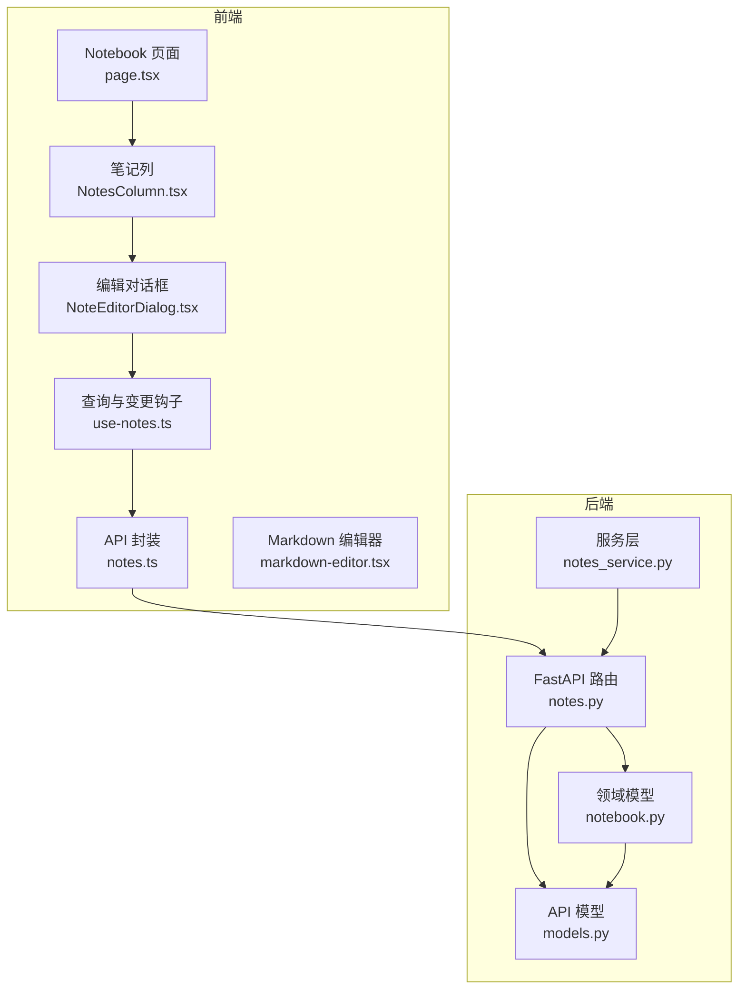
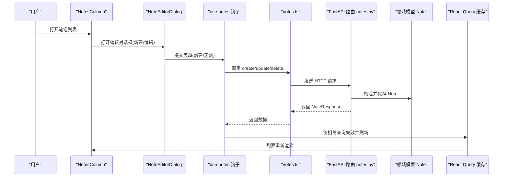
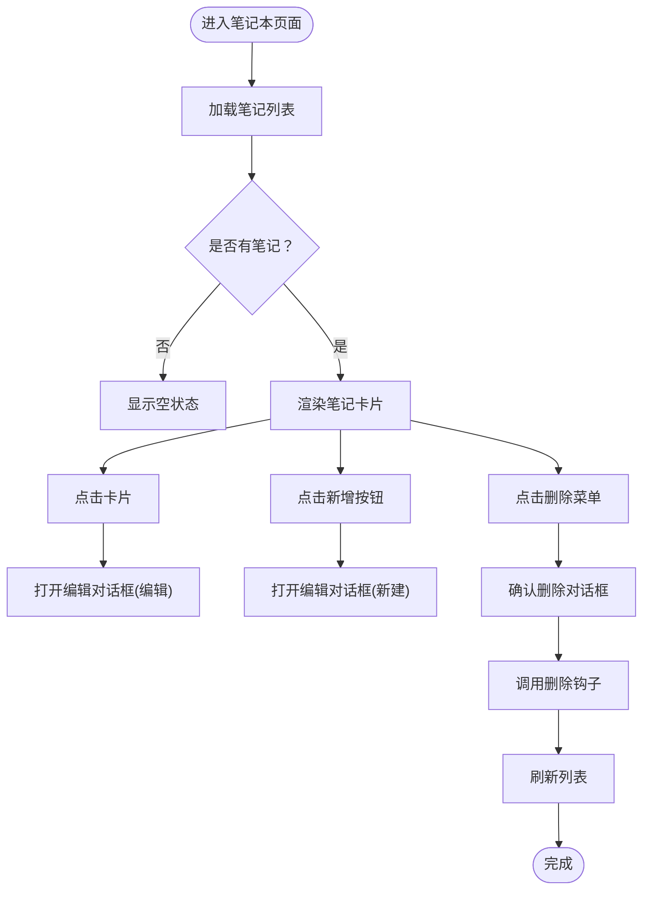
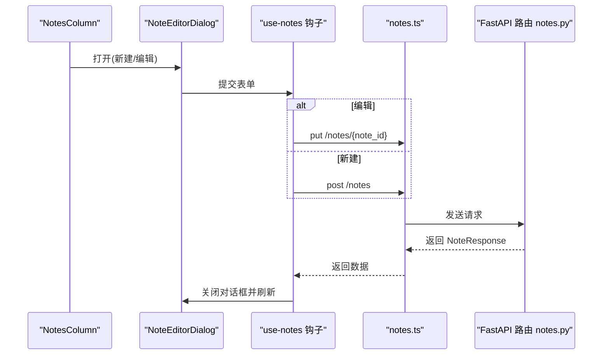
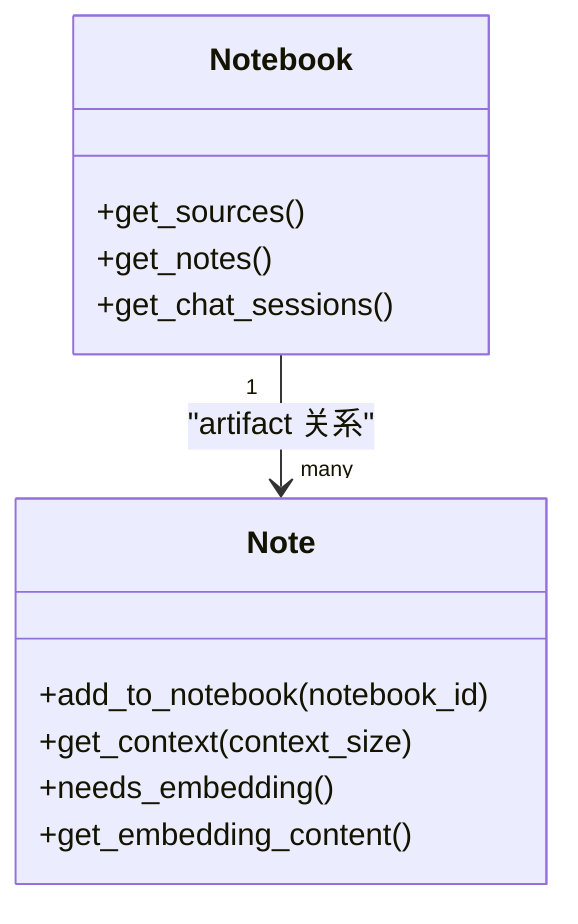
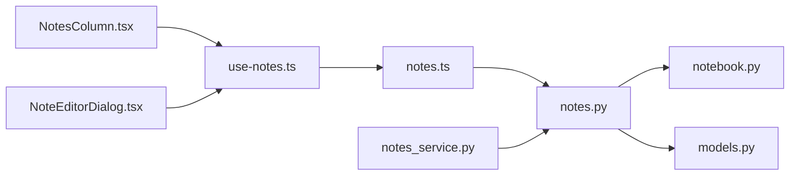

# 笔记管理

<cite>
**本文引用的文件**
- [frontend/src/app/(dashboard)/notebooks/[id]/page.tsx](file://frontend/src/app/(dashboard)/notebooks/[id]/page.tsx)
- [frontend/src/app/(dashboard)/notebooks/components/NotesColumn.tsx](file://frontend/src/app/(dashboard)/notebooks/components/NotesColumn.tsx)
- [frontend/src/app/(dashboard)/notebooks/components/NoteEditorDialog.tsx](file://frontend/src/app/(dashboard)/notebooks/components/NoteEditorDialog.tsx)
- [frontend/src/lib/hooks/use-notes.ts](file://frontend/src/lib/hooks/use-notes.ts)
- [frontend/src/lib/api/notes.ts](file://frontend/src/lib/api/notes.ts)
- [frontend/src/components/ui/markdown-editor.tsx](file://frontend/src/components/ui/markdown-editor.tsx)
- [api/routers/notes.py](file://api/routers/notes.py)
- [api/notes_service.py](file://api/notes_service.py)
- [open_notebook/domain/notebook.py](file://open_notebook/domain/notebook.py)
- [api/models.py](file://api/models.py)
- [docs/user-guide/notes.md](file://docs/user-guide/notes.md)
</cite>

## 目录
1. [简介](#简介)
2. [项目结构](#项目结构)
3. [核心组件](#核心组件)
4. [架构总览](#架构总览)
5. [详细组件分析](#详细组件分析)
6. [依赖关系分析](#依赖关系分析)
7. [性能考量](#性能考量)
8. [故障排查指南](#故障排查指南)
9. [结论](#结论)
10. [附录](#附录)

## 简介
本操作手册面向使用者，系统讲解“笔记管理”的完整流程：在笔记本中创建、编辑、删除笔记；说明 NotesColumn 组件如何展示笔记列表；说明 NoteEditorDialog 如何提供富文本编辑界面；并通过 notes.py 的 API 路由揭示后端数据持久化逻辑，包括笔记与笔记本的归属关系、内容格式化处理等。同时介绍笔记的自动保存机制、版本控制现状、以及与聊天记录、搜索结果的联动方式，帮助用户高效组织个人知识。

## 项目结构
- 前端位于 frontend/src，包含笔记本页面、笔记列、编辑对话框、查询与 API 封装、Markdown 编辑器等。
- 后端位于 api/，包含 FastAPI 路由 notes.py、服务层 notes_service.py、领域模型 notebook.py（含 Note 类）、API 模型定义 models.py。
- 文档位于 docs/user-guide/notes.md，提供用户使用指南与最佳实践。



图表来源
- [frontend/src/app/(dashboard)/notebooks/[id]/page.tsx](file://frontend/src/app/(dashboard)/notebooks/[id]/page.tsx#L1-L225)
- [frontend/src/app/(dashboard)/notebooks/components/NotesColumn.tsx](file://frontend/src/app/(dashboard)/notebooks/components/NotesColumn.tsx#L1-L219)
- [frontend/src/app/(dashboard)/notebooks/components/NoteEditorDialog.tsx](file://frontend/src/app/(dashboard)/notebooks/components/NoteEditorDialog.tsx#L1-L171)
- [frontend/src/lib/hooks/use-notes.ts](file://frontend/src/lib/hooks/use-notes.ts#L1-L97)
- [frontend/src/lib/api/notes.ts](file://frontend/src/lib/api/notes.ts#L1-L28)
- [frontend/src/components/ui/markdown-editor.tsx](file://frontend/src/components/ui/markdown-editor.tsx#L1-L41)
- [api/routers/notes.py](file://api/routers/notes.py#L1-L180)
- [api/notes_service.py](file://api/notes_service.py#L1-L100)
- [open_notebook/domain/notebook.py](file://open_notebook/domain/notebook.py#L353-L388)
- [api/models.py](file://api/models.py#L169-L192)

章节来源
- [frontend/src/app/(dashboard)/notebooks/[id]/page.tsx](file://frontend/src/app/(dashboard)/notebooks/[id]/page.tsx#L1-L225)
- [api/routers/notes.py](file://api/routers/notes.py#L1-L180)

## 核心组件
- 笔记列表展示：NotesColumn 负责渲染笔记卡片、上下文切换、删除确认与新增入口。
- 富文本编辑：NoteEditorDialog 提供标题内联编辑与 Markdown 编辑器，支持新建与更新。
- 查询与变更：use-notes.ts 提供 React Query 的查询、创建、更新、删除钩子，并统一处理成功/失败提示与缓存失效。
- API 封装：notes.ts 对 /notes 接口进行封装，供前端调用。
- 后端路由：notes.py 定义 GET/POST/PUT/DELETE /notes 与 /notes/{note_id}，实现笔记的增删改查与笔记本关联。
- 领域模型：notebook.py 中的 Note 类负责笔记实体、上下文提取与向量化内容准备。
- API 模型：models.py 中的 NoteCreate/NoteUpdate/NoteResponse 定义请求与响应结构。

章节来源
- [frontend/src/app/(dashboard)/notebooks/components/NotesColumn.tsx](file://frontend/src/app/(dashboard)/notebooks/components/NotesColumn.tsx#L1-L219)
- [frontend/src/app/(dashboard)/notebooks/components/NoteEditorDialog.tsx](file://frontend/src/app/(dashboard)/notebooks/components/NoteEditorDialog.tsx#L1-L171)
- [frontend/src/lib/hooks/use-notes.ts](file://frontend/src/lib/hooks/use-notes.ts#L1-L97)
- [frontend/src/lib/api/notes.ts](file://frontend/src/lib/api/notes.ts#L1-L28)
- [api/routers/notes.py](file://api/routers/notes.py#L1-L180)
- [open_notebook/domain/notebook.py](file://open_notebook/domain/notebook.py#L353-L388)
- [api/models.py](file://api/models.py#L169-L192)

## 架构总览
从前端到后端的数据流如下：
- 用户在 NotesColumn 中点击“写笔记”或打开已有笔记，NoteEditorDialog 弹出。
- 用户输入标题与内容，提交时触发 use-notes.ts 的 useCreateNote 或 useUpdateNote。
- 钩子通过 notes.ts 调用 /notes 或 /notes/{note_id}。
- FastAPI 路由 notes.py 处理请求，校验参数、调用领域模型 Note 并持久化。
- 若提供 notebook_id，则将笔记与笔记本建立“artifact”关系。
- 前端收到响应后，通过 React Query 使相关查询失效并刷新 UI。



图表来源
- [frontend/src/app/(dashboard)/notebooks/components/NotesColumn.tsx](file://frontend/src/app/(dashboard)/notebooks/components/NotesColumn.tsx#L1-L219)
- [frontend/src/app/(dashboard)/notebooks/components/NoteEditorDialog.tsx](file://frontend/src/app/(dashboard)/notebooks/components/NoteEditorDialog.tsx#L1-L171)
- [frontend/src/lib/hooks/use-notes.ts](file://frontend/src/lib/hooks/use-notes.ts#L1-L97)
- [frontend/src/lib/api/notes.ts](file://frontend/src/lib/api/notes.ts#L1-L28)
- [api/routers/notes.py](file://api/routers/notes.py#L1-L180)
- [open_notebook/domain/notebook.py](file://open_notebook/domain/notebook.py#L353-L388)

## 详细组件分析

### NotesColumn 组件：笔记列表展示与交互
- 功能要点
  - 展示笔记列表：按更新时间倒序显示，支持类型徽章（人类/AI）、时间戳、上下文开关、删除菜单。
  - 新建与编辑：点击卡片打开编辑对话框；新增按钮弹出新建对话框。
  - 删除：通过 ConfirmDialog 确认，调用 use-delete-note 触发 DELETE /notes/{note_id}。
  - 响应式布局：桌面端可折叠列，移动端以标签页切换。
- 关键交互
  - 右上角下拉菜单提供删除选项。
  - 上下文切换通过 ContextToggle 控制笔记在聊天中的呈现模式。
  - 使用 use-notes 的 useNotes 查询加载笔记列表。



图表来源
- [frontend/src/app/(dashboard)/notebooks/components/NotesColumn.tsx](file://frontend/src/app/(dashboard)/notebooks/components/NotesColumn.tsx#L1-L219)
- [frontend/src/lib/hooks/use-notes.ts](file://frontend/src/lib/hooks/use-notes.ts#L74-L97)
- [frontend/src/lib/api/notes.ts](file://frontend/src/lib/api/notes.ts#L25-L28)

章节来源
- [frontend/src/app/(dashboard)/notebooks/components/NotesColumn.tsx](file://frontend/src/app/(dashboard)/notebooks/components/NotesColumn.tsx#L1-L219)
- [frontend/src/lib/hooks/use-notes.ts](file://frontend/src/lib/hooks/use-notes.ts#L1-L97)

### NoteEditorDialog 组件：富文本编辑界面
- 功能要点
  - 标题内联编辑：支持空标题时显示占位符。
  - 内容编辑：使用 MarkdownEditor，支持预览与实时编辑。
  - 表单校验：使用 zodResolver 校验标题可选、内容必填。
  - 自动保存：提交时根据是否为编辑态选择 PUT 或 POST；成功后使相关查询失效并关闭对话框。
  - 笔记类型：默认 human；AI 生成笔记由后端自动补全标题。
- 关键行为
  - 打开时根据是否传入 note 加载对应数据；编辑态加载单个笔记详情。
  - 提交时携带 notebook_id（新建时必须），用于建立笔记与笔记本的关系。



图表来源
- [frontend/src/app/(dashboard)/notebooks/components/NoteEditorDialog.tsx](file://frontend/src/app/(dashboard)/notebooks/components/NoteEditorDialog.tsx#L1-L171)
- [frontend/src/lib/hooks/use-notes.ts](file://frontend/src/lib/hooks/use-notes.ts#L24-L71)
- [frontend/src/lib/api/notes.ts](file://frontend/src/lib/api/notes.ts#L15-L24)
- [api/routers/notes.py](file://api/routers/notes.py#L48-L102)

章节来源
- [frontend/src/app/(dashboard)/notebooks/components/NoteEditorDialog.tsx](file://frontend/src/app/(dashboard)/notebooks/components/NoteEditorDialog.tsx#L1-L171)
- [frontend/src/components/ui/markdown-editor.tsx](file://frontend/src/components/ui/markdown-editor.tsx#L1-L41)
- [frontend/src/lib/hooks/use-notes.ts](file://frontend/src/lib/hooks/use-notes.ts#L1-L97)

### 后端数据持久化逻辑：notes.py API 路由
- GET /notes
  - 支持按 notebook_id 过滤；未提供则返回所有笔记，按 updated 倒序。
  - 返回 NoteResponse 结构，包含 id、title、content、note_type、created、updated。
- POST /notes
  - 创建新笔记；若 note_type 为 ai 且未提供 title，后端通过提示图自动生成标题。
  - 校验 note_type 必须为 human 或 ai；非法值返回 400。
  - 若提供 notebook_id，将笔记与笔记本建立“artifact”关系。
- GET /notes/{note_id}
  - 获取指定笔记详情。
- PUT /notes/{note_id}
  - 更新笔记字段（title/content/note_type），note_type 仅允许 human/ai。
- DELETE /notes/{note_id}
  - 删除笔记并返回成功消息。
- 错误处理
  - 对未找到笔记本/笔记返回 404；其他异常返回 500。

```mermaid
flowchart TD
Req["HTTP 请求"] --> Route{"路由匹配"}
Route --> |GET /notes| List["列出笔记(可按笔记本过滤)"]
Route --> |POST /notes| Create["创建笔记(可自动补标题/绑定笔记本)"]
Route --> |GET /notes/{id}| GetOne["获取单个笔记"]
Route --> |PUT /notes/{id}| Update["更新笔记"]
Route --> |DELETE /notes/{id}| Delete["删除笔记"]
List --> Resp["返回 NoteResponse 列表"]
Create --> Resp
GetOne --> Resp
Update --> Resp
Delete --> Ok["返回删除成功消息"]
```

图表来源
- [api/routers/notes.py](file://api/routers/notes.py#L1-L180)
- [api/models.py](file://api/models.py#L169-L192)

章节来源
- [api/routers/notes.py](file://api/routers/notes.py#L1-L180)
- [api/models.py](file://api/models.py#L169-L192)

### 领域模型与关系：笔记与笔记本的归属
- Notebook.get_notes
  - 通过“artifact”关系从笔记本反查笔记，返回笔记列表（不含大字段 content/embedding）。
- Note.add_to_notebook
  - 将笔记与笔记本建立“artifact”关系，实现归属绑定。
- Note.get_context
  - 提供短/长两种上下文视图，用于聊天或检索时作为知识片段。



图表来源
- [open_notebook/domain/notebook.py](file://open_notebook/domain/notebook.py#L46-L58)
- [open_notebook/domain/notebook.py](file://open_notebook/domain/notebook.py#L366-L369)
- [open_notebook/domain/notebook.py](file://open_notebook/domain/notebook.py#L371-L381)

章节来源
- [open_notebook/domain/notebook.py](file://open_notebook/domain/notebook.py#L46-L58)
- [open_notebook/domain/notebook.py](file://open_notebook/domain/notebook.py#L353-L388)

### 自动保存机制与版本控制
- 自动保存
  - 前端在提交时触发 useCreateNote/useUpdateNote，经 notes.ts 调用后端接口，成功后通过 React Query 使相关查询失效并刷新 UI，形成“提交即保存”的体验。
- 版本控制
  - 当前代码未实现笔记版本历史或回滚功能。NoteResponse 中未包含版本号或修订记录字段；后端路由也未暴露版本相关接口。

章节来源
- [frontend/src/lib/hooks/use-notes.ts](file://frontend/src/lib/hooks/use-notes.ts#L24-L71)
- [frontend/src/lib/api/notes.ts](file://frontend/src/lib/api/notes.ts#L15-L24)
- [api/routers/notes.py](file://api/routers/notes.py#L127-L163)
- [api/models.py](file://api/models.py#L185-L192)

### 与聊天记录、搜索结果的联动
- 笔记上下文联动
  - 在笔记本页面，NotesColumn 支持为每个笔记设置上下文模式（off/insights/full），这些配置会传递给 ChatColumn，影响聊天时的知识注入范围。
- 搜索与笔记
  - 前端文档提供了搜索能力的说明，笔记作为搜索对象之一参与全文与向量搜索；后端 notebook.py 提供 text_search/vector_search 方法，可用于跨源与笔记的综合检索。
- 保存为笔记
  - 用户可通过“保存为笔记”将聊天消息或洞察转换为笔记，便于后续整理与引用。

章节来源
- [frontend/src/app/(dashboard)/notebooks/[id]/page.tsx](file://frontend/src/app/(dashboard)/notebooks/[id]/page.tsx#L22-L114)
- [docs/user-guide/notes.md](file://docs/user-guide/notes.md#L1-L298)
- [open_notebook/domain/notebook.py](file://open_notebook/domain/notebook.py#L406-L457)

## 依赖关系分析
- 前端依赖链
  - NotesColumn 依赖 use-notes 与 ConfirmDialog/ContextToggle/InlineEdit 等组件。
  - NoteEditorDialog 依赖 MarkdownEditor、InlineEdit、use-notes 钩子。
  - use-notes 依赖 notes.ts 与 React Query。
  - notes.ts 依赖 api client。
- 后端依赖链
  - notes.py 依赖 Note/Notebook 领域模型与 API 模型。
  - notes_service.py 通过 api_client 调用 notes.py。
- 数据模型
  - NoteCreate/NoteUpdate/NoteResponse 明确了前后端数据契约。



图表来源
- [frontend/src/app/(dashboard)/notebooks/components/NotesColumn.tsx](file://frontend/src/app/(dashboard)/notebooks/components/NotesColumn.tsx#L1-L219)
- [frontend/src/app/(dashboard)/notebooks/components/NoteEditorDialog.tsx](file://frontend/src/app/(dashboard)/notebooks/components/NoteEditorDialog.tsx#L1-L171)
- [frontend/src/lib/hooks/use-notes.ts](file://frontend/src/lib/hooks/use-notes.ts#L1-L97)
- [frontend/src/lib/api/notes.ts](file://frontend/src/lib/api/notes.ts#L1-L28)
- [api/routers/notes.py](file://api/routers/notes.py#L1-L180)
- [api/notes_service.py](file://api/notes_service.py#L1-L100)
- [open_notebook/domain/notebook.py](file://open_notebook/domain/notebook.py#L353-L388)
- [api/models.py](file://api/models.py#L169-L192)

章节来源
- [frontend/src/lib/hooks/use-notes.ts](file://frontend/src/lib/hooks/use-notes.ts#L1-L97)
- [api/routers/notes.py](file://api/routers/notes.py#L1-L180)
- [api/notes_service.py](file://api/notes_service.py#L1-L100)
- [api/models.py](file://api/models.py#L169-L192)

## 性能考量
- 前端
  - 使用 React Query 进行缓存与失效，减少重复请求。
  - NotesColumn 列表采用懒加载与空状态优化，避免不必要的渲染。
- 后端
  - 列表查询按 updated 倒序，减少排序成本。
  - Notebook.get_notes 查询时剔除大字段，降低网络传输与序列化开销。
- 搜索
  - 支持文本与向量混合搜索，结合最小分数阈值，平衡召回与质量。

章节来源
- [frontend/src/lib/hooks/use-notes.ts](file://frontend/src/lib/hooks/use-notes.ts#L1-L97)
- [open_notebook/domain/notebook.py](file://open_notebook/domain/notebook.py#L46-L58)
- [api/routers/notes.py](file://api/routers/notes.py#L1-L46)

## 故障排查指南
- 无法创建笔记
  - 检查是否传入 notebook_id（新建时必须）。
  - 确认内容非空；标题为空时由后端尝试自动生成。
- 无法更新笔记
  - note_type 仅允许 human/ai；非法值会返回 400。
- 删除失败
  - 确认 note_id 存在；不存在返回 404。
- 缓存未刷新
  - 确保提交成功后相关查询已失效；检查 use-notes 的 onSuccess 回调是否执行。
- Markdown 编辑器空白
  - 确认动态导入正常；SSR 环境下需确保客户端渲染。

章节来源
- [api/routers/notes.py](file://api/routers/notes.py#L48-L102)
- [api/routers/notes.py](file://api/routers/notes.py#L127-L163)
- [frontend/src/lib/hooks/use-notes.ts](file://frontend/src/lib/hooks/use-notes.ts#L24-L71)
- [frontend/src/components/ui/markdown-editor.tsx](file://frontend/src/components/ui/markdown-editor.tsx#L1-L41)

## 结论
本手册梳理了从 UI 到后端的笔记管理全流程：NotesColumn 展示与交互、NoteEditorDialog 提供富文本编辑、use-notes 钩子实现自动保存、notes.py 路由完成数据持久化与关系绑定。当前系统未实现笔记版本控制，但具备良好的上下文联动与搜索能力。建议在后续迭代中引入版本历史与差异对比，进一步提升知识沉淀的可靠性与可追溯性。

## 附录
- 最佳实践
  - 使用描述性标题与一致的格式；利用模板提升结构化程度。
  - 将有价值的聊天与洞察保存为笔记，便于长期积累。
  - 合理组织笔记本，按主题或阶段分类，提高检索效率。
- 参考文档
  - 用户指南：[笔记用户指南](file://docs/user-guide/notes.md#L1-L298)