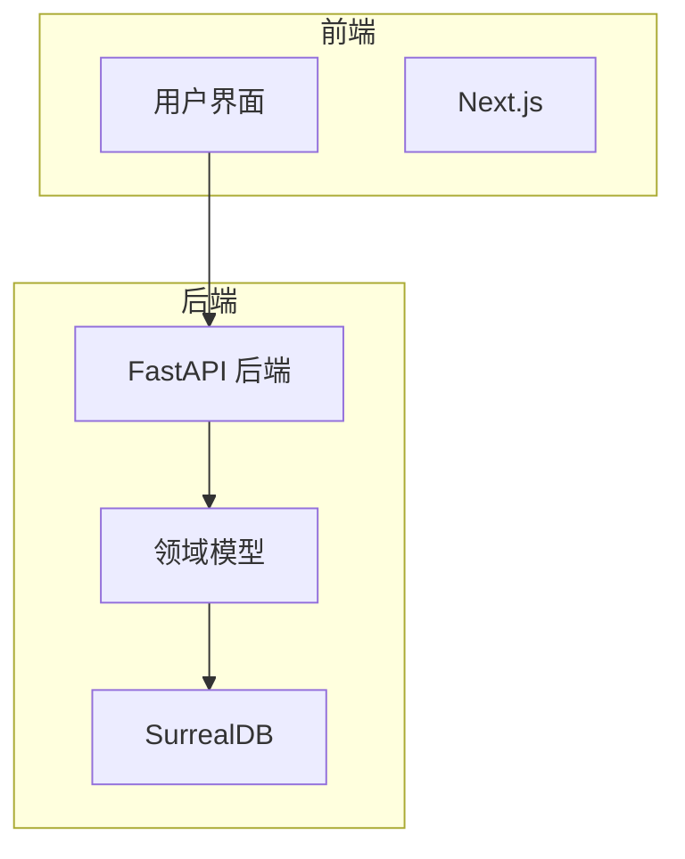
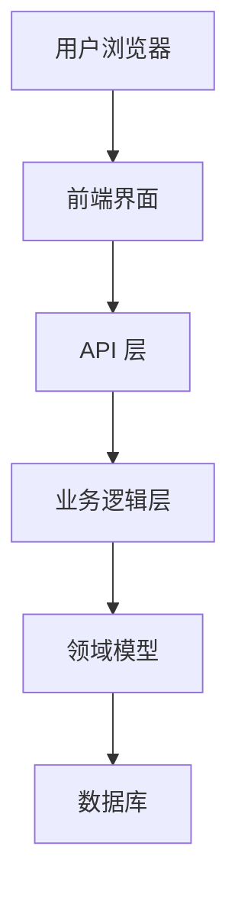
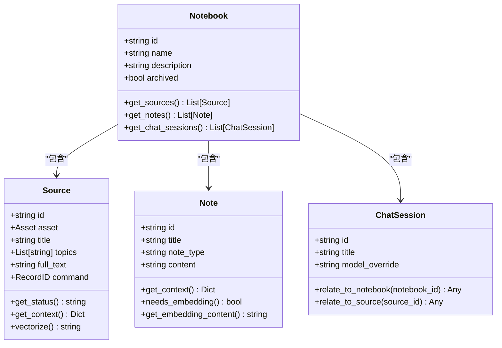
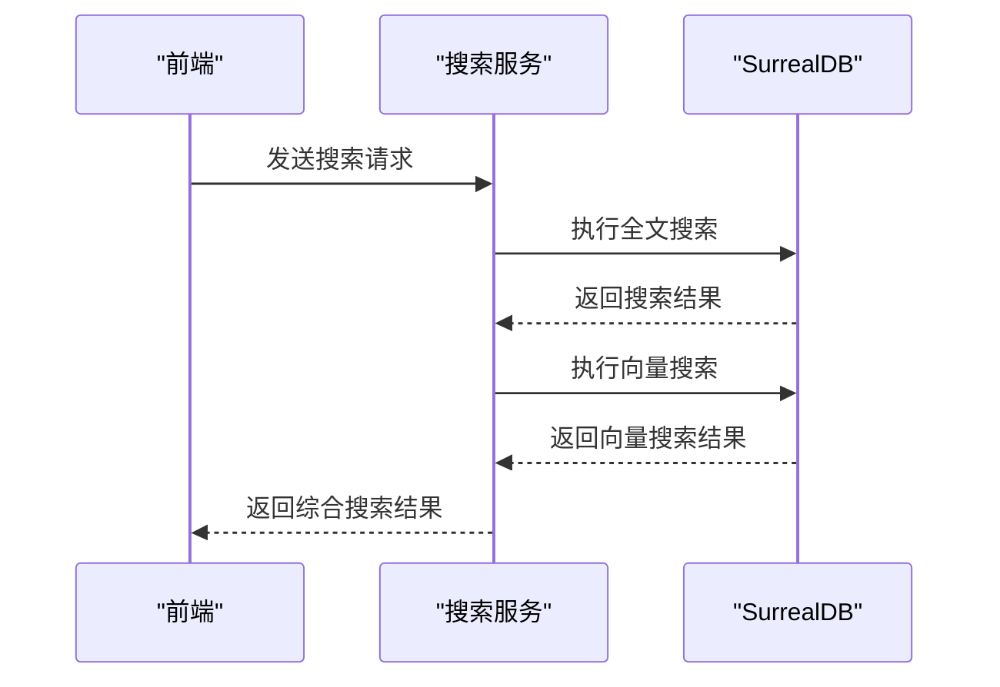
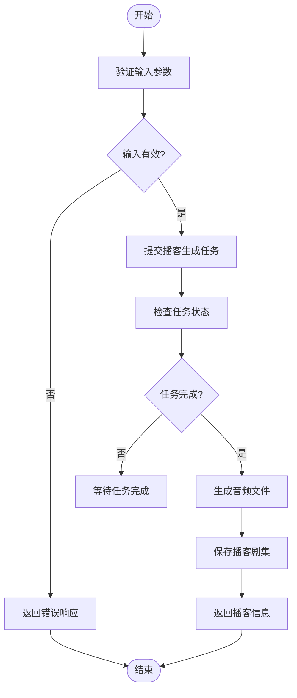
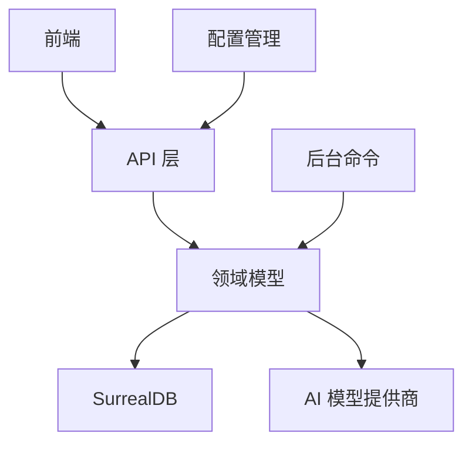

# 系统概述

<cite>
**本文档中引用的文件**  
- [README.md](file://README.md)
- [DESIGN_PRINCIPLES.md](file://DESIGN_PRINCIPLES.md)
- [api/main.py](file://api/main.py)
- [frontend/src/app/layout.tsx](file://frontend/src/app/layout.tsx)
- [open_notebook/config.py](file://open_notebook/config.py)
- [open_notebook/domain/base.py](file://open_notebook/domain/base.py)
- [open_notebook/domain/notebook.py](file://open_notebook/domain/notebook.py)
- [open_notebook/domain/models.py](file://open_notebook/domain/models.py)
- [open_notebook/database/repository.py](file://open_notebook/database/repository.py)
- [open_notebook/database/migrate.py](file://open_notebook/database/migrate.py)
- [api/notebook_service.py](file://api/notebook_service.py)
- [api/sources_service.py](file://api/sources_service.py)
- [api/chat_service.py](file://api/chat_service.py)
- [api/search_service.py](file://api/search_service.py)
- [api/podcast_service.py](file://api/podcast_service.py)
</cite>

## 目录
1. [简介](#简介)
2. [项目结构](#项目结构)
3. [核心组件](#核心组件)
4. [架构概述](#架构概述)
5. [详细组件分析](#详细组件分析)
6. [依赖分析](#依赖分析)
7. [性能考虑](#性能考虑)
8. [故障排除指南](#故障排除指南)
9. [结论](#结论)

## 简介

open-notebook 是一个开源、注重隐私的研究助手系统，旨在作为 Google Notebook LM 的替代方案。该系统允许用户在本地或自托管环境中管理研究资料，同时利用多种 AI 模型进行内容分析、聊天交互和播客生成。系统设计遵循隐私优先原则，确保用户数据完全受控，同时提供灵活的 AI 模型选择，支持包括 OpenAI、Anthropic、Ollama 等在内的 16 种以上提供商。

**Section sources**
- [README.md](file://README.md#L53-L67)
- [DESIGN_PRINCIPLES.md](file://DESIGN_PRINCIPLES.md#L7-L13)

## 项目结构

open-notebook 项目采用清晰的分层架构，主要分为前端、后端 API、领域模型和数据库四个部分。前端使用 Next.js 构建，提供现代化的用户界面；后端 API 基于 FastAPI 实现，处理所有业务逻辑；领域模型定义了核心数据结构和业务规则；数据库使用 SurrealDB 存储所有数据。

**Diagram sources**
- [frontend/src/app/layout.tsx](file://frontend/src/app/layout.tsx#L1-L43)
- [api/main.py](file://api/main.py#L79-L119)

**Section sources**
- [project_structure](file://project_structure)
- [README.md](file://README.md#L106-L108)

## 核心组件

open-notebook 系统的核心组件包括笔记本、内容源、AI 聊天、搜索和播客生成等模块。这些组件通过清晰的接口相互协作，形成一个完整的知识管理生态系统。系统采用 Clean Architecture 原则，确保各层之间的关注点分离，提高代码的可维护性和可测试性。

**Section sources**
- [README.md](file://README.md#L314-L335)
- [DESIGN_PRINCIPLES.md](file://DESIGN_PRINCIPLES.md#L151-L158)

## 架构概述

open-notebook 系统采用前后端分离的架构设计，前端通过 API 与后端进行通信。后端 API 层负责处理所有业务逻辑，调用领域模型进行数据处理，并通过数据库层持久化数据。系统使用 SurrealDB 作为主要数据库，支持复杂的数据查询和关系管理。

**Diagram sources**
- [api/main.py](file://api/main.py#L79-L119)
- [open_notebook/domain/base.py](file://open_notebook/domain/base.py#L25-L330)

**Section sources**
- [api/main.py](file://api/main.py#L79-L119)
- [open_notebook/domain/base.py](file://open_notebook/domain/base.py#L25-L330)

## 详细组件分析

### 笔记本组件分析

笔记本组件是 open-notebook 系统的核心，用于组织和管理研究项目。每个笔记本可以包含多个内容源、笔记和聊天会话。系统通过领域模型定义了笔记本、内容源和笔记之间的关系，并提供了丰富的 API 接口进行操作。

**Diagram sources**
- [open_notebook/domain/notebook.py](file://open_notebook/domain/notebook.py#L16-L457)
- [api/notebook_service.py](file://api/notebook_service.py#L13-L87)

**Section sources**
- [open_notebook/domain/notebook.py](file://open_notebook/domain/notebook.py#L16-L457)
- [api/notebook_service.py](file://api/notebook_service.py#L13-L87)

### 搜索组件分析

搜索组件提供全文搜索和向量搜索功能，允许用户在所有内容中查找相关信息。系统使用嵌入模型将文本转换为向量，并在 SurrealDB 中存储这些向量以支持语义搜索。搜索服务通过 API 暴露这些功能，前端可以调用这些接口实现搜索功能。

**Diagram sources**
- [api/search_service.py](file://api/search_service.py#L12-L58)
- [open_notebook/domain/notebook.py](file://open_notebook/domain/notebook.py#L406-L457)

**Section sources**
- [api/search_service.py](file://api/search_service.py#L12-L58)
- [open_notebook/domain/notebook.py](file://open_notebook/domain/notebook.py#L406-L457)

### 播客生成组件分析

播客生成组件允许用户将研究内容转换为专业级的多说话人播客。系统通过播客服务提交生成任务到后台命令系统，实现异步处理。用户可以配置播客的风格、说话人和内容，系统会自动生成播客脚本并合成音频。

**Diagram sources**
- [api/podcast_service.py](file://api/podcast_service.py#L33-L207)
- [commands/podcast_commands.py](file://commands/podcast_commands.py)

**Section sources**
- [api/podcast_service.py](file://api/podcast_service.py#L33-L207)
- [commands/podcast_commands.py](file://commands/podcast_commands.py)

## 依赖分析

open-notebook 系统的依赖关系清晰，各组件之间的耦合度较低。前端依赖后端 API 提供数据，后端 API 依赖领域模型和数据库。系统使用依赖注入模式，确保各服务之间的松耦合。外部依赖包括 SurrealDB、FastAPI、Next.js 和各种 AI 模型提供商。

**Diagram sources**
- [api/main.py](file://api/main.py#L11-L31)
- [open_notebook/domain/models.py](file://open_notebook/domain/models.py#L18-L199)

**Section sources**
- [api/main.py](file://api/main.py#L11-L31)
- [open_notebook/domain/models.py](file://open_notebook/domain/models.py#L18-L199)

## 性能考虑

open-notebook 系统在设计时充分考虑了性能因素。对于耗时较长的操作，如内容向量化和播客生成，系统采用异步处理模式，避免阻塞用户界面。数据库查询经过优化，使用索引提高搜索效率。系统还实现了缓存机制，减少重复计算和数据库访问。

**Section sources**
- [DESIGN_PRINCIPLES.md](file://DESIGN_PRINCIPLES.md#L110-L125)
- [api/sources_service.py](file://api/sources_service.py#L126-L207)

## 故障排除指南

当遇到系统问题时，首先检查 API 服务是否正常运行，确保端口 5055 已正确暴露。如果使用远程服务器，确保 API_URL 环境变量设置正确。对于数据库问题，检查 SurrealDB 是否正常启动，并验证数据库连接参数。对于 AI 模型相关问题，确认相应的 API 密钥已正确配置。

**Section sources**
- [README.md](file://README.md#L227-L235)
- [CONFIGURATION.md](file://CONFIGURATION.md)

## 结论

open-notebook 系统通过清晰的架构设计和模块化实现，提供了一个功能强大且注重隐私的研究助手。系统采用 Clean Architecture 原则，确保各层之间的关注点分离，提高了代码的可维护性和可测试性。前后端分离的设计使得系统易于扩展和部署。通过支持多种 AI 模型提供商，系统为用户提供了极大的灵活性和控制权。