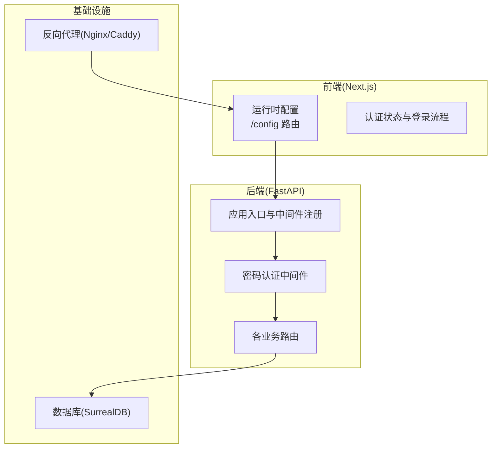
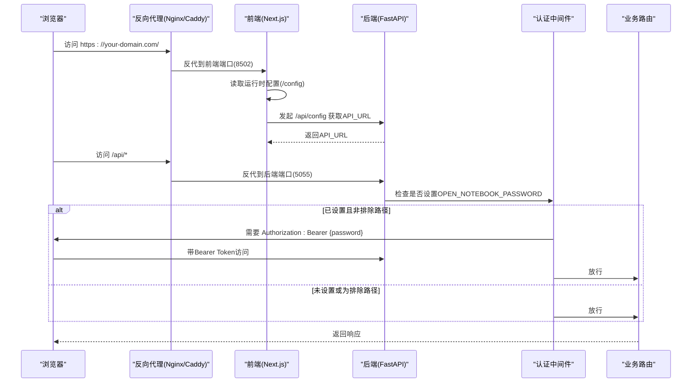
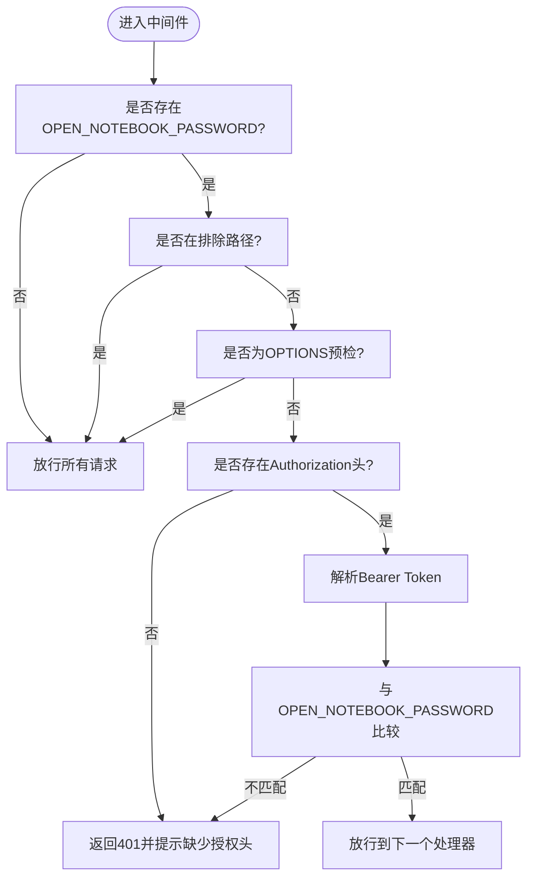
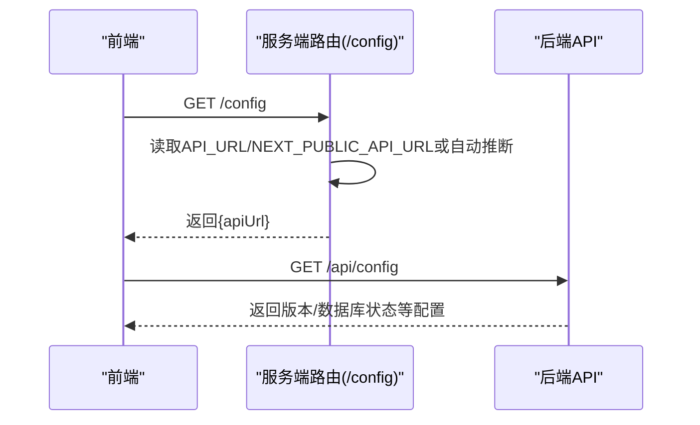
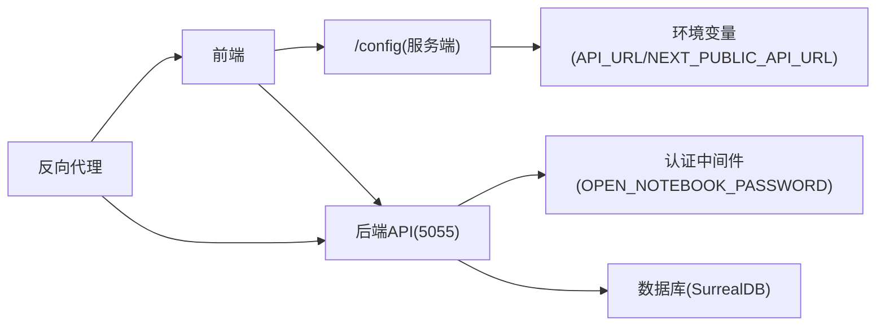

# 安全配置

<cite>
**本文引用的文件**
- [.env.example](file://.env.example)
- [setup_guide/docker.env](file://setup_guide/docker.env)
- [docs/deployment/security.md](file://docs/deployment/security.md)
- [docs/deployment/reverse-proxy.md](file://docs/deployment/reverse-proxy.md)
- [api/main.py](file://api/main.py)
- [api/auth.py](file://api/auth.py)
- [api/routers/auth.py](file://api/routers/auth.py)
- [frontend/src/lib/stores/auth-store.ts](file://frontend/src/lib/stores/auth-store.ts)
- [frontend/src/lib/config.ts](file://frontend/src/lib/config.ts)
- [frontend/src/app/config/route.ts](file://frontend/src/app/config/route.ts)
- [docker-compose.full.yml](file://docker-compose.full.yml)
- [docker-compose.single.yml](file://docker-compose.single.yml)
- [docs/deployment/retry-configuration.md](file://docs/deployment/retry-configuration.md)
</cite>

## 目录
1. [简介](#简介)
2. [项目结构与安全相关组件](#项目结构与安全相关组件)
3. [核心安全组件](#核心安全组件)
4. [架构总览](#架构总览)
5. [详细组件分析](#详细组件分析)
6. [依赖关系分析](#依赖关系分析)
7. [性能与安全权衡](#性能与安全权衡)
8. [故障排查指南](#故障排查指南)
9. [结论](#结论)
10. [附录：安全审计清单](#附录安全审计清单)

## 简介
本文件面向生产环境，基于仓库现有实现，制定open-notebook的安全配置规范。内容覆盖：
- 使用.env文件管理敏感信息（API密钥、数据库凭证、密码保护等）
- 最小权限原则在网络与容器层面的落地
- 反向代理（Nginx/Caddy）的HTTPS/TLS、安全头与路由配置
- 身份验证机制、会话管理、CORS策略与输入验证现状与建议
- 安全审计清单与定期检查要点

## 项目结构与安全相关组件
- 后端FastAPI应用负责API路由、认证中间件与CORS配置
- 前端Next.js通过运行时配置与服务端路由实现API URL自动推断与安全头传递
- 文档提供了反向代理与生产安全最佳实践
- Docker编排文件展示了端口暴露与环境变量注入方式

图表来源
- [frontend/src/app/config/route.ts](file://frontend/src/app/config/route.ts#L1-L68)
- [frontend/src/lib/config.ts](file://frontend/src/lib/config.ts#L1-L148)
- [frontend/src/lib/stores/auth-store.ts](file://frontend/src/lib/stores/auth-store.ts#L1-L222)
- [api/main.py](file://api/main.py#L1-L129)
- [api/auth.py](file://api/auth.py#L1-L100)
- [api/routers/auth.py](file://api/routers/auth.py#L1-L25)

章节来源
- [api/main.py](file://api/main.py#L1-L129)
- [frontend/src/lib/config.ts](file://frontend/src/lib/config.ts#L1-L148)
- [frontend/src/app/config/route.ts](file://frontend/src/app/config/route.ts#L1-L68)
- [docs/deployment/security.md](file://docs/deployment/security.md#L193-L244)

## 核心安全组件
- 密码保护中间件：当设置OPEN_NOTEBOOK_PASSWORD时，对除健康检查、文档、配置等外的API路径进行B错误认证
- 前端认证状态检测与登录流程：通过/auth/status判断是否需要密码，并以Bearer Token形式携带密码进行验证
- 运行时配置：前端优先从服务端/config读取API_URL，其次使用构建期NEXT_PUBLIC_API_URL，最后回退到本地推断
- 反向代理安全头与HTTPS：文档提供了Nginx示例，包含X-Frame-Options、X-Content-Type-Options、Strict-Transport-Security等
- Docker安全加固：只读根文件系统、临时目录、限制资源、禁止新特权等

章节来源
- [api/auth.py](file://api/auth.py#L1-L100)
- [api/routers/auth.py](file://api/routers/auth.py#L1-L25)
- [frontend/src/lib/stores/auth-store.ts](file://frontend/src/lib/stores/auth-store.ts#L1-L222)
- [frontend/src/lib/config.ts](file://frontend/src/lib/config.ts#L1-L148)
- [frontend/src/app/config/route.ts](file://frontend/src/app/config/route.ts#L1-L68)
- [docs/deployment/security.md](file://docs/deployment/security.md#L193-L244)
- [docker-compose.full.yml](file://docker-compose.full.yml#L1-L26)
- [docker-compose.single.yml](file://docker-compose.single.yml#L1-L20)

## 架构总览
下图展示从浏览器到后端API的请求流，以及认证与反向代理的关键节点。

图表来源
- [frontend/src/app/config/route.ts](file://frontend/src/app/config/route.ts#L1-L68)
- [frontend/src/lib/config.ts](file://frontend/src/lib/config.ts#L1-L148)
- [api/main.py](file://api/main.py#L1-L129)
- [api/auth.py](file://api/auth.py#L1-L100)
- [api/routers/auth.py](file://api/routers/auth.py#L1-L25)

## 详细组件分析

### 组件A：密码保护中间件与认证流程
- 中间件逻辑：仅当OPEN_NOTEBOOK_PASSWORD存在时启用；对OPTIONS预检请求放行；对已排除路径放行；校验Authorization头格式与内容
- 前端登录流程：先调用/api/auth/status判断是否需要密码；随后以Bearer Token访问受保护端点进行登录；登录成功后持久化token
- 排除路径：/、/health、/docs、/openapi.json、/redoc、/api/auth/status、/api/config

图表来源
- [api/auth.py](file://api/auth.py#L1-L100)
- [api/main.py](file://api/main.py#L80-L100)

章节来源
- [api/auth.py](file://api/auth.py#L1-L100)
- [api/main.py](file://api/main.py#L80-L100)
- [api/routers/auth.py](file://api/routers/auth.py#L1-L25)
- [frontend/src/lib/stores/auth-store.ts](file://frontend/src/lib/stores/auth-store.ts#L1-L222)

### 组件B：运行时配置与API_URL推断
- 优先级：服务端/config返回API_URL > 构建期NEXT_PUBLIC_API_URL > 本地推断(同主机名，端口5055)
- 服务端路由根据X-Forwarded-Proto与Host头自动推断协议与主机，避免硬编码
- 前端在无网络时对错误进行友好提示，避免泄露内部细节

图表来源
- [frontend/src/app/config/route.ts](file://frontend/src/app/config/route.ts#L1-L68)
- [frontend/src/lib/config.ts](file://frontend/src/lib/config.ts#L1-L148)

章节来源
- [frontend/src/app/config/route.ts](file://frontend/src/app/config/route.ts#L1-L68)
- [frontend/src/lib/config.ts](file://frontend/src/lib/config.ts#L1-L148)

### 组件C：反向代理与HTTPS/TLS
- 文档提供了Nginx示例，包含：
  - 80重定向至443
  - 证书与私钥配置
  - 安全头：X-Frame-Options、X-Content-Type-Options、Strict-Transport-Security
  - 前端与API分别反代至8502与5055
- 建议同时配置Caddy或Traefik时，遵循相同安全头与端口分离策略

章节来源
- [docs/deployment/security.md](file://docs/deployment/security.md#L193-L244)
- [docs/deployment/reverse-proxy.md](file://docs/deployment/reverse-proxy.md#L21-L44)

### 组件D：CORS策略与跨域
- 后端CORS中间件允许任意来源、凭据、方法与头
- 生产建议：将allow_origins限定为可信域名列表，避免通配符带来的风险

章节来源
- [api/main.py](file://api/main.py#L86-L100)

### 组件E：敏感信息与环境变量管理
- .env.example与docker.env用于存放API密钥、数据库连接、密码保护等敏感信息
- 建议：
  - 将.env与docker.env加入.gitignore
  - 使用不同环境的独立文件，区分开发/测试/生产
  - 对外部AI提供商密钥与数据库凭证分组管理，便于最小权限控制

章节来源
- [.env.example](file://.env.example#L1-L259)
- [setup_guide/docker.env](file://setup_guide/docker.env#L1-L14)
- [docker-compose.full.yml](file://docker-compose.full.yml#L1-L26)
- [docker-compose.single.yml](file://docker-compose.single.yml#L1-L20)

## 依赖关系分析
- 前端依赖服务端运行时配置端点提供API_URL
- 后端依赖环境变量OPEN_NOTEBOOK_PASSWORD决定是否启用认证
- 反向代理依赖正确的头部转发与TLS终止
- 数据库连接依赖SURREAL_URL、SURREAL_USER、SURREAL_PASSWORD等

图表来源
- [frontend/src/app/config/route.ts](file://frontend/src/app/config/route.ts#L1-L68)
- [frontend/src/lib/config.ts](file://frontend/src/lib/config.ts#L1-L148)
- [api/main.py](file://api/main.py#L80-L100)
- [api/auth.py](file://api/auth.py#L1-L100)

章节来源
- [frontend/src/lib/config.ts](file://frontend/src/lib/config.ts#L1-L148)
- [api/main.py](file://api/main.py#L80-L100)
- [api/auth.py](file://api/auth.py#L1-L100)

## 性能与安全权衡
- 认证中间件对每个请求进行检查，建议配合反向代理缓存静态资源与减少不必要的OPTIONS请求
- CORS通配符在开发阶段便利，生产务必收紧
- Docker安全加固（只读FS、tmpfs、no-new-privileges）可降低容器逃逸风险
- 数据库并发与重试策略需平衡吞吐与冲突率，避免“惊群效应”

章节来源
- [docs/deployment/security.md](file://docs/deployment/security.md#L266-L293)
- [docs/deployment/retry-configuration.md](file://docs/deployment/retry-configuration.md#L159-L263)

## 故障排查指南
- 无法连接到服务器：检查API_URL是否正确、反向代理是否转发至8502/5055、证书链是否完整
- 401未授权：确认Authorization头格式为Bearer {password}、密码与环境变量一致
- CORS问题：确保X-Forwarded-Proto与X-Forwarded-For正确透传
- 旧版前端仍附加:5055：升级至1.0.11及以上版本，/config端点已移出/api前缀

章节来源
- [docs/deployment/reverse-proxy.md](file://docs/deployment/reverse-proxy.md#L356-L409)
- [docs/deployment/security.md](file://docs/deployment/security.md#L382-L451)

## 结论
open-notebook当前提供基础的密码保护与运行时配置能力，结合反向代理的安全头与HTTPS、严格的最小权限原则与容器加固，可在生产环境中形成较为完整的安全基线。建议在生产中进一步收紧CORS、引入速率限制与审计日志、完善密钥轮换与备份策略，并定期进行安全审计与渗透测试。

## 附录：安全审计清单
- 环境与密钥
  - 是否使用独立的.env与docker.env文件，且加入.gitignore
  - 是否对API密钥、数据库凭证、密码保护等敏感信息进行分类管理
  - 是否启用密钥轮换与最小权限原则
- 反向代理与TLS
  - 是否强制HTTPS，证书链完整
  - 是否配置X-Frame-Options、X-Content-Type-Options、Strict-Transport-Security等安全头
  - 是否分离前端与API端口，避免直接暴露5055/8502
- 认证与会话
  - 是否启用OPEN_NOTEBOOK_PASSWORD并在生产中使用强密码
  - 是否对OPTIONS预检与健康检查等路径进行排除
  - 是否考虑引入会话超时与多因素认证
- CORS与输入验证
  - 是否将allow_origins限定为可信域名
  - 是否对输入参数进行严格校验与长度限制
- 容器与网络
  - 是否启用只读根文件系统、tmpfs、no-new-privileges等安全选项
  - 是否限制CPU/内存资源，防止资源滥用
- 监控与日志
  - 是否开启访问日志与错误日志，定期巡检异常
  - 是否建立告警与应急响应流程
- 备份与恢复
  - 是否定期备份数据与配置，验证恢复流程