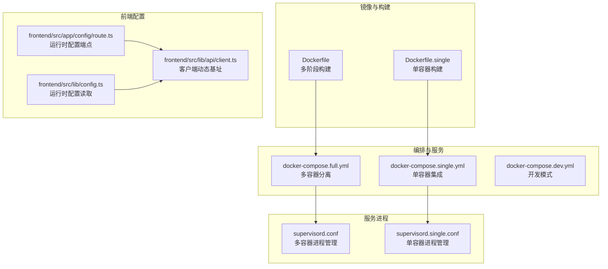
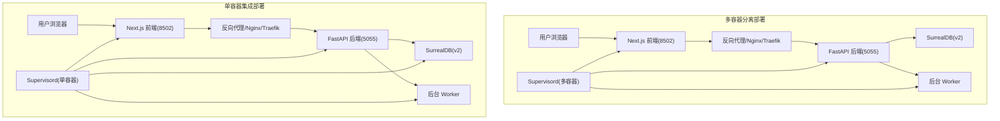
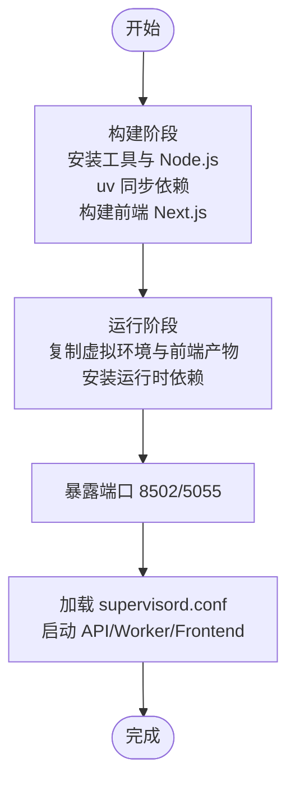
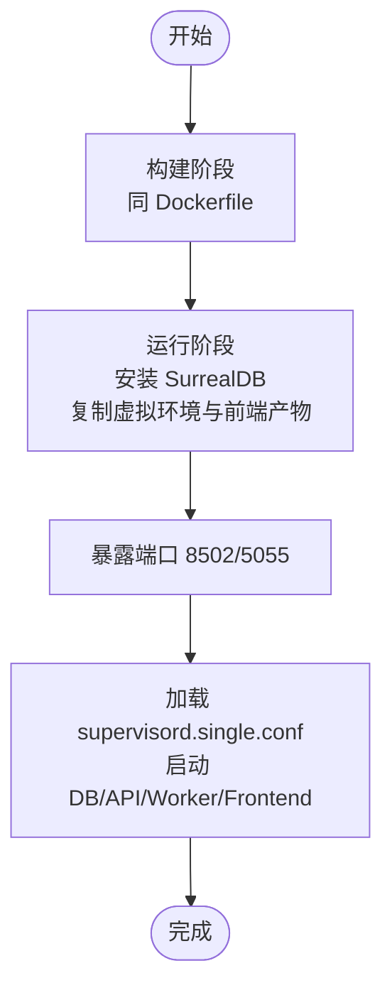
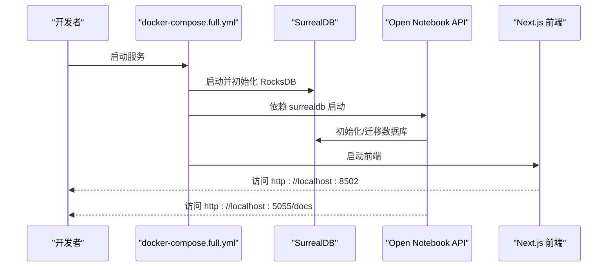
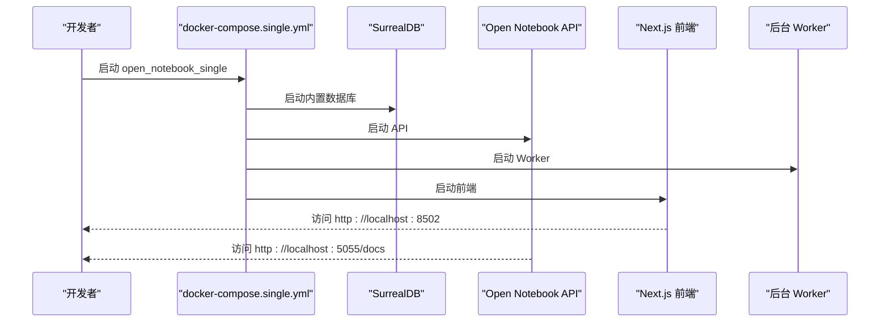
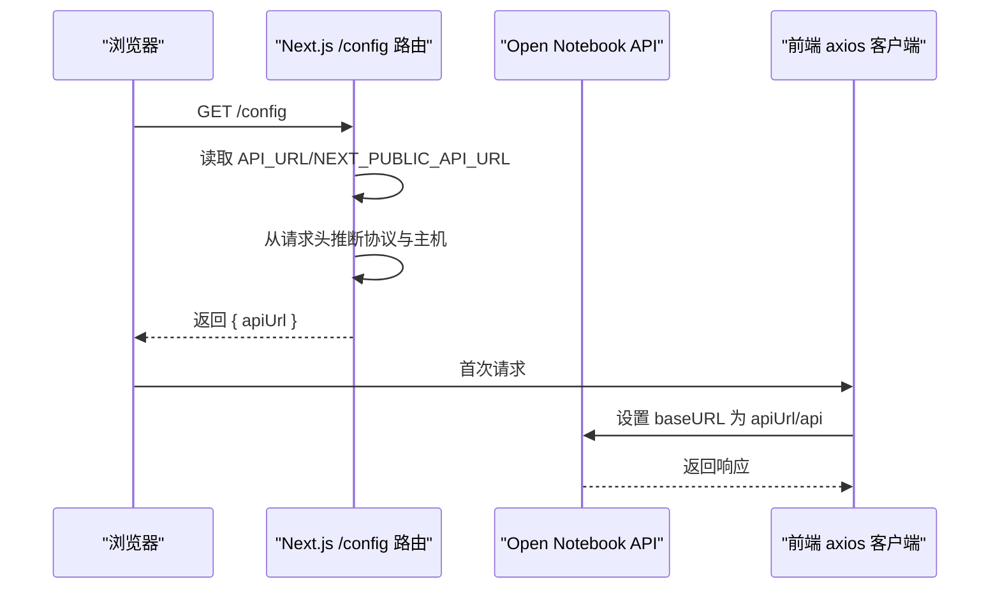
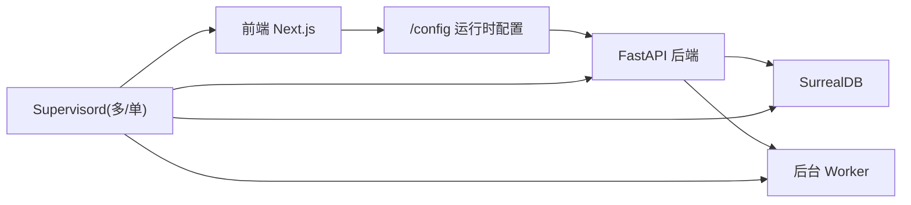

# 容器化部署

<cite>
**本文引用的文件**
- [Dockerfile](file://Dockerfile)
- [Dockerfile.single](file://Dockerfile.single)
- [docker-compose.full.yml](file://docker-compose.full.yml)
- [docker-compose.single.yml](file://docker-compose.single.yml)
- [docker-compose.dev.yml](file://docker-compose.dev.yml)
- [supervisord.conf](file://supervisord.conf)
- [supervisord.single.conf](file://supervisord.single.conf)
- [setup_guide/docker-compose.yml](file://setup_guide/docker-compose.yml)
- [setup_guide/docker.env](file://setup_guide/docker.env)
- [.dockerignore](file://.dockerignore)
- [docs/deployment/docker.md](file://docs/deployment/docker.md)
- [docs/deployment/single-container.md](file://docs/deployment/single-container.md)
- [docs/deployment/index.md](file://docs/deployment/index.md)
- [api/main.py](file://api/main.py)
- [frontend/src/app/config/route.ts](file://frontend/src/app/config/route.ts)
- [frontend/src/lib/config.ts](file://frontend/src/lib/config.ts)
- [frontend/src/lib/api/client.ts](file://frontend/src/lib/api/client.ts)
- [.env.example](file://.env.example)
</cite>

## 目录
1. [简介](#简介)
2. [项目结构](#项目结构)
3. [核心组件](#核心组件)
4. [架构总览](#架构总览)
5. [详细组件分析](#详细组件分析)
6. [依赖关系分析](#依赖关系分析)
7. [性能考量](#性能考量)
8. [故障排查指南](#故障排查指南)
9. [结论](#结论)
10. [附录](#附录)

## 简介
本指南面向希望在生产或开发环境中部署 open-notebook 的用户，系统性讲解基于 Docker 与 Docker Compose 的两种部署形态：多容器分离部署（推荐用于生产与可扩展场景）与单容器集成部署（适合平台托管与快速体验）。文档覆盖：
- 多阶段 Dockerfile 构建流程、基础镜像选择与优化策略
- docker-compose.full.yml 与 docker-compose.single.yml 的架构差异、资源隔离与网络配置
- docker-compose.yml 模板参数说明（环境变量注入、卷挂载、端口映射）
- 结合 setup_guide 示例配置，演示如何按生产需求定制部署拓扑

## 项目结构
仓库中与容器化部署直接相关的关键文件如下：
- Dockerfile 与 Dockerfile.single：多阶段构建定义，分别对应多容器与单容器镜像
- docker-compose.full.yml、docker-compose.single.yml、docker-compose.dev.yml：三种典型编排配置
- supervisord.conf 与 supervisord.single.conf：服务管理与启动顺序控制
- setup_guide/docker-compose.yml 与 setup_guide/docker.env：官方示例与环境变量模板
- docs/deployment/*：官方部署文档，包含高级配置、安全与运维建议
- 前端运行时配置逻辑：通过 /config 动态推断 API_URL，支持反向代理与自定义域名

图表来源
- [Dockerfile](file://Dockerfile#L1-L96)
- [Dockerfile.single](file://Dockerfile.single#L1-L99)
- [docker-compose.full.yml](file://docker-compose.full.yml#L1-L26)
- [docker-compose.single.yml](file://docker-compose.single.yml#L1-L20)
- [docker-compose.dev.yml](file://docker-compose.dev.yml#L1-L27)
- [supervisord.conf](file://supervisord.conf#L1-L41)
- [supervisord.single.conf](file://supervisord.single.conf#L1-L52)
- [frontend/src/app/config/route.ts](file://frontend/src/app/config/route.ts#L1-L68)
- [frontend/src/lib/config.ts](file://frontend/src/lib/config.ts#L1-L117)
- [frontend/src/lib/api/client.ts](file://frontend/src/lib/api/client.ts#L1-L38)

章节来源
- [Dockerfile](file://Dockerfile#L1-L96)
- [Dockerfile.single](file://Dockerfile.single#L1-L99)
- [docker-compose.full.yml](file://docker-compose.full.yml#L1-L26)
- [docker-compose.single.yml](file://docker-compose.single.yml#L1-L20)
- [docker-compose.dev.yml](file://docker-compose.dev.yml#L1-L27)
- [supervisord.conf](file://supervisord.conf#L1-L41)
- [supervisord.single.conf](file://supervisord.single.conf#L1-L52)
- [docs/deployment/docker.md](file://docs/deployment/docker.md#L1-L528)
- [docs/deployment/single-container.md](file://docs/deployment/single-container.md#L1-L351)
- [docs/deployment/index.md](file://docs/deployment/index.md#L1-L184)

## 核心组件
- 多阶段 Dockerfile（Dockerfile）
  - 构建阶段：安装构建工具与 Node.js，使用 uv 同步依赖，构建前端 Next.js 静态产物
  - 运行阶段：仅复制运行时依赖（ffmpeg、supervisor、Node.js），复制 Python 虚拟环境与前端产物，暴露 8502/5055 端口，使用 supervisord 启动 API、Worker、前端
  - 关键优化：使用 uv 并行同步、缓存依赖层、仅复制必要文件、精简运行时系统依赖
- 单容器 Dockerfile（Dockerfile.single）
  - 在运行阶段额外安装 SurrealDB，将数据库、API、Worker、前端打包为单一容器
  - 暴露相同端口，使用单容器 supervisord 配置
- 编排文件
  - docker-compose.full.yml：独立的 surrealdb 服务与 open_notebook 服务，前者持久化 RocksDB 数据，后者依赖 surrealdb
  - docker-compose.single.yml：单容器 open_notebook_single，同时包含数据库、API、Worker、前端
  - docker-compose.dev.yml：开发模式，构建本地镜像而非拉取预构建镜像
- 进程管理（Supervisord）
  - 控制启动顺序与优先级：数据库 → API → Worker → 前端；设置 autorestart、startsecs、日志输出到 stdout/stderr
- 前端运行时配置
  - /config 端点动态返回 API_URL，支持反向代理场景；前端客户端在首次请求时动态设置 baseURL

章节来源
- [Dockerfile](file://Dockerfile#L1-L96)
- [Dockerfile.single](file://Dockerfile.single#L1-L99)
- [docker-compose.full.yml](file://docker-compose.full.yml#L1-L26)
- [docker-compose.single.yml](file://docker-compose.single.yml#L1-L20)
- [docker-compose.dev.yml](file://docker-compose.dev.yml#L1-L27)
- [supervisord.conf](file://supervisord.conf#L1-L41)
- [supervisord.single.conf](file://supervisord.single.conf#L1-L52)
- [frontend/src/app/config/route.ts](file://frontend/src/app/config/route.ts#L1-L68)
- [frontend/src/lib/config.ts](file://frontend/src/lib/config.ts#L1-L117)
- [frontend/src/lib/api/client.ts](file://frontend/src/lib/api/client.ts#L1-L38)

## 架构总览
下图展示两种部署形态的组件交互与数据流。

图表来源
- [docker-compose.full.yml](file://docker-compose.full.yml#L1-L26)
- [docker-compose.single.yml](file://docker-compose.single.yml#L1-L20)
- [supervisord.conf](file://supervisord.conf#L1-L41)
- [supervisord.single.conf](file://supervisord.single.conf#L1-L52)
- [frontend/src/app/config/route.ts](file://frontend/src/app/config/route.ts#L1-L68)

## 详细组件分析

### 多阶段 Dockerfile 分析（Dockerfile）
- 构建阶段
  - 使用 slim-bookworm 基础镜像，安装 gcc/g++/git/make、Node.js 20.x LTS，启用 uv 并行同步依赖
  - 先复制最小依赖集以提升层缓存命中率，再复制完整代码，最后在 frontend 目录执行 npm ci 与构建
- 运行阶段
  - 仅安装运行时依赖（ffmpeg、supervisor、curl、Node.js），复制虚拟环境与前端静态产物
  - 暴露 8502（前端）、5055（API），通过 supervisord.conf 启动各子进程
- 优化要点
  - 使用 uv 的链接模式与字节码编译，减少体积与启动时间
  - 仅复制构建产物，避免将源码与构建工具带入运行时镜像
  - 通过 .dockerignore 排除不必要的目录与缓存

图表来源
- [Dockerfile](file://Dockerfile#L1-L96)
- [supervisord.conf](file://supervisord.conf#L1-L41)
- [.dockerignore](file://.dockerignore#L1-L63)

章节来源
- [Dockerfile](file://Dockerfile#L1-L96)
- [.dockerignore](file://.dockerignore#L1-L63)

### 单容器 Dockerfile 分析（Dockerfile.single）
- 在运行阶段额外安装 SurrealDB，将数据库、API、Worker、前端打包为单一镜像
- 暴露相同端口，使用 supervisord.single.conf 启动数据库、API、Worker、前端
- 适用于平台托管（如 PikaPods、Railway）与快速部署场景

图表来源
- [Dockerfile.single](file://Dockerfile.single#L1-L99)
- [supervisord.single.conf](file://supervisord.single.conf#L1-L52)

章节来源
- [Dockerfile.single](file://Dockerfile.single#L1-L99)

### 多容器编排（docker-compose.full.yml）
- 服务拆分
  - surrealdb：使用官方 v2 镜像，持久化到 ./surreal_data，命令指定 RocksDB 存储路径
  - open_notebook：使用镜像 lfnovo/open_notebook:v1-latest，映射 8502/5055，依赖 surrealdb，挂载 ./notebook_data 到 /app/data
- 网络与资源
  - 通过 depends_on 保证启动顺序；端口映射便于本地访问
  - 可结合反向代理与 SSL，实现自定义域名与 HTTPS
- 数据持久化
  - 两个卷分别持久化应用数据与数据库文件

图表来源
- [docker-compose.full.yml](file://docker-compose.full.yml#L1-L26)
- [api/main.py](file://api/main.py#L1-L129)

章节来源
- [docker-compose.full.yml](file://docker-compose.full.yml#L1-L26)
- [api/main.py](file://api/main.py#L1-L129)

### 单容器编排（docker-compose.single.yml）
- 服务整合
  - open_notebook_single：构建 Dockerfile.single，同时包含数据库、API、Worker、前端
  - 映射 8502/5055，挂载 ./notebook_data 到 /app/data、./surreal_single_data 到 /mydata
- 适用场景
  - 平台托管（PikaPods、Railway 等）与快速部署；无需外部数据库服务

图表来源
- [docker-compose.single.yml](file://docker-compose.single.yml#L1-L20)
- [supervisord.single.conf](file://supervisord.single.conf#L1-L52)

章节来源
- [docker-compose.single.yml](file://docker-compose.single.yml#L1-L20)
- [supervisord.single.conf](file://supervisord.single.conf#L1-L52)

### 开发模式编排（docker-compose.dev.yml）
- 与多容器类似，但使用本地构建的镜像（Dockerfile），便于开发调试
- 适合需要频繁修改后端或前端代码的场景

章节来源
- [docker-compose.dev.yml](file://docker-compose.dev.yml#L1-L27)

### 进程管理与启动顺序（Supervisord）
- 多容器 supervisord.conf
  - 启动顺序：API → Worker → Frontend；设置 autorestart、startsecs、日志输出到 stdout/stderr
- 单容器 supervisord.single.conf
  - 启动顺序：SurrealDB → API → Worker → Frontend；同样具备自动重启与延迟启动
- 环境变量传递
  - passenv 包含 API_URL、NEXT_PUBLIC_API_URL、INTERNAL_API_URL，确保前端在反向代理场景下正确识别 API 地址

章节来源
- [supervisord.conf](file://supervisord.conf#L1-L41)
- [supervisord.single.conf](file://supervisord.single.conf#L1-L52)

### 前端运行时配置（API_URL 自动检测）
- /config 端点优先使用显式设置的 API_URL 或 NEXT_PUBLIC_API_URL，否则从请求头自动推断协议与主机，最终回退到 localhost:5055
- 前端客户端在首次请求时动态设置 baseURL，支持反向代理与自定义域名

图表来源
- [frontend/src/app/config/route.ts](file://frontend/src/app/config/route.ts#L1-L68)
- [frontend/src/lib/config.ts](file://frontend/src/lib/config.ts#L1-L117)
- [frontend/src/lib/api/client.ts](file://frontend/src/lib/api/client.ts#L1-L38)

章节来源
- [frontend/src/app/config/route.ts](file://frontend/src/app/config/route.ts#L1-L68)
- [frontend/src/lib/config.ts](file://frontend/src/lib/config.ts#L1-L117)
- [frontend/src/lib/api/client.ts](file://frontend/src/lib/api/client.ts#L1-L38)
- [.env.example](file://.env.example#L1-L20)

## 依赖关系分析
- 组件耦合
  - 多容器形态下，API 与 Worker 依赖数据库服务；单容器形态下，数据库内嵌于同一容器
  - 前端通过 /config 动态配置 API_URL，避免硬编码，增强部署灵活性
- 外部依赖
  - SurrealDB：作为主数据库，支持 RocksDB 后端
  - 反向代理：Nginx/Traefik 等，用于自定义域名与 HTTPS
- 潜在循环依赖
  - 编排文件未见循环依赖；Supervisord 通过 startsecs 与 autorestart 控制健康状态

图表来源
- [supervisord.conf](file://supervisord.conf#L1-L41)
- [supervisord.single.conf](file://supervisord.single.conf#L1-L52)
- [frontend/src/app/config/route.ts](file://frontend/src/app/config/route.ts#L1-L68)
- [api/main.py](file://api/main.py#L1-L129)

章节来源
- [supervisord.conf](file://supervisord.conf#L1-L41)
- [supervisord.single.conf](file://supervisord.single.conf#L1-L52)
- [api/main.py](file://api/main.py#L1-L129)

## 性能考量
- 镜像体积与启动速度
  - 多阶段构建与 uv 优化显著降低运行时镜像体积，缩短启动时间
  - 仅复制必要文件，避免将源码与构建工具带入运行时
- 资源分配
  - 生产建议：为数据库与 API 分配独立资源，限制内存与 CPU，避免互相影响
  - 单容器形态更节省资源，但需注意服务间竞争
- 端口与网络
  - 多容器形态可通过反向代理暴露最小端口集合，单容器形态直接映射 8502/5055
- 日志与可观测性
  - 所有服务日志输出到 stdout/stderr，便于集中收集与分析

章节来源
- [Dockerfile](file://Dockerfile#L1-L96)
- [Dockerfile.single](file://Dockerfile.single#L1-L99)
- [docs/deployment/docker.md](file://docs/deployment/docker.md#L290-L333)

## 故障排查指南
- 常见问题
  - 端口冲突：检查宿主机端口占用，调整映射或停止占用进程
  - API 密钥错误：确认 docker.env 中密钥正确且无多余空格
  - 数据库连接失败：确认数据库卷可写、容器已完全启动、网络连通
  - 内存不足：提高容器内存限制或使用更小模型
- 定位手段
  - 查看容器日志：docker compose logs -f
  - 验证编排配置：docker compose config
  - 测试连通性：docker compose exec open_notebook ping surrealdb
- 单容器形态
  - 通过 supervisorctl status 查看服务状态，必要时重启特定服务

章节来源
- [docs/deployment/docker.md](file://docs/deployment/docker.md#L409-L443)
- [docs/deployment/single-container.md](file://docs/deployment/single-container.md#L238-L307)

## 结论
- 多容器分离部署适合生产与可扩展场景，具备更好的资源隔离与独立扩展能力
- 单容器集成部署适合平台托管与快速体验，部署简单、资源占用更低
- 通过 /config 动态配置 API_URL，配合反向代理与 SSL，可灵活适配不同域名与网络拓扑
- 建议在生产环境中结合反向代理、资源限制、备份策略与监控体系，确保稳定性与安全性

## 附录

### docker-compose.yml 模板参数说明（最佳实践）
- 环境变量注入
  - 使用 env_file 引入 docker.env，集中管理密钥与配置
  - 通过 API_URL/NEXT_PUBLIC_API_URL/INTERNAL_API_URL 控制前端与后端通信地址，支持反向代理场景
- 卷挂载
  - 应用数据卷：/app/data（多容器）或 /app/data（单容器）
  - 数据库卷：RocksDB 数据目录（多容器为 /mydata，单容器为 /mydata）
- 端口映射
  - 8502：Next.js 前端
  - 5055：REST API 文档与接口
- 依赖与健康检查
  - 多容器形态建议使用 depends_on 与健康检查，确保数据库就绪后再启动 API
- 安全与生产
  - 通过反向代理暴露最小端口，启用 HTTPS
  - 设置密码保护（OPEN_NOTEBOOK_PASSWORD），限制公开访问

章节来源
- [docker-compose.full.yml](file://docker-compose.full.yml#L1-L26)
- [docker-compose.single.yml](file://docker-compose.single.yml#L1-L20)
- [docker-compose.dev.yml](file://docker-compose.dev.yml#L1-L27)
- [setup_guide/docker-compose.yml](file://setup_guide/docker-compose.yml#L1-L14)
- [setup_guide/docker.env](file://setup_guide/docker.env#L1-L14)
- [frontend/src/app/config/route.ts](file://frontend/src/app/config/route.ts#L1-L68)
- [docs/deployment/docker.md](file://docs/deployment/docker.md#L278-L333)

### 基于 setup_guide 的生产定制示例
- 使用官方示例 docker-compose.yml 作为起点，替换镜像为单容器版本，挂载应用与数据库卷，设置环境变量
- 若采用多容器形态，参考 docker-compose.full.yml，将数据库与应用分离，增加健康检查与资源限制
- 结合 docs/deployment/docker.md 的高级配置与安全建议，完善反向代理、SSL、密码保护与资源限制

章节来源
- [setup_guide/docker-compose.yml](file://setup_guide/docker-compose.yml#L1-L14)
- [setup_guide/docker.env](file://setup_guide/docker.env#L1-L14)
- [docs/deployment/docker.md](file://docs/deployment/docker.md#L156-L333)