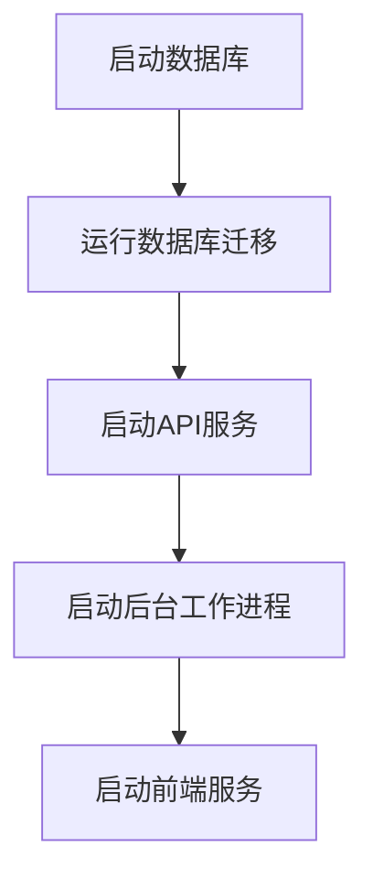
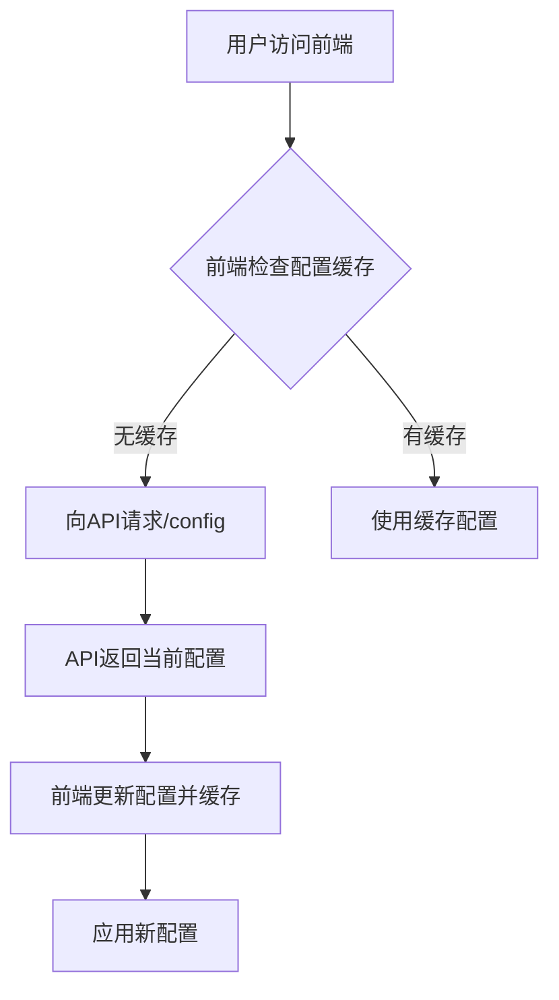
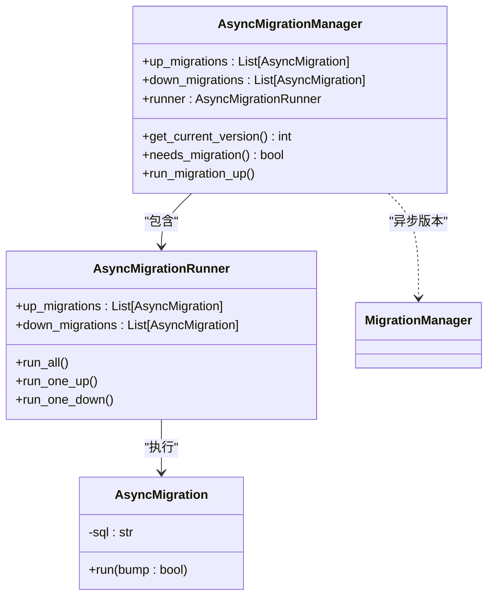
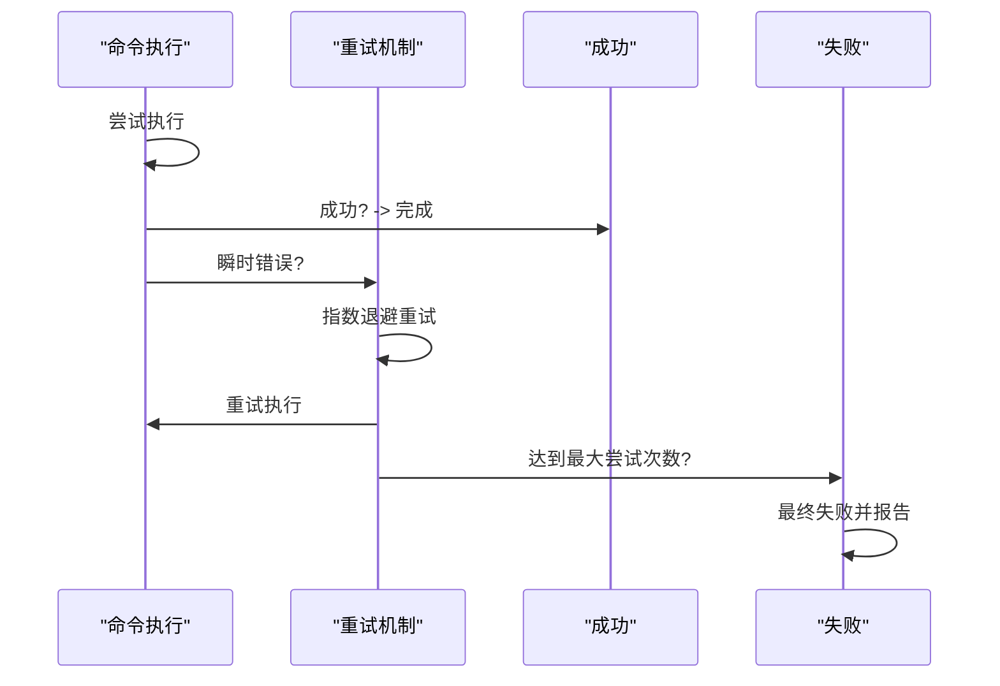
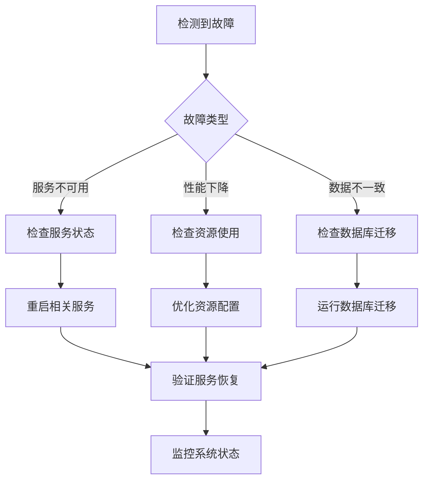
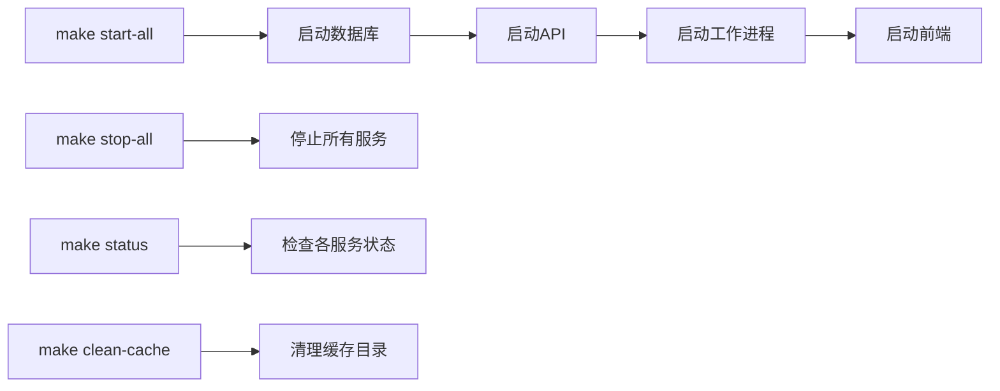

# 生产环境最佳实践

<cite>
**本文档中引用的文件**  
- [Makefile](file://Makefile)
- [Dockerfile](file://Dockerfile)
- [supervisord.conf](file://supervisord.conf)
- [run_api.py](file://run_api.py)
- [migrate.py](file://open_notebook/database/migrate.py)
- [async_migrate.py](file://open_notebook/database/async_migrate.py)
- [config.py](file://open_notebook/config.py)
- [main.py](file://api/main.py)
- [retry-configuration.md](file://docs/deployment/retry-configuration.md)
- [reverse-proxy.md](file://docs/deployment/reverse-proxy.md)
- [security.md](file://docs/deployment/security.md)
- [docker-compose.yml](file://setup_guide/docker-compose.yml)
</cite>

## 目录
1. [引言](#引言)
2. [服务启动与依赖管理](#服务启动与依赖管理)
3. [配置热更新机制](#配置热更新机制)
4. [数据库迁移自动化](#数据库迁移自动化)
5. [API重试策略配置](#api重试策略配置)
6. [故障恢复流程](#故障恢复流程)
7. [基于Makefile的运维任务自动化](#基于makefile的运维任务自动化)
8. [性能调优建议](#性能调优建议)
9. [备份策略与灾难恢复](#备份策略与灾难恢复)
10. [安全最佳实践](#安全最佳实践)

## 引言
本文档总结了Open Notebook在生产环境部署与运维中的最佳实践。涵盖了从服务启动、配置管理到数据库迁移、API重试、故障恢复、性能调优以及备份恢复的完整运维体系。通过合理利用Docker、Supervisor和Makefile等工具，可以实现高效、稳定和可维护的生产环境。

## 服务启动与依赖管理

Open Notebook采用多进程架构，包含API服务、后台工作进程和前端服务。服务的启动顺序和依赖管理至关重要，以确保系统稳定运行。

**Diagram sources**
- [supervisord.conf](file://supervisord.conf#L7-L41)
- [main.py](file://api/main.py#L43-L77)
- [run_api.py](file://run_api.py#L16-L31)

**Section sources**
- [supervisord.conf](file://supervisord.conf#L7-L41)
- [main.py](file://api/main.py#L43-L77)

## 配置热更新机制

系统通过环境变量和运行时配置实现配置的热更新，无需重启服务即可应用新配置。

**Diagram sources**
- [reverse-proxy.md](file://docs/deployment/reverse-proxy.md#L119-L137)
- [main.py](file://api/main.py#L99-L118)
- [config.py](file://open_notebook/config.py#L1-L18)

**Section sources**
- [reverse-proxy.md](file://docs/deployment/reverse-proxy.md#L119-L137)
- [config.py](file://open_notebook/config.py#L1-L18)

## 数据库迁移自动化

系统通过surreal-commands框架实现数据库迁移的自动化，确保数据库模式与应用代码同步。

**Diagram sources**
- [async_migrate.py](file://open_notebook/database/async_migrate.py#L91-L124)
- [migrate.py](file://open_notebook/database/migrate.py#L6-L27)

**Section sources**
- [async_migrate.py](file://open_notebook/database/async_migrate.py#L1-L189)
- [migrate.py](file://open_notebook/database/migrate.py#L1-L27)

## API重试策略配置

系统实现了智能的API重试机制，能够处理瞬时性故障，提高系统的健壮性。

**Diagram sources**
- [retry-configuration.md](file://docs/deployment/retry-configuration.md#L18-L34)
- [async_migrate.py](file://open_notebook/database/async_migrate.py#L36-L49)

**Section sources**
- [retry-configuration.md](file://docs/deployment/retry-configuration.md#L1-L346)
- [.env.example](file://.env.example#L204-L230)

## 故障恢复流程

当系统出现故障时，应遵循标准化的恢复流程，快速定位问题并恢复正常服务。

**Section sources**
- [Makefile](file://Makefile#L147-L173)
- [supervisord.conf](file://supervisord.conf#L7-L41)

## 基于Makefile的运维任务自动化

通过Makefile简化常见的运维任务，提高操作效率和一致性。

**Diagram sources**
- [Makefile](file://Makefile#L147-L173)
- [Makefile](file://Makefile#L174-L183)
- [Makefile](file://Makefile#L192-L201)

**Section sources**
- [Makefile](file://Makefile#L1-L201)

## 性能调优建议

### 连接池配置
系统使用SurrealDB作为数据库，应根据负载情况调整连接池大小。在高并发场景下，建议增加连接池大小以提高吞吐量。

### 缓存策略
系统在`data/`目录下创建多个缓存文件夹，包括：
- `sqlite-db/`：LangGraph检查点文件
- `uploads/`：用户上传文件
- `tiktoken-cache/`：Token计算缓存

### AI模型服务的资源分配
AI模型服务是资源消耗大户，建议：
- 为embedding服务分配足够的内存
- 监控GPU使用情况（如果使用GPU加速）
- 根据并发请求数调整工作进程数量

**Section sources**
- [config.py](file://open_notebook/config.py#L3-L18)
- [Dockerfile](file://Dockerfile#L45-L55)

## 备份策略与灾难恢复

### 备份策略
定期备份以下关键数据：
- `data/`目录：包含所有应用数据和缓存
- `surreal_data/`目录：SurrealDB数据库文件
- 配置文件：包括`.env`文件和Docker配置

### 灾难恢复计划
当发生灾难性故障时，应：
1. 从最近的备份恢复数据库文件
2. 重新启动所有服务
3. 运行数据库迁移确保模式同步
4. 验证系统功能完整性

**Section sources**
- [config.py](file://open_notebook/config.py#L3-L18)
- [Dockerfile](file://Dockerfile#L67-L72)
- [setup_guide/docker-compose.yml](file://setup_guide/docker-compose.yml#L1-L14)

## 安全最佳实践

### 密码保护
通过`OPEN_NOTEBOOK_PASSWORD`环境变量启用密码保护，适用于公共部署场景。

### HTTPS配置
生产环境必须使用HTTPS，可通过nginx、Traefik等反向代理实现。

### 防火墙配置
限制直接访问API端口（5055）和前端端口（8502），仅允许反向代理访问。

### Docker安全
在生产环境中，应：
- 使用只读文件系统
- 限制容器资源使用
- 启用安全选项防止提权

**Section sources**
- [security.md](file://docs/deployment/security.md#L1-L481)
- [reverse-proxy.md](file://docs/deployment/reverse-proxy.md#L1-L457)