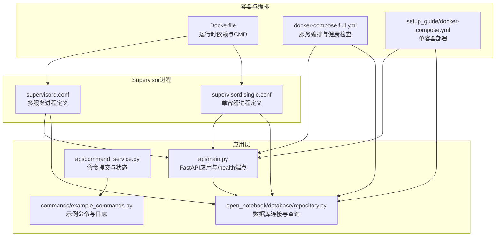
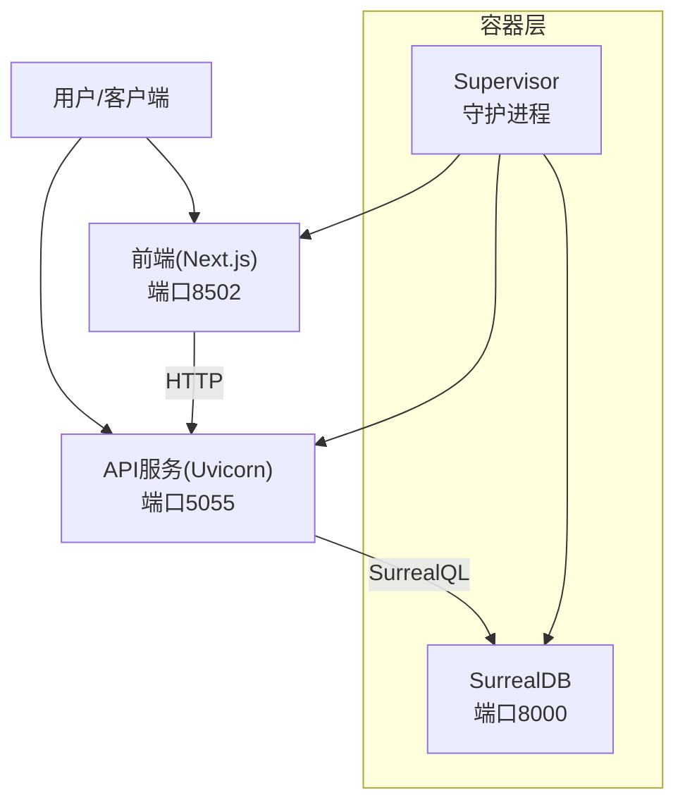
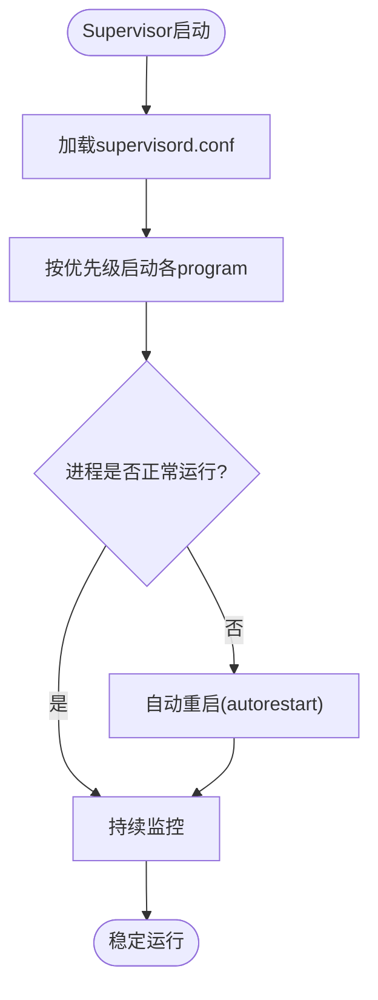
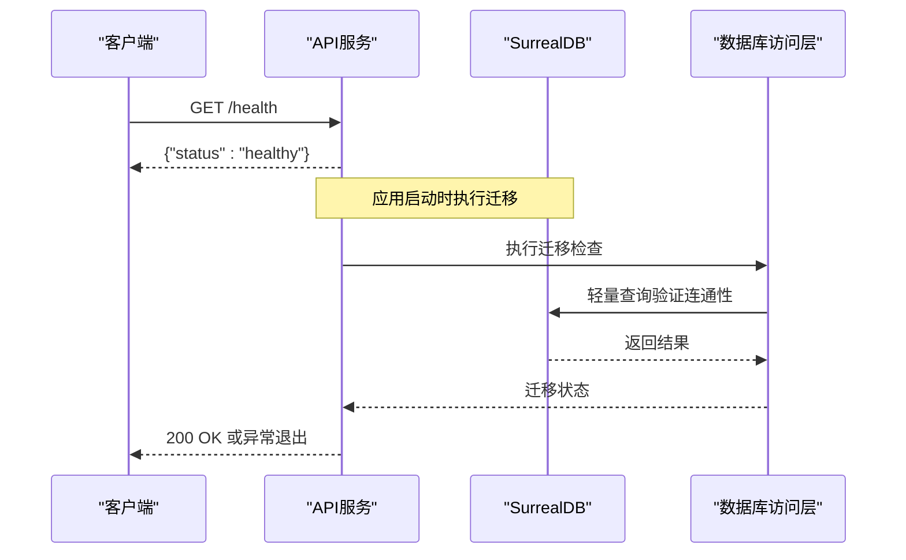
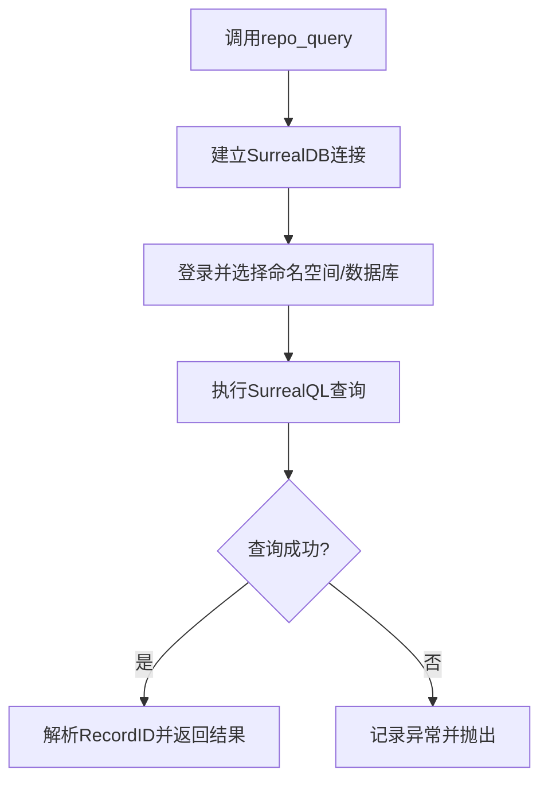
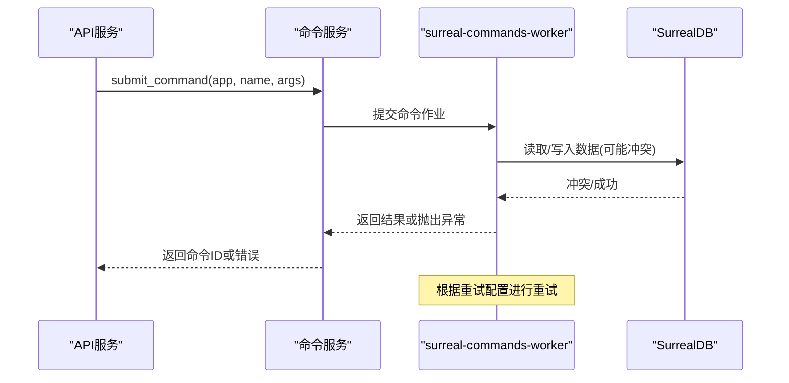
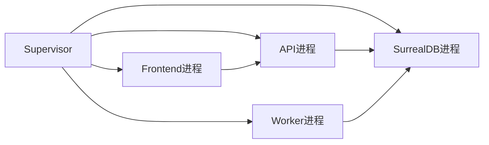

# 进程与监控

<cite>
**本文引用的文件**
- [supervisord.conf](file://supervisord.conf)
- [supervisord.single.conf](file://supervisord.single.conf)
- [Dockerfile](file://Dockerfile)
- [docker-compose.full.yml](file://docker-compose.full.yml)
- [setup_guide/docker-compose.yml](file://setup_guide/docker-compose.yml)
- [api/main.py](file://api/main.py)
- [api/routers/config.py](file://api/routers/config.py)
- [open_notebook/database/repository.py](file://open_notebook/database/repository.py)
- [docs/deployment/docker.md](file://docs/deployment/docker.md)
- [docs/deployment/retry-configuration.md](file://docs/deployment/retry-configuration.md)
- [docs/troubleshooting/debugging.md](file://docs/troubleshooting/debugging.md)
- [docs/troubleshooting/common-issues.md](file://docs/troubleshooting/common-issues.md)
- [Makefile](file://Makefile)
- [run_api.py](file://run_api.py)
- [commands/example_commands.py](file://commands/example_commands.py)
- [api/command_service.py](file://api/command_service.py)
- [frontend/src/app/config/route.ts](file://frontend/src/app/config/route.ts)
- [frontend/src/lib/api/models.ts](file://frontend/src/lib/api/models.ts)
- [docs/features/ai-models.md](file://docs/features/ai-models.md)
</cite>

## 目录
1. [简介](#简介)
2. [项目结构](#项目结构)
3. [核心组件](#核心组件)
4. [架构总览](#架构总览)
5. [详细组件分析](#详细组件分析)
6. [依赖关系分析](#依赖关系分析)
7. [性能考量](#性能考量)
8. [故障排查指南](#故障排查指南)
9. [结论](#结论)
10. [附录](#附录)

## 简介
本指南围绕“进程管理与系统监控”的实施展开，结合仓库中的Supervisor配置、Docker编排、API健康检查、数据库连接与命令工作进程等关键要素，系统讲解如何通过Supervisor统一守护多进程，如何利用健康检查端点与日志体系进行运行状态监控，以及如何结合外部监控工具实现可视化运维。同时，文档覆盖API服务、数据库与AI模型服务的监控要点，并提供日志收集、分析与告警的实践建议。

## 项目结构
该仓库采用容器化部署与Supervisor进程管理相结合的方式，包含以下与进程与监控密切相关的部分：
- Supervisor配置：单机与多机两种模式的进程定义与自动重启策略
- Docker镜像与编排：运行时环境、端口暴露、健康检查与资源限制
- API服务：健康检查端点、生命周期事件与日志记录
- 数据库连接：SurrealDB连接封装与健康检查
- 命令工作进程：后台任务提交与重试机制
- 前端运行时配置：API URL动态注入与健康检查

图表来源
- [Dockerfile](file://Dockerfile#L45-L96)
- [docker-compose.full.yml](file://docker-compose.full.yml#L1-L26)
- [setup_guide/docker-compose.yml](file://setup_guide/docker-compose.yml#L1-L14)
- [supervisord.conf](file://supervisord.conf#L1-L41)
- [supervisord.single.conf](file://supervisord.single.conf#L1-L52)
- [api/main.py](file://api/main.py#L121-L129)
- [open_notebook/database/repository.py](file://open_notebook/database/repository.py#L47-L82)
- [commands/example_commands.py](file://commands/example_commands.py#L1-L135)
- [api/command_service.py](file://api/command_service.py#L1-L92)

章节来源
- [Dockerfile](file://Dockerfile#L45-L96)
- [docker-compose.full.yml](file://docker-compose.full.yml#L1-L26)
- [setup_guide/docker-compose.yml](file://setup_guide/docker-compose.yml#L1-L14)
- [supervisord.conf](file://supervisord.conf#L1-L41)
- [supervisord.single.conf](file://supervisord.single.conf#L1-L52)
- [api/main.py](file://api/main.py#L121-L129)
- [open_notebook/database/repository.py](file://open_notebook/database/repository.py#L47-L82)
- [commands/example_commands.py](file://commands/example_commands.py#L1-L135)
- [api/command_service.py](file://api/command_service.py#L1-L92)

## 核心组件
- Supervisor进程管理
  - 定义API、Worker、前端三类进程，启用自动重启与启动延迟，确保服务稳定性
  - 单容器模式下额外包含SurrealDB进程
- Docker运行时与编排
  - 镜像安装Supervisor与Node.js，暴露前端与API端口，设置日志目录
  - 编排文件为SurrealDB与应用服务配置健康检查与资源限制
- API服务与健康检查
  - 提供/health端点用于存活与就绪探测
  - 生命周期事件中执行数据库迁移，失败则快速退出
- 数据库连接与健康检查
  - 封装SurrealDB连接与查询，提供轻量查询用于健康检查
- 命令工作进程与重试
  - 通过命令提交接口提交后台任务，支持全局重试策略与并发控制
- 日志与可观测性
  - API使用Loguru记录结构化日志；Supervisor将进程输出重定向至标准输出/错误
  - 文档提供日志收集、分析与告警建议

章节来源
- [supervisord.conf](file://supervisord.conf#L7-L41)
- [supervisord.single.conf](file://supervisord.single.conf#L7-L52)
- [Dockerfile](file://Dockerfile#L45-L96)
- [docker-compose.full.yml](file://docker-compose.full.yml#L1-L26)
- [api/main.py](file://api/main.py#L121-L129)
- [open_notebook/database/repository.py](file://open_notebook/database/repository.py#L101-L177)
- [docs/deployment/retry-configuration.md](file://docs/deployment/retry-configuration.md#L51-L106)

## 架构总览
下图展示从容器到进程再到应用服务的整体架构，以及健康检查与日志流向。

图表来源
- [Dockerfile](file://Dockerfile#L74-L96)
- [docker-compose.full.yml](file://docker-compose.full.yml#L1-L26)
- [supervisord.conf](file://supervisord.conf#L7-L41)
- [supervisord.single.conf](file://supervisord.single.conf#L7-L52)

## 详细组件分析

### Supervisor配置与进程定义
- 多容器模式
  - 定义api、worker、frontend三个program，均启用autorestart与autostart，设置优先级与启动延迟
  - 标准输出/错误重定向至容器标准流，便于集中采集
- 单容器模式
  - 在上述基础上增加surrealdb program，便于一体化部署
- 自动重启策略
  - autorestart=true确保异常退出后自动恢复
  - startsecs控制启动等待时间，避免过早判定失败
- 环境变量与工作目录
  - 前端进程设置NODE_ENV与端口，传递API_URL等运行时变量

图表来源
- [supervisord.conf](file://supervisord.conf#L1-L41)
- [supervisord.single.conf](file://supervisord.single.conf#L1-L52)

章节来源
- [supervisord.conf](file://supervisord.conf#L7-L41)
- [supervisord.single.conf](file://supervisord.single.conf#L7-L52)

### API服务与健康检查
- 健康检查端点
  - /health返回简单健康状态，可用于容器就绪/存活探针
- 生命周期事件
  - 应用启动时执行数据库迁移；若迁移失败则抛出异常并阻止启动
- 日志记录
  - 使用Loguru记录INFO/WARNING/ERROR级别日志，便于问题定位

图表来源
- [api/main.py](file://api/main.py#L121-L129)
- [open_notebook/database/repository.py](file://open_notebook/database/repository.py#L101-L177)
- [api/routers/config.py](file://api/routers/config.py#L101-L123)

章节来源
- [api/main.py](file://api/main.py#L121-L129)
- [open_notebook/database/repository.py](file://open_notebook/database/repository.py#L101-L177)
- [api/routers/config.py](file://api/routers/config.py#L101-L123)

### 数据库连接与健康检查
- 连接封装
  - 通过AsyncSurreal建立连接，登录命名空间与数据库
  - 查询封装返回解析后的结果，异常时记录日志并抛出
- 健康检查
  - 提供轻量查询用于连通性检测，超时或异常时返回离线状态

图表来源
- [open_notebook/database/repository.py](file://open_notebook/database/repository.py#L47-L82)

章节来源
- [open_notebook/database/repository.py](file://open_notebook/database/repository.py#L47-L82)

### 命令工作进程与重试机制
- 命令提交
  - 通过命令服务提交后台任务，确保命令模块已导入后再提交
- 重试策略
  - 支持全局重试开关、最大尝试次数、等待策略（指数退避/抖动/固定/随机）与并发度
  - 可针对特定命令自定义重试行为，仅对指定异常类型触发重试

图表来源
- [api/command_service.py](file://api/command_service.py#L1-L92)
- [docs/deployment/retry-configuration.md](file://docs/deployment/retry-configuration.md#L51-L106)
- [commands/example_commands.py](file://commands/example_commands.py#L1-L135)

章节来源
- [api/command_service.py](file://api/command_service.py#L1-L92)
- [docs/deployment/retry-configuration.md](file://docs/deployment/retry-configuration.md#L51-L106)
- [commands/example_commands.py](file://commands/example_commands.py#L1-L135)

### 前端运行时配置与健康检查
- 运行时配置
  - 前端路由提供运行时配置端点，根据环境变量动态决定API_URL与内部代理地址
- 健康检查
  - 文档提供健康检查脚本与curl示例，便于自动化监控

章节来源
- [frontend/src/app/config/route.ts](file://frontend/src/app/config/route.ts#L1-L33)
- [docs/troubleshooting/debugging.md](file://docs/troubleshooting/debugging.md#L580-L606)

## 依赖关系分析
- 进程耦合
  - Supervisor统一管理API、Worker、前端与数据库进程，降低进程间协调复杂度
- 外部依赖
  - SurrealDB作为数据存储后端，API通过SurrealQL访问
  - 命令工作进程依赖命令模块注册与SurrealDB事务一致性
- 监控集成
  - Docker Compose为服务配置健康检查，便于容器编排平台进行自动恢复
  - API提供/health端点，便于外部监控系统拉取状态

图表来源
- [supervisord.conf](file://supervisord.conf#L7-L41)
- [supervisord.single.conf](file://supervisord.single.conf#L7-L52)
- [docker-compose.full.yml](file://docker-compose.full.yml#L1-L26)

章节来源
- [supervisord.conf](file://supervisord.conf#L7-L41)
- [supervisord.single.conf](file://supervisord.single.conf#L7-L52)
- [docker-compose.full.yml](file://docker-compose.full.yml#L1-L26)

## 性能考量
- 资源限制
  - 编排文件为SurrealDB与应用服务设置内存/CPU上限，避免资源争用
- 并发与重试
  - 命令工作进程支持并发度调整与重试策略，平衡吞吐与冲突概率
- 启动延迟
  - 通过startsecs避免服务启动过早导致的依赖未就绪

章节来源
- [docs/deployment/docker.md](file://docs/deployment/docker.md#L297-L528)
- [docs/deployment/retry-configuration.md](file://docs/deployment/retry-configuration.md#L51-L106)
- [supervisord.conf](file://supervisord.conf#L26-L27)

## 故障排查指南
- 日志收集与分析
  - Docker部署：使用compose logs查看服务日志，支持实时跟踪与尾部查看
  - 源码安装：关注API与Worker的日志输出，必要时开启DEBUG级别
- 健康检查
  - 使用curl对各端口的/health端点进行探测，确认服务可用
- 常见问题
  - 数据库离线：检查SurrealDB日志与版本兼容性，必要时重置数据库
  - Worker未处理任务：检查进程状态与命令模块导入情况
  - AI提供商配置：核对API密钥与模型可用性

章节来源
- [docs/troubleshooting/debugging.md](file://docs/troubleshooting/debugging.md#L1-L72)
- [docs/troubleshooting/debugging.md](file://docs/troubleshooting/debugging.md#L526-L606)
- [docs/troubleshooting/common-issues.md](file://docs/troubleshooting/common-issues.md#L728-L788)

## 结论
通过Supervisor统一守护多进程、Docker编排与健康检查、API健康端点与数据库健康检查，以及命令工作进程的重试机制，本项目形成了较为完善的进程管理与系统监控基础。结合日志采集与告警实践，可进一步实现可视化运维与自动化恢复。

## 附录

### 监控与告警实践建议
- 健康检查端点
  - 使用/health端点作为存活/就绪探针，结合容器编排平台的自动重启能力
- 日志采集
  - 将Supervisor输出重定向至标准流，配合日志收集器统一采集
  - 对API与Worker的关键路径增加结构化日志，便于检索与告警
- 告警策略
  - 基于健康检查失败率、日志错误数、响应时间与错误率设置阈值告警
- 可视化运维
  - Prometheus抓取指标（如容器资源使用、服务响应时间），Grafana展示仪表盘
  - 结合日志聚合平台（如ELK/EFK）进行日志可视化与趋势分析

章节来源
- [api/main.py](file://api/main.py#L121-L129)
- [docs/deployment/docker.md](file://docs/deployment/docker.md#L370-L381)
- [docs/deployment/docker.md](file://docs/deployment/docker.md#L488-L528)

### AI模型服务监控要点
- 提供商可用性
  - 通过/health端点与提供商可用性接口判断模型服务可用性
- 成本与性能
  - 结合模型类型与提供商特性，优化默认模型与并发策略
- 运行时配置
  - 前端运行时配置端点动态注入API_URL，确保监控与告警指向正确的API地址

章节来源
- [frontend/src/lib/api/models.ts](file://frontend/src/lib/api/models.ts#L1-L38)
- [docs/features/ai-models.md](file://docs/features/ai-models.md#L550-L620)
- [frontend/src/app/config/route.ts](file://frontend/src/app/config/route.ts#L1-L33)