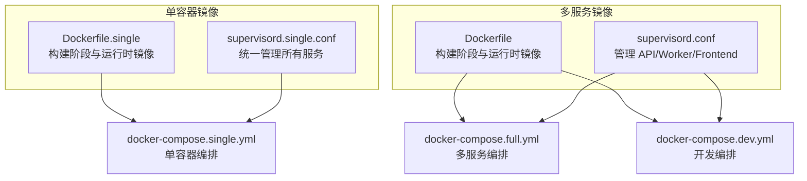
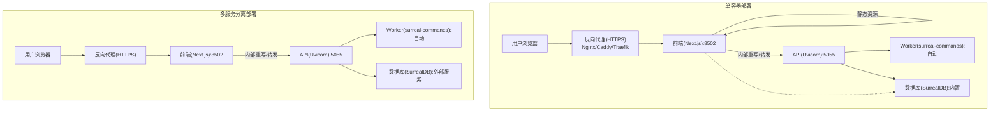
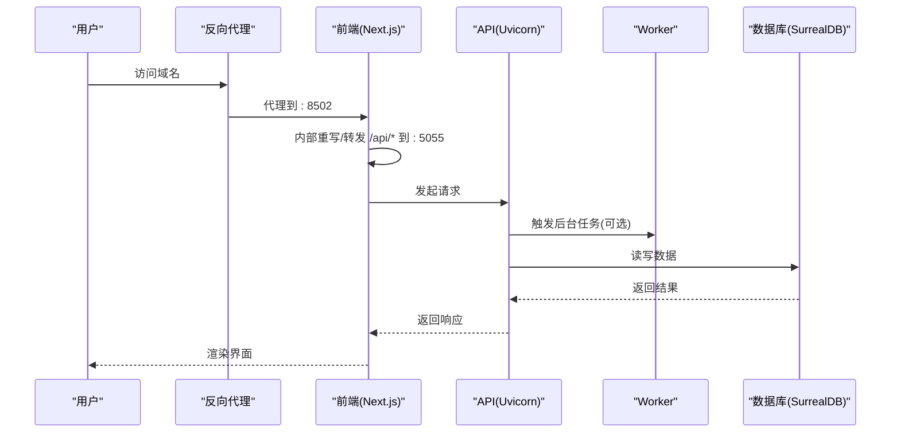
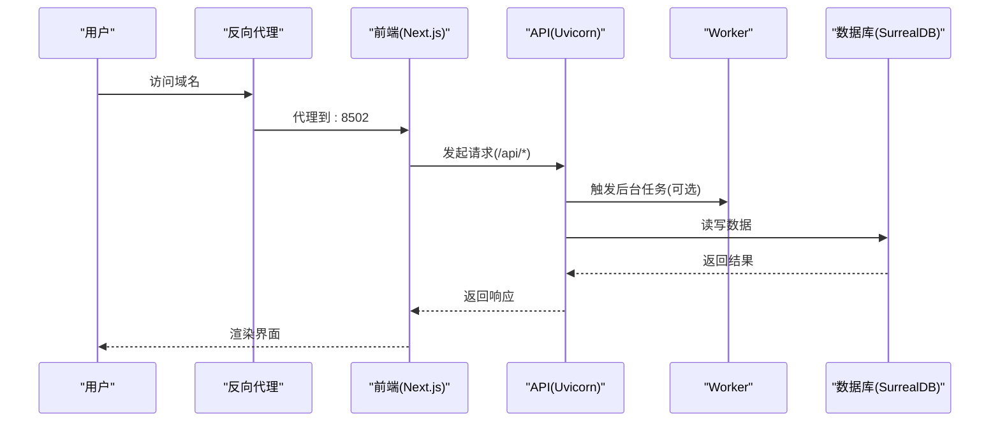
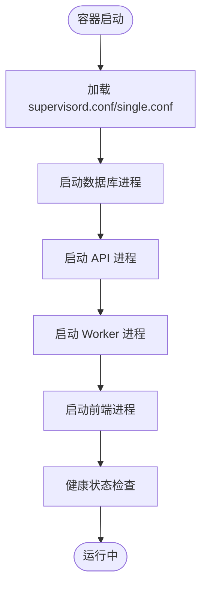
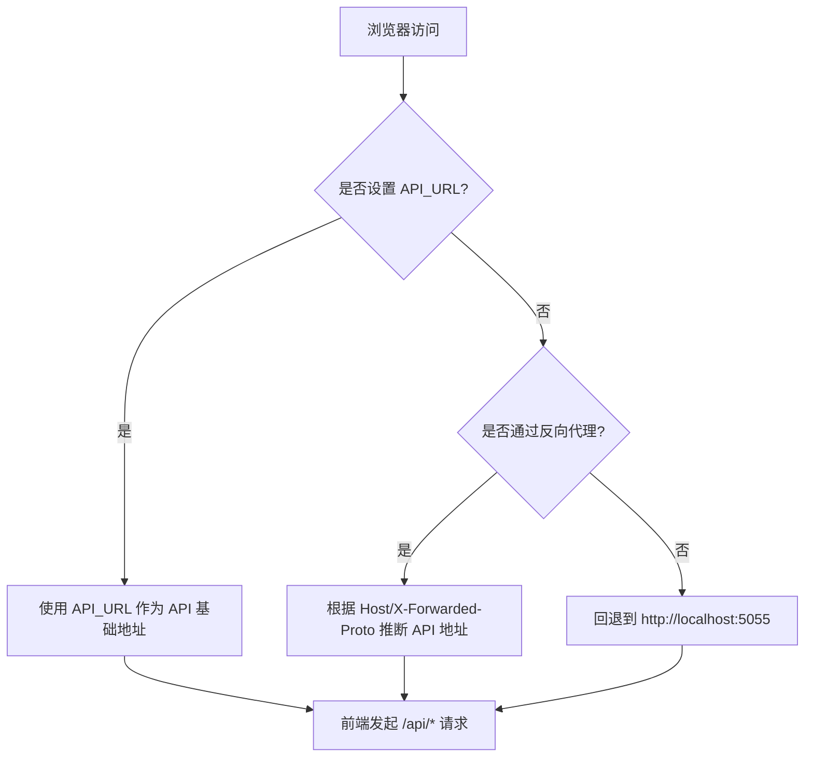
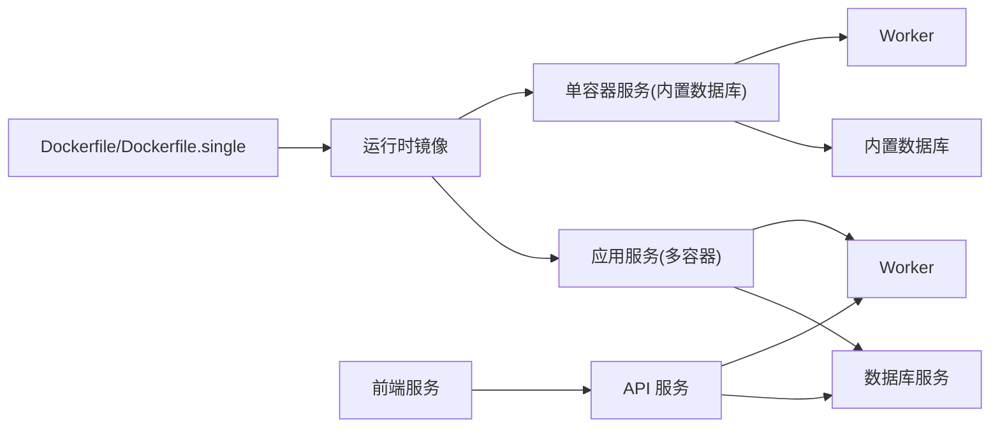

# 部署与运维

<cite>
**本文引用的文件**
- [Dockerfile](file://Dockerfile)
- [Dockerfile.single](file://Dockerfile.single)
- [docker-compose.single.yml](file://docker-compose.single.yml)
- [docker-compose.full.yml](file://docker-compose.full.yml)
- [docker-compose.dev.yml](file://docker-compose.dev.yml)
- [supervisord.conf](file://supervisord.conf)
- [supervisord.single.conf](file://supervisord.single.conf)
- [setup_guide/docker-compose.yml](file://setup_guide/docker-compose.yml)
- [setup_guide/docker.env](file://setup_guide/docker.env)
- [.env.example](file://.env.example)
- [docs/deployment/docker.md](file://docs/deployment/docker.md)
- [docs/deployment/single-container.md](file://docs/deployment/single-container.md)
- [docs/deployment/reverse-proxy.md](file://docs/deployment/reverse-proxy.md)
- [docs/deployment/security.md](file://docs/deployment/security.md)
- [docs/deployment/index.md](file://docs/deployment/index.md)
- [CONFIGURATION.md](file://CONFIGURATION.md)
</cite>

## 目录
1. [简介](#简介)
2. [项目结构](#项目结构)
3. [核心组件](#核心组件)
4. [架构总览](#架构总览)
5. [详细组件分析](#详细组件分析)
6. [依赖关系分析](#依赖关系分析)
7. [性能考虑](#性能考虑)
8. [故障排查指南](#故障排查指南)
9. [结论](#结论)
10. [附录](#附录)

## 简介
本指南面向将 open-notebook 投入生产环境的运维与平台工程团队，围绕 Docker 与 Docker Compose 的容器化部署展开，覆盖单容器与多服务分离两种部署形态，解释关键配置文件（Dockerfile、docker-compose.yml）的结构与可定制参数，提供安全最佳实践（HTTPS、反向代理、敏感信息保护、访问控制），并结合 supervisord.conf 说明进程管理机制，最后给出常见部署场景的拓扑示意与运维建议。

## 项目结构
- 容器镜像构建采用分阶段构建与运行时镜像分离策略，前端在构建阶段打包后复制到运行时镜像，确保最小化运行时体积与更快启动速度。
- 提供两类部署形态：
  - 单容器：内置数据库、API、Worker、前端，适合平台一键部署或资源受限场景。
  - 多服务分离：数据库与应用服务解耦，便于独立扩展与网络隔离。
- 进程管理通过 supervisord 统一调度，保证服务启动顺序与自动重启。

图表来源
- [Dockerfile.single](file://Dockerfile.single#L1-L99)
- [Dockerfile](file://Dockerfile#L1-L96)
- [supervisord.single.conf](file://supervisord.single.conf#L1-L52)
- [supervisord.conf](file://supervisord.conf#L1-L41)
- [docker-compose.single.yml](file://docker-compose.single.yml#L1-L20)
- [docker-compose.full.yml](file://docker-compose.full.yml#L1-L26)
- [docker-compose.dev.yml](file://docker-compose.dev.yml#L1-L27)

章节来源
- [Dockerfile.single](file://Dockerfile.single#L1-L99)
- [Dockerfile](file://Dockerfile#L1-L96)
- [docker-compose.single.yml](file://docker-compose.single.yml#L1-L20)
- [docker-compose.full.yml](file://docker-compose.full.yml#L1-L26)
- [docker-compose.dev.yml](file://docker-compose.dev.yml#L1-L27)
- [supervisord.single.conf](file://supervisord.single.conf#L1-L52)
- [supervisord.conf](file://supervisord.conf#L1-L41)

## 核心组件
- 容器镜像与构建
  - 使用分阶段构建，先安装依赖与前端构建产物，再复制到精简运行时镜像，减少体积与攻击面。
  - 运行时镜像包含运行前端所需的 Node.js、FFmpeg、Supervisor，以及数据库安装工具（单容器模式）。
- 进程管理（Supervisord）
  - 统一管理 API、Worker、Frontend 启动顺序与自动重启；单容器模式额外包含数据库进程。
  - 支持通过环境变量传递 API 访问地址，实现运行时动态配置。
- 编排与部署
  - 单容器编排：一键启动，持久化数据卷，适合平台部署与快速上线。
  - 多服务编排：数据库与应用解耦，支持健康检查与资源限制，适合生产级部署。
- 反向代理与 API URL
  - 前端通过三段式优先级确定 API 地址：运行时配置 > 构建期配置 > 自动检测。
  - 新版简化了反向代理配置，仅需代理前端端口，内部由 Next.js 转发至 API 端口。

章节来源
- [Dockerfile](file://Dockerfile#L1-L96)
- [Dockerfile.single](file://Dockerfile.single#L1-L99)
- [supervisord.conf](file://supervisord.conf#L1-L41)
- [supervisord.single.conf](file://supervisord.single.conf#L1-L52)
- [docker-compose.single.yml](file://docker-compose.single.yml#L1-L20)
- [docker-compose.full.yml](file://docker-compose.full.yml#L1-L26)
- [docs/deployment/reverse-proxy.md](file://docs/deployment/reverse-proxy.md#L1-L115)
- [CONFIGURATION.md](file://CONFIGURATION.md#L1-L109)

## 架构总览
下图展示两种典型生产部署拓扑：单容器与多服务分离。

图表来源
- [docs/deployment/reverse-proxy.md](file://docs/deployment/reverse-proxy.md#L1-L115)
- [docker-compose.full.yml](file://docker-compose.full.yml#L1-L26)
- [docker-compose.single.yml](file://docker-compose.single.yml#L1-L20)

## 详细组件分析

### 单容器部署（推荐用于平台一键部署）
- 特点
  - 内置数据库、API、Worker、前端，统一由 supervisord 管理，启动顺序与延迟已优化。
  - 数据持久化通过挂载卷完成，适合云平台或 PaaS 平台部署。
- 关键配置
  - docker-compose 文件定义端口映射、环境变量文件、数据卷与重启策略。
  - supervisord 配置包含数据库、API、Worker、前端四类进程，均开启自动重启与标准输出日志。
- 典型使用场景
  - PikaPods、Railway、DigitalOcean App Platform 等平台一键部署。
  - 快速测试、个人使用、资源受限环境。

图表来源
- [docs/deployment/reverse-proxy.md](file://docs/deployment/reverse-proxy.md#L1-L115)
- [supervisord.single.conf](file://supervisord.single.conf#L1-L52)
- [docker-compose.single.yml](file://docker-compose.single.yml#L1-L20)

章节来源
- [docs/deployment/single-container.md](file://docs/deployment/single-container.md#L1-L351)
- [docker-compose.single.yml](file://docker-compose.single.yml#L1-L20)
- [supervisord.single.conf](file://supervisord.single.conf#L1-L52)

### 多服务分离部署（推荐用于生产与高可用）
- 特点
  - 数据库与应用服务解耦，便于独立扩缩容、资源控制与网络隔离。
  - 支持健康检查、资源限制与本地回环绑定，降低直接暴露风险。
- 关键配置
  - docker-compose 文件分别定义数据库与应用服务，应用服务依赖数据库。
  - 应用服务通过环境变量连接数据库，支持只绑定本地回环以避免外网直连。
- 典型使用场景
  - 生产环境、Kubernetes 或传统虚拟机集群。
  - 需要独立扩展数据库与应用服务的场景。

图表来源
- [docker-compose.full.yml](file://docker-compose.full.yml#L1-L26)
- [docs/deployment/reverse-proxy.md](file://docs/deployment/reverse-proxy.md#L1-L115)

章节来源
- [docker-compose.full.yml](file://docker-compose.full.yml#L1-L26)
- [docker-compose.dev.yml](file://docker-compose.dev.yml#L1-L27)

### 进程管理（Supervisord）
- 单容器模式
  - 包含数据库、API、Worker、前端四类进程，启动顺序与延迟已优化，自动重启策略启用。
- 多服务模式
  - 仅管理 API、Worker、前端，数据库由独立服务提供。
- 日志与可观测性
  - 所有进程 stdout/stderr 输出到容器标准输出，便于集中收集与分析。

图表来源
- [supervisord.conf](file://supervisord.conf#L1-L41)
- [supervisord.single.conf](file://supervisord.single.conf#L1-L52)

章节来源
- [supervisord.conf](file://supervisord.conf#L1-L41)
- [supervisord.single.conf](file://supervisord.single.conf#L1-L52)

### 反向代理与 API URL 配置
- API_URL 优先级
  - 运行时配置（最高优先级）> 构建期配置 > 自动检测（回退到本地默认值）。
- 新版简化
  - 反向代理只需代理前端端口，内部由 Next.js 将 /api/* 转发到 API 端口。
- 常见场景
  - 本地 Docker：无需显式配置，自动检测工作正常。
  - 自定义域名/子域：设置 API_URL 指向域名，反向代理按简化配置即可。
  - 多容器：INTERNAL_API_URL 指向服务名或内网地址，API_URL 指向外网域名。

图表来源
- [docs/deployment/reverse-proxy.md](file://docs/deployment/reverse-proxy.md#L1-L115)
- [CONFIGURATION.md](file://CONFIGURATION.md#L1-L109)

章节来源
- [docs/deployment/reverse-proxy.md](file://docs/deployment/reverse-proxy.md#L1-L115)
- [CONFIGURATION.md](file://CONFIGURATION.md#L1-L109)

### 安全与访问控制
- 密码保护
  - 通过环境变量启用密码保护，对前端与 API 均生效；注意仅加密传输，不进行密码哈希。
- HTTPS 与反向代理
  - 强制使用 HTTPS，反向代理负责证书与 TLS 终止；确保正确设置转发头与 WebSocket 支持。
- 网络与防火墙
  - 生产环境建议仅暴露反向代理端口，数据库与 API 端口仅限内网访问或绑定本地回环。
- 敏感信息保护
  - 使用环境文件与编排的 env_file 管理密钥；避免将密钥写入镜像或版本库。
- API 认证
  - 对需要鉴权的 API 调用需携带授权头；健康检查与文档端点除外。

章节来源
- [docs/deployment/security.md](file://docs/deployment/security.md#L1-L481)
- [setup_guide/docker.env](file://setup_guide/docker.env#L1-L14)
- [.env.example](file://.env.example#L1-L259)

## 依赖关系分析
- 镜像与运行时
  - 构建阶段安装依赖与前端产物，运行时镜像仅包含运行所需组件，减小体积与攻击面。
- 编排与服务耦合
  - 多服务模式中应用服务依赖数据库服务，具备健康检查条件；单容器模式内置数据库。
- 进程耦合
  - API 依赖数据库与 Worker；前端依赖 API；Worker 依赖数据库与外部模型服务。

图表来源
- [Dockerfile](file://Dockerfile#L1-L96)
- [Dockerfile.single](file://Dockerfile.single#L1-L99)
- [docker-compose.full.yml](file://docker-compose.full.yml#L1-L26)
- [docker-compose.single.yml](file://docker-compose.single.yml#L1-L20)

章节来源
- [Dockerfile](file://Dockerfile#L1-L96)
- [Dockerfile.single](file://Dockerfile.single#L1-L99)
- [docker-compose.full.yml](file://docker-compose.full.yml#L1-L26)
- [docker-compose.single.yml](file://docker-compose.single.yml#L1-L20)

## 性能考虑
- 资源分配
  - 生产环境建议至少 4GB 内存与 4 核 CPU；根据并发与模型选择适当上限。
- 模型与并发
  - 选择合适的 AI 提供商与模型，合理设置超时与批处理大小；在高并发场景下，重试与背压策略有助于稳定性。
- 存储与 I/O
  - 数据卷挂载到高性能磁盘；数据库与应用日志分开存储，避免 I/O 竞争。
- 网络与缓存
  - 反向代理层启用缓存与压缩；CDN 加速静态资源；数据库连接池与查询优化。

[本节为通用建议，不直接分析具体文件]

## 故障排查指南
- 常见问题定位
  - 端口冲突：确认 8502/5055 未被占用；修改映射或释放端口。
  - API 连接失败：检查 API_URL 与反向代理配置；验证 /api/config 是否可达。
  - 数据库连接：确认数据库服务健康、卷权限可写、启动顺序正确。
  - 内存不足：增加容器内存限制或降低并发；优化模型与批处理大小。
- 日志与诊断
  - 查看容器日志与 supervisord 管理的服务状态；使用健康检查端点验证服务可用性。
- 社区与文档
  - 参考官方部署与安全文档，按指引逐步核对配置。

章节来源
- [docs/deployment/docker.md](file://docs/deployment/docker.md#L408-L486)
- [docs/deployment/security.md](file://docs/deployment/security.md#L381-L481)
- [docs/deployment/reverse-proxy.md](file://docs/deployment/reverse-proxy.md#L355-L457)

## 结论
通过单容器与多服务分离两种部署形态，open-notebook 能够满足从快速上线到生产级高可用的多样化需求。配合反向代理与 API_URL 动态配置、完善的进程管理与安全策略，可在不同平台上稳定运行。建议在生产环境中遵循 HTTPS、最小暴露面、资源限制与定期备份等最佳实践，并结合日志与监控体系持续优化。

[本节为总结性内容，不直接分析具体文件]

## 附录

### 关键配置文件与参数说明
- Dockerfile 与 Dockerfile.single
  - 分阶段构建与运行时镜像分离；运行时包含 Node.js、FFmpeg、Supervisor；单容器镜像额外安装数据库。
- docker-compose.single.yml 与 docker-compose.full.yml
  - 单容器：一键启动，持久化数据卷；多服务：数据库与应用解耦，支持健康检查与本地回环绑定。
- supervisord.conf 与 supervisord.single.conf
  - 统一管理 API、Worker、前端；单容器额外包含数据库进程；均启用自动重启与标准输出日志。
- 反向代理与 API URL
  - 三段式优先级决定 API 地址；新版简化仅需代理前端端口，内部由 Next.js 转发。
- 安全与访问控制
  - 密码保护、HTTPS、防火墙、环境变量管理与 API 鉴权。

章节来源
- [Dockerfile](file://Dockerfile#L1-L96)
- [Dockerfile.single](file://Dockerfile.single#L1-L99)
- [docker-compose.single.yml](file://docker-compose.single.yml#L1-L20)
- [docker-compose.full.yml](file://docker-compose.full.yml#L1-L26)
- [supervisord.conf](file://supervisord.conf#L1-L41)
- [supervisord.single.conf](file://supervisord.single.conf#L1-L52)
- [docs/deployment/reverse-proxy.md](file://docs/deployment/reverse-proxy.md#L1-L115)
- [docs/deployment/security.md](file://docs/deployment/security.md#L1-L481)