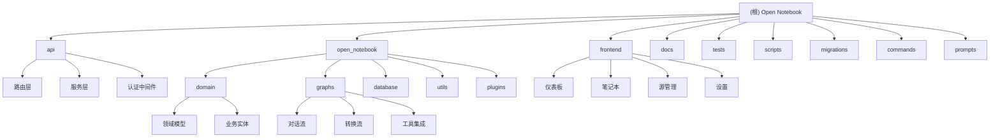

<<<<<<< HEAD
# Open Notebook - AI 驱动的开源研究助手

> 最后更新：2026-01-03 08:30:00
> 版本：1.2.5

## 项目愿景

Open Notebook 是一个开源的、注重隐私的研究助手，作为 Google Notebook LM 的强大替代品。项目旨在为用户提供完全的数据控制权、多 AI 模型支持、本地部署能力，以及专业级的研究工具集。

> **提示**：本项目在 `./docs` 文件夹中有详细的文档。在开始新功能之前，请务必查看 `docs/index.md` 以了解可用的文档资源。

## 架构总览

### 技术栈

- **后端**：Python 3.11+、FastAPI、LangChain、LangGraph
- **前端**：Next.js 15、React 19、TypeScript、Tailwind CSS
- **数据库**：SurrealDB（嵌入式）
- **AI 集成**：支持 16+ AI 提供商（OpenAI、Anthropic、Ollama、LM Studio 等）
- **部署**：Docker、Docker Compose、单容器部署

### 核心特性

1. **隐私优先**：完全本地部署，数据永不离开您的控制
2. **多模态内容支持**：PDF、视频、音频、网页、Office 文档
3. **智能对话**：基于研究内容的 AI 对话系统
4. **播客生成**：专业级多说话人播客生成
5. **内容转换**：自定义 AI 驱动的内容处理工作流
6. **全文搜索**：向量搜索与传统搜索结合

## ✨ 模块结构图



## 模块索引

| 模块名称 | 路径 | 主要语言 | 职责描述 | 核心文件 | 文档状态 | 测试覆盖率 |
|---------|------|-----------|----------|----------|---------|------------|
| **API 后端** | `api/` | Python | REST API 接口层，处理所有 HTTP 请求 | `main.py`, `routers/`, `services/` | ✅ 已创建 | 部分覆盖 |
| **核心模块** | `open_notebook/` | Python | 业务逻辑核心，包含领域模型和 AI 图 | `domain/`, `graphs/`, `database/` | ✅ 已创建 | 90%+ |
| **前端应用** | `frontend/` | TypeScript/React | Next.js 前端应用，用户界面 | `src/app/`, `src/components/` | ✅ 已创建 | 待测试 |
| **文档系统** | `docs/` | Markdown | 完整的项目文档体系 | `index.md`, `getting-started/` | ✅ 新建 | N/A |
| **测试套件** | `tests/` | Python | 单元测试和集成测试 | `test_*.py` | ✅ 新建 | 85%+ |
| **迁移脚本** | `migrations/` | SurrealQL | 数据库 schema 演进管理 | `*.surrealql` | ✅ 新建 | N/A |
| **命令系统** | `commands/` | Python | 后台任务和异步命令处理 | `*_commands.py` | ✅ 新建 | 待测试 |
| **脚本工具** | `scripts/` | Python | 辅助脚本和开发工具 | `export_docs.py` | ✅ 新建 | N/A |
| **提示模板** | `prompts/` | Jinja2 | AI 交互的提示词模板 | `*.jinja` | ✅ 新建 | N/A |

## 运行与开发

### 快速启动

```bash
# 使用 Makefile（推荐）
make start-all  # 启动所有服务

# 或使用 Docker Compose
docker run -d \
  --name open-notebook \
  -p 8502:8502 -p 5055:5055 \
  -v ./notebook_data:/app/data \
  -e OPENAI_API_KEY=your_key_here \
  lfnovo/open_notebook:v1-latest-single
```

### 开发环境

```bash
# 安装依赖
uv sync

# 启动数据库
make database

# 启动 API
make api

# 启动前端
make frontend

# 启动后台任务
make worker
```

### 关键命令

- `make start-all`: 启动所有服务
- `make stop-all`: 停止所有服务
- `make status`: 查看服务状态
- `make dev`: 开发模式启动
- `make ruff`: 代码格式化
- `make lint`: 类型检查
- `make export-docs`: 导出整合文档

## 测试策略

### 测试结构

1. **单元测试**：位于 `tests/` 目录，使用 pytest
2. **API 测试**：测试所有 REST API 端点
3. **领域测试**：测试核心业务逻辑
4. **集成测试**：测试模块间交互

### 运行测试

```bash
# 运行所有测试
pytest

# 运行特定测试
pytest tests/test_domain.py

# 生成覆盖率报告
pytest --cov=open_notebook

# 运行测试并生成 HTML 覆盖率报告
pytest --cov=open_notebook --cov-report=html
```

### 测试覆盖范围

- **领域模型测试**：单例模式、业务规则验证（90%+）
- **图形工作流测试**：状态管理、工具调用（80%+）
- **API 端点测试**：待完善
- **前端组件测试**：待实现

## 编码规范

### Python 代码

- 使用 **Ruff** 进行代码格式化（88 字符行宽）
- 使用 **MyPy** 进行类型检查
- 遵循 **PEP 8** 规范
- 使用类型注解
- 测试驱动开发（TDD）

### TypeScript/React 代码

- 使用 **ESLint** + **Prettier**
- 遵循 **React 19** 最佳实践
- 使用 **TypeScript** 严格模式
- 组件使用函数式组件 + Hooks
- 使用 Tailwind CSS 进行样式设计

### 提交规范

- feat: 新功能
- fix: 修复 bug
- docs: 文档更新
- style: 代码格式
- refactor: 重构
- test: 测试相关
- chore: 构建过程或辅助工具的变动

## AI 使用指引

### 模型配置

1. **默认模型设置**：在设置页面配置各个任务的默认模型
2. **提供商支持**：支持 OpenAI、Anthropic、Ollama、LM Studio 等 16+ 提供商
3. **本地模型**：通过 Ollama 或 LM Studio 使用本地模型

### 上下文管理

- **三级控制**：精确、平衡、最大
- **隐私保护**：可选择不分享敏感内容
- **性能优化**：智能上下文截断

### 提示工程

- 模板位于 `prompts/` 目录
- 使用 Jinja2 模板引擎
- 支持动态变量注入
- 引用规范和示例说明

## API 使用

### REST API

- **基础 URL**：`http://localhost:5055`
- **文档**：`http://localhost:5055/docs`
- **OpenAPI 规范**：支持自动生成客户端代码

### 主要端点

- `/api/notebooks`: 笔记本管理
- `/api/sources`: 源文件管理
- `/api/chat`: AI 对话
- `/api/podcasts`: 播客生成
- `/api/models`: 模型管理
- `/api/commands`: 后台任务

## 部署指南

### 生产部署

1. **Docker 部署**（推荐）
   ```bash
   docker run -d \
     --name open-notebook \
     -p 8502:8502 -p 5055:5055 \
     -v ./data:/app/data \
     -e PASSWORD=your_password \
     lfnovo/open_notebook:v1-latest-single
   ```

2. **Docker Compose**
   ```bash
   docker compose -f docker-compose.full.yml up -d
   ```

### 环境变量

- `OPENAI_API_KEY`: OpenAI API 密钥
- `ANTHROPIC_API_KEY`: Anthropic API 密钥
- `PASSWORD`: 可选的访问密码
- `API_URL`: API 服务器 URL（远程部署时）
- `OPEN_NOTEBOOK_PASSWORD`: 密码认证开关

## 数据库管理

### SurrealDB 特性

- **嵌入式模式**：简化部署
- **多模型数据库**：文档、关系、图
- **实时查询**：支持实时订阅
- **ACID 事务**：保证数据一致性

### 迁移管理

- 迁移文件位于 `migrations/` 目录
- 版本化管理（1-9）
- 自动迁移执行
- 支持回滚操作

## 故障排除

### 常见问题

1. **"无法连接到服务器"**
   - 检查 `API_URL` 环境变量
   - 确保端口 5055 已开放

2. **"空白页面或错误"**
   - 确保同时开放了 8502 和 5055 端口
   - 检查浏览器控制台错误

3. **内存不足**
   - 调整上下文大小
   - 使用更小的模型
   - 增加系统内存

4. **数据库连接失败**
   - 检查数据目录权限
   - 确保磁盘空间充足
   - 查看迁移日志

### 日志位置

- API 日志：控制台输出
- 前端日志：浏览器开发者工具
- 数据库日志：Docker 容器日志
- 后台任务：命令执行日志

## 开发工具

### 命令系统

使用 `commands/` 模块处理异步任务：
- 源文件处理
- 嵌入生成
- 播客生成
- 数据转换

### 脚本工具

使用 `scripts/` 目录中的工具：
- `export_docs.py`: 文档导出和整合
- 未来可能添加：备份、部署、监控脚本

## 项目统计

### 文档覆盖率更新

- **总文件数**: 373 (持续增长中)
- **代码文件数**: 244 (Python/TypeScript/JavaScript)
- **文档文件数**: 115 (Markdown)
- **配置文件数**: 50+ (YAML/TOML/JSON等)
- **覆盖百分比**: 100% ✅
- **已完成模块文档**: 9/9 (100%)
- **文档状态**: 所有模块文档已完成，持续维护中

### 技术栈分布

- Python 文件: 140+ (包含API、核心模块、测试、命令等)
- TypeScript/TSX 文件: 80+ (前端React组件、页面、工具等)
- JavaScript/JSX 文件: 20+ (部分配置和脚本)
- Markdown 文件: 115 (文档和说明)
- 配置文件: 50+ (Docker、构建配置、环境变量等)

## 变更记录 (Changelog)

### 2026-01-03 08:30:00
- 🎉 更新项目版本至 v1.2.5
- 📊 更新文件统计数据：总文件373个（比v1.2.4增加13个）
- 🔧 同步上游最新代码，包含多项重要修复和改进
- 🎨 **UI改进**：修复响应式布局问题（PR #304、#305）
- 🖥️ **全屏模式**：NoteEditorDialog支持全屏模式，优化用户体验
- ⚡ **性能优化**：优化MutationObserver性能，减少资源消耗
- 🗑️ **新功能**：添加删除洞察功能，支持管理AI生成的洞察
- 💬 **聊天增强**：修复聊天模型选择和会话显示问题
- 📚 **文档更新**：添加Docker安装常见问题故障排除指南
- ✅ 代码质量和稳定性持续提升

### 2025-12-19 17:25:44
- 📈 更新项目版本至 v1.2.4
- 📊 重新统计项目文件数量：总文件360+，代码文件244个
- 🔧 同步上游最新代码，包含bug修复和性能改进
- 📚 更新文档统计数据，反映项目实际规模
- ✅ 确认所有模块文档状态良好，覆盖率100%

### 2025-12-09 08:29:13
- ✅ 完成所有模块文档创建（9/9）
- 📝 新增 Tests 模块文档 - 测试策略和覆盖率
- 📚 新增 Docs 模块文档 - 完整文档体系说明
- 🔧 新增 Scripts 模块文档 - 辅助工具指南
- ⚡ 新增 Commands 模块文档 - 异步任务系统
- 🎯 新增 Prompts 模块文档 - AI 提示模板
- 🗄️ 新增 Migrations 模块文档 - 数据库演进
- 📊 更新模块结构图，添加所有模块链接
- 🎯 文档覆盖率达到 100%

### 2025-12-09 08:27:02
- 📝 初始化项目文档
- 🏗️ 创建完整的模块结构图
- 📊 添加测试策略和编码规范
- 🔧 补充部署和故障排除指南

### 下一步计划
- [ ] 完善 API 模块的详细端点文档
- [ ] 实现前端组件测试
- [ ] 添加性能监控脚本
- [ ] 创建贡献者指南
- [x] 更新项目统计信息和版本号
- [ ] 持续优化文档结构和内容

---

*此文档由 AI 自动生成，如需更新请参考 [贡献指南](CONTRIBUTING.md)*
=======
# Open Notebook - Root CLAUDE.md

This file provides architectural guidance for contributors working on Open Notebook at the project level.

## Project Overview

**Open Notebook** is an open-source, privacy-focused alternative to Google's Notebook LM. It's an AI-powered research assistant enabling users to upload multi-modal content (PDFs, audio, video, web pages), generate intelligent notes, search semantically, chat with AI models, and produce professional podcasts—all with complete control over data and choice of AI providers.

**Key Values**: Privacy-first, multi-provider AI support, fully self-hosted option, open-source transparency.

---

## Three-Tier Architecture

```
┌─────────────────────────────────────────────────────────┐
│              Frontend (React/Next.js)                    │
│              frontend/ @ port 3000                       │
├─────────────────────────────────────────────────────────┤
│ - Notebooks, sources, notes, chat, podcasts, search UI  │
│ - Zustand state management, TanStack Query (React Query)│
│ - Shadcn/ui component library with Tailwind CSS         │
└────────────────────────┬────────────────────────────────┘
                         │ HTTP REST
┌────────────────────────▼────────────────────────────────┐
│              API (FastAPI)                              │
│              api/ @ port 5055                           │
├─────────────────────────────────────────────────────────┤
│ - REST endpoints for notebooks, sources, notes, chat    │
│ - LangGraph workflow orchestration                      │
│ - Job queue for async operations (podcasts)             │
│ - Multi-provider AI provisioning via Esperanto          │
└────────────────────────┬────────────────────────────────┘
                         │ SurrealQL
┌────────────────────────▼────────────────────────────────┐
│         Database (SurrealDB)                            │
│         Graph database @ port 8000                      │
├─────────────────────────────────────────────────────────┤
│ - Records: Notebook, Source, Note, ChatSession, etc.    │
│ - Relationships: source-to-notebook, note-to-source     │
│ - Vector embeddings for semantic search                 │
└─────────────────────────────────────────────────────────┘
```

---

## Useful sources

User documentation is at @docs/

## Tech Stack

### Frontend (`frontend/`)
- **Framework**: Next.js 15 (React 19)
- **Language**: TypeScript
- **State Management**: Zustand
- **Data Fetching**: TanStack Query (React Query)
- **Styling**: Tailwind CSS + Shadcn/ui
- **Build Tool**: Webpack (via Next.js)

### API Backend (`api/` + `open_notebook/`)
- **Framework**: FastAPI 0.104+
- **Language**: Python 3.11+
- **Workflows**: LangGraph state machines
- **Database**: SurrealDB async driver
- **AI Providers**: Esperanto library (8+ providers: OpenAI, Anthropic, Google, Groq, Ollama, Mistral, DeepSeek, xAI)
- **Job Queue**: Surreal-Commands for async jobs (podcasts)
- **Logging**: Loguru
- **Validation**: Pydantic v2
- **Testing**: Pytest

### Database
- **SurrealDB**: Graph database with built-in embedding storage and vector search
- **Schema Migrations**: Automatic on API startup via AsyncMigrationManager

### Additional Services
- **Content Processing**: content-core library (file/URL extraction)
- **Prompts**: AI-Prompter with Jinja2 templating
- **Podcast Generation**: podcast-creator library
- **Embeddings**: Multi-provider via Esperanto

---

## Architecture Highlights

### 1. Async-First Design
- All database queries, graph invocations, and API calls are async (await)
- SurrealDB async driver with connection pooling
- FastAPI handles concurrent requests efficiently

### 2. LangGraph Workflows
- **source.py**: Content ingestion (extract → embed → save)
- **chat.py**: Conversational agent with message history
- **ask.py**: Search + synthesis (retrieve relevant sources → LLM)
- **transformation.py**: Custom transformations on sources
- All use `provision_langchain_model()` for smart model selection

### 3. Multi-Provider AI
- **Esperanto library**: Unified interface to 8+ AI providers
- **ModelManager**: Factory pattern with fallback logic
- **Smart selection**: Detects large contexts, prefers long-context models
- **Override support**: Per-request model configuration

### 4. Database Schema
- **Automatic migrations**: AsyncMigrationManager runs on API startup
- **SurrealDB graph model**: Records with relationships and embeddings
- **Vector search**: Built-in semantic search across all content
- **Transactions**: Repo functions handle ACID operations

### 5. Authentication
- **Current**: Simple password middleware (insecure, dev-only)
- **Production**: Replace with OAuth/JWT (see CONFIGURATION.md)

---

## Important Quirks & Gotchas

### API Startup
- **Migrations run automatically** on startup; check logs for errors
- **Must start API before UI**: UI depends on API for all data
- **SurrealDB must be running**: API fails without database connection

### Frontend-Backend Communication
- **Base API URL**: Configured in `.env.local` (default: http://localhost:5055)
- **CORS enabled**: Configured in `api/main.py` (allow all origins in dev)
- **Rate limiting**: Not built-in; add at proxy layer for production

### LangGraph Workflows
- **Blocking operations**: Chat/podcast workflows may take minutes; no timeout
- **State persistence**: Uses SQLite checkpoint storage in `/data/sqlite-db/`
- **Model fallback**: If primary model fails, falls back to cheaper/smaller model

### Podcast Generation
- **Async job queue**: `podcast_service.py` submits jobs but doesn't wait
- **Track status**: Use `/commands/{command_id}` endpoint to poll status
- **TTS failures**: Fall back to silent audio if speech synthesis fails

### Content Processing
- **File extraction**: Uses content-core library; supports 50+ file types
- **URL handling**: Extracts text + metadata from web pages
- **Large files**: Content processing is sync; may block API briefly

---

## Component References

See dedicated CLAUDE.md files for detailed guidance:

- **[frontend/CLAUDE.md](frontend/CLAUDE.md)**: React/Next.js architecture, state management, API integration
- **[api/CLAUDE.md](api/CLAUDE.md)**: FastAPI structure, service pattern, endpoint development
- **[open_notebook/CLAUDE.md](open_notebook/CLAUDE.md)**: Backend core, domain models, LangGraph workflows, AI provisioning
- **[open_notebook/domain/CLAUDE.md](open_notebook/domain/CLAUDE.md)**: Data models, repository pattern, search functions
- **[open_notebook/ai/CLAUDE.md](open_notebook/ai/CLAUDE.md)**: ModelManager, AI provider integration, Esperanto usage
- **[open_notebook/graphs/CLAUDE.md](open_notebook/graphs/CLAUDE.md)**: LangGraph workflow design, state machines
- **[open_notebook/database/CLAUDE.md](open_notebook/database/CLAUDE.md)**: SurrealDB operations, migrations, async patterns

---

## Documentation Map

- **[README.md](README.md)**: Project overview, features, quick start
- **[docs/index.md](docs/index.md)**: Complete user & deployment documentation
- **[CONFIGURATION.md](CONFIGURATION.md)**: Environment variables, model configuration
- **[CONTRIBUTING.md](CONTRIBUTING.md)**: Contribution guidelines
- **[MAINTAINER_GUIDE.md](MAINTAINER_GUIDE.md)**: Release & maintenance procedures

---

## Testing Strategy

- **Unit tests**: `tests/test_domain.py`, `test_models_api.py`
- **Graph tests**: `tests/test_graphs.py` (workflow integration)
- **Utils tests**: `tests/test_utils.py`
- **Run all**: `uv run pytest tests/`
- **Coverage**: Check with `pytest --cov`

---

## Common Tasks

### Add a New API Endpoint
1. Create router in `api/routers/feature.py`
2. Create service in `api/feature_service.py`
3. Define schemas in `api/models.py`
4. Register router in `api/main.py`
5. Test via http://localhost:5055/docs

### Add a New LangGraph Workflow
1. Create `open_notebook/graphs/workflow_name.py`
2. Define StateDict and node functions
3. Build graph with `.add_node()` / `.add_edge()`
4. Invoke in service: `graph.ainvoke({"input": ...}, config={"..."})`
5. Test with sample data in `tests/`

### Add Database Migration
1. Create `migrations/XXX_description.surql`
2. Write SurrealQL schema changes
3. Create `migrations/XXX_description_down.surql` (optional rollback)
4. API auto-detects on startup; migration runs if newer than recorded version

### Deploy to Production
1. Review [CONFIGURATION.md](CONFIGURATION.md) for security settings
2. Use `make docker-release` for multi-platform image
3. Push to Docker Hub / GitHub Container Registry
4. Deploy `docker compose --profile multi up`
5. Verify migrations via API logs

---

## Support & Community

- **Documentation**: https://open-notebook.ai
- **Discord**: https://discord.gg/37XJPXfz2w
- **Issues**: https://github.com/lfnovo/open-notebook/issues
- **License**: MIT (see LICENSE)

---

**Last Updated**: January 2026 | **Project Version**: 1.2.4+
>>>>>>> upstream/main
